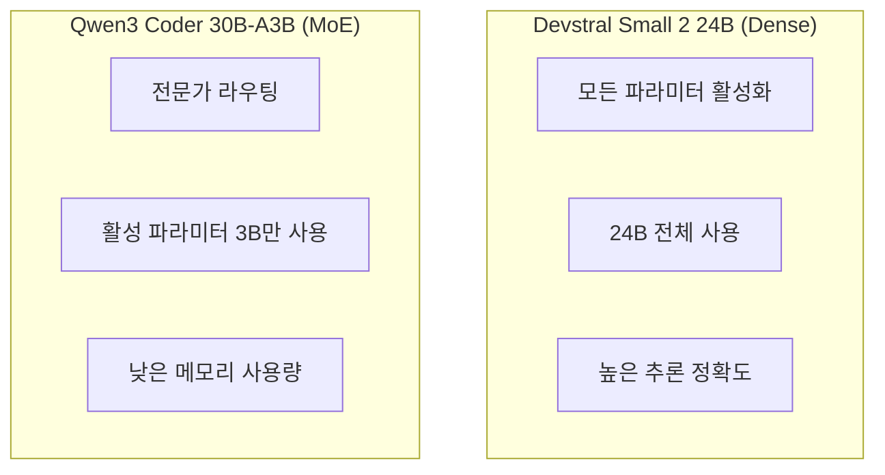
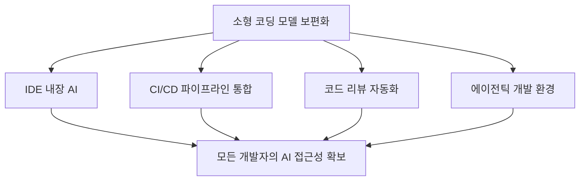

## 개요

2026년 초, 코딩 특화 AI 모델 시장에 주목할 만한 변화가 일어나고 있습니다. Mistral AI의 <strong>Devstral Small 2 24B</strong>와 Alibaba의 <strong>Qwen3 Coder 30B</strong>가 거의 동시에 등장하며, "모든 하드웨어에서 돌아가는 코딩 모델" 시대의 문을 열었습니다.

이 두 모델은 단순히 작은 크기만이 장점이 아닙니다. RTX 4090 한 장, 혹은 32GB RAM Mac에서 실행할 수 있으면서도, 수백 B 파라미터의 대형 모델을 능가하는 코딩 성능을 보여줍니다. 이번 글에서는 두 모델의 아키텍처, 벤치마크, 그리고 실전 활용 방법을 비교 분석합니다.

## Devstral Small 2 24B — Mistral의 에이전틱 코딩 모델

### 핵심 특징

Devstral은 Mistral AI와 [All Hands AI](https://www.all-hands.dev/)의 협업으로 탄생한 <strong>소프트웨어 엔지니어링 특화 모델</strong>입니다.

- <strong>파라미터</strong>: 24B (Dense 모델)
- <strong>라이선스</strong>: Apache 2.0 (완전 오픈소스)
- <strong>SWE-Bench Verified</strong>: 46.8% (오픈소스 SOTA)
- <strong>최소 하드웨어</strong>: RTX 4090 또는 Mac 32GB RAM
- <strong>특화 영역</strong>: 실제 GitHub 이슈 해결, 에이전틱 코딩

### 왜 주목받는가

Devstral의 가장 놀라운 점은 <strong>크기 대비 성능</strong>입니다. SWE-Bench Verified에서 DeepSeek-V3-0324(671B)과 Qwen3 232B-A22B보다 높은 점수를 기록했습니다. 모델 크기가 20배 이상 작으면서도 실제 코드 문제 해결 능력은 더 뛰어난 셈입니다.

```bash
# Ollama로 Devstral 실행
ollama pull devstral
ollama run devstral

# LM Studio에서도 바로 사용 가능
# MLX 포맷으로 Apple Silicon 최적화 지원
```

### 에이전틱 코딩이란

Devstral은 단순 코드 생성이 아닌 <strong>에이전틱 코딩</strong>에 초점을 맞추고 있습니다. 에이전틱 코딩이란 모델이 코드베이스 전체를 이해하고, 컴포넌트 간 관계를 파악하며, 복잡한 버그를 자율적으로 해결하는 것을 의미합니다.


OpenHands나 SWE-Agent 같은 코드 에이전트 프레임워크 위에서 작동하며, 사람의 개입 없이 GitHub 이슈를 자동으로 해결합니다.

## Qwen3 Coder — Alibaba의 에이전틱 코딩 모델

### 핵심 특징

Qwen3 Coder는 Alibaba가 출시한 코딩 특화 모델 시리즈로, 플래그십 모델인 480B-A35B와 함께 다양한 크기의 변형이 제공됩니다.

- <strong>플래그십</strong>: Qwen3-Coder-480B-A35B (MoE, 활성 파라미터 35B)
- <strong>소형 변형</strong>: Qwen3-Coder-30B-A3B (MoE, 활성 파라미터 3B)
- <strong>컨텍스트</strong>: 256K 토큰 (네이티브), 1M 토큰 (YaRN 확장)
- <strong>라이선스</strong>: 오픈소스
- <strong>특화 영역</strong>: 에이전틱 코딩, 브라우저 사용, 도구 호출

### 훈련 기법의 혁신

Qwen3 Coder의 훈련 과정에서 주목할 점은 <strong>강화학습(RL)의 대규모 적용</strong>입니다.

1. <strong>Code RL</strong>: 경쟁 프로그래밍이 아닌 실제 코딩 작업에 대한 대규모 강화학습
2. <strong>Long-Horizon RL (Agent RL)</strong>: 멀티턴 환경에서 도구를 사용하며 문제를 해결하는 장기 강화학습
3. <strong>환경 스케일링</strong>: Alibaba Cloud 인프라로 20,000개 독립 환경을 병렬 운영

```python
# Qwen3 Coder API 사용 예시
from openai import OpenAI

client = OpenAI(
    api_key="your_api_key",
    base_url="https://dashscope-intl.aliyuncs.com/compatible-mode/v1",
)

# qwen3-coder-plus 모델 호출
completion = client.chat.completions.create(
    model="qwen3-coder-plus",
    messages=[
        {"role": "system", "content": "You are a helpful coding assistant."},
        {"role": "user", "content": "이 함수의 버그를 찾아주세요."}
    ],
)
```

### Qwen Code CLI

Qwen3 Coder와 함께 <strong>Qwen Code</strong>라는 CLI 도구도 오픈소스로 공개되었습니다. Gemini CLI에서 포크하여 Qwen 모델에 최적화된 프롬프트와 함수 호출 프로토콜을 적용했습니다.

```bash
# Qwen Code 설치
npm i -g @qwen-code/qwen-code

# 환경 설정
export OPENAI_API_KEY="your_api_key"
export OPENAI_BASE_URL="https://dashscope-intl.aliyuncs.com/compatible-mode/v1"
export OPENAI_MODEL="qwen3-coder-plus"

# 바로 사용
qwen
```

Claude Code와의 통합도 지원하여, 기존 개발 워크플로우에 자연스럽게 통합할 수 있습니다.

## 두 모델 비교 분석

### 스펙 비교

| 항목 | Devstral Small 2 24B | Qwen3 Coder 30B-A3B |
|------|---------------------|---------------------|
| <strong>파라미터</strong> | 24B (Dense) | 30B (MoE, 활성 3B) |
| <strong>아키텍처</strong> | Dense Transformer | Mixture of Experts |
| <strong>라이선스</strong> | Apache 2.0 | 오픈소스 |
| <strong>SWE-Bench</strong> | 46.8% (검증됨) | SOTA급 (플래그십 기준) |
| <strong>컨텍스트</strong> | 표준 | 256K (네이티브) |
| <strong>최소 VRAM</strong> | ~16GB (Q4) | ~4GB (활성 3B) |
| <strong>실행 환경</strong> | RTX 4090, Mac 32GB | Raspberry Pi급 가능 |
| <strong>에이전트 프레임워크</strong> | OpenHands, SWE-Agent | Qwen Code, Claude Code |

### 아키텍처 차이

두 모델의 가장 큰 차이는 <strong>아키텍처</strong>입니다.



- <strong>Devstral</strong>: Dense 모델로 모든 24B 파라미터가 추론에 참여합니다. 더 높은 정확도를 보이지만, 더 많은 연산 리소스가 필요합니다.
- <strong>Qwen3 Coder 30B-A3B</strong>: MoE(Mixture of Experts) 아키텍처로, 30B 파라미터 중 매 추론 시 3B만 활성화됩니다. 메모리 효율이 극도로 높아 Raspberry Pi 같은 소형 디바이스에서도 실행 가능합니다.

### 사용 사례별 추천

| 사용 사례 | 추천 모델 | 이유 |
|-----------|-----------|------|
| <strong>로컬 개발 (Mac/PC)</strong> | Devstral | 높은 정확도, 충분한 하드웨어 |
| <strong>엣지 디바이스</strong> | Qwen3 Coder | MoE로 초저사양 실행 |
| <strong>GitHub 이슈 자동화</strong> | Devstral | SWE-Bench 검증된 성능 |
| <strong>CLI 통합 개발</strong> | Qwen3 Coder | Qwen Code CLI 지원 |
| <strong>프라이버시 중시 기업</strong> | Devstral | Apache 2.0, 로컬 실행 |
| <strong>장문 컨텍스트 작업</strong> | Qwen3 Coder | 256K 네이티브 지원 |

## 로컬 AI 코딩의 미래

### 왜 소형 코딩 모델이 중요한가

이 두 모델의 등장은 단순한 신제품 출시 이상의 의미를 가집니다.

1. <strong>개인정보 보호</strong>: 코드를 외부 서버에 보내지 않고 로컬에서 AI 지원을 받을 수 있습니다
2. <strong>비용 절감</strong>: API 비용 없이 자체 하드웨어에서 무제한 사용 가능합니다
3. <strong>오프라인 작업</strong>: 인터넷 연결 없이도 AI 코딩 어시스턴트를 사용할 수 있습니다
4. <strong>커스터마이징</strong>: 자사 코드베이스에 파인튜닝하여 맞춤형 모델 구축이 가능합니다

### 양자화와 최적화

커뮤니티에서는 이미 다양한 양자화 버전을 제공하고 있습니다. 특히 코딩 모델에 특화된 캘리브레이션 데이터셋을 사용하여, 도구 호출과 코드 생성에 최적화된 양자화가 이루어지고 있습니다.

```bash
# Q4 양자화로 VRAM 절약
# Devstral: ~16GB → ~8GB
# Qwen3 Coder 30B-A3B: 활성 3B이므로 원래도 ~4GB

# Ollama에서 양자화 모델 사용
ollama pull devstral:q4_k_m
```

### 개발자 생태계 변화

소형 코딩 모델이 보편화되면, 개발 도구 생태계에도 큰 변화가 예상됩니다.



## 결론

Devstral Small 2 24B와 Qwen3 Coder 30B의 동시 등장은 <strong>코딩 AI의 민주화</strong>를 상징합니다. 더 이상 대형 GPU 클러스터나 비싼 API 구독 없이도, 일반 개발자의 노트북이나 심지어 Raspberry Pi에서도 프로덕션급 코딩 AI를 실행할 수 있게 되었습니다.

특히 주목할 점은 이 두 모델이 서로 다른 아키텍처(Dense vs MoE)를 채택하면서도, "로컬에서 실행 가능한 에이전틱 코딩"이라는 같은 목표를 향하고 있다는 것입니다. 이는 소형 코딩 모델의 다양한 접근법이 경쟁하면서 빠르게 발전할 것임을 시사합니다.

로컬 AI 코딩 시대는 이미 시작되었습니다.

## 참고 자료

- [Mistral AI - Devstral 공식 발표](https://mistral.ai/news/devstral)
- [Qwen3-Coder 공식 블로그](https://qwenlm.github.io/blog/qwen3-coder/)
- [r/LocalLLaMA 커뮤니티 토론](https://www.reddit.com/r/LocalLLaMA/comments/1r85o89/devstral_small_2_24b_qwen3_coder_30b_coders_for/)
- [OpenHands - 로컬 LLM 사용 가이드](https://docs.all-hands.dev/modules/usage/llms/local-llms)
