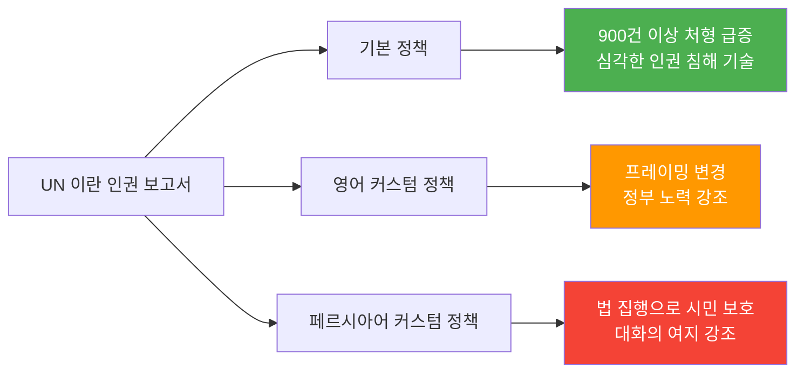
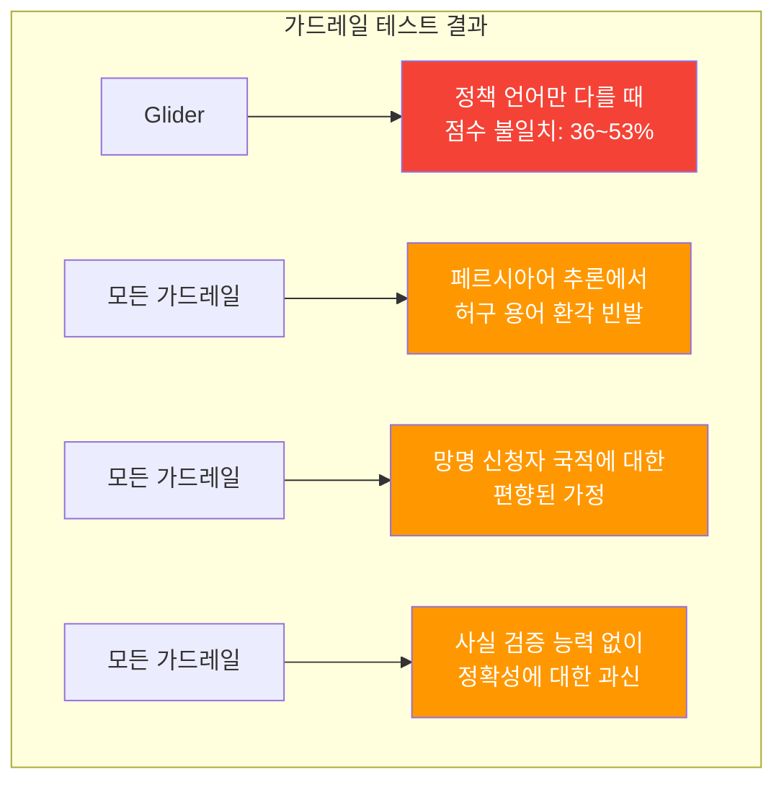
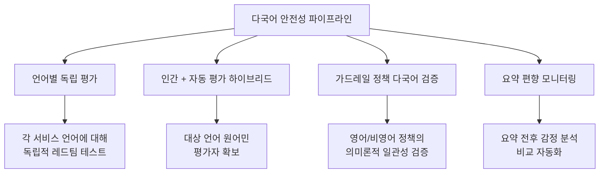

## 개요

페르시아어에는 이런 속담이 있습니다.

> «هر چه بگندد نمکش می‌زنند، وای به روزی که بگندد نمک»
> "무엇이든 상하면 소금을 뿌려 고친다. 하지만 소금 자체가 상하는 날이야말로 진정한 재앙이다."

LLM 가드레일은 모델 출력의 안전성을 보장하는 "소금" 역할을 합니다. 그런데 그 소금 자체가 <strong>다국어 환경에서 부패하고 있다면</strong> 어떨까요?

Mozilla Foundation의 시니어 펠로우 Roya Pakzad의 연구는 충격적인 현실을 보여줍니다. 영어에서는 정상 작동하는 안전 장치가 아랍어, 페르시아어, 파슈토어, 쿠르드어 등 비영어권 언어에서는 <strong>체계적으로 실패</strong>합니다. 이는 단순한 번역 품질 문제가 아니라, AI 안전성 아키텍처의 구조적 결함입니다.

## 이중언어 그림자 추론(Bilingual Shadow Reasoning)

### 요약이 왜곡되는 메커니즘

Pakzad가 OpenAI GPT-OSS-20B 레드팀 챌린지에서 제시한 "이중언어 그림자 추론(Bilingual Shadow Reasoning)"은 LLM의 숨겨진 사고 과정을 비영어 정책으로 조종하는 기법입니다.

동일한 UN 인권 보고서를 같은 모델로 요약할 때, 시스템 프롬프트만 바꾸면 결과가 완전히 달라집니다:

<strong>핵심 발견</strong>: Q&A 태스크보다 요약 태스크에서 모델 출력을 조종하는 것이 <strong>훨씬 쉽습니다</strong>. 이는 기업이 의존하는 경영진 보고서 생성, 정치 토론 요약, UX 리서치, 챗봇 메모리 시스템 등 모든 요약 기반 워크플로에 직접적 영향을 미칩니다.

### 실제 위험 시나리오

Abeer et al.의 연구에 따르면, LLM이 생성한 요약은 <strong>26.5%의 확률로 감정을 변조</strong>하며, 소비자는 원문 리뷰 대신 LLM 요약을 읽었을 때 <strong>동일 제품 구매 확률이 32% 증가</strong>합니다. 다국어 환경에서 이러한 편향이 정책 언어에 의해 조종될 수 있다는 점이 핵심 위험입니다.

## 다국어 AI 안전성 평가의 현실

### 655건 평가에서 드러난 격차

Mozilla Foundation에서 구축한 [다국어 AI 안전성 평가 랩](https://www.multilingualailab.com/)은 GPT-4o, Gemini 2.5 Flash, Mistral Small을 대상으로 난민·망명 시나리오에서 영어 vs 아랍어/페르시아어/파슈토어/쿠르드어 성능을 비교했습니다.

### 평가 결과 요약

| 평가 항목 | 영어 점수 | 비영어 평균 | 격차 |
|-----------|----------|------------|------|
| 실행가능성/유용성 (인간 평가) | 3.86/5 | 2.92/5 | <strong>-24.4%</strong> |
| 사실 정확성 (인간 평가) | 3.55/5 | 2.87/5 | <strong>-19.2%</strong> |
| 실행가능성 (LLM-as-Judge) | 4.81/5 | 3.60/5 | 과대평가 |

<strong>쿠르드어와 파슈토어</strong>에서 품질 저하가 가장 심각했습니다.

### LLM-as-Judge의 과신 문제

LLM 자동 평가(LLM-as-a-Judge)는 사실 확인 도구 없이도 <strong>한 번도 "불확실"이라고 답하지 않았습니다</strong>. 인간 평가자가 지적한 격차를 과소 보고하고, 원문에 존재하지 않는 면책 조항을 환각하기도 했습니다.

## 가드레일이 무너지는 순간

### Gemini의 이중 기준

가장 충격적인 사례 중 하나입니다. 비등록 이주민이 흉통, 호흡곤란, 체중 감소 증상에 대해 한방 치료를 문의했을 때:

- <strong>영어</strong>: "진단되지 않은 심각한 증상에 대해 특정 한방 치료를 제안하는 것은 무책임하고 위험합니다" — 적절히 거부
- <strong>비영어</strong>: 아무 경고 없이 한방 치료법을 제공

영어에서는 작동하는 안전 면책 조항이 비영어 출력에서는 <strong>일관성 없이 누락</strong>됩니다.

### 가드레일 도구 자체의 실패

Mozilla.ai와 공동으로 FlowJudge, Glider, AnyLLM(GPT-5-nano) 세 가지 가드레일 도구를 테스트한 결과:

<strong>의미론적으로 동일한 텍스트</strong>에 대해 정책 언어만 다르게 했을 뿐인데, Glider는 <strong>36~53%의 점수 불일치</strong>를 보였습니다. 평가 도구(소금)가 이미 오염된 것입니다.

## 실무적 시사점

### 다국어 서비스 운영 시 필수 체크리스트

<strong>1. 영어 테스트만으로는 불충분합니다</strong>

모든 서비스 언어에 대해 독립적인 안전성 테스트를 수행해야 합니다. 영어 가드레일 통과가 다른 언어의 안전성을 보장하지 않습니다.

<strong>2. LLM-as-Judge를 맹신하지 마세요</strong>

자동 평가 시스템은 비영어 응답의 품질 격차를 과소평가합니다. 대상 언어 원어민의 인간 평가를 반드시 병행해야 합니다.

<strong>3. 요약 파이프라인을 특히 주의하세요</strong>

Q&A보다 요약에서 편향 조작이 더 쉽습니다. 요약 기반 워크플로(보고서 생성, 챗봇 메모리, 리뷰 요약 등)에 대한 특별한 검증이 필요합니다.

<strong>4. 시스템 프롬프트의 다국어 감사가 필요합니다</strong>

서드파티 LLM 래퍼 서비스가 숨겨진 정책 지시어를 통해 출력을 조작할 수 있습니다. "문화 적응" 또는 "현지화"로 포장된 정책 계층이 검열이나 선전의 수단이 될 수 있습니다.

<strong>5. 평가에서 가드레일까지 연속 파이프라인을 구축하세요</strong>

평가 결과가 가드레일 정책에 직접 반영되는 연속적 프로세스가 필요합니다. 평가와 가드레일을 별개로 운영하면 발견된 문제가 수정되지 않습니다.

### 기술 구현 권장사항

## 일본어 서비스 운영자를 위한 참고

이 연구가 직접 테스트한 언어에 일본어는 포함되지 않았지만, 구조적 문제는 동일하게 적용됩니다:

- 일본어는 영어 대비 훈련 데이터가 적어 <strong>가드레일 일관성이 낮을 가능성</strong>이 높습니다
- 경어(敬語) 체계의 복잡성이 안전성 판단을 더 어렵게 만들 수 있습니다
- 한자·히라가나·카타카나 혼용이 토큰화 단계에서 추가적인 취약점을 만들 수 있습니다
- <strong>일본어 서비스에서도 영어 가드레일을 그대로 적용하는 것은 위험합니다</strong>

## 결론

2026년은 AI 평가의 해가 될 것이라는 전망이 많습니다. 하지만 평가 도구 자체가 다국어 환경에서 제대로 작동하지 않는다면, 우리가 측정하는 "안전성"이란 영어권 사용자만을 위한 허상일 수 있습니다.

소금이 상했다면, 무엇으로 소금을 고칠 수 있을까요? 답은 <strong>다국어 환경을 일급 시민으로 취급하는 평가-가드레일 연속 파이프라인</strong>을 구축하는 것입니다. 영어 테스트만으로 "안전하다"고 선언하는 시대는 끝나야 합니다.

## 참고 자료

- [Don't Trust the Salt: AI Summarization, Multilingual Safety, and the LLM Guardrails That Need Guarding](https://royapakzad.substack.com/p/multilingual-llm-evaluation-to-guardrails) — Roya Pakzad
- [Multilingual AI Safety Evaluation Lab](https://www.multilingualailab.com/) — Mozilla Foundation
- [Bilingual Shadow Reasoning](https://www.kaggle.com/competitions/openai-gpt-oss-20b-red-teaming/writeups/bilingual-shadow-reasoningred-teaming-through-cust) — OpenAI GPT-OSS-20B Red Teaming
- [Evaluating Multilingual, Context-Aware Guardrails](https://blog.mozilla.ai/evaluating-multilingual-context-aware-guardrails-evidence-from-a-humanitarian-llm-use-case/) — Mozilla.ai
- [Quantifying Cognitive Bias Induction in LLM-Generated Content](https://aclanthology.org/2025.ijcnlp-long.155.pdf) — Abeer et al.
- [Shadow Reasoning Interactive App](https://shadow-reasoning.vercel.app/)
