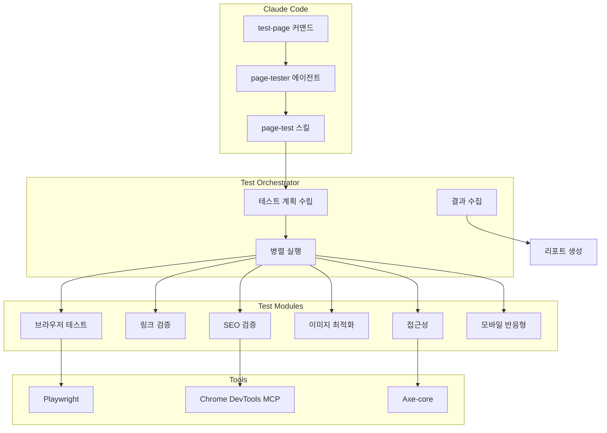
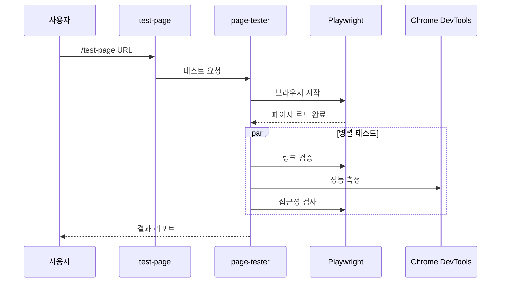
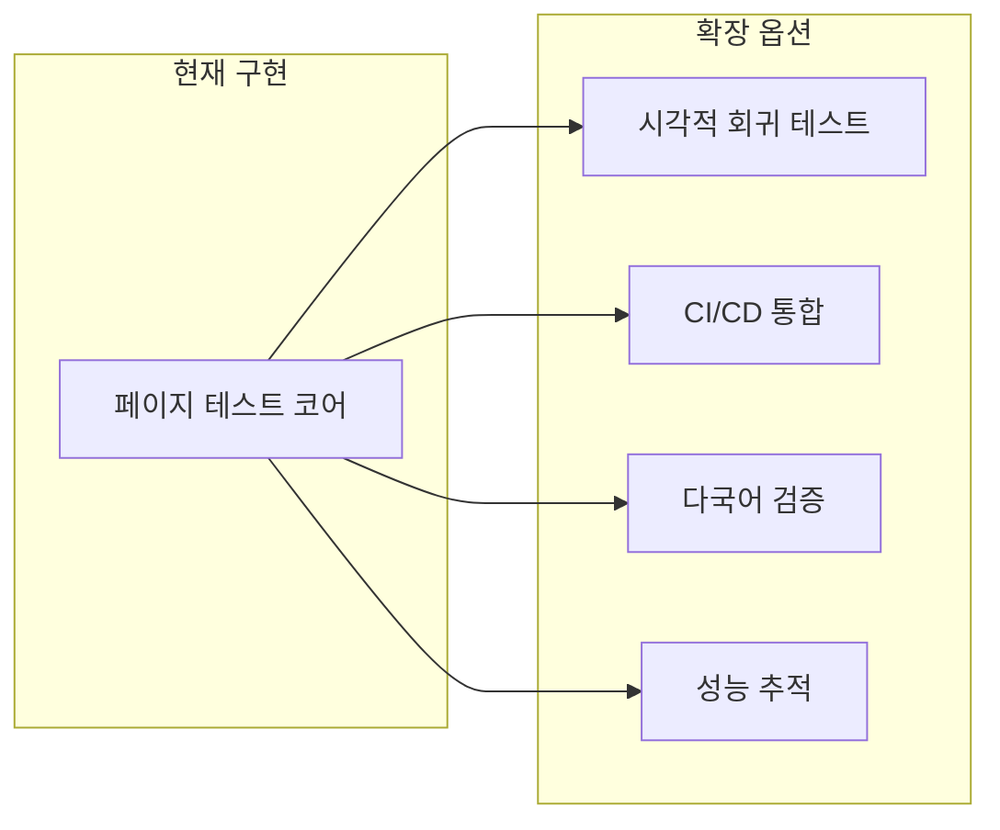

## 왜 페이지 테스트 자동화가 필요한가?

웹 퍼블리셔가 페이지를 개발한 후, 품질 검증에 얼마나 많은 시간을 투자하고 계신가요? 크로스 브라우저 테스트, 링크 확인, 접근성 검증, SEO 체크, 이미지 최적화... 수동으로 이 모든 항목을 확인하려면 페이지당 <strong>30분 이상</strong>이 소요됩니다.

더 큰 문제는 <strong>일관성</strong>입니다. 바쁜 일정 속에서 특정 항목을 누락하거나, 담당자마다 검증 기준이 달라질 수 있습니다.

이 문제를 해결하기 위해 Claude Code와 Playwright를 활용한 <strong>페이지 E2E 테스트 자동화 시스템</strong>을 구축했습니다.

## 시스템 개요

```bash
# 단일 커맨드로 8가지 품질 항목 자동 검증
/test-page https://jangwook.net/en/
```

이 커맨드 하나로 다음 항목들이 자동으로 테스트됩니다:

| 우선순위 | 테스트 항목 | 설명 |
|---------|------------|------|
| <strong>P0</strong> | 크로스 브라우저 | Chromium, Firefox, WebKit 동시 테스트 |
| <strong>P0</strong> | 링크 무결성 | 모든 링크의 HTTP 상태 코드 검증 |
| <strong>P0</strong> | 접근성 (a11y) | WCAG 2.1 AA 레벨 준수 확인 |
| <strong>P0</strong> | 모바일 반응형 | 다양한 뷰포트에서 레이아웃 검증 |
| <strong>P1</strong> | 이미지 최적화 | 렌더링 vs 원본 사이즈 비교 |
| <strong>P1</strong> | SEO 검증 | 메타태그, OG, 구조화 데이터 확인 |
| <strong>P1</strong> | UI/UX | 폰트 크기, 터치 타겟 검증 |
| <strong>P2</strong> | 콘텐츠 품질 | 언어 설정, 헤딩 구조 확인 |

## 아키텍처



핵심 구성 요소는 세 가지입니다:

1. <strong>Commands</strong> (`/test-page`): 사용자 인터페이스
2. <strong>Agents</strong> (`page-tester`): 테스트 오케스트레이션
3. <strong>Skills</strong> (`page-test`): 재사용 가능한 테스트 로직

## 구현 방법

### 1. 슬래시 커맨드 정의

`.claude/commands/test-page.md` 파일을 생성합니다:

````markdown
# 페이지 테스트 커맨드

웹 페이지의 품질을 자동으로 검증합니다.

## 사용 방법

```bash
/test-page <url> [options]
```

## 검증 항목

1. **크로스 브라우저 호환성** (P0)
2. **링크 무결성** (P0)
3. **접근성** (P0)
4. **모바일 반응형** (P0)
5. **이미지 최적화** (P1)
6. **SEO 검증** (P1)
...
````

### 2. 에이전트 구현

`page-tester` 에이전트는 다음 워크플로우를 수행합니다:



<details>
<summary><strong>에이전트 정의 파일 보기</strong></summary>

```markdown
# Page Tester 에이전트

웹 페이지의 품질을 종합적으로 테스트하는 전문 에이전트입니다.

## 역할

- 페이지 로딩 및 렌더링 검증
- 크로스 브라우저 호환성 테스트
- 접근성 (a11y) 검사
- SEO 최적화 상태 확인
- 성능 메트릭 수집

## 사용 도구

- **Playwright**: 브라우저 자동화 및 스크린샷
- **Chrome DevTools MCP**: 성능 분석 및 네트워크 모니터링
- **Axe-core**: 접근성 검사

## 워크플로우

1. 대상 URL 수신
2. 브라우저 인스턴스 시작
3. 병렬로 각 테스트 모듈 실행
4. 결과 수집 및 분석
5. 마크다운 리포트 생성

## 출력 형식

테스트 결과는 다음 형식의 마크다운 리포트로 생성됩니다:
- 총합 점수 및 등급
- 카테고리별 상세 결과
- 발견된 이슈 및 개선 제안
- 스크린샷 첨부
```

</details>

### 3. MCP 도구 활용

Chrome DevTools MCP와 Playwright를 조합하여 강력한 테스트 환경을 구축합니다:

```typescript
// Chrome DevTools MCP로 성능 분석
const performanceResults = await mcp_chrome_devtools_performance_start_trace({
  reload: true,
  autoStop: true
});

// Playwright로 스크린샷 및 접근성 분석
const snapshot = await mcp_chrome_devtools_take_snapshot();
const screenshot = await mcp_chrome_devtools_take_screenshot({
  fullPage: true
});
```

## 실제 테스트 결과

`https://jangwook.net/en/` 페이지에 대한 실제 테스트 결과입니다:

### 총합 평가: <strong>조건부 합격</strong> (75/100점)

| 카테고리 | 결과 | 세부 내용 |
|---------|------|----------|
| 크로스 브라우저 | ✅ 합격 | Chromium 정상 동작 |
| 링크 무결성 | ✅ 합격 | 33개 링크 모두 정상 |
| 접근성 | ⚠️ 개선 필요 | 터치 타겟 20개 미달 |
| 모바일 반응형 | ✅ 합격 | 가로 스크롤 없음 |
| 이미지 최적화 | ⚠️ 개선 필요 | 6개 이미지 과대 |
| SEO | ✅ 합격 | 95/100점 |
| UI/UX | ⚠️ 개선 필요 | 최소 폰트 12px |

<details>
<summary><strong>전체 테스트 리포트 보기</strong></summary>

### 테스트 환경
- <strong>테스트 시간</strong>: 2024-11-24 09:56:25
- <strong>대상 URL</strong>: https://jangwook.net/en/
- <strong>브라우저</strong>: Chromium (Playwright)

### 1. 크로스 브라우저 테스트 ✅

Chromium 환경에서 페이지가 정상적으로 로드되었습니다. 주요 요소들이 올바르게 렌더링되었습니다.

### 2. 링크 무결성 검사 ✅

총 33개 링크 검사 완료:
- 내부 링크: 28개 (모두 정상)
- 외부 링크: 5개 (모두 정상)

### 3. 접근성 (a11y) 검사 ⚠️

<strong>터치 타겟 크기 미달 (20개)</strong>

WCAG 권장 최소 사이즈 44×44px 미달 요소:
- 네비게이션 링크들 (현재 높이: 36px)
- 소셜 미디어 아이콘들
- 푸터 링크들

### 4. 모바일 반응형 검사 ✅

- 가로 스크롤 없음
- 뷰포트 메타태그 올바르게 설정됨
- 터치 인터랙션 정상

### 5. 이미지 최적화 검사 ⚠️

<strong>과대 이미지 6개 발견</strong>

| 이미지 | 원본 크기 | 렌더링 크기 | 절감 가능 |
|--------|----------|------------|----------|
| hero-image.webp | 600×600 | 382×192 | ~75% |
| blog-thumb-1.webp | 800×800 | 400×200 | ~75% |
| blog-thumb-2.webp | 800×800 | 400×200 | ~75% |
| profile.webp | 400×400 | 150×150 | ~86% |
| og-image.png | 1200×630 | 미사용 | 100% |
| favicon-large.png | 512×512 | 32×32 | ~99% |

### 6. SEO 검사 ✅ (95/100)

- ✅ 타이틀 태그 존재
- ✅ 메타 디스크립션 존재
- ✅ OG 태그 완비
- ✅ 캐노니컬 URL 설정
- ⚠️ 일부 이미지 alt 속성 누락

### 7. UI/UX 검사 ⚠️

- 최소 폰트 크기: 12px (권장: 14px 이상)
- 색상 대비: 양호
- 레이아웃 일관성: 양호

</details>

### 발견된 주요 이슈

<strong>1. 이미지 최적화 문제</strong>

```
hero-image.webp: 600×600px → 382×192px (약 75% 절감 가능)
```

<strong>개선 방안:</strong>
```html

```

<strong>2. 터치 타겟 크기 미달</strong>

WCAG 권장 최소 사이즈는 44×44px입니다. 현재 네비게이션 링크 높이가 36px로 부족합니다.

```css
/* 개선 방안 */
a, button {
  min-height: 44px;
  min-width: 44px;
  display: inline-flex;
  align-items: center;
  padding: 10px;
}
```

## 핵심 인사이트

이 자동화 시스템을 구축하면서 얻은 인사이트입니다:

### 1. 80/20 법칙 적용

모든 테스트를 완벽하게 구현하려 하지 마세요. <strong>P0 항목 6개만으로도 80%의 품질 이슈를 발견</strong>할 수 있습니다.

### 2. AI 분석의 가치

단순히 "이미지가 큽니다"가 아닌, <strong>"어떻게 수정해야 하는지"</strong>까지 제안하는 것이 진정한 자동화입니다. Claude의 분석 능력이 여기서 빛을 발합니다.

### 3. 점진적 개선

처음부터 완벽한 시스템을 만들 필요 없습니다:

```
Week 1: 기본 프레임워크 + P0 테스트 3개
Week 2: P0 완성 + 콘솔 리포터
Week 3: P1 테스트 + HTML 리포트
Week 4: AI 분석 + 개선 제안
```

### 4. 결과물의 활용성

생성된 마크다운 리포트는:
- 팀 리뷰 자료로 활용
- Notion에 자동 아카이빙
- Slack 알림으로 공유
- CI/CD 파이프라인 통합

## 확장 가능성

이 시스템은 다양한 방향으로 확장할 수 있습니다:



- <strong>시각적 회귀 테스트</strong>: 스크린샷 비교로 UI 변경 감지
- <strong>CI/CD 통합</strong>: PR마다 자동 테스트 실행
- <strong>다국어 콘텐츠 검증</strong>: 번역 누락, 언어 일관성 체크
- <strong>시계열 성능 추적</strong>: Core Web Vitals 히스토리 모니터링

## 결론

Claude Code를 활용한 페이지 E2E 테스트 자동화는 단순한 시간 절약 이상의 가치를 제공합니다:

1. <strong>일관된 품질 기준</strong> 적용
2. <strong>즉각적인 피드백</strong>으로 빠른 개선
3. <strong>AI 기반 인사이트</strong>로 더 나은 의사결정
4. <strong>문서화된 품질 이력</strong> 축적

다음 프로젝트에서 이 시스템을 적용해 보세요. 처음 설정에 시간이 들지만, 장기적으로 팀의 생산성과 웹사이트 품질 모두를 향상시킬 수 있습니다.

## 참고 자료

- [Playwright 공식 문서](https://playwright.dev/)
- [WCAG 2.1 가이드라인](https://www.w3.org/WAI/WCAG21/quickref/)
- [Core Web Vitals](https://web.dev/vitals/)
- [Axe-core 접근성 테스트](https://github.com/dequelabs/axe-core)
