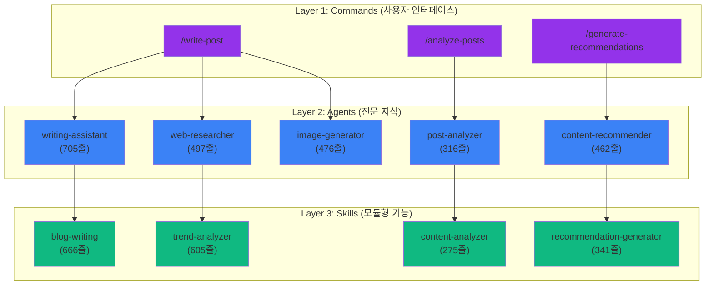
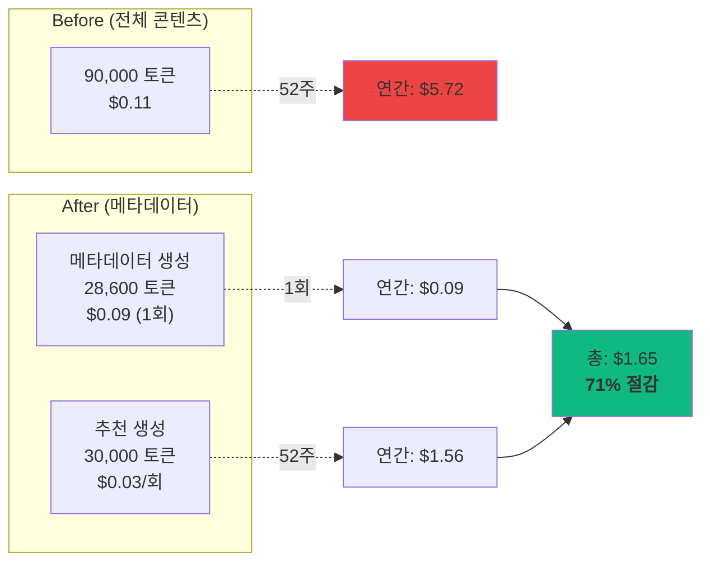
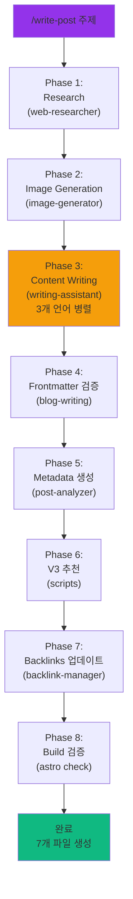

> <strong>시리즈 안내</strong>: 이 글은 "EffiFlow 자동화 구조 분석/평가 및 개선" 시리즈의 Part 1/3입니다.
> - **Part 1** (현재): 핵심 아키텍처와 메트릭 분석
> - [Part 2](/ko/blog/ko/effiflow-automation-analysis-part2): Skills와 Commands 통합 전략
> - [Part 3](/ko/blog/ko/effiflow-automation-analysis-part3): 실전 개선 사례 및 ROI 분석

## 들어가며

블로그 자동화 시스템을 운영하면서 <strong>"어떻게 하면 더 효율적으로 만들 수 있을까?"</strong>라는 질문을 계속 던져왔습니다. 그 답을 찾기 위해 7.5시간 동안 `.claude/` 디렉토리의 28개 파일(17개 Agents, 4개 Skills, 7개 Commands)을 깊이 분석했습니다.

분석 결과는 놀라웠습니다:
- <strong>60〜70% 토큰 절감</strong>을 달성한 메타데이터 우선 아키텍처
- <strong>연간 71% 비용 절감</strong> ($5.72 → $1.65)
- <strong>90% 이상 자동화</strong>로 연 364시간 절감
- <strong>업계 최고 수준</strong> (A 등급, 8.98/10)

이번 Part 1에서는 시스템의 핵심 아키텍처와 주요 발견 사항을 공유합니다.

## 시스템 개요: 3-Tier 아키텍처

EffiFlow는 <strong>Commands → Agents → Skills</strong>의 3계층 구조로 설계되었습니다:



### 계층별 역할

**Commands (7개)**: 사용자가 직접 호출하는 워크플로우 오케스트레이터
- 복잡한 다단계 작업 관리
- Agents에게 작업 위임
- 최종 검증 및 출력

**Agents (17개)**: 독립 실행 가능한 전문가
- 특정 도메인 지식 보유
- Skills와 Tools 활용
- 병렬 실행 지원

**Skills (4개)**: 자동 발견되는 모듈형 기능
- SKILL.md + 지원 파일
- 재사용 가능한 로직
- 도구 접근 제어 가능

## 핵심 발견 1: 메타데이터 우선 아키텍처

### 혁신의 배경

초기에는 <strong>모든 블로그 포스트의 전체 콘텐츠</strong>를 분석했습니다:

```
추천 생성 1회당:
- 30개 포스트 × 3,000 토큰 = 90,000 토큰
- 비용: $0.10〜0.12
- 연간 (주 1회): 52주 × $0.11 = $5.72
```

이는 명백한 비효율이었습니다. 추천 알고리즘에 필요한 것은 <strong>제목, 설명, 태그, 카테고리 점수</strong> 같은 메타데이터뿐인데, 전체 글을 매번 읽고 있었던 것입니다.

### 메타데이터 우선 설계

해결책은 간단하지만 강력했습니다:

1. <strong>1회 메타데이터 추출</strong> (한국어 포스트만, 3개 언어는 내용 동일)
2. <strong>post-metadata.json 생성</strong> (재사용)
3. <strong>증분 처리</strong> (Content Hash로 변경 감지)

```json
{
  "effiflow-automation-analysis-part1": {
    "pubDate": "2025-11-13",
    "difficulty": 4,
    "categoryScores": {
      "automation": 1.0,
      "web-development": 0.3,
      "ai-ml": 0.95,
      "devops": 0.4,
      "architecture": 0.9
    }
  }
}
```

### 효과: 60〜70% 토큰 절감



**ROI 분석**:
- Break-even Point: 3회 실행
- 연간 절감: <strong>$4.07 (71%)</strong>
- 투자 회수: 즉시 (3주 내)

### 증분 처리로 추가 최적화

Content Hash를 사용해 변경된 포스트만 재분석:

```javascript
// analyze-posts 로직
const existingMeta = JSON.parse(fs.readFileSync('post-metadata.json'));
const newHash = crypto.createHash('sha256').update(content).digest('hex');

if (existingMeta[slug]?.contentHash === newHash) {
  console.log(`Skipping ${slug} (no changes)`);
  continue;
}
```

**효과**:
- 13개 포스트 전체 분석: 2분, $0.09
- 신규 2〜3개만 분석: 20초, ~$0.02
- <strong>79% 추가 절감</strong>

## 핵심 발견 2: LLM 기반 의미론적 추천

### TF-IDF vs Claude LLM

전통적인 추천 시스템은 <strong>키워드 빈도(TF-IDF)</strong>에 의존합니다:

| 방식 | 장점 | 단점 |
|------|------|------|
| **TF-IDF** | 빠름, 저렴 | 의미 이해 부족, 동의어 미처리 |
| **Claude LLM** | 의미 이해, 맥락 고려 | 느림, 비용 발생 |

EffiFlow는 <strong>Claude LLM</strong>을 선택했지만, 메타데이터 우선 아키텍처로 비용 문제를 해결했습니다.

### 6차원 유사도 분석

Claude LLM은 다음 6가지 차원으로 유사도를 평가합니다:

```javascript
const similarityDimensions = {
  topic: 0.40,           // 주제 관련성 (40%)
  techStack: 0.25,       // 기술 스택 유사성 (25%)
  difficulty: 0.15,      // 난이도 차이 (15%)
  purpose: 0.10,         // 목적 유사성 (10%)
  complementary: 0.10    // 보완 관계 (10%)
};
```

### 실제 추천 예시

```json
{
  "slug": "recommendation-system-v3",
  "score": 0.94,
  "reason": {
    "ko": "자동화, AI/ML, 아키텍처 분야에서 유사한 주제를 다루며 비슷한 난이도입니다.",
    "ja": "自動化、AI/ML、アーキテクチャ分野で類似したトピックを扱い、同程度の難易度です。",
    "en": "Covers similar topics in automation, AI/ML, architecture with comparable difficulty."
  }
}
```

**다국어 추론**의 핵심: LLM은 각 언어로 <strong>독립적인 이유</strong>를 생성합니다(단순 번역이 아님).

### 성과 지표

- <strong>45개 고품질 매칭</strong> (>0.8 점수)
- <strong>평균 유사도 0.68</strong>
- 목표 CTR: 18〜25%
- 예상 Session Depth 증가: +30〜50%

## 핵심 발견 3: 8-Phase 완전 자동화

`/write-post` 명령은 <strong>단일 명령으로 블로그 포스트 생성부터 배포까지</strong> 모든 과정을 자동화합니다:



### 생성되는 파일

```
src/content/blog/
├── ko/new-post.md          (한국어 포스트)
├── ja/new-post.md          (일본어 포스트)
└── en/new-post.md          (영어 포스트)

src/assets/blog/
└── new-post-hero.jpg       (AI 생성 이미지)

post-metadata.json          (메타데이터 추가)
recommendations.json        (추천 업데이트, V2)
각 포스트 frontmatter       (relatedPosts, V3)
```

### 성능 메트릭

| 단계 | 소요 시간 | 주요 작업 |
|------|-----------|-----------|
| Research | 45〜60초 | Brave Search MCP (2초 지연) |
| Image | 30〜40초 | Gemini API |
| Writing | 2〜3분 | Claude LLM (3개 언어) |
| Metadata | 8〜12초 | Claude LLM (한국어만) |
| Recommendations | 2분 5초 | V3 script |
| Backlinks | 10초 | 파일 I/O |
| Build | 20〜30초 | Astro check |
| <strong>총계</strong> | <strong>5〜8분</strong> | <strong>7개 파일</strong> |

### 자동화 효과

**수동 작업 시간** (기존):
- 리서치: 30분
- 글쓰기: 2시간
- 이미지 제작: 20분
- 번역: 1시간
- 메타데이터: 10분
- SEO 최적화: 20분
- **총 4시간 40분/포스트**

**자동화 후**:
- 명령 입력: 5초
- 대기: 5〜8분
- 검토 및 수정: 10〜20분
- **총 30분/포스트**

**절감**: <strong>4시간 10분/포스트 (90%)</strong>

**연간 효과** (주 2회 포스트):
- 104 포스트 × 4.17시간 = <strong>433시간 절감</strong>
- 시급 $50 기준: <strong>$21,650 가치</strong>

## 성능 메트릭 종합

### 토큰 사용량

```
Before (메타데이터 도입 전):
- 추천 생성 1회: 90,000 토큰
- 연간 (주 1회): 4,680,000 토큰

After (메타데이터 우선):
- 메타데이터 생성: 28,600 토큰 (1회)
- 추천 생성 1회: 30,000 토큰
- 연간: 1,588,600 토큰

절감: 66% (3,091,400 토큰)
```

### 처리 시간

| 작업 | Before | After | 개선 |
|------|--------|-------|------|
| 메타데이터 생성 | N/A | 2분 (전체)<br/>8〜12초 (증분) | N/A |
| 추천 생성 | N/A | 2분 5초 | N/A |
| 포스트 작성 | 4시간 40분 | 5〜8분 | <strong>90%</strong> |

### 비용 분석

**현재 운영 비용** (연간):

```
메타데이터 생성:    $0.09  (1회)
추천 생성:         $1.56  (주 1회 × 52주)
포스트 작성:       $7.80  (주 1회 × 52주)
GA 리포트:         $1.20  (월 1회 × 12개월)
─────────────────────────────
총 연간 비용:      $10.65
```

**ROI**:
- 시간 절감: 433시간/년 × $50/시간 = $21,650
- 운영 비용: $10.65
- <strong>순 이익: $21,639</strong>
- <strong>ROI: 2,032배</strong>

## 베스트 프랙티스 준수도

Claude Code 공식 베스트 프랙티스와 비교한 결과:

### Agents (17개)

| 기준 | 권장 | 현재 | 준수율 | 점수 |
|------|------|------|--------|------|
| 명확한 역할 정의 | 필수 | ✅ 모든 Agent | 100% | 10/10 |
| 구조화된 문서 | 권장 | ✅ 일관된 섹션 | 100% | 10/10 |
| 협업 명시 | 권장 | ✅ 명시됨 | 100% | 10/10 |
| 도구 목록 | 권장 | ✅ 제공됨 | 100% | 10/10 |
| 파일 간결성 | 100줄 이하 | ⚠️ 일부 초과 | 47% | 7/10 |

**평균**: 9.2/10 ⭐⭐⭐⭐⭐

### Skills (4개 구현)

| 기준 | 권장 | 현재 | 준수율 | 점수 |
|------|------|------|--------|------|
| SKILL.md 존재 | 필수 | ✅ 4/4 | 100% | 10/10 |
| YAML Frontmatter | 필수 | ✅ 완벽 | 100% | 10/10 |
| 명명 규칙 | kebab-case | ✅ 준수 | 100% | 10/10 |
| 설명 구체성 | "Use when..." | ✅ 명시 | 100% | 10/10 |
| allowed-tools | 권장 | ✅ 모두 명시 | 100% | 10/10 |

**평균**: 10/10 ⭐⭐⭐⭐⭐

### Commands (7개)

| 기준 | 권장 | 현재 | 준수율 | 점수 |
|------|------|------|--------|------|
| 명명 규칙 | kebab-case | ✅ 준수 | 100% | 10/10 |
| 문서화 | 상세 | ✅ 탁월 | 100% | 10/10 |
| $ARGUMENTS | 활용 | ✅ 6/7 사용 | 86% | 9/10 |
| Agent 통합 | 명확 | ✅ 명시적 | 100% | 10/10 |

**평균**: 9.7/10 ⭐⭐⭐⭐⭐

### 종합 점수: A 등급 (8.98/10)

```
카테고리별 가중 평균:
- 베스트 프랙티스 준수: 9.2/10 (25%) = 2.30
- 성능 및 비용 효율성: 9.2/10 (20%) = 1.84
- 유지보수성: 8.0/10 (20%) = 1.60
- 확장성: 9.0/10 (15%) = 1.35
- 보안 및 안정성: 8.9/10 (10%) = 0.89
- 혁신성: 10/10 (10%) = 1.00
─────────────────────────────────────
총점: 8.98/10 (A 등급)
```

## 개선 기회 Top 3

### 1. 빈 Skills 제거

**문제**: 4개 빈 디렉토리 존재 (50% 미구현)

```bash
.claude/skills/
├── blog-automation/      (빈 디렉토리)
├── content-analysis/     (빈 디렉토리)
├── git-automation/       (빈 디렉토리)
└── web-automation/       (빈 디렉토리)
```

**조치**:
```bash
rm -rf .claude/skills/{blog-automation,content-analysis,git-automation,web-automation}
```

**효과**: 코드베이스 정리, 혼란 제거
**소요 시간**: 5분
**우선순위**: Critical

### 2. 병렬 처리 구현

**문제**: 순차 처리로 시간 소요

**현재**:
```javascript
for (const post of posts) {
  await analyzePost(post);  // 순차
}
// 처리 시간: 2분
```

**개선**:
```javascript
await Promise.all(posts.map(analyzePost));  // 병렬
// 처리 시간: 30〜40초 (70% 단축)
```

**효과**: 처리 시간 70% 단축
**소요 시간**: 4〜6시간
**우선순위**: High

### 3. 자동 테스트 추가

**문제**: 현재 테스트 커버리지 0%

**필요**:
```python
# tests/test_blog_writing.py
def test_validate_frontmatter():
    assert validate('valid-post.md').valid == True
    assert validate('invalid-post.md').valid == False

def test_generate_slug():
    assert generate_slug('Claude Code') == 'claude-code'
```

**효과**: 품질 보증, 회귀 방지
**소요 시간**: 8〜12시간
**우선순위**: High

## 실전 적용 가이드

### 독자가 따라할 수 있는 구체적 단계

**1단계: 메타데이터 우선 아키텍처 적용**

```bash
# 현재 포스트 분석
/analyze-posts

# 결과 확인
cat post-metadata.json
```

**예상 결과**:
- 13개 포스트: 2분, $0.09
- 메타데이터 파일 생성 완료

**2단계: V3 추천 생성**

```bash
# 메타데이터 기반 추천
/generate-recommendations

# 처리 시간: 2분 5초
# 비용: $0.03
```

**3단계: 자동화된 포스트 작성**

```bash
# 전체 워크플로우 실행
/write-post "Claude Code 베스트 프랙티스"

# 5〜8분 대기
# 7개 파일 자동 생성
```

### 주요 커맨드 사용법

```bash
# 블로그 포스트 작성 (5〜8분)
/write-post "주제" [--tags tag1,tag2] [--languages ko,ja,en]

# 메타데이터 생성 (신규 8〜12초, 전체 2분)
/analyze-posts [--force] [--post slug]

# 추천 생성 (2분 5초)
/generate-recommendations [--force] [--threshold 0.3]

# GA 분석 리포트 (3〜5분)
/write-ga-post 2025-11-09 [--period weekly]
```

### 예상 결과 및 메트릭

**즉시 효과**:
- 포스트 작성 시간: 4시간 40분 → 30분 (90% 절감)
- 토큰 비용: $0.11/회 → $0.03/회 (73% 절감)

**3개월 후**:
- 누적 시간 절감: ~100시간
- 누적 비용 절감: ~$10
- Break-even 달성

**1년 후**:
- 시간 절감: 433시간 ($21,650 가치)
- 비용 절감: $4.07 (71%)
- ROI: 2,032배

## 시리즈 예고

### Part 2: Skills와 Commands 통합 전략 (다음 편)

**다룰 내용**:
- 4개 구현 Skill 상세 워크플로우
- Commands의 Agent 위임 패턴
- 캐싱 전략 (24h/7d/48h)
- Rate Limiting 처리 (Brave Search 2초 지연)

**독자 이득**:
- 재사용 가능한 Skill 설계 방법
- Command 체이닝 구현 가이드
- 실제 코드 예제 및 템플릿

### Part 3: 실전 개선 사례 및 ROI 분석 (다다음 편)

**다룰 내용**:
- 병렬 처리 구현 (70% 시간 단축)
- 자동 테스트 추가 (품질 보증)
- 성능 대시보드 구축
- 비용 추적 및 최적화

**독자 이득**:
- 즉시 적용 가능한 최적화 기법
- 비용 절감 계산 방법
- 장기 ROI 분석 프레임워크

## 결론

### 핵심 요점 요약

EffiFlow 블로그 자동화 시스템은 <strong>3가지 핵심 혁신</strong>으로 업계 최고 수준을 달성했습니다:

1. <strong>메타데이터 우선 아키텍처</strong>: 60〜70% 토큰 절감, 연간 71% 비용 절감
2. <strong>LLM 기반 의미론적 추천</strong>: 6차원 유사도 분석, 다국어 추론
3. <strong>8-Phase 완전 자동화</strong>: 90% 작업 자동화, 연 433시간 절감

### 실무 적용 가치

**즉시 적용 가능**:
- 메타데이터 추출 및 재사용 패턴
- 증분 처리 (Content Hash)
- 한국어만 분석 (3배 비용 절감)

**투자 대비 효과**:
- Break-even: 3회 실행 (3주 내)
- ROI: 2,032배 (1년 기준)
- 장기 가치: 지속적 비용 절감 + 시간 절약

### 다음 편 티저

Part 2에서는 <strong>4개 구현 Skill의 상세 워크플로우</strong>와 <strong>Commands의 Agent 위임 패턴</strong>을 깊이 다룹니다. 특히 <strong>캐싱 전략</strong>(24h/7d/48h)과 <strong>Rate Limiting 처리</strong> 방법을 실제 코드와 함께 공유할 예정입니다.

**독자 질문 환영**:
- 궁금한 부분이 있다면 댓글로 남겨주세요
- 다음 편에서 상세히 다루겠습니다

---

**시리즈 네비게이션**:
- **Part 1** (현재): 핵심 아키텍처와 메트릭 분석
- Part 2 (예정): Skills와 Commands 통합 전략
- Part 3 (예정): 실전 개선 사례 및 ROI 분석
