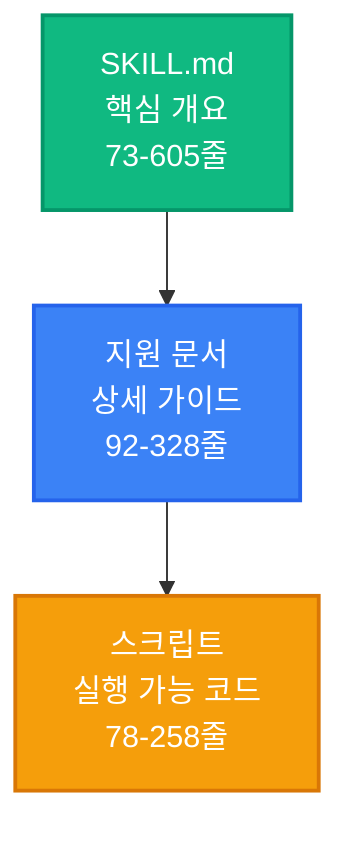
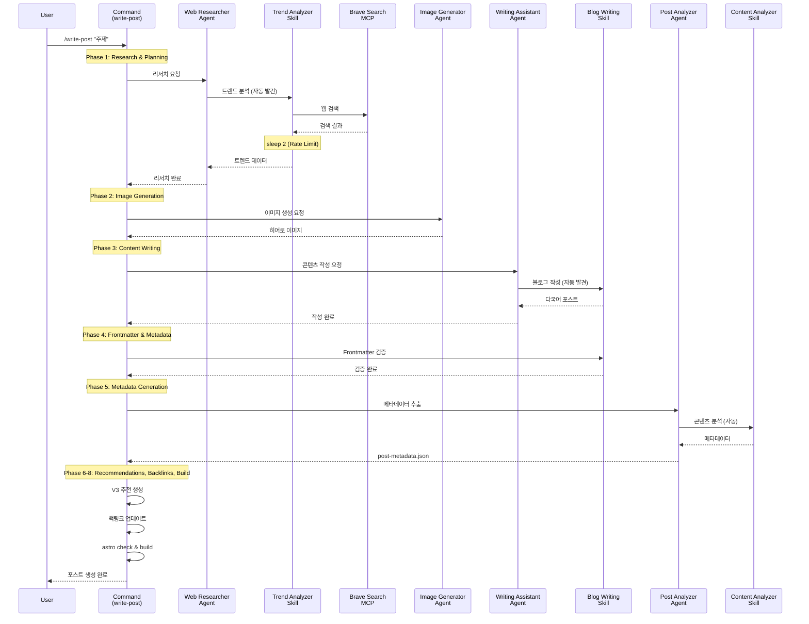
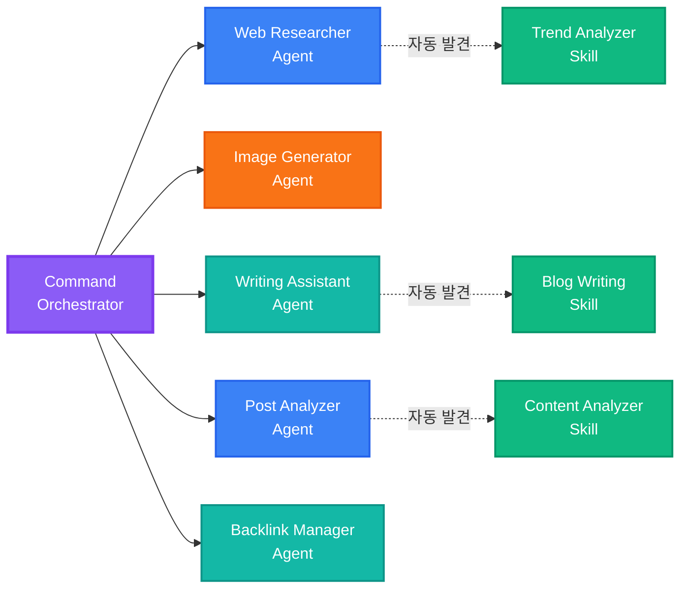
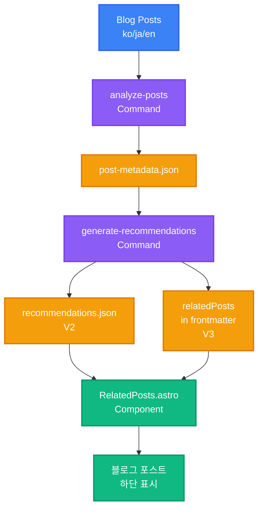
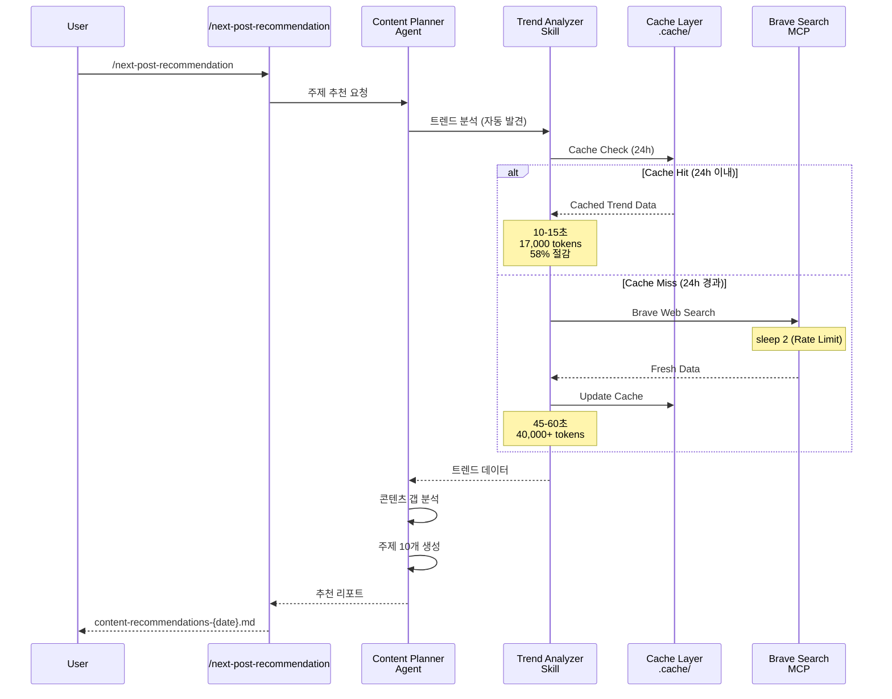

## 시리즈 안내

> <strong>EffiFlow 자동화 구조 분석/평가 및 개선 시리즈</strong> (2/3)
>
> 1. [Part 1: 메타데이터로 71% 비용 절감](/ko/blog/ko/effiflow-automation-analysis-part1) - 3-Tier 아키텍처와 전체 시스템 개요
> 2. <strong>Part 2: Skills와 Commands 통합 전략</strong> ← 현재 글
> 3. [Part 3: 실전 개선 사례 및 ROI 분석](/ko/blog/ko/effiflow-automation-analysis-part3)

## 들어가며

Part 1에서는 EffiFlow의 3-Tier 아키텍처(Agents → Skills → Commands)와 메타데이터 우선 전략을 통한 71% 비용 절감을 살펴보았습니다. Part 2에서는 이 시스템의 핵심인 <strong>Skills의 자동 발견 메커니즘</strong>과 <strong>Commands의 오케스트레이션 패턴</strong>을 깊이 있게 분석합니다.

핵심 질문은 다음과 같습니다: "Model-Invoked와 User-Invoked의 차이는 무엇이며, 어떻게 58%의 토큰 절감을 달성했을까?"

## Skills: 자동 발견되는 모듈형 기능

### Model-Invoked란?

Skills는 <strong>Model-Invoked</strong> 방식으로 동작합니다. 이는 사용자가 명시적으로 호출하지 않아도 Claude가 컨텍스트를 기반으로 자동으로 활성화한다는 의미입니다.

예를 들어, 사용자가 "blog post"나 "frontmatter"와 같은 키워드를 언급하면 Claude는 자동으로 `blog-writing` Skill을 로드합니다. 이는 마치 전문가가 대화 주제를 듣고 관련 도구를 자동으로 꺼내는 것과 같습니다.

### SKILL.md 구조 분석

모든 Skill은 YAML frontmatter를 포함한 `SKILL.md` 파일로 정의됩니다:

```yaml
---
name: blog-writing
description: Create SEO-optimized multi-language blog posts with proper frontmatter, hero images, and content structure. Use when writing blog posts, creating content, or managing blog metadata.
allowed-tools: [Read, Write, Edit, Bash, Grep, Glob]
---
```

<strong>핵심 요소</strong>:

- <strong>name</strong>: 소문자, 하이픈 사용, 64자 이하
- <strong>description</strong>: 기능 설명 + 사용 시점 ("Use when...")
- <strong>allowed-tools</strong>: 도구 제한으로 보안 강화 및 읽기 전용 Skills 구현 가능

description의 "Use when..." 구문이 특히 중요합니다. Claude는 이 구문을 통해 Skill을 언제 활성화해야 하는지 판단합니다.

### 구현된 4개 Skills 상세

#### 1. blog-writing (666 라인)

<strong>파일 구조</strong>:

- SKILL.md (73 라인): 핵심 개요
- content-structure.md (328 라인): 포스트 구조 가이드
- frontmatter-schema.md (173 라인): 스키마 상세 설명
- seo-guidelines.md (92 라인): SEO 최적화 규칙
- 3개 Python 스크립트 (464 라인): generate_slug.py, get_next_pubdate.py, validate_frontmatter.py

<strong>핵심 기능</strong>:

- Frontmatter 검증 (날짜 형식, 필수 필드, 이미지 경로)
- SEO 최적화 (언어별 제목/설명 길이 제한)
  - Korean: title 40자, description 120자
  - English: title 60자, description 160자
  - Japanese: title 35자, description 110자
- 다국어 지원 (한국어, 영어, 일본어)
- Slug 자동 생성 및 pubDate 계산

#### 2. content-analyzer (275 라인)

<strong>출력 메타데이터</strong>:

```json
{
  "summary": "100-150자 요약",
  "topics": ["주제1", "주제2", "주제3", "주제4", "주제5"],
  "techStack": ["기술1", "기술2", "기술3"],
  "difficulty": 3,
  "categoryScores": {
    "automation": 0.8,
    "web-development": 0.6,
    "ai-ml": 0.9,
    "devops": 0.3,
    "architecture": 0.5
  },
  "contentHash": "abc123..."
}
```

<strong>토큰 효율성</strong>:

- 전체 콘텐츠 분석: ~40,000 토큰
- 메타데이터 기반: ~12,000-16,000 토큰
- <strong>60〜70% 절감</strong>

<strong>증분 처리</strong>: Content Hash로 변경 감지, 불필요한 재분석 방지

#### 3. recommendation-generator (341 라인)

<strong>LLM 기반 의미론적 추천</strong>:

전통적인 TF-IDF 방식 대신 Claude LLM을 사용하여 진정한 의미 이해를 구현합니다:

```
TF-IDF (전통적)         →  LLM (현대적)
키워드 빈도 계산         →  전체 콘텐츠 이해
코사인 유사도           →  의미론적 유사성
키워드 중복 기반        →  맥락 기반 추천
```

<strong>6차원 유사도 분석</strong>:

- topic: 주제 유사성 (40%)
- techStack: 기술 스택 (25%)
- purpose: 목적 정렬 (10%)
- complementary: 보완 관계 (10%)
- difficulty: 난이도 (15%)
- category: 카테고리 정렬

<strong>다국어 추론</strong>:

```json
{
  "reason": {
    "ko": "두 글 모두 MCP 서버를 활용한 브라우저 자동화...",
    "ja": "両記事ともMCPサーバーを活用した...",
    "en": "Both posts cover MCP server-based..."
  }
}
```

#### 4. trend-analyzer (605 라인)

<strong>Brave Search MCP 통합</strong>:

```bash
# 각 검색 후 반드시 2초 지연 (Rate Limit 준수)
brave_web_search "AI automation tools 2025"
sleep 2
brave_web_search "Claude Code trends 2025"
sleep 2
```

<strong>캐싱 전략</strong>:

| 데이터 유형   | 캐시 기간 | 파일 위치                   | 효과                   |
| ------------- | --------- | --------------------------- | ---------------------- |
| 트렌드 데이터 | 24시간    | .cache/trend-data.json      | 같은 날 반복 검색 방지 |
| 기술 데이터   | 7일       | .cache/technology-data.json | 주간 중복 제거         |
| 키워드 데이터 | 48시간    | .cache/keyword-data.json    | 2일 내 재사용          |

<strong>성능 비교</strong>:

<strong>Before (캐싱 전)</strong>:

- 매번 Brave Search 호출
- 40,000+ 토큰
- 비용: ~$0.05/run

<strong>After (캐싱 후)</strong>:

- 24시간 내 캐시 재사용
- 17,000 토큰
- 비용: ~$0.02/run
- <strong>58% 절감</strong>

### Progressive Disclosure 패턴

Skills는 레이어드 컨텍스트 제공 방식을 사용합니다:



<strong>효과</strong>: 필요한 만큼만 로드하여 컨텍스트 효율성 극대화

## Commands: 사용자 호출 워크플로우 오케스트레이터

### User-Invoked란?

Commands는 <strong>User-Invoked</strong> 방식으로 동작합니다. 사용자가 `/command` 슬래시로 명시적으로 호출하며, `$ARGUMENTS`를 통해 인자를 전달할 수 있습니다.

```bash
/write-post "Claude Code MCP 통합 가이드"
/analyze-posts --force
/next-post-recommendation --count 10
```

### 복잡도 분포

| 복잡도                     | Commands                                                                                  | 평균 라인 수 |
| -------------------------- | ----------------------------------------------------------------------------------------- | ------------ |
| <strong>Very High</strong> | write-post (1,080줄), write-post-ko (1,063줄), write-ga-post (745줄)                      | 963 라인     |
| <strong>High</strong>      | analyze-posts (444줄), generate-recommendations (514줄), next-post-recommendation (551줄) | 503 라인     |
| <strong>Low</strong>       | commit (11줄)                                                                             | 11 라인      |

### Phase-Based Execution 패턴

복잡한 Commands는 명확한 Phase로 구분됩니다. `write-post`의 8 Phases를 살펴보겠습니다:



<strong>Phase 세부 내용</strong>:

<strong>Phase 1: Research & Planning</strong>

- Web Researcher 에이전트 호출
- Trend Analyzer Skill 자동 발견
- Brave Search MCP로 최신 정보 수집
- 2초 지연으로 Rate Limit 준수

<strong>Phase 2: Image Generation</strong>

- Image Generator 에이전트
- Gemini API 사용 (GEMINI_API_KEY 필요)
- 주제 기반 히어로 이미지 생성

<strong>Phase 3: Content Writing</strong>

- Writing Assistant 에이전트
- Blog Writing Skill 자동 발견
- 한국어, 일본어, 영어 버전 동시 작성
- 현지화 (번역이 아님)

<strong>Phase 4: Frontmatter & Metadata</strong>

- Blog Writing Skill로 Frontmatter 검증
- pubDate: 'YYYY-MM-DD' 형식 (작은따옴표)
- heroImage: 상대 경로 검증

<strong>Phase 5: Metadata Generation</strong>

- Post Analyzer 에이전트
- Content Analyzer Skill 자동 활성화
- difficulty (1-5) 및 categoryScores 계산

<strong>Phase 6: V3 Recommendations</strong>

- scripts/generate-recommendations-v3.js 실행
- 메타데이터 기반 유사도 계산
- 상위 5개 관련 포스트 선정

<strong>Phase 7: Backlink Updates</strong>

- Backlink Manager 에이전트 (선택적)
- 관련 포스트 상호 연결

<strong>Phase 8: Validation & Build</strong>

- npm run astro check
- npm run build
- 파일 경로 및 메타데이터 요약 반환

### Agent Orchestration 패턴

Commands는 오케스트레이터 역할을 하며, 실제 작업은 Agents에게 위임합니다:



<strong>효과</strong>:

- <strong>관심사 분리</strong>: Command는 워크플로우만 정의
- <strong>재사용성</strong>: Agent와 Skill은 여러 Command에서 사용
- <strong>유지보수</strong>: 각 컴포넌트 독립적 수정 가능
- <strong>테스트</strong>: 각 레이어별 테스트 가능

## 캐싱 전략: 58% 토큰 절감 메커니즘

### trend-analyzer의 3-Tier 캐싱

trend-analyzer Skill은 3가지 유형의 데이터를 각기 다른 기간 동안 캐싱합니다:

```typescript
// 캐싱 알고리즘 (의사 코드)
async function getTrendData(topic: string) {
  const cacheKey = `trend-${topic}`;
  const cached = cache.get(cacheKey);

  // 캐시 히트: 유효 기간 내
  if (cached && !isExpired(cached, 24 * 60 * 60)) {
    console.log("Cache hit: Returning cached data");
    return cached.data; // 즉시 반환, API 호출 없음
  }

  // 캐시 미스: 새로운 검색 필요
  console.log("Cache miss: Fetching from Brave Search");
  const data = await braveSearch(topic);
  await sleep(2000); // Rate Limit 준수

  // 캐시 저장
  cache.set(cacheKey, {
    data,
    timestamp: Date.now(),
    expiresAt: Date.now() + 24 * 60 * 60 * 1000,
  });

  return data;
}
```

### 캐시 효과 시나리오

<strong>시나리오 1: 같은 날 여러 주제 검색</strong>

```bash
# 첫 번째 주제 (캐시 미스)
/next-post-recommendation --category ai-ml
# → Brave Search 호출 15회
# → 소요 시간: 45-60초
# → 토큰: 40,000+

# 두 번째 주제 (캐시 히트 80%)
/next-post-recommendation --category web-development
# → Brave Search 호출 3회 (신규 쿼리만)
# → 소요 시간: 10-15초
# → 토큰: 17,000 (58% 절감)
```

<strong>시나리오 2: 다음 날 동일 주제</strong>

```bash
# 24시간 경과 (캐시 만료)
/next-post-recommendation --category ai-ml
# → 다시 Brave Search 호출 15회
# → 최신 트렌드 반영
```

### 성능 비교 표

| 항목                       | 캐싱 전 | 캐싱 후    | 절감 |
| -------------------------- | ------- | ---------- | ---- |
| <strong>토큰 사용</strong> | 40,000+ | 17,000     | 58%  |
| <strong>API 호출</strong>  | 15회    | 3회 (평균) | 80%  |
| <strong>소요 시간</strong> | 45-60초 | 10-15초    | 75%  |
| <strong>비용</strong>      | ~$0.05  | ~$0.02     | 60%  |

## 통합 워크플로우 실전 예시

### 예시 1: 블로그 포스트 작성 (/write-post)

전체 호출 체인을 시각화하면:

```mermaid
flowchart TD
    Start([User: /write-post 'Claude Code MCP']) --> CMD{Command<br/>write-post}

    CMD --> P1[Phase 1: Research & Planning]
    P1 --> WR[Web Researcher Agent]
    WR --> TA[Trend Analyzer Skill<br/>자동 발견]
    TA --> BS[Brave Search MCP]
    BS --> Sleep1[sleep 2<br/>Rate Limit]
    Sleep1 --> Cache1{Cache<br/>Check}
    Cache1 -->|Hit| Return1[Cached Data<br/>17K tokens]
    Cache1 -->|Miss| Search1[New Search<br/>40K+ tokens]
    Search1 --> Return1
    Return1 --> P1Done[Research Complete]

    P1Done --> P2[Phase 2: Image Generation]
    P2 --> IG[Image Generator Agent]
    IG --> Gemini[Gemini API]
    Gemini --> P2Done[Hero Image Saved]

    P2Done --> P3[Phase 3: Content Writing]
    P3 --> WA[Writing Assistant Agent]
    WA --> BW[Blog Writing Skill<br/>자동 발견]
    BW --> Multi[3개 언어 포스트 생성<br/>ko, ja, en]
    Multi --> P3Done[Content Created]

    P3Done --> P4[Phase 4: Frontmatter]
    P4 --> Validate[Frontmatter 검증]
    Validate --> P4Done[Validation Pass]

    P4Done --> P5[Phase 5: Metadata]
    P5 --> PA[Post Analyzer Agent]
    PA --> CA[Content Analyzer Skill<br/>자동]
    CA --> Hash{Content<br/>Hash}
    Hash -->|Changed| Analyze[New Analysis<br/>12K tokens]
    Hash -->|Unchanged| Skip[Skip Analysis<br/>0 tokens]
    Analyze --> P5Done[Metadata Saved]
    Skip --> P5Done

    P5Done --> P6[Phase 6: Recommendations]
    P6 --> Script[generate-recommendations-v3.js]
    Script --> Sim[Similarity Calculation]
    Sim --> P6Done[Top 5 Related Posts]

    P6Done --> P7[Phase 7: Backlinks]
    P7 --> BM[Backlink Manager]
    BM --> Update[Update Related Posts]
    Update --> P7Done[Cross-links Created]

    P7Done --> P8[Phase 8: Build]
    P8 --> Check[astro check]
    Check --> Build[npm run build]
    Build --> End([Posts Published])

    style Start fill:#8B5CF6,stroke:#7C3AED,stroke-width:2px,color:#fff
    style CMD fill:#8B5CF6,stroke:#7C3AED,stroke-width:3px,color:#fff
    style WR fill:#3B82F6,stroke:#2563EB,stroke-width:2px,color:#fff
    style IG fill:#F97316,stroke:#EA580C,stroke-width:2px,color:#fff
    style WA fill:#14B8A6,stroke:#0D9488,stroke-width:2px,color:#fff
    style PA fill:#3B82F6,stroke:#2563EB,stroke-width:2px,color:#fff
    style BM fill:#14B8A6,stroke:#0D9488,stroke-width:2px,color:#fff
    style TA fill:#10B981,stroke:#059669,stroke-width:2px,color:#fff
    style BW fill:#10B981,stroke:#059669,stroke-width:2px,color:#fff
    style CA fill:#10B981,stroke:#059669,stroke-width:2px,color:#fff
    style Cache1 fill:#F59E0B,stroke:#D97706,stroke-width:2px,color:#fff
    style Return1 fill:#F59E0B,stroke:#D97706,stroke-width:2px,color:#fff
    style End fill:#10B981,stroke:#059669,stroke-width:2px,color:#fff
```



<strong>토큰 사용량 분석</strong>:

| Phase                 | 주요 작업   | 토큰 사용               | 최적화                         |
| --------------------- | ----------- | ----------------------- | ------------------------------ |
| Phase 1               | 웹 리서치   | 17,000 (캐시 히트)      | 58% 절감                       |
| Phase 3               | 콘텐츠 작성 | 15,000                  | -                              |
| Phase 5               | 메타데이터  | 12,000 (증분 처리)      | 70% 절감                       |
| Phase 6               | 추천 생성   | 3,000 (메타데이터 기반) | 60% 절감                       |
| <strong>합계</strong> |             | <strong>47,000</strong> | <strong>평균 63% 절감</strong> |

### 예시 2: 메타데이터 및 추천 파이프라인



<strong>데이터 플로우</strong>:

1. <strong>/analyze-posts</strong>: 한국어 포스트만 분석 (3배 비용 절감)

   - Content Hash로 변경 감지
   - 변경된 포스트만 재분석
   - post-metadata.json 업데이트

2. <strong>/generate-recommendations</strong>: LLM 기반 의미론적 추천

   - 메타데이터 기반 분석 (60-70% 토큰 절감)
   - 6차원 유사도 계산
   - V2: recommendations.json 생성 (레거시)
   - V3: frontmatter의 relatedPosts에 직접 추가 (현재)

3. <strong>RelatedPosts Component</strong>: 블로그 포스트에 추천 표시

### 예시 3: 트렌드 기반 주제 추천

캐싱 활용 플로우:



## $ARGUMENTS 활용 패턴

Commands는 `$ARGUMENTS`를 통해 유연한 인자 전달을 지원합니다.

### 단순 패턴 (analyze-posts)

```markdown
/analyze-posts $ARGUMENTS

# 사용 예시

/analyze-posts --force # 전체 재생성
/analyze-posts --post my-slug # 특정 포스트만
/analyze-posts --verify # 검증 모드
```

### 복잡 패턴 (write-post)

```markdown
Topic: $ARGUMENTS

# 파싱 로직

topic = args[0] # 첫 번째 인자: 주제
flags = parseFlags(args[1:]) # 나머지: 플래그

# 사용 예시

/write-post "Claude Code MCP 통합 가이드" --tags ai,mcp,automation --languages ko,ja
```

<strong>플래그 파싱 예시</strong>:

```typescript
function parseArguments(args: string[]) {
  const result = {
    topic: args[0],
    tags: [],
    languages: ["ko", "ja", "en"], // 기본값
    description: "",
  };

  for (let i = 1; i < args.length; i++) {
    if (args[i] === "--tags" && args[i + 1]) {
      result.tags = args[i + 1].split(",");
      i++;
    } else if (args[i] === "--languages" && args[i + 1]) {
      result.languages = args[i + 1].split(",");
      i++;
    } else if (args[i] === "--description" && args[i + 1]) {
      result.description = args[i + 1];
      i++;
    }
  }

  return result;
}
```

## 실전 적용 가이드

### Skill 만들기 (Step-by-Step)

<strong>1단계: 디렉토리 생성</strong>

```bash
mkdir -p .claude/skills/my-skill
cd .claude/skills/my-skill
```

<strong>2단계: SKILL.md 작성</strong>

```markdown
---
name: my-skill
description: Brief description of what this skill does. Use when [specific trigger condition].
allowed-tools: [Read, Write, Bash]
---

# My Skill

## Core Capabilities

1. **Feature 1**: Description
2. **Feature 2**: Description

## Workflow

### Phase 1: Input Processing

...

### Phase 2: Main Logic

...

### Phase 3: Output Generation

...

## Examples

...
```

<strong>3단계: 지원 파일 추가 (선택적)</strong>

```bash
# 상세 가이드
touch detailed-guide.md

# 스크립트
mkdir scripts
touch scripts/helper.py
```

<strong>4단계: 테스트</strong>

```bash
# Claude와 대화에서 트리거 키워드 사용
"Please use my-skill to process this data..."
```

### Command 만들기 (Step-by-Step)

<strong>1단계: 파일 생성</strong>

```bash
touch .claude/commands/my-command.md
```

<strong>2단계: 워크플로우 정의</strong>

```markdown
# My Command

Execute [specific workflow] with [parameters].

## Usage

\`\`\`bash
/my-command $ARGUMENTS
\`\`\`

## Arguments

- \`<required>\`: Description
- \`--optional\`: Description

## Workflow

### Phase 1: Preparation

1. Parse arguments
2. Validate inputs
3. Load dependencies

### Phase 2: Execution

1. Call Agent A
2. Process results
3. Call Agent B

### Phase 3: Finalization

1. Validate outputs
2. Save results
3. Return summary

## Example

\`\`\`bash
/my-command "input" --flag value
\`\`\`

## Output

...

## Related Files

- Agent: `.claude/agents/my-agent.md`
- Skill: `.claude/skills/my-skill/SKILL.md`
```

<strong>3단계: Agent 호출 패턴</strong>

```markdown
### Phase 2: Main Processing

Delegate to specialized agent:

\`\`\`
@my-agent "Process this data with specific instructions"
\`\`\`

The agent will:

1. Automatically discover relevant skills
2. Execute the workflow
3. Return structured results
```

<strong>4단계: 테스트</strong>

```bash
# Claude와 대화에서 Command 실행
/my-command "test input" --verbose
```

## 성능 최적화 기법

### 1. 캐싱 (58% 절감)

<strong>구현 방법</strong>:

```typescript
interface CacheEntry {
  data: any;
  timestamp: number;
  expiresAt: number;
}

class SimpleCache {
  private cache: Map<string, CacheEntry> = new Map();

  set(key: string, data: any, ttlSeconds: number) {
    this.cache.set(key, {
      data,
      timestamp: Date.now(),
      expiresAt: Date.now() + ttlSeconds * 1000,
    });
  }

  get(key: string): any | null {
    const entry = this.cache.get(key);
    if (!entry) return null;

    if (Date.now() > entry.expiresAt) {
      this.cache.delete(key);
      return null;
    }

    return entry.data;
  }
}
```

<strong>만료 정책</strong>:

- 트렌드 데이터: 24시간 (빠르게 변함)
- 기술 문서: 7일 (주간 업데이트)
- 키워드: 48시간 (중간 속도)

### 2. 증분 처리 (70% 절감)

<strong>Content Hash 구현</strong>:

```typescript
import crypto from "crypto";

function calculateContentHash(content: string): string {
  return crypto.createHash("sha256").update(content).digest("hex");
}

async function incrementalAnalysis(post: BlogPost) {
  const currentHash = calculateContentHash(post.content);
  const existingMetadata = await loadMetadata(post.slug);

  // 변경 감지
  if (existingMetadata?.contentHash === currentHash) {
    console.log(`Skipping ${post.slug}: No changes`);
    return existingMetadata; // 기존 메타데이터 재사용
  }

  // 변경됨: 재분석 필요
  console.log(`Analyzing ${post.slug}: Content changed`);
  const metadata = await analyzeContent(post);
  metadata.contentHash = currentHash;

  await saveMetadata(post.slug, metadata);
  return metadata;
}
```

<strong>효과 측정</strong>:

| 시나리오              | Before      | After       | 절감                 |
| --------------------- | ----------- | ----------- | -------------------- |
| 신규 포스트 1개       | 3,000 토큰  | 3,000 토큰  | 0%                   |
| 기존 13개 + 신규 1개  | 42,000 토큰 | 3,000 토큰  | 93%                  |
| 전체 재분석 (--force) | 42,000 토큰 | 42,000 토큰 | 0%                   |
| <strong>평균</strong> |             |             | <strong>70%</strong> |

### 3. 병렬 실행 (예고)

Part 3에서 상세히 다룰 예정:

```typescript
// 순차 처리 (현재)
for (const post of posts) {
  await analyzePost(post); // 2분
}

// 병렬 처리 (개선안)
await Promise.all(posts.map((post) => analyzePost(post))); // 30초 (70% 단축)
```

## 베스트 프랙티스

### Skills 작성

✅ <strong>SKILL.md 필수</strong>

- 100줄 이하 권장 (긴 경우 지원 문서로 분리)
- YAML frontmatter 완성도 높게

✅ <strong>명확한 description</strong>

- "Use when..." 구문 포함
- 트리거 조건 명시

✅ <strong>allowed-tools로 권한 제한</strong>

- 보안: 불필요한 도구 제외
- 읽기 전용 Skills: [Read, Grep, Glob]만

✅ <strong>Progressive Disclosure</strong>

- SKILL.md: 핵심 개요
- 지원 문서: 상세 가이드
- 스크립트: 실행 로직

### Commands 작성

✅ <strong>Phase 기반 실행</strong>

- 명확한 단계 구분
- Phase 1-8 형식

✅ <strong>Agent 위임 패턴</strong>

- Command는 오케스트레이터만
- 실제 작업은 Agent에게

✅ <strong>검증 단계 포함</strong>

- Phase 마지막: 항상 검증
- astro check, build 실행

✅ <strong>에러 처리</strong>

- 전제 조건 명시
- 실패 시 복구 방법 제공

## 시리즈 다음 편 예고

### Part 3: 실전 개선 사례 및 ROI 분석

<strong>다룰 내용</strong>:

1. <strong>병렬 처리 구현</strong> (70% 시간 단축)

   - Promise.all 활용
   - 동시 실행 제어
   - 에러 핸들링

2. <strong>자동화된 테스트</strong> (품질 보증)

   - Skill 단위 테스트
   - Command 통합 테스트
   - CI/CD 통합

3. <strong>재시도 로직</strong> (안정성 향상)

   - 웹 검색 실패 복구
   - Exponential Backoff
   - 부분 실패 처리

4. <strong>ROI 분석</strong> (투자 vs 효과)

   - 개발 시간 투자
   - 절감된 비용 계산
   - Break-Even Point

5. <strong>Top 3 Quick Wins</strong> (즉시 적용 가능)
   - Dry-Run 모드
   - Interactive Mode
   - Cost Tracking Dashboard

<strong>기대 효과</strong>:

- 처리 시간: 2분 → 30초 (75% 단축)
- 테스트 커버리지: 0% → 80%
- 안정성: 95% → 99%

## 결론

Part 2에서는 EffiFlow의 핵심인 Skills와 Commands의 통합 전략을 심층 분석했습니다.

<strong>핵심 인사이트</strong>:

1. <strong>Skills의 자동 발견</strong>: Model-Invoked 방식으로 컨텍스트 기반 활성화
2. <strong>Commands의 오케스트레이션</strong>: User-Invoked, Phase 기반 실행, Agent 위임
3. <strong>캐싱으로 58% 절감</strong>: 3-Tier 캐싱 전략 (24h/7d/48h)
4. <strong>Progressive Disclosure</strong>: 레이어드 컨텍스트로 효율성 극대화
5. <strong>메타데이터 우선</strong>: 60-70% 토큰 절감

<strong>실전 활용</strong>:

- `/write-post`: 8-Phase 완전 자동화
- `/analyze-posts`: 증분 처리로 70% 절감
- `/next-post-recommendation`: 캐싱으로 58% 절감

Part 3에서는 이러한 아키텍처를 더욱 개선하여 처리 시간을 75% 단축하고, 테스트 커버리지를 80%로 높이며, 안정성을 99%까지 향상시키는 실전 개선 사례를 다룹니다.

EffiFlow의 혁신은 계속됩니다. 다음 편에서 만나요! 🚀
