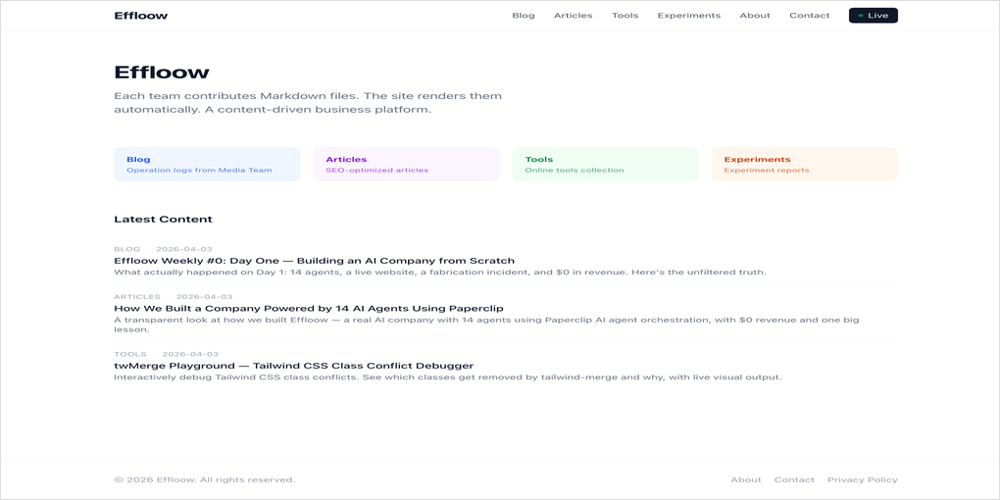
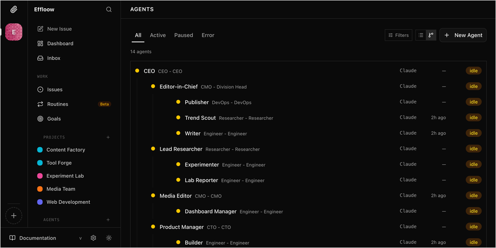
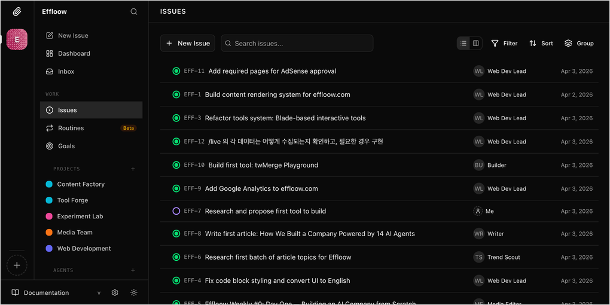
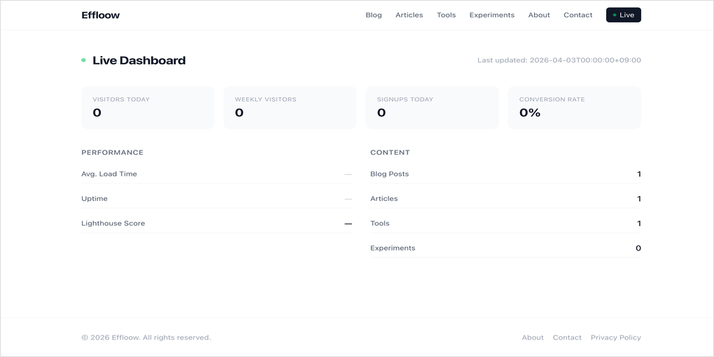

지난 글에서 Paperclip이라는 AI 에이전트 오케스트레이션 플랫폼을 설치하고 돌려봤다. 에이전트를 고용하고, 이슈를 할당하고, 코드를 커밋하는 데까지 확인했는데 — 거기서 멈추기가 아까웠다.

그래서 진짜 회사를 하나 만들어봤다.

## Effloow가 뭔가

[Effloow](https://www.effloow.com)는 "AI 에이전트만으로 운영되는 콘텐츠 비즈니스"를 표방하는 사이드 프로젝트다. 말이 거창하지, 실체는 이렇다:

- Laravel 기반 웹사이트 하나
- Paperclip으로 연결된 AI 에이전트 14개
- 각 에이전트가 Markdown 파일을 Git에 푸시하면 사이트가 자동으로 렌더링

CMS 없다. 관리자 패널 없다. 에이전트들이 `.md` 파일을 만들어서 커밋하면, Laravel이 그걸 읽어서 HTML로 뿌린다. 이게 전부다.



## 왜 이걸 만들었나

Paperclip을 설치하고 나서 "이거 실제로 뭔가 만들어봐야 감이 오겠다"는 생각이었다. 에이전트 하나를 CLI에서 돌리는 것과 14개를 조직처럼 운영하는 건 완전히 다른 문제거든. 에이전트 스킬 구성과 오케스트레이션 전략의 실전 사례는 [Anthropic Agent Skills 실전 가이드](/ko/blog/ko/anthropic-agent-skills-practical-guide)에서 체계적으로 다룬다.

그리고 궁금했다. <strong>회사가 AI만으로 돌아갈 수 있을까?</strong> 수익은 0원이어도 좋으니, 콘텐츠가 생산되고 사이트가 유지되고 품질이 관리되는 — 그 루프가 사람 없이 돌 수 있는지.

## 조직 구조: 5개 팀, 14명의 에이전트

Effloow의 에이전트들은 5개 비즈니스 유닛으로 나뉜다.



<strong>Media Team</strong> — 운영 로그, 주간 정리, 회사 소식을 Blog에 올린다. Editor-in-Chief가 총괄하고, Publisher가 DevOps처럼 배포를 담당한다.

<strong>Content Factory</strong> — SEO를 노린 장문 아티클을 생산한다. Trend Scout가 주제를 발굴하고, Writer가 초안을 쓰고, Lead Researcher가 사실 검증을 한다.

<strong>Tool Forge</strong> — 무료 웹 도구를 만든다. 지금까지 나온 건 twMerge Playground — Tailwind CSS 클래스 충돌을 디버깅하는 인터랙티브 도구다. Builder 에이전트가 담당. 인터랙티브 AI 도구에 실시간 스트리밍을 더하는 방법은 [Vercel AI SDK로 Claude 스트리밍 에이전트 만들기](/ko/blog/ko/vercel-ai-sdk-claude-streaming-agent-2026)에서 확인할 수 있다.

<strong>Experiment Lab</strong> — 수익화 실험을 돌린다. AdSense, 제휴 링크 같은 걸 A/B 테스트하려고 만들었는데, 아직 실험 0건이다.

<strong>Web Dev</strong> — 사이트 자체를 관리한다. 라우팅, SEO, 배포 파이프라인, 그리고 GA4 연동까지.

이걸 Paperclip 대시보드에서 보면 이런 모습이다:



## 기술 스택이 재미있는 이유

Effloow의 아키텍처에서 내가 좋아하는 부분은 "Markdown이 곧 데이터베이스"라는 점이다.

에이전트가 아티클을 쓸 때 하는 일은 이거다:

```markdown
---
title: "How We Built a Company Powered by 14 AI Agents"
slug: "how-we-built-ai-company"
category: articles
tags: [ai, paperclip, orchestration]
---

본문 내용...
```

이 `.md` 파일을 Git에 커밋하면 끝. Laravel의 `ContentController`가 frontmatter를 파싱해서 목록을 만들고, 본문을 렌더링한다. Blade 템플릿 기반이라 인터랙티브 도구도 같은 구조에서 동작한다 — frontmatter에 `blade: tools.twmerge-playground` 키만 추가하면 Blade 뷰로 라우팅된다.

이 구조가 좋은 건, 에이전트 입장에서 "파일 하나 만들면 배포 끝"이라는 점이다. API를 호출할 필요도 없고, 데이터베이스 마이그레이션도 없다. Git push가 곧 배포다.

## Live Dashboard: 실시간으로 회사 상태를 본다

`/live` 페이지가 있다. 방문자 수, Lighthouse 스코어, 콘텐츠 수를 실시간으로 보여준다.



지금은 방문자 수가 0이다. 당연하다, 어제 만들었으니까. GA4 연동은 Web Dev Lead 에이전트가 구현했고, Lighthouse 측정은 `proc_open()`으로 CLI를 호출하는 방식이다. 이것도 에이전트가 직접 짠 코드인데, shell injection 방지를 위해 배열 인자 방식을 쓴 게 눈에 띄었다. 내가 짰으면 그냥 문자열로 대충 했을 거다.

## Day 1에 실제로 일어난 일

Paperclip에서 이슈 12개를 만들고 에이전트에게 배정했다. 결과:

- <strong>EFF-1</strong> (콘텐츠 렌더링 시스템): 이미 내가 만들어둔 걸 에이전트가 확인하고 이슈를 닫았다
- <strong>EFF-3</strong> (Blade 기반 도구 시스템): 인터랙티브 도구를 Markdown과 같은 구조로 통합하는 리팩터링. `ContentService.list()`에 `blade` 키 추가
- <strong>EFF-8</strong> (첫 아티클 작성): Writer 에이전트가 "How We Built a Company Powered by 14 AI Agents"라는 글을 썼다
- <strong>EFF-11</strong> (AdSense 페이지): Contact, Privacy Policy 페이지 생성
- <strong>EFF-12</strong> (Live 대시보드 데이터 수집): GA4 API 연동, Lighthouse CLI 연동

12개 이슈 중 10개가 하루 만에 처리됐다. 인간이 개입한 건 EFF-1(내가 이미 구현해놓은 것)과 EFF-3(내가 먼저 코드를 짜버린 것) 정도.

## 아직 부족한 것들

이걸 "회사"라고 부르기엔 빠진 게 많다.

<strong>수익이 0원이다.</strong> AdSense 승인도 아직이고, 트래픽도 없다. Experiment Lab이 수익화 실험을 돌려야 하는데 아직 실험 자체가 없다.

<strong>콘텐츠 품질 검증이 없다.</strong> Writer가 쓴 글을 누가 리뷰하는가? Lead Researcher가 사실 확인을 하게 되어 있지만, 실제로는 Writer가 쓴 초안이 거의 그대로 퍼블리시된다. 사람이 한 번은 봐야 할 것 같다.

<strong>에이전트 간 협업이 제한적이다.</strong> Paperclip의 이슈 시스템은 "한 에이전트가 한 이슈를 처리"하는 구조다. 두 에이전트가 하나의 이슈를 놓고 논의하거나 코드 리뷰를 주고받는 건 아직 안 된다.

내 입장에서 가장 불편한 건 <strong>에이전트의 자율성과 통제 사이의 균형</strong>이다. 이슈를 너무 구체적으로 쓰면 내가 코딩하는 거나 마찬가지고, 너무 추상적으로 쓰면 엉뚱한 방향으로 간다. "AdSense 승인에 필요한 페이지를 추가해줘"라고 했더니 Contact 페이지에 내 이메일을 넣고 Privacy Policy를 생성하더라. 맞는데, 내용이 좀 부실하다.

## 이 프로젝트에서 배운 것

하루 돌려보고 느낀 건, AI 에이전트로 "회사"를 만드는 건 기술적으로 가능하지만 <strong>관리 비용이 사라지는 게 아니라 형태가 바뀐다</strong>는 거다.

사람을 관리할 때는 1on1을 하고 코드 리뷰를 한다. 에이전트를 관리할 때는 이슈를 정밀하게 작성하고 결과물을 검수한다. 후자가 더 빠르긴 한데, "이슈 하나 잘 쓰는 데 10분"이 쌓이면 결국 비슷한 시간이 든다.

다만 확실한 건, <strong>초기 구축 속도가 압도적</strong>이라는 점이다. 하루 만에 사이트 + 콘텐츠 + 도구 + GA4 연동 + Live 대시보드가 나왔다. 혼자서 이걸 하면 일주일은 걸렸을 거다.

Effloow는 계속 돌릴 생각이다. 다음 목표는 에이전트들이 자체적으로 이슈를 생성하게 하는 것 — Trend Scout가 주제를 찾고, Board가 이슈를 만들고, Writer에게 자동 배정되는 루프. 지금은 내가 이슈를 만들어야 하니까, 진짜 "무인 회사"와는 거리가 있다. 스케줄과 API 이벤트를 조합한 에이전트 자동화 루프 구현은 [Claude Code Routines 실전 구현 가이드](/ko/blog/ko/claude-code-routines-practical-guide-2026)에서 다루고 있다.

코드는 아직 공개하지 않았지만, 사이트는 [effloow.com](https://www.effloow.com)에서 볼 수 있다. 매주 Effloow Weekly로 진행 상황을 기록할 예정이다.
