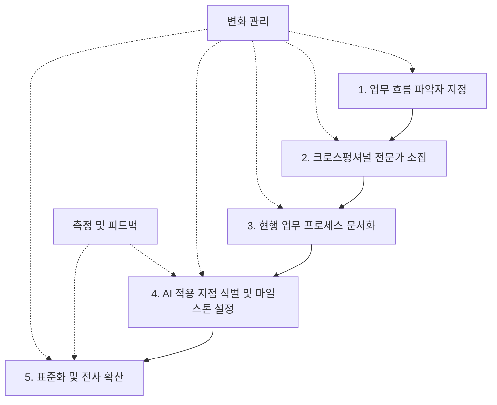
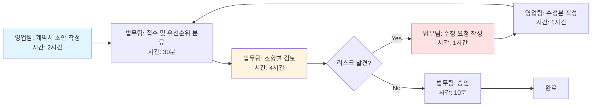
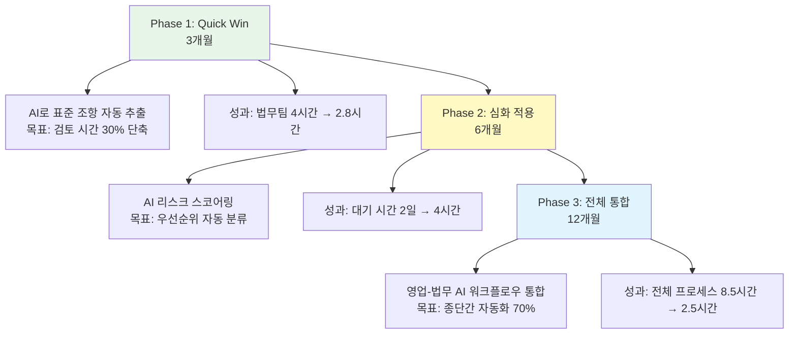
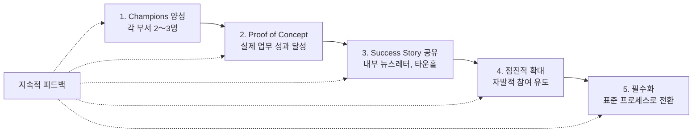

## 서론: AI 도입 열풍 속 높은 실패율의 현실

2024년부터 2025년까지, 생성형 AI는 기업들의 가장 큰 화두였습니다. McKinsey의 조사에 따르면 조직의 72%가 이미 생성형 AI를 일부 비즈니스 기능에서 활용하고 있으며, 향후 3년 내 투자를 확대할 계획입니다. 그러나 화려한 전망 뒤에는 어두운 현실이 숨어있습니다.

<strong>생성형 AI 프로젝트의 실패율은 충격적입니다</strong>:

- <strong>S&P Global</strong>: 2025년 AI 프로젝트의 <strong>42%</strong>가 실패할 것으로 예상
- <strong>MIT Sloan Management Review</strong>: AI 파일럿의 <strong>95%</strong>가 실패하며, 단 5%만이 실제 수익 가속화로 이어짐
- <strong>Gartner</strong>: 2025년까지 생성형 AI 프로젝트의 <strong>50%</strong>가 파일럿 단계에서 중단될 것으로 전망
- <strong>Writer 리포트</strong>: 기업 AI 도입 실패의 주요 원인으로 <strong>내부 권력 다툼</strong>, <strong>저조한 ROI</strong>, <strong>경영진과 직원 간 관점 충돌</strong> 지목

왜 이렇게 많은 AI 프로젝트가 실패할까요? 그리고 왜 바텀업(Bottom-up) 접근법은 한계에 부딪힐 수밖에 없을까요?

## 왜 AI 도입은 실패하는가: 기술 이전의 문제

### 1. 데이터 품질: 쓰레기를 넣으면 쓰레기가 나온다

AI 모델은 데이터로 학습합니다. 하지만 많은 기업의 데이터는 다음과 같은 문제를 안고 있습니다:

- <strong>사일로화된 데이터</strong>: 부서별로 분산되어 접근 불가
- <strong>비표준화된 형식</strong>: 같은 정보를 다른 방식으로 기록
- <strong>불완전한 데이터</strong>: 누락된 필드, 오래된 정보, 중복 레코드

BCG 조사에 따르면, <strong>기업의 75%가 데이터 품질 문제로 AI 프로젝트에 실패</strong>합니다. 데이터 정리 없이 AI를 도입하는 것은 기초 공사 없이 건물을 짓는 것과 같습니다.

### 2. 통합 복잡성: 레거시 시스템과의 전쟁

대부분의 기업은 수십 년 된 레거시 시스템을 운영합니다. 새로운 AI 솔루션을 기존 ERP, CRM, HRMS와 통합하는 것은 엄청난 도전입니다:

- API 호환성 문제
- 보안 및 컴플라이언스 요구사항
- 실시간 데이터 동기화 어려움

IBM의 연구에 따르면, <strong>통합 비용이 AI 프로젝트 총비용의 40〜60%를 차지</strong>합니다.

### 3. 불명확한 가치 제안: ROI를 증명하지 못함

많은 AI 프로젝트가 "AI를 사용해보자"라는 막연한 목표로 시작됩니다. 구체적인 비즈니스 문제와 측정 가능한 성과 지표 없이는 실패가 예정되어 있습니다.

<strong>실패하는 AI 프로젝트</strong>:
- "AI로 고객 서비스를 개선하자" (측정 불가능)
- "챗봇을 도입해보자" (목적 불명확)

<strong>성공하는 AI 프로젝트</strong>:
- "AI 챗봇으로 고객 문의 응답 시간을 50% 단축하고, 상담사 생산성을 30% 향상시킨다"
- "AI 기반 수요 예측으로 재고 비용을 15% 절감한다"

## 시니어 vs 주니어: 신뢰 격차의 본질

Writer가 발표한 "The State of Enterprise AI in 2025" 리포트는 충격적인 사실을 밝혔습니다:

<strong>시니어 리더십과 프론트라인 직원 간 생성형 AI 신뢰도 격차가 18%p</strong>

- <strong>시니어 리더십</strong>: 71%가 생성형 AI를 신뢰
- <strong>프론트라인 직원</strong>: 53%만 신뢰

### 왜 이런 격차가 발생하는가?

#### 1. 리더십의 낙관적 편향

경영진은 AI를 <strong>전략적 도구</strong>로 봅니다:
- 산업 리포트와 성공 사례 중심 정보 습득
- ROI와 경쟁 우위에 집중
- 구현 세부 사항은 추상적으로 인식

하지만 실제 사용자는 AI를 <strong>일상 업무 도구</strong>로 경험합니다:
- 부정확한 결과물로 인한 재작업
- 학습 곡선으로 인한 생산성 저하
- 자신의 직무가 위협받는다는 불안감

#### 2. 커뮤니케이션 단절

리더십은 "AI가 업무를 자동화해 전략적 업무에 집중할 수 있게 한다"고 말합니다. 직원들은 "내 일자리가 사라질 것"으로 해석합니다.

Writer 리포트에 따르면, <strong>62%의 직원이 AI 도입으로 인한 직무 변화에 대해 충분한 설명을 듣지 못했다</strong>고 응답했습니다.

#### 3. 관점의 충돌

| 관점 | 시니어 리더십 | 프론트라인 직원 |
|------|-------------|----------------|
| <strong>AI의 역할</strong> | 혁신과 성장 동력 | 통제와 감시 도구 |
| <strong>성공 지표</strong> | ROI, 시장 점유율 | 업무 편의성, 정확도 |
| <strong>우려 사항</strong> | 경쟁사 대비 뒤처짐 | 직무 안정성, 학습 부담 |
| <strong>시간 관점</strong> | 3〜5년 장기 | 당장 다음 분기 |

## 바텀업 접근법의 한계: 인간 본성의 벽

### 1. 사람은 모두 이성적이지 않다

경제학의 "합리적 경제인" 가정은 현실에서 거의 작동하지 않습니다. 행동경제학의 연구 결과는 명확합니다:

- <strong>현상 유지 편향(Status Quo Bias)</strong>: 변화를 기본적으로 거부
- <strong>손실 회피(Loss Aversion)</strong>: 이득보다 손실에 2배 이상 민감
- <strong>확증 편향(Confirmation Bias)</strong>: 자신의 믿음을 강화하는 정보만 선택

AI 도입은 <strong>변화</strong>를 의미합니다. 그리고 사람들은 본능적으로 변화를 두려워합니다.

### 2. 성장이나 업무 개선을 위해 일하지 않는다

대부분의 직원은 다음을 위해 일합니다:
- <strong>안정적인 급여</strong>
- <strong>예측 가능한 업무 루틴</strong>
- <strong>동료와의 관계 유지</strong>

"업무 효율성 향상"이나 "자기 계발"은 이차적 동기입니다. 바텀업 AI 도입은 다음을 요구합니다:

- 새로운 도구 학습 (추가 노력)
- 기존 업무 프로세스 변경 (불편함)
- 불확실한 미래 (불안)

<strong>결과적으로 저항이 발생합니다.</strong> MIT의 연구에 따르면, <strong>조직 변화 프로젝트의 70%가 직원 저항으로 실패</strong>합니다.

### 3. 무임승차 문제(Free Rider Problem)

바텀업 방식에서는 누군가 먼저 AI 도구를 배우고 프로세스를 개선해야 합니다. 하지만:

- 개선 노력은 개인이 부담
- 혜택은 팀 전체가 공유
- 선구자는 리스크를 감수 (실패 시 비난)

이 구조에서 <strong>합리적 선택은 "남이 먼저 하는 걸 기다리기"</strong>입니다.

### 4. 표준화의 부재

바텀업 도입의 가장 큰 문제는 <strong>파편화</strong>입니다:

- 팀 A는 ChatGPT Enterprise 사용
- 팀 B는 Claude Pro 사용
- 팀 C는 자체 오픈소스 LLM 구축
- 팀 D는 AI를 전혀 사용하지 않음

이런 상황에서는:
- 지식 공유 불가능
- 데이터 통합 불가능
- 보안 정책 일관성 없음
- 비용 최적화 불가능

## 탑다운 접근법: 체계적 AI 도입 전략

BCG의 연구는 명확한 해답을 제시합니다:

<strong>성공한 AI 기업은 70% 사람/프로세스, 20% 기술 인프라, 10% AI 알고리즘에 투자합니다.</strong>

실패한 기업은 정반대입니다. 최신 AI 모델에 투자하지만, 조직과 프로세스는 무시합니다.

### 탑다운 AI 도입 5단계 프레임워크



### 1단계: 업무 흐름 파악자 지정

<strong>핵심 원칙</strong>: 업무를 가장 잘 아는 사람이 변화를 주도해야 합니다.

<strong>잘못된 접근</strong>:
- IT 부서에 AI 도입 일임
- 외부 컨설팅에 전적으로 의존
- CEO의 하향식 지시만으로 진행

<strong>올바른 접근</strong>:
- 각 부서의 <strong>실무 전문가(Subject Matter Expert, SME)</strong> 식별
- 전체 워크플로우를 이해하는 <strong>프로세스 오너</strong> 지정
- 이들에게 권한과 책임 부여

<strong>예시</strong>: 고객 서비스 AI 도입 시
- CS 팀장이 프로젝트 오너
- 10년 차 상담사가 업무 흐름 파악자
- IT는 기술 지원 역할

### 2단계: 크로스펑셔널 전문가 소집

AI 도입은 기술 프로젝트가 아닙니다. <strong>조직 전체의 변화 프로젝트</strong>입니다.

<strong>필수 참여자</strong>:
- <strong>업무 전문가</strong>: 현장의 문제점과 니즈 파악
- <strong>데이터 팀</strong>: 데이터 품질과 접근성 평가
- <strong>IT/보안</strong>: 기술적 제약사항과 보안 요구사항
- <strong>HR</strong>: 직원 교육 및 변화 관리
- <strong>법무/컴플라이언스</strong>: 규제 준수 (특히 금융, 헬스케어)

<strong>회의 구조</strong>:
```
초기 워크샵 (2일)
├── Day 1: 현행 프로세스 매핑
│   ├── As-Is 워크플로우 문서화
│   ├── 페인 포인트 식별
│   └── 데이터 흐름 분석
└── Day 2: To-Be 프로세스 설계
    ├── AI 적용 지점 토론
    ├── 기술적 실현 가능성 검토
    └── 초기 마일스톤 설정
```

### 3단계: 현행 업무 프로세스 문서화

<strong>"측정할 수 없으면 개선할 수 없다"</strong> - 피터 드러커

많은 기업이 자신들의 업무 프로세스를 정확히 모릅니다. AI 도입 전에 반드시 해야 할 일:

<strong>문서화해야 할 것</strong>:

1. <strong>업무 흐름도</strong>: Mermaid, Lucidchart, Draw.io 등 활용
2. <strong>시간 소요</strong>: 각 단계별 소요 시간 측정
3. <strong>의사결정 지점</strong>: 누가, 언제, 무엇을 결정하는가
4. <strong>데이터 입출력</strong>: 어떤 데이터를 받고, 생성하는가
5. <strong>예외 처리</strong>: 오류 발생 시 처리 방법

<strong>예시: 계약서 검토 프로세스</strong>



<strong>측정 지표</strong>:
- 평균 처리 시간: 8.5시간
- 재작업률: 35%
- 법무팀 병목: 검토 대기 시간 평균 2일

### 4단계: AI 적용 지점 식별 및 마일스톤 설정

모든 것을 한 번에 자동화하지 마세요. <strong>점진적 접근</strong>이 핵심입니다.

<strong>AI 적용 우선순위 기준</strong>:

| 기준 | 높은 우선순위 | 낮은 우선순위 |
|------|-------------|-------------|
| <strong>반복성</strong> | 매일 수백 번 발생 | 월 1회 |
| <strong>표준화 가능성</strong> | 명확한 규칙 존재 | 고도의 판단 필요 |
| <strong>데이터 가용성</strong> | 정형화된 대량 데이터 | 비정형 소량 데이터 |
| <strong>비즈니스 영향</strong> | 매출 직결 | 지원 업무 |
| <strong>리스크</strong> | 낮음 (승인 프로세스 존재) | 높음 (규제 리스크) |

<strong>계약서 검토 예시 - 단계적 접근</strong>:



<strong>각 마일스톤의 성공 기준</strong>:
- <strong>정량적</strong>: 시간 단축 %, 정확도 %, 비용 절감액
- <strong>정성적</strong>: 사용자 만족도, 학습 곡선 평가
- <strong>조직적</strong>: 채택률, 표준 준수율

### 5단계: 표준화 및 전사 확산

성공적인 파일럿 후 가장 중요한 단계입니다.

<strong>표준화해야 할 것</strong>:

1. <strong>도구 선정</strong>
   - 승인된 AI 플랫폼 목록
   - 사용 사례별 권장 도구
   - 예: "문서 요약은 Claude, 코드 생성은 GitHub Copilot"

2. <strong>프롬프트 템플릿</strong>
   - 부서별 표준 프롬프트 라이브러리
   - 예시와 가이드라인
   - 버전 관리 및 공유 시스템

3. <strong>데이터 거버넌스</strong>
   - 민감 정보 처리 규칙
   - AI 입력 가능 데이터 분류
   - 출력물 검증 프로세스

4. <strong>교육 프로그램</strong>
   - 역할별 맞춤 교육
   - 실습 중심 워크샵
   - 지속적 학습 지원 (Office Hours, FAQ)

<strong>확산 전략</strong>:



## 변화 관리: 사람을 움직이는 법

McKinsey의 연구는 명확합니다: <strong>AI 성공의 가장 큰 장벽은 리더십</strong>입니다. 기술이 아닙니다.

### 저항 극복 전략

#### 1. "Why"를 명확히 하라 (사이먼 사이넥의 Golden Circle)

<strong>잘못된 커뮤니케이션</strong>:
> "우리는 ChatGPT Enterprise를 도입합니다. 다음 주부터 사용하세요."

<strong>효과적인 커뮤니케이션</strong>:
> "우리 고객 서비스 팀은 매일 500건의 반복 질문으로 정작 중요한 고객에게 집중하지 못하고 있습니다. AI 챗봇이 80%의 단순 질문을 처리하면, 여러분은 정말 도움이 필요한 고객에게 시간을 쓸 수 있습니다. 이는 여러분의 직무 만족도를 높이고, 고객은 더 나은 서비스를 받게 됩니다."

#### 2. 조기 승리(Quick Wins) 확보

처음부터 완벽한 솔루션을 목표로 하지 마세요. <strong>3개월 내 눈에 보이는 성과</strong>가 필요합니다.

<strong>Quick Win 사례</strong>:
- 회의록 자동 생성 → 주당 2시간 절약
- 이메일 초안 작성 지원 → 응답 시간 50% 단축
- FAQ 자동 응답 → 상담사 반복 업무 30% 감소

#### 3. 안전망 제공

"AI가 내 일자리를 빼앗는다"는 두려움을 해소하세요.

<strong>효과적인 메시지</strong>:
- "AI는 도구이지 대체자가 아닙니다"
- "반복 업무는 AI가, 판단은 사람이"
- <strong>재교육 프로그램 제공</strong>: "AI 시대의 새로운 역량 습득 지원"

#### 4. Transparency (투명성)

AI가 어떻게 작동하는지, 어떤 데이터를 사용하는지, 결정 과정이 무엇인지 투명하게 공개하세요.

<strong>신뢰 구축 방법</strong>:
- AI 출력물에 "근거 데이터" 링크
- 정확도 수치 공개 (예: "이 분류는 92% 정확도")
- 오류 리포팅 채널 운영

## 실제 사례: 성공과 실패에서 배우기

### 성공 사례: Walmart의 AI 재고 관리

<strong>도전 과제</strong>: 5,000개 매장의 재고를 최적화해 품절과 과잉 재고 동시 해결

<strong>탑다운 접근법</strong>:
1. <strong>파일럿 선정</strong>: 500개 매장으로 시작
2. <strong>업무 전문가 참여</strong>: 매장 관리자와 물류 팀이 AI 훈련 데이터 생성
3. <strong>단계적 확대</strong>: 성공 검증 후 분기별 1,000개 매장 추가
4. <strong>교육 투자</strong>: 모든 매장 직원에게 AI 시스템 교육

<strong>결과</strong>:
- 품절률 <strong>32% 감소</strong>
- 재고 비용 <strong>10% 절감</strong> (연간 $20억)
- 직원 만족도 상승 (반복 업무 감소)

<strong>핵심 성공 요인</strong>: 현장 직원을 "AI의 피해자"가 아닌 "AI의 파트너"로 만듦

### 실패 사례: 글로벌 은행의 AI 대출 심사

<strong>도전 과제</strong>: AI로 대출 심사 시간을 7일에서 1일로 단축

<strong>바텀업 실패 과정</strong>:
1. IT 부서가 최신 AI 모델 선정
2. 심사역들과 충분한 협의 없이 도입
3. "AI가 더 정확하다"는 일방적 주장

<strong>결과</strong>:
- 심사역들의 <strong>집단 반발</strong>
- "블랙박스 AI를 신뢰할 수 없다"는 불만
- 노조 개입으로 프로젝트 중단
- 투자금 $15M 손실

<strong>실패 원인</strong>:
- 심사역들을 "업무 흐름 파악자"로 참여시키지 않음
- AI 결정 근거를 투명하게 제공하지 않음
- 변화 관리 없이 기술만 강요

## 결론: 실패를 피하려면 사람을 먼저 생각하라

생성형 AI는 분명 혁명적 기술입니다. 하지만 기술만으로는 성공할 수 없습니다. BCG, McKinsey, MIT의 연구가 일관되게 말하는 메시지는 하나입니다:

<strong>성공하는 AI 도입은 70% 사람, 20% 프로세스, 10% 기술</strong>

### 핵심 원칙 5가지

1. <strong>업무 전문가를 중심에 놓으세요</strong>
   - IT나 외부 컨설턴트가 아닌, 실제 업무를 하는 사람이 주도

2. <strong>문서화 없이 자동화 없습니다</strong>
   - 현행 프로세스를 정확히 이해하지 못하면 AI는 혼란만 가중

3. <strong>점진적 접근이 빠른 길입니다</strong>
   - Quick Wins → 파일럿 → 확산 순서 준수

4. <strong>투명성이 신뢰를 만듭니다</strong>
   - AI의 작동 방식, 데이터 사용, 결정 근거를 공개

5. <strong>변화 관리가 전부입니다</strong>
   - 기술 도입이 아닌 조직 변화로 접근

### 시작하는 방법

<strong>다음 주부터 할 수 있는 3가지</strong>:

1. <strong>현행 업무 프로세스 1개 선정 및 문서화</strong>
   - 가장 반복적이고 시간이 많이 걸리는 업무
   - Mermaid로 워크플로우 그리기
   - 각 단계별 시간, 담당자, 데이터 기록

2. <strong>크로스펑셔널 워크샵 1회 개최</strong>
   - 업무 전문가 + IT + HR + 데이터 팀
   - 2시간 회의: "AI로 해결할 수 있는 페인 포인트 3가지"
   - 실현 가능성과 비즈니스 영향 평가

3. <strong>1개의 Quick Win 프로젝트 시작</strong>
   - 3개월 내 성과 목표 설정
   - 소규모 팀으로 시작 (5〜10명)
   - 성공 사례를 내부에 적극 홍보

### 마지막 조언

바텀업은 이상적으로 들립니다. "직원의 자발성", "민주적 의사결정", "창의성 존중" 같은 멋진 단어들이 따라옵니다. 하지만 현실은 냉정합니다.

<strong>사람은 변화를 싫어하고, 이성적이지 않으며, 개인의 이익을 우선시합니다.</strong>

이것은 잘못이 아니라 인간의 본성입니다. 따라서 조직 변화는 반드시 <strong>명확한 방향, 체계적 계획, 그리고 강력한 리더십</strong>이 필요합니다.

탑다운은 독재가 아닙니다. 업무를 가장 잘 아는 사람들이 함께 계획하고, 리더십이 자원과 권한을 제공하며, 조직 전체가 같은 방향으로 움직이는 것입니다.

42%의 실패율 통계 속에 들어가지 마세요. 사람을 먼저 생각하고, 프로세스를 문서화하고, 점진적으로 접근하세요. 그것이 AI 도입 성공의 유일한 길입니다.

---

<strong>참고 문헌</strong>:
- S&P Global Market Intelligence, "AI Project Failure Rates 2025"
- MIT Sloan Management Review, "Why AI Pilots Fail"
- Gartner, "Generative AI Hype Cycle 2024"
- BCG, "AI Success Formula: 70-20-10 Rule"
- McKinsey, "AI Leadership Gaps in Organizations"
- Writer, "The State of Enterprise AI in 2025"
- Harvard Business Review, "Managing Organizational Change"
