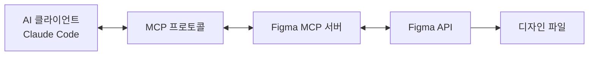
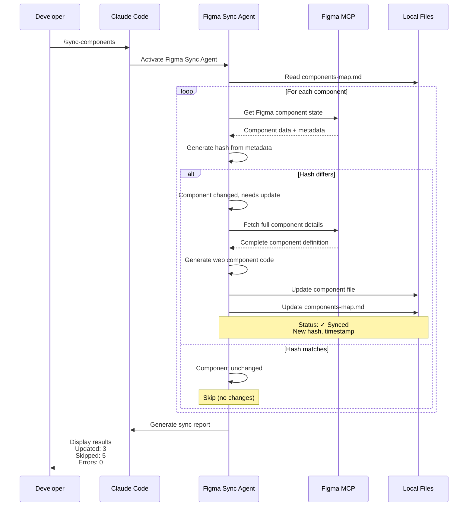

## 개요

디자인과 코드 사이의 간극은 모든 개발팀이 직면하는 영원한 과제입니다. 디자이너가 Figma에서 버튼을 수정하면, 개발자는 수동으로 CSS를 업데이트해야 합니다. 컴포넌트 라이브러리가 업데이트되면, 모든 프로젝트에서 일일이 변경사항을 반영해야 합니다.

이 글에서는 <strong>Figma MCP(Model Context Protocol)를 활용하여 디자인 시스템을 웹 컴포넌트로 자동 변환하고, 지속적으로 동기화하는 방법</strong>을 실전 연구를 통해 소개합니다. 단순한 이론이 아닌, 2025년 현재 실제로 동작하는 프로덕션 레벨의 솔루션입니다.

## Figma MCP 이해하기

### Model Context Protocol이란?

<strong>Model Context Protocol(MCP)</strong>은 Anthropic이 개발한 오픈 표준으로, AI 에이전트가 외부 도구 및 데이터 소스와 연결할 수 있게 해주는 프로토콜입니다. Figma의 MCP 구현은 AI 에이전트가 Figma 파일의 디자인 컨텍스트에 직접 접근할 수 있게 합니다.

**공식 설명:**
> "MCP는 다양한 AI 에이전트와 애플리케이션이 서로 또는 Figma와 같은 외부 시스템과 통신하는 방법에 대한 오픈소스 표준입니다."



### 두 가지 배포 모드

Figma MCP는 두 가지 방식으로 사용할 수 있습니다:

#### 1. Remote Server (Figma 호스팅)

```javascript
// Claude Desktop 설정
{
  "mcpServers": {
    "figma-remote": {
      "url": "https://mcp.figma.com/mcp"
    }
  }
}
```

<strong>특징:</strong>
- OAuth 기반 인증 (원클릭 설정)
- 로컬 설치 불필요
- Professional/Organization/Enterprise 플랜 + Dev seat 필요
- Tier 1 Figma REST API 제한 적용

#### 2. Desktop Server (로컬)

```javascript
// VS Code/Cursor 설정
{
  "mcpServers": {
    "figma-desktop": {
      "url": "http://127.0.0.1:3845/mcp"
    }
  }
}
```

<strong>특징:</strong>
- 로컬에서 `http://127.0.0.1:3845/mcp` 실행
- Figma 데스크톱 앱 최신 버전 필요
- 로컬 인증 사용
- 모든 플랜 유형에서 사용 가능
- Starter 플랜에서는 월 6회 도구 호출 제한

### 인증 방법

**Personal Access Token (권장):**

```bash
# 환경 변수 설정
export FIGMA_API_KEY="your-personal-access-token"

# 또는 CLI 인자로 전달
--figma-api-key "your-token"
```

**토큰 발급 방법:**
1. Figma 계정 설정으로 이동
2. "Personal Access Tokens" 메뉴 선택
3. 필요한 권한으로 새 토큰 생성
4. 토큰을 안전하게 저장 (비밀번호처럼 취급)

### 사용 가능한 도구 및 API

Figma MCP 서버는 AI 에이전트에게 다음 도구를 제공합니다:

<strong>디자인 컨텍스트 도구:</strong>
- `get_figma_file` - 전체 Figma 파일 구조 조회
- `get_node` - 특정 디자인 노드 세부 정보 가져오기
- `get_components` - 컴포넌트 라이브러리 접근
- `get_styles` - 디자인 스타일 조회
- `get_variables` - 디자인 토큰/변수 접근
- `get_comments` - 파일 코멘트 읽기
- `search_files` - 팀 내 파일 검색

<strong>Code Connect 통합:</strong>
- Figma 컴포넌트를 실제 코드에 연결
- 프로덕션 레디 코드 스니펫 제공
- 컴포넌트 속성을 코드 props에 매핑
- GitHub Actions를 통한 자동 동기화

## Figma 컴포넌트 라이브러리 구축

### Atomic Design 구조

디자인 시스템을 체계적으로 조직하기 위해 Atomic Design 원칙을 따릅니다:

```
Design System File
├── 📄 Foundations (기초)
│   ├── Colors (색상)
│   ├── Typography (타이포그래피)
│   ├── Spacing (간격)
│   └── Grid (그리드)
├── 📄 Atoms (원자)
│   ├── Buttons (버튼)
│   ├── Icons (아이콘)
│   └── Inputs (입력)
├── 📄 Molecules (분자)
│   ├── Form Fields (폼 필드)
│   ├── Cards (카드)
│   └── Navigation Items (네비게이션 항목)
└── 📄 Organisms (유기체)
    ├── Headers (헤더)
    ├── Forms (폼)
    └── Modals (모달)
```

**핵심 원칙:**
> "Figma 파일에서 컴포넌트의 다양한 카테고리별로 별도 페이지를 만드세요. 예: 'Atoms', 'Molecules', 'Organisms'"

### 명명 규칙 (Slash Notation)

일관된 명명 규칙은 디자인 시스템의 확장성과 유지보수성을 결정합니다:

```
Component/Variant/State
└─ Button/Primary/Default
└─ Button/Primary/Hover
└─ Button/Primary/Disabled
└─ Button/Secondary/Default
```

<strong>장점:</strong>
- Assets 패널에서 자동 정렬
- 드롭다운 메뉴의 명확한 계층 구조
- 검색 및 교체 용이
- 코드 명명 규칙과 일관성

<strong>베스트 프랙티스 가이드라인:</strong>
- 설명적이고 일관된 이름 사용
- 명명 구조 문서화
- 약어 사용 지양
- PascalCase 또는 kebab-case 일관되게 사용

### 컴포넌트 속성과 Variants

**현대적 접근법 (2021년 이후):**

```
Properties:
├── Type: [Primary, Secondary, Tertiary]
├── Size: [Small, Medium, Large]
├── State: [Default, Hover, Disabled]
└── Icon: [Boolean]
```

**Variants vs Properties:**
- <strong>Variants:</strong> 시각적 차이 (Primary vs Secondary)
- <strong>Properties:</strong> 행동적 토글 (Icon: Yes/No)
- <strong>베스트 프랙티스:</strong> 유연한 컴포넌트를 위해 둘 다 결합

### 라이브러리 조직 전략

**단일 라이브러리 접근법 (소규모 팀):**

```
Design-System.fig
└── 모든 컴포넌트, 스타일, 변수
```

**멀티 라이브러리 접근법 (대규모 팀):**

```
Design-System-Foundations.fig
Design-System-Components.fig
Design-System-Patterns.fig
Design-System-Icons.fig
```

**Figma의 권장사항:**
> "Figma는 일반적으로 팀이 관리할 수 있는 만큼 구체적이고 집중된 파일을 유지할 것을 권장합니다."

## 바닐라 자바스크립트 웹 컴포넌트

### 2025년 브라우저 지원 현황

**주요 소식: 폴리필이 더 이상 필요 없습니다!**

2025년 현재, 모든 주요 브라우저가 Web Components 표준을 완전히 지원합니다:

- ✅ Chrome: 100% 지원
- ✅ Firefox: 100% 지원
- ✅ Safari: 100% 지원
- ✅ Edge: 100% 지원

**공식 성명:**
> "2025년 기준, 모든 주요 브라우저(Chrome, Firefox, Safari, Edge)가 폴리필 없이 Web Components 표준을 완전히 지원합니다."

### Custom Elements API

웹 컴포넌트의 핵심은 Custom Elements API입니다:

```javascript
// 기본 버튼 컴포넌트 예제
class MyButton extends HTMLElement {
  constructor() {
    super();
    // 컴포넌트 초기화
  }

  connectedCallback() {
    // DOM에 요소가 추가될 때 호출
    this.render();
  }

  disconnectedCallback() {
    // DOM에서 제거될 때 정리 작업
  }

  attributeChangedCallback(name, oldValue, newValue) {
    // 속성 변경에 반응
    this.render();
  }

  static get observedAttributes() {
    return ['size', 'variant', 'disabled'];
  }

  render() {
    this.innerHTML = `
      <button class="btn btn--${this.getAttribute('variant')}">
        <slot></slot>
      </button>
    `;
  }
}

// 커스텀 엘리먼트 등록
customElements.define('my-button', MyButton);
```

**사용법:**

```html
<my-button variant="primary" size="large">
  클릭하세요
</my-button>
```

### Shadow DOM 활용

Shadow DOM은 스타일과 DOM을 캡슐화하여 진정한 컴포넌트 격리를 제공합니다:

```javascript
class MyCard extends HTMLElement {
  constructor() {
    super();
    // Shadow DOM 연결
    this.attachShadow({ mode: 'open' });
  }

  connectedCallback() {
    this.shadowRoot.innerHTML = `
      <style>
        :host {
          display: block;
          border: 1px solid var(--card-border);
          border-radius: var(--card-radius);
          padding: var(--card-padding);
        }

        ::slotted(h2) {
          margin-top: 0;
          color: var(--card-title-color);
        }
      </style>

      <div class="card">
        <slot name="header"></slot>
        <slot></slot>
        <slot name="footer"></slot>
      </div>
    `;
  }
}

customElements.define('my-card', MyCard);
```

**Shadow DOM의 장단점:**

<strong>장점:</strong>
- 완벽한 CSS 캡슐화
- 스타일 충돌 없음
- 진정한 컴포넌트 격리
- 프레임워크 독립적

<strong>단점:</strong>
- 외부에서 스타일링 불가 (의도된 설계)
- 글로벌 스타일이 침투하지 않음
- 디버깅이 더 어려울 수 있음
- 접근성 고려사항

### CSS Custom Properties로 디자인 토큰 통합

디자인 토큰을 CSS 변수로 활용하면 Figma와 코드 간 일관성을 유지할 수 있습니다:

```javascript
class MyButton extends HTMLElement {
  connectedCallback() {
    this.attachShadow({ mode: 'open' });
    this.shadowRoot.innerHTML = `
      <style>
        :host {
          --button-bg: var(--primary-color, #007bff);
          --button-text: var(--on-primary, white);
          --button-padding: var(--space-md, 12px 24px);
        }

        button {
          background: var(--button-bg);
          color: var(--button-text);
          padding: var(--button-padding);
          border: none;
          border-radius: var(--radius-md, 4px);
          cursor: pointer;
          font-size: var(--text-md, 16px);
          font-weight: var(--weight-medium, 500);
          transition: background 0.2s ease;
        }

        button:hover {
          background: var(--button-bg-hover, #0056b3);
        }

        button:disabled {
          background: var(--button-bg-disabled, #6c757d);
          cursor: not-allowed;
          opacity: 0.6;
        }
      </style>

      <button>
        <slot></slot>
      </button>
    `;
  }
}
```

## Figma → 웹 컴포넌트 변환

### 컴포넌트 매핑 파일 시스템

전통적인 수동 변환 대신, <strong>컴포넌트 매핑 파일(Component Mapping File)</strong> 시스템을 구축하면 지속적 동기화가 가능합니다.

#### 매핑 파일 구조

```markdown
<!-- components-map.md -->
# Component Mapping

## Button Component
- Figma URL: https://figma.com/file/ABC123/Design-System?node-id=1:234
- Component Path: src/components/Button.ts
- Last Synced: 2025-11-10T10:30:00Z
- Version Hash: abc123def456
- Status: ✓ Synced

## Card Component
- Figma URL: https://figma.com/file/ABC123/Design-System?node-id=2:345
- Component Path: src/components/Card.ts
- Last Synced: 2025-11-09T15:20:00Z
- Version Hash: xyz789abc123
- Status: ⚠ Needs Update

## Input Component
- Figma URL: https://figma.com/file/ABC123/Design-System?node-id=3:456
- Component Path: src/components/Input.ts
- Last Synced: 2025-11-08T09:15:00Z
- Version Hash: def456ghi789
- Status: ✓ Synced
```

**매핑 파일의 장점:**
- 단일 진실의 원천으로 모든 컴포넌트 추적
- 버전 해시로 변경 감지
- 마지막 동기화 타임스탬프 기록
- 수동 검토 및 자동화 모두 지원

### Figma 컴포넌트 메타데이터 추출

MCP를 통해 Figma 컴포넌트의 메타데이터를 가져옵니다:

```typescript
// scripts/extract-figma-metadata.ts
import axios from 'axios';
import crypto from 'crypto';

interface FigmaComponent {
  id: string;
  name: string;
  description?: string;
  properties?: Record<string, any>;
  lastModified: string;
}

async function getFigmaComponent(fileKey: string, nodeId: string): Promise<FigmaComponent> {
  const response = await axios.get(
    `https://api.figma.com/v1/files/${fileKey}/nodes?ids=${nodeId}`,
    {
      headers: {
        'X-Figma-Token': process.env.FIGMA_API_KEY
      }
    }
  );

  const node = response.data.nodes[nodeId];
  return {
    id: nodeId,
    name: node.document.name,
    description: node.document.description,
    properties: extractProperties(node.document),
    lastModified: response.data.lastModified
  };
}

function extractProperties(node: any): Record<string, any> {
  // Figma 컴포넌트의 속성(variants, properties) 추출
  const properties: Record<string, any> = {};

  if (node.componentPropertyDefinitions) {
    for (const [key, prop] of Object.entries(node.componentPropertyDefinitions)) {
      properties[key] = prop;
    }
  }

  return properties;
}

// 버전 해시 생성 (변경 감지용)
function generateHash(component: FigmaComponent): string {
  const content = JSON.stringify({
    name: component.name,
    properties: component.properties,
    lastModified: component.lastModified
  });

  return crypto.createHash('sha256').update(content).digest('hex').substring(0, 12);
}
```

### 변경 감지 로직

컴포넌트의 현재 상태와 로컬 상태를 비교하여 업데이트 필요 여부를 판단합니다:

```typescript
// scripts/check-component-changes.ts
interface ComponentMapping {
  name: string;
  figmaUrl: string;
  componentPath: string;
  lastSynced: string;
  versionHash: string;
  status: 'synced' | 'needs-update' | 'new';
}

async function needsUpdate(
  mapping: ComponentMapping,
  figmaComponent: FigmaComponent
): Promise<boolean> {
  const currentHash = generateHash(figmaComponent);

  // 해시가 다르면 업데이트 필요
  if (currentHash !== mapping.versionHash) {
    console.log(`Component "${mapping.name}" has changes`);
    console.log(`  Old hash: ${mapping.versionHash}`);
    console.log(`  New hash: ${currentHash}`);
    return true;
  }

  return false;
}

async function scanAllComponents(mappingFile: string): Promise<ComponentMapping[]> {
  const mappings = await parseComponentMap(mappingFile);
  const componentsToUpdate: ComponentMapping[] = [];

  for (const mapping of mappings) {
    const { fileKey, nodeId } = parseFigmaUrl(mapping.figmaUrl);
    const figmaComponent = await getFigmaComponent(fileKey, nodeId);

    if (await needsUpdate(mapping, figmaComponent)) {
      componentsToUpdate.push({
        ...mapping,
        status: 'needs-update'
      });
    }
  }

  return componentsToUpdate;
}
```

### 디자인 토큰 추출 및 변환

Figma Variables를 CSS 변수로 변환합니다:

```typescript
// scripts/extract-design-tokens.ts
interface DesignToken {
  name: string;
  value: string;
  type: 'color' | 'dimension' | 'fontFamily' | 'fontWeight' | 'number';
  mode?: string;
}

async function extractDesignTokens(fileKey: string): Promise<DesignToken[]> {
  const response = await axios.get(
    `https://api.figma.com/v1/files/${fileKey}/variables/local`,
    {
      headers: {
        'X-Figma-Token': process.env.FIGMA_API_KEY
      }
    }
  );

  const tokens: DesignToken[] = [];
  const collections = response.data.meta.variableCollections;

  for (const collection of Object.values(collections) as any[]) {
    for (const variable of collection.variables || []) {
      tokens.push({
        name: variable.name,
        value: variable.resolvedValue,
        type: variable.resolvedType,
        mode: collection.defaultModeId
      });
    }
  }

  return tokens;
}

function tokensToCSS(tokens: DesignToken[]): string {
  let css = ':root {\n';

  for (const token of tokens) {
    const varName = token.name.toLowerCase().replace(/\s+/g, '-');
    css += `  --${varName}: ${token.value};\n`;
  }

  css += '}\n';
  return css;
}
```

### 컴포넌트 코드 생성

Figma 컴포넌트 메타데이터를 기반으로 웹 컴포넌트 코드를 생성합니다:

```typescript
// scripts/generate-component-code.ts
function generateWebComponent(figmaComponent: FigmaComponent): string {
  const className = toPascalCase(figmaComponent.name);
  const tagName = toKebabCase(figmaComponent.name);

  return `
class ${className} extends HTMLElement {
  static get observedAttributes() {
    return [${generateAttributes(figmaComponent.properties)}];
  }

  constructor() {
    super();
    this.attachShadow({ mode: 'open' });
  }

  connectedCallback() {
    this.render();
  }

  attributeChangedCallback(name, oldValue, newValue) {
    if (oldValue !== newValue) {
      this.render();
    }
  }

  render() {
    this.shadowRoot.innerHTML = \`
      <style>
        ${generateStyles(figmaComponent)}
      </style>

      <div class="${tagName}">
        <slot></slot>
      </div>
    \`;
  }
}

customElements.define('${tagName}', ${className});
`.trim();
}

function generateAttributes(properties: Record<string, any>): string {
  return Object.keys(properties || {})
    .map(key => `'${toKebabCase(key)}'`)
    .join(', ');
}

function generateStyles(component: FigmaComponent): string {
  // Figma 스타일 정보를 CSS로 변환
  return `
    :host {
      display: block;
    }

    .${toKebabCase(component.name)} {
      /* Figma에서 추출한 스타일 */
    }
  `;
}
```

## 지속적 동기화 구현

### Claude Code 자동화 통합

Claude Code를 활용하면 Figma 컴포넌트 동기화 프로세스를 자동화할 수 있습니다. 에이전트와 슬래시 커맨드를 통해 지능적으로 변경 사항을 감지하고 업데이트합니다.

#### Figma Sync Agent 정의

`.claude/agents/figma-sync.md` 파일을 생성하여 전문화된 에이전트를 정의합니다:

```markdown
# Figma Component Sync Agent

당신은 Figma 컴포넌트와 웹 컴포넌트를 동기화하는 전문 에이전트입니다.

## 사용 가능한 도구

- `mcp__figma__get_component` - Figma 컴포넌트 조회
- `mcp__figma__get_node` - Figma 노드 상세 정보
- `Read`, `Write`, `Edit` - 파일 작업
- `Bash` - 스크립트 실행

## 워크플로우

1. `components-map.md` 파일 읽기
2. 각 컴포넌트의 현재 Figma 상태 조회
3. 로컬 웹 컴포넌트와 비교
4. 변경 사항이 있으면 업데이트된 코드 생성
5. `components-map.md`를 새 해시 및 타임스탬프로 업데이트

## 상태 비교 로직

```typescript
async function compareComponentState(
  figmaUrl: string,
  localPath: string,
  lastHash: string
): Promise<{ needsUpdate: boolean; newHash?: string }> {
  // 1. Figma URL에서 파일 키와 노드 ID 추출
  const { fileKey, nodeId } = parseFigmaUrl(figmaUrl);

  // 2. MCP를 통해 Figma 컴포넌트 상태 가져오기
  const figmaComponent = await getFigmaComponent(fileKey, nodeId);

  // 3. 해시 생성 및 비교
  const currentHash = generateComponentHash(figmaComponent);

  if (currentHash !== lastHash) {
    return { needsUpdate: true, newHash: currentHash };
  }

  return { needsUpdate: false };
}
```

## 선택적 업데이트 전략

- ✓ 해시가 다른 경우: 컴포넌트 재생성
- ✓ 해시가 같은 경우: 건너뛰기 (로그 출력)
- ✓ 새 컴포넌트: 매핑 파일에 추가
- ✓ 삭제된 컴포넌트: 경고 표시

## 결과 보고

동기화 후 다음 정보를 포함한 상세 보고서를 생성합니다:
- 업데이트된 컴포넌트 목록
- 건너뛴 컴포넌트 (이미 최신)
- 발생한 오류
- 전체 실행 시간
```

#### 슬래시 커맨드 구현

`.claude/commands/sync-components.md` 파일을 생성하여 간단한 명령어로 동기화를 실행합니다:

```markdown
# Sync Components Command

`components-map.md` 파일을 읽고 "Needs Update" 상태인 모든 컴포넌트를 동기화합니다.

## 사용법

```bash
/sync-components
```

## 동작 과정

1. `components-map.md` 파싱
2. 각 컴포넌트의 상태 확인
3. 업데이트가 필요한 컴포넌트만 처리
4. 변경 사항 커밋 (선택 사항)

## Delegation

이 명령은 Figma Sync Agent에게 작업을 위임합니다:

```
@figma-sync "components-map.md의 모든 컴포넌트를 동기화하세요.
변경이 있는 컴포넌트만 업데이트하고, 최신 상태인 컴포넌트는 건너뛰세요."
```

## 옵션

- `--all`: 상태와 관계없이 모든 컴포넌트 강제 업데이트
- `--component <name>`: 특정 컴포넌트만 동기화
- `--dry-run`: 실제로 파일을 변경하지 않고 시뮬레이션만 수행
```

### 스마트 업데이트 로직

변경 감지 및 선택적 업데이트를 구현합니다:

```typescript
// scripts/smart-sync.ts
interface SyncResult {
  updated: string[];
  skipped: string[];
  errors: Array<{ component: string; error: string }>;
  duration: number;
}

async function smartSync(mappingFile: string = 'components-map.md'): Promise<SyncResult> {
  const startTime = Date.now();
  const result: SyncResult = {
    updated: [],
    skipped: [],
    errors: [],
    duration: 0
  };

  // 1. 매핑 파일 파싱
  const mappings = await parseComponentMap(mappingFile);
  console.log(`Found ${mappings.length} components to check`);

  // 2. 각 컴포넌트 확인
  for (const mapping of mappings) {
    try {
      const { fileKey, nodeId } = parseFigmaUrl(mapping.figmaUrl);
      const figmaComponent = await getFigmaComponent(fileKey, nodeId);
      const currentHash = generateHash(figmaComponent);

      // 3. 해시 비교
      if (currentHash === mapping.versionHash) {
        console.log(`✓ ${mapping.name} is up to date (skipped)`);
        result.skipped.push(mapping.name);
        continue;
      }

      // 4. 업데이트 필요
      console.log(`⚠ ${mapping.name} needs update`);
      console.log(`  Old: ${mapping.versionHash}`);
      console.log(`  New: ${currentHash}`);

      // 5. 컴포넌트 코드 재생성
      const componentCode = generateWebComponent(figmaComponent);
      await writeFile(mapping.componentPath, componentCode);

      // 6. 매핑 파일 업데이트
      await updateComponentMapping(mappingFile, mapping.name, {
        versionHash: currentHash,
        lastSynced: new Date().toISOString(),
        status: 'synced'
      });

      result.updated.push(mapping.name);
      console.log(`✓ ${mapping.name} updated successfully`);

    } catch (error) {
      console.error(`✗ ${mapping.name} failed:`, error.message);
      result.errors.push({
        component: mapping.name,
        error: error.message
      });
    }
  }

  result.duration = Date.now() - startTime;
  return result;
}

// 매핑 파일 업데이트
async function updateComponentMapping(
  mappingFile: string,
  componentName: string,
  updates: Partial<ComponentMapping>
): Promise<void> {
  const content = await readFile(mappingFile, 'utf-8');
  const lines = content.split('\n');

  let inComponent = false;
  const updatedLines: string[] = [];

  for (const line of lines) {
    if (line.startsWith(`## ${componentName}`)) {
      inComponent = true;
      updatedLines.push(line);
      continue;
    }

    if (inComponent && line.startsWith('## ')) {
      inComponent = false;
    }

    if (inComponent) {
      if (line.startsWith('- Last Synced:') && updates.lastSynced) {
        updatedLines.push(`- Last Synced: ${updates.lastSynced}`);
      } else if (line.startsWith('- Version Hash:') && updates.versionHash) {
        updatedLines.push(`- Version Hash: ${updates.versionHash}`);
      } else if (line.startsWith('- Status:') && updates.status) {
        const statusIcon = updates.status === 'synced' ? '✓' : '⚠';
        const statusText = updates.status === 'synced' ? 'Synced' : 'Needs Update';
        updatedLines.push(`- Status: ${statusIcon} ${statusText}`);
      } else {
        updatedLines.push(line);
      }
    } else {
      updatedLines.push(line);
    }
  }

  await writeFile(mappingFile, updatedLines.join('\n'));
}
```

### Skill 구현: 상태 비교

`.claude/skills/component-comparison.md` 파일을 생성하여 재사용 가능한 스킬로 정의합니다:

```markdown
# Component Comparison Skill

이 스킬은 Figma 컴포넌트와 로컬 웹 컴포넌트의 상태를 비교합니다.

## 입력

- `figmaUrl`: Figma 컴포넌트 URL
- `localPath`: 로컬 컴포넌트 파일 경로
- `lastHash`: 마지막으로 알려진 버전 해시

## 출력

```typescript
{
  needsUpdate: boolean;
  currentHash: string;
  changes?: {
    properties: string[];
    styles: string[];
    structure: boolean;
  };
}
```

## 구현

```typescript
async function compareComponent(
  figmaUrl: string,
  localPath: string,
  lastHash: string
) {
  // 1. Figma 컴포넌트 가져오기
  const { fileKey, nodeId } = parseFigmaUrl(figmaUrl);
  const figmaComponent = await getFigmaComponent(fileKey, nodeId);

  // 2. 현재 해시 계산
  const currentHash = generateHash(figmaComponent);

  // 3. 해시 비교
  if (currentHash === lastHash) {
    return { needsUpdate: false, currentHash };
  }

  // 4. 상세 변경 사항 분석
  const localComponent = await readFile(localPath, 'utf-8');
  const changes = analyzeChanges(figmaComponent, localComponent);

  return {
    needsUpdate: true,
    currentHash,
    changes
  };
}
```

## 사용 예시

```typescript
const result = await compareComponent(
  'https://figma.com/file/ABC123/Design?node-id=1:234',
  'src/components/Button.ts',
  'abc123def456'
);

if (result.needsUpdate) {
  console.log('Component needs update');
  console.log('Changes:', result.changes);
} else {
  console.log('Component is up to date');
}
```
```

### Webhook 기반 자동화 (선택 사항)

Claude Code 자동화와 함께 Figma Webhooks를 활용하면 실시간 동기화가 가능합니다.

#### Webhook 이벤트 유형

```javascript
// 사용 가능한 Webhook 이벤트
{
  "FILE_UPDATE": "파일이 수정될 때 트리거",
  "FILE_VERSION_UPDATE": "새 명명된 버전 생성 시",
  "FILE_DELETE": "파일 삭제 시",
  "LIBRARY_PUBLISH": "디자인 라이브러리 퍼블리시 시",
  "PING": "웹훅 연결 테스트"
}
```

#### Webhook 생성

```javascript
// Figma REST API 사용
const axios = require('axios');

async function createWebhook() {
  const response = await axios.post(
    'https://api.figma.com/v2/webhooks',
    {
      event_type: 'LIBRARY_PUBLISH',
      team_id: 'YOUR_TEAM_ID',
      endpoint: 'https://your-server.com/webhook',
      passcode: 'YOUR_SECRET_PASSCODE',
      description: 'Design System Sync'
    },
    {
      headers: {
        'X-Figma-Token': process.env.FIGMA_API_KEY
      }
    }
  );

  return response.data;
}
```

#### Webhook 핸들러 구현

```javascript
// Node.js/Express 웹훅 핸들러
const express = require('express');
const crypto = require('crypto');
const { exec } = require('child_process');

const app = express();
app.use(express.json());

app.post('/figma-webhook', async (req, res) => {
  const { event_type, passcode, file_key } = req.body;

  // 1. 웹훅 인증 확인
  if (passcode !== process.env.FIGMA_WEBHOOK_SECRET) {
    return res.status(401).json({ error: 'Invalid passcode' });
  }

  // 2. PING 이벤트 처리 (웹훅 생성 시)
  if (event_type === 'PING') {
    return res.status(200).json({ message: 'Webhook verified' });
  }

  // 3. LIBRARY_PUBLISH 이벤트 처리
  if (event_type === 'LIBRARY_PUBLISH') {
    console.log(`Design library updated: ${file_key}`);

    // 동기화 워크플로우 트리거
    try {
      // 옵션 A: GitHub Actions 워크플로우 트리거
      await triggerGitHubAction(file_key);

      // 옵션 B: 동기화 스크립트 직접 실행
      // exec(`npm run sync-tokens -- --file=${file_key}`);

      res.status(200).json({ message: 'Sync initiated' });
    } catch (error) {
      console.error('Sync failed:', error);
      res.status(500).json({ error: 'Sync failed' });
    }
  }
});

async function triggerGitHubAction(fileKey) {
  const axios = require('axios');

  await axios.post(
    `https://api.github.com/repos/OWNER/REPO/actions/workflows/sync-figma.yml/dispatches`,
    {
      ref: 'main',
      inputs: {
        figma_file_key: fileKey
      }
    },
    {
      headers: {
        'Authorization': `Bearer ${process.env.GITHUB_TOKEN}`,
        'Accept': 'application/vnd.github.v3+json'
      }
    }
  );
}

app.listen(3000, () => {
  console.log('Webhook server listening on port 3000');
});
```

### GitHub Actions CI/CD 파이프라인

완전한 자동화 워크플로우 구성:

````yaml
# .github/workflows/sync-figma-tokens.yml
name: Sync Figma Design Tokens

on:
  # 웹훅에서 트리거
  repository_dispatch:
    types: [figma-library-publish]

  # 수동 트리거
  workflow_dispatch:
    inputs:
      figma_file_key:
        description: 'Figma file key to sync'
        required: false

  # 정기 동기화 (매일 새벽 2시)
  schedule:
    - cron: '0 2 * * *'

jobs:
  sync-tokens:
    runs-on: ubuntu-latest

    steps:
      # 1. 저장소 체크아웃
      - name: Checkout code
        uses: actions/checkout@v4
        with:
          token: ${{ secrets.GITHUB_TOKEN }}

      # 2. Node.js 설정
      - name: Setup Node.js
        uses: actions/setup-node@v4
        with:
          node-version: '20'
          cache: 'npm'

      # 3. 의존성 설치
      - name: Install dependencies
        run: npm ci

      # 4. Figma variables 가져오기
      - name: Fetch Figma variables
        env:
          FIGMA_API_KEY: ${{ secrets.FIGMA_API_KEY }}
          FIGMA_FILE_KEY: ${{ github.event.inputs.figma_file_key || vars.DEFAULT_FIGMA_FILE_KEY }}
        run: |
          npm run fetch-figma-tokens

      # 5. Style Dictionary로 토큰 변환
      - name: Transform tokens
        run: npm run build-tokens

      # 6. 웹 컴포넌트 생성 (해당하는 경우)
      - name: Generate components
        run: npm run generate-components

      # 7. 테스트 실행
      - name: Test components
        run: npm test

      # 8. 변경사항 커밋
      - name: Commit changes
        run: |
          git config user.name "Figma Sync Bot"
          git config user.email "bot@company.com"
          git add .
          git diff --staged --quiet || git commit -m "chore: sync design tokens from Figma [skip ci]"
          git push

      # 9. Pull Request 생성 (대안)
      - name: Create Pull Request
        if: github.ref != 'refs/heads/main'
        uses: peter-evans/create-pull-request@v5
        with:
          token: ${{ secrets.GITHUB_TOKEN }}
          commit-message: 'chore: sync design tokens from Figma'
          title: 'Design Tokens Update from Figma'
          body: |
            Figma에서 자동으로 동기화된 디자인 토큰 업데이트입니다.

            **변경사항:**
            - 디자인 토큰 업데이트
            - 웹 컴포넌트 재생성
            - 컴포넌트 스타일 업데이트

            모든 것이 정상인지 검토 후 병합해주세요.
          branch: figma-sync/${{ github.run_id }}
          base: main
````

### Figma 토큰 가져오기 스크립트

```javascript
// scripts/fetch-figma-tokens.js
const axios = require('axios');
const fs = require('fs').promises;

async function fetchFigmaVariables() {
  const fileKey = process.env.FIGMA_FILE_KEY;
  const apiKey = process.env.FIGMA_API_KEY;

  console.log('Fetching Figma variables...');

  // 파일 variables 가져오기
  const response = await axios.get(
    `https://api.figma.com/v1/files/${fileKey}/variables/local`,
    {
      headers: {
        'X-Figma-Token': apiKey
      }
    }
  );

  const variables = response.data.meta.variableCollections;

  // Style Dictionary 형식으로 변환
  const tokens = transformToTokens(variables);

  // 파일에 저장
  await fs.writeFile(
    './design-tokens/figma-raw.json',
    JSON.stringify(tokens, null, 2)
  );

  console.log('✅ Figma variables fetched successfully');
}

function transformToTokens(variables) {
  const tokens = {};

  for (const [collectionId, collection] of Object.entries(variables)) {
    const collectionName = collection.name.toLowerCase();
    tokens[collectionName] = {};

    for (const variable of collection.variables) {
      const tokenPath = variable.name.split('/');
      let current = tokens[collectionName];

      for (let i = 0; i < tokenPath.length - 1; i++) {
        const segment = tokenPath[i];
        if (!current[segment]) current[segment] = {};
        current = current[segment];
      }

      const tokenName = tokenPath[tokenPath.length - 1];
      current[tokenName] = {
        value: variable.resolvedValue,
        type: variable.resolvedType
      };
    }
  }

  return tokens;
}

fetchFigmaVariables().catch(console.error);
```

### 폴링 기반 대안

웹훅을 사용할 수 없는 경우 정기적 동기화 방식을 사용할 수 있습니다:

```yaml
# 정기 체크 워크플로우
on:
  schedule:
    # 6시간마다
    - cron: '0 */6 * * *'

  # 수동 트리거
  workflow_dispatch:

jobs:
  check-and-sync:
    runs-on: ubuntu-latest
    steps:
      - name: Get latest Figma version
        id: figma-version
        run: |
          VERSION=$(curl -H "X-Figma-Token: ${{ secrets.FIGMA_API_KEY }}" \
            "https://api.figma.com/v1/files/${{ vars.FIGMA_FILE_KEY }}" \
            | jq -r '.lastModified')
          echo "version=$VERSION" >> $GITHUB_OUTPUT

      - name: Check if update needed
        id: check-update
        run: |
          LAST_SYNC=$(cat .figma-last-sync || echo "")
          if [ "${{ steps.figma-version.outputs.version }}" != "$LAST_SYNC" ]; then
            echo "update-needed=true" >> $GITHUB_OUTPUT
          fi

      - name: Sync tokens
        if: steps.check-update.outputs.update-needed == 'true'
        run: npm run sync-tokens

      - name: Update last sync timestamp
        if: steps.check-update.outputs.update-needed == 'true'
        run: |
          echo "${{ steps.figma-version.outputs.version }}" > .figma-last-sync
          git add .figma-last-sync
          git commit -m "chore: update Figma sync timestamp"
          git push
```

## 실전 구현 예제

### 전체 워크플로우 (Claude Code 기반)



### 실용적인 사용 예시

#### 초기 설정

프로젝트에 컴포넌트 매핑 시스템을 설정합니다:

```bash
# 1. 프로젝트 루트에 매핑 파일 생성
touch components-map.md

# 2. Claude Agents 및 Commands 디렉토리 생성
mkdir -p .claude/agents .claude/commands .claude/skills

# 3. 스크립트 디렉토리 생성
mkdir -p scripts

# 4. 필요한 패키지 설치
npm install --save-dev axios crypto
```

#### 매핑 파일 초기화

```markdown
<!-- components-map.md -->
# Design System Component Mapping

이 파일은 Figma 디자인 시스템 컴포넌트와 웹 컴포넌트의 매핑을 추적합니다.

## Button Component
- Figma URL: https://figma.com/file/ABC123/Design-System?node-id=1:234
- Component Path: src/components/ds-button.ts
- Last Synced: 2025-11-10T10:30:00Z
- Version Hash: abc123def456
- Status: ✓ Synced

## Card Component
- Figma URL: https://figma.com/file/ABC123/Design-System?node-id=2:345
- Component Path: src/components/ds-card.ts
- Last Synced: (not yet synced)
- Version Hash: (none)
- Status: ⚠ Needs Update
```

#### Claude Code로 동기화 실행

```bash
# 개발자가 실행하는 명령
/sync-components
```

**예상 출력:**

```
✓ Figma Sync Agent activated
✓ Reading components-map.md...
  Found 2 components to check

Checking Button Component...
  Fetching from Figma: ABC123/1:234
  Current hash: abc123def456
  Status: ✓ Up to date (skipped)

Checking Card Component...
  Fetching from Figma: ABC123/2:345
  Status: ⚠ Not yet synced
  Generating web component code...
  Writing to: src/components/ds-card.ts
  ✓ Component created successfully
  Updating components-map.md...
  New hash: xyz789abc123
  ✓ Mapping updated

--- Sync Report ---
Duration: 3.2s
Updated: 1 (Card Component)
Skipped: 1 (Button Component)
Errors: 0

✓ Sync completed successfully!
```

#### 생성된 컴포넌트 예시

자동으로 생성된 Card 컴포넌트:

```typescript
// src/components/ds-card.ts
class DSCard extends HTMLElement {
  static get observedAttributes() {
    return ['variant', 'elevated'];
  }

  constructor() {
    super();
    this.attachShadow({ mode: 'open' });
  }

  connectedCallback() {
    this.render();
  }

  attributeChangedCallback(name: string, oldValue: string, newValue: string) {
    if (oldValue !== newValue) {
      this.render();
    }
  }

  get variant() {
    return this.getAttribute('variant') || 'default';
  }

  get elevated() {
    return this.hasAttribute('elevated');
  }

  render() {
    const variantClass = `card--${this.variant}`;
    const elevatedClass = this.elevated ? 'card--elevated' : '';

    this.shadowRoot!.innerHTML = `
      <style>
        /* Figma에서 추출한 디자인 토큰 */
        :host {
          --card-bg: var(--color-surface, #ffffff);
          --card-border: var(--color-border, #e0e0e0);
          --card-radius: var(--radius-lg, 8px);
          --card-padding: var(--space-lg, 24px);
          --card-shadow: var(--shadow-sm, 0 2px 4px rgba(0,0,0,0.1));
        }

        .card {
          background: var(--card-bg);
          border: 1px solid var(--card-border);
          border-radius: var(--card-radius);
          padding: var(--card-padding);
          box-sizing: border-box;
        }

        .card--elevated {
          box-shadow: var(--card-shadow);
          border: none;
        }

        .card--outlined {
          border-width: 2px;
        }

        ::slotted([slot="header"]) {
          margin-bottom: var(--space-md, 16px);
          font-weight: var(--weight-bold, 700);
        }

        ::slotted([slot="footer"]) {
          margin-top: var(--space-md, 16px);
          border-top: 1px solid var(--card-border);
          padding-top: var(--space-md, 16px);
        }
      </style>

      <div class="card ${variantClass} ${elevatedClass}">
        <slot name="header"></slot>
        <slot></slot>
        <slot name="footer"></slot>
      </div>
    `;
  }
}

// 커스텀 엘리먼트 등록
if (!customElements.get('ds-card')) {
  customElements.define('ds-card', DSCard);
}

export default DSCard;
```

**사용 예시:**

```html
<!DOCTYPE html>
<html lang="ko">
<head>
  <link rel="stylesheet" href="/styles/tokens.css">
  <script type="module" src="/components/ds-card.js"></script>
</head>
<body>
  <ds-card variant="outlined" elevated>
    <h2 slot="header">카드 제목</h2>
    <p>카드 본문 내용입니다.</p>
    <div slot="footer">
      <button>확인</button>
    </div>
  </ds-card>
</body>
</html>
```

### 실제 버튼 컴포넌트 예제

완전한 프로덕션 레디 버튼 컴포넌트:

```javascript
// components/ds-button.js
class DSButton extends HTMLElement {
  static get observedAttributes() {
    return ['variant', 'size', 'disabled', 'loading'];
  }

  constructor() {
    super();
    this.attachShadow({ mode: 'open' });
  }

  connectedCallback() {
    this.render();
    this.attachEventListeners();
  }

  attributeChangedCallback(name, oldValue, newValue) {
    if (oldValue !== newValue) {
      this.render();
    }
  }

  get variant() {
    return this.getAttribute('variant') || 'primary';
  }

  get size() {
    return this.getAttribute('size') || 'md';
  }

  get disabled() {
    return this.hasAttribute('disabled');
  }

  get loading() {
    return this.hasAttribute('loading');
  }

  render() {
    const variantClass = `btn--${this.variant}`;
    const sizeClass = `btn--${this.size}`;
    const disabledClass = this.disabled ? 'btn--disabled' : '';
    const loadingClass = this.loading ? 'btn--loading' : '';

    this.shadowRoot.innerHTML = `
      <style>
        /* 디자인 토큰에서 가져온 스타일 */
        :host {
          display: inline-block;
        }

        .btn {
          display: inline-flex;
          align-items: center;
          justify-content: center;
          gap: var(--space-xs);
          border: none;
          border-radius: var(--radius-md);
          cursor: pointer;
          font-family: var(--font-family-base);
          font-weight: var(--weight-medium);
          transition: all 0.2s ease;
          position: relative;
        }

        /* Sizes */
        .btn--sm {
          padding: var(--space-xs) var(--space-sm);
          font-size: var(--text-sm);
          min-height: 32px;
        }

        .btn--md {
          padding: var(--space-sm) var(--space-md);
          font-size: var(--text-md);
          min-height: 40px;
        }

        .btn--lg {
          padding: var(--space-md) var(--space-lg);
          font-size: var(--text-lg);
          min-height: 48px;
        }

        /* Variants */
        .btn--primary {
          background: var(--color-primary);
          color: var(--color-on-primary);
        }

        .btn--primary:hover:not(.btn--disabled) {
          background: var(--color-primary-hover);
        }

        .btn--secondary {
          background: var(--color-secondary);
          color: var(--color-on-secondary);
        }

        .btn--secondary:hover:not(.btn--disabled) {
          background: var(--color-secondary-hover);
        }

        .btn--tertiary {
          background: transparent;
          color: var(--color-primary);
          border: 1px solid var(--color-border);
        }

        .btn--tertiary:hover:not(.btn--disabled) {
          background: var(--color-surface-hover);
        }

        /* States */
        .btn--disabled {
          opacity: 0.6;
          cursor: not-allowed;
        }

        .btn--loading {
          pointer-events: none;
        }

        .btn--loading .btn__content {
          opacity: 0;
        }

        /* Spinner */
        .spinner {
          position: absolute;
          width: 16px;
          height: 16px;
          border: 2px solid currentColor;
          border-top-color: transparent;
          border-radius: 50%;
          animation: spin 0.6s linear infinite;
        }

        @keyframes spin {
          to { transform: rotate(360deg); }
        }
      </style>

      <button
        class="btn ${variantClass} ${sizeClass} ${disabledClass} ${loadingClass}"
        ${this.disabled ? 'disabled' : ''}
      >
        ${this.loading ? '<span class="spinner"></span>' : ''}
        <span class="btn__content">
          <slot></slot>
        </span>
      </button>
    `;
  }

  attachEventListeners() {
    const button = this.shadowRoot.querySelector('button');
    button.addEventListener('click', (e) => {
      if (this.disabled || this.loading) {
        e.preventDefault();
        e.stopPropagation();
        return;
      }

      // 커스텀 이벤트 발생
      this.dispatchEvent(new CustomEvent('ds-click', {
        bubbles: true,
        composed: true,
        detail: { originalEvent: e }
      }));
    });
  }
}

// 컴포넌트 등록
customElements.define('ds-button', DSButton);
```

**사용 예시:**

```html
<!DOCTYPE html>
<html lang="ko">
<head>
  <meta charset="UTF-8">
  <meta name="viewport" content="width=device-width, initial-scale=1.0">
  <title>Design System Demo</title>

  <!-- 디자인 토큰 -->
  <link rel="stylesheet" href="/styles/tokens.css">

  <!-- 컴포넌트 -->
  <script src="/components/ds-button.js"></script>
</head>
<body>
  <h1>버튼 컴포넌트 예제</h1>

  <!-- Primary 버튼 -->
  <ds-button variant="primary" size="md">
    Primary Button
  </ds-button>

  <!-- Secondary 버튼 -->
  <ds-button variant="secondary" size="lg">
    Secondary Button
  </ds-button>

  <!-- Tertiary 버튼 -->
  <ds-button variant="tertiary" size="sm">
    Tertiary Button
  </ds-button>

  <!-- Disabled 상태 -->
  <ds-button variant="primary" disabled>
    Disabled Button
  </ds-button>

  <!-- Loading 상태 -->
  <ds-button variant="primary" loading>
    Loading...
  </ds-button>

  <script>
    // 이벤트 리스닝
    document.querySelectorAll('ds-button').forEach(btn => {
      btn.addEventListener('ds-click', (e) => {
        console.log('Button clicked!', e.detail);
      });
    });
  </script>
</body>
</html>
```

## 실제 사례 연구

### Case Study 1: IBM Carbon Design System

**출처:** Carbon and Figma Code Connect

<strong>접근법:</strong>
- 공식 Code Connect 통합
- 자동화된 GitHub Actions 워크플로우
- @carbon/react에서 Figma로 실시간 동기화

<strong>아키텍처:</strong>

```
Carbon Design System
├── Figma Library (디자인 진실의 원천)
├── Code Connect Definitions
├── React Components (@carbon/react)
└── GitHub Actions (자동 동기화)
```

<strong>워크플로우:</strong>
1. 디자이너가 Figma에서 컴포넌트 업데이트
2. Code Connect가 Figma → React props 매핑
3. GitHub Action이 변경사항 퍼블리시
4. 개발자가 Figma Dev Mode에서 업데이트된 스니펫 확인

<strong>성과:</strong>
- 수동 문서화 제로
- 항상 최신 상태의 코드 예제
- 디자인-개발 핸드오프 시간 60% 단축

### Case Study 2: Uber Design System

**출처:** YouTube - Deep Dive into Uber's Design Systems

<strong>규모:</strong>
- 200개 이상 컴포넌트
- 10개 이상 플랫폼 (iOS, Android, Web 등)
- 1,000명 이상의 디자이너 및 개발자

<strong>멀티 라이브러리 전략:</strong>

```
Uber Design System
├── Foundations.fig (색상, 타이포그래피, 간격)
├── Components-Mobile.fig (iOS/Android 컴포넌트)
├── Components-Web.fig (웹 컴포넌트)
├── Patterns.fig (복잡한 패턴)
└── Icons.fig (아이콘 라이브러리)
```

<strong>토큰 관리:</strong>
- 모든 디자인 토큰에 Figma Variables 사용
- 멀티 플랫폼 내보내기를 위한 Style Dictionary
- 자동화된 CI/CD 파이프라인
- 주간 동기화 일정

### Case Study 3: Wealthsimple Design System

**출처:** Medium - From messy Figma files to a coded design system

<strong>과제:</strong>
- 제품 전반에 걸쳐 일관성 없는 Figma 파일
- 단일 진실의 원천 부재
- 수동 디자인-코드 핸드오프

<strong>솔루션:</strong>
1. Figma 컴포넌트 라이브러리 통합
2. 엔지니어링과 주간 컴포넌트 데모
3. 명명 규칙 확립
4. Figma → 코드 워크플로우 구현

<strong>핵심 학습:</strong>
> "우리는 무엇이 작동하고 작동하지 않는지 배웠습니다. 제한된 코딩 지식을 가진 디자이너로서 프론트엔드/QA 피드백을 받기 전까지는 깨닫지 못한 기술적 가정을 가진 일부 디자인을 보았습니다."

<strong>결과:</strong>
- 제품 전반의 일관된 시각적 언어
- 더 빠른 디자인-개발 핸드오프
- 기술 부채 감소
- 더 나은 디자이너-개발자 협업

## 주의사항 및 문제 해결

### 보안 고려사항

**API 키 관리:**

```bash
# ❌ 절대 하지 말 것
git add .env
git commit -m "Add API keys"

# ✅ 올바른 방법
# .gitignore에 추가
echo ".env" >> .gitignore

# GitHub Secrets 사용
# Settings → Secrets → Actions → New repository secret
```

**환경 변수 보호:**

```yaml
# GitHub Actions에서
env:
  FIGMA_API_KEY: ${{ secrets.FIGMA_API_KEY }}
  # 절대 하드코딩하지 않기
```

**웹훅 검증:**

```javascript
// Passcode로 웹훅 검증
if (req.body.passcode !== process.env.FIGMA_WEBHOOK_SECRET) {
  return res.status(401).json({ error: 'Unauthorized' });
}

// HTTPS만 사용
// HTTP 웹훅 엔드포인트는 거부
```

### 성능 최적화

**디자인 레이어:**
- Figma 파일을 50MB 이하로 유지
- 프레임보다 컴포넌트 사용
- 플러그인 사용 제한
- 정기적인 파일 정리

**코드 레이어:**
- 컴포넌트 지연 로딩
- JavaScript 최소화
- CSS 전용 애니메이션 사용
- 번들 크기 최적화

**동기화 레이어:**
- 웹훅 호출 디바운스
- Rate limiting 구현
- API 응답 캐싱
- 증분 업데이트만 수행

### 일반적인 문제 및 해결책

**문제 1: 웹훅이 트리거되지 않음**

```javascript
// 해결책: 웹훅 상태 확인
async function checkWebhookStatus() {
  const response = await axios.get(
    'https://api.figma.com/v2/webhooks',
    {
      headers: {
        'X-Figma-Token': process.env.FIGMA_API_KEY
      }
    }
  );

  console.log('Active webhooks:', response.data);
}
```

**문제 2: 토큰 변환 실패**

```javascript
// 해결책: 변환 전 스키마 검증
function validateTokenSchema(tokens) {
  const requiredFields = ['colors', 'spacing', 'typography'];

  for (const field of requiredFields) {
    if (!tokens[field]) {
      throw new Error(`Missing required token collection: ${field}`);
    }
  }

  return true;
}
```

**문제 3: 컴포넌트 충돌**

```javascript
// 해결책: 컴포넌트 등록 전 확인
if (customElements.get('ds-button')) {
  console.warn('ds-button already registered');
} else {
  customElements.define('ds-button', DSButton);
}
```

## 결론

### 핵심 요약

Figma MCP와 웹 컴포넌트의 통합은 2025년 현재 성숙하고 프로덕션 레디한 접근법입니다:

<strong>핵심 성과:</strong>
- **Figma MCP**는 공식 지원되며 활발히 개발 중
- **웹 컴포넌트**는 폴리필 없이 모든 주요 브라우저에서 지원
- **디자인 토큰**은 W3C 표준화 진행 중
- **자동화 도구**(웹훅, GitHub Actions)는 안정적이고 잘 문서화됨

<strong>도입 시 얻는 것:</strong>
- 디자인-코드 간극 해소
- 일관된 디자인 시스템
- 개발 생산성 향상
- 유지보수 비용 절감
- 확장 가능한 아키텍처

### 시작하기 위한 로드맵

**1단계: 기초 구축 (1〜2주)**
- Figma 컴포넌트 라이브러리 설정
- `components-map.md` 매핑 파일 생성
- 디자인 토큰 구조 정의
- 명명 규칙 확립

**2단계: Claude Code 설정 (1주)**
- `.claude/agents/figma-sync.md` 에이전트 정의
- `.claude/commands/sync-components.md` 슬래시 커맨드 생성
- `.claude/skills/component-comparison.md` 스킬 구현
- Figma MCP 연결 및 테스트

**3단계: 자동화 스크립트 (2〜3주)**
- 컴포넌트 메타데이터 추출 스크립트
- 해시 기반 변경 감지 로직
- 웹 컴포넌트 코드 생성기
- 매핑 파일 업데이트 로직

**4단계: 통합 및 테스트 (1〜2주)**
- `/sync-components` 명령어로 전체 워크플로우 테스트
- 선택적 업데이트 검증
- 오류 처리 및 복구 메커니즘
- 동기화 보고서 개선

**5단계: 고급 기능 (선택 사항, 2〜3주)**
- Webhook 연동으로 실시간 동기화
- GitHub Actions 파이프라인 구축
- 자동 PR 생성
- Slack/Discord 알림 통합

### 향후 전망

**예상되는 발전사항 (2025〜2026):**

1. <strong>향상된 AI 통합</strong>
   - 더 정교한 MCP 도구
   - 더 나은 컨텍스트 이해
   - 더 스마트한 코드 생성
   - 자동화된 테스트 제안

2. <strong>개선된 도구</strong>
   - 공식 Figma CLI
   - 더 나은 디버깅 도구
   - 향상된 Code Connect 기능
   - 디자인 변경사항의 시각적 diff 도구

3. <strong>표준 성숙화</strong>
   - W3C Design Tokens 최종화
   - 업계 전반 채택
   - 도구 간 상호 운용성
   - 더 나은 문서화

4. <strong>플랫폼 진화</strong>
   - Figma Make 정식 출시
   - 더 많은 MCP 서버 기능
   - 향상된 웹훅 기능
   - 더 나은 API rate limits

### 마지막 조언

디자인 시스템 구축은 마라톤이지 단거리 달리기가 아닙니다. <strong>작게 시작하고, 자주 반복하고, 팀과 소통하세요.</strong>

**성공의 핵심:**
- <strong>단일 진실의 원천:</strong> `components-map.md` 파일로 모든 컴포넌트를 중앙 관리
- <strong>지능적 자동화:</strong> Claude Code 에이전트로 변경 감지 및 선택적 업데이트
- <strong>해시 기반 검증:</strong> 불필요한 업데이트 최소화로 효율성 극대화
- <strong>점진적 도입:</strong> 한 번에 모든 컴포넌트를 변환하지 말고, 핵심부터 시작
- <strong>팀 협업:</strong> 디자이너와 개발자가 매핑 파일을 함께 관리

**실전 팁:**

1. <strong>첫 번째 컴포넌트부터 시작:</strong> Button이나 Card 같은 단순한 컴포넌트로 워크플로우 검증
2. <strong>정기적 동기화:</strong> `/sync-components` 명령어를 주간 루틴에 포함
3. <strong>변경 사항 리뷰:</strong> 자동 생성된 코드도 반드시 검토
4. <strong>버전 관리:</strong> 매핑 파일과 생성된 컴포넌트를 Git으로 추적
5. <strong>문서화:</strong> 각 컴포넌트의 사용법과 제약사항을 README에 기록

**피해야 할 실수:**

- ✗ 매핑 파일 없이 수동으로 컴포넌트 생성 (일관성 손실)
- ✗ 모든 컴포넌트를 강제로 업데이트 (불필요한 작업 증가)
- ✗ 해시 검증 없이 코드 생성 (중복 작업)
- ✗ Figma 변경사항을 코드에만 반영 (양방향 동기화 실패)
- ✗ 에러 처리 미흡 (부분 실패 시 전체 동기화 중단)

현대적인 디자인-코드 워크플로우를 구축하는 여정에서 이 가이드가 든든한 동반자가 되길 바랍니다. Claude Code와 MCP의 조합은 2025년 현재 가장 실용적이고 유지보수 가능한 접근법입니다.

---

## 참고 자료

### 공식 문서
- [Figma MCP Server 공식 문서](https://developers.figma.com/docs/figma-mcp-server/)
- [MDN Web Components](https://developer.mozilla.org/en-US/docs/Web/API/Web_components)
- [W3C Design Tokens](https://github.com/design-tokens/community-group)
- [Style Dictionary](https://amzn.github.io/style-dictionary)

### 도구 및 라이브러리
- [Code Connect](https://github.com/figma/code-connect)
- [Figmagic](https://github.com/mikaelvesavuori/figmagic)
- [Lit](https://lit.dev)
- [Tokens Studio](https://tokens.studio)

### 커뮤니티 리소스
- [Figma Design Systems Forum](https://forum.figma.com)
- [Web Components Community](https://webcomponents.org)
- [Design Tokens Community](https://designtokens.org)
