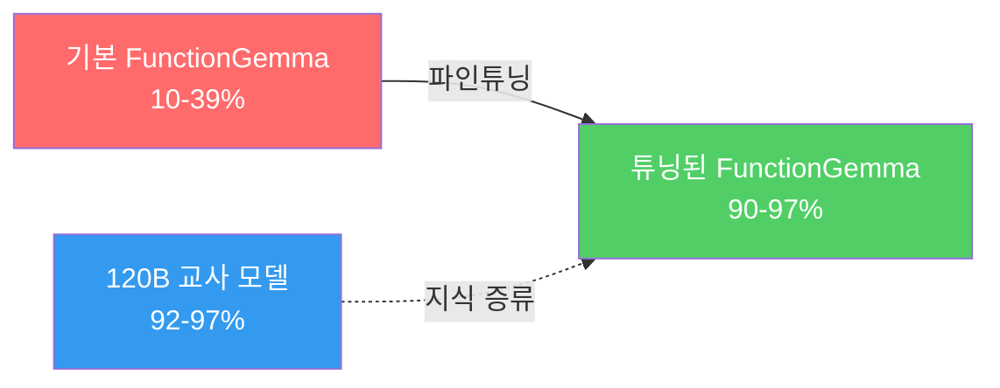

## 개요

Google이 발표한 <strong>FunctionGemma 270M</strong>은 function calling에 특화된 270M 파라미터의 초소형 모델입니다. 스마트폰 CPU에서 125 tok/s로 동작할 수 있을 만큼 가볍지만, 멀티턴 tool calling에서는 기본 정확도가 10-39%에 불과했습니다.

Distil Labs 팀이 이 모델을 <strong>knowledge distillation</strong>으로 파인튜닝한 결과, 120B 교사 모델에 필적하거나 오히려 능가하는 <strong>90-97% 정확도</strong>를 달성했습니다. 모델 크기가 445배 작은데도 말입니다.

이는 "큰 모델만이 답"이라는 스케일링 법칙 신화에 도전하는 강력한 추가 증거입니다.

## 왜 멀티턴이 어려운가

단일 턴 function calling은 비교적 간단합니다. 하지만 멀티턴에서는 다음 문제가 복합적으로 작용합니다:

- <strong>대화 이력 추적</strong>: 이전 function call 결과를 기억해야 함
- <strong>의도 변경 처리</strong>: 대화 중간에 사용자 의도가 바뀌는 경우
- <strong>누적 오류</strong>: 단일 턴 80% 정확도라도 5턴에서는 33%로 급락 (0.8⁵)

기본 FunctionGemma의 5턴 정확도를 계산하면 사실상 사용 불가능한 수준입니다:

| 태스크 | 단일턴 | 5턴 예측 |
|--------|--------|----------|
| 스마트홈 제어 | 38.8% | ~0.9% |
| 뱅킹 음성비서 | 23.4% | ~0.07% |
| 셸 명령 실행 | 9.9% | ~0.001% |

## 파인튜닝 결과

Distil Labs는 120B GPT-oss 교사 모델로부터 knowledge distillation을 수행했습니다. 결과는 놀라웠습니다:

### 태스크별 상세 결과

| 태스크 | 기본 | 튜닝 후 | 교사(120B) |
|--------|------|---------|-----------|
| 스마트홈 제어 | 38.8% | <strong>96.7%</strong> | 92.1% |
| 뱅킹 음성비서 | 23.4% | <strong>90.9%</strong> | 97.0% |
| 셸 명령 실행 | 9.9% | <strong>96.0%</strong> | 97.0% |

<strong>스마트홈 제어와 셸 명령 실행에서는 120B 교사 모델을 초과</strong>하는 성과를 보였습니다. 뱅킹 태스크만 교사에 미치지 못했는데, 14개의 복잡한 함수와 ASR 노이즈가 포함된 가장 난도 높은 태스크였습니다.

## 핵심 인사이트

### 1. 데이터 품질 > 모델 크기

동일한 고품질 데이터셋으로 Qwen3-0.6B와 FunctionGemma 270M 모두 우수한 성능을 달성했습니다. <strong>핵심은 모델 크기가 아니라 태스크에 특화된 고품질 학습 데이터</strong>입니다.

### 2. 445배 작은 모델의 실용적 의미

| 항목 | 120B 교사 | 270M 튜닝 |
|------|----------|----------|
| 파라미터 | 120,000M | 270M |
| 양자화 크기 | ~60GB+ | ~288MB |
| 실행 환경 | GPU 서버 | 스마트폰 CPU |
| 추론 속도 | - | 125 tok/s |

에지 디바이스, 모바일 앱, 브라우저 내 추론 등 <strong>GPU 없이도 production-ready tool calling</strong>이 가능해집니다.

### 3. 스케일링 법칙에 대한 반론

최근 DeepSeek, Qwen 등 오픈소스 모델의 약진과 함께, 이번 결과는 <strong>"파라미터를 늘리는 것만이 성능 향상의 길"이라는 가정에 대한 추가 반론</strong>입니다. 특화된 태스크에서 적절한 파인튜닝은 모델 크기의 한계를 극복할 수 있습니다.

## 오픈소스 리소스

모든 모델과 데이터셋이 공개되어 있어 직접 재현할 수 있습니다:

- <strong>스마트홈 모델</strong>: [distil-labs/distil-home-assistant-functiongemma](https://huggingface.co/distil-labs/distil-home-assistant-functiongemma)
- <strong>스마트홈 데이터</strong>: [distil-labs/distil-smart-home](https://github.com/distil-labs/distil-smart-home)
- <strong>뱅킹 비서 데이터</strong>: [distil-labs/distil-voice-assistant-banking](https://github.com/distil-labs/distil-voice-assistant-banking)
- <strong>셸 명령 데이터</strong>: [distil-labs/distil-SHELLper](https://github.com/distil-labs/distil-SHELLper)

## 결론

FunctionGemma 270M의 파인튜닝 사례는 AI 업계에 중요한 메시지를 던집니다. <strong>270M 파라미터로도 120B 모델을 이길 수 있다</strong>는 것은, 모든 문제에 거대 모델이 필요하지 않다는 뜻입니다.

에지 AI, 모바일 배포, IoT 디바이스 등 제한된 환경에서의 tool calling 수요가 증가하는 가운데, 이런 초소형 특화 모델의 가능성은 더욱 주목받을 것입니다.

## 참고 자료

- [Making FunctionGemma Work: Multi-Turn Tool Calling at 270M Parameters](https://www.distillabs.ai/blog/making-functiongemma-work-multi-turn-tool-calling-at-270m-parameters) — Distil Labs 공식 블로그
- [Reddit 토론](https://www.reddit.com/r/LocalLLaMA/comments/1r6gx75/finetuned_functiongemma_270m_for_multiturn_tool_calling/) — r/LocalLLaMA
- [FunctionGemma 모델 카드](https://huggingface.co/google/functiongemma-270m-it) — HuggingFace
