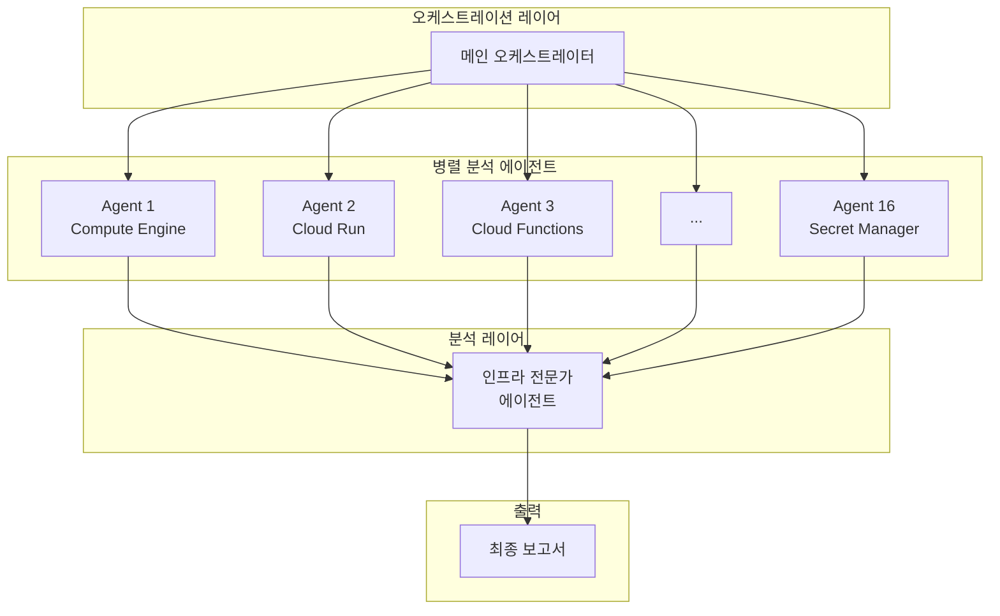
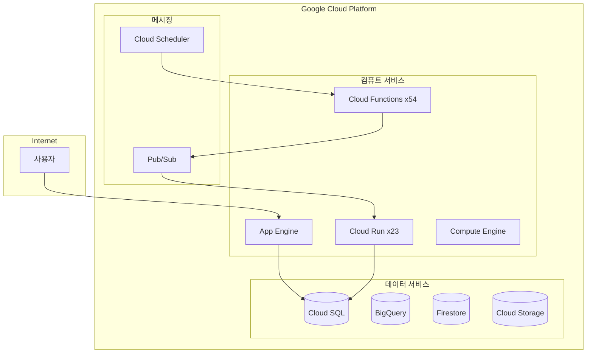

## 개요

클라우드 인프라 관리는 시간이 지날수록 복잡해집니다. 수십 개의 서비스, 수백 개의 리소스, 그리고 끊임없이 변화하는 구성들. 인프라 관리자는 매일 보안 취약점, 비용 낭비, 구성 오류와 싸워야 합니다. 하지만 수동 점검은 시간이 오래 걸리고, 중요한 문제를 놓치기 쉽습니다.

이 문제를 해결하기 위해 <strong>gcloud MCP(Model Context Protocol)</strong>와 AI 에이전트를 활용한 자동화된 인프라 감사 시스템을 구축했습니다. 병렬 에이전트 아키텍처를 통해 16개의 GCP 서비스를 동시에 분석하고, 보안 위험, 비용 최적화 기회, 운영 문제점을 자동으로 식별합니다.

## 문제 배경

### 인프라 관리자의 고충

일반적인 프로덕션 환경에서 인프라 관리자가 직면하는 문제들:

- <strong>서비스 확산</strong>: Cloud Run, Cloud Functions, App Engine, Compute Engine 등 다양한 컴퓨트 서비스가 혼재
- <strong>보안 사각지대</strong>: 환경 변수에 노출된 API 키, 과도하게 열린 방화벽 규칙
- <strong>비용 누수</strong>: 사용하지 않는 리소스, 과잉 프로비저닝된 인스턴스
- <strong>기술 부채</strong>: 지원 종료된 OS, 비권장 런타임 버전

전통적인 접근 방식은 각 서비스를 개별적으로 점검하는 것입니다. 하지만 이는 다음과 같은 한계가 있습니다:

```bash
# 전통적인 방식: 서비스별 순차 점검
gcloud compute instances list
gcloud run services list
gcloud functions list
gcloud sql instances list
# ... 수십 개의 명령어를 수동으로 실행
```

이 방식으로 전체 인프라를 점검하려면 몇 시간, 심지어 며칠이 걸릴 수 있습니다.

### 기존 도구의 한계

Google Cloud의 Security Command Center나 Cloud Asset Inventory도 훌륭한 도구입니다. 하지만:

- 정적인 규칙 기반 탐지에 의존
- 서비스 간 연관 관계 분석이 제한적
- 비즈니스 컨텍스트를 고려한 우선순위 판단이 어려움
- 즉각적인 수정 조치 제안이 부족

## 해결 방법

### gcloud MCP 소개

<strong>MCP(Model Context Protocol)</strong>는 AI 모델이 외부 도구와 상호작용할 수 있게 해주는 프로토콜입니다. gcloud MCP는 Google Cloud CLI를 MCP 서버로 래핑하여 AI 에이전트가 GCP 리소스를 직접 조회하고 관리할 수 있게 합니다.

핵심 장점:

1. <strong>자연어 인터페이스</strong>: 복잡한 gcloud 명령어 대신 자연어로 질의
2. <strong>컨텍스트 인식</strong>: AI가 리소스 간 관계를 이해하고 분석
3. <strong>자동화된 보고서</strong>: 구조화된 분석 결과와 개선 권고사항 생성

### 병렬 에이전트 아키텍처

단일 에이전트로 모든 서비스를 순차적으로 점검하는 대신, 병렬 서브에이전트 패턴을 적용했습니다:



각 서브에이전트는 독립적으로 특정 서비스를 분석합니다:

| 에이전트 | 담당 서비스 | 분석 항목 |
|---------|------------|----------|
| Agent 1 | Compute Engine | VM 상태, OS 버전, 스냅샷 |
| Agent 2 | Cloud Run | 서비스 구성, 환경 변수, 스케일링 |
| Agent 3 | Cloud Functions | 런타임, 트리거, 비밀 정보 |
| Agent 4 | Cloud SQL | 데이터베이스 버전, 백업, 보안 |
| ... | ... | ... |
| Agent 16 | App Engine | 버전 관리, 도메인, 리소스 |

## 구현 단계

### 1단계: gcloud MCP 설정

먼저 gcloud MCP 서버를 설정합니다. Claude Desktop이나 다른 MCP 호환 클라이언트에서 사용할 수 있습니다:

```json
{
  "mcpServers": {
    "gcloud": {
      "command": "npx",
      "args": ["-y", "@anthropics/gcloud-mcp"],
      "env": {
        "GOOGLE_APPLICATION_CREDENTIALS": "/path/to/credentials.json"
      }
    }
  }
}
```

### 2단계: 서비스별 분석 에이전트 정의

각 GCP 서비스에 대해 전문화된 분석 프롬프트를 작성합니다:

```markdown
# Compute Engine 분석 에이전트

## 목표
프로젝트 내 모든 Compute Engine 리소스를 분석하고 보안 및 운영 문제점을 식별합니다.

## 분석 항목
1. VM 인스턴스 목록 및 상태
2. 머신 타입과 리소스 할당
3. OS 이미지 버전 (지원 종료 여부)
4. 디스크 및 스냅샷 구성
5. 네트워크 인터페이스 및 방화벽 규칙
6. 메타데이터 (SSH 키, 시작 스크립트 등)

## 출력 형식
- 리소스 요약 테이블
- 발견된 문제점 목록 (심각도별)
- 권장 조치사항
```

### 3단계: 병렬 실행 오케스트레이션

메인 오케스트레이터가 모든 서브에이전트를 동시에 실행합니다:

```python
# 개념적 코드 예시
async def run_infrastructure_audit():
    agents = [
        Agent("compute-engine", compute_prompt),
        Agent("cloud-run", cloud_run_prompt),
        Agent("cloud-functions", functions_prompt),
        # ... 16개 에이전트
    ]

    # 병렬 실행
    results = await asyncio.gather(*[
        agent.analyze() for agent in agents
    ])

    # 결과 집계
    return aggregate_results(results)
```

### 4단계: 결과 집계 및 보고서 생성

인프라 전문가 에이전트가 모든 결과를 종합하여 우선순위가 지정된 보고서를 생성합니다:

```markdown
# 위험도 평가 기준

## 중대 (즉시 조치 필요)
- 인터넷에 노출된 자격 증명
- 전체 개방된 방화벽 규칙
- 지원 종료된 OS

## 높음 (1주 내 조치)
- 환경 변수의 API 키
- 삭제 보호 미설정
- 백업 없는 데이터베이스

## 중간 (1개월 내 조치)
- 비권장 런타임 버전
- 사용하지 않는 리소스
- 라벨링 미흡
```

## 실전 예제

### 실제 분석 결과 샘플

병렬 에이전트 시스템을 실행하면 다음과 같은 형태의 보고서가 생성됩니다:

#### 인프라 개요

| 카테고리 | 서비스 | 리소스 수 | 상태 |
|---------|--------|---------|------|
| 컴퓨트 | Compute Engine VM | 1 | 주의 필요 |
| 컴퓨트 | Cloud Run 서비스 | 23 | 보안 점검 필요 |
| 컴퓨트 | Cloud Functions | 54 | 런타임 업그레이드 필요 |
| 데이터베이스 | Cloud SQL | 2 | 1개 비활성 |
| 스토리지 | Cloud Storage | 27 | 15개 보안 설정 미흡 |
| 네트워킹 | VPC | 2 | 방화벽 점검 필요 |

#### 발견된 주요 문제점

<strong>보안 취약점 (중대)</strong>

1. <strong>환경 변수에 노출된 API 키</strong>
   - 위치: Cloud Run/Functions 서비스 다수
   - 위험: 자격 증명 탈취 시 서비스 남용 가능
   - 조치: Secret Manager로 즉시 마이그레이션

2. <strong>RDP 포트 전체 개방</strong>
   - 위치: default VPC 방화벽 규칙
   - 위험: 브루트 포스 공격에 노출
   - 조치: 특정 IP 대역으로 제한

3. <strong>지원 종료 OS</strong>
   - 위치: cdp-sftp-prod VM (CentOS 7)
   - 위험: 보안 패치 부재
   - 조치: Rocky Linux 또는 Ubuntu LTS로 마이그레이션

<strong>비용 최적화 기회</strong>

1. <strong>정지된 MySQL 인스턴스</strong>: 스토리지 비용만 발생 중
2. <strong>80개 이상의 App Engine 버전</strong>: 미사용 버전 정리 필요
3. <strong>빈 BigQuery 데이터셋</strong>: 10개 데이터셋 삭제 가능

### 자동 생성된 Mermaid 다이어그램

시스템은 인프라 구조를 시각화하는 Mermaid 다이어그램도 자동 생성합니다:



## 정기 스캔 자동화

### 주기적 감사의 필요성

인프라는 매일 변화합니다. 새로운 서비스가 배포되고, 구성이 변경되며, 새로운 취약점이 발견됩니다. 일회성 감사로는 충분하지 않습니다.

### Cloud Scheduler를 통한 자동화

정기적인 인프라 감사를 자동화할 수 있습니다:

```yaml
# 주간 인프라 감사 스케줄
schedule: "0 9 * * 1"  # 매주 월요일 오전 9시
target:
  type: cloud-function
  function: infrastructure-audit-trigger
notification:
  - email: infra-team@company.com
  - slack: #infra-alerts
```

### 변경 추적 및 트렌드 분석

주기적인 스캔 결과를 저장하면:

- 시간에 따른 보안 상태 변화 추적
- 새로 발생한 문제와 해결된 문제 식별
- 인프라 성장 트렌드 분석
- 컴플라이언스 감사 이력 유지

## 즉각적인 개선 조치

gcloud MCP의 또 다른 강점은 발견된 문제를 즉시 수정할 수 있다는 점입니다.

### 예시: Secret Manager 마이그레이션

환경 변수에 노출된 API 키를 Secret Manager로 마이그레이션:

```bash
# 1. 시크릿 생성
gcloud secrets create openai-api-key --replication-policy="automatic"

# 2. 시크릿 값 설정
echo -n "sk-xxx..." | gcloud secrets versions add openai-api-key --data-file=-

# 3. Cloud Run 서비스 업데이트
gcloud run services update my-service \
  --update-secrets=OPENAI_API_KEY=openai-api-key:latest
```

AI 에이전트는 이러한 수정 명령어를 자동으로 생성하고, 승인 후 실행할 수 있습니다.

### 예시: 방화벽 규칙 강화

```bash
# 위험한 RDP 규칙 삭제
gcloud compute firewall-rules delete allow-rdp-all

# 특정 IP만 허용하는 새 규칙 생성
gcloud compute firewall-rules create allow-rdp-office \
  --allow tcp:3389 \
  --source-ranges="203.0.113.0/24" \
  --target-tags="windows-server"
```

## 결론

gcloud MCP와 병렬 에이전트 아키텍처를 결합하면:

- <strong>시간 절약</strong>: 수동으로 며칠 걸리던 감사를 몇 분 만에 완료
- <strong>일관성</strong>: 동일한 기준으로 반복 가능한 점검
- <strong>포괄성</strong>: 서비스 간 연관 관계까지 분석
- <strong>즉시 조치</strong>: 발견된 문제에 대한 수정 명령어 자동 생성

인프라 관리자는 반복적인 점검 작업에서 해방되어 더 중요한 아키텍처 결정과 전략적 업무에 집중할 수 있습니다.

### 다음 단계

1. <strong>gcloud MCP 설치</strong>: [GitHub 저장소](https://github.com/anthropics/gcloud-mcp)에서 시작
2. <strong>분석 에이전트 커스터마이징</strong>: 조직의 보안 정책과 컴플라이언스 요구사항에 맞게 조정
3. <strong>정기 스캔 설정</strong>: Cloud Scheduler로 주간/월간 자동 감사 구성
4. <strong>알림 통합</strong>: Slack, Email, PagerDuty 등과 연동하여 즉시 대응

클라우드 인프라 관리의 새로운 패러다임, AI 에이전트와 함께 시작해보세요.
