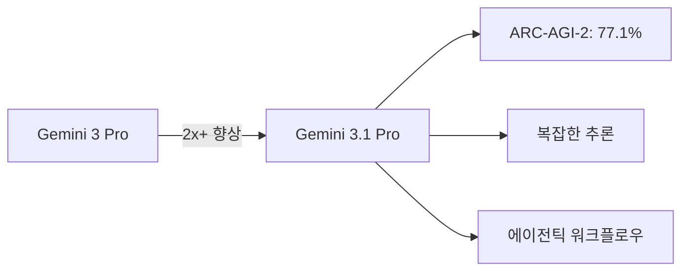
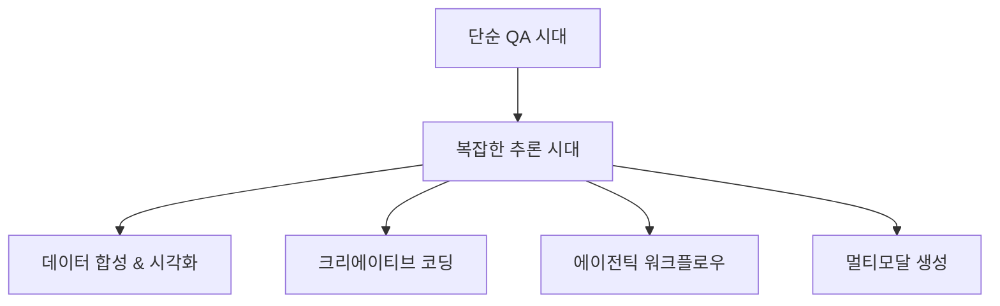

## 개요

2026년 2월 19일, Google이 <strong>Gemini 3.1 Pro</strong>를 공개했습니다. Hacker News에서 391포인트를 기록하며 큰 관심을 받고 있는 이 모델은, 이전 세대인 Gemini 3 Pro 대비 추론 성능이 <strong>2배 이상</strong> 향상되었습니다. 이번 포스트에서는 Gemini 3.1 Pro의 핵심 성능 지표, Claude와의 비교, 그리고 멀티모달 진화에 대해 분석합니다.

## 핵심 성능 분석

### ARC-AGI-2 벤치마크: 77.1% 달성

Gemini 3.1 Pro의 가장 주목할 만한 성과는 <strong>ARC-AGI-2</strong> 벤치마크에서의 성적입니다. ARC-AGI-2는 모델이 완전히 새로운 논리 패턴을 해결하는 능력을 평가하는 벤치마크로, Gemini 3.1 Pro는 <strong>검증된 점수 77.1%</strong>를 달성했습니다.

이것은 Gemini 3 Pro 대비 <strong>2배 이상</strong>의 추론 성능 향상을 의미합니다. 단순한 점수 향상이 아닌, "단순한 답변으로는 부족한" 복잡한 문제 해결 능력의 근본적인 도약입니다.

### 실전 활용 사례

Google은 Gemini 3.1 Pro의 향상된 추론 능력을 보여주는 4가지 실전 활용 사례를 공개했습니다:

- <strong>코드 기반 애니메이션</strong>: 텍스트 프롬프트만으로 웹사이트용 애니메이션 SVG를 생성. 픽셀이 아닌 코드 기반이라 어떤 크기에서도 선명
- <strong>복잡한 시스템 합성</strong>: ISS 궤도를 시각화하는 실시간 항공우주 대시보드를 API 연동과 함께 구축
- <strong>인터랙티브 디자인</strong>: 3D 찌르레기 군무(murmuration)를 코딩하고 핸드 트래킹과 생성형 사운드스코어를 연동
- <strong>크리에이티브 코딩</strong>: 문학 작품의 분위기를 분석하여 현대적인 웹 인터페이스로 변환

## Claude와의 비교

### 현재 경쟁 구도

Gemini 3.1 Pro의 출시로 AI 모델 경쟁이 더욱 치열해지고 있습니다. Claude 4 Opus/Sonnet과 Gemini 3.1 Pro를 주요 축으로 비교하면:

| 항목 | Gemini 3.1 Pro | Claude 4 Opus |
|------|---------------|---------------|
| ARC-AGI-2 | 77.1% (검증) | 미공개 |
| 접근 방식 | 멀티모달 네이티브 | 텍스트 중심 + 도구 활용 |
| 이미지 생성 | 내장 지원 | 외부 도구 연동 |
| 코드 실행 | Antigravity 플랫폼 | Artifacts, MCP |
| 에이전트 기능 | Google Antigravity | Claude Code, MCP |

### 각 모델의 강점

<strong>Gemini 3.1 Pro의 강점</strong>:
- 네이티브 멀티모달 (텍스트, 이미지, 코드를 하나의 모델에서)
- Google 생태계와의 깊은 통합 (Vertex AI, Android Studio, NotebookLM)
- ARC-AGI-2 기준 높은 추론 성능

<strong>Claude의 강점</strong>:
- 장문 컨텍스트에서의 정확도와 안정성
- MCP(Model Context Protocol)를 통한 유연한 도구 연동
- 코딩 작업에서의 일관된 품질

## 멀티모달 진화의 의미

### "단순한 답변으로는 부족한" 시대

Gemini 3.1 Pro가 강조하는 메시지는 명확합니다: <strong>"A simple answer isn't enough."</strong> 이는 AI 모델의 발전 방향이 단순 QA에서 복잡한 문제 해결로 전환되고 있음을 보여줍니다.

### 개발자 생태계 확장

Gemini 3.1 Pro는 다양한 플랫폼에서 접근 가능합니다:

- <strong>개발자</strong>: Google AI Studio, Gemini CLI, Google Antigravity, Android Studio
- <strong>엔터프라이즈</strong>: Vertex AI, Gemini Enterprise
- <strong>소비자</strong>: Gemini 앱, NotebookLM

특히 <strong>Google Antigravity</strong>라는 에이전틱 개발 플랫폼의 등장은 주목할 만합니다. 이는 Anthropic의 MCP 생태계와 직접 경쟁하는 포지션입니다.

## 실전 시사점

### 개발자를 위한 핵심 포인트

1. <strong>모델 선택 전략 재고</strong>: 복잡한 추론이 필요한 작업에서는 Gemini 3.1 Pro를 적극 고려할 가치가 있습니다
2. <strong>멀티모달 워크플로우 설계</strong>: 텍스트 → 코드 → 시각화를 하나의 파이프라인으로 구성 가능
3. <strong>에이전트 개발 플랫폼 비교</strong>: Antigravity vs MCP vs LangChain 등 에이전트 프레임워크 비교 검토 필요

### 주의할 점

- 아직 <strong>프리뷰</strong> 단계이므로 프로덕션 배포에는 신중한 평가가 필요합니다
- 벤치마크 점수가 실전 성능을 완벽히 대변하지는 않습니다
- Google AI Pro/Ultra 유료 플랜 사용자에게 우선 제공됩니다

## 결론

Gemini 3.1 Pro는 Google이 AI 경쟁에서 확실한 전진을 이룬 모델입니다. ARC-AGI-2에서 77.1%라는 인상적인 성적과 실전 활용 사례들은 "추론 능력"이라는 차세대 AI의 핵심 경쟁력에서 의미 있는 성과를 보여줍니다.

다만, Claude와의 비교에서 보듯 각 모델은 고유한 강점이 있으며, 실제 업무 환경에서의 성능은 벤치마크와 다를 수 있습니다. 개발자 관점에서는 두 생태계를 모두 활용하는 전략이 현재로서는 가장 현명한 선택일 것입니다.

## 참고 자료

- [Google Blog - Gemini 3.1 Pro 공식 발표](https://blog.google/innovation-and-ai/models-and-research/gemini-models/gemini-3-1-pro/)
- [Google AI Studio](https://aistudio.google.com/)
- [Google Antigravity](https://antigravity.google/)
- [Vertex AI - Gemini 3.1 Pro](https://cloud.google.com/blog/products/ai-machine-learning/gemini-3-1-pro-on-gemini-cli-gemini-enterprise-and-vertex-ai)
