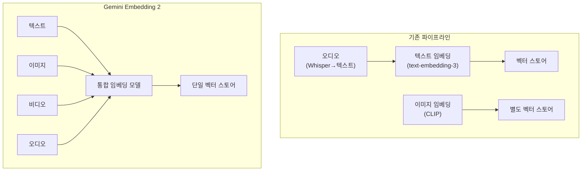
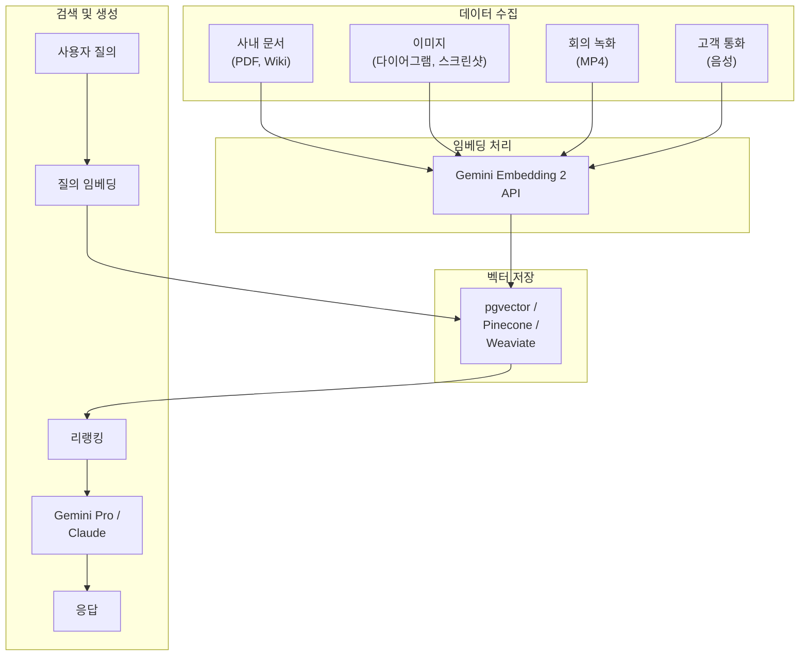

## 왜 멀티모달 임베딩인가

2026년 3월 10일, Google이 <strong>Gemini Embedding 2</strong>를 발표했다. "우리의 첫 네이티브 멀티모달 임베딩 모델"이라는 설명이 붙었다. 텍스트, 이미지, 비디오, 오디오, 문서를 <strong>하나의 벡터 공간</strong>에 매핑하는 모델이다.

[기존 RAG 파이프라인](/ko/blog/ko/dena-llm-study-part4-rag)의 가장 큰 제약은 텍스트만 다룰 수 있다는 점이었다. 사내 위키에 다이어그램이 있어도, 제품 매뉴얼에 스크린샷이 포함되어 있어도, 임베딩 단계에서 전부 무시됐다. 결과적으로 사용자 질문의 맥락에 맞는 정보가 있음에도 검색되지 않는 상황이 반복됐다.

Gemini Embedding 2는 이 문제를 근본적으로 해결한다.

---

## Gemini Embedding 2 핵심 스펙

### 입력 모달리티

| 모달리티 | 지원 범위 | 제한 사항 |
|---------|---------|----------|
| 텍스트 | 최대 8,192 토큰 | 100+ 언어 지원 |
| 이미지 | 요청당 최대 6장 | PNG, JPEG |
| 비디오 | 최대 120초 | MP4, MOV |
| 오디오 | 네이티브 처리 | 중간 텍스트 변환 불필요 |
| 문서 | PDF 등 복합 문서 | 텍스트+이미지 혼합 처리 |

### 출력 차원

기본 출력은 3,072차원 벡터다. 여기서 핵심은 <strong>Matryoshka Representation Learning(MRL)</strong>을 적용했다는 점이다. 마트료시카 인형처럼 정보가 중첩 구조로 배치되어 있어서, 차원을 줄여도 상위 차원에 핵심 정보가 보존된다.

```
3072차원 (최고 정밀도)
 └── 1536차원 (고정밀)
      └── 768차원 (범용)
           └── 256차원 (경량, 모바일/엣지)
```

이것이 실무에서 중요한 이유는 <strong>비용과 정확도의 트레이드오프</strong>를 유연하게 조절할 수 있기 때문이다. 수백만 문서를 인덱싱할 때는 256차원으로 1차 필터링하고, 상위 후보에 대해 3,072차원으로 리랭킹하는 2단계 전략이 가능하다.

### API 접근 경로

두 가지 게이트웨이를 제공한다:

- <strong>Gemini API (AI Studio)</strong>: 프로토타이핑과 개인 개발자용. 무료 티어 포함.
- <strong>Vertex AI (Google Cloud)</strong>: 엔터프라이즈 스케일. VPC-SC, CMEK, IAM 통합.

---

## 기존 임베딩 모델과의 비교

### 단일 모달 vs 멀티모달



기존 접근법의 문제점 세 가지:

1. <strong>파이프라인 복잡도</strong>: 모달리티별 별도 모델, 별도 스토어, 별도 검색 로직이 필요했다
2. <strong>크로스모달 검색 불가</strong>: "이 다이어그램과 관련된 코드를 찾아줘"라는 질의가 불가능했다
3. <strong>중간 변환 손실</strong>: 오디오→텍스트 변환 시 뉘앙스와 맥락이 소실됐다

### 주요 임베딩 모델 스펙 비교

| 모델 | 모달리티 | 최대 차원 | MRL | 가격(100만 토큰) |
|------|---------|----------|-----|-----------------|
| OpenAI text-embedding-3-large | 텍스트만 | 3,072 | O | $0.13 |
| Cohere embed-v4 | 텍스트+이미지 | 1,024 | O | $0.10 |
| <strong>Gemini Embedding 2</strong> | <strong>텍스트+이미지+비디오+오디오</strong> | <strong>3,072</strong> | <strong>O</strong> | <strong>무료(미리보기)</strong> |
| Voyage AI voyage-3 | 텍스트만 | 1,024 | X | $0.06 |

Gemini Embedding 2의 차별점은 명확하다. <strong>유일하게 4가지 모달리티를 네이티브로 지원</strong>하면서, 출력 차원도 최상위급이고, 현재 미리보기 기간 중 무료다.

---

## 실전 적용: 멀티모달 RAG 파이프라인 구축

### 아키텍처 설계



### 코드 예제: Python SDK 활용

```python
from google import genai

# 클라이언트 초기화
client = genai.Client(api_key="YOUR_API_KEY")

# 텍스트 임베딩
text_result = client.models.embed_content(
    model="gemini-embedding-exp-03-07",
    contents=["사내 보안 정책 문서의 핵심 조항"],
    config={
        "output_dimensionality": 768,  # MRL로 차원 축소
        "task_type": "RETRIEVAL_DOCUMENT"
    }
)
print(f"텍스트 벡터 차원: {len(text_result.embeddings[0].values)}")
# 출력: 텍스트 벡터 차원: 768

# 이미지 임베딩 (동일한 벡터 공간)
from google.genai import types

image = types.Part.from_uri(
    file_uri="gs://my-bucket/architecture-diagram.png",
    mime_type="image/png"
)
image_result = client.models.embed_content(
    model="gemini-embedding-exp-03-07",
    contents=[image]
)

# 텍스트와 이미지 벡터 간 코사인 유사도 계산 가능
import numpy as np

def cosine_similarity(a, b):
    return np.dot(a, b) / (np.linalg.norm(a) * np.linalg.norm(b))

similarity = cosine_similarity(
    text_result.embeddings[0].values,
    image_result.embeddings[0].values
)
print(f"텍스트-이미지 유사도: {similarity:.4f}")
```

### Task Type 활용 전략

Gemini Embedding 2는 `task_type` 파라미터로 임베딩 목적을 지정할 수 있다:

| Task Type | 용도 | 적용 시나리오 |
|-----------|------|-------------|
| `RETRIEVAL_DOCUMENT` | 문서 인덱싱 | RAG 문서 저장 시 |
| `RETRIEVAL_QUERY` | 질의 인코딩 | 사용자 검색 질의 처리 시 |
| `SEMANTIC_SIMILARITY` | 유사도 비교 | 중복 문서 탐지, 클러스터링 |
| `CLASSIFICATION` | 분류 | 문서 자동 분류, 라벨링 |
| `CLUSTERING` | 클러스터링 | 토픽 모델링, 그룹화 |

<strong>실무 팁</strong>: 인덱싱과 검색 시 반드시 다른 task_type을 사용해야 한다. 문서 저장 시 `RETRIEVAL_DOCUMENT`, 질의 시 `RETRIEVAL_QUERY`를 사용하면 비대칭 검색 성능이 크게 향상된다.

---

## EM/CTO 관점: 도입 시 고려사항

### 1. 파이프라인 단순화 = 운영 비용 절감

멀티모달 임베딩 도입의 가장 직접적인 효과는 <strong>파이프라인 복잡도 감소</strong>다.

기존에 모달리티별로 분리된 임베딩 파이프라인을 운영했다면:
- 모델 3〜4개 → 1개
- 벡터 스토어 2〜3개 → 1개
- 동기화 로직 제거
- 모니터링 대상 축소

Google 공식 블로그에 따르면 일부 고객은 <strong>레이턴시 70% 감소</strong>를 달성했다.

### 2. 벤더 의존성 평가

현재 Gemini Embedding 2는 Google 전용이다. 멀티클라우드 전략을 운영하는 기업이라면 [A2A + MCP 하이브리드 아키텍처](/ko/blog/ko/a2a-mcp-hybrid-architecture-production-guide) 관점에서 임베딩 레이어를 교체 가능한 인터페이스로 설계하는 것이 장기적으로 유리하다:

- <strong>임베딩 레이어 추상화</strong>: 임베딩 모델을 교체 가능한 인터페이스로 설계
- <strong>벡터 포맷 호환</strong>: 3,072차원 벡터는 대부분의 벡터 DB에서 호환
- <strong>MRL 활용</strong>: 차원 축소를 통해 다른 모델과의 차원 매칭 가능

### 3. 데이터 거버넌스

멀티모달 데이터를 외부 API로 전송하는 것은 거버넌스 이슈를 수반한다:

- Vertex AI에서는 <strong>VPC Service Controls</strong>로 데이터 경계 설정 가능 ([BigQuery MCP 프리픽스 필터링](/ko/blog/ko/bigquery-mcp-prefix-filtering)처럼 엔터프라이즈 데이터 접근을 세밀하게 제어하는 패턴이 Google 생태계 전반에서 일관성을 갖추고 있다)
- <strong>CMEK(Customer-Managed Encryption Keys)</strong> 지원
- 회의 녹화나 고객 통화 음성은 PII 마스킹 후 임베딩 처리 권장
- Data Residency 요구사항이 있다면 리전 선택 확인 필수

### 4. 비용 모델 예측

현재 미리보기 기간이라 무료이지만, GA(정식 출시) 후에는 과금이 예상된다. 비용 최적화 전략:

```
인덱싱 시: 256차원 (MRL) → 저장 비용 87% 절감 (3072 대비)
1차 검색: 256차원 ANN 검색 → 빠르고 저렴
2차 리랭킹: 3072차원 정밀 비교 → 상위 50건만
```

이 2단계 전략은 수백만 문서 규모에서 비용과 정확도를 동시에 최적화할 수 있다.

---

## 실전 마이그레이션 체크리스트

기존 텍스트 전용 RAG에서 멀티모달 RAG로 전환할 때:

1. <strong>데이터 인벤토리</strong>: 조직 내 비텍스트 데이터(이미지, 비디오, 오디오) 현황 파악
2. <strong>우선순위 선정</strong>: 검색 실패율이 높은 문서 유형부터 멀티모달 인덱싱 적용
3. <strong>벡터 DB 호환성</strong>: 기존 벡터 스토어가 3,072차원을 지원하는지 확인 (pgvector, Pinecone, Weaviate 모두 지원)
4. <strong>A/B 테스트</strong>: 기존 텍스트 전용 임베딩과 멀티모달 임베딩의 검색 정확도를 정량 비교
5. <strong>모니터링</strong>: 크로스모달 검색 비율, 레이턴시, 임베딩 API 호출량 추적
6. <strong>보안 검토</strong>: 멀티모달 데이터의 외부 전송에 대한 보안/컴플라이언스 승인

---

## 결론

Gemini Embedding 2는 단순한 "새 임베딩 모델"이 아니다. <strong>RAG 파이프라인의 아키텍처 패러다임을 바꾸는 전환점</strong>이다.

지금까지 텍스트만 다룰 수 있었던 검색 시스템이 이미지, 비디오, 오디오까지 동일한 벡터 공간에서 통합 검색할 수 있게 됐다. 이것은 기술적 진보일 뿐 아니라, 기업의 비정형 데이터 활용 방식을 근본적으로 바꿀 수 있는 변화다.

Engineering Manager 관점에서의 핵심 액션 아이템:

1. <strong>당장</strong>: 미리보기 기간 중 Gemini API로 PoC 진행 (무료)
2. <strong>1〜2주 내</strong>: 사내 비텍스트 데이터 인벤토리 작성
3. <strong>1개월 내</strong>: 기존 RAG 파이프라인 대비 멀티모달 RAG A/B 테스트 설계

---

## 참고 자료

- [Gemini Embedding 2 공식 발표 블로그](https://blog.google/innovation-and-ai/models-and-research/gemini-models/gemini-embedding-2/)
- [Gemini API 개발자 문서](https://ai.google.dev/gemini-api/docs/models/gemini-embedding-2-preview)
- [Vertex AI Gemini Embedding 2 문서](https://docs.cloud.google.com/vertex-ai/generative-ai/docs/models/gemini/embedding-2)
- [VentureBeat: Gemini Embedding 2 분석 기사](https://venturebeat.com/data/googles-gemini-embedding-2-arrives-with-native-multimodal-support-to-cut)
