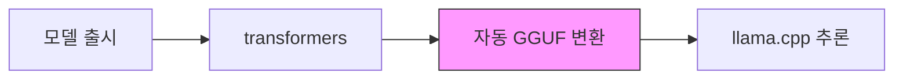
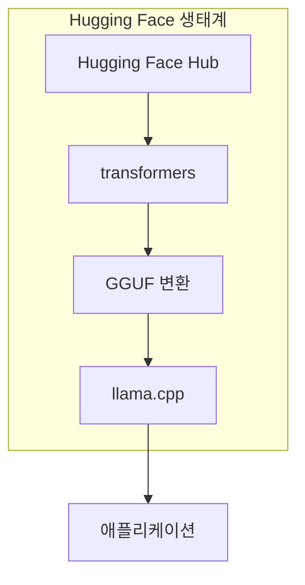

## 개요

2026년 2월, <strong>ggml.ai의 창립 팀이 Hugging Face에 합류</strong>한다는 발표가 나왔습니다. llama.cpp의 창시자 Georgi Gerganov와 핵심 팀이 Hugging Face 소속으로 전환하면서, 로컬 AI 추론 생태계에 구조적 전환점이 도래했습니다.

이번 합류는 단순한 인수합병이 아닙니다. <strong>오픈소스 프로젝트의 지속가능성</strong>과 <strong>로컬 AI 인프라의 미래</strong>에 대한 전략적 결정입니다. Hacker News 616포인트, Reddit r/LocalLLaMA에서 314포인트+166포인트를 기록하며 커뮤니티의 뜨거운 관심을 받았습니다.

## 무엇이 발표되었는가

[공식 발표](https://github.com/ggml-org/llama.cpp/discussions/19759)의 핵심 내용을 정리하면 다음과 같습니다:

- <strong>ggml-org 프로젝트는 오픈소스이며 커뮤니티 주도로 유지</strong>됩니다
- ggml 팀은 계속해서 ggml과 llama.cpp를 풀타임으로 리드, 유지보수, 지원합니다
- 새로운 파트너십은 프로젝트의 장기적 지속가능성을 보장합니다
- Hugging Face [transformers](https://github.com/huggingface/transformers) 라이브러리와의 통합 개선에 추가적인 집중을 기울입니다

## 왜 이 합류가 중요한가

### 1. 오픈소스 지속가능성 문제의 해결

llama.cpp는 2023년 등장 이후 로컬 AI 추론의 사실상 표준이 되었습니다. 하지만 소규모 팀이 이 거대한 프로젝트를 유지하는 것은 지속가능성 측면에서 큰 도전이었습니다. Hugging Face의 리소스가 뒷받침되면서 이 문제가 구조적으로 해결됩니다.

### 2. transformers-ggml 생태계 통합

현재 새로운 모델이 출시되면, transformers 형식에서 GGUF 형식으로의 변환 과정에서 지연과 호환성 이슈가 발생합니다. 공식 발표에서 언급된 <strong>"single-click" 통합</strong>이 실현되면:

- 모델 출시에서 로컬 추론까지의 시간이 대폭 단축됩니다
- GGUF 파일 형식과 Hugging Face Hub의 통합이 더욱 긴밀해집니다
- 양자화 품질 관리가 transformers 레벨에서 이루어질 수 있습니다

### 3. 사용자 경험 개선

발표에서 특히 주목할 부분은 <strong>"casual users"를 위한 배포 단순화</strong>입니다. 이는 llama.cpp가 개발자 도구에서 일반 사용자 인프라로 진화하고 있음을 의미합니다.

## 기존 협업의 성과

Hugging Face 엔지니어들은 이미 llama.cpp에 상당한 기여를 해왔습니다:

| 기여 영역 | 내용 |
|-----------|------|
| 코어 기능 | ggml과 llama.cpp의 핵심 기능 구현 |
| 추론 서버 | UI를 갖춘 견고한 추론 서버 구축 |
| 멀티모달 | llama.cpp에 멀티모달 지원 도입 |
| 인프라 통합 | HF Inference Endpoints에 llama.cpp 통합 |
| GGUF 호환성 | HF 플랫폼과 GGUF 형식 호환성 개선 |
| 모델 아키텍처 | 다수의 모델 아키텍처 구현 |

특히 [@ngxson](https://github.com/ngxson)과 [@allozaur](https://github.com/allozaur)의 기여가 크게 언급되었습니다.

## 커뮤니티 반응과 우려

### 긍정적 반응

- 프로젝트의 장기적 안정성 확보에 대한 안도
- transformers 통합으로 새 모델 지원 속도 향상에 대한 기대
- Hugging Face의 오픈소스 친화적 트랙 레코드에 대한 신뢰

### 우려 사항

- 기업 합류 후 오픈소스 프로젝트의 독립성 유지 여부
- 상업적 이해관계가 기술적 의사결정에 미치는 영향
- 커뮤니티 거버넌스의 변화 가능성

## 로컬 AI 생태계에 미치는 영향

이번 합류는 로컬 AI 추론 스택의 수직 통합을 의미합니다:

<strong>모델 저장소 → 모델 정의 → 양자화 → 추론 엔진</strong>까지 하나의 생태계에서 관리되는 구조가 됩니다. 이는 개발자 경험의 대폭 개선을 가져올 수 있지만, 동시에 생태계의 다양성에 대한 논의도 필요합니다.

## 기술적 전망

공식 발표에서 밝힌 향후 기술 목표는 명확합니다:

1. <strong>transformers와의 원클릭 통합</strong>: transformers 프레임워크가 모델 정의의 'source of truth'로 자리잡은 만큼, ggml 생태계와의 호환성 개선이 핵심입니다
2. <strong>사용자 경험 개선</strong>: 클라우드 추론의 대안으로서 로컬 추론이 의미 있는 수준에 도달한 지금, 일반 사용자의 접근성 향상이 중요합니다
3. <strong>오픈소스 초지능</strong>: 장기 비전으로 "open-source superintelligence accessible to the world"를 제시했습니다

## 결론

ggml.ai의 Hugging Face 합류는 로컬 AI 추론 생태계의 <strong>성숙기 진입</strong>을 상징합니다. 개인 프로젝트 수준의 오픈소스가 산업 인프라 수준으로 격상되는 과정에서, 지속가능한 리소스 확보는 필수적인 단계입니다.

llama.cpp 사용자 입장에서는 더 빠른 모델 지원, 더 나은 사용자 경험, 그리고 프로젝트의 장기적 안정성이라는 실질적 혜택이 기대됩니다. 동시에 오픈소스 거버넌스의 독립성이 유지되는지 커뮤니티 차원의 지속적인 관심이 필요합니다.

## 참고 자료

- [공식 발표: ggml.ai joins Hugging Face](https://github.com/ggml-org/llama.cpp/discussions/19759)
- [llama.cpp GitHub](https://github.com/ggml-org/llama.cpp)
- [Hugging Face transformers](https://github.com/huggingface/transformers)
- [ggml GitHub](https://github.com/ggml-org/ggml)
