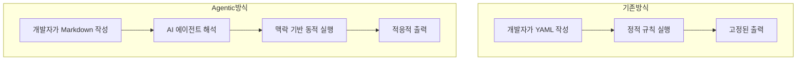
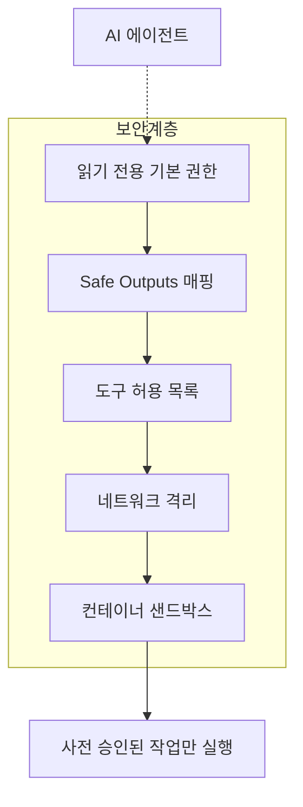
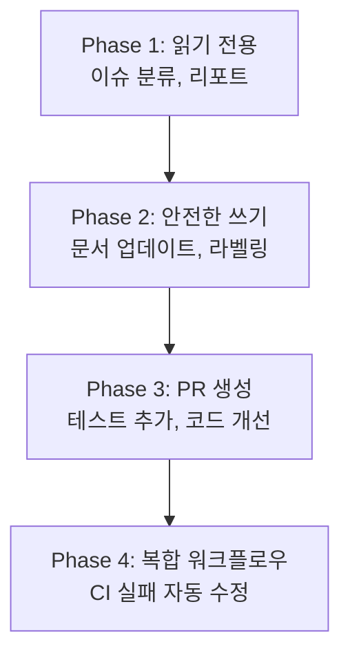

## 개요

2026년 2월 13일, GitHub는 <strong>Agentic Workflows</strong>를 기술 프리뷰로 공개했습니다. CI/CD 파이프라인의 핵심이었던 GitHub Actions에 AI 에이전트를 네이티브로 통합하여, 기존 YAML 기반 자동화가 할 수 없었던 영역까지 자동화할 수 있게 된 것입니다.

이 포스트에서는 Agentic Workflows의 아키텍처, 보안 모델, 6가지 핵심 사용 패턴을 분석하고, Engineering Manager 관점에서 팀 도입 전략을 제시합니다.

## Agentic Workflows란?

Agentic Workflows는 <strong>자연어로 정의한 의도를 AI 에이전트가 실행하는 GitHub Actions 워크플로우</strong>입니다. YAML 대신 Markdown으로 자동화를 기술하고, Copilot·Claude Code·Codex 같은 코딩 에이전트가 실제 작업을 수행합니다.



핵심 차이점은 <strong>규칙 기반</strong>에서 <strong>의도 기반</strong>으로의 전환입니다. 기존에는 "라벨이 bug이면 assignee를 A로 설정"처럼 모든 조건을 명시해야 했지만, 이제는 "이슈를 분석해서 적절한 담당자에게 할당하라"고 의도만 전달하면 됩니다.

## 아키텍처 분석

### 워크플로우 파일 구조

Agentic Workflows는 두 개의 파일로 구성됩니다.

<strong>1. Markdown 파일 (.md)</strong> — 개발자가 작성하는 의도 정의:

````markdown
---
on:
  schedule: daily
permissions: read-only
safe-outputs:
  - type: issue-comment
    params:
      title-prefix: "[Auto]"
  - type: label
    params:
      allowed: ["bug", "feature", "docs"]
tools:
  - github-api
---

# 이슈 자동 분류

새로 생성된 이슈를 분석하여:
1. 내용에 따라 적절한 라벨을 부여하세요
2. 관련 코드 영역을 파악하여 CODEOWNERS 기반으로 담당자를 추천하세요
3. 분류 결과를 코멘트로 남기세요
````

<strong>2. Lock 파일 (.lock.yml)</strong> — CLI가 컴파일한 실행 가능한 Actions 워크플로우:

이 파일은 `gh aw compile` 명령으로 자동 생성되며, 직접 수정하지 않습니다.

### 지원 에이전트

현재 기술 프리뷰에서 지원하는 에이전트는 다음과 같습니다:

| 에이전트 | 특징 | 비용 |
|---------|------|------|
| GitHub Copilot CLI | GitHub 네이티브, 기본 설정 | 실행당 약 2 프리미엄 요청 |
| Claude Code | Anthropic 모델, 복잡한 추론에 강점 | API 키 별도 |
| OpenAI Codex | OpenAI 모델, 코드 생성에 특화 | API 키 별도 |

### 보안 모델: Defense-in-Depth

보안은 Agentic Workflows의 핵심 설계 원칙입니다.



<strong>핵심 보안 원칙</strong>:

- <strong>읽기 전용 기본값</strong>: 에이전트는 리포지토리에 읽기 전용 접근만 가능합니다
- <strong>Safe Outputs</strong>: 쓰기 작업은 사전 정의된 패턴만 허용됩니다 (코멘트, 라벨 등)
- <strong>도구 허용 목록</strong>: 에이전트가 사용할 수 있는 도구를 명시적으로 제한합니다
- <strong>PR 자동 머지 불가</strong>: 인간의 리뷰 권한을 유지합니다

이 모델은 기존 YAML 워크플로우에서 에이전트를 실행할 때보다 훨씬 제한적이지만, 그만큼 안전합니다.

## 6가지 Continuous AI 패턴

GitHub는 이 기능을 <strong>"Continuous AI"</strong>라는 새로운 개념으로 포지셔닝합니다. CI/CD에 AI가 상시적으로 참여하는 패러다임입니다.

### 1. Continuous Triage — 이슈 자동 분류

새로 생성된 이슈를 AI가 분석하여 라벨을 부여하고, CODEOWNERS를 기반으로 적절한 담당자에게 라우팅합니다.

<strong>EM 관점</strong>: 주간 이슈 분류에 평균 2〜3시간을 쓰던 팀이라면, 이 패턴만으로 상당한 시간을 절약할 수 있습니다.

### 2. Continuous Documentation — 문서 자동 동기화

코드 변경이 발생하면 AI가 README와 관련 문서를 자동으로 업데이트합니다.

<strong>EM 관점</strong>: "문서 업데이트를 잊었습니다"라는 PR 코멘트가 사라집니다.

### 3. Continuous Simplification — 코드 개선 제안

AI가 코드베이스를 주기적으로 스캔하여 리팩토링 기회를 발견하고 개선 PR을 생성합니다.

### 4. Continuous Testing — 테스트 커버리지 확장

커버리지를 분석하고 부족한 영역에 대한 테스트를 자동으로 생성합니다.

### 5. Continuous Quality — CI 실패 자동 조사

CI가 실패하면 에이전트가 로그를 분석하고, 원인을 진단하여 수정 PR을 제안합니다.

<strong>EM 관점</strong>: 심야 빌드 실패 시 다음 아침까지 수정 PR이 이미 대기하고 있는 상황을 만들 수 있습니다.

### 6. Continuous Reporting — 리포지토리 건강 리포트

리포지토리의 활동 현황, 기술 부채, 테스트 건강도를 정기적으로 리포트합니다.

## 시작하기: 5분 셋업 가이드

### Step 1: CLI 확장 설치

```bash
gh extension install github/gh-aw
```

### Step 2: 워크플로우 Markdown 작성

`.github/workflows/triage.md` 파일을 생성합니다:

````markdown
---
on:
  issues:
    types: [opened]
permissions: read-only
safe-outputs:
  - type: issue-comment
  - type: label
    params:
      allowed: ["bug", "feature", "enhancement", "docs", "question"]
---

# 이슈 자동 분류

새 이슈가 열리면:
1. 이슈 제목과 본문을 분석하세요
2. 적절한 라벨을 하나 이상 부여하세요
3. 분류 근거를 코멘트로 남기세요
````

### Step 3: 컴파일 및 커밋

```bash
gh aw compile
git add .github/workflows/triage.md .github/workflows/triage.lock.yml
git commit -m "feat: add agentic workflow for issue triage"
git push
```

### Step 4: 시크릿 설정

사용하는 에이전트에 따라 API 키를 리포지토리 시크릿에 추가합니다.

## EM/VPoE 관점: 팀 도입 전략

### 단계적 도입 로드맵



### Phase 1 (1〜2주): 읽기 전용 작업부터

이슈 분류와 리포지토리 리포트처럼 사이드 이펙트가 없는 작업부터 도입합니다. 팀이 AI 에이전트의 판단 품질을 평가하는 시간을 확보하세요.

### Phase 2 (3〜4주): 안전한 쓰기 작업

문서 자동 업데이트와 라벨링처럼 Safe Outputs으로 제한된 쓰기 작업을 추가합니다.

### Phase 3 (1〜2개월): PR 생성

테스트 생성과 코드 개선 PR 생성까지 확장합니다. 이 단계에서는 <strong>반드시 인간 리뷰를 유지</strong>하세요.

### Phase 4 (3개월 이후): 복합 워크플로우

CI 실패 자동 수정처럼 여러 단계가 연결되는 복합 워크플로우를 구성합니다.

### 비용 고려사항

| 항목 | 예상 비용 |
|------|----------|
| Copilot (기본) | 실행당 약 2 프리미엄 요청 |
| Claude Code | API 토큰 사용량 기준 |
| OpenAI Codex | API 토큰 사용량 기준 |
| Actions 실행 시간 | 기존 Actions 과금 기준 |

소규모 팀(5〜10명)이라면 월 $50〜200 수준의 추가 비용으로 시작할 수 있습니다.

## 기존 CI/CD와의 비교

| 구분 | 기존 YAML 워크플로우 | Agentic Workflows |
|------|-------------------|-------------------|
| 정의 방식 | 선언적 YAML | 의도 기반 Markdown |
| 유연성 | 고정 규칙 | 맥락 적응형 |
| 복잡한 판단 | 불가능 | AI 추론 가능 |
| 보안 모델 | 토큰 기반 권한 | 읽기 전용 + Safe Outputs |
| 디버깅 | 로그 확인 | 에이전트 추론 과정 추적 |
| 비용 | Actions 분 단위 | Actions + AI API 비용 |

## 주의사항과 제약

<strong>현재 제약사항</strong>:

- 기술 프리뷰 단계로 프로덕션 사용에는 주의가 필요합니다
- 에이전트의 판단이 항상 정확하지 않으므로 인간 리뷰를 병행해야 합니다
- 비용이 예측하기 어려울 수 있습니다 (입력 토큰 수에 따라 변동)
- 프라이빗 리포지토리에서는 코드 컨텍스트가 에이전트 제공자에게 전송됩니다

<strong>오픈소스</strong>:

MIT 라이선스로 공개되어 있어 커스터마이징이 가능합니다. GitHub Next, Microsoft Research, Azure Core Upstream의 공동 프로젝트입니다.

## 결론

GitHub Agentic Workflows는 CI/CD의 다음 진화 단계를 보여줍니다. "코드를 빌드하고 테스트하라"에서 "코드를 이해하고 개선하라"로의 전환입니다.

EM으로서 주목해야 할 핵심은 세 가지입니다:

1. <strong>점진적 도입이 가능</strong>합니다 — 읽기 전용부터 시작하여 리스크를 최소화할 수 있습니다
2. <strong>보안 설계가 견고</strong>합니다 — Safe Outputs와 읽기 전용 기본값으로 사고를 방지합니다
3. <strong>에이전트 선택이 유연</strong>합니다 — Copilot, Claude, Codex 중 팀에 맞는 것을 선택할 수 있습니다

YAML을 Markdown으로, 규칙을 의도로 바꾸는 이 변화가 2026년 DevOps 팀의 표준이 될 가능성이 높습니다.

## 참고 자료

- [GitHub Blog: Automate repository tasks with GitHub Agentic Workflows](https://github.blog/ai-and-ml/automate-repository-tasks-with-github-agentic-workflows/)
- [GitHub Changelog: Agentic Workflows Technical Preview](https://github.blog/changelog/2026-02-13-github-agentic-workflows-are-now-in-technical-preview/)
- [The New Stack: GitHub Agentic Workflows Overview](https://thenewstack.io/github-agentic-workflows-overview/)
- [InfoQ: GitHub Agentic Workflows Unleash AI-Driven Repository Automation](https://www.infoq.com/news/2026/02/github-agentic-workflows/)
