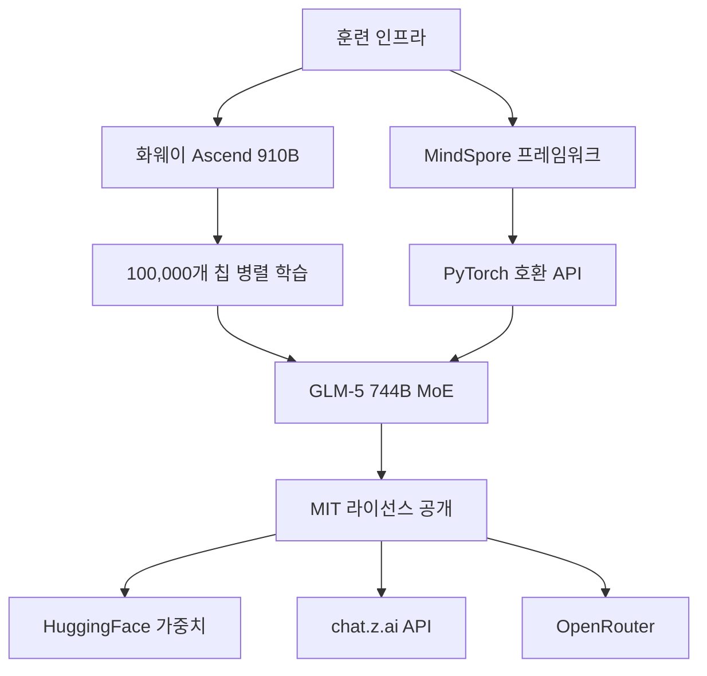
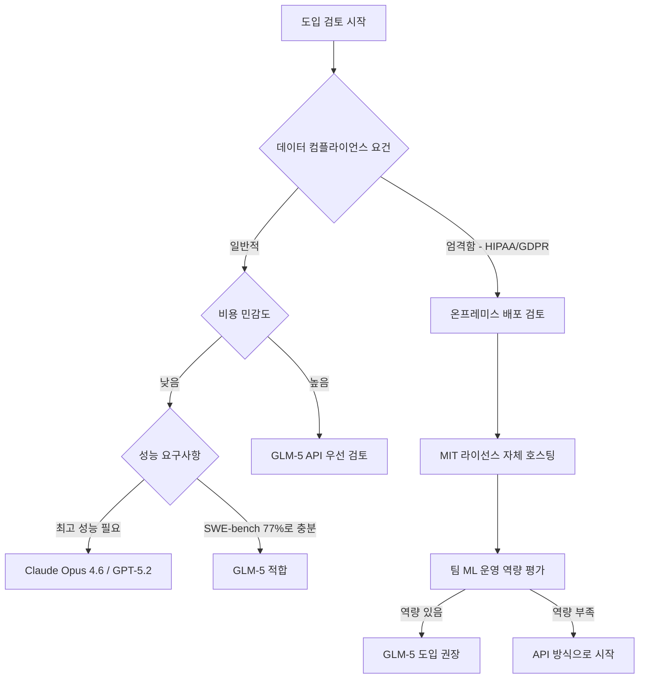

2026년 2월 13일, Zhipu AI(智谱AI)가 744B 파라미터의 GLM-5를 MIT 라이선스로 공개했습니다. 단순한 모델 출시를 넘어, 이 발표는 엔터프라이즈 AI 전략의 근본적인 재검토를 요구하는 사건입니다. NVIDIA GPU 없이 화웨이 Ascend 칩만으로 훈련된 최전선급 모델이 완전한 상업적 자유(MIT 라이선스)와 함께 등장했다는 것은 무엇을 의미할까요?

Engineering Manager, VPoE, CTO 관점에서 GLM-5를 분석하고, 실질적인 엔터프라이즈 도입 전략을 도출해 보겠습니다.

## GLM-5의 핵심 사양

### 기술 아키텍처

GLM-5는 <strong>MoE(Mixture of Experts) 아키텍처</strong>를 채택했습니다. 총 744B 파라미터 중 실제 추론 시에는 40B만 활성화됩니다. 이는 GPT-4급 성능을 훨씬 낮은 추론 비용으로 제공할 수 있는 핵심 설계입니다.

| 항목 | 수치 |
|------|------|
| 총 파라미터 수 | 744B |
| 활성 파라미터 수 | 40B (추론 시) |
| 컨텍스트 윈도우 | 200K 토큰 |
| 훈련 토큰 수 | 28.5T |
| 훈련 하드웨어 | 화웨이 Ascend 910B (100,000개) |
| 훈련 프레임워크 | MindSpore |
| 라이선스 | MIT |

### 벤치마크 성능

```
SWE-bench Verified:   77.8%  (Claude Opus 4.6: 80.9%)
BrowseComp:           75.9
Humanity's Last Exam: 50.4%
Vending-Bench 2:      오픈소스 1위
MCP-Atlas:            오픈소스 1위
```

SWE-bench에서 Claude Opus 4.6(80.9%)의 96% 수준을 달성했습니다. 이것이 오픈소스, MIT 라이선스 모델이라는 점에서 산업의 판도가 달라집니다.

## "NVIDIA 없는 프런티어 AI" — 무엇이 특별한가

GLM-5는 단 하나의 NVIDIA GPU도 사용하지 않았습니다. 100,000개의 화웨이 Ascend 910B 칩과 MindSpore 프레임워크로 훈련되었습니다.



이 사실의 의미:

1. <strong>미국 수출 규제 우회</strong>: BIS(Bureau of Industry and Security)의 AI 칩 수출 규제가 중국 AI 개발을 막지 못했음을 실증
2. <strong>NVIDIA 의존도 탈피</strong>: 프런티어급 AI를 CUDA 생태계 없이 구현 가능
3. <strong>대안 하드웨어 생태계</strong>: Ascend + MindSpore가 실질적인 경쟁 스택으로 부상

EM/CTO 관점에서 이것은 단순한 지정학적 이야기가 아닙니다. 향후 AI 인프라 벤더 다양화 전략의 실질적 근거가 됩니다.

## 엔터프라이즈 관점: 비용 분석

### API 가격 비교 (2026년 3월 기준)

| 모델 | 입력 (1M 토큰) | 출력 (1M 토큰) | 상대 비용 |
|------|---------------|---------------|---------|
| Claude Opus 4.6 | $5.00 | $25.00 | 기준 (1.0x) |
| GPT-5.2 | $6.00 | $24.00 | 약 1.0x |
| GLM-5 (API) | $1.00 | $3.20 | <strong>약 0.15x</strong> |

GLM-5 API는 Claude Opus 4.6 대비 입력 비용 5분의 1, 출력 비용 약 8분의 1입니다. 동등한 성능에서 이 비용 차이는 규모가 커질수록 의사결정에 결정적인 영향을 미칩니다.

### 자체 호스팅(Self-Hosting) 시나리오

MIT 라이선스이기 때문에 기업이 모델 가중치를 직접 다운로드해 온프레미스 또는 프라이빗 클라우드에 배포할 수 있습니다. 데이터 컴플라이언스(개인정보보호법, HIPAA, GDPR 등) 요건이 엄격한 산업에서 이것은 게임 체인저입니다.

```python
# HuggingFace에서 GLM-5 가중치 다운로드 예시
from huggingface_hub import snapshot_download

# MIT 라이선스 — 상업적 사용, 수정, 재배포 모두 허용
model_path = snapshot_download(
    repo_id="zai-org/GLM-5",
    local_dir="./glm5-weights"
)

# OpenAI 호환 API 인터페이스 (기존 코드 마이그레이션 용이)
import openai

client = openai.OpenAI(
    base_url="https://open.bigmodel.cn/api/paas/v4/",
    api_key="YOUR_API_KEY"
)

response = client.chat.completions.create(
    model="glm-5",
    messages=[
        {"role": "user", "content": "Python으로 REST API 작성해줘"}
    ]
)
print(response.choices[0].message.content)
```

## EM/CTO의 도입 판단 기준

모든 워크로드에 GLM-5가 정답은 아닙니다. 다음 기준으로 도입 가능성을 평가하세요.



### 적합한 케이스

<strong>GLM-5가 유리한 상황:</strong>

- 코딩 어시스턴트, 코드 리뷰, 테스트 자동화 (SWE-bench 77.8%)
- 대규모 문서 처리 (200K 컨텍스트)
- 데이터 규정이 엄격한 금융·의료·법률 분야 (MIT 자체 호스팅)
- 스타트업·SMB의 비용 최적화 (Claude Opus 대비 85% 절감)
- AI 에이전트·MCP 워크플로우 (MCP-Atlas 오픈소스 1위)

<strong>기존 상용 모델이 더 나은 상황:</strong>

- 멀티모달 능력이 핵심인 태스크 (Gemini 3.1 Pro 우세)
- 최신 정보 검색이 중요한 실시간 RAG
- 복잡한 추론의 극한 성능 필요 (Claude Opus 4.6 여전히 우위)
- 화웨이 Ascend 기반 모델에 대한 조직적 거부감

## 실전 도입 로드맵

### 1단계: 파일럿 평가 (2〜4주)

```bash
# OpenRouter를 통한 빠른 테스트
curl https://openrouter.ai/api/v1/chat/completions \
  -H "Authorization: Bearer $OPENROUTER_API_KEY" \
  -H "Content-Type: application/json" \
  -d '{
    "model": "zhipuai/glm-5",
    "messages": [{"role": "user", "content": "현재 코드베이스 리뷰 태스크"}]
  }'
```

현재 Claude Opus나 GPT-5.2를 사용하는 워크로드의 10〜20%를 GLM-5로 테스트하고 품질과 비용을 비교합니다.

### 2단계: 워크로드 분류 (4〜8주)

| 워크로드 유형 | 권장 모델 | 이유 |
|-------------|---------|------|
| 코드 생성·리뷰 | <strong>GLM-5</strong> | SWE-bench 77.8%, 비용 효율 |
| 복잡한 추론 | Claude Opus 4.6 | 상위 성능 |
| 대용량 문서 처리 | <strong>GLM-5</strong> | 200K 컨텍스트, 저비용 |
| 실시간 검색 RAG | Gemini 3.1 Pro | 최신 정보 통합 |
| AI 에이전트 | <strong>GLM-5</strong> | MCP-Atlas 1위 |

### 3단계: 비용 최적화 (지속)

```python
# 모델 라우터 패턴: 태스크 복잡도에 따라 자동 라우팅
def route_to_model(task_complexity: str, data_sensitivity: str) -> str:
    if data_sensitivity == "high":
        return "glm-5-local"  # 온프레미스 GLM-5
    elif task_complexity == "simple":
        return "glm-5-api"    # API 비용 최소화
    else:
        return "claude-opus-4-6"  # 복잡한 추론 유지

# 예상 비용 절감
monthly_tokens = 100_000_000  # 월 1억 토큰
claude_cost = monthly_tokens / 1_000_000 * 15  # 평균 $15/1M
glm5_cost = monthly_tokens / 1_000_000 * 2.1   # 평균 $2.1/1M
print(f"월간 절감액: ${claude_cost - glm5_cost:.0f}")  # 약 $1,290 절감
```

## 지정학적 리스크 고려

GLM-5 도입 시 다음 리스크도 함께 검토해야 합니다.

<strong>주요 리스크:</strong>
- 향후 미국 정부가 중국 AI 모델 사용을 제한하는 규정을 도입할 가능성
- Zhipu AI가 상장 기업(上海 A주)이며 중국 법률의 영향을 받음
- MIT 라이선스이지만 화웨이 인프라 기반이라는 공급망 투명성 문제

<strong>리스크 완화 전략:</strong>
- 비즈니스 크리티컬 기능에는 글로벌 벤더(Anthropic, OpenAI)와 GLM-5를 병행
- 핵심 의사결정 AI에는 감사 가능성(Auditability)이 확보된 모델 유지
- 정기적으로 규제 환경 모니터링

## 결론: EM/CTO에게 GLM-5가 의미하는 것

GLM-5의 등장은 세 가지 메시지를 전달합니다.

1. <strong>오픈소스 프런티어 모델 시대</strong>: 상용 모델과 오픈소스의 성능 격차가 사실상 소멸
2. <strong>NVIDIA 독점의 균열</strong>: 화웨이 Ascend로 744B 훈련이 가능함을 증명
3. <strong>비용 압박의 해소</strong>: Claude Opus 대비 85% 비용 절감이 가능한 MIT 모델의 존재

오늘 당장 모든 워크로드를 GLM-5로 전환할 필요는 없습니다. 그러나 코딩 어시스턴트, AI 에이전트, 대용량 문서 처리 같은 영역에서 즉시 파일럿을 시작해볼 충분한 근거가 생겼습니다.

AI 도입에서 "최고 성능 모델을 쓰는 것"이 정답이 아닌 시대가 왔습니다. 이제는 워크로드별 최적 모델을 지능적으로 라우팅하는 것이 엔지니어링 리더의 핵심 역량이 됩니다.

## 참고 자료

- [GLM-5 HuggingFace 모델 카드](https://huggingface.co/zai-org/GLM-5)
- [GLM-5 공식 API 가이드 (Apiyi)](https://help.apiyi.com/en/glm-5-api-guide-744b-moe-agent-tutorial-en.html)
- [China's GLM-5 Rivals GPT-5.2 on Zero Nvidia Silicon (Awesome Agents)](https://awesomeagents.ai/news/glm-5-china-frontier-model-huawei-chips/)
- [GLM-5: China's First Public AI Company Ships a Frontier Model (Medium)](https://medium.com/@mlabonne/glm-5-chinas-first-public-ai-company-ships-a-frontier-model-a068cecb74e3)
- [Zhipu AI 공식 사이트](https://www.zhipuai.cn/en)
