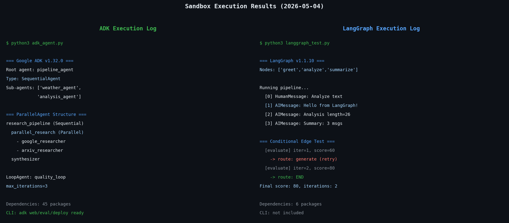

새 AI 에이전트 프레임워크가 나올 때마다 "이번엔 진짜 뭐가 다른가"를 확인하는 게 습관이 됐다. Google이 ADK(Agent Development Kit)를 오픈소스로 공개했을 때도 마찬가지였다. 그래서 이번 주말에 아예 샌드박스 환경을 만들어서 Google ADK v1.32.0과 LangGraph v1.1.10을 나란히 설치하고 코드를 돌려봤다. 이 글은 그 결과 정리다.



## 먼저 두 도구가 어떤 철학으로 만들어졌는지

Google ADK는 "소프트웨어 개발 원칙을 AI 에이전트에 적용한다"는 게 핵심 메시지다. 실제로 사용해보면 그 의미가 명확해진다. ADK는 에이전트를 Python 클래스와 함수로 직접 정의한다. `SequentialAgent`, `ParallelAgent`, `LoopAgent` 같은 내장 오케스트레이터가 있어서, 흐름을 코드 안에서 자연스럽게 선언한다.

```python
from google.adk.agents import Agent, SequentialAgent, ParallelAgent

# 개별 에이전트 정의
weather_agent = Agent(
    name="weather_agent",
    model="gemini-2.5-flash",
    instruction="Get weather data using the get_weather tool.",
    tools=[get_weather],
)

analysis_agent = Agent(
    name="analysis_agent",
    model="gemini-2.5-flash",
    instruction="Analyze the weather data and give a forecast.",
)

# 순서 실행: weather → analysis
pipeline = SequentialAgent(
    name="weather_pipeline",
    sub_agents=[weather_agent, analysis_agent],
)
```

별도의 그래프 정의나 엣지 선언 없이, Python 코드가 그대로 흐름을 표현한다.

LangGraph는 방향이 다르다. 에이전트 워크플로우를 **명시적인 그래프**로 모델링한다. 노드는 처리 단계를 의미하고, 엣지는 노드 간의 전이를 정의한다. 그래프를 먼저 설계하고, 그 위에 로직을 얹는 방식이다.

```python
from typing import TypedDict, Annotated
from langgraph.graph import StateGraph, END
from langgraph.graph.message import add_messages
from langchain_core.messages import HumanMessage, AIMessage

class State(TypedDict):
    messages: Annotated[list, add_messages]

def greet_node(state: State):
    return {"messages": [AIMessage(content="Hello from LangGraph!")]}

def analyze_node(state: State):
    last = state["messages"][-1].content
    return {"messages": [AIMessage(content=f"Analysis: {last}")]}

builder = StateGraph(State)
builder.add_node("greet", greet_node)
builder.add_node("analyze", analyze_node)
builder.set_entry_point("greet")
builder.add_edge("greet", "analyze")
builder.add_edge("analyze", END)

graph = builder.compile()
```

나는 이 두 방식이 같은 문제를 다르게 해결한다고 본다. ADK는 "파이프라인을 코드로 조립한다", LangGraph는 "상태 기계를 설계한다". 어느 쪽이 더 낫다기보다 어떤 상황에서 더 자연스러운가의 문제다.

## 실제로 설치해보니: 의존성 무게가 완전히 다르다

```bash
pip install google-adk langgraph
```

이 한 줄로 둘 다 설치되긴 하는데, 설치 후 `pip show`로 의존성을 확인하면 꽤 충격적이다.

**Google ADK v1.32.0 직접 의존성 (45개)**:
```
aiosqlite, anyio, authlib, click, fastapi,
google-api-python-client, google-auth,
google-cloud-aiplatform, google-cloud-bigquery,
google-cloud-bigquery-storage, google-cloud-bigtable,
google-cloud-dataplex, google-cloud-discoveryengine,
google-cloud-pubsub, google-cloud-secret-manager,
google-cloud-spanner, google-cloud-speech,
google-cloud-storage, google-genai, graphviz,
httpx, jsonschema, mcp, opentelemetry-api,
opentelemetry-exporter-gcp-logging,
opentelemetry-exporter-gcp-monitoring,
opentelemetry-exporter-gcp-trace,
opentelemetry-exporter-otlp-proto-http,
opentelemetry-resourcedetector-gcp,
opentelemetry-sdk, pyarrow, pydantic,
python-dateutil, python-dotenv, pyyaml,
requests, sqlalchemy, sqlalchemy-spanner,
starlette, tenacity, typing-extensions,
tzlocal, uvicorn, watchdog, websockets
```

**LangGraph v1.1.10 직접 의존성 (6개)**:
```
langchain-core, langgraph-checkpoint,
langgraph-prebuilt, langgraph-sdk,
pydantic, xxhash
```

39개 차이다. ADK가 무거운 이유는 명확하다. Google Cloud 스택(BigQuery, Spanner, Pub/Sub, Speech 등)을 처음부터 포함하기 때문이다. OpenTelemetry 내보내기, FastAPI 기반 서버, SQLAlchemy ORM까지 내장되어 있다.

솔직히 처음 봤을 때 좀 과하다고 느꼈다. ADK로 간단한 에이전트를 만들고 싶은데 Google Cloud Spanner 드라이버까지 같이 딸려오는 건 좀 아니다 싶다. Google Cloud를 쓰지 않는 프로젝트라면 이 의존성들이 전부 죽은 무게다.

LangGraph 쪽은 반대로 "필요한 것만 가져다 써라" 철학이다. LLM 클라이언트도 직접 주입하고, 체크포인트 백엔드도 선택한다. 가볍지만 그만큼 세팅할 게 많다.

## 멀티에이전트 패턴 비교 — 병렬 실행과 조건부 분기

두 프레임워크의 차이가 가장 선명하게 드러나는 지점이 바로 여기다.

**ADK의 병렬 실행**: 내가 직접 실행한 코드다.

```python
from google.adk.agents import Agent, ParallelAgent, SequentialAgent

# 병렬로 실행할 리서처들
google_researcher = Agent(
    name="google_researcher",
    model="gemini-2.5-flash",
    tools=[search_google],
    instruction="Search Google and return results."
)
arxiv_researcher = Agent(
    name="arxiv_researcher",
    model="gemini-2.5-flash",
    tools=[search_arxiv],
    instruction="Search arXiv and return results."
)

# 병렬 → 합성 순서
parallel_research = ParallelAgent(
    name="parallel_research",
    sub_agents=[google_researcher, arxiv_researcher],
)

pipeline = SequentialAgent(
    name="research_pipeline",
    sub_agents=[parallel_research, synthesizer],
)
```

실행하면 `pipeline_agent (SequentialAgent)` → `parallel_research (ParallelAgent)` → `synthesizer` 순으로 흐른다. 직관적이고 읽기 쉽다.

**LangGraph의 조건부 분기**: ADK에는 없는 기능이다.

```python
def should_retry(state: State) -> str:
    if state.get("quality_score", 0) < 80:
        return "generate"  # 품질 미달 → 재생성
    return END              # 품질 통과 → 종료

builder.add_conditional_edges("evaluate", should_retry)
```

이걸 실제로 돌려봤더니:

```
=== LangGraph 조건부 엣지 실행 결과 ===
  [evaluate] iteration=1, score=60  → generate로 라우팅
  [evaluate] iteration=2, score=80  → END로 라우팅
최종 score: 80
총 반복 횟수: 2
```

품질 점수가 기준을 넘을 때까지 자동으로 재시도한다. ADK의 `LoopAgent`도 반복을 지원하지만, 종료 조건이 `max_iterations`에 의존한다. 동적으로 "이 조건이 맞으면 여기로, 아니면 저기로" 하는 분기 로직은 LangGraph의 조건부 엣지가 훨씬 강력하다.

이 차이가 실무에서 언제 중요해지냐면, 생성-검증-재생성 루프(RLHF 스타일 파이프라인), 라우터 에이전트, 멀티-판단 분기 같은 경우다. 복잡한 제어 흐름이 필요한 프로덕션 파이프라인에서는 LangGraph가 더 유리하다.

## ADK의 차별점 — CLI와 내장 평가 프레임워크

ADK를 설치하면 `adk` CLI가 함께 설치된다. 이게 예상보다 꽤 쓸 만했다.

```
$ adk --help
Commands:
  api_server   Starts a FastAPI server for agents.
  conformance  Conformance testing tools for ADK.
  create       Creates a new app in the current folder with prepopulated...
  deploy       Deploys agent to hosted environments.
  eval         Evaluates an agent given the eval sets.
  eval_set     Manage Eval Sets.
  migrate      ADK migration commands.
  optimize     Optimizes the root agent instructions using the GEPA...
  run          Runs an interactive CLI for a certain agent.
  web          Starts a FastAPI server with Web UI for agents.
```

특히 `adk web`이 흥미롭다. 에이전트 코드 경로를 지정하면 FastAPI 기반 웹 UI가 자동으로 뜬다. 로컬에서 에이전트를 시각적으로 테스트할 수 있다. `adk eval`은 별도의 평가 세트 파일을 정의하면 에이전트를 자동으로 평가한다. LangGraph에는 이런 내장 CLI가 없다.

`adk deploy`는 Google Cloud Run이나 Vertex AI Agent Builder로 직접 배포를 지원한다. Google Cloud 사용자라면 개발에서 배포까지 같은 도구 안에서 끝낼 수 있다.

반대로 이 CLI들이 완전히 Google 생태계에 묶여있다는 게 아쉬운 점이다. AWS나 Azure 기반 인프라를 쓰는 팀이라면 `adk deploy`는 그림의 떡이다. 내장 트레이싱도 GCP의 Cloud Trace로 내보내도록 설계되어 있어서, 다른 옵저버빌리티 스택과 연결하려면 별도 설정이 필요하다.

그 부분에서 [Langfuse 같은 독립 LLM 트레이싱 도구](/ko/blog/ko/langfuse-self-hosted-llm-tracing-setup-guide-2026)와의 통합이 더 유연한 LangGraph 쪽이 오히려 편할 수 있다.

## 상태 관리 비교 — 세션 vs 체크포인트

**ADK의 상태 관리**: 세션(Session) 기반이다.

```python
from google.adk.runners import InMemoryRunner
from google.adk.sessions import InMemorySessionService

session_service = InMemorySessionService()
runner = InMemoryRunner(agent=root_agent, app_name="my_app")
```

ADK는 `session_id`를 통해 멀티턴 대화 상태를 유지한다. 프로덕션에서는 `VertexAiSessionService`로 교체해서 영속적인 상태 관리가 가능하다. 에이전트 간 데이터 전달은 공유 `State` 딕셔너리를 통해서 이루어진다.

**LangGraph의 상태 관리**: TypedDict + Checkpoint 기반이다.

```python
from langgraph.checkpoint.memory import MemorySaver

checkpointer = MemorySaver()
graph = builder.compile(checkpointer=checkpointer)

# 특정 스레드의 상태를 이어서 실행
config = {"configurable": {"thread_id": "user-123"}}
result = graph.invoke({"messages": [HumanMessage(content="안녕")]}, config)
```

LangGraph의 체크포인트 시스템이 더 유연하다. `MemorySaver`(인메모리), PostgreSQL, Redis, SQLite 같은 백엔드로 교체할 수 있다. 타임트래블 디버깅(과거 체크포인트로 되돌아가기)도 지원한다.

이 부분에서 LangGraph가 더 강하다고 본다. 체크포인트 백엔드를 교체하기만 하면 개발환경과 프로덕션을 동일한 코드로 운영할 수 있고, 특정 클라우드 벤더에 종속되지 않는다.

ADK도 [MCP 도구 서버](/ko/blog/ko/mcp-server-build-practical-guide-2026)를 내장 지원하는 점은 LangGraph보다 낫다. `MCPToolset`을 바로 가져다 쓸 수 있어서 MCP 서버와의 통합이 훨씬 간단하다. LangGraph에서 MCP를 쓰려면 별도 패키지와 어댑터 코드가 필요하다.

## 핵심 비교표

| 항목 | Google ADK v1.32.0 | LangGraph v1.1.10 |
|------|-------------------|-------------------|
| 직접 의존성 수 | 45개 | 6개 |
| 오케스트레이션 방식 | Sequential/Parallel/LoopAgent (코드 선언) | StateGraph + 노드/엣지 (명시적 그래프) |
| 조건부 분기 | LoopAgent max_iterations (제한적) | conditional_edges (강력) |
| 기본 LLM | Gemini (다른 모델도 가능) | 모델 무관 (LLM 직접 주입) |
| CLI | adk create/run/web/eval/deploy ✓ | 없음 |
| 내장 웹 UI | adk web ✓ | 없음 |
| 내장 평가 프레임워크 | adk eval ✓ | 없음 (별도 도구 필요) |
| MCP 지원 | MCPToolset 내장 ✓ | 별도 패키지 필요 |
| 상태 관리 | 세션 기반 (VertexAI 백엔드) | TypedDict + Checkpoint (백엔드 교체 가능) |
| 배포 | Google Cloud Run / Vertex AI | 클라우드 무관 |
| OpenTelemetry | GCP 내보내기 내장 | 별도 설정 |
| 타임트래블 디버깅 | 없음 | ✓ |
| 멀티 언어 SDK | Python, Go, Java, TypeScript | Python (주력) |
| 라이선스 | Apache 2.0 | MIT |

## 어떤 팀에게 어떤 프레임워크가 맞는가

**Google ADK가 맞는 경우**:

- Google Cloud에 이미 투자한 인프라가 있는 경우
- Gemini 모델을 주력으로 사용하는 경우
- 프로토타이핑부터 배포까지 하나의 도구 체인으로 해결하고 싶을 때
- 에이전트 평가 파이프라인을 별도로 구축하기 싫을 때
- 팀이 Python보다 다른 언어(Go, Java)에 익숙한 경우

**LangGraph가 맞는 경우**:

- 복잡한 분기 로직이 있는 에이전트 워크플로우
- AWS, Azure 또는 멀티클라우드 환경
- OpenAI, Anthropic, Mistral 등 여러 LLM을 혼용하는 경우
- 기존 LangChain 기반 코드베이스가 있는 경우
- 타임트래블 디버깅이나 특정 체크포인트 재실행이 필요한 개발 흐름
- 의존성을 최소화해야 하는 엣지 배포

나는 지금 당장 신규 프로젝트를 시작한다면 LangGraph를 선택할 것 같다. 이유는 하나다. 조건부 분기와 체크포인트 유연성이 프로덕션 수준의 에이전트에서 결국 필요해지는데, 그걸 나중에 추가하기가 어렵다. ADK의 `LoopAgent`로 시작했다가 동적 분기가 필요해지면 구조 자체를 다시 설계해야 할 수 있다.

그렇다고 ADK가 나쁜 건 아니다. 이미 GCP를 쓰는 팀이라면 `adk deploy` 하나로 Cloud Run에 올릴 수 있고, `adk eval`로 회귀 테스트까지 돌릴 수 있다. 그 편의성은 LangGraph 에코시스템에서 따로 구성하면 꽤 번거롭다.

## 실전 시작 가이드 — 각 프레임워크로 첫 에이전트 만드는 법

비교만 하면 별로 의미가 없다. 실제로 어떻게 시작하는지 간단히 짚어두겠다.

**ADK로 시작하는 법**:

`adk create` 명령은 대화형으로 모델을 선택하게 돼 있어서 스크립트 자동화에 적합하지 않다. 대신 직접 디렉터리 구조를 만드는 게 더 낫다.

```bash
mkdir my_agent_project
cd my_agent_project
touch __init__.py
touch agent.py
```

`agent.py` 최소 예제:

```python
from google.adk.agents import Agent

def simple_tool(text: str) -> dict:
    """텍스트를 처리하는 간단한 도구"""
    return {"result": f"Processed: {text}", "length": len(text)}

root_agent = Agent(
    name="my_agent",
    model="gemini-2.5-flash",
    description="간단한 텍스트 처리 에이전트",
    instruction="You are a helpful assistant. Use simple_tool to process text.",
    tools=[simple_tool],
)
```

이후 `adk web .`을 실행하면 로컬 웹 UI가 뜬다. `adk run .`으로 터미널에서 직접 테스트할 수도 있다. 구조가 단순해서 팀에 합류한 사람이 코드를 바로 읽고 이해하기 쉽다.

**LangGraph로 시작하는 법**:

LangGraph는 빈 그래프에서 출발한다.

```python
from typing import TypedDict, Annotated
from langgraph.graph import StateGraph, END
from langgraph.graph.message import add_messages
from langchain_core.messages import HumanMessage, AIMessage
from langchain_openai import ChatOpenAI  # 또는 ChatAnthropic

class AgentState(TypedDict):
    messages: Annotated[list, add_messages]

llm = ChatOpenAI(model="gpt-4o")  # 원하는 LLM으로 교체 가능

def agent_node(state: AgentState):
    response = llm.invoke(state["messages"])
    return {"messages": [response]}

builder = StateGraph(AgentState)
builder.add_node("agent", agent_node)
builder.set_entry_point("agent")
builder.add_edge("agent", END)

graph = builder.compile()

# 실행
result = graph.invoke({
    "messages": [HumanMessage(content="안녕하세요!")]
})
print(result["messages"][-1].content)
```

LangGraph는 `langgraph-cli`라는 별도 패키지로 로컬 개발 서버를 띄울 수 있지만 메인 패키지에 포함되어 있지 않다. 웹 UI도 `LangGraph Studio`를 사용해야 하는데 별도 설치가 필요하다.

간단한 챗봇이라면 둘 다 10분 안에 돌아간다. 하지만 에이전트가 복잡해질수록 LangGraph의 명시적 그래프가 추론하고 디버깅하기 더 쉽다. ADK의 코드 선언 방식은 처음엔 직관적이지만, 중첩된 에이전트가 깊어질수록 실행 흐름을 머릿속에서 추적하기 어려워진다.

## ADK의 MCP 통합과 LangGraph의 생태계 차이

실용적으로 중요한 부분 하나를 더 짚고 싶다. MCP(Model Context Protocol) 지원이다.

[AI 에이전트 생태계에서 MCP는 이제 사실상 표준](/ko/blog/ko/mcp-server-build-practical-guide-2026)이 됐다. ADK는 `MCPToolset`을 내장 지원한다.

```python
from google.adk.tools.mcp_tool import MCPToolset, StdioServerParameters

mcp_tools = MCPToolset(
    connection_params=StdioServerParameters(
        command="python",
        args=["-m", "my_mcp_server"],
    )
)

agent = Agent(
    name="mcp_agent",
    model="gemini-2.5-flash",
    toolsets=[mcp_tools],
    instruction="Use MCP tools to complete tasks."
)
```

서버 실행 파라미터만 지정하면 MCP 도구를 에이전트에 바로 붙일 수 있다. LangGraph에서 같은 걸 하려면 `langchain-mcp-adapters` 같은 써드파티 패키지를 추가로 설치하고 어댑터 코드를 작성해야 한다. 이건 ADK가 확실히 편한 부분이다.

반면 LangGraph의 생태계는 다양하다. `langchain-anthropic`, `langchain-openai`, `langchain-google-genai` 등 LLM 어댑터가 풍부하고, 커뮤니티 도구 통합도 많다. ADK는 Gemini 생태계에 최적화되어 있어서 다른 LLM을 쓰려면 추가 설정이 필요하다. 

[컨텍스트 엔지니어링 관점에서 보면](/ko/blog/ko/context-engineering-production-ai-agents), ADK는 세션 단위의 상태 주입이 기본이고, LangGraph는 그래프 레벨에서 전체 컨텍스트를 TypedDict로 명시한다. 어떤 데이터가 에이전트 간에 흐르는지 추적해야 하는 프로덕션 시스템이라면 LangGraph의 명시적 State 정의가 디버깅에 훨씬 유리하다.

## 마이그레이션 고려사항 — 기존 LangChain 코드베이스가 있다면

이미 LangChain 기반 코드가 있는 팀은 LangGraph 선택이 훨씬 자연스럽다. LangGraph는 LangChain 위에서 동작하도록 설계됐기 때문에, 기존 `ChatOpenAI`, `ChatAnthropic`, `ChatGoogleGenerativeAI` 같은 LLM 래퍼가 그대로 재사용된다. 프롬프트 템플릿, 메모리 클래스, 출력 파서도 호환된다.

반면 ADK는 LangChain 생태계와는 별개로 동작한다. 기존 LangChain 코드를 ADK로 마이그레이션하려면 거의 재작성 수준의 변환이 필요하다. ADK의 `Agent` 클래스는 LangChain의 체인이나 에이전트 추상화와 개념이 달라서 포팅이 쉽지 않다.

ADK를 선택한다면 사실상 새 프로젝트로 시작하는 게 현실적이다. Gemini API와 Google Cloud 서비스를 처음부터 중심에 놓고 설계해야 진가를 발휘한다.

## 관찰 가능성과 디버깅 경험 비교

프로덕션에서 에이전트가 이상 동작할 때 원인을 파악하는 게 얼마나 쉬운지가 실무에서 중요하다.

**ADK의 옵저버빌리티**:
ADK는 OpenTelemetry를 내장하고 GCP의 Cloud Trace, Cloud Monitoring으로 자동 내보내기를 지원한다. 별도 코드 없이 에이전트 실행 타임라인이 GCP 콘솔에서 보인다. Google Cloud를 쓴다면 설정 없이 바로 쓸 수 있는 관점에서 편리하다.

`adk web`으로 뜬 로컬 UI에서도 실행 히스토리와 이벤트 스트림을 확인할 수 있다. 개발 단계에서 에이전트 흐름을 눈으로 보면서 디버깅할 수 있는 게 ADK의 실용적인 장점이다.

**LangGraph의 옵저버빌리티**:
LangGraph는 자체 UI인 LangGraph Studio를 제공한다. 그래프 실행 흐름을 노드 단위로 시각화하고, 특정 체크포인트로 되돌아가서 다시 실행해보는 타임트래블 기능이 특히 유용하다. "왜 이 노드에서 이 방향으로 분기됐지?"를 추적할 때 강력하다.

LangSmith(LangChain의 유료 서비스)와 통합하면 더 상세한 트레이싱이 가능하지만, 유료 플랜이 필요하다. 무료로 쓰려면 OpenTelemetry 설정을 직접 해야 한다.

두 도구 모두 풀스택 옵저버빌리티를 완전히 내장하지는 않는다. GCP 스택을 이미 쓴다면 ADK가 유리하고, 벤더 중립 환경이라면 LangGraph + 별도 오브저버빌리티 도구 조합이 낫다.

## 내 결론 — 설계 철학의 차이가 선택을 결정한다

두 프레임워크 모두 2026년 기준으로 프로덕션에서 쓸 수 있는 수준이다. 하지만 설계 철학이 다르기 때문에 같은 문제도 다르게 풀게 된다.

ADK는 "에이전트 시스템을 빠르게 만들고, GCP에 바로 올린다"에 최적화되어 있다. LangGraph는 "에이전트의 상태 전이를 정밀하게 제어한다"에 최적화되어 있다.

AI 에이전트 프레임워크 비교를 할 때 자주 보는 실수가 있다. 기능 수로 줄 세우는 거다. ADK는 CLI가 있고 eval도 있고 배포도 되니까 더 좋은 게 아니냐고. 근데 내가 생각하는 핵심은 "내 에이전트의 복잡도 증가 방향과 프레임워크의 확장 방향이 일치하는가"다.

단순한 파이프라인이 복잡한 분기로 진화할 예정이라면 LangGraph를 선택하고, Google Cloud 생태계 안에서 빠른 납품이 목표라면 ADK를 선택하라. 그게 내 판단이다.

기존 에이전트 프레임워크 비교가 궁금하다면 [LangGraph vs CrewAI vs Dapr 비교 글](/ko/blog/ko/ai-agent-framework-comparison-2026-langgraph-crewai-dapr-production)도 참고해봐도 좋다. ADK가 등장하기 전에 세 프레임워크를 프로덕션 기준으로 비교한 글인데, LangGraph 선택 맥락을 넓히는 데 도움이 된다.
