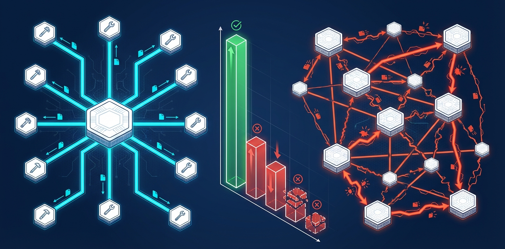
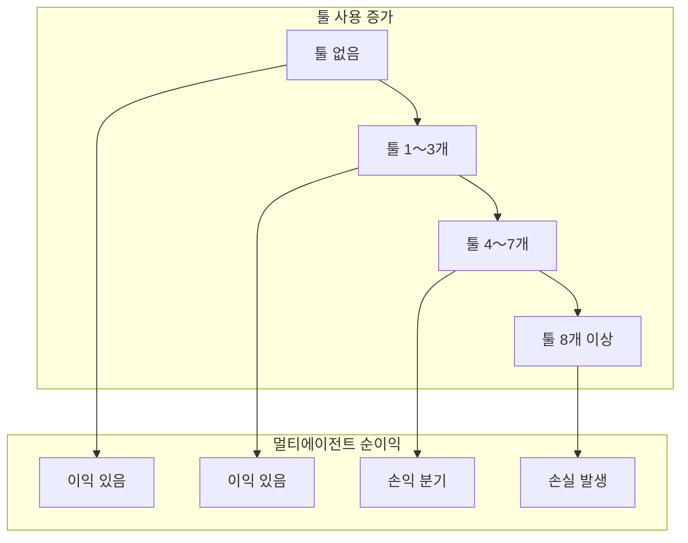

## "에이전트를 더 추가하면 더 좋아진다" — 이 믿음이 틀렸다

2026년 AI 에이전트 분야에는 거의 도그마처럼 굳어진 믿음이 있습니다. <strong>"병렬로 더 많은 에이전트를 투입하면 성능이 오른다."</strong> LangGraph, CrewAI, AutoGen 등 멀티에이전트 프레임워크들이 폭발적으로 성장한 것도, 기업들이 에이전트 팀 구성에 투자를 늘리는 것도 이 가정 위에 서 있습니다.

Google Research는 이 가정을 정면으로 뒤집는 연구를 발표했습니다. <strong>「Towards a Science of Scaling Agent Systems」</strong> 논문은 180개의 에이전트 설정을 정량적으로 평가한 결과, <strong>멀티에이전트 시스템이 특정 조건에서 단일 에이전트 대비 최대 70% 성능을 저하시킨다</strong>는 사실을 발견했습니다.

Engineering Manager 입장에서 이 연구는 단순한 학술 호기심이 아닙니다. 에이전트 아키텍처 설계 의사결정의 근거가 바뀌는 이야기입니다.

---

## 실험 설계: 180개 설정, 5가지 아키텍처, 4개 벤치마크

연구팀은 체계적인 통제 실험을 설계했습니다. 기존 에이전트 연구들이 특정 태스크에서 특정 아키텍처의 성능을 보고하는 데 그쳤다면, 이 연구는 <strong>태스크 유형 × 아키텍처 × LLM 조합</strong>을 모두 교차 검증했습니다.

```mermaid
graph TD
    subgraph 아키텍처 5종
        A1["Single-Agent<br/>(단일)"]
        A2["Independent<br/>(독립)"]
        A3["Centralized<br/>(중앙집중)"]
        A4["Decentralized<br/>(분산)"]
        A5["Hybrid<br/>(하이브리드)"]
    end
    subgraph 벤치마크 4종
        B1["Finance-Agent<br/>(금융추론)"]
        B2["BrowseComp-Plus<br/>(웹탐색)"]
        B3["PlanCraft<br/>(순차계획)"]
        B4["Workbench<br/>(복합작업)"]
    end
    subgraph LLM 3종
        C1["OpenAI GPT"]
        C2["Google Gemini"]
        C3["Anthropic Claude"]
    end
    아키텍처 5종 --> 180개설정[180개 설정 조합]
    벤치마크 4종 --> 180개설정
    LLM 3종 --> 180개설정
```

**5가지 아키텍처 분류:**

- <strong>Single-Agent</strong>: 단일 모델이 모든 작업 수행 (베이스라인)
- <strong>Independent</strong>: 여러 에이전트가 서로 통신 없이 독립 실행
- <strong>Centralized</strong>: 오케스트레이터 에이전트가 하위 에이전트를 지휘 (Hub-and-Spoke)
- <strong>Decentralized</strong>: 에이전트들이 P2P 방식으로 상호 통신
- <strong>Hybrid</strong>: 중앙집중 + 분산의 혼합 구조

평가에는 OpenAI GPT, Google Gemini, Anthropic Claude 세 가지 LLM 패밀리가 사용되어 특정 모델에 편향되지 않은 결과를 도출했습니다.

---

## 핵심 발견 1: 병렬화 가능 vs 순차 — 결과가 정반대다

연구의 가장 충격적인 발견은 <strong>태스크 유형에 따라 멀티에이전트의 효과가 완전히 반전된다</strong>는 것입니다.

### 병렬화 가능 태스크: +81% 향상

금융 추론(Finance-Agent) 벤치마크처럼 <strong>독립적으로 분해 가능한 태스크</strong>에서 중앙집중 멀티에이전트는 단일 에이전트 대비 81% 성능 향상을 보였습니다. 여러 에이전트가 각각 다른 금융 데이터 세그먼트를 병렬 분석하고 결과를 통합하는 구조가 실제로 효과적이었습니다.

### 순차 태스크: -39%〜-70% 저하

그러나 PlanCraft처럼 <strong>엄격한 순서 의존성이 있는 작업</strong>에서는 모든 멀티에이전트 변형이 예외 없이 성능을 저하시켰습니다.

```
단일 에이전트 베이스라인: 100% (기준)

Independent 멀티에이전트: -39%
Centralized 멀티에이전트: -52%
Decentralized 멀티에이전트: -61%
Hybrid 멀티에이전트: -70%
```

연구팀은 이 현상을 <strong>"인지 예산 분절(Cognitive Budget Fragmentation)"</strong>이라 명명했습니다. 순차적 추론에는 전체 문맥을 유지하면서 단계적으로 생각하는 연속적인 인지 자원이 필요한데, 멀티에이전트 조율 오버헤드가 이 자원을 소모해버린다는 것입니다.



---

## 핵심 발견 2: 에러 증폭 — 독립 에이전트는 17.2배 더 위험하다

멀티에이전트 시스템의 또 다른 위험은 <strong>에러 전파</strong>입니다. 연구 결과 에이전트 아키텍처 유형에 따라 에러 증폭률이 크게 달라졌습니다.

| 아키텍처 | 에러 증폭 배율 |
|---------|-------------|
| Single-Agent | 1.0× (기준) |
| Independent 멀티에이전트 | <strong>17.2×</strong> |
| Centralized 멀티에이전트 | <strong>4.4×</strong> |

Independent 아키텍처에서 에러가 17.2배 증폭되는 이유는 명확합니다. 한 에이전트의 잘못된 출력이 다른 에이전트의 입력이 되고, 그 에러가 다음 단계로 전파되는 <strong>에러 캐스케이드</strong>가 발생하기 때문입니다. 중앙집중 구조는 오케스트레이터가 어느 정도 필터링 역할을 하여 4.4배로 증폭을 억제했습니다.

이는 프로덕션 에이전트 시스템 설계에서 중요한 시사점입니다. <strong>독립 병렬 실행이 성능에 유리할 것 같은 상황이라도, 에러 내성 측면에서 심각한 리스크를 수반한다</strong>는 것을 의미합니다.

---

## 핵심 발견 3: 툴 의존도가 높을수록 멀티에이전트 오버헤드 증가

세 번째 원칙은 <strong>"툴-코디네이션 트레이드오프"</strong>입니다. API 호출, 웹 액션, 외부 데이터 조회 등 툴 사용이 많은 태스크일수록, 멀티에이전트 조율 비용이 이익을 초과하는 지점이 빨라집니다.



그 이유는 각 에이전트가 독립적으로 툴을 호출할 때 발생하는 <strong>컨텍스트 동기화 비용</strong> 때문입니다. 에이전트 A가 API를 호출한 결과를 에이전트 B가 알아야 한다면, 이 정보를 공유하는 과정에서 LLM 컨텍스트 윈도우와 추론 비용이 급증합니다.

---

## 예측 프레임워크: 87% 정확도로 최적 아키텍처를 결정한다

이 연구의 실용적 핵심은 <strong>최적 에이전트 아키텍처를 사전 예측하는 모델(R² = 0.513)</strong>입니다. 9가지 예측 변수를 입력하면, 보지 않은 태스크에 대해 87%의 정확도로 최적 아키텍처를 추천합니다.

**예측 변수 9가지:**

1. LLM 기반 성능 수준 (단일 에이전트 베이스라인)
2. 태스크 분해 가능성 점수
3. 순차 의존성 정도
4. 필요한 툴 수
5. 툴 호출 빈도
6. 에이전트 수
7. 코디네이션 복잡도 지수
8. 에러 내성 요구 수준
9. 컨텍스트 공유 필요성

실무에서 이 프레임워크를 완전히 구현하기는 어렵지만, 핵심 변수만으로도 의사결정을 상당히 개선할 수 있습니다.

---

## Engineering Manager를 위한 실전 판단 기준

이 연구를 바탕으로 에이전트 아키텍처 선택을 위한 실용적 체크리스트를 정리했습니다.

### 단일 에이전트를 사용해야 할 때

```
✅ 작업이 엄격한 순서를 요구하는가?
   (예: 코드 분석 → 리팩토링 → 테스트 → 배포 순서로만 가능)

✅ 전체 컨텍스트를 일관되게 유지해야 하는가?
   (예: 긴 문서 요약, 복잡한 추론 체인)

✅ 각 단계 결과가 다음 단계 입력에 강하게 의존하는가?
   (예: 이전 스텝 결과가 없으면 다음 스텝 불가능)

✅ 에러 내성이 중요하며 에러 전파 리스크를 최소화해야 하는가?

→ 단일 강력한 모델 사용
```

### 멀티에이전트(중앙집중)를 사용해야 할 때

```
✅ 작업이 독립적인 서브태스크로 분해 가능한가?
   (예: 여러 문서를 각각 분석 후 종합)

✅ 병렬 처리로 속도 향상이 필요한가?

✅ 각 서브태스크에 전문화된 처리가 필요한가?
   (예: 코드 에이전트 + 문서 에이전트 + 테스트 에이전트)

✅ 에러 전파를 제어할 오케스트레이터를 설계할 수 있는가?

→ 중앙집중 멀티에이전트 사용, Independent는 지양
```

### 멀티에이전트를 피해야 할 때

```
❌ 단일 에이전트 베이스라인이 이미 ~45% 이상 성능인가?
   (성능 포화 현상 — 멀티에이전트 추가 이득 없음)

❌ 작업에 필요한 툴이 8개 이상인가?
   (툴-코디네이션 트레이드오프 초과)

❌ 순차적 추론이 필수인 태스크인가?
   (인지 예산 분절 위험)

→ 단일 에이전트 또는 간단한 순차 파이프라인으로 대체
```

---

## 연구의 한계와 주의점

이 연구를 실무에 적용할 때 몇 가지 주의점이 있습니다.

**1. 벤치마크 커버리지 한계**: 4개 벤치마크로 도출된 원칙이 모든 실제 비즈니스 태스크에 일반화될 수는 없습니다. 특히 창의적 작업, 고객 응대, 장기 프로젝트 관리 등은 별도 검증이 필요합니다.

**2. 모델 능력 진화**: Claude 4, GPT-5 등 더 강력한 모델이 등장하면서 "단일 에이전트 베이스라인 ~45%" 임계값 자체가 변화할 수 있습니다. 고성능 모델에서는 멀티에이전트의 성능 포화 지점이 더 낮을 수도 있습니다.

**3. 비용 최적화 고려 미흡**: 이 연구는 주로 성능(정확도) 관점에서 분석했습니다. 실무에서는 비용 대비 성능이 핵심이므로, 이종 LLM 아키텍처(고성능 모델 + 저비용 모델 조합)와의 상호작용을 추가로 고려해야 합니다.

---

## 2026년 에이전트 엔지니어링의 새로운 원칙

이 연구가 제시하는 가장 중요한 메시지는 <strong>"에이전트 수를 늘리는 것은 전략이 아니다"</strong>라는 것입니다. 멀티에이전트 시스템은 올바른 조건에서는 강력하지만, 잘못된 조건에서는 단일 에이전트보다 현저히 나쁠 수 있습니다.

LangChain의 State of Agent Engineering 2026 보고서에 따르면, 이미 57%의 조직이 에이전트를 프로덕션에 배포하고 있습니다. 그러나 배포 속도만큼 중요한 것은 <strong>왜 특정 아키텍처를 선택했는가</strong>에 대한 정량적 근거입니다.

Google Research가 제공한 예측 프레임워크가 완벽하지는 않습니다(R² = 0.513). 하지만 이전까지 "느낌" 또는 "트렌드"에 의존하던 에이전트 아키텍처 결정에 <strong>측정 가능한 변수와 예측 가능한 로직</strong>을 도입한 것 자체가 큰 전진입니다.

Engineering Manager로서 다음 에이전트 시스템을 설계할 때, 멀티에이전트를 선택하기 전에 이 질문을 먼저 던지시기 바랍니다: <strong>"이 작업은 병렬화 가능한가, 아니면 순차적인가?"</strong> 그 답이 아키텍처 결정의 출발점이 되어야 합니다.

---

## 참고 자료

- [Towards a Science of Scaling Agent Systems — Google Research Blog](https://research.google/blog/towards-a-science-of-scaling-agent-systems-when-and-why-agent-systems-work/)
- [arXiv 논문: 2512.08296](https://arxiv.org/abs/2512.08296)
- [Google Publishes Scaling Principles for Agentic Architectures — InfoQ (2026.03)](https://www.infoq.com/news/2026/03/google-multi-agent/)
- [State of Agent Engineering 2026 — LangChain](https://www.langchain.com/state-of-agent-engineering)
- [Stop Blindly Scaling Agents: A Reality Check from Google & MIT — Medium](https://evoailabs.medium.com/stop-blindly-scaling-agents-a-reality-check-from-google-mit-0cebc5127b1e)
