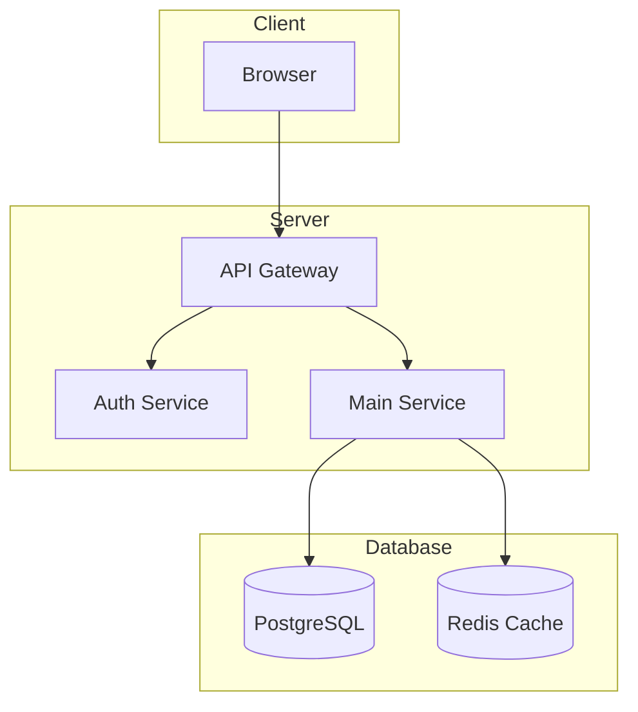
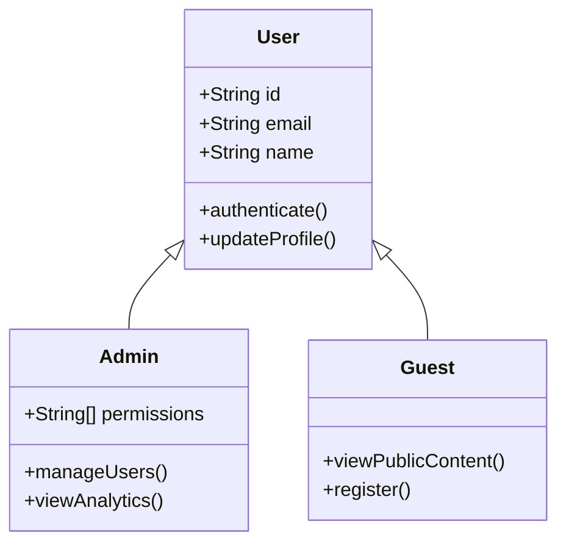
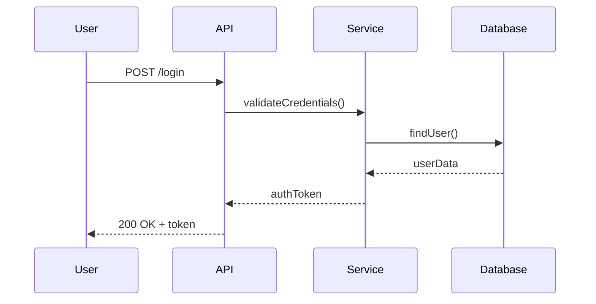
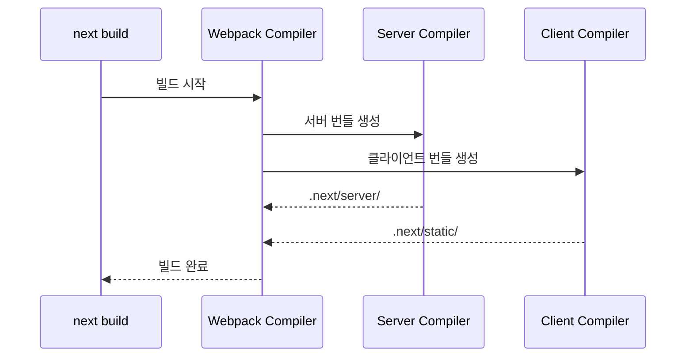

## Google Code Wiki란?

Google Code Wiki는 2025년 11월 13일에 공개 프리뷰로 발표된 <strong>AI 기반 코드 문서화 플랫폼</strong>입니다. Gemini 모델을 활용하여 GitHub 퍼블릭 레포지토리의 코드를 자동으로 분석하고, 구조화된 문서와 다이어그램을 생성합니다.

기존의 정적인 README나 수동으로 관리하는 문서와 달리, Code Wiki는 코드베이스의 변경 사항을 자동으로 반영하여 항상 최신 상태의 문서를 유지합니다. 이는 개발자들이 새로운 프로젝트를 이해하거나, 대규모 코드베이스를 탐색할 때 겪는 어려움을 크게 줄여줍니다.

## 핵심 기능

### 1. 자동 업데이트되는 구조화된 위키

Code Wiki는 레포지토리를 분석하여 다음과 같은 정보를 자동으로 생성합니다:

- <strong>프로젝트 개요</strong>: 레포지토리의 목적과 주요 기능 요약
- <strong>아키텍처 설명</strong>: 시스템 구조와 컴포넌트 간의 관계
- <strong>주요 모듈 분석</strong>: 각 디렉토리와 파일의 역할 설명
- <strong>의존성 정보</strong>: 사용된 라이브러리와 프레임워크 목록

```
프로젝트 구조 예시:
├── src/
│   ├── components/    # UI 컴포넌트
│   ├── pages/         # 라우트 정의
│   └── utils/         # 유틸리티 함수
├── tests/             # 테스트 파일
└── docs/              # 추가 문서
```

### 2. Gemini 기반 채팅 에이전트

Code Wiki의 가장 강력한 기능 중 하나는 <strong>대화형 채팅 에이전트</strong>입니다. 자연어로 질문하면 코드베이스에 대한 구체적인 답변을 받을 수 있습니다.

<strong>질문 예시:</strong>

- "이 프로젝트의 인증 시스템은 어떻게 구현되어 있나요?"
- "API 엔드포인트는 어디에 정의되어 있나요?"
- "데이터베이스 스키마 구조를 설명해주세요."
- "이 함수의 동작 원리를 알려주세요."

채팅 에이전트는 단순히 텍스트 답변만 제공하는 것이 아니라, <strong>관련 코드 위치를 하이퍼링크로 연결</strong>하여 직접 소스 코드를 확인할 수 있게 해줍니다.

### 3. 하이퍼링크 연결된 코드 참조

모든 문서화된 내용은 실제 코드와 연결됩니다:

- 클릭 한 번으로 관련 소스 파일로 이동
- 특정 함수나 클래스의 정의 위치 즉시 확인
- 코드 변경 이력 추적 가능

이 기능은 특히 대규모 프로젝트에서 <strong>코드 네비게이션 시간을 획기적으로 단축</strong>시킵니다.

### 4. 자동 생성 다이어그램

Code Wiki는 코드 분석을 통해 다양한 종류의 다이어그램을 자동으로 생성합니다:

#### 아키텍처 다이어그램

시스템의 전체 구조와 컴포넌트 간의 관계를 시각화합니다.



#### 클래스 다이어그램

객체 지향 코드의 클래스 구조와 상속 관계를 표현합니다.



#### 시퀀스 다이어그램

함수 호출 흐름과 컴포넌트 간의 상호작용을 순차적으로 보여줍니다.



## 사용 방법

### Step 1: Code Wiki 접속

[codewiki.google](https://codewiki.google)에 접속합니다. Google 계정으로 로그인하면 즉시 사용할 수 있습니다.

### Step 2: 레포지토리 검색

검색창에 GitHub 레포지토리 이름이나 URL을 입력합니다:

```
예시:
- vercel/next.js
- facebook/react
- microsoft/vscode
- https://github.com/owner/repo
```

<strong>참고</strong>: 현재 공개 프리뷰 단계에서는 퍼블릭 레포지토리만 지원됩니다.

### Step 3: 위키 탐색

레포지토리를 선택하면 자동으로 생성된 위키 페이지가 표시됩니다:

1. <strong>Overview</strong>: 프로젝트 개요 및 시작하기 가이드
2. <strong>Architecture</strong>: 시스템 아키텍처 설명
3. <strong>Modules</strong>: 주요 모듈별 상세 문서
4. <strong>Diagrams</strong>: 자동 생성된 다이어그램 모음

### Step 4: 채팅 에이전트 활용

우측 하단의 채팅 아이콘을 클릭하여 Gemini 에이전트와 대화를 시작합니다.

```
효과적인 질문 방법:

✓ "Next.js의 라우팅 시스템은 어떻게 동작하나요?"
✓ "getServerSideProps와 getStaticProps의 차이점을 설명해주세요."
✓ "Image 컴포넌트의 최적화 로직은 어디에 구현되어 있나요?"

✗ "이 코드 좋아요?" (너무 모호함)
✗ "버그 고쳐줘" (Code Wiki는 코드 수정 기능 없음)
```

### Step 5: 다이어그램 탐색

Diagrams 탭에서 자동 생성된 다이어그램을 확인할 수 있습니다:

- <strong>확대/축소</strong>: 마우스 휠 또는 핀치 제스처
- <strong>노드 클릭</strong>: 해당 코드로 바로 이동
- <strong>내보내기</strong>: PNG, SVG 형식으로 저장

## Gemini CLI 확장

Google은 Code Wiki의 기능을 <strong>Gemini CLI</strong>로 확장하여, 터미널에서도 코드 문서화 기능을 사용할 수 있도록 준비하고 있습니다.

### 프라이빗 레포 지원 예정

현재 공개 프리뷰에서는 퍼블릭 레포지토리만 지원하지만, Gemini CLI를 통해 <strong>프라이빗 레포지토리 지원</strong>이 예정되어 있습니다.

```bash
# 예상되는 사용 방법 (대기자 명단 등록 후)
gemini codewiki analyze ./my-private-project
gemini codewiki chat "인증 모듈 설명해줘"
gemini codewiki diagram --type architecture
```

### 대기자 명단 등록

프라이빗 레포 지원을 원하신다면 [Google AI Studio](https://aistudio.google.com)에서 대기자 명단에 등록할 수 있습니다.

## 실제 활용 예시: Next.js 레포지토리

Code Wiki의 실제 활용도를 보여드리기 위해 `vercel/next.js` 레포지토리를 예시로 살펴보겠습니다.

### 프로젝트 구조 이해

Code Wiki는 Next.js의 복잡한 모노레포 구조를 다음과 같이 정리합니다:

```
next.js/
├── packages/
│   ├── next/              # 핵심 프레임워크
│   ├── create-next-app/   # CLI 도구
│   └── eslint-config-next/# ESLint 설정
├── examples/              # 사용 예시 (200개 이상)
└── test/                  # 테스트 스위트
```

### 채팅 에이전트 활용 예시

<strong>질문</strong>: "App Router와 Pages Router의 차이점을 코드 레벨에서 설명해주세요."

<strong>Code Wiki 응답</strong>:
> App Router는 `packages/next/src/server/app-render/` 디렉토리에서 구현되며, React Server Components를 기본으로 사용합니다. 반면 Pages Router는 `packages/next/src/server/render.tsx`에서 처리되며, 전통적인 SSR/SSG 방식을 따릅니다.
>
> 주요 차이점:
> - [App Router 엔트리포인트](링크) - RSC 기반 렌더링
> - [Pages Router 엔트리포인트](링크) - 기존 렌더링 방식

### 자동 생성 다이어그램

Code Wiki는 Next.js의 빌드 프로세스를 다음과 같은 시퀀스 다이어그램으로 시각화합니다:



## 장단점 분석

### 장점

1. <strong>학습 곡선 감소</strong>
   - 새로운 프로젝트에 빠르게 적응 가능
   - 복잡한 코드베이스 구조를 쉽게 이해

2. <strong>항상 최신 문서</strong>
   - 코드 변경 시 자동 업데이트
   - 문서와 코드 간 불일치 문제 해결

3. <strong>대화형 인터페이스</strong>
   - 자연어로 질문하면 정확한 답변
   - 코드 위치까지 하이퍼링크로 제공

4. <strong>시각적 이해 지원</strong>
   - 자동 생성 다이어그램
   - 아키텍처, 클래스, 시퀀스 다이어그램 제공

5. <strong>무료 사용</strong>
   - 공개 프리뷰 기간 동안 무료

### 단점

1. <strong>퍼블릭 레포지토리 한정</strong>
   - 현재 프라이빗 레포 미지원
   - 기업 내부 프로젝트에 바로 적용 불가

2. <strong>Gemini 모델 의존성</strong>
   - AI 분석의 정확도가 100%가 아님
   - 복잡한 비즈니스 로직 해석에 한계

3. <strong>실시간 업데이트 지연</strong>
   - 코드 변경 후 반영까지 시간 소요
   - 인덱싱 완료 시점이 명확하지 않음

4. <strong>언어/프레임워크 지원 범위</strong>
   - 일부 언어나 프레임워크에서는 정확도 저하
   - 최신 기술 스택은 학습 데이터 부족 가능

5. <strong>커스터마이징 제한</strong>
   - 생성된 문서 형식 변경 불가
   - 특정 정보만 강조하거나 숨기기 어려움

## 기존 도구와의 비교

| 특성 | Code Wiki | GitHub Copilot | Sourcegraph |
|------|-----------|----------------|-------------|
| 자동 문서화 | ✓ | △ | ✗ |
| 대화형 에이전트 | ✓ | ✓ | △ |
| 다이어그램 생성 | ✓ | ✗ | ✗ |
| 프라이빗 레포 | 예정 | ✓ | ✓ |
| IDE 통합 | 예정 | ✓ | ✓ |
| 가격 | 무료 | 유료 | 유료 |

## 활용 시나리오

### 1. 새로운 팀원 온보딩

새로운 개발자가 팀에 합류했을 때:

```
1. Code Wiki에서 프로젝트 레포 검색
2. Overview로 전체 구조 파악
3. 채팅 에이전트에 담당 모듈 질문
4. 다이어그램으로 아키텍처 이해
```

기존에 1〜2주 걸리던 온보딩이 2〜3일로 단축됩니다.

### 2. 오픈소스 기여 준비

오픈소스 프로젝트에 기여하고 싶을 때:

```
1. 기여하고 싶은 레포지토리 분석
2. 이슈와 관련된 코드 위치 파악
3. 관련 모듈의 동작 원리 이해
4. 수정 방향 결정
```

### 3. 기술 스택 학습

새로운 프레임워크나 라이브러리를 배울 때:

```
1. 해당 프레임워크의 레포지토리 분석
2. 핵심 개념에 대해 채팅 에이전트에 질문
3. 실제 구현 코드 확인
4. 예제 코드와 비교 학습
```

## 마무리

Google Code Wiki는 <strong>AI를 활용한 코드 문서화의 새로운 패러다임</strong>을 제시합니다. 아직 공개 프리뷰 단계이지만, 이미 많은 개발자들이 그 유용성을 체험하고 있습니다.

특히 다음과 같은 상황에서 Code Wiki를 적극 활용하시길 권장합니다:

- 대규모 오픈소스 프로젝트 분석
- 새로운 코드베이스 학습
- 아키텍처 문서화 자동화
- 기술 면접 준비 (유명 프로젝트 구조 이해)

앞으로 프라이빗 레포 지원과 Gemini CLI 통합이 완료되면, 기업 환경에서도 더욱 폭넓게 활용될 것으로 기대됩니다.

<strong>Code Wiki 바로가기</strong>: [codewiki.google](https://codewiki.google)

---

## 참고 자료

- [Google Code Wiki 공식 발표](https://developers.google.com/code-wiki)
- [Gemini API 문서](https://ai.google.dev/docs)
- [Google AI Studio](https://aistudio.google.com)
