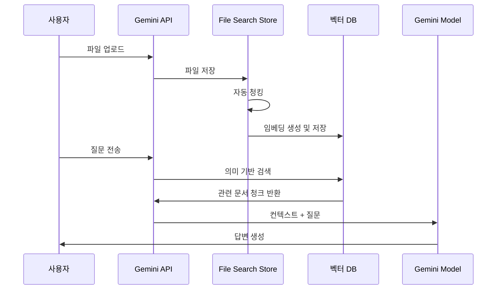

## 개요

2025년 11월 7일, Google은 개발자들이 오랫동안 기다려온 혁신적인 기능을 발표했습니다. 바로 <strong>Gemini API File Search Tool</strong>입니다. 이것은 단순한 파일 검색 기능이 아닙니다. 완전 관리형 RAG (Retrieval Augmented Generation) 시스템으로, 문서 기반 질의응답 시스템 구축의 판도를 완전히 바꾸는 게임 체인저입니다.

### 왜 혁신적인가?

전통적으로 RAG 시스템을 구축하려면 다음과 같은 복잡한 작업들이 필요했습니다:

- 📄 <strong>문서 청킹 (Chunking)</strong>: 문서를 적절한 크기로 분할
- 🔢 <strong>임베딩 생성</strong>: 각 청크를 벡터로 변환
- 🗄️ <strong>벡터 데이터베이스 관리</strong>: Pinecone, Weaviate, Chroma 등의 설정 및 운영
- 🔍 <strong>검색 파이프라인 최적화</strong>: 유사도 검색 알고리즘 튜닝
- 🔄 <strong>지속적인 유지보수</strong>: 인프라 스케일링, 비용 관리

<strong>File Search Tool은 이 모든 과정을 자동화</strong>하여, 개발자가 파일을 업로드하고 바로 질문할 수 있도록 만들었습니다. 마치 OpenAI의 Assistants API가 했던 것처럼, 하지만 Google의 강력한 Gemini 모델과 함께 말이죠.

## File Search Tool이란?

### RAG의 기본 개념

RAG (Retrieval Augmented Generation)는 LLM의 한계를 극복하기 위한 기술입니다. LLM은 학습 데이터까지만 알고 있고, 최신 정보나 특정 기업의 내부 문서는 알지 못합니다. RAG는 이 문제를 다음과 같이 해결합니다:


### 기존 방식 vs File Search Tool

<strong>기존 방식</strong> (직접 구축):
```python
# 1. 문서 로드
documents = load_documents("./docs")

# 2. 청킹
chunks = text_splitter.split(documents)

# 3. 임베딩 생성
embeddings = openai_embeddings.embed(chunks)

# 4. 벡터 DB 저장
vector_db = Pinecone.from_documents(chunks, embeddings)

# 5. 검색 및 생성
relevant_docs = vector_db.similarity_search(query)
answer = llm.generate(query + relevant_docs)
```

<strong>File Search Tool</strong> (완전 관리형):
```python
# 1. Store 생성
store = client.file_search_stores.create(
    config={'display_name': 'My Knowledge Base'}
)

# 2. 파일 업로드 (청킹, 임베딩 자동)
operation = client.file_search_stores.upload_to_file_search_store(
    file='document.pdf',
    file_search_store_name=store.name
)

# 3. 질문하기 (검색, 생성 자동)
response = client.models.generate_content(
    model="gemini-2.5-flash",
    contents="문서의 주요 내용은 무엇인가요?",
    config=types.GenerateContentConfig(
        tools=[
            types.Tool(
                file_search=types.FileSearch(
                    file_search_store_names=[store.name]
                )
            )
        ]
    )
)
```

차이가 보이시나요? <strong>코드의 양이 60% 이상 줄어들었고, 복잡한 설정이 완전히 사라졌습니다.</strong>

## 작동 원리

File Search Tool은 세 가지 주요 단계로 작동합니다:



### 1단계: 인덱싱 (Indexing)

파일을 업로드하면 다음이 자동으로 실행됩니다:

- <strong>자동 청킹</strong>: 문서를 의미 단위로 분할 (기본 400 토큰)
- <strong>임베딩 생성</strong>: 각 청크를 768차원 벡터로 변환
- <strong>벡터 저장</strong>: Google의 관리형 벡터 데이터베이스에 저장

### 2단계: 검색 (Retrieval)

사용자가 질문하면:

- 질문을 임베딩으로 변환 (무료!)
- 코사인 유사도로 가장 관련성 높은 청크 검색
- Top-K 개의 문서 조각 선택

### 3단계: 생성 (Generation)

Gemini 모델이 답변을 생성:

- 검색된 문서를 컨텍스트로 사용
- 원본 질문과 결합하여 프롬프트 구성
- 정확하고 근거 있는 답변 생성
- 인용 출처 정보 포함

## 주요 기능

### 1. 광범위한 파일 형식 지원

File Search Tool은 300개 이상의 파일 형식을 지원합니다:

<strong>애플리케이션 파일 (100+ 종류)</strong>:
- PDF, DOCX, XLSX, PPTX
- JSON, XML, YAML
- SQL, SQLite 데이터베이스

<strong>텍스트 파일 (200+ 종류)</strong>:
- Markdown, HTML, CSV
- Python, JavaScript, Java, Go 등 모든 주요 프로그래밍 언어
- 로그 파일, 설정 파일

### 2. 커스텀 청킹 설정

문서 특성에 맞게 청킹 전략을 조정할 수 있습니다:

```python
config={
    'chunking_config': {
        'white_space_config': {
            'max_tokens_per_chunk': 400,  # 청크당 최대 토큰 수
            'max_overlap_tokens': 40       # 청크 간 오버랩
        }
    }
}
```

<strong>추천 설정</strong>:
- <strong>FAQ 문서</strong>: 200 토큰 (짧고 간결한 정보)
- <strong>기술 매뉴얼</strong>: 400 토큰 (기본 설정, 균형)
- <strong>연구 논문</strong>: 600 토큰 (긴 맥락 필요)

### 3. 메타데이터 필터링

파일 업로드 시 메타데이터를 추가하여 검색을 정교화할 수 있습니다:

```python
custom_metadata=[
    {"key": "author", "string_value": "Robert Graves"},
    {"key": "department", "string_value": "Engineering"},
    {"key": "year", "numeric_value": 2025},
    {"key": "is_public", "boolean_value": True}
]
```

### 4. 인용 출처 추적

답변의 신뢰성을 높이기 위해 출처를 확인할 수 있습니다:

```python
response = client.models.generate_content(...)

if hasattr(response, 'grounding_metadata'):
    for citation in response.grounding_metadata.citations:
        print(f"출처: {citation.source}")
        print(f"인용 텍스트: {citation.text}")
```

### 5. 무료 쿼리 임베딩

일반적으로 임베딩 생성에는 비용이 발생하지만, File Search Tool은 <strong>쿼리 임베딩을 무료로 제공</strong>합니다. 인덱싱 시에만 비용이 발생합니다 ($0.15 / 1M 토큰).

## 실습: Python으로 시작하기

실제로 File Search Tool을 사용해보겠습니다. 이 튜토리얼은 제가 직접 테스트한 코드입니다.

### 환경 설정

<strong>uv 사용 (권장)</strong>:

```bash
# uv 설치 (아직 없다면)
curl -LsSf https://astral.sh/uv/install.sh | sh

# 프로젝트 디렉토리 생성
mkdir gemini-file-search-demo
cd gemini-file-search-demo

# Python 가상환경 생성
uv venv
source .venv/bin/activate  # Unix/macOS
# .venv\Scripts\activate  # Windows

# 필요한 패키지 설치
uv pip install google-genai streamlit python-dotenv
```

<strong>전통적인 pip 사용</strong>:

```bash
# Python 3.9+ 필요
python --version

# 패키지 설치
pip install google-genai streamlit python-dotenv
```

### API 키 발급

1. [Google AI Studio](https://aistudio.google.com) 접속
2. 왼쪽 메뉴에서 "Get API key" 선택
3. "Create API key" 버튼 클릭
4. API 키 복사

<strong>.env 파일 생성</strong>:

```bash
GEMINI_API_KEY=your-api-key-here
```

### 기본 예제 코드

완전히 작동하는 예제입니다:

```python
import os
import time
from google import genai
from google.genai import types
from dotenv import load_dotenv

# 환경 변수 로드
load_dotenv()

# 클라이언트 초기화
client = genai.Client()

# 1. File Search Store 생성
print("Store 생성 중...")
store = client.file_search_stores.create(
    config={'display_name': 'My First Knowledge Base'}
)
print(f"✓ Store 생성 완료: {store.name}")

# 2. 파일 업로드
print("\n파일 업로드 중...")
operation = client.file_search_stores.upload_to_file_search_store(
    file='document.pdf',  # 실제 파일 경로로 변경
    file_search_store_name=store.name,
    config={
        'display_name': 'Sample Document',
        'chunking_config': {
            'white_space_config': {
                'max_tokens_per_chunk': 400,
                'max_overlap_tokens': 40
            }
        }
    }
)

# 3. 업로드 완료 대기
while not operation.done:
    print("인덱싱 중...")
    time.sleep(5)
    operation = client.operations.get(operation)

print("✓ 파일 업로드 완료")

# 4. 질문하기
print("\n질문 처리 중...")
response = client.models.generate_content(
    model="gemini-2.5-flash",
    contents="이 문서의 주요 내용을 3가지로 요약해주세요.",
    config=types.GenerateContentConfig(
        tools=[
            types.Tool(
                file_search=types.FileSearch(
                    file_search_store_names=[store.name]
                )
            )
        ],
        temperature=0.2
    )
)

print("\n=== 답변 ===")
print(response.text)

# 5. 인용 출처 확인
if hasattr(response, 'grounding_metadata'):
    print("\n=== 출처 ===")
    for idx, citation in enumerate(response.grounding_metadata.citations, 1):
        print(f"{idx}. {citation.source}")
```

## Streamlit 웹 앱 데모

제가 실제로 구현하고 테스트한 웹 인터페이스입니다. `uv run python -m streamlit run web_app.py` 명령으로 실행할 수 있습니다.

### 웹 앱 구조

```python
import streamlit as st
from google import genai
from google.genai import types
import time

# 페이지 설정
st.set_page_config(
    page_title="Gemini File Search",
    page_icon="🔍",
    layout="wide"
)

# 세션 상태 초기화
if "client" not in st.session_state:
    st.session_state.client = None
if "store" not in st.session_state:
    st.session_state.store = None
if "chat_history" not in st.session_state:
    st.session_state.chat_history = []

# 클라이언트 초기화 함수
def initialize_client(api_key):
    try:
        os.environ["GEMINI_API_KEY"] = api_key
        client = genai.Client()
        return client, None
    except Exception as e:
        return None, str(e)

# Store 생성 함수
def create_store(client, store_name):
    try:
        store = client.file_search_stores.create(
            config={"display_name": store_name}
        )
        return store, None
    except Exception as e:
        return None, str(e)

# 파일 업로드 함수
def upload_file(client, file, store_name):
    try:
        import uuid

        # 임시 파일 생성
        file_ext = os.path.splitext(file.name)[1]
        temp_file = f"temp_{uuid.uuid4().hex}{file_ext}"

        with open(temp_file, "wb") as f:
            f.write(file.getbuffer())

        # 업로드
        operation = client.file_search_stores.upload_to_file_search_store(
            file=temp_file,
            file_search_store_name=store_name,
            config={
                "display_name": file.name,
                "chunking_config": {
                    "white_space_config": {
                        "max_tokens_per_chunk": 400,
                        "max_overlap_tokens": 40
                    }
                }
            }
        )

        # 완료 대기
        while not operation.done:
            time.sleep(2)
            operation = client.operations.get(operation)

        # 임시 파일 삭제
        if os.path.exists(temp_file):
            os.remove(temp_file)

        return True, None

    except Exception as e:
        return False, str(e)

# 쿼리 함수
def query_store(client, question, store_name):
    try:
        response = client.models.generate_content(
            model="gemini-2.5-flash",
            contents=question,
            config=types.GenerateContentConfig(
                tools=[
                    types.Tool(
                        file_search=types.FileSearch(
                            file_search_store_names=[store_name]
                        )
                    )
                ],
                temperature=0.2
            )
        )

        # 인용 정보 추출
        citations = []
        if hasattr(response, "grounding_metadata") and response.grounding_metadata:
            if hasattr(response.grounding_metadata, "citations"):
                for citation in response.grounding_metadata.citations:
                    citations.append({
                        "source": getattr(citation, "source", "N/A"),
                        "text": getattr(citation, "text", "")[:100]
                    })

        return response.text, citations, None

    except Exception as e:
        return None, None, str(e)

# UI 구성
st.title("🔍 Gemini File Search")
st.markdown("Google Gemini API의 File Search Tool을 사용한 문서 검색 및 질의응답 시스템")

# 사이드바 - 설정
with st.sidebar:
    st.header("⚙️ 설정")

    api_key = st.text_input(
        "Gemini API Key",
        type="password",
        value=os.getenv("GEMINI_API_KEY", ""),
        help="Google AI Studio에서 발급받은 API 키"
    )

    if api_key and not st.session_state.client:
        client, error = initialize_client(api_key)
        if client:
            st.session_state.client = client
            st.success("✓ 클라이언트 초기화 완료")
        else:
            st.error(f"초기화 실패: {error}")

    st.divider()

    # Store 관리
    if st.session_state.client:
        st.header("📁 Store 관리")

        # 새 Store 생성
        new_store_name = st.text_input("Store 이름", value="My Knowledge Base")
        if st.button("생성"):
            with st.spinner("Store 생성 중..."):
                store, error = create_store(st.session_state.client, new_store_name)
                if store:
                    st.session_state.store = store
                    st.success(f"✓ Store 생성: {store.name}")
                    st.rerun()
                else:
                    st.error(f"생성 실패: {error}")

        # 현재 Store
        if st.session_state.store:
            st.success(f"**현재 Store:** {st.session_state.store.display_name}")

# 메인 영역
if not st.session_state.client:
    st.info("👈 왼쪽 사이드바에서 API 키를 입력해주세요")
    st.stop()

if not st.session_state.store:
    st.info("👈 왼쪽 사이드바에서 Store를 생성해주세요")
    st.stop()

# 탭으로 기능 분리
tab1, tab2 = st.tabs(["💬 질의응답", "📤 파일 업로드"])

# 질의응답 탭
with tab1:
    st.header("질의응답")

    # 채팅 히스토리
    for chat in st.session_state.chat_history:
        with st.chat_message("user"):
            st.write(chat["question"])

        with st.chat_message("assistant"):
            st.write(chat["answer"])

            if chat.get("citations"):
                with st.expander("📚 인용 출처"):
                    for i, citation in enumerate(chat["citations"], 1):
                        st.markdown(f"**{i}. {citation['source']}**")
                        st.text(f"   {citation['text']}...")

    # 질문 입력
    question = st.chat_input("질문을 입력하세요...")

    if question:
        with st.chat_message("user"):
            st.write(question)

        with st.chat_message("assistant"):
            with st.spinner("답변 생성 중..."):
                answer, citations, error = query_store(
                    st.session_state.client,
                    question,
                    st.session_state.store.name
                )

                if answer:
                    st.write(answer)

                    if citations:
                        with st.expander("📚 인용 출처"):
                            for i, citation in enumerate(citations, 1):
                                st.markdown(f"**{i}. {citation['source']}**")
                                st.text(f"   {citation['text']}...")

                    # 히스토리에 추가
                    st.session_state.chat_history.append({
                        "question": question,
                        "answer": answer,
                        "citations": citations
                    })
                else:
                    st.error(f"오류: {error}")

# 파일 업로드 탭
with tab2:
    st.header("파일 업로드")

    uploaded_files = st.file_uploader(
        "파일을 선택하세요",
        accept_multiple_files=True,
        type=["pdf", "txt", "docx", "md", "csv"],
        help="PDF, TXT, DOCX, Markdown, CSV 파일을 업로드할 수 있습니다"
    )

    if uploaded_files:
        if st.button("업로드 시작", type="primary"):
            progress_bar = st.progress(0)
            status_text = st.empty()

            for i, file in enumerate(uploaded_files):
                status_text.text(f"업로드 중: {file.name}")

                success, error = upload_file(
                    st.session_state.client,
                    file,
                    st.session_state.store.name
                )

                if success:
                    st.success(f"✓ {file.name}")
                else:
                    st.error(f"✗ {file.name}: {error}")

                progress_bar.progress((i + 1) / len(uploaded_files))

            status_text.text("업로드 완료!")
            time.sleep(1)
            st.rerun()
```

### 실행 방법

```bash
# Streamlit 실행
uv run python -m streamlit run web_app.py

# 또는 전통적인 방식
streamlit run web_app.py
```

브라우저에서 `http://localhost:8501`로 접속하면 다음과 같은 인터페이스가 표시됩니다:

### 실제 구현 화면

<strong>1. 메인 화면 및 Store 생성</strong>


왼쪽 사이드바에서 Gemini API 키를 입력하고, Store를 생성할 수 있습니다. Store 이름을 입력하고 "generation" 버튼을 클릭하면 새로운 File Search Store가 생성됩니다.

<strong>2. 파일 업로드 인터페이스</strong>


"File Upload" 탭에서 여러 파일을 동시에 선택하여 업로드할 수 있습니다. PDF, TXT, DOCX, Markdown, CSV 등 다양한 형식을 지원합니다.

<strong>3. 질의응답 인터페이스</strong>


"Q&A" 탭에서 업로드한 문서에 대해 자연어로 질문할 수 있습니다. 채팅 형식으로 대화가 진행되며, 인용 출처도 함께 표시됩니다.

<strong>4. Store 관리 및 파일 목록</strong>


현재 선택된 Store의 정보와 업로드된 파일 목록을 확인할 수 있습니다.

<strong>5. 질의응답 결과 예시</strong>


실제 질문에 대한 답변이 표시되며, 답변의 근거가 된 문서 출처를 확인할 수 있습니다.

### 주요 기능
- ✅ API 키 설정 및 클라이언트 초기화
- ✅ File Search Store 생성 및 관리
- ✅ 파일 업로드 (여러 파일 동시 지원)
- ✅ 대화형 질의응답 (채팅 인터페이스)
- ✅ 인용 출처 표시
- ✅ 업로드 진행률 표시

## 기존 솔루션과의 비교

### OpenAI Assistants File Search vs Gemini File Search

| 특징 | OpenAI Assistants | Gemini File Search |
|------|-------------------|-------------------|
| <strong>지원 파일 형식</strong> | 20+ 종류 | 300+ 종류 |
| <strong>최대 파일 크기</strong> | 512MB | 100MB |
| <strong>무료 쿼리 임베딩</strong> | ✗ | ✓ |
| <strong>청킹 커스터마이징</strong> | 제한적 | 세밀한 제어 |
| <strong>메타데이터 필터링</strong> | ✓ | ✓ (향후 강화 예정) |
| <strong>가격 (인덱싱)</strong> | $0.10 / GB/day | $0.15 / 1M 토큰 |
| <strong>모델 성능</strong> | GPT-4 Turbo | Gemini 2.5 Pro/Flash |

### LangChain + Vector DB vs Managed RAG

| 측면 | 자체 구축 (LangChain) | Gemini File Search |
|------|---------------------|-------------------|
| <strong>설정 복잡도</strong> | 높음 (청킹, 임베딩, 벡터 DB 설정) | 낮음 (파일 업로드만) |
| <strong>개발 시간</strong> | 며칠〜몇 주 | 몇 분 |
| <strong>유지보수</strong> | 지속적 관리 필요 | Google이 관리 |
| <strong>스케일링</strong> | 수동 스케일링 | 자동 스케일링 |
| <strong>비용 예측</strong> | 복잡 (인프라 + 운영) | 명확 (사용량 기반) |
| <strong>커스터마이징</strong> | 완전한 제어 | 제한적 제어 |
| <strong>시작 비용</strong> | 높음 (학습 곡선) | 낮음 (즉시 시작) |

### 언제 어떤 것을 사용해야 할까?

<strong>Gemini File Search를 선택하세요</strong>:
- ✅ 빠른 프로토타이핑 및 MVP 개발
- ✅ 소규모〜중규모 문서 검색 시스템
- ✅ 개발 리소스가 제한적인 경우
- ✅ 인프라 관리를 최소화하고 싶은 경우

<strong>자체 구축을 고려하세요</strong>:
- ✅ 완전한 제어와 커스터마이징이 필요한 경우
- ✅ 특수한 임베딩 모델이 필요한 경우
- ✅ 온프레미스 배포가 필수인 경우
- ✅ 극도로 큰 규모의 문서 (수백 GB 이상)

## 실전 활용 사례

### 1. 고객 지원 시스템

<strong>시나리오</strong>: SaaS 제품의 FAQ 및 기술 문서를 기반으로 24/7 자동 응답 시스템 구축

```python
# Store 생성
support_store = client.file_search_stores.create(
    config={'display_name': 'Customer Support KB'}
)

# FAQ 문서 업로드 (짧은 청크 사용)
faq_files = ['general_faq.pdf', 'technical_faq.pdf', 'billing_faq.pdf']

for faq in faq_files:
    operation = client.file_search_stores.upload_to_file_search_store(
        file=faq,
        file_search_store_name=support_store.name,
        config={
            'chunking_config': {
                'white_space_config': {
                    'max_tokens_per_chunk': 200,  # FAQ는 짧은 답변
                    'max_overlap_tokens': 20
                }
            }
        }
    )
    # 완료 대기...

# 고객 질문 처리
def answer_customer(question):
    response = client.models.generate_content(
        model="gemini-2.5-flash",
        contents=f"""고객 질문: {question}

        위 질문에 대해 FAQ 문서를 참고하여 다음 형식으로 답변해주세요:
        1. 간결하고 명확한 답변
        2. 관련 문서 링크 (있다면)
        3. 추가 도움이 필요한 경우 안내
        """,
        config=types.GenerateContentConfig(
            tools=[
                types.Tool(
                    file_search=types.FileSearch(
                        file_search_store_names=[support_store.name]
                    )
                )
            ],
            temperature=0.2  # 일관된 답변
        )
    )
    return response.text
```

<strong>예상 효과</strong>:
- 📉 고객 지원 티켓 30〜50% 감소
- ⚡ 평균 응답 시간 몇 시간 → 몇 초
- 💰 연간 수백만 원의 인건비 절감

### 2. 연구 논문 분석

<strong>시나리오</strong>: 특정 주제에 대한 수십 편의 논문을 업로드하고 종합 분석

```python
# 연구 Store 생성
research_store = client.file_search_stores.create(
    config={'display_name': 'AI Research Papers 2024-2025'}
)

# 논문 폴더에서 PDF 일괄 업로드
import os
papers_dir = './papers'
pdf_files = [f for f in os.listdir(papers_dir) if f.endswith('.pdf')]

for pdf in pdf_files:
    operation = client.file_search_stores.upload_to_file_search_store(
        file=os.path.join(papers_dir, pdf),
        file_search_store_name=research_store.name,
        config={
            'display_name': pdf,
            'chunking_config': {
                'white_space_config': {
                    'max_tokens_per_chunk': 600,  # 논문은 긴 맥락
                    'max_overlap_tokens': 60
                }
            },
            'custom_metadata': [
                {'key': 'type', 'string_value': 'research_paper'},
                {'key': 'year', 'numeric_value': 2025}
            ]
        }
    )
    # 완료 대기...

# 문헌 검토 쿼리
def literature_review(topic):
    prompt = f"""
    주제: {topic}

    업로드된 연구 논문들을 분석하여 다음을 제공해주세요:

    1. <strong>연구 동향</strong>: 이 주제의 최근 연구 흐름
    2. <strong>주요 방법론</strong>: 각 논문에서 사용된 접근법
    3. <strong>공통점과 차이점</strong>: 연구들 간의 비교 분석
    4. <strong>연구 갭</strong>: 아직 다루지 않은 영역
    5. <strong>향후 방향</strong>: 제안되는 연구 주제

    각 항목마다 관련 논문을 인용해주세요.
    """

    response = client.models.generate_content(
        model="gemini-2.5-pro",  # 복잡한 분석은 Pro 모델
        contents=prompt,
        config=types.GenerateContentConfig(
            tools=[
                types.Tool(
                    file_search=types.FileSearch(
                        file_search_store_names=[research_store.name]
                    )
                )
            ],
            temperature=0.3
        )
    )
    return response.text

# 사용
review = literature_review("Transformer 아키텍처의 효율성 개선")
print(review)
```

<strong>예상 효과</strong>:
- 📚 수십 편의 논문을 몇 분 만에 분석
- 🔍 숨겨진 패턴과 트렌드 발견
- 📝 문헌 검토 작성 시간 80% 단축

### 3. 기업 지식 관리

<strong>시나리오</strong>: 부서별 문서를 통합 관리하고 전사 검색 시스템 구축

```python
# 부서별 Store 생성
departments = ['Engineering', 'Marketing', 'Sales', 'HR']
stores = {}

for dept in departments:
    store = client.file_search_stores.create(
        config={'display_name': f'{dept} Knowledge Base'}
    )
    stores[dept] = store

# 통합 검색 함수
def search_company_knowledge(question, departments=None):
    """전사 또는 특정 부서 검색"""
    if departments is None:
        departments = list(stores.keys())

    store_names = [stores[dept].name for dept in departments]

    response = client.models.generate_content(
        model="gemini-2.5-flash",
        contents=question,
        config=types.GenerateContentConfig(
            tools=[
                types.Tool(
                    file_search=types.FileSearch(
                        file_search_store_names=store_names
                    )
                )
            ]
        )
    )
    return response.text

# 사용 예시
# 전사 검색
answer = search_company_knowledge("신입 사원 온보딩 절차는?")

# 특정 부서만 검색
answer = search_company_knowledge(
    "API 인증 방법은?",
    departments=['Engineering']
)
```

<strong>예상 효과</strong>:
- 🚀 정보 검색 시간 90% 단축
- 🤝 부서 간 지식 공유 활성화
- 💡 숨겨진 정보 자산 활용

### 4. 기술 문서 검색

<strong>시나리오</strong>: 대규모 코드베이스의 문서화 및 개발자 지원

```python
# 코드베이스 문서 Store
docs_store = client.file_search_stores.create(
    config={'display_name': 'Codebase Documentation'}
)

# 다양한 문서 형식 업로드
doc_types = {
    'api_docs': ['*.md', '*.rst'],
    'code_comments': ['*.py', '*.js', '*.go'],
    'config': ['*.yaml', '*.json', '*.toml']
}

# 개발자 질문 처리
def ask_codebase(question):
    response = client.models.generate_content(
        model="gemini-2.5-flash",
        contents=f"""
        개발자 질문: {question}

        코드베이스 문서를 참고하여 다음을 제공해주세요:
        1. 직접적인 답변
        2. 관련 코드 예제 (있다면)
        3. 참고할 문서 링크
        4. 주의사항이나 베스트 프랙티스
        """,
        config=types.GenerateContentConfig(
            tools=[
                types.Tool(
                    file_search=types.FileSearch(
                        file_search_store_names=[docs_store.name]
                    )
                )
            ]
        )
    )
    return response.text
```

## 제한 사항 및 고려사항

### 현재 제한

| 항목 | 제한 | 비고 |
|------|------|------|
| <strong>최대 파일 크기</strong> | 100 MB/파일 | 대용량 파일은 분할 필요 |
| <strong>저장소 크기 (Free)</strong> | 1 GB | 프로덕션은 유료 플랜 권장 |
| <strong>저장소 크기 (Tier 1)</strong> | 10 GB | 중소기업 적합 |
| <strong>저장소 크기 (Tier 2)</strong> | 100 GB | 대기업 적합 |
| <strong>저장소 크기 (Tier 3)</strong> | 1 TB | 대규모 시스템 |
| <strong>권장 Store 크기</strong> | < 20 GB | 검색 성능 최적화 |
| <strong>원본 파일 보존</strong> | 48시간 | 이후 자동 삭제 |

### 주의사항

<strong>1. 데이터 보안</strong>

- 파일은 Google 서버에 저장됩니다
- 민감한 데이터는 암호화 또는 마스킹 후 업로드
- 데이터 주권 이슈 (특정 국가의 법적 요구사항) 확인 필요

<strong>2. 비용 관리</strong>

```python
# 인덱싱 비용 예측
문서 크기 = 10 MB
토큰 수 ≈ 10 MB × 1,000,000 bytes × 0.3 tokens/byte ≈ 3M 토큰
비용 = 3M × $0.15 / 1M = $0.45
```

- 중복 인덱싱 방지 (동일 파일 재업로드 주의)
- 정기적인 Store 정리 (불필요한 파일 삭제)
- 캐싱 전략 고려 (자주 묻는 질문은 캐시)

<strong>3. Rate Limits</strong>

API 호출에는 속도 제한이 있습니다:
- 분당 요청 수 제한
- 동시 업로드 제한
- 지수 백오프 재시도 구현 권장

```python
import time
from google.api_core.exceptions import ResourceExhausted

def upload_with_retry(file, store_name, max_retries=3):
    for attempt in range(max_retries):
        try:
            operation = client.file_search_stores.upload_to_file_search_store(
                file=file,
                file_search_store_name=store_name
            )
            return operation

        except ResourceExhausted:
            if attempt < max_retries - 1:
                wait_time = 2 ** attempt  # 지수 백오프: 1s, 2s, 4s
                print(f"Rate limited. Retrying in {wait_time}s...")
                time.sleep(wait_time)
            else:
                raise
```

<strong>4. 검색 품질 최적화</strong>

검색 결과가 만족스럽지 않을 때:

```python
# 1. 더 구체적인 질문 작성
나쁜 예: "설치 방법은?"
좋은 예: "Linux Ubuntu 22.04에서 Docker를 사용한 초기 설치 절차는?"

# 2. 청킹 크기 조정
config={
    'chunking_config': {
        'white_space_config': {
            'max_tokens_per_chunk': 200,  # 기본 400에서 감소
            'max_overlap_tokens': 40      # 오버랩 증가
        }
    }
}

# 3. 프롬프트 엔지니어링
prompt = f"""
업로드된 문서를 정밀하게 검색하여 다음 질문에 답변해주세요.

질문: {question}

요구사항:
- 문서의 정확한 내용만 사용할 것
- 추측이나 일반 지식은 배제할 것
- 출처를 명확히 표시할 것
- 관련 정보가 없다면 "문서에서 찾을 수 없습니다"라고 답할 것
"""
```

### 가격 정책

| 항목 | 가격 | 설명 |
|------|------|------|
| <strong>인덱싱 (임베딩 생성)</strong> | $0.15 / 1M 토큰 | 파일 업로드 시 1회 |
| <strong>스토리지</strong> | 무료 | 현재 무료 (향후 변경 가능) |
| <strong>쿼리 임베딩</strong> | 무료 | 질문 시 임베딩 생성 무료 |
| <strong>검색된 토큰</strong> | 표준 요금 | 컨텍스트로 사용된 토큰 |
| <strong>생성 토큰</strong> | 표준 요금 | Gemini 모델 출력 |

<strong>비용 절감 팁</strong>:
- 동일 파일 재인덱싱 방지
- 불필요한 문서 정리
- 적절한 청크 크기 설정 (너무 작으면 비용 증가)
- 쿼리 결과 캐싱

## 결론

Google Gemini File Search Tool은 RAG 시스템 구축의 <strong>패러다임 전환</strong>입니다. 복잡한 벡터 데이터베이스 설정, 임베딩 관리, 인프라 스케일링 등의 고민 없이, 파일을 업로드하고 바로 질문할 수 있게 되었습니다.

### 핵심 장점 요약

✅ <strong>진입 장벽 제거</strong>: 며칠 걸리던 설정이 몇 분으로 단축
✅ <strong>비용 효율성</strong>: 인프라 비용 없이 사용량 기반 과금
✅ <strong>자동 스케일링</strong>: Google이 인프라 관리
✅ <strong>광범위한 지원</strong>: 300+ 파일 형식
✅ <strong>높은 품질</strong>: Gemini 모델의 강력한 이해력

### 향후 전망

Google은 다음과 같은 개선 사항을 로드맵에 포함했습니다:

- 🔍 고급 메타데이터 필터링 쿼리
- 📊 멀티모달 검색 (이미지, 표 인식)
- ⚡ 실시간 문서 업데이트 (증분 인덱싱)
- 🌐 더 많은 파일 형식 지원

### 시작해보세요!

RAG 시스템이 필요하다면, 더 이상 복잡한 구축 과정을 거칠 필요가 없습니다. Google AI Studio에서 API 키를 발급받고, 5분 만에 첫 번째 문서 검색 시스템을 만들어보세요.

```bash
# 지금 바로 시작하기
pip install google-genai
export GEMINI_API_KEY="your-key"
python your_first_rag.py
```

<strong>문서 검색의 미래는 이미 여기 있습니다. 🚀</strong>

## 참고 자료

### 공식 문서
- [File Search 공식 문서](https://ai.google.dev/gemini-api/docs/file-search)
- [File Search API 레퍼런스](https://ai.google.dev/api/file-search/file-search-stores)
- [Google AI Studio](https://aistudio.google.com)
- [공식 발표 블로그](https://blog.google/technology/developers/file-search-gemini-api/)

### 관련 기술
- [RAG 개념 논문](https://arxiv.org/abs/2005.11401)
- [Semantic Search 이해](https://en.wikipedia.org/wiki/Semantic_search)
- [Vector Databases 가이드](https://www.pinecone.io/learn/vector-database/)

### GitHub 저장소
- [Gemini API Python SDK](https://github.com/google-gemini/generative-ai-python)
- [예제 코드 모음](https://github.com/google-gemini/cookbook)
