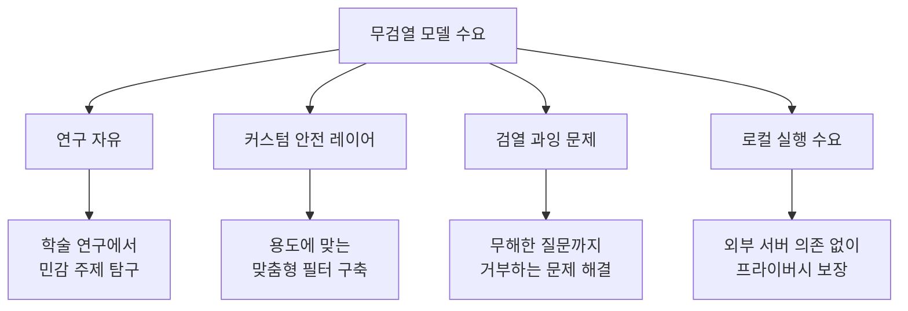
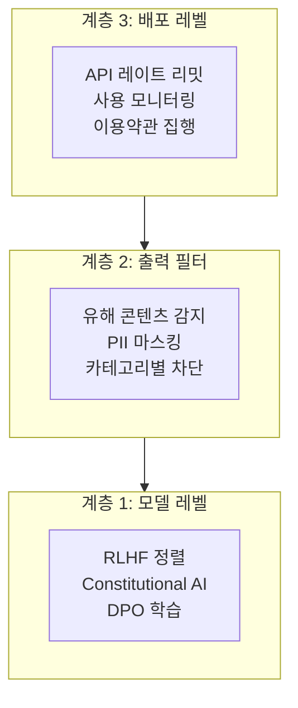
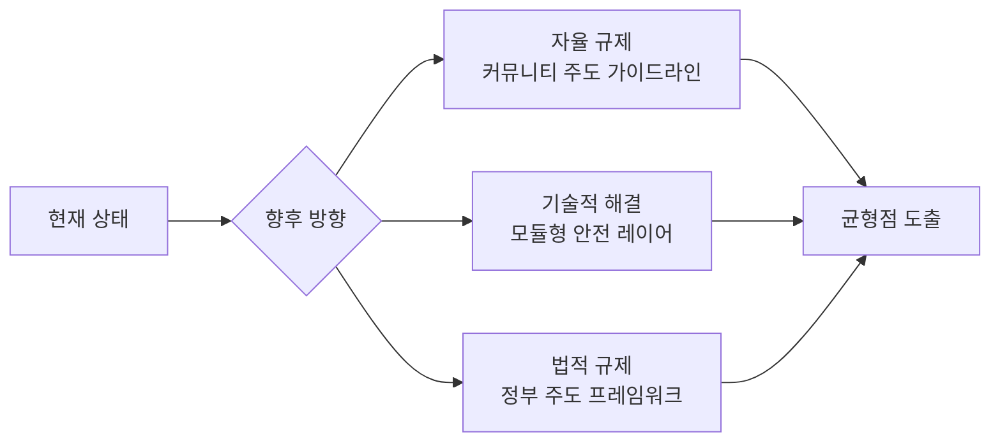

## 개요

2026년 초, 오픈소스 LLM 커뮤니티에 강력한 파문이 일었습니다. <strong>GPT-OSS 120B Uncensored</strong>라는 1,170억 파라미터 규모의 무검열 모델이 공개되면서, Reddit r/LocalLLaMA를 중심으로 "AI의 검열 철폐"에 대한 격렬한 논쟁이 벌어지고 있습니다.

이 포스트에서는 GPT-OSS 120B Uncensored의 기술적 배경, 무검열 모델이 왜 주목받는지, 그리고 세이프티 가드레일을 둘러싼 기술·윤리적 쟁점을 종합적으로 살펴봅니다.

## GPT-OSS 120B Uncensored란?

### 모델 개요

GPT-OSS 120B Uncensored는 기존 대형 언어 모델에서 <strong>안전성 필터(safety filter)</strong>와 <strong>RLHF 기반 검열 레이어</strong>를 제거한 오픈소스 모델입니다.

- <strong>파라미터 수</strong>: 약 1,170억(117B)
- <strong>공개 플랫폼</strong>: Hugging Face
- <strong>파생 모델</strong>: Aggressive 변형 등 다양한 커뮤니티 파인튜닝 버전 존재
- <strong>포맷</strong>: bf16, GGUF 등 다양한 양자화 버전 제공

### "Uncensored"의 의미

여기서 "Uncensored"란 단순히 욕설이나 성인 콘텐츠를 허용한다는 의미가 아닙니다. 기술적으로는 다음과 같은 변화를 포함합니다:

```
기존 모델의 안전성 파이프라인:
[사용자 입력] → [입력 필터] → [모델 추론] → [출력 필터] → [RLHF 정렬] → [응답]

Uncensored 모델:
[사용자 입력] → [모델 추론] → [응답]
```

- <strong>RLHF 정렬 제거</strong>: "도움이 되지만 해롭지 않은" 방향으로의 강제 조정 해제
- <strong>거부 패턴 제거</strong>: "죄송하지만 그 요청에는 응할 수 없습니다" 류의 거부 응답 학습 데이터 제거
- <strong>토픽 제한 해제</strong>: 의료, 법률, 화학 등 민감 영역에서의 응답 제한 완화

## 왜 무검열 모델이 주목받는가?

### 연구자와 개발자의 관점



r/LocalLLaMA 커뮤니티에서 무검열 모델이 지지를 받는 핵심 이유는 다음과 같습니다:

1. <strong>검열 과잉(Over-censorship) 문제</strong>: 상용 모델들이 무해한 요청까지 거부하는 사례가 빈번
2. <strong>연구 목적</strong>: 편향성 연구, 레드팀 테스트 등에서 제한 없는 모델이 필수
3. <strong>맞춤형 안전 레이어</strong>: 기본 모델 위에 자체 안전 장치를 구축하려는 수요
4. <strong>프라이버시</strong>: 민감한 데이터를 외부 API에 보내지 않고 로컬에서 처리

### 커뮤니티 반응

Reddit r/LocalLLaMA에서 224포인트 이상을 기록하며, 오픈소스 AI 커뮤니티의 강한 관심을 보여주었습니다. 주요 의견은 크게 두 갈래로 나뉩니다:

- <strong>지지 측</strong>: "AI 모델은 도구일 뿐, 사용자가 책임져야 한다"
- <strong>우려 측</strong>: "무제한 접근은 악용 위험을 높인다"

## 세이프티 가드레일 논쟁

### 기술적 관점: 가드레일의 구현 방식

현재 LLM의 안전성 확보 방법은 크게 세 가지 계층으로 나뉩니다:



무검열 모델은 <strong>계층 1(모델 레벨)</strong>의 제약을 제거한 것입니다. 이는 연구자에게는 "원재료"에 접근하는 것과 같지만, 동시에 모든 안전 장치가 사라진 상태이기도 합니다.

### 윤리적 관점: 오픈소스 AI의 딜레마

무검열 모델의 공개는 오픈소스 AI의 근본적 딜레마를 드러냅니다:

| 쟁점 | 오픈소스 자유 옹호 | 안전성 우선 주장 |
|------|-------------------|-----------------|
| <strong>접근성</strong> | 모든 사람에게 동등한 AI 접근권 | 악의적 사용자에게도 무장 |
| <strong>투명성</strong> | 검열 기준의 불투명성 해소 | 투명성과 무제한은 다른 문제 |
| <strong>혁신</strong> | 제한 없는 실험이 혁신 촉진 | 혁신의 대가가 사회적 해악이면 안 됨 |
| <strong>책임</strong> | 도구 제작자가 아닌 사용자 책임 | 예견 가능한 해악에 대한 제공자 책임 |

### 규제 동향

주요국의 AI 규제 움직임도 이 논쟁에 영향을 미치고 있습니다:

- <strong>EU AI Act</strong>: 고위험 AI 시스템에 대한 의무 부과, 오픈소스 예외 조항 논의 중
- <strong>미국</strong>: 행정명령 기반 자율 규제 강조, 오픈소스 모델 규제에는 소극적
- <strong>일본</strong>: AI 사업자 가이드라인을 통한 소프트 규제 접근
- <strong>중국</strong>: 생성형 AI 관리 규정으로 강력한 사전 규제

## 기술적 고려사항

### 로컬 실행 환경

120B 규모의 모델을 로컬에서 실행하기 위한 최소 요구사항:

```bash
# bf16 전체 정밀도: 약 240GB VRAM 필요
# GGUF Q4 양자화: 약 60-70GB VRAM/RAM
# GGUF Q2 양자화: 약 35-40GB VRAM/RAM

# 일반적인 실행 환경 예시 (llama.cpp)
./llama-server \
  --model gpt-oss-120b-uncensored-Q4_K_M.gguf \
  --ctx-size 4096 \
  --n-gpu-layers 80 \
  --host 0.0.0.0 \
  --port 8080
```

### 자체 안전 레이어 구축

무검열 모델을 활용하면서 안전성을 확보하는 접근법:

```python
# 무검열 모델 위에 커스텀 안전 레이어를 구축하는 패턴
class CustomSafetyLayer:
    def __init__(self, base_model, safety_config):
        self.model = base_model
        self.config = safety_config
        self.classifier = self._load_safety_classifier()
    
    def generate(self, prompt: str) -> str:
        # 입력 검증 (도메인별 맞춤 규칙)
        if self._check_input(prompt):
            response = self.model.generate(prompt)
            # 출력 필터링 (용도별 맞춤 규칙)
            return self._filter_output(response)
        return self._get_rejection_message(prompt)
    
    def _check_input(self, prompt: str) -> bool:
        # 조직/용도에 맞는 커스텀 입력 검증
        risk_score = self.classifier.evaluate(prompt)
        return risk_score < self.config.threshold
```

이 접근법의 장점은 <strong>용도에 최적화된 안전 장치</strong>를 구축할 수 있다는 것입니다. 의료용 챗봇은 의료 관련 규칙을, 교육용은 교육 관련 규칙을 적용할 수 있습니다.

## 오픈소스 AI의 미래 방향

무검열 모델 논쟁은 단순한 "검열 vs 자유"를 넘어, 오픈소스 AI 생태계의 거버넌스 문제로 확장되고 있습니다.



가장 유력한 방향은 <strong>모듈형 안전 아키텍처</strong>입니다:
- 기본 모델은 제한 없이 공개
- 안전 레이어를 별도 모듈로 제공
- 용도에 따라 적절한 안전 수준을 선택
- 배포 환경에서의 책임을 명확화

## 결론

GPT-OSS 120B Uncensored의 등장은 오픈소스 AI 커뮤니티가 마주한 근본적 질문을 떠올리게 합니다: <strong>"기술의 자유와 안전은 양립할 수 있는가?"</strong>

핵심 시사점을 정리하면:

1. <strong>무검열 모델 자체는 중립적 도구</strong>: 연구, 커스텀 안전 레이어 구축 등 정당한 용도가 존재
2. <strong>검열 과잉은 실제 문제</strong>: 상용 모델의 과도한 거부가 무검열 수요를 촉진
3. <strong>모듈형 안전 접근이 해답</strong>: 기본 모델과 안전 레이어의 분리가 가장 현실적
4. <strong>커뮤니티 거버넌스 필요</strong>: 법적 규제만으로는 오픈소스 생태계를 통제하기 어려움
5. <strong>지속적 논의가 필수</strong>: 기술 발전 속도에 맞춘 윤리적 프레임워크 업데이트

오픈소스 LLM이 계속 발전하는 한, 이 논쟁은 AI 개발의 핵심 의제로 남을 것입니다.

## 참고 자료

- [Reddit r/LocalLLaMA — GPT-OSS 120B Uncensored 관련 토론](https://www.reddit.com/r/LocalLLaMA/)
- [Hugging Face — GPT-OSS 120B Uncensored 모델 페이지](https://huggingface.co/models?search=uncensored+120b)
- [EU AI Act 공식 문서](https://artificialintelligenceact.eu/)
- [NIST AI Risk Management Framework](https://www.nist.gov/artificial-intelligence/ai-risk-management-framework)
