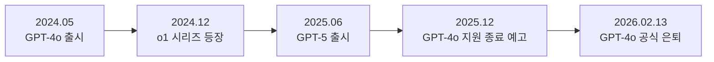
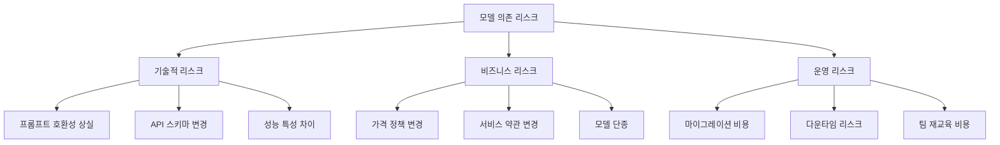
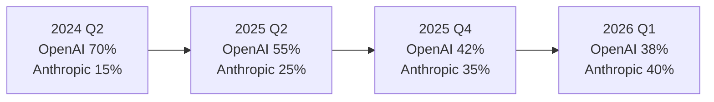
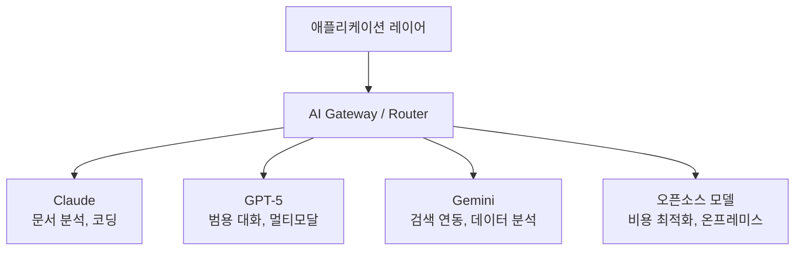
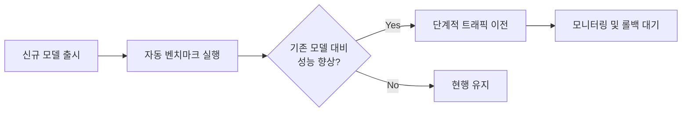

## 개요

2026년 2월 13일, OpenAI의 GPT-4o가 공식적으로 은퇴합니다. 2024년 5월 출시 이후 약 2년 만의 퇴장입니다. 이 사건은 단순한 모델 교체가 아닙니다. <strong>단일 모델에 의존한 기업들이 직면하는 구조적 리스크</strong>를 여실히 드러내는 사례이며, 동시에 Anthropic의 Claude가 엔터프라이즈 시장에서 점유율을 역전한 배경을 이해하는 열쇠이기도 합니다.

이 글에서는 GPT-4o 은퇴가 기업 AI 전략에 미치는 영향, Claude가 기업 시장에서 부상한 이유, 그리고 멀티모델 전략이 왜 필수인지를 분석합니다.

## GPT-4o 은퇴: 무엇이 바뀌나

### 타임라인

GPT-4o는 2024년 5월에 출시되어 OpenAI의 주력 모델로 자리잡았습니다. 멀티모달 기능, 빠른 응답 속도, 합리적인 가격으로 많은 기업이 프로덕션 시스템에 통합했습니다.



### 영향을 받는 기업들

GPT-4o API를 직접 호출하는 프로덕션 시스템을 운영하는 기업들은 다음과 같은 과제에 직면합니다:

- <strong>API 엔드포인트 마이그레이션</strong>: GPT-4o 전용 파라미터와 응답 형식 변경 대응
- <strong>프롬프트 재최적화</strong>: 새 모델에 맞게 프롬프트를 재작성해야 하는 비용
- <strong>성능 회귀 테스트</strong>: 기존 워크플로우가 새 모델에서 동일한 품질을 보장하는지 검증
- <strong>비용 구조 변화</strong>: 후속 모델의 토큰 가격 변동에 따른 예산 재편성

## 모델 의존 리스크란 무엇인가

### 벤더 록인의 AI 버전

전통적인 소프트웨어에서의 벤더 록인(Vendor Lock-in)과 유사하게, AI 분야에서도 <strong>모델 록인(Model Lock-in)</strong>이라는 새로운 형태의 의존성이 등장했습니다.



### 실제 사례: GPT-4o 의존 기업의 딜레마

GPT-4o에 깊이 의존한 기업들이 겪는 전형적인 문제를 살펴봅시다:

1. <strong>프롬프트 엔지니어링 자산의 가치 하락</strong>: 수개월에 걸쳐 최적화한 프롬프트가 새 모델에서 동일하게 작동하지 않음
2. <strong>파인튜닝 모델의 소실</strong>: GPT-4o 기반으로 파인튜닝한 커스텀 모델이 호환되지 않을 수 있음
3. <strong>평가 기준의 재설정</strong>: 품질 벤치마크와 평가 파이프라인을 처음부터 재구축

## Claude의 엔터프라이즈 시장 점유율 역전

### 왜 기업들은 Claude로 이동하는가

Anthropic의 Claude는 2025년 후반부터 엔터프라이즈 시장에서 눈에 띄는 성장세를 보이고 있습니다. 그 배경에는 몇 가지 구조적 요인이 있습니다:

<strong>1. 안전성과 신뢰성 우선 철학</strong>

Anthropic은 Constitutional AI와 같은 안전 기술을 기업 환경에 적합한 형태로 제공합니다. 규제가 강화되는 금융, 의료, 법률 분야에서 이 접근 방식이 높은 신뢰를 얻고 있습니다.

<strong>2. 일관된 API 정책</strong>

OpenAI가 빈번한 모델 교체와 API 변경으로 기업 고객에게 불확실성을 안긴 반면, Anthropic은 상대적으로 안정적인 모델 버전 관리와 명확한 지원 종료(deprecation) 정책을 유지해왔습니다.

<strong>3. 코딩 및 분석 능력의 우위</strong>

Claude 3.5 Sonnet 이후 Claude 시리즈는 코딩, 문서 분석, 장문 처리에서 경쟁 모델을 앞서는 성능을 보여주었습니다. 특히 기업 내부 문서 처리와 코드 리뷰 자동화에서 높은 평가를 받고 있습니다.

<strong>4. 200K 컨텍스트 윈도우의 실용성</strong>

Claude의 200K 토큰 컨텍스트 윈도우는 기업 환경에서 긴 계약서, 기술 문서, 코드베이스 분석에 직접적인 가치를 제공합니다.

### 시장 점유율 변화



위 수치는 업계 분석가들의 추정치를 종합한 것으로, 엔터프라이즈 API 사용량 기준입니다. 특히 Fortune 500 기업의 AI 도입 사례에서 Claude 채택률이 급증한 것이 눈에 띕니다.

## 멀티모델 전략: 리스크를 관리하는 방법

### 멀티모델 아키텍처의 기본 구조

단일 모델 의존에서 벗어나기 위한 멀티모델 전략은 다음과 같은 구조를 가집니다:



### 실전 구현 전략

#### 1. 추상화 레이어 도입

```typescript
// AI Gateway 추상화 예시
interface AIProvider {
  name: string;
  chat(messages: Message[], options: ModelOptions): Promise<Response>;
  embed(text: string): Promise<number[]>;
}

class AIRouter {
  private providers: Map<string, AIProvider>;
  private fallbackChain: string[];

  async route(task: TaskType, messages: Message[]): Promise<Response> {
    const primary = this.selectProvider(task);
    try {
      return await primary.chat(messages, this.getOptions(task));
    } catch (error) {
      // 폴백 체인을 따라 다음 프로바이더로 전환
      return this.fallback(task, messages, error);
    }
  }

  private selectProvider(task: TaskType): AIProvider {
    // 태스크 유형에 따라 최적의 프로바이더 선택
    switch (task) {
      case 'code-review': return this.providers.get('claude');
      case 'multimodal': return this.providers.get('gpt5');
      case 'search-augmented': return this.providers.get('gemini');
      default: return this.providers.get('claude');
    }
  }
}
```

#### 2. 프롬프트 포터빌리티 확보

모델 간 이식 가능한 프롬프트 설계 원칙:

- <strong>모델 고유 기능에 의존하지 않기</strong>: 특정 모델에서만 작동하는 시스템 프롬프트 기법 회피
- <strong>구조화된 출력 사용</strong>: JSON Schema 기반 응답 형식으로 모델 간 호환성 확보
- <strong>평가 기준 표준화</strong>: 모델에 구애받지 않는 품질 평가 파이프라인 구축

#### 3. 지속적 벤치마킹



## 기업이 지금 해야 할 일

### 즉시 실행 가능한 체크리스트

1. <strong>현재 모델 의존도 감사</strong>: 프로덕션에서 사용 중인 모든 AI 모델과 API 호출 지점을 목록화
2. <strong>폴백 전략 수립</strong>: 주력 모델 장애 시 대체 모델로 전환하는 자동화된 메커니즘 구축
3. <strong>프롬프트 자산 관리</strong>: 프롬프트를 버전 관리하고, 모델별 변환 테스트 자동화
4. <strong>비용 시뮬레이션</strong>: 멀티모델 운영 시 비용 구조를 사전에 시뮬레이션
5. <strong>팀 역량 다변화</strong>: 특정 모델 전문가가 아닌 AI 엔지니어링 범용 역량 육성

### 장기적 관점

AI 모델 시장은 앞으로 더 빠르게 변화할 것입니다. [2026년 2월만 해도 7개 이상의 주요 모델이 동시 출시](/ko/blog/ai-model-rush-february-2026)되는 상황입니다. 이런 환경에서 <strong>특정 모델에 올인하는 것은 기술 부채를 쌓는 행위</strong>입니다.

## 결론

GPT-4o의 은퇴는 AI 업계의 자연스러운 세대교체이지만, 준비되지 않은 기업에게는 위기가 됩니다. 이번 사건에서 배울 수 있는 핵심 교훈은 다음과 같습니다:

1. <strong>단일 모델 의존은 기술 부채다</strong>: 어떤 모델이든 결국 은퇴합니다
2. <strong>추상화 레이어는 보험이다</strong>: AI Gateway를 통한 멀티모델 라우팅은 선택이 아닌 필수
3. <strong>Claude의 부상은 우연이 아니다</strong>: 안정성, 성능, 기업 친화적 정책이 시장을 움직였습니다
4. <strong>멀티모델 전략이 경쟁력이다</strong>: 각 모델의 강점을 활용하는 전략적 접근이 승리합니다

AI 모델은 도구입니다. 도구에 의존하는 것이 아니라, <strong>도구를 교체할 수 있는 유연성</strong>을 갖추는 것이 진정한 경쟁력입니다.

## 참고 자료

- [OpenAI Model Deprecation Policy](https://platform.openai.com/docs/deprecations)
- [Anthropic Claude Enterprise](https://www.anthropic.com/enterprise)
- [2026년 2월 AI 모델 러시 분석](/ko/blog/ai-model-rush-february-2026)
