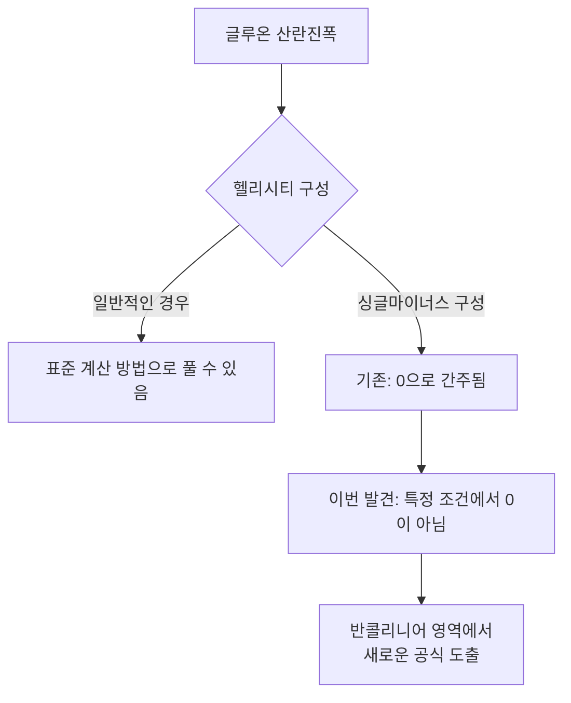
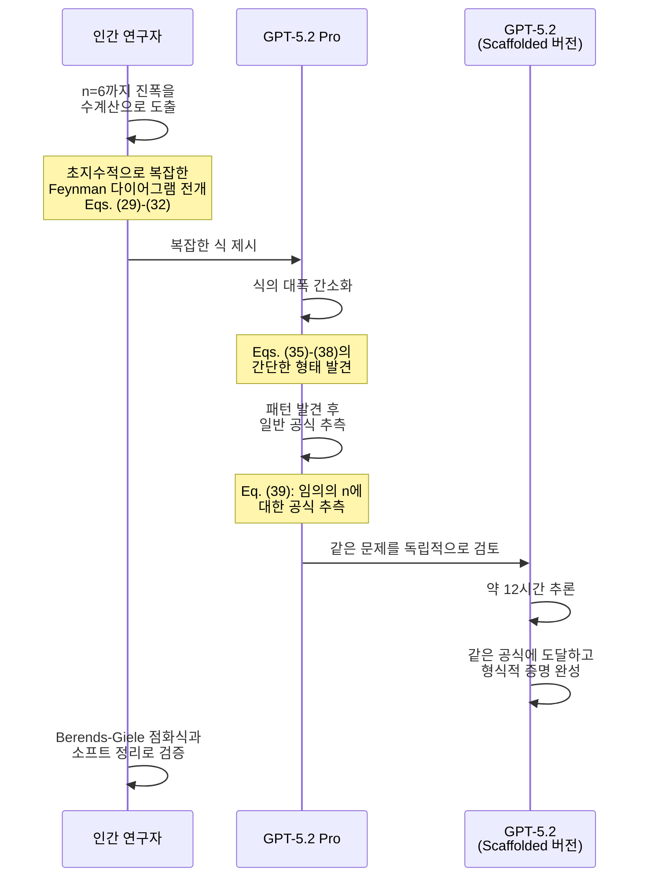
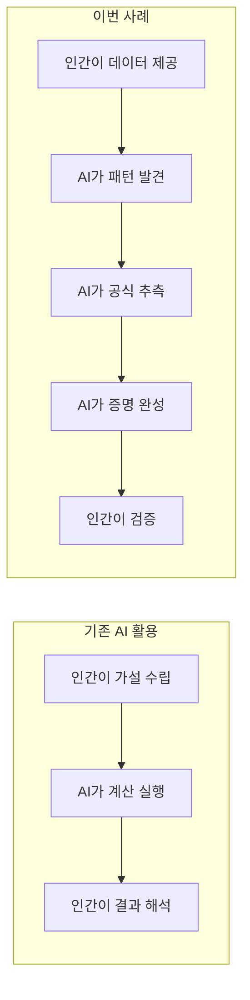
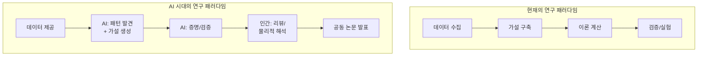

## 개요

2026년 2월, OpenAI는 이론물리학에서 획기적인 성과를 발표했습니다. <strong>GPT-5.2 Pro</strong>가 글루온(강한 핵력을 매개하는 입자)의 산란진폭에 관한 새로운 공식을 <strong>스스로 추측하고, 나아가 형식적 증명까지 완성</strong>한 것입니다.

이 성과는 arXiv에 프리프린트로 공개되었으며, 프린스턴 고등연구소, 하버드 대학교, 케임브리지 대학교 연구자들과의 공동 연구로 발표되었습니다. AI가 과학 연구에서 '도구'에서 '발견자'로 변하는 역사적인 전환점이라 할 수 있습니다.

## 무엇이 발견되었나

### 싱글마이너스 글루온 진폭의 재발견

논문 제목은 <strong>"Single-minus gluon tree amplitudes are nonzero"</strong>입니다. 이는 입자물리학의 핵심 개념인 '산란진폭'에 관한 발견입니다.

기존 교과서적 논의에서는, 1개의 글루온이 음의 헬리시티를 가지고 나머지 n-1개가 양의 헬리시티를 가지는 경우, 트리 레벨 진폭은 0이 된다고 알려져 있었습니다.

하지만 이번 연구는 <strong>"반콜리니어(half-collinear) 영역"</strong>이라는 특정 운동학적 조건에서는 이 진폭이 0이 되지 않음을 보여주었습니다.

### 왜 중요한가

산란진폭의 단순화는 양자장론에서 깊은 구조를 반복적으로 밝혀왔습니다. 이번 발견의 의미는:

- <strong>교과서의 상식을 뒤집음</strong>: 오랫동안 0으로 여겨진 진폭이 비영(non-zero)임을 증명
- <strong>중력자로의 확장</strong>: 동일한 분석이 중력을 매개하는 입자(중력자)에도 적용 가능
- <strong>새로운 연구 영역 개척</strong>: 수많은 후속 연구의 출발점

## AI의 역할: 도구에서 발견자로

### GPT-5.2의 구체적 기여

이 연구에서 AI의 역할은 단순한 계산 지원이 아니었습니다.

<strong>스텝 1</strong>: 인간 연구자가 n=6까지의 산란진폭을 수계산으로 구했습니다. 매우 복잡한 수식이었습니다.

<strong>스텝 2</strong>: GPT-5.2 Pro가 이 복잡한 수식을 대폭 간소화했습니다.

<strong>스텝 3</strong>: 간소화된 식에서 패턴을 발견하고, 임의의 n에 대해 유효한 일반 공식(논문의 Eq. 39)을 <strong>추측</strong>했습니다.

<strong>스텝 4</strong>: 내부의 스캐폴드된 GPT-5.2가 약 12시간에 걸쳐 같은 공식에 독립적으로 도달하고, <strong>형식적 증명</strong>을 완성했습니다.

### 기존 AI 활용과의 결정적 차이

기존 AI 활용에서는 가설 생성이 인간의 역할이었습니다. 하지만 이번에는:

- <strong>패턴 인식</strong>: 복잡한 식에서 법칙성을 발견
- <strong>가설 생성</strong>: 일반 공식을 스스로 추측
- <strong>증명</strong>: 약 12시간의 자율적 추론으로 형식적 증명 완성

이는 AI가 과학적 발견 프로세스의 핵심 부분을 담당한 최초의 중요한 사례 중 하나입니다.

## 과학계의 반응

### 고등연구소 니마 아르카니-하메드 교수

> "교과서적 방법으로 계산된 물리량의 식이 끔찍하게 복잡해 보이지만 실은 매우 단순하다는 것은 이 분야에서 자주 일어나는 일입니다. (중략) <strong>'단순한 공식을 찾는 것'이 가까운 미래에 범용적인 '단순 공식 패턴 인식' 도구로 발전하는</strong> 경향의 시작을 보는 것 같습니다."

### UCSB 나사니엘 크레이그 교수

> "이 논문은 <strong>AI 지원 과학의 미래를 엿보게 하는 것</strong>이며, 물리학자가 AI와 손잡고 새로운 통찰을 만들어내고 검증하는 모습을 보여줍니다. 물리학자와 LLM의 대화가 <strong>근본적으로 새로운 지식을 만들어낼 수 있다</strong>는 데에 의심의 여지가 없습니다."

## 과학 연구 워크플로우에 미치는 영향

### 연구 패러다임의 변화

이번 사례는 과학 연구 워크플로우에 근본적인 변화를 가져올 가능성을 보여줍니다.

<strong>1. 초인적 패턴 인식</strong>

인간에게는 인식이 어려운, 초지수적으로 복잡한 식에서의 패턴 발견. GPT-5.2가 이를 실현했으며, 니마 아르카니-하메드 교수가 지적하듯 "범용적 단순 공식 패턴 인식 도구"로의 길을 열었습니다.

<strong>2. 장시간의 자율적 추론</strong>

12시간에 걸친 형식적 증명 완성은, AI가 짧은 응답뿐 아니라 장시간의 깊은 사고가 가능함을 보여줍니다.

<strong>3. 인간과 AI의 새로운 협업 모델</strong>

이 연구에서는 인간이 기초 계산을 수행하고, AI가 그 너머의 발견을 담당하는 새로운 협업 패턴이 확립되었습니다. 저자 목록에는 OpenAI의 Kevin Weil이 "OpenAI를 대표하여" 포함되어 있어, AI의 기여가 공식적으로 인정되었습니다.

### 향후 전망

연구팀은 이미 GPT-5.2의 도움을 받아:

- 글루온에서 <strong>중력자</strong>로의 확장을 완료
- 기타 일반화도 진행 중
- 이러한 AI 지원 성과는 별도로 보고 예정

## 엔지니어에게 주는 시사점

### 기술적 관점

이 사례는 소프트웨어 엔지니어링에도 중요한 시사점을 줍니다:

- <strong>AI 추론 능력의 진화</strong>: 12시간 연속 추론과 형식적 증명은 코드 생성이나 버그 수정을 넘어선 능력을 시사
- <strong>도메인 전문가와의 협업 패턴</strong>: 인간이 문제를 정의하고 AI가 해결책을 탐색하는 협업 모델은 다른 분야에도 적용 가능
- <strong>검증의 중요성</strong>: AI가 낸 결과를 인간이 기존 방법(Berends-Giele 점화식)으로 검증하는 프로세스가 핵심

### AI 저자권 문제

이번 논문에서는 OpenAI의 Kevin Weil이 "OpenAI를 대표하여" 저자에 포함되었습니다. 이는 AI의 과학적 기여를 어떻게 인정할 것인가라는 새로운 문제를 제기합니다.

## 결론

GPT-5.2에 의한 이론물리학 신성과 도출은 <strong>AI가 과학적 발견자로서 기능한 역사적 전환점</strong>입니다. 단순한 계산 도구가 아닌, 패턴의 발견, 공식의 추측, 형식적 증명의 완성까지 — 과학적 발견 프로세스의 핵심을 담당했습니다.

이 사례는 AI 지원 과학 연구의 미래에 있어 하나의 템플릿을 제공합니다. 인간 연구자와 AI가 대등한 파트너로서 협업하여, 어느 한쪽만으로는 도달할 수 없었던 발견에 이르는 — 그런 과학의 새 시대의 막이 오르고 있습니다.

## 참고 자료

- [OpenAI 공식 발표: GPT-5.2 derives a new result in theoretical physics](https://openai.com/index/new-result-theoretical-physics)
- [arXiv 프리프린트: Single-minus gluon tree amplitudes are nonzero (arXiv:2602.12176)](https://arxiv.org/abs/2602.12176)
