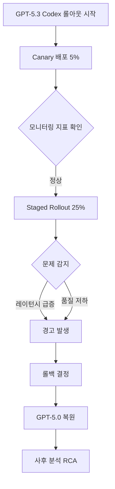
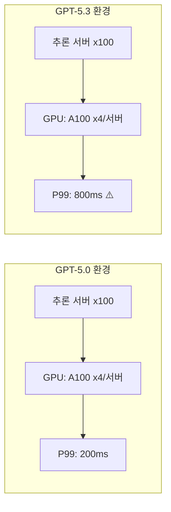

## 개요

2026년 2월, GitHub는 GPT-5.3 기반의 Codex 기능을 플랫폼 전체에 롤아웃하던 중 심각한 신뢰성 문제를 발견하고 <strong>일시적으로 이전 버전(GPT-5.0)으로 롤백</strong>하는 결정을 내렸습니다. 이 사건은 AI 모델의 버전 업그레이드가 단순한 기능 개선이 아니라, 프로덕션 인프라 전체의 안정성에 직결되는 문제임을 다시 한번 일깨워 주었습니다.

이 글에서는 GitHub Codex 롤백 사건의 배경과 원인을 분석하고, 엔지니어링 매니저(EM)의 관점에서 AI 모델 버전업 리스크를 어떻게 관리해야 하는지 논의합니다.

## 사건 경위

### GPT-5.3 Codex란?

GitHub Copilot의 코어 엔진인 Codex는 OpenAI의 GPT 모델을 기반으로 코드 생성, 자동 완성, 코드 리뷰 등의 기능을 제공합니다. GPT-5.3으로의 업그레이드는 다음과 같은 개선을 목표로 했습니다:

- <strong>코드 생성 정확도 향상</strong>: 복잡한 멀티파일 컨텍스트 이해 능력 강화
- <strong>응답 속도 개선</strong>: 추론 최적화를 통한 레이턴시 감소
- <strong>새로운 언어 지원</strong>: Rust, Zig 등 시스템 프로그래밍 언어 지원 확대

### 롤아웃 과정에서 발생한 문제

롤아웃은 단계적(canary → staged rollout)으로 진행되었으나, 본격적인 확대 배포 단계에서 다음과 같은 문제가 보고되었습니다:

1. <strong>응답 레이턴시 급증</strong>: P99 레이턴시가 기존 대비 3~5배 증가
2. <strong>코드 제안 품질 저하</strong>: 특정 언어(TypeScript, Python)에서 hallucination 비율 상승
3. <strong>VSCode 확장 크래시</strong>: 메모리 사용량 급증으로 인한 IDE 불안정
4. <strong>API Rate Limiting 이슈</strong>: 백엔드 추론 서버의 과부하로 인한 연쇄 장애

### 롤백 결정

GitHub 엔지니어링 팀은 <strong>사용자 영향도</strong>와 <strong>복구 시간</strong>을 고려하여 GPT-5.0으로의 즉각적인 롤백을 결정했습니다. 이는 "안전 우선(safety-first)" 원칙에 따른 판단이었습니다.

## 기술적 분석: 왜 문제가 발생했는가

### 1. 모델 크기와 추론 비용의 트레이드오프

GPT-5.3은 5.0 대비 파라미터 수가 약 40% 증가했습니다. 이론적으로는 더 높은 품질의 출력을 기대할 수 있지만, 실제 프로덕션 환경에서는:

- <strong>GPU 메모리 사용량 증가</strong> → 동시 처리 가능한 요청 수 감소
- <strong>추론 시간 증가</strong> → 사용자 체감 레이턴시 악화
- <strong>배치 처리 효율 저하</strong> → 서버 당 처리량(throughput) 감소

### 2. 프롬프트 호환성 문제

기존 GPT-5.0에 최적화된 시스템 프롬프트와 few-shot 예제가 5.3에서는 예상과 다르게 동작했습니다. 특히:

- <strong>코드 컨텍스트 윈도우 처리 방식 변경</strong>: 파일 경계 인식 로직의 차이
- <strong>토큰 분할(tokenization) 변경</strong>: 코드 토크나이저의 미세한 차이가 출력에 영향
- <strong>안전 필터 강화</strong>: 과도한 필터링으로 정상적인 코드 제안까지 차단

### 3. 인프라 스케일링 미스매치

동일한 인프라에서 더 큰 모델을 서빙하면서 용량 계획(capacity planning)이 부족했던 것이 근본 원인 중 하나였습니다.

## 엔지니어링 매니저 관점의 교훈

### 1. AI 모델 버전업은 인프라 변경이다

AI 모델의 버전 업그레이드를 단순한 "소프트웨어 업데이트"로 취급해서는 안 됩니다. 모델 변경은 다음을 수반합니다:

- <strong>인프라 용량 재산정</strong>: GPU, 메모리, 네트워크 대역폭
- <strong>성능 기준선(baseline) 재설정</strong>: SLA/SLO 재검토
- <strong>통합 테스트 전면 재실행</strong>: 다운스트림 서비스 영향 평가

### 2. 카나리 배포만으로는 부족하다

이번 사건에서 카나리 배포(5%)에서는 문제가 드러나지 않았습니다. 이는 다음과 같은 함정을 시사합니다:

- <strong>트래픽 패턴의 차이</strong>: 카나리 대상 사용자의 사용 패턴이 전체 사용자와 다를 수 있음
- <strong>부하 의존적 문제</strong>: 일정 규모 이상의 동시 요청에서만 발생하는 성능 병목
- <strong>장시간 누적 문제</strong>: 메모리 누수 등 시간 경과에 따라 악화되는 이슈

<strong>대책</strong>: Shadow traffic testing(실제 트래픽 복제 테스트), 부하 테스트(load testing)의 병행이 필수입니다.

### 3. 롤백 전략을 사전에 수립하라

GitHub 팀이 빠르게 롤백할 수 있었던 이유는 <strong>사전에 롤백 계획이 수립되어 있었기 때문</strong>입니다. EM으로서 다음을 보장해야 합니다:

- <strong>Feature Flag 기반 배포</strong>: 모델 버전을 런타임에 전환 가능하도록 설계
- <strong>자동 롤백 트리거</strong>: 핵심 지표(레이턴시, 에러율) 임계치 초과 시 자동 복원
- <strong>롤백 리허설</strong>: 정기적으로 롤백 시나리오를 테스트

### 4. 사용자 커뮤니케이션 체계

플랫폼 장애 시 사용자에게 투명하게 상황을 공유하는 것이 신뢰 유지의 핵심입니다:

- <strong>Status Page 즉시 업데이트</strong>: 장애 인지 후 15분 이내 공지
- <strong>기술적 원인의 적절한 수준 공개</strong>: 과도한 상세도 불필요하나, 원인과 대책은 명확히
- <strong>복구 타임라인 제시</strong>: 불확실하더라도 예상 시간 공유

## AI 모델 버전업 리스크 관리 프레임워크

엔지니어링 조직에서 AI 모델 버전업 시 활용할 수 있는 체크리스트를 제안합니다:

### 배포 전 (Pre-deployment)

| 항목 | 상세 |
|------|------|
| 벤치마크 테스트 | 기존 모델 대비 정확도/레이턴시/처리량 비교 |
| 인프라 용량 검증 | 새 모델의 리소스 요구사항 산정 및 프로비저닝 |
| 프롬프트 호환성 검증 | 기존 시스템 프롬프트의 동작 확인 |
| 롤백 계획 수립 | Feature flag, 자동 트리거, 리허설 |
| Shadow Testing | 실트래픽 복제를 통한 사전 검증 |

### 배포 중 (During deployment)

| 항목 | 상세 |
|------|------|
| 단계적 롤아웃 | 5% → 25% → 50% → 100% |
| 실시간 모니터링 | 레이턴시, 에러율, 사용자 피드백 |
| 자동 롤백 임계치 | P99 > 2x baseline → 자동 중단 |
| 사용자 영향 분석 | 실제 사용자 경험 지표 추적 |

### 배포 후 (Post-deployment)

| 항목 | 상세 |
|------|------|
| RCA (Root Cause Analysis) | 문제 발생 시 근본 원인 분석 |
| 포스트모템 공유 | Blameless 포스트모템 문화 |
| 프로세스 개선 | 체크리스트 업데이트, 자동화 강화 |

## VSCode 확장 생태계에 미치는 영향

이번 사건은 VSCode 확장(extension) 개발자 생태계에도 중요한 시사점을 남겼습니다:

- <strong>확장 안정성 의존 관계</strong>: Copilot 확장이 불안정해지면 다른 확장까지 영향
- <strong>리소스 사용 가이드라인 필요</strong>: AI 기반 확장의 메모리/CPU 사용 제한
- <strong>Graceful degradation 패턴</strong>: 백엔드 장애 시에도 IDE가 정상 동작하도록 설계

## 결론

GitHub의 GPT-5.3 Codex 롤백 사건은 <strong>AI 모델의 프로덕션 배포가 얼마나 복잡한 엔지니어링 과제인지</strong>를 보여주는 사례입니다. 단순히 "더 좋은 모델"을 적용하면 서비스가 개선될 것이라는 가정은 위험합니다.

엔지니어링 매니저로서 우리가 기억해야 할 핵심은:

1. <strong>AI 모델 변경은 인프라 변경과 동일한 수준의 리스크 관리가 필요합니다</strong>
2. <strong>카나리 배포 + Shadow Testing + 부하 테스트의 삼중 검증이 필수입니다</strong>
3. <strong>롤백 계획은 배포 계획의 일부여야 합니다</strong>
4. <strong>사용자 커뮤니케이션은 기술적 대응만큼 중요합니다</strong>

이번 사건을 계기로 AI 기반 서비스의 배포 프로세스가 한층 더 성숙해지길 기대합니다.

## 참고 자료

- [GitHub Status — Codex 롤백 공지](https://x.com/github/status/2021040916451164412)
- [GitHub Copilot 공식 문서](https://docs.github.com/en/copilot)
- [Google SRE Book — Release Engineering](https://sre.google/sre-book/release-engineering/)
- [Progressive Delivery: Feature Flags, Canary, and Shadow Traffic](https://launchdarkly.com/blog/progressive-delivery/)
