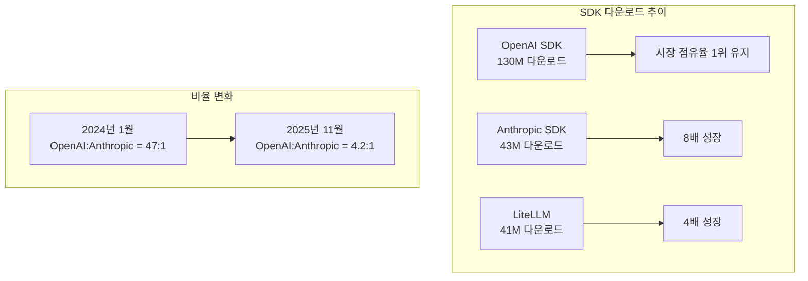
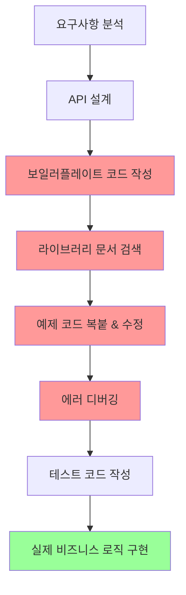
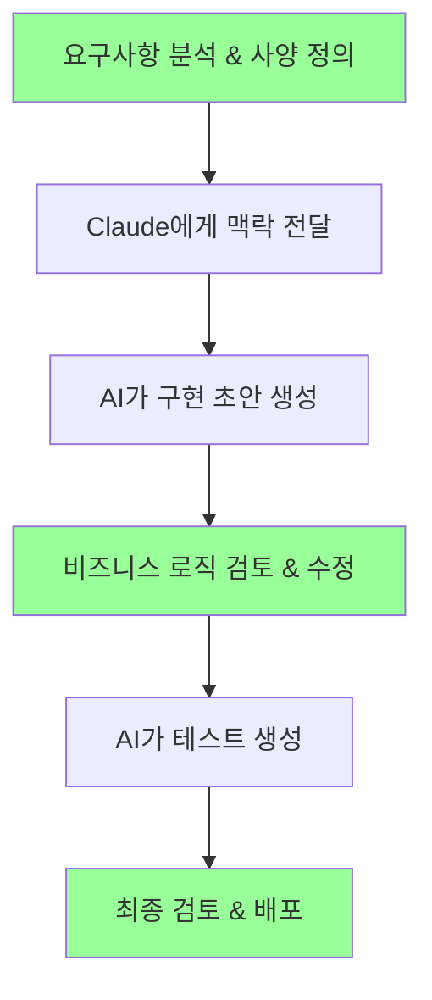

## 개요

Greptile에서 발표한 <strong>"The State of AI Coding 2025"</strong> 리포트가 업계에서 큰 주목을 받고 있습니다. 이 리포트는 2025년 3월부터 11월까지의 데이터를 기반으로 AI 코딩 도구가 실제로 개발자 생산성에 어떤 영향을 미쳤는지를 정량적으로 분석한 자료입니다.

이 글에서는 리포트의 핵심 발견들을 정리하고, 저의 개인적인 경험을 바탕으로 AI 코딩 도구가 가져온 실질적인 변화에 대해 논의해 보겠습니다.

> <strong>참고</strong>: 이 글은 [Greptile State of AI Coding 2025](https://www.greptile.com/state-of-ai-coding-2025) 리포트의 리뷰입니다.

## 리포트 핵심 발견 요약

### 1. 개발자 생산성 지표의 극적인 변화

리포트에서 가장 주목할 만한 수치들입니다:

| 지표 | 변화율 | 상세 |
|------|--------|------|
| <strong>개발자당 코드 출력량</strong> | <strong>+76%</strong> | 4,450줄 → 7,839줄 |
| <strong>PR 크기 (중앙값)</strong> | <strong>+33%</strong> | 57줄 → 76줄 |
| <strong>파일당 변경 라인</strong> | <strong>+20%</strong> | 18줄 → 22줄 |

특히 6〜15명 규모의 중간 크기 팀에서 <strong>89%의 코드 출력 증가</strong>를 기록했다는 점이 인상적입니다. 이는 AI 도구가 단순히 개인 개발자뿐 아니라 팀 단위의 협업 환경에서도 효과적이라는 것을 보여줍니다.

### 2. AI 도구 생태계의 급격한 성장

OpenAI가 여전히 시장을 리드하고 있지만, Anthropic의 성장세가 놀랍습니다. <strong>1,547배 성장</strong>이라는 수치는 Claude가 개발자 커뮤니티에서 얼마나 빠르게 채택되고 있는지를 보여줍니다.

### 3. CLAUDE.md 파일의 표준화

리포트에 따르면 <strong>전체 저장소의 67%가 CLAUDE.md 규칙 파일을 채택</strong>했습니다. 이는 AI 에이전트에게 코드베이스 컨텍스트를 제공하는 것이 개발 워크플로우의 표준으로 자리 잡았음을 의미합니다.

17%의 저장소는 세 가지 형식(CLAUDE.md, .cursorrules, .github/copilot-instructions.md)을 모두 사용하고 있어, 멀티 AI 도구 환경이 현실화되고 있습니다.

### 4. 모델 성능 벤치마크

| 모델 | TTFT (p50) | 비용 배수 |
|------|-----------|----------|
| Claude Opus 4.5 | < 2.5초 | 3.30x |
| Claude Sonnet 4.5 | < 2.5초 | 2.00x |
| GPT-5.1 | > 5초 | 1x (기준) |
| GPT-5 Codex | > 5초 | 1x |
| Gemini 3 Pro | 13.1초 | 1.40x |

Anthropic 모델들이 응답 속도에서 우위를 보이고 있으며, 이는 개발자 경험에 직접적인 영향을 미칩니다. 코드 작성 중 지연 시간이 줄어들면 개발 흐름이 끊기지 않아 생산성이 높아집니다.

## 나의 경험: 사양과 비즈니스 로직에만 집중할 수 있게 되다

리포트의 수치들이 인상적이지만, 저에게 더 중요한 것은 <strong>일하는 방식의 근본적인 변화</strong>입니다.

### Before: 구현 세부사항에 시간을 뺏기던 시절

이전에는 <strong>전체 개발 시간의 70% 이상을 구현 세부사항에 소비</strong>했습니다:
- "이 라이브러리 어떻게 설정하지?"
- "이 에러 메시지는 무슨 의미야?"
- "비슷한 코드 어디서 봤는데..."
- "테스트 코드 어떻게 구조화하지?"

### After: 비즈니스 로직에 집중하는 현재

지금은 <strong>사양 정의와 비즈니스 로직 검토에 집중</strong>합니다:

1. <strong>명확한 사양 작성</strong>: "무엇을 만들 것인가"에 대한 명확한 정의
2. <strong>맥락 제공</strong>: CLAUDE.md를 통해 프로젝트 구조와 규칙 전달
3. <strong>결과물 검토</strong>: AI가 생성한 코드가 비즈니스 요구사항을 충족하는지 확인
4. <strong>핵심 로직 조율</strong>: 복잡한 비즈니스 규칙이나 엣지 케이스 처리

### 구체적인 생산성 향상 사례

#### 1. 새로운 기능 개발

<strong>이전</strong>: 새 API 엔드포인트 하나 추가하는 데 2〜3시간
- 라우팅 설정
- 요청/응답 타입 정의
- 에러 핸들링
- 테스트 작성

<strong>현재</strong>: 30분 이내
- 요구사항을 Claude에게 설명
- 생성된 코드 검토
- 비즈니스 로직 세부 조정
- 테스트 실행 및 확인

#### 2. 디버깅

<strong>이전</strong>: 에러 로그 분석 → 스택오버플로우 검색 → 시행착오 (1〜2시간)

<strong>현재</strong>: 에러 메시지와 컨텍스트 제공 → 원인 분석 및 해결책 제시 (10〜20분)

#### 3. 코드 리뷰

<strong>이전</strong>: 코드 스타일, 잠재적 버그, 성능 이슈를 수동으로 확인

<strong>현재</strong>: AI가 1차 검토 후 핵심 비즈니스 로직과 아키텍처 결정에만 집중

### 정량적 체감 변화

| 업무 영역 | 시간 절감 | 주요 원인 |
|----------|----------|----------|
| 보일러플레이트 코드 | <strong>90%</strong> | AI가 패턴 기반으로 즉시 생성 |
| 라이브러리 학습 | <strong>80%</strong> | 문서 대신 컨텍스트 기반 예제 제공 |
| 디버깅 | <strong>70%</strong> | 에러 원인 분석 자동화 |
| 테스트 작성 | <strong>75%</strong> | 테스트 케이스 자동 생성 |
| 코드 리팩토링 | <strong>60%</strong> | 패턴 인식 및 개선안 제시 |

## 생산성 향상의 진정한 의미

리포트에서 76%의 코드 출력 증가를 언급했지만, 저는 <strong>더 중요한 변화</strong>가 있다고 생각합니다.

### 1. 인지 부하 감소

AI 도구가 "어떻게 구현할 것인가"의 부담을 덜어주면서, <strong>"무엇을 만들 것인가"</strong>에 대한 사고에 더 많은 에너지를 쏟을 수 있게 되었습니다.

### 2. 학습 곡선 완화

새로운 기술이나 프레임워크를 도입할 때의 장벽이 낮아졌습니다. 문서를 처음부터 읽는 대신, 현재 코드베이스에 맞는 구체적인 예제를 즉시 받을 수 있습니다.

### 3. 실험의 용이성

아이디어를 빠르게 프로토타입으로 만들어볼 수 있어, 더 많은 실험과 반복이 가능해졌습니다.

## 주의해야 할 점들

물론 AI 코딩 도구가 만능은 아닙니다.

### 1. 맥락 제공의 중요성

AI가 좋은 결과물을 내려면 <strong>명확한 맥락과 요구사항</strong>이 필요합니다. CLAUDE.md 같은 규칙 파일의 품질이 결과물의 품질에 직접적인 영향을 미칩니다.

### 2. 검토의 필수성

AI가 생성한 코드를 그대로 사용하면 안 됩니다. 특히:
- 보안 관련 코드
- 비즈니스 크리티컬한 로직
- 성능에 민감한 부분

### 3. 도메인 지식의 중요성

AI는 도구입니다. <strong>도메인 전문성과 시스템 설계 능력</strong>은 여전히 개발자의 핵심 역량입니다.

## 결론

Greptile의 리포트는 AI 코딩 도구가 실제로 개발 생산성에 긍정적인 영향을 미치고 있음을 데이터로 보여줍니다. 76%의 코드 출력 증가, 33%의 PR 크기 증가 같은 수치들이 이를 뒷받침합니다.

하지만 저에게 더 의미 있는 변화는 <strong>일하는 방식의 전환</strong>입니다. 구현 세부사항에 시간을 뺏기지 않고, <strong>사양과 비즈니스 로직에 집중</strong>할 수 있게 되었습니다. 이것이야말로 AI 코딩 도구가 가져온 진정한 생산성 향상이라고 생각합니다.

AI 시대의 개발자는 더 이상 "코드를 타이핑하는 사람"이 아닙니다. <strong>"문제를 정의하고 해결책을 설계하는 사람"</strong>으로 역할이 진화하고 있습니다. 그리고 이 변화는 이제 시작에 불과합니다.

## 참고 자료

- [Greptile - The State of AI Coding 2025](https://www.greptile.com/state-of-ai-coding-2025)
- [Anthropic - Claude Code Best Practices](https://www.anthropic.com/engineering/claude-code-best-practices)
- [GitHub - Copilot Impact Report 2024](https://github.blog/news-insights/research/the-state-of-the-octoverse-2024/)
