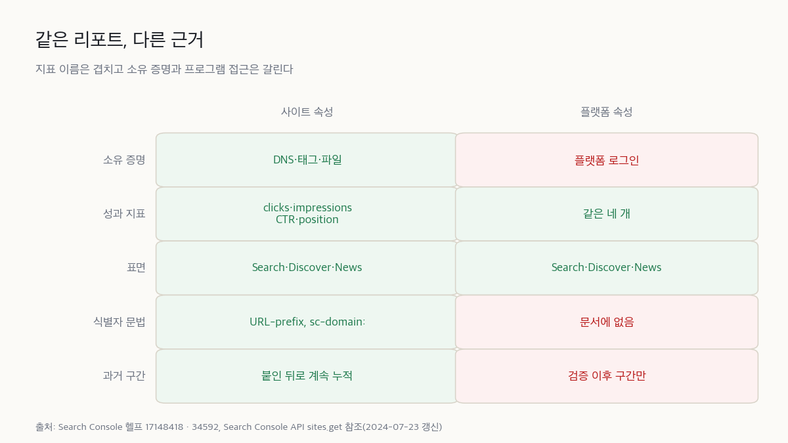

2026년 7월 29일 공지는 플랫폼 속성이 전세계 누구에게나 열렸다고 적었다. 3주가 지난 오늘 헬프센터 두 페이지를 긁어 보니 점진 롤아웃 중이라는 문장이 그대로 살아 있다. 같은 회사가 같은 기능의 가용성을 두 갈래로 말한다. 사소한 어긋남처럼 보이는데 속성을 실제로 붙이려는 사람 앞에서 다시 걸린다.

먼저 결론. Search Console을 브라우저로 직접 열어 보는 팀이라면 오늘 계정 네 개를 붙이고 기본 28일 창을 그대로 읽으면 된다. 돈이 들지 않고 잃을 것도 없다. Search Console을 [API나 BigQuery로 끌어다 주간 리포트를 자동 생성](/ko/blog/ko/google-analytics-mcp-automation/)해 둔 팀이라면 반대다. 속성은 붙이되 파이프라인에는 넣지 마라. 측정을 잘 자동화한 조직일수록 새 데이터를 늦게 본다. 역전의 원인은 권한도 가격도 아니고 API 문서에 적히지 않은 한 줄이다.

## 3주 사이에 공지가 두 번 나왔다

Search Console의 속성은 원래 웹사이트를 가리키는 단위였다. 도메인이나 URL 접두를 등록하고 그 자리가 내 것임을 증명하면 등록한 범위의 검색 성과가 보인다. 2026년 7월 7일 공지에서 이 단위가 하나 늘었다. 웹사이트가 아니라 소셜·영상 계정을 속성으로 등록할 수 있게 됐고 고를 수 있는 플랫폼은 넷이다. Instagram, TikTok, X, YouTube.

이 변화를 개발 용어 없이 말하면 이렇다. 지금까지 구글이 검색 성과를 보여 주는 조건은 그 자리를 내가 통제한다는 증명이었다. 서버에 파일을 올릴 수 있거나 DNS를 만질 수 있는 사람만 숫자를 받았다. 소셜 계정은 그 조건을 만족시킬 방법이 없어서 검색 성과를 물어볼 창구 자체가 없었다. 플랫폼 속성은 그 창구를 열면서 증명 방식을 바꿨다.

첫 공지는 앞으로 몇 주에 걸쳐 순차적으로 열겠다고 했다. 3주 뒤 두 번째 공지가 그 단계를 닫았다.

> Today, platform properties are globally available to everyone.
> — [Platform properties roll out globally, plus a new social and video performance guide](https://developers.google.com/search/blog/2026/07/platform-properties-social-video-guide)

같은 공지에서 대상 표면에 Google News가 함께 적혔다. 검색과 Discover로 출발한 리포트가 뉴스까지 센다는 뜻이다. 문서 갱신 로그를 봐도 소셜·영상 성과를 분석하는 가이드가 추가된 날이 7월 29일로 같다. 기능과 사용법이 한 날에 붙었으니 여기까지는 깔끔하다.

## 못 읽는 이유는 권한이 아니라 이름이다

자동화해 둔 팀의 문제는 여기서 시작한다. Search Console API는 속성을 문자열 하나로 가리킨다. `sites.get` 참조 문서가 그 문자열을 이렇게 설명한다.

> The URL of the property to retrieve, as defined by Search Console. Examples: http://www.example.com/ (for a URL-prefix property) or sc-domain:example.com (for a Domain property)
> — [Sites: get | Search Console API](https://developers.google.com/webmaster-tools/search-console-api-original/v3/sites/get)

문서화된 문법은 둘이다. `http://www.example.com/` 같은 URL 접두 형태와 `sc-domain:example.com` 같은 도메인 형태. 그런데 플랫폼 속성의 식별자는 URL이 아니다. 헬프센터가 드는 예시는 `instagram.com/username` 처럼 계정 경로다. 세 번째 문법이 필요한 셈인데 참조 문서에는 그 자리가 없다.

같은 페이지를 긁어서 확인했다.

```bash
curl -sSL "https://developers.google.com/webmaster-tools/search-console-api-original/v3/sites/get" \
  | grep -o "sc-domain:example.com\|Last updated 2024-07-23 UTC\|instagram" \
  | sort | uniq -c
```

```
   1 Last updated 2024-07-23 UTC
   1 sc-domain:example.com
```

instagram은 0건이다. 마지막 갱신은 2024년 7월 23일. 플랫폼 속성이 나오기 2년 전에 멈춘 문서다.

파이프라인이 새 데이터를 못 읽는 이유는 권한이 없어서가 아니라 가리킬 이름을 몰라서다. 공식 문서에 적힌 제어와 배포본이 어긋난 기록과 같은 층이다. 화면에는 있고 문서에는 없는 자리가 리포트의 범위를 정한다. 이 구분이 대응을 가른다. 권한 문제라면 계정 설정에서 바로 풀면 된다. 이름 문제는 구글이 문법을 문서에 적어 주기 전까지 손댈 방법이 없다. 실제 엔드포인트가 어떤 문자열을 받아 주는지는 알 수 없고 문서에 없는 문자열을 넣어 본 결과를 근거로 삼을 수도 없다. 오늘 대시보드에 넣을 수 있는 것은 추측이지 계약이 아니다. 조용히 틀린 합계는 빈칸보다 나쁘다.

자동 리포트의 실제 모양을 보면 이 막힘이 어디서 걸리는지 분명하다. 스케줄러가 속성 목록을 받아 온다. 목록에 든 속성마다 기간과 차원을 붙여 쿼리를 날리고 돌아온 행을 시트나 웨어하우스에 적재한다. 이 사슬에서 속성을 지목하는 고리가 문자열 하나다. 목록 API가 새 속성을 돌려준다 해도 그 문자열이 어떤 형식으로 오고 쿼리에 그대로 넣어도 되는지가 문서에 없으면 매핑을 확정할 수 없다. 확정하지 못한 매핑을 넣고 배포하면 다음 주 리포트는 조용히 합계가 달라진 채로 나간다.

역전이 여기서 생긴다. 손으로 Search Console을 여는 팀은 오늘 새 화면을 그냥 본다. 파이프라인을 잘 만들어 둔 팀은 볼 방법이 없다. 문화적 요인도 하나 붙는다. 자동화가 성숙한 조직은 대시보드 밖의 숫자를 신뢰하지 않는다. 파이프라인을 통과하지 않은 수치는 회의 자료로 올리지 못한다는 규칙이 대개 옳게 작동해 왔기 때문이다. 그 규칙이 이번에는 새 데이터를 가로막는 쪽으로 작동한다.

이름 문제는 화면 안쪽에도 하나 더 있다. Insights 페이지의 요약 카드와 그 아래 상세 리스트는 집계 범위가 서로 다르다.

> On the Insights page, the top summary card shows all clicks to your property across Google (including web, image, video, and news searches). However, the detailed lists below the summary card focus specifically on traffic from web search results.
> — [About platform properties in Search Console](https://support.google.com/webmasters/answer/17148418)

요약은 웹·이미지·영상·뉴스를 다 세고 아래 리스트는 웹 검색만 센다. 구글은 개별 카드의 합이 요약보다 작을 수 있다고 설명한다. 정상 동작인데 둘 다 clicks라는 같은 이름을 쓴다. [prerender에서 LCP가 6.2초로 찍힌 이유](/ko/blog/ko/prerender-activationstart-cwv-measurement-2026/)와 같다. 지표 이름은 같고 시계가 다르다. 리포트를 받아 보는 사람 눈에는 이게 계산 오류로 보인다. 각주를 안 달면 매달 같은 질문을 받게 된다.

## 리포트 이름이 같아도 세는 것이 다르다

사이트 속성과 나란히 놓고 보면 겹치는 칸과 갈리는 칸이 분명하다.



소유의 근거. 사이트 속성은 내가 통제하는 것으로 증명한다. DNS 레코드, HTML 태그, 파일 업로드. 플랫폼 속성은 그럴 대상이 없다. 헬프센터가 적는 방법은 기존 사이트 속성으로 자동 연결하거나 플랫폼에 직접 로그인하는 방식이다. 소유권은 주기적으로 다시 확인한다. 외부 로그인이 만료되면 리포트 접근이 정지되고 다시 인증하면 같은 리포트로 돌아온다. 데이터가 다시 쌓일 때까지 기다릴 필요는 없다.

세는 대상. 여기를 오해하면 기대치가 엉뚱한 쪽으로 커진다.

> Platform properties only show how your content performs on Google Search. They don’t track when people see your content on the platform itself (for example, they won’t show how many times your video appeared on TikTok).
> — [About platform properties in Search Console](https://support.google.com/webmasters/answer/17148418)

TikTok 안에서 몇 번 노출됐는지는 이 화면에 없다. 보이는 것은 구글이 그 계정의 콘텐츠를 검색·Discover·뉴스에 얼마나 내보냈고 몇 번 클릭을 받았는지다. 지표 이름은 사이트 속성과 똑같다. 클릭, 노출, 평균 CTR, 평균 게재순위. Discover와 뉴스 리포트는 그 표면에서 유입이 있을 때만 나타난다. 유입이 없으면 리포트 자체가 안 보이니 항목이 없다는 것과 데이터가 0이라는 것을 구분해서 읽어야 한다.

읽는 방법. 가이드는 플랫폼 간 비교를 export로 안내한다. 속성 하나를 열어 파일로 내려받고 나머지 속성에서 같은 작업을 반복하는 식이다. 속성을 합쳐 주는 API나 한 화면에 모아 보는 뷰는 없다. 포맷을 나누는 정식 차원도 빠져 있다. YouTube에서 일반 영상과 Shorts를 나누라고 안내하는 방법은 URL에 `/watch`가 들었는지 `/shorts/`가 들었는지로 거르는 것이다. 문자열 필터가 콘텐츠 타입의 대체물로 쓰인다.

수동 export에는 눈에 안 보이는 비용이 하나 있다. 네 플랫폼에서 내려받은 파일을 한 시트로 합치면 그 시트를 누군가 매달 유지해야 한다. 담당자가 바뀌면 열이 하나 늘거나 기간이 어긋난다. 이 시트를 정식 리포트에 넣지 말고 옆에 격리해 두라는 판단의 근거는 정확성보다 수명이다. 격리된 시트는 틀렸을 때 그 시트만 버리면 된다.

## 붙여 보려면 어디서 막히나

먼저 걸리는 것은 화면이 아니라 문서다. 전면 공개 공지 20일 뒤인 오늘도 헬프센터에는 롤아웃 문장이 남아 있다.

```bash
curl -sSL -A "Mozilla/5.0" "https://support.google.com/webmasters/answer/17148418?hl=en" \
  | python3 -c "import sys,re,html;s=sys.stdin.read();s=re.sub(r'<[^>]+>',' ',s);print('HIT' if 'rolling out this feature gradually' in html.unescape(s) else 'GONE')"
```

결과는 `HIT`였다. 속성 추가를 안내하는 34592 페이지도 같은 문장을 갖고 있다.

> We’re rolling out this feature gradually, so it might not be available to everyone yet.
> — [About platform properties in Search Console](https://support.google.com/webmasters/answer/17148418)

추가 화면에 항목이 보이지 않으면 판단이 어려워진다. 계정 유형이나 지역에 실제 예외가 남았는지 문서가 갱신을 못 따라간 것인지 밖에서는 구분할 방법이 없다. 도입을 결정하는 자리라면 이를 위험 항목으로 한 줄 잡아 두는 편이 낫다. 화면에 안 보일 수 있고 그때 대응은 기다리는 것뿐이다.

나머지 걸림돌은 순한 편이다. Search profile을 이미 청구해 둔 계정이라면 검증된 계정들이 자동으로 속성에 들어간다. 손으로 추가하는 경우 검증 직후에는 차트가 비어 있을 수 있다. 수집과 처리에 며칠이 걸린다. 신규 속성은 수집을 시작한 이후 구간만 채운다. 작년 같은 달과 비교하겠다는 계획은 오늘 세워도 성립하지 않는다.

플레이리스트를 다룬다면 함정이 하나 있다.

> Note that this will show you the performance for the playlist page itself, not the videos included in it.
> — [Analyze your social and video platform content performance in Search Console](https://developers.google.com/search/docs/monitor-debug/analyze-social-video-content)

플레이리스트 URL로 필터를 걸면 잡히는 것은 목록 페이지의 성과다. 안에 든 영상 각각의 성과가 아니다. 이 숫자를 영상 성과로 올려놓으면 나중에 회의에서 되돌리기가 번거롭다.

## 붙이는 값과 유지하는 값

| 항목 | 지금 드는 것 |
|---|---|
| 이용료 | 없음 |
| 속성 상한 | 계정당 1,000개 |
| 검증 작업 | 플랫폼별로 브랜드 계정 수만큼 반복 |
| 첫 데이터 | 검증 후 며칠. 기본 창은 28일 |
| 유지 | 외부 로그인 만료 시 리포트 정지. 재인증 후 대기는 없음 |
| API·BigQuery | 지원 안 됨. 경로 자체가 문서에 없다 |

돈이 아니라 손이 드는 기능이다. 계정마다 별도 속성이라 브랜드가 네 플랫폼에 각각 계정을 두고 있으면 검증할 대상이 그만큼 늘어난다. 상한 1,000개는 대부분의 조직에서 도달할 숫자가 아니지만, 대행사처럼 여러 브랜드를 한 계정에 모아 둔 곳이라면 한 번 세어 볼 만하다. 유지 비용은 검증 작업보다 재인증 쪽이 크다. 소셜 계정 담당자가 바뀌거나 로그인 정책이 바뀌면 리포트가 멈추고 그 사실을 알아채는 것은 대개 다음 리포트 마감일이다.

이 비용을 누가 내는지도 미리 정해 두는 편이 낫다. 속성을 붙이는 작업은 개발 쪽 손이 필요하고 재인증은 소셜 계정 로그인을 가진 사람만 할 수 있다. 리포트를 읽는 사람은 대개 또 다른 쪽이다. 세 역할이 갈려 있으면 리포트가 멈춘 날 아무도 자기 일이라고 생각하지 않는다. 붙이기 전에 정할 것은 대시보드 위치가 아니라 재인증 담당자 한 명이다.

## 이건 창작자용 기능이라는 반대

반론은 이렇게 선다. 기술 블로그나 B2B 사이트에서 소셜·영상 콘텐츠가 구글 검색을 거쳐 데려오는 사용자는 대개 미미하다. 각 플랫폼은 이미 자체 인사이트를 제공한다. YouTube Studio는 영상별 시청 지속을 보여 주고 Instagram도 도달과 저장을 준다. 새 속성이 주는 네 개 지표보다 그쪽이 더 정밀하다. 플랫폼 속성은 창작자를 위한 기능일 뿐 웹 개발 조직이 측정 설계를 다시 짤 근거가 아니라는 주장이다.

이 반대가 옳은 범위가 분명히 있다. 소셜 계정을 사실상 운용하지 않고 유입 대부분이 일반 웹 검색인 조직이다. 여기서는 붙일 이유가 없다. 나는 이런 조직에 속성을 만들라고 말하지 않는다. 측정 설계를 다시 짜라는 말도 이 범위에서는 접는다. 남는 것은 각주 한 줄뿐이다. 자기 대시보드가 어떤 표면을 포함하지 않는지 적어 두는 것.

범위 밖에서 이 반대가 깨지는 지점은 하나다. 검색어. 플랫폼 자체 인사이트는 유입이 구글 검색에서 왔다는 것까지는 알려 주지만 검색어 단위로 쪼개 주지는 않는다. 반대로 플랫폼 속성은 플랫폼 안에서의 노출을 세지 않는다고 공식 문서가 못 박는다. 둘은 정밀도 경쟁을 하는 관계가 아니다. 서로 보지 못하는 구간이 다를 뿐이다. 브랜드 이름을 검색한 사람이 우리 사이트가 아니라 우리 유튜브 채널로 흘러 들어간 양은 지금까지 어느 화면에도 없었고 이제 한쪽에서 보인다. 그 양이 얼마인지 아직 모르면서 미미하다고 단정하는 것은 반대편이 아니라 같은 종류의 추측이다.

## 붙일 곳과 안 붙일 곳

값이 나오는 경우:

- 브랜드 검색이 사이트 대신 유튜브 채널이나 인스타 프로필로 흡수되는 것 같은데 그 양을 아무 리포트로도 못 보던 조직
- 소셜·영상을 다른 팀이 운영해서 검색 유입 관점의 공통 지표가 없던 경우. 이제 같은 클릭과 노출로 나란히 놓을 수 있다
- 캡션이나 제목을 고친 효과를 구글 검색 쪽에서 확인하려는 경우. 가이드는 변경일에 표식을 남겨 두고 전후를 보라고 안내한다
- 자기 웹사이트 없이 플랫폼만 운영하는 발신자

붙여도 안 나오는 것:

- 플랫폼 내부 추천이나 탐색으로 일어난 노출
- 플레이리스트에 담긴 개별 영상 단위의 성과
- 자동 대시보드 합계에 오늘 당장 더하기
- 콘텐츠 타입을 정식 차원으로 쪼개는 분석. 지금은 URL 문자열 필터가 그 자리를 대신한다
- 전사 KPI로 올리기. 과거 구간이 비어 있어서 전년 대비가 성립하지 않는다

두 목록 사이에서 헷갈리면 질문 하나로 가른다. 내가 알고 싶은 것이 구글에서 벌어진 일인가, 플랫폼 안에서 벌어진 일인가. 앞이면 이 속성이 답하고 뒤면 답하지 않는다. 이 경계가 지표 이름으로는 안 보인다는 게 이 기능의 실질적인 함정이다. 클릭과 노출이라는 단어는 어느 화면에나 있다.

내 판단은 이렇다. Search Console을 브라우저로 직접 열어 보는 팀은 오늘 네 계정을 붙이고 28일 창을 한 번 읽어라. 자동 리포트를 돌리는 팀은 속성만 붙이고 파이프라인은 건드리지 마라. 대시보드 안에는 이 수치가 플랫폼 속성을 포함하지 않는다는 한 줄을 넣고, 월 1회 수동 export는 별도 시트로 격리한다. 내일 바뀌는 것은 리포트의 숫자가 아니라 리포트의 각주다. 이 판단이 틀리는 조건은 하나다. `sites.get` 참조에 세 번째 식별자 문법이 적히는 날. 그날부터는 각주가 아니라 합계를 고치는 쪽이 맞다.

헬프센터 두 페이지의 롤아웃 문장이 왜 아직 살아 있는지는 여전히 모르겠다. 문서 지연이라면 곧 사라질 문장이고 실제 예외가 남은 것이라면 어떤 계정이 예외인지가 중요해진다. 밖에서 보면 두 해석이 같은 모양이다.

측정 권한의 근거가 소유 증명에서 세션 유지로 옮겨 갔다. DNS 레코드는 내가 지우지 않으면 사라지지 않는다. 플랫폼 로그인은 남의 정책으로 만료되고 만료되면 리포트가 멈춘다. 관측을 끊는 스위치가 내 손 밖에 있는 속성 타입은 이게 처음이다.

## 참고 자료

- [See how content from social and video platforms performs on Google Search](https://developers.google.com/search/blog/2026/07/search-console-social-video-platforms)
- [Platform properties roll out globally, plus a new social and video performance guide](https://developers.google.com/search/blog/2026/07/platform-properties-social-video-guide)
- [About platform properties in Search Console](https://support.google.com/webmasters/answer/17148418)
- [Analyze your social and video platform content performance in Search Console](https://developers.google.com/search/docs/monitor-debug/analyze-social-video-content)
- [Add a website or platform property to Search Console](https://support.google.com/webmasters/answer/34592)
- [Sites: get | Search Console API](https://developers.google.com/webmaster-tools/search-console-api-original/v3/sites/get)
- [Latest Google Search Documentation Updates](https://developers.google.com/search/updates)
