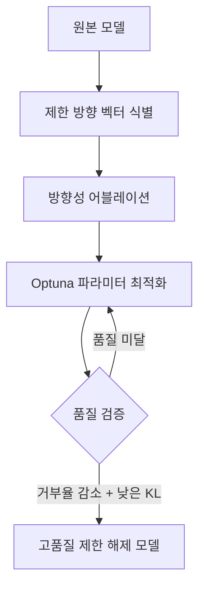
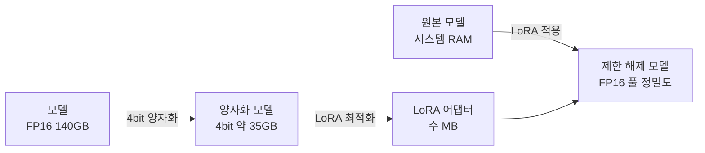
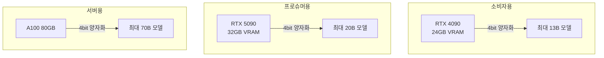

## 개요

로컬 LLM을 운용할 때 <strong>VRAM 부족</strong>은 가장 큰 병목입니다. 대규모 모델의 어블리테레이션(제한 해제) 처리에는 보통 풀 프리시전(Full Precision)으로 모델을 로드해야 하며, 수십 GB의 VRAM을 소모합니다.

2026년 2월, <strong>Heretic 1.2</strong>가 출시되었습니다. Reddit r/LocalLLaMA에서 268포인트를 받으며 커뮤니티로부터 높은 평가를 받았습니다. 이번 버전에서는 4bit 양자화를 통한 <strong>VRAM 사용량 최대 70% 절감</strong>과 <strong>Magnitude-Preserving Orthogonal Ablation(MPOA)</strong>이라는 새로운 어블리테레이션 기법이 도입되었습니다.

## Heretic란 무엇인가

[Heretic](https://github.com/p-e-w/heretic)은 트랜스포머 기반 언어 모델에서 검열(Censorship)(안전성 얼라인먼트)을 자동으로 제거하는 도구입니다. 첫 출시 이후 3개월 만에 커뮤니티에서 <strong>1,300개 이상의 모델</strong>이 Heretic을 사용해 공개되었습니다.

Heretic의 핵심 기술은 다음 두 가지입니다:

- <strong>방향성 어블레이션(Directional Ablation)</strong>: 모델의 특정 방향 벡터를 제거하여 제한을 해제
- <strong>TPE 기반 파라미터 최적화</strong>: [Optuna](https://optuna.org/)를 활용해 거부 횟수와 KL 다이버전스를 동시에 최소화



## VRAM 70% 절감: LoRA 기반 양자화 엔진

### 기존의 과제

기존 어블리테레이션 처리에서는 모델 전체를 풀 프리시전(Full Precision)(FP16/BF16)으로 VRAM에 로드해야 했습니다. 예를 들어 70B 파라미터 모델에는 <strong>약 140GB의 VRAM</strong>이 필요합니다.

### 새로운 접근법

Heretic 1.2에서는 기여자 accemlcc가 구현한 <strong>LoRA 기반 어블리테레이션 엔진</strong>이 도입되었습니다.

```yaml
# Heretic 설정 예시
quantization: bnb_4bit    # 4bit 양자화 활성화
orthogonalize_direction: true  # MPOA 활성화
row_normalization: full        # 행 정규화
```

이 접근법의 동작 방식은 다음과 같습니다:

1. <strong>4bit 양자화 로드</strong>: bitsandbytes를 사용하여 모델을 4bit로 로드, VRAM 사용량 최대 70% 절감
2. <strong>LoRA 어댑터 최적화</strong>: PEFT 기반으로 양자화된 상태에서 어블리테레이션 파라미터를 최적화
3. <strong>풀 프리시전(Full Precision) 내보내기</strong>: 원본 모델을 시스템 RAM에 다시 로드하고 최적화된 LoRA 어댑터를 적용



### 실제 VRAM 비교

| 모델 크기 | 기존 방식 | Heretic 1.2 (4bit) | 절감률 |
|:---:|:---:|:---:|:---:|
| 7B | ~14GB | ~4.2GB | 70% |
| 13B | ~26GB | ~7.8GB | 70% |
| 70B | ~140GB | ~42GB | 70% |

소비자용 GPU(RTX 4090, 24GB VRAM)로도 <strong>13B급 모델</strong>을 처리할 수 있게 되었습니다.

## MPOA: 고품질 어블리테레이션의 새로운 기법

### Magnitude-Preserving Orthogonal Ablation이란

MPOA는 Jim Lai가 개발한 어블리테레이션 기법으로, 기존 방식과 비교해 <strong>모델의 품질 저하를 최소한으로 억제</strong>할 수 있습니다.

기존 어블리테레이션에서는 제한 방향 벡터를 제거할 때 가중치의 크기(노름)가 변화하여 모델의 능력이 저하되는 문제가 있었습니다. MPOA는 다음 접근법으로 이를 해결합니다:

1. <strong>직교 사영</strong>: 제한 방향에 직교하는 부분공간으로 벡터를 사영
2. <strong>노름 보존</strong>: 사영 후 벡터의 노름을 원래 크기로 복원
3. <strong>Optuna 최적화</strong>: 가중치 파라미터를 Optuna로 최적화하고 레이어 선택을 자동화

### 벤치마크 비교

Heretic 공식 예시로, gpt-oss-20b 모델의 비교 결과입니다:

| 모델 | UGI 스코어 | W/10 | NatInt | Writing |
|:---|:---:|:---:|:---:|:---:|
| Heretic 버전 (MPOA) | <strong>39.05</strong> | 승리 | 승리 | 승리 |
| 기존 Derestricted 버전 | 34.22 | — | — | — |

Heretic 버전은 모든 카테고리에서 기존 버전을 앞서며, <strong>UGI 스코어에서 약 14% 개선</strong>을 달성했습니다.

### 설정 방법

```yaml
# MPOA 활성화 설정
orthogonalize_direction: true
row_normalization: full
```

단 2줄의 설정 추가로 MPOA의 혜택을 받을 수 있습니다.

## 기타 주목할 기능

### 비전 언어 모델(VLM) 지원

Heretic 1.2에서는 기여자 anrp에 의해 <strong>VLM 지원</strong>이 추가되었습니다. 텍스트 디코더 부분만 어블리테레이트하고, 이미지 인코더는 그대로 유지됩니다.

### 세션 자동 저장 및 재개

장시간 최적화 실행 중 크래시가 발생해도, Heretic은 자동으로 진행 상황을 저장합니다. 재시작하면 중단된 지점부터 재개할 수 있습니다. Ctrl+C로 수동 중단 후 나중에 재개하는 것도 가능합니다.

## 실전 가이드: Heretic 1.2 사용법

### 전제 조건

- Python 3.10 이상
- CUDA 지원 GPU (4bit 양자화에는 NVIDIA GPU 필요)
- 충분한 시스템 RAM (풀 프리시전(Full Precision) 내보내기용)

### 설치 및 실행

```bash
# Heretic 설치
pip install heretic

# 기본 실행 (4bit 양자화 + MPOA)
heretic --model meta-llama/Llama-3.1-8B-Instruct \
  --quantization bnb_4bit \
  --orthogonalize-direction true \
  --row-normalization full
```

### 추천 하드웨어 구성



## 커뮤니티 반응

Reddit r/LocalLLaMA 게시글은 <strong>268포인트</strong>를 받으며 커뮤니티로부터 높은 평가를 받았습니다. HuggingFace에서는 Heretic으로 만든 모델이 <strong>1,300개 이상</strong> 공개되어 있으며, 이는 전체 어블리테레이션 모델의 3분의 1 이상을 차지합니다.

특히 주목받는 포인트:

- <strong>비용 효율</strong>: 소비자용 GPU로 대규모 모델 처리 가능
- <strong>품질 향상</strong>: MPOA를 통한 기존 기법 이상의 품질
- <strong>사용 편의성</strong>: 완전 자동화된 워크플로우

## 마무리

Heretic 1.2는 로컬 LLM 운용에서 두 가지 큰 과제를 동시에 해결했습니다:

1. <strong>VRAM 사용량 대폭 절감</strong>: 4bit 양자화로 고가의 GPU가 필요했던 처리를 소비자용 하드웨어에서 실행 가능
2. <strong>어블리테레이션 품질 향상</strong>: MPOA로 모델의 능력을 유지하면서 제한을 해제

로컬 LLM의 민주화가 가속되는 가운데, Heretic 같은 도구는 <strong>누구나 고품질 모델을 활용할 수 있는 환경</strong>을 만드는 데 중요한 역할을 하고 있습니다.

## 참고 자료

- [Heretic GitHub 리포지토리](https://github.com/p-e-w/heretic)
- [Reddit r/LocalLLaMA: Heretic 1.2 릴리스 스레드](https://www.reddit.com/r/LocalLLaMA/comments/1r4n3as/heretic_12_released_70_lower_vram_usage_with/)
- [Arditi et al. 2024 — Refusal in Language Models Is Mediated by a Single Direction](https://arxiv.org/abs/2406.11717)
- [Jim Lai — Norm-Preserving Biprojected Abliteration](https://huggingface.co/blog/grimjim/norm-preserving-biprojected-abliteration)
- [Heretic HuggingFace Organization](https://huggingface.co/heretic-org)
