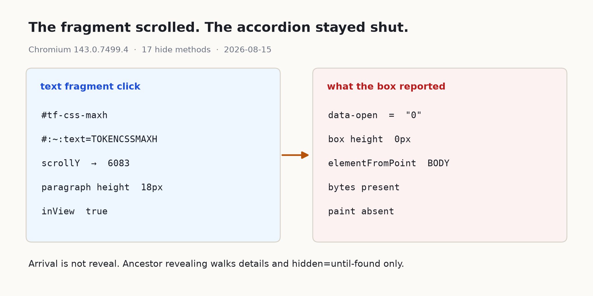
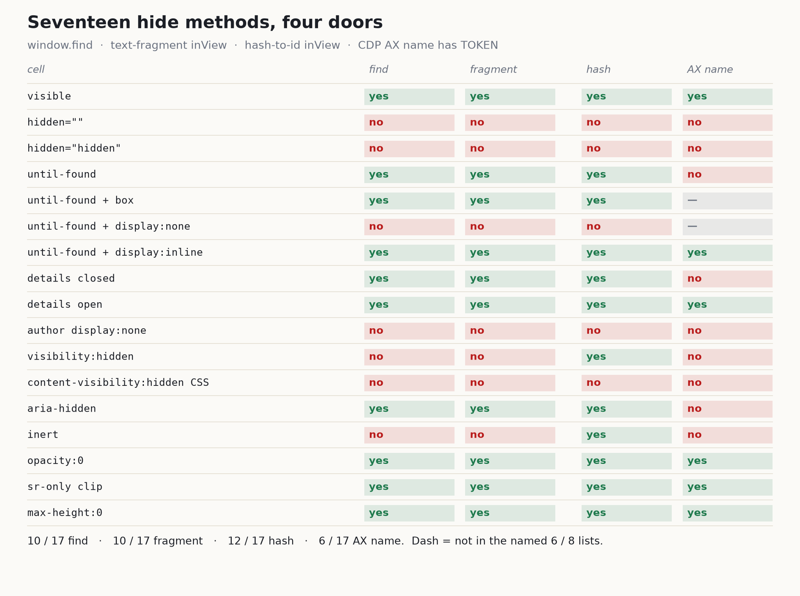

`#tf-css-maxh`를 눌렀다. 주소 끝은 `#:~:text=TOKENCSSMAXH`. 스크롤은 6083까지 내려갔다. 아코디언은 그대로 닫혀 있었다.

`data-open`은 0. 박스 `getBoundingClientRect` 높이는 0픽셀. 안에 있는 문단은 높이 18, y는 399.7이라고 보고했다. 그 문단 한가운데, `elementFromPoint(640, 409)`가 돌려준 건 문장이 아니었다. BODY.

바이트는 있었다. 페인트는 없었다. 도착한 건가.

같은 문장을 17칸에 넣었다. 칸마다 숨기는 방법만 다르다. 헤드리스 크로미움 143.0.7499.4, Playwright 1.57.0, Node 22.22, 뷰포트 1280×800. 로컬 정적 서버는 `/tmp`.



## 클립까지 내려간 링크

크롬 문서가 아코디언을 올려 둔 장면은 이렇다.

> Collapsing content sections, sometimes described as an accordion, are a common UI pattern. However, content hidden in the collapsed sections becomes impossible to search using a find-in-page search. Also, it isn't possible to link to text fragments inside collapsed regions.

출처: [Making collapsed content accessible with hidden=until-found](https://developer.chrome.com/docs/css-ui/hidden-until-found)

솔직히 CSS `max-height: 0` 칸이 그 문장의 "impossible"일 줄 알았다. `window.find`는 true였다. 접근성 이름 목록에도 TOKEN이 있었다. 프래그먼트 클릭의 `inView`도 true. 박스는 높이 0. 히트 테스트는 BODY.

도착과 열림은 달랐다.

조상을 열어 주는 쪽이 이 칸을 모른다. `data-open`을 뒤집는 코드도 프래그먼트 쪽에 없다. 스크롤만 클립 위치까지 내려간 것.

한 주 전 글에서 잰 것은 산문이냐 `<pre>`냐였다. 다음 문은 닫힌 칸. 문장이 그 안에 있을 때.

## 닫힌 details는 스스로 열린다

같은 토큰을 닫힌 `<details>` 안에 넣었다. `#tf-details-closed`를 눌렀다. `toggle`이 떴다. `open`이 true로 뒤집혔다. 스크롤은 4907. 문단 높이 18, `inView` true.

스펙이 조상을 열어 주는 대상은 둘이다. `hidden="until-found"`, 그리고 닫힌 `<details>`. CSS 아코디언은 그 목록에 없다.

> When find-in-page begins searching for matches, all details elements in the page which do not have their open attribute set should have the skipped contents of their second slot become accessible, without modifying the open attribute, in order to make find-in-page able to search through it. Similarly, all HTML elements with the hidden attribute in the Hidden Until Found state should have their skipped contents become accessible without modifying the hidden attribute in order to make find-in-page able to search through them.

출처: [HTML Standard, Interaction with details and hidden=until-found](https://html.spec.whatwg.org/multipage/interaction.html#interaction-with-details-and-hidden=until-found)

until-found 칸 `#box-until`도 그 둘 중 하나였다. 계산 스타일은 `display: block`, `content-visibility: hidden`. 컨테이너는 0×1230. 자식 문단은 높이 18. `innerText`에는 문장이 없었다. `window.find`는 true. `#tf-until`을 누르니 `beforematch`가 `#box-until`에서 한 번 떴고, `hidden` 속성은 사라졌다. 스크롤 4352, `inView` true.

> Will not be rendered, but content inside will be accessible to find-in-page and fragment navigation.

출처: [HTML Standard, The hidden attribute](https://html.spec.whatwg.org/multipage/interaction.html#the-hidden-attribute)

UA 스타일시트도 그 자리를 가른다.

```css
[hidden]:not([hidden=until-found i]):not(embed) {
  display: none;
}

[hidden=until-found i]:not(embed) {
  content-visibility: hidden;
}
```

출처: [HTML Standard, Hidden elements](https://html.spec.whatwg.org/multipage/rendering.html#hidden-elements)

`hidden=""`과 `hidden="hidden"`의 계산값은 `display: none`. until-found 칸의 `HTMLElement.hidden` getter는 boolean true가 아니었다. `"until-found"`.

## 숨김이 다섯 직업이었다

한 스위치일 줄 알았다. 그려지지 않는 칸이 있고(`display: none`, boolean `hidden`), 그리지는 않아도 찾기는 되는 칸이 있다. `hidden="until-found"`가 UA에서 `content-visibility: hidden`을 입는 쪽. 트리에는 남고 클립만 된 칸은 `max-height: 0`. 이름만 뺀 칸은 `aria-hidden`. 찾기가 무시하는 칸은 `inert`.

17칸 중 `window.find(token)`이 true인 것은 10. false인 것은 7. boolean `hidden`, `hidden="hidden"`, until-found에 `display: none`을 얹은 칸, 저자 `display: none`, `visibility: hidden`, 저자 `content-visibility: hidden`, `inert`.

프래그먼트 클릭 뒤 `inView` true는 10, false는 7. 찾기 false 집합과 거의 같다. until-found에 `display: inline`을 얹은 칸만 찾기 true 쪽으로 빠진다.

id 해시 `inView` true는 12, false는 5. false는 boolean `hidden` 두 칸, until-found+`display: none`, 저자 `display: none`, 저자 `content-visibility: hidden`.

CDP `Accessibility.getFullAXTree` 이름 목록에 TOKEN이 있던 칸은 6. 보이는 칸, until-found+inline, 열린 details, `opacity: 0`, sr-only 클립, CSS `max-height`. 나머지 until-found 본칸, 닫힌 details, `aria-hidden`, `inert`, `visibility: hidden`, 저자 `content-visibility: hidden`, `display: none`, boolean `hidden`은 이름이 없었다.



이 덤프는 스크린 리더가 아니다. 이름 없음은 그 트리 덤프에 TOKEN이 든 이름 값이 없었다는 뜻이다.

`aria-hidden="true"`를 보이는 문단에 붙인 칸은 그려져 있었다. `innerText` true, `window.find` true, 프래그먼트 스크롤 5542. 이름 목록에만 TOKENARIAHIDDEN이 없었다. 찾기는 보조기술 트리가 이름을 안 붙인 문장을 가리킬 수 있다.

> Authors MAY, with caution, use aria-hidden to hide visibly rendered content from assistive technologies only if the act of hiding this content is intended to improve the experience for users of assistive technologies by removing redundant or extraneous content.

출처: [WAI-ARIA 1.2, aria-hidden](https://www.w3.org/TR/wai-aria-1.2/#aria-hidden)

## until-found 위에 올린 display

여백 없이 until-found만 둔 칸은 높이 0, 너비 1230. 자식은 18픽셀을 보고했다. 크롬이 경고한 남은 박스다.

> Some layout APIs such as getBoundingClientRect will report that the hidden content inside the hidden=until-found element takes up space and has a position in the page.

출처: [Making collapsed content accessible with hidden=until-found](https://developer.chrome.com/docs/css-ui/hidden-until-found)

`#box-until-box`에는 마진 8, 회색 보더 4, 패딩 16을 올렸다. 아직 `hidden="until-found"`인 동안 rect는 1214×40. 빈 프레임. 프래그먼트를 누르면 `hidden`이 벗겨지고 40에서 90으로 커졌다. `beforematch`는 1.

> Child nodes of the hidden=until-found element won't be rendered, but the hidden=until-found element itself will still have a box. This means that CSS properties such as border and explicit size will still affect the rendering.

출처: [Making collapsed content accessible with hidden=until-found](https://developer.chrome.com/docs/css-ui/hidden-until-found)

40→90은 이 픽스처의 숫자다. 다른 페이지의 상수가 아니다.

스펙이 경고한 함정도 강제로 심었다. `#box-until-none`은 `hidden="until-found" style="display:none"`. `window.find`는 false. 프래그먼트를 눌러도 속성은 남고 `beforematch`는 0, 스크롤은 0. `#p-until-none` 해시는 `beforematch`를 띄우고 `hidden`을 벗겼다. 남은 것은 저자 `display: none`. 문단 높이 0, 스크롤 0. 브라우저는 속성을 따랐고, 그다음 스타일시트에 졌다.

> The element needs to be affected by layout containment in order to be revealed by find-in-page. This means that if the element in the Hidden Until Found state has a 'display' value of 'none', 'contents', or 'inline', then the element will not be revealed by find-in-page.

출처: [HTML Standard, The hidden attribute](https://html.spec.whatwg.org/multipage/interaction.html#the-hidden-attribute)

`#box-until-inline`은 반대쪽이다. `hidden="until-found" style="display:inline"`. 클릭 전부터 문장이 `innerText`에 있었고, 접근성 이름 목록에도 있었다. 프래그먼트는 `hidden="until-found"`를 남겨 둔 채 스크롤만 했다. 4729. 해시는 `hidden`을 벗겼다. 레이아웃 포함이 이미 깨져 있어서, 숨김은 거짓말에 가까웠다.

저자 CSS로만 `content-visibility: hidden`을 건 칸 `#box-cv-hidden`은 속성이 없다. `window.find` false. 프래그먼트 실패. 해시 실패. 스크롤 0. until-found가 UA에서 입는 그 속성 이름과 같다. 조상을 열어 주는 쪽이 보는 것은 속성과 `<details>`다. 속성 이름만으로는 죽은 주소. [content-visibility로 강제 레이아웃을 깎았던 측정](/ko/blog/ko/content-visibility-auto-render-cost-measure-2026/)과 같은 토큰이, 여기서는 훅이 못 됐다.

## 이미 그 문을 쓰고 있던 FAQ

라이브로 [텍스트 프래그먼트 글](/ko/blog/ko/text-fragment-citation-deep-link-audit-2026/)을 열었다. HTTP 200. `details.faq-item`은 4개. 인덱스 0은 이미 열려 있다. `FAQ.astro`가 `open={index === 0}`을 넣는다. 1〜3은 닫힘.

닫힌 답 문장 하나를 그대로 쳤다. 「코드 블록 자체를 인용 대상으로 만들기는 어렵습니다」.

점프 전 `document.body.innerText`에는 그 문장이 없었다. `textContent`에는 있었다. `window.find`는 true.

`#:~:text=`로 그 문장을 넣었다. 두 번째 details가 열렸다. `hitOpen` true. 스크롤 8752. 열린 details의 `getBoundingClientRect.top`은 373.

이 사이트는 스펙이 아는 숨김 문을 이미 쓰고 있었다.

닫힌 답이 문서에서 사라졌을 줄 알았다. `innerText` 기준으로는 맞다. `textContent`와 찾기 기준으로는 틀렸다. 닫힌 답은 이미 찾기 대상이었다. 프래그먼트는 그 details를 열기만 하면 됐다.

`innerText`와 `textContent`는 Googlebot이 아니다. 닫힌 `<details>`가 `textContent`에 있다고 해서 닫힌 답이 색인된다고 말할 수 없다. AI 크롤러도 재지 않았다.

크롬 문서는 검색이 드러난 프래그먼트로 링크를 만든다고 적는다.

> In addition to allowing find-in-page search on hidden regions, this feature will allow this hidden content to be accessible to search engines. Google Search will even form links that scroll to the revealed fragment.

출처: [Making collapsed content accessible with hidden=until-found](https://developer.chrome.com/docs/css-ui/hidden-until-found)

벤더 주장이다. 검색 결과나 AI 답이 그런 링크를 내보내는 장면은 여기서 보지 않았다.

라이브 FAQ에 `hidden="until-found"`를 붙이고 다시 배포하지도 않았다. 확인한 마크업은 있는 `<details>`뿐이다. FAQ 네 칸, 첫 칸은 이미 열림. 사이트 전체 FAQ 감사가 아니다.

[FAQPage 리치 결과가 끝난 뒤에도 Q&A 마크업을 남긴 이유](/ko/blog/ko/faqpage-deprecation-ai-citation-2026/)와 같은 컴포넌트다. 오늘 본 것은 그 컴포넌트가 고른 문이다.

## 찾기와 해시가 갈라지는 칸

보이는 문단에 `inert`만 올렸다. `innerText` true. 페인트 있음. 박스 18×1230. `window.find`는 false. 프래그먼트 스크롤 0. `#p-inert` 해시는 6085까지 내려갔다.

> The user agent should ignore the node for the purposes of find-in-page.

출처: [HTML Standard, Inert subtrees](https://html.spec.whatwg.org/multipage/interaction.html#inert-subtrees)

찾기와 id 해시는 같은 문이 아니다. `visibility: hidden`도 해시는 받고 프래그먼트는 거절했다. 저자 `content-visibility: hidden`은 둘 다 거절. until-found에 `display: none`을 얹으면 해시는 속성을 벗기고도 아무것도 안 보여 준다.

[inert가 모달 포커스를 막지 못했던 측정](/ko/blog/ko/modal-focus-escape-inert-measure-2026/)과 겹치는 속성이다. 여기서 닫힌 것은 포커스가 아니라 찾기였다.

boolean `hidden`, `hidden="hidden"`, 저자 `display: none`은 한 가족이다. 찾기 false, 프래그먼트 실패, 해시 실패. HTML `hidden`의 기본 상태가 이 가족이다. 아코디언 가족이 아니다.

WHATWG는 탭 패널을 `hidden`으로 접지 말라고 적는다.

> The hidden attribute must not be used to hide content that could legitimately be shown in another presentation. For example, it is incorrect to use hidden to hide panels in a tabbed dialog, because the tabbed interface is merely a kind of overflow presentation — one could equally well just show all the form controls in one big page with a scrollbar.

출처: [HTML Standard, The hidden attribute](https://html.spec.whatwg.org/multipage/interaction.html#the-hidden-attribute)

`opacity: 0`과 sr-only 클립은 이름 목록 6칸 안에 들어 있었다. 그 두 칸을 아코디언 대용으로 쓸 생각은 없다.

`window.find`는 페이지 내 찾기 UI가 아니다.

> Issue #3539 tracks standardizing how find-in-page underlies the currently-unspecified window.find() API.

출처: [HTML Standard, Find-in-page](https://html.spec.whatwg.org/multipage/interaction.html#find-in-page)

실제 Ctrl/Cmd+F 세션은 다를 수 있다. 여기서 한 일은 `window.find()`와 `#:~:text=` 링크 클릭이다. 픽스처의 프래그먼트 클릭에는 같은 문서 활성화가 필요했다. 직접 `#:~:text=` 이동도 이 크로미움에서는 until-found와 라이브 닫힌 FAQ를 열었다. 이 UA, 이 빌드. 크롤러가 아니다. Firefox와 WebKit는 돌리지 않았다.

크로미움 143에서 `'onbeforematch' in HTMLElement.prototype`은 true였다.

## 라이브 FAQ는 아직 안 바꾼다

아코디언을 다시 고른다면 나는 `<details>`를 유지한다. 닫힌 답을 boolean `hidden`이나 저자 `display: none`에 넣지 않는다. CSS `max-height: 0`은 이 엔진에서 찾기는 되고, 조상을 열어 주는 목록에는 없다. 스크롤만 가는 주소를 만들고 싶지 않다.

스팸 정책은 아코디언·탭 토글을 숨은 텍스트 남용 목록에서 빼 둔다.

> Accordion or tabbed content that toggle between hiding and showing additional content

출처: [Spam Policies for Google Web Search, Hidden text and links](https://developers.google.com/search/docs/essentials/spam-policies#hidden-text-and-links)

정책 문장이다. 순위 약속이 아니다. 구조화 데이터와 프래그먼트가 리치 결과나 AI 인용을 보장하지도 않는다. Rich Results Test는 돌리지 않았다.

until-found를 쓸 자리는 있다. `<details>`가 어색한 접힘, 찾기·프래그먼트를 살려야 하는 칸. 그 칸에 `display: none`이나 `display: inline`을 얹지 않는다. 보더와 패딩은 안쪽 자식에 둔다. 빈 프레임 40픽셀을 남기고 싶지 않다.

until-found만 믿고 심기 전에 이 줄을 찍는다.

```javascript
if (!('onbeforematch' in HTMLElement.prototype)) {
  // 이 UA에서는 닫힌 칸이 닫힌 채로 남는다
}
```

라이브 닫힌 답을 다시 보려면 이 네 줄이면 된다.

```javascript
[...document.querySelectorAll('details.faq-item')].map((d, i) => ({
  i,
  open: d.open,
  t: d.innerText.slice(0, 60)
}))
document.body.innerText.includes('코드 블록 자체를 인용 대상으로 만들기는 어렵습니다')
document.body.textContent.includes('코드 블록 자체를 인용 대상으로 만들기는 어렵습니다')
window.find('코드 블록 자체를 인용 대상으로 만들기는 어렵습니다')
```

이 17칸이 팀이 무엇을 배포해야 하는지를 증명하지는 않는다. 2026-08-15, 이 크로미움이 어떤 칸을 찾고, 이름을 붙이고, 해시로 스크롤하고, 프래그먼트로 열었는지를 증명할 뿐이다. 픽스처 JSON은 `/tmp` 아래 랩 디렉터리에 있었고 저장소로 복사하지 않았다.

Firefox와 WebKit에서 같은 17칸이 어떻게 갈라지는지는 오늘 모른다. 그 칸을 채우기 전에는 라이브 FAQ를 until-found로 갈아엎지 않는다.

---

*출처: WHATWG [HTML Standard, The hidden attribute](https://html.spec.whatwg.org/multipage/interaction.html#the-hidden-attribute)·[Interaction with details and hidden=until-found](https://html.spec.whatwg.org/multipage/interaction.html#interaction-with-details-and-hidden=until-found)·[Inert subtrees](https://html.spec.whatwg.org/multipage/interaction.html#inert-subtrees)·[Find-in-page](https://html.spec.whatwg.org/multipage/interaction.html#find-in-page)·[Hidden elements](https://html.spec.whatwg.org/multipage/rendering.html#hidden-elements), Chrome for Developers [Making collapsed content accessible with hidden=until-found](https://developer.chrome.com/docs/css-ui/hidden-until-found), Google Search Central [Spam Policies, Hidden text and links](https://developers.google.com/search/docs/essentials/spam-policies#hidden-text-and-links), W3C [WAI-ARIA 1.2, aria-hidden](https://www.w3.org/TR/wai-aria-1.2/#aria-hidden)(모두 공식). 본문 영문 블록인용은 각 원문 페이지를 가져와 공백을 접은 뒤 대조한 문자열이고, 인용 곁에 원문 링크를 두었다. 측정 환경: 임시 픽스처 1장(숨김 17칸), 헤드리스 크로미움 143.0.7499.4, Playwright 1.57.0, Node 22.22, 뷰포트 1280×800, 로컬 정적 서버 `/tmp`, 2026-08-15. 라이브 확인: `https://jangwook.net/ko/blog/ko/text-fragment-citation-deep-link-audit-2026/`, HTTP 200, `details.faq-item` 4칸. `window.find`는 페이지 내 찾기 UI가 아니다. Firefox·WebKit·Search Console 로그인·검색 결과/AI 답의 프래그먼트 링크·Rich Results Test·AI 크롤러는 측정하지 않았다. 라이브 FAQ에 `hidden="until-found"`를 붙이지 않았다. 아코디언이 숨은 텍스트 남용이 아니라는 문장은 정책이지 순위 약속이 아니다. 크롬의 "검색이 드러난 프래그먼트로 링크를 만든다"는 벤더 주장이며 여기서 관측하지 않았다.*
