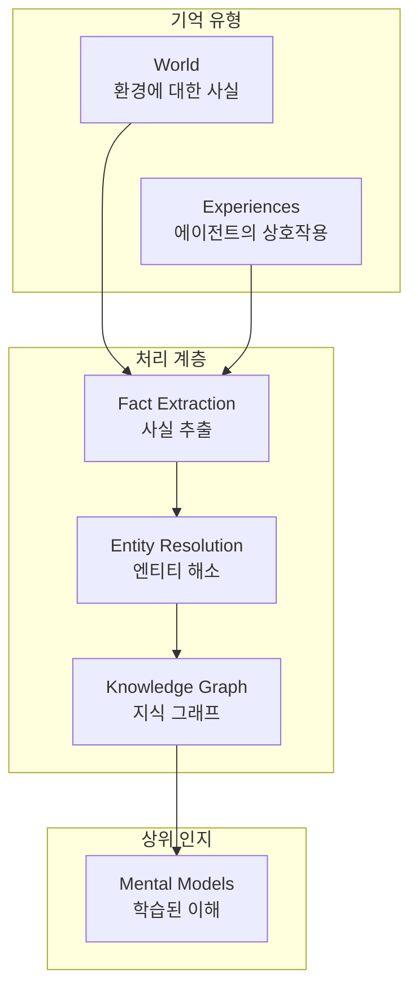
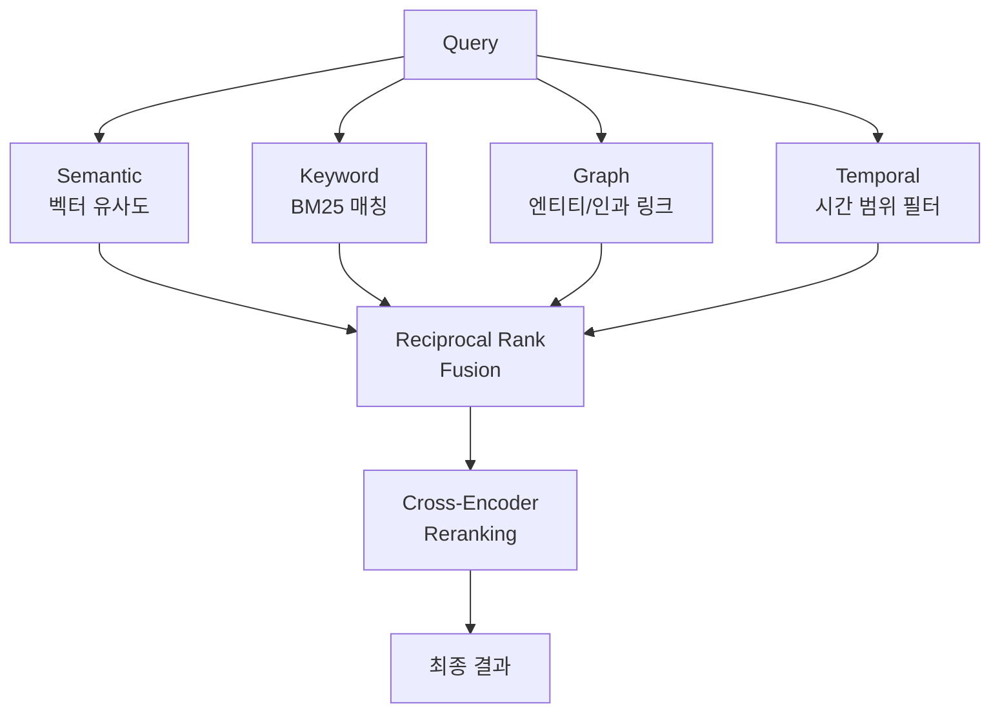
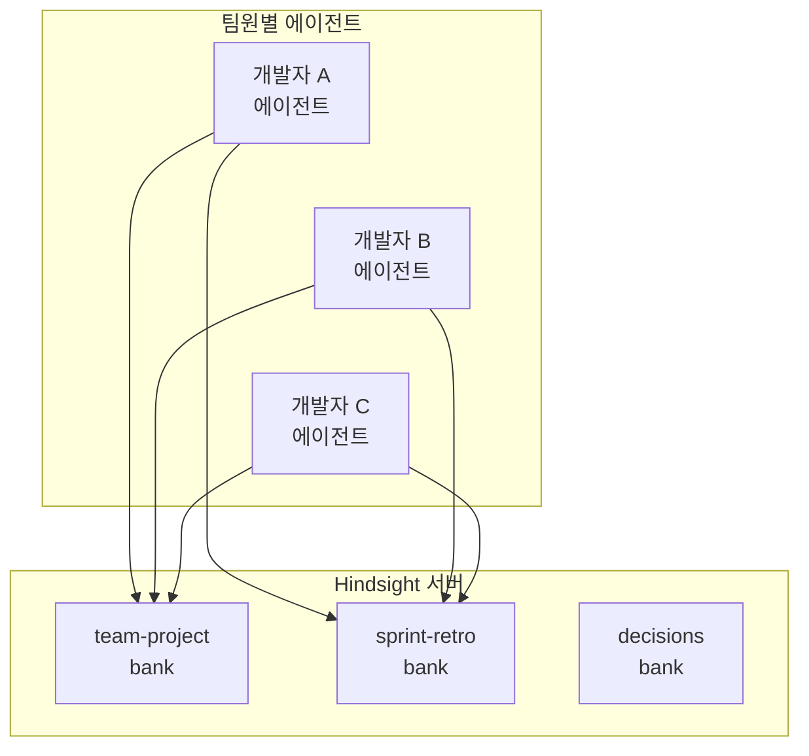

## AI 에이전트의 기억 문제

AI 에이전트를 프로덕션에 배포해본 Engineering Manager라면 한 번쯤 이런 경험이 있을 것입니다. "어제 논의한 내용을 기억하세요?"라는 요청에 에이전트가 멍하니 바라보는 상황. 대화가 끝나면 모든 컨텍스트가 사라지고, 다음 세션에서는 처음부터 다시 시작해야 합니다.

RAG(Retrieval-Augmented Generation)나 단순한 벡터 DB로 이 문제를 해결하려는 시도는 많았지만, 대부분 "검색"에 그칠 뿐 "학습"까지 나아가지 못했습니다. 단순히 과거 대화를 검색하는 것과, 경험에서 패턴을 추출하고 mental model을 형성하는 것은 본질적으로 다릅니다.

<strong>Hindsight</strong>는 이 문제에 정면으로 도전하는 오픈소스 프로젝트입니다. [MCP(Model Context Protocol)](/ko/blog/ko/mcp-server-build-practical-guide-2026) 호환으로 Claude, Cursor, VS Code 등 주요 AI 도구와 즉시 연동되며, LongMemEval 벤치마크에서 91.4%를 달성해 에이전트 메모리 시스템 최초로 90%를 돌파했습니다.

## Hindsight의 아키텍처

Hindsight는 인간 인지 구조에서 영감을 받은 생체모방(biomimetic) 데이터 구조로 기억을 조직합니다.



기억은 크게 세 가지 계층으로 나뉩니다:

- <strong>World</strong>: 환경에 대한 사실 ("스토브는 뜨겁다")
- <strong>Experiences</strong>: 에이전트 자신의 상호작용 기록 ("스토브를 만졌더니 뜨거웠다")
- <strong>Mental Models</strong>: 원시 기억을 성찰(reflect)하여 형성된 학습된 이해

기존 RAG 시스템과의 핵심 차이점은 바로 이 Mental Models입니다. 단순히 데이터를 저장하고 검색하는 것이 아니라, 기억을 분석하고 패턴을 형성하여 에이전트가 "경험에서 배우는" 구조를 만듭니다.

## 세 가지 핵심 오퍼레이션

Hindsight의 모든 기능은 세 가지 핵심 오퍼레이션으로 구성됩니다.

### Retain — 기억 저장

단순한 텍스트 저장이 아닙니다. Retain은 LLM을 활용해 입력된 콘텐츠에서 사실, 시간 정보, 엔티티, 관계를 자동으로 추출하고 정규화합니다.

```python
from hindsight_client import Hindsight

client = Hindsight(base_url="http://localhost:8888")

# 단순 텍스트가 아닌, 구조화된 기억으로 저장
client.retain(
    bank_id="project-alpha",
    content="김 팀장이 Sprint 23에서 인증 모듈 리팩토링을 완료했다. "
            "기존 세션 기반에서 JWT로 전환했으며, 응답 시간이 40% 개선되었다.",
    context="sprint-retrospective",
    timestamp="2026-03-15T10:00:00Z"
)
```

이 한 번의 호출로 Hindsight는 내부적으로 다음을 수행합니다:

1. 엔티티 추출: "김 팀장", "Sprint 23", "인증 모듈"
2. 관계 매핑: "김 팀장 → 완료 → 인증 모듈 리팩토링"
3. 사실 정규화: "세션 → JWT 전환", "응답 시간 40% 개선"
4. 시간 인덱싱: 2026-03-15에 발생한 이벤트로 기록
5. 벡터 임베딩 생성 및 지식 그래프 업데이트

### Recall — 기억 검색

Recall은 네 가지 병렬 검색 전략을 동시에 실행합니다:



```python
# 자연어 질의로 관련 기억을 검색
result = client.recall(
    bank_id="project-alpha",
    query="인증 관련 최근 변경 사항은?",
    max_tokens=4096  # 토큰 한도 내에서 가장 관련성 높은 기억 반환
)
```

네 가지 전략의 결과를 <strong>Reciprocal Rank Fusion</strong>으로 병합하고, <strong>Cross-Encoder Reranking</strong>으로 최종 순위를 결정합니다. 단순 벡터 검색만 사용하는 시스템 대비 정확도가 크게 향상되는 구간입니다.

### Reflect — 성찰과 학습

Reflect는 Hindsight를 단순 메모리 시스템에서 "[학습하는 시스템](/ko/blog/ko/hermes-agent-self-evolving-ai-framework)"으로 격상시키는 핵심 기능입니다.

```python
# 기존 기억을 분석하여 새로운 인사이트 도출
insight = client.reflect(
    bank_id="project-alpha",
    query="우리 팀의 스프린트 회고에서 반복되는 패턴이 있나?",
)
```

Reflect는 저장된 기억들을 종합 분석하여:
- 반복되는 패턴을 발견합니다
- 여러 기억 사이의 인과 관계를 추론합니다
- Mental Model을 자동으로 업데이트합니다

예를 들어, 여러 스프린트 회고 기억이 쌓이면 "인증 관련 작업은 예상보다 평균 1.5배 더 걸린다"와 같은 mental model이 자동으로 형성됩니다.

## MCP 연동: 5분 안에 시작하기

Hindsight의 가장 큰 장점 중 하나는 MCP 호환성입니다. Docker 하나로 전체 스택을 로컬에서 실행할 수 있습니다.

### 설치 및 실행

```bash
# Docker로 전체 스택 실행
export OPENAI_API_KEY=sk-xxx  # 내부 LLM 처리용
docker run --rm -it --pull always \
  -p 8888:8888 -p 9999:9999 \
  -e HINDSIGHT_API_LLM_API_KEY=$OPENAI_API_KEY \
  -v $HOME/.hindsight-docker:/home/hindsight/.pg0 \
  ghcr.io/vectorize-io/hindsight:latest
```

- <strong>포트 8888</strong>: API + MCP 엔드포인트
- <strong>포트 9999</strong>: Admin UI (기억 탐색, 디버깅)

### MCP 클라이언트 설정

Claude Desktop, Cursor, VS Code 등에서 다음과 같이 설정합니다:

```json
{
  "mcpServers": {
    "hindsight": {
      "type": "http",
      "url": "http://localhost:8888/mcp/my-project/"
    }
  }
}
```

`my-project` 부분이 bank_id가 되어 프로젝트별로 독립된 메모리 공간을 갖게 됩니다. 팀 프로젝트마다 별도의 bank를 생성하면 기억이 섞이지 않습니다.

### 지원 LLM 프로바이더

Hindsight 내부의 사실 추출과 mental model 생성에 사용되는 LLM은 다양한 프로바이더를 지원합니다:

| 프로바이더 | 설정값 | 비고 |
|-----------|--------|------|
| OpenAI | `openai` | 기본값, gpt-4o-mini 권장 |
| Anthropic | `anthropic` | Claude 모델 사용 |
| Google | `gemini` | Gemini 모델 |
| Groq | `groq` | 빠른 추론 |
| Ollama | `ollama` | [로컬 모델](/ko/blog/ko/local-llm-private-mcp-server-gemma4-fastmcp) |
| LM Studio | `lmstudio` | 로컬 모델 |

에이전트가 사용하는 LLM과 Hindsight 내부 LLM은 독립적으로 설정할 수 있다는 점이 중요합니다. 예를 들어, 에이전트는 Claude Opus를 사용하면서 Hindsight 내부 처리는 비용 효율적인 gpt-4o-mini를 사용하는 구성이 가능합니다.

## Engineering Manager 관점의 도입 전략

### 1단계: 개인 에이전트부터 시작

팀 전체에 즉시 배포하기보다는, EM 자신의 AI 에이전트에 먼저 적용하는 것을 권장합니다.

```bash
# 개인 코딩 에이전트에 Hindsight 연결
# bank_id를 개인용으로 설정
"url": "http://localhost:8888/mcp/jangwook-dev/"
```

2〜3주간 사용하며 다음을 관찰합니다:
- 반복 질문이 줄어드는지
- 프로젝트 컨텍스트 전환 시 적응 속도
- mental model의 품질과 유용성

### 2단계: 팀 공유 메모리 구축

개인 검증이 끝나면 팀 레벨로 확장합니다.



bank를 목적별로 분리하면:
- <strong>team-project</strong>: 코드베이스, 아키텍처 결정, 기술 스택 정보
- <strong>sprint-retro</strong>: 스프린트 회고, 속도 지표, 반복 이슈
- <strong>decisions</strong>: ADR(Architecture Decision Records), 기술 선택 근거

### 3단계: 운영 모니터링

프로덕션 배포 시 Admin UI(포트 9999)를 활용해 다음을 모니터링합니다:

- 저장된 기억의 수와 증가 추이
- recall 요청의 히트율
- mental model의 업데이트 빈도
- 응답 지연 시간 (retain 후 recall까지의 처리 시간)

## 실전 활용 시나리오

### 시나리오 1: 온보딩 가속화

신규 팀원의 에이전트를 팀 프로젝트 bank에 연결하면, 기존 팀의 아키텍처 결정, 코딩 컨벤션, 과거 이슈 히스토리를 즉시 활용할 수 있습니다. 기존에 2〜3주 걸리던 코드베이스 파악 시간이 크게 단축됩니다.

### 시나리오 2: 스프린트 회고 자동 분석

매 스프린트 회고 내용을 retain하면, reflect를 통해 "최근 3개 스프린트에서 반복되는 병목은 무엇인가?"와 같은 분석이 가능합니다. 데이터 기반 팀 운영의 기초가 됩니다.

### 시나리오 3: 기술 의사결정 추적

"왜 Redis 대신 Memcached를 선택했는가?"와 같은 질문에 과거 의사결정 기억을 기반으로 맥락 있는 답변을 제공합니다. ADR이 실시간으로 활용되는 셈입니다.

## 기존 접근 방식과의 비교

| 특성 | 단순 벡터 DB | RAG | Knowledge Graph | Hindsight |
|------|-------------|-----|-----------------|-----------|
| 저장 | 임베딩만 저장 | 문서 청킹 + 임베딩 | 엔티티 + 관계 | 사실 + 엔티티 + 시계열 + 벡터 |
| 검색 | 벡터 유사도만 | 벡터 + 키워드 | 그래프 순회 | 4중 병렬 검색 + 리랭킹 |
| 학습 | 없음 | 없음 | 제한적 | Mental Model 자동 형성 |
| 시간 인식 | 없음 | 제한적 | 제한적 | 네이티브 시간 인덱싱 |
| 벤치마크 | - | - | - | LongMemEval 91.4% |

## 주의할 점

프로덕션 도입 시 몇 가지 고려할 사항이 있습니다:

1. <strong>처리 지연</strong>: retain 후 즉시 recall하면 아직 처리가 완료되지 않았을 수 있습니다. 사실 추출과 mental model 업데이트는 비동기로 처리되므로 수 초의 지연이 발생합니다.

2. <strong>LLM 비용</strong>: 내부 처리에 별도의 LLM 호출이 필요합니다. gpt-4o-mini 등 비용 효율적인 모델을 사용하되, 대량의 retain 작업 시 비용을 예측하고 모니터링해야 합니다.

3. <strong>데이터 보안</strong>: 기억에 민감한 정보가 포함될 수 있습니다. 로컬 배포 또는 프라이빗 클라우드 환경에서 운영하고, bank 접근 권한을 적절히 관리해야 합니다.

4. <strong>Mental Model 품질</strong>: 자동 생성된 mental model이 항상 정확하지는 않습니다. 정기적으로 Admin UI에서 형성된 모델을 검토하고, 부정확한 것은 수정하거나 삭제해야 합니다.

## 결론

Hindsight는 AI 에이전트 메모리 분야에서 의미 있는 진전을 보여주는 프로젝트입니다. 단순한 검색을 넘어 "학습하는 기억"이라는 컨셉을 MCP 표준 위에서 실현했다는 점이 핵심입니다.

MIT 라이선스의 오픈소스이며, Docker 하나로 5분 안에 시작할 수 있으므로, AI 에이전트를 운영하는 팀이라면 지금 바로 PoC를 진행해볼 만합니다. 특히 반복적인 컨텍스트 입력에 시간을 소모하고 있다면, Hindsight가 그 문제를 상당 부분 해소해줄 것입니다.

에이전트가 "기억하고 학습하는" 시대가 시작되었습니다.

## 참고 자료

- [Hindsight GitHub](https://github.com/vectorize-io/hindsight)
- [Hindsight 공식 문서](https://hindsight.vectorize.io/)
- [Hindsight 연구 논문 (arXiv)](https://arxiv.org/abs/2512.12818)
- [MCP Agent Memory 블로그 포스트](https://hindsight.vectorize.io/blog/2026/03/04/mcp-agent-memory)
