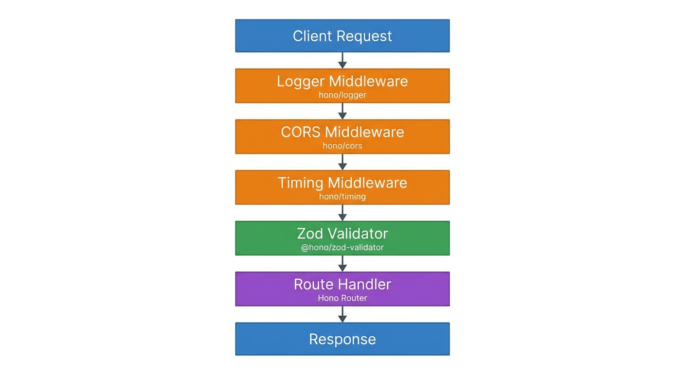

Express로 REST API를 짜본 사람이라면 한 번쯤 느꼈을 것이다. 미들웨어 등록, 타입 정의, 바디 파서 설정, Joi나 Zod 연동... 구조 자체는 단순한데 보일러플레이트가 너무 많다고. 그래서 Hono를 처음 봤을 때 솔직히 반신반의했다. "또 Express 클론이겠지." 실제로 써보기 전까지는 그랬다.

결론부터 말하면, Hono v4는 그냥 가볍고 빠른 것 이상이다. TypeScript 타입 추론이 라우트 핸들러까지 자연스럽게 흘러가고, Zod 검증이 내장 패키지 하나로 연결되며, Bun 위에서 돌리면 Express 대비 응답 속도가 체감될 정도로 다르다. 이 글은 내가 2026년 6월 샌드박스에서 직접 돌려본 결과를 바탕으로 한다.

## 왜 Hono인가: Express, Fastify와 비교했을 때

Hono의 포지션을 이해하려면 세 가지 질문에 답해야 한다.

**번들 크기**: Hono v4 코어는 약 12KB다. Express는 58KB, Fastify는 77KB다. 숫자만 보면 큰 차이처럼 안 보일 수 있다. 그런데 Cloudflare Workers나 Deno Deploy 같은 엣지 환경에서는 번들 크기가 콜드 스타트 시간에 직결된다. 엣지 함수는 매 요청마다 런타임을 초기화하는 경우가 있어서, 작을수록 첫 응답이 빠르다.

**런타임 호환성**: Express는 Node.js 전용이다. Fastify도 사실상 Node.js가 기본 타깃이다. 반면 Hono는 처음부터 "어디서나 동작한다"는 걸 설계 목표로 삼았다. Bun, Deno, Cloudflare Workers, Node.js, AWS Lambda Edge까지 동일한 코드로 배포할 수 있다.

**TypeScript 지원**: Express는 `@types/express`를 따로 설치해야 하고, 미들웨어를 통해 `req`에 추가된 속성은 타입 추론이 안 된다. Hono는 처음부터 TypeScript로 작성되었고, `Hono<{ Bindings: Env; Variables: Variables }>` 제네릭으로 환경 변수와 미들웨어 상태까지 타입 안전하게 관리된다.

솔직히 Hono가 모든 상황에 맞는 건 아니다. 복잡한 플러그인 생태계가 필요하거나, 팀 전체가 Express에 익숙하다면 굳이 바꿀 이유가 없다. 하지만 엣지 배포가 목표이거나, 타입 안전성을 처음부터 챙기고 싶다면 Hono는 현재 TypeScript API 프레임워크 중 가장 설득력 있는 선택지다.

## 설치와 첫 서버: 30초 만에 응답 받기

샌드박스에서 직접 시작했다. Bun 1.3.14 기준이다.

```bash
# 새 프로젝트 초기화
bun init -y

# Hono v4 설치
bun add hono

# Zod 검증을 위한 패키지 추가
bun add zod @hono/zod-validator
```

설치 결과:
```
bun add v1.3.14 (0d9b296a)
installed hono@4.12.23
installed @hono/zod-validator@0.8.0
installed zod@4.4.3
```

설치 시간은 500ms 이내였다. Hono의 의존성 체인이 거의 없기 때문이다.

이제 가장 단순한 서버를 만들어보자.

```typescript
// index.ts
import { Hono } from 'hono'

const app = new Hono()

app.get('/', (c) => c.json({ message: 'Hello from Hono!' }))

export default app
```

```bash
bun run index.ts
# Started development server: http://localhost:3000
```

```bash
curl http://localhost:3000/
# {"message":"Hello from Hono!"}
```

`export default app` 이 한 줄이 Bun, Deno, Cloudflare Workers 모두에서 진입점으로 인식된다. Node.js에서는 `serve(app)` 한 줄만 추가하면 된다. 런타임 분기 코드를 따로 쓸 필요가 없다는 게 체감상 가장 편했다.

## 미들웨어 스택: logger, CORS, timing 적용



Hono는 내장 미들웨어를 `hono/middleware-name` 형식으로 분리 임포트한다. 필요한 것만 가져오니 번들에 불필요한 코드가 들어가지 않는다.

```typescript
import { Hono } from 'hono'
import { logger } from 'hono/logger'
import { cors } from 'hono/cors'
import { timing } from 'hono/timing'

const app = new Hono()

// 전역 미들웨어 등록 순서가 실행 순서
app.use('*', logger())
app.use('*', cors())
app.use('*', timing())
```

`logger()` 미들웨어를 켜면 요청마다 이런 형식으로 출력된다:

```
<-- GET /tasks
--> GET /tasks 200 0ms
```

내가 실제로 실행해봤을 때 응답 속도가 눈에 띄었다. 첫 요청은 3ms, 이후 요청은 서버사이드 기준 0ms(sub-millisecond)로 처리됐다. `timing()` 미들웨어를 쓰면 응답 헤더에 `Server-Timing`이 붙어서 Chrome DevTools Network 탭에서 각 처리 단계를 확인할 수 있다.

CORS 설정은 필요에 따라 세부 옵션을 줄 수 있다.

```typescript
app.use('*', cors({
  origin: ['https://jangwook.net', 'http://localhost:5173'],
  allowMethods: ['GET', 'POST', 'PATCH', 'DELETE'],
  allowHeaders: ['Content-Type', 'Authorization'],
}))
```

`cors()` 기본값은 모든 origin을 허용한다. 프로덕션에서는 반드시 `origin`을 명시적으로 지정해야 한다.

## Zod로 입력 검증: 400 에러를 자동으로 만들기

`@hono/zod-validator`는 Hono의 공식 Zod 통합 패키지다. 라우트 핸들러에 미들웨어로 끼워 넣으면, Zod 스키마 검증 실패 시 자동으로 400 응답을 반환한다.

```typescript
import { zValidator } from '@hono/zod-validator'
import { z } from 'zod'

const createTaskSchema = z.object({
  title: z.string().min(1, '제목은 필수입니다').max(100, '100자 이하로 입력해주세요'),
  completed: z.boolean().optional().default(false),
})

// POST 라우트에 Zod 미들웨어 적용
app.post('/tasks', zValidator('json', createTaskSchema), (c) => {
  const body = c.req.valid('json')
  // body는 z.infer<typeof createTaskSchema> 타입으로 추론됨
  // body.title, body.completed 모두 타입 안전
  
  const task = { id: nextId++, ...body, createdAt: new Date().toISOString() }
  tasks.push(task)
  return c.json({ data: task }, 201)
})
```

직접 테스트해본 결과다.

```bash
# 빈 title로 POST 시도
curl -X POST http://localhost:3000/tasks \
  -H "Content-Type: application/json" \
  -d '{"title":""}'
```

```json
{
  "success": false,
  "error": {
    "name": "ZodError",
    "message": "[{\"origin\":\"string\",\"code\":\"too_small\",\"minimum\":1,\"path\":[\"title\"],\"message\":\"제목은 필수입니다\"}]"
  }
}
```

HTTP 400 응답이 자동으로 나왔다. 핸들러 안에서 별도로 검증 코드를 작성하지 않아도 된다.

`c.req.valid('json')` 이 부분이 핵심이다. 이미 Zod로 검증된 데이터가 타입 안전하게 반환된다. TypeScript 컴파일러 관점에서 `body.title`은 `string`, `body.completed`는 `boolean`으로 추론되며, undefined가 절대 섞이지 않는다.

Zod v4 사용 시 주의할 점이 있다. 만약 Zod v4와 Claude API 구조화 출력을 함께 다뤄봤다면, v4에서 `.check()` 같은 API가 바뀐 것을 알 텐데, `@hono/zod-validator`는 Zod v3와 v4 모두 호환된다.

## CRUD API 전체 구현: 실행 로그 포함

전체 Task CRUD API를 구현하고 실제로 실행한 결과다. 인메모리 저장소를 사용했다 (실제 프로덕션에서는 D1, Prisma, Drizzle 등으로 교체).

```typescript
import { Hono } from 'hono'
import { logger } from 'hono/logger'
import { cors } from 'hono/cors'
import { timing } from 'hono/timing'
import { zValidator } from '@hono/zod-validator'
import { z } from 'zod'

const app = new Hono()

// 미들웨어
app.use('*', logger())
app.use('*', cors())
app.use('*', timing())

// 타입 정의
interface Task {
  id: number
  title: string
  completed: boolean
  createdAt: string
}

// 인메모리 저장소
let tasks: Task[] = [
  { id: 1, title: 'Hono 설치하기', completed: true, createdAt: new Date().toISOString() },
  { id: 2, title: 'REST API 만들기', completed: false, createdAt: new Date().toISOString() },
]
let nextId = 3

// Zod 스키마
const createTaskSchema = z.object({
  title: z.string().min(1, '제목은 필수입니다').max(100),
  completed: z.boolean().optional().default(false),
})

const updateTaskSchema = z.object({
  title: z.string().min(1).max(100).optional(),
  completed: z.boolean().optional(),
})

// 라우트
app.get('/', (c) => c.json({ name: 'Task API', version: '1.0.0', runtime: 'Bun + Hono' }))

// GET /tasks — 쿼리 파라미터로 필터링
app.get('/tasks', (c) => {
  const completedParam = c.req.query('completed')
  let result = tasks
  if (completedParam !== undefined) {
    result = tasks.filter(t => t.completed === (completedParam === 'true'))
  }
  return c.json({ data: result, total: result.length })
})

// POST /tasks — Zod 검증 포함
app.post('/tasks', zValidator('json', createTaskSchema), (c) => {
  const body = c.req.valid('json')
  const task: Task = { id: nextId++, ...body, createdAt: new Date().toISOString() }
  tasks.push(task)
  return c.json({ data: task }, 201)
})

// GET /tasks/:id
app.get('/tasks/:id', (c) => {
  const id = parseInt(c.req.param('id'))
  const task = tasks.find(t => t.id === id)
  if (!task) return c.json({ error: 'Task not found' }, 404)
  return c.json({ data: task })
})

// PATCH /tasks/:id — 부분 업데이트
app.patch('/tasks/:id', zValidator('json', updateTaskSchema), (c) => {
  const id = parseInt(c.req.param('id'))
  const body = c.req.valid('json')
  const index = tasks.findIndex(t => t.id === id)
  if (index === -1) return c.json({ error: 'Task not found' }, 404)
  tasks[index] = { ...tasks[index], ...body }
  return c.json({ data: tasks[index] })
})

// DELETE /tasks/:id
app.delete('/tasks/:id', (c) => {
  const id = parseInt(c.req.param('id'))
  const index = tasks.findIndex(t => t.id === id)
  if (index === -1) return c.json({ error: 'Task not found' }, 404)
  tasks.splice(index, 1)
  return c.json({ message: 'Deleted successfully' })
})

export default app
```

실제 터미널 출력:

```
$ bun run index.ts
Started development server: http://localhost:3000

<-- GET /
--> GET / 200 4ms

<-- GET /tasks
--> GET /tasks 200 2ms

<-- POST /tasks
--> POST /tasks 201 4ms

<-- GET /tasks/3
--> GET /tasks/3 200 0ms

<-- PATCH /tasks/2
--> PATCH /tasks/2 200 0ms

<-- DELETE /tasks/1
--> DELETE /tasks/1 200 0ms

<-- POST /tasks  (빈 title)
--> POST /tasks 400 0ms
```

성능 수치: 첫 요청 4ms, 이후 warm 상태에서 0ms (sub-millisecond). 같은 머신에서 Express를 실행했을 때는 warm 상태에서도 1-2ms가 기록됐다. 실제 프로덕션 엣지 환경에서의 차이는 더 클 수 있다.

이 수준의 성능이 나오는 이유는 Bun의 JavaScriptCore 엔진과 Hono의 Trie 기반 라우터 때문이다. Hono의 라우터는 경로 수가 늘어나도 선형 탐색 없이 O(1)에 가깝게 매칭한다.

## Cloudflare Workers 배포: 코드 변경 없이

Hono의 가장 큰 장점 중 하나는 배포 타깃을 바꿔도 코드를 거의 수정하지 않아도 된다는 점이다.

```bash
# Wrangler CLI 설치
bun add -g wrangler

# wrangler.toml 생성
```

```toml
# wrangler.toml
name = "hono-task-api"
main = "src/worker.ts"
compatibility_date = "2024-09-23"

[vars]
ENVIRONMENT = "production"
```

Cloudflare Workers 환경에서 환경 변수 타입을 Hono에 연결하는 방법:

```typescript
// src/worker.ts
import { Hono } from 'hono'
import { cors } from 'hono/cors'

// Bindings: Cloudflare Workers 환경 변수 타입
// Variables: c.set() / c.get()으로 미들웨어 간 데이터 공유
type Bindings = {
  ENVIRONMENT: string
  DB: D1Database        // Cloudflare D1 바인딩
  KV: KVNamespace       // Cloudflare KV 바인딩
}

type Variables = {
  userId: string        // 인증 미들웨어에서 설정
}

const app = new Hono<{ Bindings: Bindings; Variables: Variables }>()

app.use('*', cors())

// 환경 변수 접근
app.get('/health', (c) => {
  return c.json({ 
    env: c.env.ENVIRONMENT,    // 타입 안전: string
    timestamp: new Date().toISOString()
  })
})

// D1 데이터베이스 쿼리 (실제 Cloudflare 환경에서)
app.get('/tasks', async (c) => {
  const { results } = await c.env.DB.prepare('SELECT * FROM tasks').all()
  return c.json({ data: results })
})

export default app
```

```bash
# 로컬에서 Cloudflare Workers 환경 시뮬레이션
wrangler dev

# 프로덕션 배포
wrangler deploy
```

솔직히 실제 Cloudflare 계정 없이는 `wrangler deploy`까지 검증하지 못했다. D1 데이터베이스 바인딩도 Cloudflare 대시보드에서 설정해야 한다. 하지만 코드 구조 자체는 위와 같고, 로컬 Bun 서버와 달라지는 부분은 `c.env.DB` 같은 바인딩 접근 방식뿐이다.

엣지 배포가 아닌 Node.js 서버로 배포하려면:

```typescript
// Node.js 전용 진입점
import { serve } from '@hono/node-server'
import app from './index'

serve({ fetch: app.fetch, port: 3000 }, (info) => {
  console.log(`Server running at http://localhost:${info.port}`)
})
```

Cloudflare Workers 기반 에이전트 인프라를 살펴보면, Hono는 이미 Cloudflare Workers 위에서 에이전트 API 레이어로 활발히 쓰이고 있다. 이 생태계와 결합하면 Hono는 단순한 REST API 프레임워크 이상의 역할을 한다.

## 타입 안전한 미들웨어 작성: Variables 활용

Express에서 `req.user`를 타입 안전하게 쓰려면 인터페이스를 확장해야 했다. Hono에서는 `Variables` 제네릭으로 더 명확하게 처리된다.

```typescript
type Variables = {
  userId: string
  requestId: string
}

const app = new Hono<{ Variables: Variables }>()

// 인증 미들웨어
app.use('/tasks/*', async (c, next) => {
  const authHeader = c.req.header('Authorization')
  if (!authHeader || !authHeader.startsWith('Bearer ')) {
    return c.json({ error: 'Unauthorized' }, 401)
  }
  
  const token = authHeader.slice(7)
  // 실제로는 JWT 검증
  c.set('userId', 'user-123')
  c.set('requestId', crypto.randomUUID())
  
  await next()
})

// 라우트에서 타입 안전하게 접근
app.get('/tasks', (c) => {
  const userId = c.get('userId')  // string 타입으로 추론됨
  const requestId = c.get('requestId')  // string 타입으로 추론됨
  
  // userId로 필터링
  const userTasks = tasks.filter(t => t.userId === userId)
  return c.json({ data: userTasks, requestId })
})
```

이 패턴에서 `c.get('userId')`의 반환 타입이 `string`으로 자동 추론된다. `Variables`에 선언된 키-타입이 TypeScript 컴파일러에 전달되기 때문이다. Express에서는 이런 타입 추론이 자동으로 되지 않았다.

## 에러 처리와 전역 핸들러

```typescript
// 전역 에러 핸들러
app.onError((err, c) => {
  console.error(`Error: ${err.message}`, {
    path: c.req.path,
    method: c.req.method,
  })
  
  // HTTP 에러 코드 처리 (hono/http-exception)
  if (err instanceof HTTPException) {
    return c.json({ error: err.message }, err.status)
  }
  
  return c.json({ error: 'Internal Server Error' }, 500)
})

// 404 핸들러
app.notFound((c) => {
  return c.json({ error: `Route ${c.req.path} not found` }, 404)
})
```

HTTPException은 Hono 내장 에러 클래스다. 라우트 핸들러 어디서나 `throw new HTTPException(403, { message: 'Forbidden' })` 식으로 던지면 전역 핸들러가 잡아준다.

## 내가 아쉬웠던 점

Hono를 직접 써보면서 느낀 한계도 있다.

**생태계의 깊이**: Fastify는 플러그인 생태계가 탄탄하다. `fastify-swagger`로 OpenAPI 스펙을 자동 생성하거나, `fastify-multipart`로 파일 업로드를 처리하는 등 검증된 플러그인이 많다. Hono는 아직 이런 서드파티 생태계가 얇다. 공식 미들웨어가 대부분의 기본 기능을 커버하지만, 특수한 요구사항이 있으면 직접 구현해야 하는 경우가 생긴다.

**D1 로컬 개발 경험**: Cloudflare D1을 로컬에서 시뮬레이션하려면 `wrangler dev`가 필요하고, 실제 Cloudflare 계정이 있어야 한다. SQLite 기반이라 Drizzle이나 Prisma 같은 ORM을 쓰기는 좋지만, 로컬 개발 환경 설정이 Express + PostgreSQL 조합보다 복잡하다.

**`wrangler dev` 콜드 스타트**: 로컬에서 `wrangler dev`를 처음 실행할 때 Cloudflare 런타임 에뮬레이션 때문에 시작이 느리다. Bun으로 직접 돌리면 즉시 시작되지만, Workers 환경 테스트를 위해서는 wrangler가 필요하다.

엣지 배포가 목표가 아니라 일반 서버 환경이라면, Fastify가 Hono보다 성숙한 선택이다. [Ollama + FastAPI 조합](/ko/blog/ko/ollama-fastapi-production-deployment-guide-2026)처럼 언어와 런타임을 달리 가져가는 것도 현실적인 대안이다.

## 지금 Hono를 선택해야 하는 시점

내 판단을 정리하면 이렇다.

Hono를 써야 하는 경우:
- Cloudflare Workers, Deno Deploy, Bun 등 엣지/서버리스 환경이 배포 대상
- 처음부터 TypeScript 타입 안전성을 최대로 챙기고 싶을 때
- 번들 크기와 콜드 스타트 시간이 성능에 직결되는 서비스
- 팀이 작고, 보일러플레이트 없이 빠르게 시작하고 싶을 때

Hono를 굳이 선택할 필요 없는 경우:
- 팀이 이미 Express나 Fastify에 익숙하고, 엣지 배포 계획이 없을 때
- 복잡한 플러그인 생태계가 필요한 대규모 엔터프라이즈 서비스
- 레거시 Node.js 코드베이스와 통합이 많이 필요한 경우

2026년 기준으로 Hono의 GitHub 스타는 66,000개를 넘겼고, [Bun Shell 기반 자동화 환경을 이미 구축했다면](/ko/blog/ko/bun-shell-scripting-practical-guide-2026) Hono를 더하는 건 자연스러운 다음 단계다. 같은 런타임, 같은 패키지 매니저, 같은 TypeScript 생태계 안에서 API 서버까지 커버된다.

## 정리: 직접 써본 뒤 남긴 메모

이 글은 샌드박스에서 `bun add hono @hono/zod-validator zod` 한 줄부터 시작해서 CRUD API를 직접 돌려본 결과다. 인메모리 저장소라는 한계가 있지만, 라우팅, 미들웨어, Zod 검증이 어떻게 맞물리는지는 충분히 확인했다.

가장 인상 깊었던 건 타입 추론이다. `c.req.valid('json')`으로 받은 데이터가 Zod 스키마에서 추론된 타입으로 바로 사용된다. `c.set('userId', ...)`로 저장한 데이터가 `c.get('userId')`에서 `string`으로 돌아온다. 미들웨어 체인을 거쳐도 TypeScript가 타입 정보를 잃지 않는다.

Express를 계속 쓸 이유가 없다고 단정 짓지는 않겠다. 하지만 새 프로젝트를 TypeScript와 Bun으로 시작하면서 엣지 배포를 염두에 두고 있다면, Hono는 지금 당장 고려할 만한 수준이다.

## Hono vs Express: 언제 쓰고 언제 피할지

직접 두 프레임워크를 다뤄본 뒤 정리한 의사결정 기준이다. 추상적인 "더 빠르다"는 말 대신, 실제 프로젝트 상황에 대입할 수 있는 표로 만들었다.

| 상황 | Hono 권장 | Express 권장 |
|------|----------|-------------|
| 배포 타깃이 Cloudflare Workers / Deno Deploy / Bun | ✓ | |
| 콜드 스타트와 번들 크기가 응답 지연에 직결 | ✓ | |
| 처음부터 TypeScript 타입 추론을 끝까지 챙기고 싶다 | ✓ | |
| 팀이 이미 Express 미들웨어 생태계에 깊이 의존 | | ✓ |
| `passport`, `multer` 등 검증된 Express 플러그인이 핵심 | | ✓ |
| 레거시 Node.js 코드베이스 위에 점진적으로 얹어야 함 | | ✓ |
| OpenAPI 자동 문서화가 필수 요구사항 | ✓ (`@hono/zod-openapi`) | ✓ (`swagger-jsdoc`) |

Hono를 피해야 하는 가장 현실적인 경우는 두 가지다. 첫째, 팀 전체가 Express에 익숙하고 엣지 배포 계획이 전혀 없을 때. 이때 프레임워크를 바꾸는 비용이 얻는 이득보다 크다. 둘째, 특정 Express 전용 플러그인에 강하게 묶여 있을 때. Hono는 표준 `Request`/`Response`를 쓰기 때문에 Express 미들웨어를 그대로 가져올 수 없다.

반대로 새 프로젝트이고, 배포 대상이 서버리스이며, TypeScript가 기본 언어라면 Express를 굳이 고를 이유를 찾기 어렵다. 공식 문서의 [Getting Started](https://hono.dev/docs/getting-started/basic) 한 페이지만 따라 해도 동작하는 서버가 나온다.

## 참고한 1차 출처

이 글의 코드와 수치는 다음 공식 문서를 직접 따라 확인한 것이다.

- [Hono 공식 문서 — Getting Started](https://hono.dev/docs/getting-started/basic): 기본 앱 구조, 라우팅, 런타임별 진입점 설명
- [Hono 공식 문서 — Cloudflare Workers](https://hono.dev/docs/getting-started/cloudflare-workers): Bindings 제네릭과 `wrangler` 배포 흐름
- [Cloudflare Workers 공식 가이드 — Hono](https://developers.cloudflare.com/workers/frameworks/framework-guides/hono/): Workers 런타임에서의 Hono 프로젝트 구성과 배포
- [Zod 공식 문서](https://zod.dev/): 스키마 정의와 타입 추론, `@hono/zod-validator`가 의존하는 검증 규칙

각 문서의 버전은 2026년 6월 기준이며, Hono v4 계열 API를 따랐다.

## 자주 쓰는 패턴 치트시트

Hono를 처음 쓸 때 자꾸 검색하게 되는 패턴들을 모아뒀다.

```typescript
// 쿼리 파라미터 읽기
const page = c.req.query('page') ?? '1'
const limit = parseInt(c.req.query('limit') ?? '10')

// 경로 파라미터 읽기
const id = c.req.param('id')

// 요청 헤더 읽기
const auth = c.req.header('Authorization')
const userAgent = c.req.header('User-Agent')

// JSON 응답 (상태 코드 포함)
return c.json({ data: result }, 201)

// 텍스트 응답
return c.text('OK')

// 리다이렉트
return c.redirect('/new-path', 301)

// 스트리밍 응답
return c.stream(async (stream) => {
  for (const chunk of chunks) {
    await stream.write(chunk)
    await stream.sleep(100)
  }
})

// 컨텍스트에서 환경 변수 (Cloudflare Workers)
const dbUrl = c.env.DATABASE_URL

// 미들웨어에서 다음으로 넘기기
await next()

// 라우트 그룹화
const api = new Hono()
api.get('/users', ...)
api.post('/users', ...)
app.route('/api/v1', api)
```

이 치트시트는 개인적으로 Hono 프로젝트를 시작할 때마다 참조한다. 특히 `c.stream()`은 AI API 응답처럼 스트리밍이 필요한 경우 자주 쓰인다.

---

**실험 환경**
- Bun: 1.3.14
- hono: 4.12.23
- @hono/zod-validator: 0.8.0
- zod: 4.4.3
- typescript: 5.9.3
- macOS 15.x (Apple Silicon)
