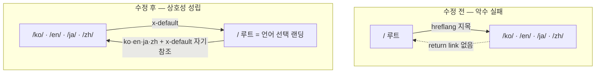

30줄짜리 스크립트를 내 사이트의 `dist/` 폴더에 겨눴다. 블로그 글 248개는 전부 초록불이었다. 딱 하나가 빨간불이었는데, 하필 홈페이지였다.

```text
[PASS] return-link reciprocity    broken pairs : 0   (한 글의 4개 언어)
...
[FAIL] return-link reciprocity    broken pairs : 4   (사이트 전체 249페이지)
[FAIL] self-referencing hreflang   missing      : 1
```

hreflang은 다국어 사이트에서 "이 페이지의 한국어판·영어판은 여기 있다"고 검색엔진에 알려주는 태그다. 넣기는 쉽다. 문제는 이게 <strong>양방향 계약</strong>이라는 점이다. 한쪽만 손을 내밀면 악수는 성립하지 않고, Google은 그 주석을 통째로 버린다. 나는 이 규칙을 문서로만 알고 있었는데, 정말 내 사이트가 지키고 있는지 궁금해서 직접 재봤다. 결과가 위와 같다. 순서대로 풀어본다.

## hreflang이 보장하는 것과 보장하지 않는 것

먼저 기대치를 낮추자. hreflang은 순위를 올려주지 않는다. Google Search Central 문서는 이 태그가 "언어나 지역에 따라 가장 적절한 버전으로 사용자를 안내"하는 도구라고 설명한다. 순위 부스트가 아니라 <strong>라우팅 신호</strong>다.

이 구분이 실무에서 중요하다. 나는 예전에 "hreflang을 제대로 넣으면 각 언어판이 각자 시장에서 순위가 오르겠지"라고 막연히 기대한 적이 있다. 틀린 기대였다. hreflang이 하는 일은 이렇다. 한국 사용자가 검색했을 때 영어판 대신 한국어판이 노출되도록, 이미 순위에 오른 결과를 올바른 언어로 <strong>교체</strong>해준다. 없던 순위를 만들어주는 게 아니다.

반대로 잘못 넣으면 손해는 확실하다. 리시프로시티가 깨진 주석은 무시되고, 최악의 경우 검색엔진이 어느 버전이 정본인지 헷갈려 엉뚱한 언어판을 노출한다. 그래서 hreflang은 "넣으면 이득, 안 넣으면 본전"이 아니라 "정확히 넣으면 본전 유지, 틀리게 넣으면 손해"에 가깝다. 이 비대칭을 알고 나면 검증에 시간을 쓰는 게 아깝지 않다.

## 양방향(return link) 규칙 — 왜 한쪽만으로는 안 되나

Google 문서의 문장은 짧고 단호하다. "두 페이지가 서로를 가리키지 않으면 태그가 무시된다(If two pages don't both point to each other, the tags will be ignored)."

풀어 쓰면 세 가지다.

1. <strong>Return link</strong>: A가 B를 대체판으로 지목하면 B도 A를 지목해야 한다.
2. <strong>Self-reference</strong>: 각 페이지는 자기 자신도 hreflang 목록에 넣어야 한다. 한국어판이라면 목록 안에 자기(ko)도 있어야 한다.
3. <strong>절대 URL</strong>: `href`는 프로토콜과 도메인을 포함한 전체 주소여야 한다.

이 규칙이 왜 이렇게 빡빡한지 나름대로 납득이 갔다. hreflang은 신뢰할 수 없는 제3자가 내 페이지를 자기 대체판이라 주장하는 걸 막아야 한다. 만약 단방향으로 인정하면, 아무 사이트나 "내 스페인어판은 당신의 유명한 영어 페이지요"라고 선언해 신호를 오염시킬 수 있다. 양쪽이 서로를 지목해야만 인정한다는 규칙은 일종의 상호 서명이다. 스팸 방지 관점에서 보면 오히려 깔끔한 설계다.

문제는 이 규칙이 사람 손으로는 지키기 어렵다는 것이다. 언어 4개에 글 수백 편이면 클러스터가 수백 개다. 한 페이지라도 목록이 어긋나면 그 클러스터만 조용히 무시된다. 에러가 화면에 뜨지도 않는다. 그래서 나는 검사기를 짰다.

## 내 사이트를 직접 감사했다

빌드 결과물(`dist/`)의 모든 `index.html`을 읽어 hreflang 링크를 뽑고, 그래프를 만들어 return link가 실제로 존재하는지 확인하는 스크립트다. RSS 피드에 붙은 `hreflang`은 HTML 페이지가 아니므로 걸러냈다.

````javascript
// hreflang-audit.mjs (핵심부)
function extractHreflang(html) {
  const out = [];
  const linkRe = /<link\b[^>]*rel=["']alternate["'][^>]*>/gi;
  for (const m of html.match(linkRe) || []) {
    if (/type=["']application\/rss\+xml["']/i.test(m)) continue; // RSS 제외
    const lang = (m.match(/hreflang=["']([^"']+)["']/i) || [])[1];
    const href = (m.match(/href=["']([^"']+)["']/i) || [])[1];
    if (lang && href) out.push({ lang, href });
  }
  return out;
}
// 각 주석 target이 나를 다시 가리키는가?
const target = pages.get(a.href);
if (target && !target.alts.some(t => t.href === url)) brokenReturn++;
````

먼저 글 하나의 4개 언어판만 검사했다. 접근성 감사를 다뤘던 [Lighthouse 접근성 글](/ko/blog/ko/a11y-lighthouse-audit-fix-2026/)을 대상으로 삼았다.

```text
$ node hreflang-audit.mjs dist a11y-lighthouse-audit-fix-2026
pages with hreflang annotations : 4
----------------------------------------------------
[PASS] return-link reciprocity    broken pairs : 0
[PASS] self-referencing hreflang   missing      : 0
[PASS] x-default present            missing      : 0
[PASS] absolute URLs                relative     : 0
[PASS] language code format         invalid      : 0
```

깨끗하다. 실제 태그를 열어보면 네 언어가 서로를, 그리고 자기 자신을 정확히 지목한다.

```html
<!-- /ko/blog/ko/a11y-.../ 가 내보내는 것 -->
<link rel="canonical" href="https://jangwook.net/ko/blog/ko/a11y-lighthouse-audit-fix-2026/">
<link rel="alternate" hreflang="ko" href="https://jangwook.net/ko/blog/ko/a11y-lighthouse-audit-fix-2026/">
<link rel="alternate" hreflang="en" href="https://jangwook.net/en/blog/en/a11y-lighthouse-audit-fix-2026/">
<link rel="alternate" hreflang="ja" href="https://jangwook.net/ja/blog/ja/a11y-lighthouse-audit-fix-2026/">
<link rel="alternate" hreflang="zh" href="https://jangwook.net/zh/blog/zh/a11y-lighthouse-audit-fix-2026/">
<link rel="alternate" hreflang="x-default" href="https://jangwook.net/en/blog/en/a11y-lighthouse-audit-fix-2026/">
```

여기까지는 만족스러웠다. 그런데 사이트 전체로 범위를 넓히자 그림이 달라졌다.

```text
$ node hreflang-audit.mjs dist
pages with hreflang annotations : 249
----------------------------------------------------
[FAIL] return-link reciprocity    broken pairs : 4
[FAIL] self-referencing hreflang   missing      : 1
[PASS] x-default present            missing      : 0
[PASS] absolute URLs                relative     : 0
[PASS] language code format         invalid      : 0

first broken return links:
  https://jangwook.net/
    → https://jangwook.net/ko/ (ko) has NO return link
  https://jangwook.net/
    → https://jangwook.net/en/ (en) has NO return link
  https://jangwook.net/
    → https://jangwook.net/ja/ (ja) has NO return link
  https://jangwook.net/
    → https://jangwook.net/zh/ (zh) has NO return link
```

깨진 4쌍이 전부 한 곳을 가리켰다. 언어 코드가 없는 <strong>맨 루트</strong> `https://jangwook.net/`. 248개 글은 완벽했고, 홈페이지 하나가 클러스터를 어그러뜨리고 있었다.

## 왜 홈페이지만 깨졌나

두 페이지의 실제 태그를 나란히 놓으면 원인이 바로 보인다.

```html
<!-- 맨 루트 / 가 내보내는 것 -->
<link rel="canonical" href="https://jangwook.net/">
<link rel="alternate" hreflang="ko" href="https://jangwook.net/ko/">
<link rel="alternate" hreflang="en" href="https://jangwook.net/en/">
<link rel="alternate" hreflang="ja" href="https://jangwook.net/ja/">
<link rel="alternate" hreflang="zh" href="https://jangwook.net/zh/">
<link rel="alternate" hreflang="x-default" href="https://jangwook.net/en/">

<!-- /ko/ 홈이 내보내는 것 -->
<link rel="canonical" href="https://jangwook.net/ko/">
<link rel="alternate" hreflang="ko" href="https://jangwook.net/ko/">
<link rel="alternate" hreflang="en" href="https://jangwook.net/en/">
<link rel="alternate" hreflang="ja" href="https://jangwook.net/ja/">
<link rel="alternate" hreflang="zh" href="https://jangwook.net/zh/">
<link rel="alternate" hreflang="x-default" href="https://jangwook.net/en/">
```

맨 루트 `/`는 자기 자신을 정본(`canonical`)으로 선언하면서, 대체판으로 `/ko/` `/en/` `/ja/` `/zh/`를 지목한다. 그런데 정작 `/ko/`의 목록에는 `/`가 없다. `/ko/`는 자기 자신과 다른 세 언어만 지목한다. 즉 루트는 언어 홈들을 향해 손을 내밀지만, 언어 홈 중 누구도 루트를 향해 손을 내밀지 않는다. 악수 실패. 게다가 루트는 자기 목록에 자신(`/`)을 넣지 않아 self-reference도 없다. 검사기가 잡은 "missing self : 1"이 바로 이 루트다.

솔직히 이건 흔한 함정이다. 다국어 사이트에서 언어 코드가 없는 "중립 루트"는 대개 언어 홈 중 하나로 리다이렉트하거나, 언어 선택 페이지 역할을 한다. 그런데 이 루트가 <strong>독립적인 정본 페이지처럼 자기 hreflang 허브를 따로 내보내면</strong>, 언어 홈들의 이미 완결된 클러스터에 낀 이방인이 된다. 언어 홈들은 루트의 존재를 모르니 return link를 만들어줄 이유가 없다.

한 가지 더. x-default가 `/en/`을 가리킨다. 이건 틀린 건 아니다. Google은 x-default가 특정 언어판을 가리켜도 된다고 명시한다. 다만 x-default의 취지는 "어느 언어에도 매칭되지 않는 사용자를 위한 페이지", 즉 언어 선택 화면이나 자동 리다이렉트 홈이다. 그 역할에 가장 잘 맞는 건 오히려 중립 루트 `/`다. 지금 구조는 "중립 루트는 있는데 x-default는 영어를 가리키고, 정작 그 중립 루트는 클러스터에서 겉돈다"는 어정쩡한 상태다.

이 문제를 최소 재현으로 다시 확인해봤다. 허브 A가 B를 지목하지만 B는 A를 지목하지 않는 두 페이지를 만들고 검사기를 돌렸다.

```text
===== BROKEN =====
[FAIL] return-link reciprocity    broken pairs : 1
[FAIL] self-referencing hreflang   missing      : 1

===== FIXED (모두 자기 자신 + 전체 변형을 상호 지목) =====
[PASS] return-link reciprocity    broken pairs : 0
[PASS] self-referencing hreflang   missing      : 0
[PASS] x-default present            missing      : 0
```

고치는 방향은 셋 중 하나다. (1) 루트를 언어 홈으로 301 리다이렉트해 클러스터에서 아예 빼거나, (2) 루트의 `canonical`을 언어 홈으로 넘겨 중복 신호를 정리하거나, (3) 루트를 x-default의 진짜 타깃으로 삼고 모든 언어 홈이 x-default로 루트를 지목하게 만들어 상호성을 복원하는 것. 나는 (3)이 의미상 가장 정직하다고 본다. 다만 이건 살아 있는 사이트의 canonical·리다이렉트를 건드리는 변경이라, 248개 멀쩡한 클러스터에 영향이 없는지 스테이징에서 재검증한 뒤 별도로 롤아웃할 생각이다. 이 글에서 라이브 SEO 동작을 즉흥적으로 바꾸지는 않았다. 검사기가 회귀 테스트가 되어줄 테니, 고친 다음 같은 스크립트를 다시 돌려 초록불을 확인하면 된다.

<strong>2026-07-04 후속</strong>: 이 수정은 배포됐다. 방법 (3)대로 홈 클러스터의 x-default를 중립 루트 `/`로 바꾸고, 위 검사기를 빌드 파이프라인의 postbuild 게이트로 상설화했다. 재실행 결과는 253개 페이지에서 broken pairs 0, missing self 0 — 초록불이다.

수정 전후를 그림으로 비교하면 문제가 한눈에 보인다.



## 세 가지 구현 방법 — 언제 뭘 쓸까

hreflang을 내보내는 방법은 셋이고, Google은 "세 방법이 동등하다"고 못 박는다. 동등하다는 말은 곧 <strong>어느 것을 골라도 되지만 섞지는 말라</strong>는 뜻으로 읽어야 한다. 한 페이지에 대해 HTML 태그와 사이트맵이 서로 다른 소리를 하면 검증만 지옥이 된다.

| 방법 | 어디에 넣나 | 강점 | 약점 | 이럴 때 |
|------|-----------|------|------|--------|
| HTML `<link>` 태그 | 각 페이지 `<head>` | 구현·확인이 가장 쉽다. 정적 사이트 빌드로 자동 생성 | 페이지마다 N개 태그. 페이지가 많으면 HTML이 무거워짐 | 정적 블로그, 수백 페이지 규모 |
| HTTP `Link:` 헤더 | 응답 헤더 | PDF·이미지 등 비HTML 문서에도 적용 가능 | 서버·CDN 설정 필요. 눈으로 확인이 번거로움 | 비HTML 리소스, 헤더 제어가 쉬운 환경 |
| 사이트맵 `xhtml:link` | XML 사이트맵 | HTML을 안 건드림. 대규모에 유리, 한 곳에서 관리 | 사이트맵이 커지고, 생성 파이프라인이 필요 | 페이지 수만 개, 마크업 수정이 어려운 CMS |

내 블로그는 정적 빌드라 HTML 태그 방식이 맞다. 페이지 수가 수백 개인 지금은 태그 방식의 "HTML이 무거워진다"는 약점이 아직 부담스럽지 않다. 만약 수만 페이지로 커진다면 사이트맵 방식으로 옮기는 걸 고려할 것이다. 그 경우 [LocalBusiness 구조화 데이터를 서버사이드로 내보낸 경험](/ko/blog/ko/localbusiness-structured-data-server-side-vs-js-2026/)에서처럼, 신호는 빌드 시점에 결정론적으로 찍어내는 게 사람이 손으로 관리하는 것보다 훨씬 안전하다.

## 자주 밟는 지뢰 — 특히 중국어

내 사이트는 언어 코드는 통과했지만, 규칙 자체에 흔한 함정이 몇 개 있어 체크리스트로 남긴다.

- <strong>지역 코드 오용</strong>: 영국은 `UK`가 아니라 `GB`다. `EU`, `UN`도 ISO 3166-1 Alpha 2가 아니라서 무효다. Google이 공식으로 지적하는 대표 실수다.
- <strong>언어 vs 지역 혼동</strong>: `hreflang="us"`는 틀렸다. `us`는 언어가 아니라 지역이다. `en-US`처럼 언어를 먼저 쓴다.
- <strong>중국어 서브태그</strong>: 내 사이트는 `zh`(bare)를 쓴다. 유효하긴 하지만 간체·번체를 구분하지 못한다. 본토 독자만 대상이면 `zh`로 충분하고, 대만·홍콩까지 노린다면 `zh-Hans` / `zh-Hant`로 스크립트를 명시하는 게 정확하다. 이 블로그는 중국어를 뒤늦게 추가하면서 간체 하나로 시작했는데, 지금 다시 보면 최소한 `zh-Hans`로 명시했어야 했다. 이건 내 실수로 기록해둔다.
- <strong>상대 경로</strong>: `href="/en/..."`는 안 된다. 절대 URL이어야 한다.
- <strong>noindex와 동시 사용</strong>: hreflang 대상이 `noindex`면 신호가 서로 모순된다. 색인하지 말라면서 대체판으로 안내하는 꼴이다.

마지막 항목은 특히 [AI 크롤러를 robots.txt로 제어하던 글](/ko/blog/ko/ai-crawler-control-robots-txt-llms-txt-2026/)과 이어진다. 색인·크롤링·언어 신호는 각자 다른 파일과 태그에 흩어져 있지만, 서로 모순되면 크롤러는 가장 보수적으로 해석하거나 그냥 무시한다. 신호를 넣는 것보다 <strong>신호끼리 충돌하지 않게 맞추는 것</strong>이 실무의 절반이다.

## 그래서 개발자가 바로 할 것

정리하면 순서는 이렇다.

1. <strong>빌드 결과물을 검사한다.</strong> 소스 템플릿이 아니라 실제로 나간 HTML을 본다. 위 30줄짜리 스크립트를 `dist/`에 겨누면 5초 안에 return link·self-reference·절대 URL·코드 형식을 한 번에 잡는다.
2. <strong>self-reference를 빠뜨리지 않는다.</strong> 각 페이지의 hreflang 목록에 자기 자신이 있어야 한다. 이걸 잊는 게 가장 흔하다.
3. <strong>중립 루트를 정리한다.</strong> 언어 코드 없는 `/`가 독립 canonical과 hreflang 허브를 따로 내보내고 있지 않은지 확인한다. 리다이렉트하거나, canonical을 언어 홈으로 넘기거나, x-default의 타깃으로 삼아 상호성을 만든다.
4. <strong>한 방법으로 통일한다.</strong> HTML 태그·HTTP 헤더·사이트맵을 섞지 않는다.
5. <strong>검사기를 CI에 건다.</strong> 빌드 후 자동으로 돌려 broken pair가 0이 아니면 실패시킨다. 나는 이 스크립트를 그렇게 쓸 생각이다. 언어 하나를 더 붙이는 날, 새 언어가 기존 클러스터를 조용히 깨뜨리는 사고를 막아준다.

한 가지만 남기자면 이거다. hreflang은 "넣었다"가 아니라 "빌드 결과물에서 양방향으로 맞물렸다"를 확인해야 끝난다. 그 확인은 눈이 아니라 스크립트로 해야 한다. 나조차 문서를 다 알면서도 내 홈페이지가 깨져 있는 걸 몰랐다.

---

다국어 사이트의 hreflang·canonical·구조화 데이터가 빌드 결과물에서 실제로 맞물려 나가는지 점검하거나, 정적/서버사이드 렌더링에서 이 신호들을 결정론적으로 내보내는 구조를 잡고 싶다면 개인적으로 상담·구현 의뢰를 받는다. 위 검사기 같은 작은 회귀 장치 하나가 수백 페이지의 조용한 실수를 막는다. 연락은 블로그 프로필의 문의 경로로 남겨주면 된다.
