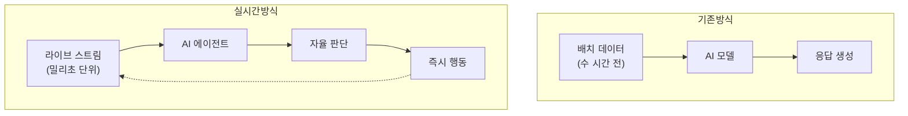
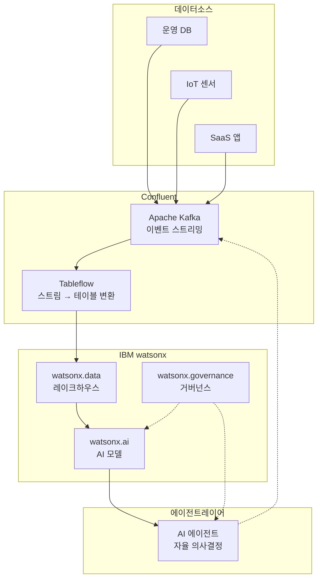
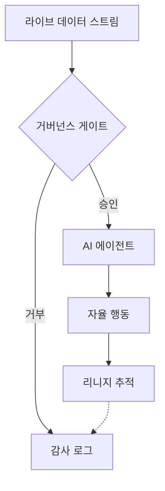

## 개요

2026년 3월 17일, IBM이 데이터 스트리밍 플랫폼 기업 Confluent를 <strong>$110억(약 15조 원)</strong>에 인수 완료했다. Fortune 500 기업의 40% 이상이 사용하는 Confluent의 Apache Kafka 기반 플랫폼이 IBM의 watsonx 생태계에 통합되면서, <strong>실시간 데이터 스트리밍이 엔터프라이즈 AI 에이전트의 핵심 인프라</strong>로 자리매김했다.

이번 인수는 단순한 M&A를 넘어, AI 시대의 데이터 아키텍처가 어떤 방향으로 진화하고 있는지를 명확하게 보여준다. Engineering Manager부터 CTO까지, 엔지니어링 리더가 이 변화를 어떻게 읽어야 하는지 분석한다.

## 왜 실시간 데이터인가 — "Data Latency Gap" 문제

### 기존 AI 시스템의 한계

대부분의 엔터프라이즈 AI 시스템은 <strong>배치 처리(Batch Processing)</strong> 기반으로 운영된다. 데이터를 수집하고, ETL(Extract, Transform, Load) 파이프라인을 통해 정제한 뒤, 모델에 투입하는 방식이다.

```
[운영 DB] → [ETL 파이프라인] → [데이터 웨어하우스] → [AI 모델]
          수 시간~수 일 지연
```

이 구조에서 AI 모델이 참조하는 데이터는 항상 <strong>"과거의 스냅샷"</strong>이다. 실시간으로 변화하는 시장 상황, 고객 행동, 시스템 상태를 반영하지 못한다.

### AI 에이전트가 요구하는 것

2026년의 AI 에이전트는 단순히 질문에 답하는 챗봇이 아니다. <strong>자율적으로 판단하고, 행동하고, 결과를 확인하는 능동적 시스템</strong>이다. 이런 에이전트가 "어제의 데이터"를 기반으로 의사결정을 한다면, 그 결과는 신뢰할 수 없다.



IBM이 Confluent를 인수한 핵심 이유가 바로 이 <strong>"Data Latency Gap"</strong>을 해소하기 위해서다.

## IBM + Confluent 통합 아키텍처

### 핵심 통합 포인트

IBM의 Rob Thomas SVP는 이번 인수를 <strong>"Agentic AI 퍼즐의 마지막 조각"</strong>이라고 표현했다. 구체적인 통합 구조는 다음과 같다:



### Zero-Copy Data Sharing

가장 주목할 기술은 <strong>Confluent의 Tableflow와 watsonx.data의 통합</strong>이다.

기존에는 Kafka의 스트리밍 데이터를 AI 모델에서 사용하려면 별도의 ETL 과정을 거쳐야 했다. Tableflow를 활용하면 <strong>Kafka 스트림을 마치 데이터베이스 테이블처럼 직접 쿼리</strong>할 수 있다.

```python
# 기존: ETL 파이프라인 필요
raw_data = kafka_consumer.poll()
transformed = etl_pipeline.transform(raw_data)
warehouse.insert(transformed)
result = ai_model.predict(warehouse.query("SELECT * FROM orders"))

# Tableflow 통합: 제로카피 직접 쿼리
result = ai_model.predict(
    watsonx_data.query("SELECT * FROM kafka_stream.orders")
)
```

이 방식은 <strong>ETL 비용을 제거</strong>하고, 데이터 지연을 밀리초 단위로 줄이며, AI 에이전트가 항상 최신 데이터를 기반으로 행동할 수 있게 한다.

## CTO/VPoE 관점의 전략적 시사점

### 1. "Live Agentic AI" 패러다임의 부상

이번 인수는 업계 전체의 방향성을 보여준다. AI 에이전트가 정적인 데이터가 아닌 <strong>라이브 이벤트 스트림</strong>을 기반으로 작동하는 "Live Agentic AI" 패러다임이 본격화되고 있다.

<strong>실무 영향:</strong>
- 기존 배치 기반 ML 파이프라인을 스트리밍 아키텍처로 전환 검토 필요
- 데이터 엔지니어링 팀에 Kafka/이벤트 스트리밍 역량 확보 필요
- AI 에이전트의 의사결정 품질이 데이터 신선도(Data Freshness)에 직결

### 2. 거버넌스와 리니지의 중요성

실시간 데이터가 AI 에이전트의 의사결정에 직접 영향을 미치면, <strong>데이터 거버넌스</strong>의 중요성이 급격히 높아진다.



<strong>체크포인트:</strong>
- 데이터 리니지(lineage) 추적 시스템 구축
- AI 에이전트의 의사결정 근거 데이터를 감사 가능하게 보존
- 정책 기반 접근 제어(Policy-Based Access Control) 적용

### 3. 벤더 락인 vs 오픈소스 전략

IBM의 통합 플랫폼은 강력하지만, <strong>벤더 락인 위험</strong>을 동반한다. CTO로서 고려해야 할 대안 전략:

| 접근 방식 | 장점 | 단점 |
|-----------|------|------|
| IBM 풀스택 (Confluent + watsonx) | 통합 관리, 거버넌스 일체형 | 높은 비용, 벤더 락인 |
| OSS 조합 (Kafka + 자체 AI) | 유연성, 비용 절감 | 통합 복잡도, 거버넌스 자체 구축 필요 |
| 하이브리드 (Confluent Cloud + 멀티 AI) | 데이터 레이어 통일, AI 유연성 | 복잡한 아키텍처 관리 |

### 4. 조직 역량 전환

이번 변화는 기술만의 문제가 아니다. <strong>조직 구조와 역량</strong>의 전환도 필요하다.

<strong>데이터 엔지니어링 팀 역할 변화:</strong>
- 배치 ETL 운영 → 이벤트 스트리밍 아키텍처 설계
- 데이터 웨어하우스 관리 → 실시간 데이터 파이프라인 운영
- 정적 리포팅 → AI 에이전트용 데이터 피드 최적화

<strong>AI/ML 엔지니어 역할 확대:</strong>
- 모델 학습/배포 → 에이전트 오케스트레이션
- 오프라인 평가 → 실시간 모니터링 및 피드백 루프 설계

## 실무 적용: 첫 걸음

IBM-Confluent 규모의 인프라가 아니더라도, 실시간 데이터 + AI 에이전트 패턴은 소규모에서도 적용 가능하다.

### 최소 구성 예시

```yaml
# docker-compose.yml (최소 실시간 AI 에이전트 스택)
services:
  kafka:
    image: confluentinc/cp-kafka:latest
    ports:
      - "9092:9092"

  agent-worker:
    build: ./agent
    environment:
      - KAFKA_BOOTSTRAP_SERVERS=kafka:9092
      - LLM_API_KEY=${LLM_API_KEY}
    depends_on:
      - kafka

  monitoring:
    image: grafana/grafana:latest
    ports:
      - "3000:3000"
```

### 이벤트 드리븐 AI 에이전트 패턴

```python
from confluent_kafka import Consumer
import anthropic

client = anthropic.Anthropic()
consumer = Consumer({
    'bootstrap.servers': 'localhost:9092',
    'group.id': 'ai-agent-group',
    'auto.offset.reset': 'latest'
})
consumer.subscribe(['business-events'])

while True:
    msg = consumer.poll(1.0)
    if msg is None:
        continue

    event = json.loads(msg.value())

    # AI 에이전트가 실시간 이벤트를 기반으로 판단
    response = client.messages.create(
        model="claude-sonnet-4-6",
        max_tokens=1024,
        messages=[{
            "role": "user",
            "content": f"다음 비즈니스 이벤트를 분석하고 조치를 제안하세요: {event}"
        }]
    )

    # 에이전트의 판단 결과를 다시 이벤트로 발행
    producer.produce(
        'agent-decisions',
        json.dumps({"event": event, "decision": response.content})
    )
```

## 결론

IBM의 Confluent 인수는 <strong>"AI 에이전트 시대의 데이터 인프라는 실시간이어야 한다"</strong>는 메시지를 명확히 전달한다. $110억이라는 금액은 실시간 데이터 스트리밍이 단순한 기술 트렌드가 아닌, <strong>엔터프라이즈 AI의 기반 인프라</strong>임을 증명한다.

엔지니어링 리더로서 지금 시작할 수 있는 액션:

1. <strong>현재 데이터 아키텍처의 지연 시간 감사</strong> — AI 에이전트가 참조하는 데이터가 얼마나 "신선한지" 측정
2. <strong>이벤트 스트리밍 PoC 진행</strong> — 가장 시간에 민감한 워크플로우에 Kafka 기반 스트리밍 파일럿 적용
3. <strong>거버넌스 프레임워크 설계</strong> — 실시간 데이터가 AI 의사결정에 투입되기 전 정책 및 감사 체계 마련
4. <strong>팀 역량 로드맵 수립</strong> — 데이터 엔지니어링 + AI 엔지니어링 교차 역량 개발 계획

배치에서 스트리밍으로, 챗봇에서 에이전트로 — 데이터와 AI의 관계가 근본적으로 재정의되고 있다.

## 참고 자료

- [IBM Completes Acquisition of Confluent — IBM Newsroom](https://newsroom.ibm.com/2026-03-17-ibm-completes-acquisition-of-confluent,-making-real-time-data-the-engine-of-enterprise-ai-and-agents)
- [IBM Solidifies AI Infrastructure Dominance with $11 Billion Confluent Acquisition](https://www.financialcontent.com/article/marketminute-2026-3-19-ibm-solidifies-ai-infrastructure-dominance-with-11-billion-confluent-acquisition)
- [IBM closes $11B Confluent deal for AI data](https://www.stocktitan.net/news/IBM/ibm-completes-acquisition-of-confluent-making-real-time-data-the-lbuwdbharsqe.html)
- [Deloitte Agentic AI Strategy](https://www.deloitte.com/us/en/insights/topics/technology-management/tech-trends/2026/agentic-ai-strategy.html)
