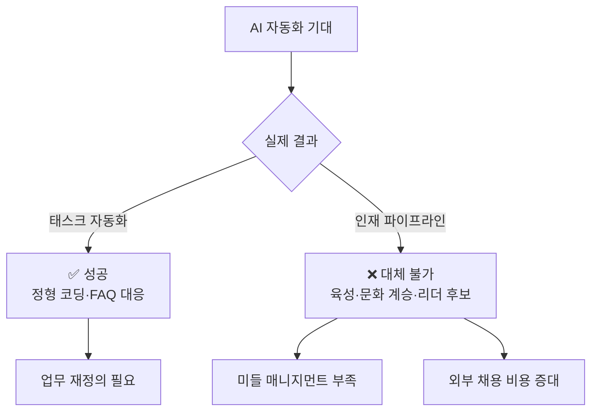
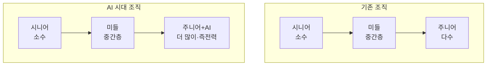
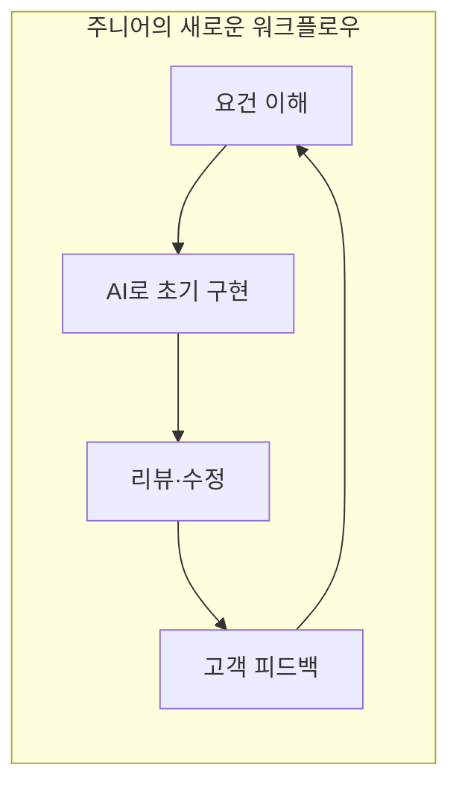

## 들어가며

"AI가 엔트리 레벨 일자리를 없앨 것이다"——지난 몇 년간 테크 업계에서 반복되어 온 예언이, 지금 큰 전환점을 맞고 있습니다.

2026년 2월, <strong>IBM의 CHRO(최고인사책임자) Nickle LaMoreaux</strong>가 충격적인 발표를 했습니다. IBM은 <strong>엔트리 레벨 채용을 3배로 확대</strong>한다는 것입니다. 그것도 "AI가 할 수 있다고 말해지는 소프트웨어 개발자 등의 직종"에서요.

[Fortune 보도](https://fortune.com/2026/02/13/tech-giant-ibm-tripling-gen-z-entry-level-hiring-according-to-chro-rewriting-jobs-ai-era/)에 따르면, IBM뿐만 아니라 Dropbox와 Cognizant도 같은 움직임을 보이고 있습니다.

엔지니어링 매니저(EM)로서 이 동향은 매우 시사적입니다. AI 대체의 '기대'와 '현실' 사이의 간극, 그리고 거기서 보이는 조직 설계의 본질에 대해 고찰해 보겠습니다.

## AI 대체의 현실 vs 기대

### 기대했던 시나리오

2023~2025년에 걸쳐 많은 기업 임원들이 다음과 같은 비전을 말했습니다:

- 엔트리 레벨 코딩 작업은 AI로 자동화 가능
- 주니어 엔지니어 채용을 줄이고 시니어 중심 소수정예 팀으로 전환
- Korn Ferry 조사에서 <strong>37%의 조직이 엔트리 레벨 직무를 AI로 대체할 계획</strong>

### IBM이 직면한 현실

그러나 IBM이 실제로 경험한 것은 다른 현실이었습니다:

- 엔트리 레벨의 '태스크'는 자동화할 수 있어도, '인재 육성 파이프라인'은 대체할 수 없다
- 주니어 인력을 줄이면 3~5년 후 <strong>미들 매니지먼트 층의 심각한 부족</strong>이 발생한다
- 외부 경력직 채용은 비용이 높고, 사내 문화 적응에도 시간이 걸린다

LaMoreaux는 이렇게 말합니다:

> "3~5년 후 가장 성공할 기업은, 이 환경에서 엔트리 레벨 채용을 두 배로 늘린 기업입니다"

### EM으로서의 교훈

AI는 '태스크의 자동화'에는 뛰어나지만, '조직의 지속 가능성'은 별개의 문제입니다. 팀을 장기적으로 유지하려면 육성 파이프라인이 필수적입니다.

## 대기업의 인력 계획: IBM의 전략 전환

### '삭감'에서 '재정의'로

IBM의 흥미로운 점은 단순히 주니어를 늘리는 것이 아니라, <strong>역할 자체를 재정의하고 있다</strong>는 것입니다:

| 기존 역할 | AI 시대의 새로운 역할 |
|---|---|
| 소프트웨어 엔지니어: 정형 코딩 중심 | 소프트웨어 엔지니어: 고객 대응·AI 활용 설계 |
| HR 담당: 질문에 직접 답변 | HR 담당: 챗봇 개입·예외 처리 |
| 주니어: 선배 지시로 태스크 실행 | 주니어: AI 도구 활용으로 즉전력화 |

### Dropbox의 견해

Dropbox CPO Melanie Rosenwasser는 Gen Z의 AI 스킬에 대해 인상적인 코멘트를 남겼습니다:

> "그들은 투르 드 프랑스를 달리고 있는데, 우리는 아직 보조 바퀴를 달고 있습니다. 그 정도로 그들이 우리를 랩핑하고 있어요"

Dropbox는 인턴십과 New Grad 프로그램을 <strong>25% 확대</strong>할 예정입니다.

### Cognizant의 '역피라미드' 구상

Cognizant CEO Ravi Kumar S도 조직 구조의 변화를 예견하고 있습니다:

> "기존 피라미드 구조는 더 넓고 더 짧아질 것이다. 그리고 전문성에 도달하는 속도도 빨라질 것이다"

## 조직 설계론: EM이 지금 생각해야 할 것

### 1. 인재 파이프라인은 '인프라'다

도로나 수도와 마찬가지로, 인재 파이프라인은 단기적인 ROI로는 측정할 수 없는 인프라입니다. IBM 케이스는 <strong>파이프라인을 중단했을 때의 비용</strong>이 <strong>유지 비용</strong>을 훨씬 넘는다는 것을 보여줍니다.

EM으로서 분기별 헤드카운트 최적화만이 아니라, 3~5년 스팬의 인력 계획을 경영진에 제안하는 것이 중요합니다.

### 2. 주니어의 역할을 '재발명'하라

AI가 주니어의 기존 태스크를 대체한다면, 주니어의 역할을 재정의해야 합니다:

- <strong>AI 오케스트레이터</strong>: AI 도구를 조합해 문제를 해결
- <strong>도메인 브릿지</strong>: 기술과 고객 사이의 가교 역할
- <strong>품질 게이트키퍼</strong>: AI 생성 코드의 리뷰와 테스트

### 3. 'AI + 인간' 하이브리드 조직을 설계하라

기존에 주니어가 1주일 걸리던 구현이, AI 지원으로 1~2일이 됩니다. 하지만 그 덕분에 <strong>고객 대응이나 도메인 이해에 시간을 할애</strong>할 수 있습니다. 이것이 바로 IBM이 목표로 하는 '더 내구성 있는 스킬'의 구축입니다.

### 4. 채용 전략의 재검토

Korn Ferry 조사에서 37%의 기업이 주니어 직무를 AI로 대체할 계획이었지만, IBM의 움직임은 정반대입니다. EM으로서 고려해야 할 포인트:

- AI 리터러시가 높은 신입이 기존 사원보다 빠르게 AI 도구를 활용할 수 있다
- LinkedIn 데이터에 따르면 <strong>AI 리터러시가 미국에서 가장 빠르게 성장하는 스킬</strong>
- 'AI를 잘 다루는 주니어'가 'AI를 못 쓰는 시니어'보다 생산성이 높을 수 있다

## 맺으며: AI는 인재의 '대체'가 아닌 '증폭기'

IBM의 결단은 테크 업계에 중요한 메시지를 보내고 있습니다:

1. <strong>AI는 태스크를 자동화하지만, 인재 육성은 자동화할 수 없다</strong>
2. <strong>엔트리 레벨 채용 삭감은 중장기적으로 큰 리스크를 초래한다</strong>
3. <strong>역할의 '재정의'야말로 AI 시대 조직 전략의 핵심이다</strong>

Cognizant CEO의 말이 이 변화의 본질을 잘 표현하고 있습니다:

> "AI는 인간 가능성의 증폭기이지, 대체 전략이 아닙니다"

EM으로서 우리는 AI 도구 도입뿐만 아니라, <strong>조직 설계 자체를 재고할 시기</strong>에 와 있습니다. 주니어를 잘라내는 것이 아니라, AI와 함께 성장할 수 있는 새로운 역할과 환경을 설계하는 것——그것이 3~5년 후에 살아남는 조직의 조건입니다.

## 참고 자료

- [Fortune: IBM is tripling Gen Z entry-level hiring](https://fortune.com/2026/02/13/tech-giant-ibm-tripling-gen-z-entry-level-hiring-according-to-chro-rewriting-jobs-ai-era/)
- [Korn Ferry: Companies plan to replace entry roles with AI](https://www.hrdive.com/news/companies-plan-to-replace-entry-roles-ai/804870/)
- [LinkedIn: AI literacy is fastest-growing skill](https://www.linkedin.com/pulse/linkedin-skills-rise-2025-15-fastest-growing-us-linkedin-news-hy0le/)
