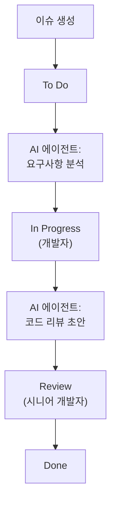
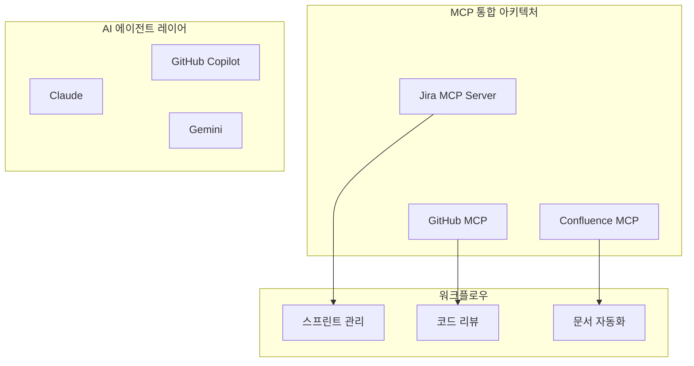

## 개요

2026년 2월 25일, Atlassian이 <strong>Jira에 AI 에이전트를 공식 도입</strong>했습니다. 단순한 챗봇이 아닙니다. AI 에이전트가 Jira 워크플로우 안에서 <strong>작업을 할당받고, 댓글로 협업하고, 워크플로우 스텝을 자동 실행</strong>하는 구조입니다.

동시에 Atlassian은 <strong>Model Context Protocol(MCP)</strong>을 전면 채택하여, Rovo(자체 AI)뿐 아니라 GitHub Copilot, Claude, Gemini 등 외부 AI 에이전트도 Jira와 직접 연결할 수 있게 됐습니다.

Engineering Manager 입장에서 이건 단순한 기능 업데이트가 아닙니다. <strong>팀 운영 방식 자체가 바뀌는 신호</strong>입니다. 이 글에서는 EM 관점에서 무엇이 달라지고, 어떻게 준비해야 하는지 정리합니다.

## 무엇이 바뀌었나 — Jira AI 에이전트 3가지 핵심 기능

### 1. 에이전트를 팀원처럼 할당

이제 Jira 이슈의 담당자(Assignee)에 AI 에이전트를 지정할 수 있습니다. 사람과 동일한 필드 패턴을 사용하므로, 기존 워크플로우를 깨지 않고 AI를 투입할 수 있습니다.

```
# 기존 워크플로우
이슈 생성 → 개발자 할당 → 작업 → 리뷰 → 완료

# AI 에이전트 통합 워크플로우
이슈 생성 → AI 에이전트 할당(초안/리서치) → 개발자 리뷰 → 작업 → 완료
```

### 2. 댓글 기반 @mention 협업

AI 에이전트를 댓글에서 @mention하면, 해당 이슈의 컨텍스트 안에서 요약, 리서치, 솔루션 제안을 받을 수 있습니다. 별도 도구를 열 필요 없이 Jira 안에서 바로 AI와 협업합니다.

### 3. 워크플로우 자동 트리거

Jira 워크플로우의 특정 상태(Status)에 AI 에이전트를 배치하여, 상태 전환 시 자동으로 작업을 수행하게 할 수 있습니다.



## MCP가 왜 중요한가 — 도구 잠금에서 해방

Atlassian의 MCP 채택은 단순한 기술적 선택이 아닙니다. <strong>벤더 잠금(Vendor Lock-in)에서의 해방</strong>을 의미합니다.

### MCP 통합 현황

Atlassian이 호스팅하는 MCP 서버를 통해 다음 AI 클라이언트가 Jira/Confluence에 직접 연결됩니다:

| AI 클라이언트 | 연결 방식 |
|---|---|
| Claude (Anthropic) | MCP 네이티브 |
| GitHub Copilot | MCP 통합 |
| Gemini CLI (Google) | MCP 통합 |
| Cursor | MCP 통합 |
| Lovable | MCP 통합 |
| WRITER | MCP 통합 |

### Rovo MCP Gallery

Atlassian의 Rovo MCP Gallery를 통해 GitHub, Box, Figma 등 서드파티 도구의 에이전트도 Jira 안에서 동작합니다. 현재 <strong>MCP 사용량의 약 1/3이 쓰기(Write) 작업</strong>이라는 점이 주목할 만합니다. 단순 데이터 조회가 아니라 실제로 작업을 수행하고 있다는 의미입니다.

### 엔터프라이즈 채택 현황

- MCP 사용량의 <strong>93%가 유료 고객</strong>에서 발생
- 엔터프라이즈 계정이 MCP 작업의 <strong>약 절반</strong>을 차지
- 이미 실무에서 본격 활용되고 있다는 증거

## EM이 준비해야 할 5가지

### 1. AI 에이전트 거버넌스 체계 수립

AI 에이전트가 팀원으로 들어오면, <strong>권한과 책임의 경계</strong>를 명확히 해야 합니다.

```yaml
# AI 에이전트 거버넌스 체크리스트
permissions:
  - 에이전트가 접근할 수 있는 프로젝트 범위 정의
  - 쓰기 권한 부여 기준 설정
  - 프로덕션 영향 작업은 반드시 인간 승인 필요

audit:
  - 에이전트 활동 로그 모니터링 주기 결정
  - 비정상 행동 탐지 기준 설정
  - 월간 에이전트 성과 리뷰 프로세스

escalation:
  - 에이전트 실패 시 폴백 프로세스
  - 에이전트 → 인간 에스컬레이션 조건
  - 긴급 상황 시 에이전트 중지 절차
```

### 2. 팀 역할 재정의

AI 에이전트가 반복 작업을 맡으면, 팀원의 역할이 변합니다.

<strong>Before</strong>: 개발자가 이슈 트리아지, 코드 리뷰 초안, 문서 업데이트를 직접 수행
<strong>After</strong>: AI가 초안을 생성하고, 개발자는 검증과 의사결정에 집중

EM으로서 이 전환을 <strong>위협이 아닌 기회</strong>로 포지셔닝하는 것이 중요합니다. 팀원들이 더 가치 있는 작업에 집중할 수 있도록 AI가 맡을 작업과 사람이 맡을 작업의 경계를 명확히 설계하세요.

### 3. MCP 기반 도구 통합 전략

MCP는 이제 사실상의 표준(de facto standard)입니다. Anthropic이 만들었지만, Linux Foundation에 기부되었고, OpenAI, Google, Microsoft, AWS가 모두 지원합니다.



### 4. 점진적 도입 로드맵

한 번에 모든 것을 바꾸려 하지 마세요. 단계별로 도입합니다.

<strong>Phase 1 (1〜2주)</strong>: 읽기 전용 에이전트로 시작
- 이슈 요약, 스프린트 리포트 자동 생성
- 위험도: 낮음, 가치: 즉시 체감

<strong>Phase 2 (3〜4주)</strong>: 쓰기 에이전트 제한적 도입
- 이슈 라벨링, 우선순위 제안
- 인간 승인 게이트 필수

<strong>Phase 3 (2개월〜)</strong>: 워크플로우 자동화
- 상태 전환 트리거 에이전트
- CI/CD 파이프라인과 연동
- 정기적 효과 측정 및 조정

### 5. 측정 지표 설계

AI 에이전트 도입의 성과를 정량적으로 측정할 수 있어야 합니다.

| 지표 | 측정 방법 | 목표 |
|---|---|---|
| 이슈 트리아지 시간 | 이슈 생성 → 첫 반응 시간 | 50% 단축 |
| 반복 작업 비율 | AI가 처리한 작업 / 전체 작업 | 30% 이상 |
| 개발자 만족도 | 월간 설문 (1〜5) | 3.5 이상 |
| 에이전트 정확도 | AI 제안 채택률 | 70% 이상 |
| 스프린트 속도 변화 | 포인트/스프린트 | 20% 향상 |

## 실전 시나리오 — EM의 하루가 이렇게 바뀐다

### Before: 전통적인 스프린트 관리

```
09:00 - 이슈 트리아지 (30분)
09:30 - 스탠드업 준비 (각 팀원 상황 파악, 15분)
10:00 - 스탠드업 미팅
10:30 - 블로커 해결 (다른 팀 조율, 1시간)
14:00 - 코드 리뷰 (1시간)
15:00 - 스프린트 리뷰 준비 (30분)
```

### After: AI 에이전트 활용

```
09:00 - AI가 트리아지한 결과 검토 (10분)
09:10 - AI 생성 스탠드업 요약 검토 (5분)
09:30 - 스탠드업 미팅 (AI 요약 기반으로 더 생산적)
10:00 - 전략적 블로커 해결에 집중 (AI가 사전 분석 제공)
14:00 - AI 코드 리뷰 초안 기반 리뷰 (30분)
14:30 - 절약된 시간으로 1:1 미팅, 기술 부채 정리
```

<strong>핵심 변화</strong>: EM의 역할이 '작업 관리자'에서 '의사결정자'로 전환됩니다.

## 주의할 점

### AI 에이전트 ≠ 만능

- 에이전트는 도구입니다. <strong>판단은 여전히 사람의 몫</strong>입니다
- 초기에는 에이전트 출력의 품질이 불안정할 수 있습니다. 꼭 검증 프로세스를 두세요
- 팀원들의 심리적 안전감을 고려하세요. "AI가 내 일을 대체한다"는 불안감에 선제적으로 대응하세요

### 보안과 컴플라이언스

- Jira의 기존 권한 체계를 그대로 존중합니다
- 모든 에이전트 활동은 감사 추적(Audit Trail)이 남습니다
- 프로덕션 수정은 반드시 인간 승인이 필요합니다
- 개발자별 격리된 샌드박스 환경에서 에이전트가 동작합니다

## 결론

Atlassian의 Jira AI 에이전트 + MCP 도입은 <strong>프로젝트 관리 도구의 패러다임 전환</strong>입니다. MCP가 사실상의 표준으로 자리 잡으면서, AI 에이전트가 개발 도구 전반에 통합되는 속도는 더욱 빨라질 것입니다.

Engineering Manager로서 지금 해야 할 일은 명확합니다:

1. <strong>MCP 생태계를 이해</strong>하고 팀에 적합한 AI 에이전트 조합을 찾으세요
2. <strong>거버넌스 체계를 먼저 설계</strong>한 후에 도입하세요
3. <strong>점진적으로 도입</strong>하되, 측정 가능한 지표와 함께 진행하세요
4. <strong>팀원의 역할 전환</strong>을 기회로 포지셔닝하세요

2026년은 AI 에이전트가 데모에서 실무로 넘어가는 해입니다. Jira라는 수백만 팀이 사용하는 플랫폼에서의 이 변화는, 그 전환의 가장 명확한 신호입니다.

## 참고 자료

- [Atlassian 공식 발표 — AI Agents in Jira](https://www.atlassian.com/blog/announcements/ai-agents-in-jira)
- [TechCrunch — Jira's latest update allows AI agents and humans to work side by side](https://techcrunch.com/2026/02/25/jiras-latest-update-allows-ai-agents-and-humans-to-work-side-by-side/)
- [SiliconANGLE — Atlassian embeds agents into Jira and embraces MCP](https://siliconangle.com/2026/02/25/atlassian-embeds-agents-jira-embraces-mcp-third-party-integrations/)
- [MCP 공식 사이트](https://modelcontextprotocol.io/)
