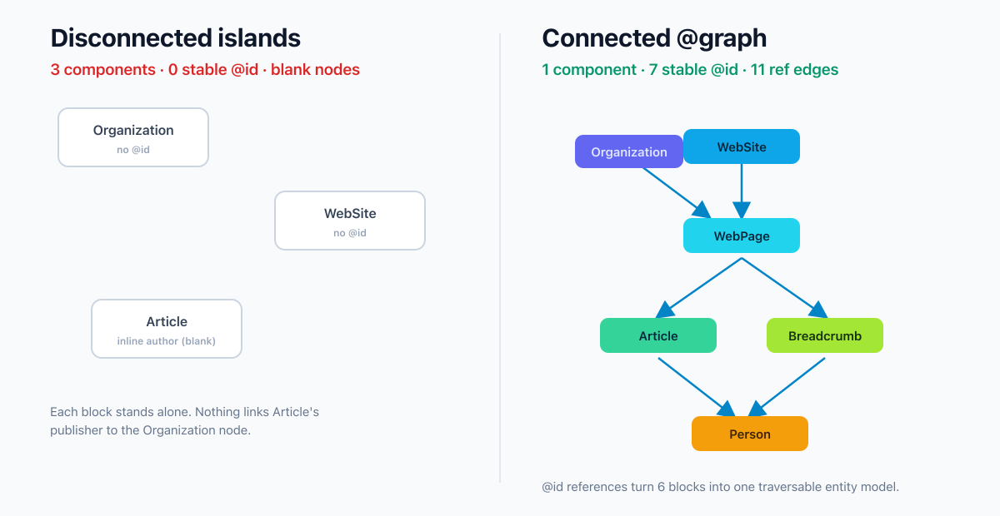

`jsonld` 라이브러리로 내 마크업을 flatten 해보면 숫자 하나가 튀어나온다. 연결 컴포넌트 개수다. 대부분의 사이트는 이 값이 2나 3으로 나온다. `Organization` 하나, `WebSite` 하나, `Article` 하나. 각각 따로 노는 섬이다.

이게 문제라는 걸 오래 몰랐다. 페이지마다 `<script type="application/ld+json">`를 두세 개 박아 넣고, Rich Results Test에서 초록불이 뜨면 끝난 줄 알았다. 실제로 각 조각은 개별적으로는 유효하다. 문법도 맞고 필수 속성도 채워져 있다. 그런데 검색엔진과 AI 크롤러가 "이 사이트를 발행한 조직", "이 글을 쓴 사람", "그 사람이 속한 회사"를 하나로 이어서 이해하느냐는 완전히 다른 이야기다. 조각들이 서로를 모르면, 이어지지 않는다.

이번엔 이걸 말로만 하지 않고 직접 재봤다. 흩어진 조각 버전과 `@id`로 묶은 `@graph` 버전을 각각 만들고, W3C JSON-LD 처리기로 확장·평탄화해서 "몇 개의 섬으로 나뉘는가"를 숫자로 뽑았다. 아래 로그와 표는 전부 그 샌드박스에서 나온 실제 출력이다.

## 왜 "조각난 JSON-LD"가 지금 더 문제인가

몇 년 전이라면 조각난 마크업도 크게 상관없었다. 검색엔진은 페이지 단위로 리치 결과를 뽑았고, `Article` 하나만 제대로 있으면 기사 카드가 떴다. 그런데 검색이 엔티티 중심으로 옮겨가고, 거기에 AI 검색(생성엔진)이 얹히면서 판이 달라졌다.

AI Overview나 챗봇형 검색은 페이지 하나만 보는 게 아니라 <strong>엔티티들의 관계</strong>를 읽으려 한다. "이 글의 저자는 누구고, 그 저자는 어떤 조직 소속이며, 그 조직의 공식 사이트는 무엇인가." 이 관계가 마크업 안에 명시돼 있으면 기계가 추론할 필요 없이 그대로 가져간다. 반대로 `Article`에 `author`가 그냥 `{"@type": "Person", "name": "Jane Doe"}`로만 박혀 있으면, 그 Jane Doe가 사이트의 `Organization`과 무슨 관계인지 마크업 어디에도 없다. 기계가 알아서 이어주기를 바라는 수밖에 없다.

나는 여기서 개발자가 할 일이 명확하다고 본다. 추론에 기대지 말고, 관계를 명시적으로 적어주는 것. 그게 `@graph`와 `@id`가 존재하는 이유다. AI 크롤러에게 무엇을 어떻게 노출할지는 [robots.txt로 학습·인용을 나눠 제어하는 전략](/ko/blog/ko/ai-crawler-control-robots-txt-llms-txt-2026)에서 다뤘는데, 이 글은 그 다음 단계다. 읽게 허용한 크롤러에게 <strong>정확한 엔티티 모델</strong>을 건네는 방법.

## @id와 노드 참조 — W3C가 정의한 연결 방식

핵심 도구는 두 개다. `@graph`와 `@id`.

`@graph`는 여러 엔티티를 한 배열에 담는 컨테이너다. 페이지에 `<script>` 블록을 세 개 흩뿌리는 대신, 하나의 스크립트 안에 `@graph` 배열로 모든 엔티티를 넣는다. 여기까지는 그냥 정리정돈이다. 진짜는 `@id`다.

`@id`는 각 엔티티에 고유한 식별자를 붙인다. W3C JSON-LD 명세는 `@id`만 가진 객체를 <strong>노드 참조(node reference)</strong>라고 부른다. "다른 곳에 있는 노드 객체를 가리키는, `@id` 속성만 담은 노드 객체"라는 정의다. 즉 `Article`의 `publisher`에 조직 전체를 다시 적는 대신, `{"@id": "https://example.com/#org"}` 한 줄만 적으면 "위에서 정의한 그 조직"을 가리킨다.

식별자 값에는 관행이 있다. 도메인 + 프래그먼트(`#org`, `#website`, `#article`) 형태를 쓴다. 중요한 건 이 URI가 실제로 열리는 페이지일 필요가 없다는 점이다. `@id`는 URL이 아니라 <strong>식별자</strong>다. 역할은 단 하나, 문서 어디서든 같은 엔티티를 가리킬 때 항상 같은 값을 쓰는 것. 반대로 서로 다른 엔티티에 같은 `@id`를 쓰면 처리기가 둘을 하나로 병합해버리니 피해야 한다.

Google도 이 방식을 지원한다. 공식 문서는 JSON-LD를 권장 형식으로 명시하고, 여러 엔티티를 한 `@graph`에 넣어 서로 참조하는 구조를 문제없이 읽는다. 여기서 짚어둘 점 하나. 이건 Google만의 독자 규칙이 아니라 W3C 표준이다. 그래서 Google, Bing뿐 아니라 표준을 따르는 어떤 JSON-LD 처리기든 동일하게 해석한다.

## 직접 해봤다: 흩어진 조각 vs 하나의 @graph

말로는 "연결된다"는 게 와닿지 않아서, 두 버전을 만들어 실제로 처리기에 돌렸다.

첫 번째는 흔히 보는 흩어진 버전이다. `Organization`, `WebSite`, `Article` 세 조각이 각자 `@context`를 달고 따로 존재한다. `Article`의 `author`와 `publisher`는 인라인으로 이름만 박혀 있다.

```json
[
  { "@context": "https://schema.org", "@type": "Organization", "name": "Acme Bakery", "url": "https://example.com" },
  { "@context": "https://schema.org", "@type": "WebSite", "name": "Acme Bakery", "url": "https://example.com" },
  { "@context": "https://schema.org", "@type": "Article", "headline": "Sourdough at 4am",
    "author": { "@type": "Person", "name": "Jane Doe" },
    "publisher": { "@type": "Organization", "name": "Acme Bakery" } }
]
```

두 번째는 같은 정보를 `@graph` 하나에 넣고 `@id`로 이었다. `Article`은 `author`에 `{"@id": ".../#jane"}`, `publisher`에 `{"@id": ".../#org"}`를 참조하고, `Person`은 `worksFor`로 다시 `Organization`을 가리킨다. `WebPage`가 `WebSite`의 일부임을, `BreadcrumbList`가 그 `WebPage`에 속함을 명시한다.

```json
{
  "@context": "https://schema.org",
  "@graph": [
    { "@type": "Organization", "@id": "https://example.com/#org", "name": "Acme Bakery", "url": "https://example.com" },
    { "@type": "WebSite", "@id": "https://example.com/#website", "url": "https://example.com",
      "publisher": { "@id": "https://example.com/#org" } },
    { "@type": "WebPage", "@id": "https://example.com/blog/sourdough#webpage",
      "isPartOf": { "@id": "https://example.com/#website" },
      "breadcrumb": { "@id": "https://example.com/blog/sourdough#breadcrumb" } },
    { "@type": "Article", "@id": "https://example.com/blog/sourdough#article", "headline": "Sourdough at 4am",
      "isPartOf": { "@id": "https://example.com/blog/sourdough#webpage" },
      "author": { "@id": "https://example.com/#jane" },
      "publisher": { "@id": "https://example.com/#org" } },
    { "@type": "Person", "@id": "https://example.com/#jane", "name": "Jane Doe",
      "worksFor": { "@id": "https://example.com/#org" } }
  ]
}
```

그다음 짧은 Node 스크립트를 짰다. `jsonld` 라이브러리로 두 문서를 각각 `flatten` 하고, 노드끼리의 `@id` 참조를 무방향 그래프로 본 뒤 연결 컴포넌트 개수를 셌다. 컴포넌트가 1개면 모든 엔티티가 한 덩어리로 이어진 것이고, 여러 개면 그만큼 섬으로 쪼개진 것이다.

```javascript
const flat = await jsonld.flatten(doc);
const graph = flat['@graph'] || flat;
// 각 노드의 값 중 다른 노드의 @id를 가리키는 참조를 엣지로 계산,
// 무방향 그래프에서 연결 컴포넌트 수를 센다 (DFS)
```

실행 결과다. 각색 없이 그대로 옮긴다.

```text
[disconnected islands]
  total nodes (after flatten): 5
  nodes with a stable @id:     0
  @id reference edges:         2
  connected components:        3  => 3 disconnected islands

[connected @graph]
  total nodes (after flatten): 10
  nodes with a stable @id:     7
  @id reference edges:         11
  connected components:        1  => ONE entity graph
```

숫자가 명확하다. 흩어진 버전은 <strong>3개의 섬</strong>으로 나뉘고, 안정적인 `@id`를 가진 노드는 0개였다. 인라인으로 박은 `author`와 `publisher`는 처리기가 익명 블랭크 노드로 만들어버려서, `Article`의 `publisher`가 위의 `Organization`과 같은 존재인지 마크업만으로는 알 수 없다. 반면 `@graph` 버전은 참조 엣지 11개로 모든 노드가 <strong>하나의 컴포넌트</strong>로 이어졌고, 안정 식별자를 가진 노드가 7개였다.



여기서 오해를 하나 짚어야 한다. "3개의 섬"이라는 게 곧 "구조화 데이터가 무효"라는 뜻은 아니다. 흩어진 버전도 각 조각은 유효하고, Google은 별도 스크립트 블록 여러 개도 잘 읽는다. 내가 측정한 건 유효성이 아니라 <strong>관계의 명시성</strong>이다. 조각난 마크업은 엔티티 관계를 기계의 추론에 맡기고, 연결된 `@graph`는 그 관계를 못 박아 건넨다. [LocalBusiness 마크업을 서버사이드로 확실히 내보내는 문제](/ko/blog/ko/localbusiness-structured-data-server-side-vs-js-2026)가 "크롤러가 마크업을 보긴 하는가"였다면, 이 글은 "본 마크업이 서로 이어져 있는가"다.

## Google이 보장하는 것과 보장하지 않는 것

여기서 정직하게 선을 그어야 한다. `@graph`로 엔티티를 이으면 순위가 오른다? 그런 말은 안 한다. 할 수 없다.

Google 공식 문서(General Structured Data Guidelines, Intro to Structured Data)의 표현을 그대로 옮기면 이렇다. "구조화 데이터는 어떤 기능이 <strong>나타날 수 있게</strong> 할 뿐, 나타나는 것을 보장하지 않는다." Google 알고리즘은 검색 이력, 위치, 기기 등 여러 변수를 보고 그때그때 최적이라 판단하는 형태를 고른다. 리치 결과가 뜰 수도, 그냥 텍스트 결과가 나을 수도 있다. 게다가 구조화 데이터 관련 수동 조치는 리치 결과 <strong>표시 자격</strong>을 잃게 할 뿐, 웹 검색 순위 자체에는 영향을 주지 않는다고 못 박는다. 즉 구조화 데이터와 핵심 랭킹은 별개 축이다.

그래서 `@graph` 연결의 가치는 "순위 상승"이 아니라 다른 데 있다. 첫째, 리치 결과 표시 <strong>자격</strong>을 안정적으로 확보한다(필수 속성이 올바른 엔티티에 정확히 붙으니까). 둘째, 엔티티 관계가 명시돼 있어 검색엔진과 AI가 사이트의 지식 모델을 오해 없이 구성할 여지가 커진다. 이 두 번째는 내가 <strong>단정할 수 없는</strong> 영역이다. AI 검색이 내 마크업을 정확히 어떻게 소화하는지는 공개돼 있지 않다. 그래서 "AI가 이렇게 읽는다"가 아니라 "표준대로 관계를 명시해 두면, 읽는 쪽이 추론할 부담이 줄어든다"까지만 말하는 게 맞다. 그 이상은 참고값(공식 아님)으로 도는 업계 주장이다.

## 흔한 실수 4가지와 피하는 법

직접 짜면서, 그리고 남의 마크업을 보면서 반복적으로 걸린 지점들이다.

<strong>실수 1. 같은 엔티티를 페이지마다 다른 `@id`로 쓴다.</strong> 조직은 사이트 전체에서 하나다. 모든 페이지에서 `https://example.com/#org`로 통일해야 검색엔진이 "같은 조직"으로 인식한다. 페이지마다 `#org1`, `#org2`로 갈리면 이어지지 않는다.

<strong>실수 2. `@id`를 열리는 URL로 착각해 실제 앵커를 만든다.</strong> `@id`는 식별자지 링크가 아니다. `#org` 같은 프래그먼트가 실제 페이지 요소를 가리킬 필요는 없다. 유일하고 일관되기만 하면 된다.

<strong>실수 3. 인라인 중복으로 엔티티를 여러 벌 만든다.</strong> `author`에 사람 객체를 통째로 적고, 다른 글에서 또 통째로 적으면, 처리기 입장에서는 매번 새 블랭크 노드다. 한 번 `Person`을 `@id`와 함께 정의하고 이후엔 `{"@id": ".../#jane"}`로 참조하라.

<strong>실수 4. `@graph`에 넣기만 하고 참조를 안 건다.</strong> 배열에 담는다고 저절로 이어지지 않는다. 한 배열에 있어도 `@id` 참조가 없으면 여전히 섬이다. 내 측정에서 연결을 만든 건 배열이 아니라 11개의 참조 엣지였다.

## 정적 사이트에서 @graph를 한 번만 조립하는 법

이론은 됐고, 실제 사이트에서 어떻게 유지하느냐가 관건이다. 손으로 매 페이지 `@graph`를 짜면 `@id`가 어긋나기 십상이다. 나는 엔티티를 두 층으로 나눠 관리한다.

<strong>사이트 전역 엔티티</strong>는 한 곳에 고정한다. `Organization`, `WebSite`, 대표 저자 `Person`처럼 사이트 전체에서 불변인 것들은 레이아웃(또는 공통 헬퍼)에서 딱 한 번 정의하고 `@id`를 상수로 둔다. 이러면 사이트 내 모든 페이지가 같은 `#org`, `#website`를 가리킨다. 실수 1이 원천 차단된다.

<strong>페이지별 엔티티</strong>는 각 페이지에서 만든다. `WebPage`, `Article`, `BreadcrumbList`는 페이지마다 다르니 지역에서 생성하되, 전역 엔티티는 통째로 다시 적지 않고 `@id` 참조만 건다. 조립 함수는 대략 이런 모양이다.

```javascript
// 전역 상수. 사이트 어디서든 동일
const ORG_ID = 'https://example.com/#org';
const SITE_ID = 'https://example.com/#website';

function buildGraph({ pageUrl, article }) {
  return {
    '@context': 'https://schema.org',
    '@graph': [
      globalOrganization,          // @id: ORG_ID (한 번만 정의)
      globalWebSite,               // publisher -> { '@id': ORG_ID }
      buildWebPage(pageUrl),       // isPartOf -> { '@id': SITE_ID }
      buildBreadcrumb(pageUrl),
      buildArticle(article, pageUrl), // author/publisher -> @id 참조
    ],
  };
}
```

핵심은 전역 엔티티를 <strong>값이 아니라 참조로 재사용</strong>하는 것이다. 이 블로그처럼 Astro로 빌드하는 정적 사이트라면, `buildGraph`를 컴포넌트로 만들어 `<head>`에 단일 `ld+json` 스크립트로 찍어내면 된다. 크롤러가 JS 실행 없이 HTML에서 바로 읽어가는 형태라, 렌더링 방식 때문에 마크업이 누락되는 문제도 없다.

## 바로 적용하는 체크리스트

오늘 자기 사이트에 적용한다면 이 순서로 하면 된다.

1. 페이지의 `<script type="application/ld+json">` 블록들을 <strong>하나의 `@graph`</strong>로 합친다.
2. 재사용되는 엔티티(`Organization`, `WebSite`, 저자 `Person`)에 사이트 전역에서 <strong>불변하는 `@id`</strong>를 부여한다.
3. `WebSite.publisher`, `Article.author`, `Article.publisher`, `Person.worksFor` 등을 인라인 객체 대신 <strong>`{"@id": ...}` 참조</strong>로 바꾼다.
4. `WebPage.isPartOf` → `WebSite`, `BreadcrumbList` → `WebPage.breadcrumb`로 페이지 계층을 잇는다.
5. 마크업을 [Schema Markup Validator](https://validator.schema.org/)와 Google Rich Results Test에 넣어 유효성을 확인한다.
6. (선택) `jsonld`로 `flatten` 한 뒤 연결 컴포넌트가 <strong>1개</strong>인지 스크립트로 검증한다. 2개 이상이면 어딘가 참조가 빠진 것이다. 다국어 사이트라면 같은 "문서 말고 직접 검증" 태도로 [hreflang 상호참조를 30줄 스크립트로 감사한 방법](/ko/blog/ko/hreflang-reciprocity-audit-multilingual-2026)도 함께 돌려볼 만하다. 연결 검사를 통과해도 각 노드의 값이 맞다는 보장은 없다. 값 층의 구멍은 [음식점 영업시간을 3계층으로 검증한 기록](/ko/blog/ko/restaurant-jsonld-opening-hours-validation-2026)에서 따로 다뤘다.

여기까지가 "관계를 명시했다"의 실측 가능한 끝이다. 순위 보장은 없다. 하지만 리치 결과 자격을 안정화하고, 사이트의 엔티티 모델을 기계가 오해 없이 읽을 토대는 만들어진다. 나는 구조화 데이터에서 이게 가장 저평가된 작업이라고 본다. 다들 새 스키마 타입을 추가하는 데 집중하는데, 정작 이미 넣은 조각들을 <strong>서로 잇는</strong> 일은 건너뛴다.

<strong>2026-07-06 후속</strong>: 이 처방을 이 블로그에 그대로 적용했다. 분리돼 있던 JSON-LD 블록을 하나의 `@graph`로 통합하고(Organization·Person·WebSite·WebPage·BreadcrumbList·BlogPosting 6노드), author·publisher·isPartOf·breadcrumb을 전부 `@id` 참조로 교체했다. 체크리스트 6항의 연결성 검사 결과: 글 페이지 기준 미해결 참조 0, 연결 컴포넌트 <strong>1개</strong> — 조각 세 개가 그래프 하나가 됐다.

구조화 데이터를 서버사이드로 확실히 내보내거나 기존 사이트의 JSON-LD를 하나의 엔티티 그래프로 정리하는 작업을 점검하고 싶다면, 개인적으로 상담과 구현 의뢰를 받습니다. 이런 실측 기반으로 진단합니다.

---

이 글과 같은 AI 인용·GEO 실측은 일본어 note 연재 [「AIに引用されるブログの作り方」](https://note.com/jw_effloow/n/n91d7682a8aff)에서도 다룬다. 검색 노출 56만 회·AI 인용 19.6만 회라는 이 블로그의 원데이터에서 출발하는 시리즈다(일부 유료).
