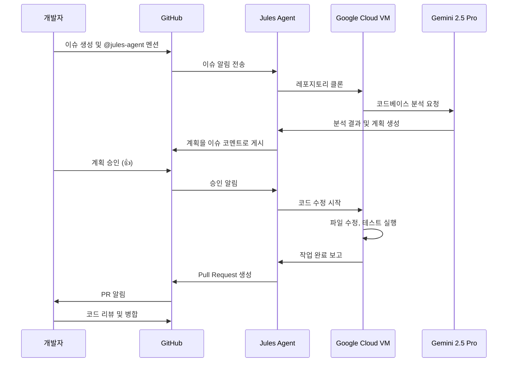

## 개요

개발자라면 누구나 반복적인 버그 수정, 테스트 작성, 의존성 업데이트 같은 작업에 시간을 빼앗긴 경험이 있을 것입니다. Google이 2024년 12월에 출시한 <strong>Jules</strong>는 이러한 문제를 해결하기 위해 설계된 혁신적인 AI 코딩 에이전트입니다.

Jules는 단순한 코드 자동완성 도구가 아닙니다. GitHub 이슈를 할당받으면, 백그라운드에서 자율적으로 코드베이스를 분석하고, 계획을 세우고, 코드를 수정한 후 Pull Request까지 생성하는 <strong>완전 자율 AI 에이전트</strong>입니다.

### 다른 AI 코딩 도구와의 차별점

현재 시장에는 다양한 AI 코딩 도구가 있습니다:

- <strong>GitHub Copilot</strong>: 실시간 코드 자동완성 및 제안
- <strong>Cursor</strong>: AI 기반 IDE로 대화형 코드 편집
- <strong>Claude Code</strong>: 터미널 기반 AI 코딩 어시스턴트

Jules의 핵심 차별점은 <strong>비동기성</strong>입니다. 다른 도구들이 개발자의 IDE에서 실시간으로 작동하는 반면, Jules는 Google Cloud의 격리된 가상 머신에서 독립적으로 작업을 수행합니다. 개발자는 GitHub 이슈를 할당하고 계획을 승인한 후, 다른 일을 하면서 Jules가 작업을 완료하기를 기다릴 수 있습니다.

### 핵심 가치 제안

1. <strong>시간 절약</strong>: 반복적이고 시간 소모적인 작업을 자동화
2. <strong>투명성</strong>: 모든 추론 과정과 계획을 GitHub 이슈 코멘트로 공유
3. <strong>안전성</strong>: 격리된 VM에서 실행되어 로컬 환경에 영향 없음
4. <strong>깊은 이해</strong>: Gemini 2.5 Pro의 200만 토큰 컨텍스트로 전체 코드베이스 분석

## Jules의 핵심 기능

### 1. GitHub 네이티브 통합

Jules는 GitHub와 완벽하게 통합되어 있습니다. 별도의 플러그인이나 설정 없이, GitHub 이슈에 `@jules-agent`를 멘션하거나 이슈를 할당하는 것만으로 작업을 시작할 수 있습니다.

```markdown
<!-- GitHub 이슈 예시 -->
## 버그: 로그인 페이지에서 이메일 검증 실패

@jules-agent 이 버그를 수정해주세요.

<strong>재현 단계</strong>:
1. 로그인 페이지 접속
2. 유효하지 않은 이메일 형식 입력
3. Submit 버튼 클릭

<strong>예상 동작</strong>: 에러 메시지 표시
<strong>실제 동작</strong>: 에러 없이 폼 제출됨
```

### 2. 비동기 워크플로우

Jules의 가장 큰 장점은 백그라운드 실행입니다. 작업을 할당하면:

1. Google Cloud VM에 레포지토리가 클론됩니다
2. Jules가 코드베이스를 분석하고 계획을 생성합니다
3. 개발자가 계획을 검토하고 승인합니다
4. Jules가 자율적으로 코드를 수정하고 테스트합니다
5. 완료되면 Pull Request를 생성합니다

이 모든 과정이 개발자의 로컬 환경과 독립적으로 진행되므로, 다른 작업을 계속할 수 있습니다.

### 3. 투명한 계획 및 추론 과정

Jules는 작업을 시작하기 전에 상세한 계획을 GitHub 이슈 코멘트로 공유합니다:

```markdown
## Jules 계획

<strong>분석 결과</strong>:
- 문제: `LoginForm.tsx`에서 이메일 검증 로직 누락
- 관련 파일: `src/components/LoginForm.tsx`, `src/utils/validation.ts`

<strong>해결 방법</strong>:
1. `validation.ts`에 이메일 검증 함수 추가
2. `LoginForm.tsx`에서 검증 함수 호출
3. 에러 메시지 UI 추가
4. 단위 테스트 작성

<strong>예상 변경 파일</strong>:
- `src/components/LoginForm.tsx` (수정)
- `src/utils/validation.ts` (수정)
- `tests/LoginForm.test.ts` (신규)

승인하시려면 👍 반응을 추가하거나 "승인" 코멘트를 남겨주세요.
```

### 4. 자동 PR 생성

작업이 완료되면 Jules는 자동으로 Pull Request를 생성합니다. PR에는 다음이 포함됩니다:

- 변경 사항에 대한 상세한 설명
- 수정된 파일 목록
- 테스트 결과
- 관련 GitHub 이슈 링크

### 5. Gemini 2.5 Pro 기반 전체 코드베이스 이해

Jules는 Google의 최신 AI 모델인 Gemini 2.5 Pro를 사용합니다. 이 모델은 <strong>200만 토큰</strong>의 컨텍스트 윈도우를 지원하여, 대규모 코드베이스 전체를 한 번에 분석할 수 있습니다.

예를 들어, 10만 줄 이상의 코드베이스에서도 파일 간 의존성, 아키텍처 패턴, 코딩 스타일을 완전히 이해하고 일관된 코드를 생성할 수 있습니다.

## 기술 아키텍처와 작동 원리

Jules의 워크플로우를 다이어그램으로 살펴보겠습니다:



### 상세 단계 설명

#### 1. GitHub 이슈/코멘트로 작업 할당

개발자는 GitHub 이슈에 `@jules-agent`를 멘션하거나, 이슈를 Jules에게 직접 할당합니다. 이슈에는 작업에 대한 명확한 설명이 포함되어야 합니다.

<strong>좋은 예시</strong>:
```markdown
## 기능: 사용자 프로필 이미지 업로드 추가

@jules-agent 다음 요구사항을 구현해주세요:
- 사용자가 프로필 이미지를 업로드할 수 있어야 함
- 이미지는 5MB 이하로 제한
- 지원 형식: JPG, PNG, WebP
- 업로드 후 자동으로 썸네일 생성 (200x200)
```

<strong>나쁜 예시</strong>:
```markdown
프로필 이미지 기능 추가해줘
```

#### 2. Google Cloud VM에 레포 클론

Jules는 격리된 Google Cloud VM 환경에 레포지토리를 클론합니다. 이는 다음과 같은 이점이 있습니다:

- <strong>보안</strong>: 개발자의 로컬 환경과 완전히 분리
- <strong>재현성</strong>: 일관된 실행 환경 보장
- <strong>확장성</strong>: 여러 작업을 병렬로 처리 가능

#### 3. Gemini 2.5 Pro 분석 및 계획 생성

Jules는 Gemini 2.5 Pro에게 전체 코드베이스를 전달하고 다음을 요청합니다:

- 이슈와 관련된 파일 식별
- 코드베이스의 아키텍처 패턴 이해
- 기존 코딩 스타일 분석
- 변경이 필요한 파일 목록 생성
- 단계별 실행 계획 수립

#### 4. 개발자 승인

생성된 계획은 GitHub 이슈 코멘트로 게시됩니다. 개발자는 다음 방법으로 승인할 수 있습니다:

- 코멘트에 👍 이모지 반응 추가
- "승인" 또는 "Approve" 코멘트 작성
- 계획을 수정하고 싶다면 피드백 코멘트 작성

#### 5. 자율 실행 (파일 수정, 테스트)

승인을 받으면 Jules는 계획을 실행합니다:

1. 필요한 파일 수정
2. 새로운 파일 생성 (필요한 경우)
3. 테스트 작성 또는 수정
4. `npm test` 또는 `pytest` 같은 테스트 명령 실행
5. 린트 및 포맷 도구 실행
6. 모든 테스트 통과 확인

#### 6. PR 생성

작업이 완료되면 Jules는 자동으로 Pull Request를 생성합니다:

```markdown
## Pull Request: 사용자 프로필 이미지 업로드 기능 추가

Fixes #123

### 변경 사항
- `ProfileUpload.tsx` 컴포넌트 추가
- 이미지 검증 로직 구현 (`utils/imageValidation.ts`)
- 썸네일 생성 API 엔드포인트 (`/api/thumbnail`)
- 단위 테스트 및 통합 테스트 추가

### 테스트 결과
✅ 모든 테스트 통과 (42/42)
✅ 린트 오류 없음
✅ 타입 체크 통과

### 스크린샷
[이미지 업로드 UI 스크린샷]
```

#### 7. 리뷰 및 병합

개발자는 PR을 리뷰하고, 필요한 경우 추가 수정을 요청할 수 있습니다. Jules는 리뷰 코멘트에 따라 추가 수정을 수행할 수도 있습니다.

## 통합 방법

Jules를 프로젝트에 통합하는 방법은 세 가지가 있습니다.

### 1. GitHub 웹 인터페이스

가장 간단한 방법입니다. GitHub에서 Jules를 설치하고, 이슈에 멘션하거나 할당하기만 하면 됩니다.

<strong>설치 단계</strong>:

1. GitHub 마켓플레이스에서 "Jules AI Agent" 검색
2. 레포지토리에 Jules 앱 설치
3. 권한 승인 (읽기/쓰기 접근)
4. 이슈에 `@jules-agent` 멘션하여 테스트

### 2. Jules Tools CLI

2025년 10월에 출시된 CLI 도구를 사용하면, 터미널에서 직접 Jules 작업을 관리할 수 있습니다.

<strong>설치</strong>:

```bash
# npm을 사용한 전역 설치
npm install -g @google/jules-tools

# yarn 사용
yarn global add @google/jules-tools

# 설치 확인
jules --version
```

<strong>기본 사용법</strong>:

```bash
# 새 작업 생성
jules task create \
  --repo="myorg/myproject" \
  --title="버그 수정: 로그인 검증" \
  --description="이메일 검증 로직 추가"

# 작업 목록 조회
jules task list --repo="myorg/myproject"

# 작업 상태 확인
jules task status --id="task-123"

# 작업 승인
jules task approve --id="task-123"

# 작업 취소
jules task cancel --id="task-123"
```

<strong>고급 사용법</strong>:

```bash
# 설정 파일을 사용한 배치 작업
# jules.config.json:
# {
#   "tasks": [
#     {
#       "title": "테스트 커버리지 80% 달성",
#       "priority": "high",
#       "labels": ["testing"]
#     },
#     {
#       "title": "의존성 업데이트",
#       "priority": "low",
#       "labels": ["maintenance"]
#     }
#   ]
# }

jules batch create --config=jules.config.json

# 자동 승인 모드 (주의: 신뢰할 수 있는 작업에만 사용)
jules task create \
  --repo="myorg/myproject" \
  --title="린트 오류 수정" \
  --auto-approve
```

### 3. Public API (얼리 액세스)

프로그래매틱하게 Jules를 통합하려면 Public API를 사용할 수 있습니다. 현재 얼리 액세스 단계입니다.

<strong>API 예제</strong>:

```typescript
// Jules API 클라이언트 초기화
import { JulesClient } from '@google/jules-api';

const client = new JulesClient({
  apiKey: process.env.JULES_API_KEY,
});

// 작업 생성
const task = await client.tasks.create({
  repository: 'myorg/myproject',
  title: '버그 수정: 로그인 검증',
  description: '이메일 검증 로직 추가',
  assignee: 'jules-agent',
  labels: ['bug', 'high-priority'],
});

console.log(`작업 생성됨: ${task.id}`);

// 작업 상태 모니터링
const statusUpdates = client.tasks.watch(task.id);

for await (const update of statusUpdates) {
  console.log(`상태: ${update.status}`);

  if (update.status === 'plan_ready') {
    console.log('계획:', update.plan);

    // 자동 승인 (또는 수동 검토 후)
    await client.tasks.approve(task.id);
  }

  if (update.status === 'completed') {
    console.log('PR 생성됨:', update.pullRequestUrl);
    break;
  }

  if (update.status === 'failed') {
    console.error('실패:', update.error);
    break;
  }
}
```

<strong>웹훅 설정</strong>:

```typescript
// 웹훅으로 이벤트 수신
app.post('/webhooks/jules', async (req, res) => {
  const event = req.body;

  switch (event.type) {
    case 'task.plan_ready':
      // 계획 검토 로직
      await reviewPlan(event.task);
      break;

    case 'task.completed':
      // PR 자동 리뷰 요청
      await requestReview(event.pullRequest);
      break;

    case 'task.failed':
      // 실패 알림 전송
      await notifyTeam(event.error);
      break;
  }

  res.sendStatus(200);
});
```

## 실전 활용 사례

Jules를 실제 개발 워크플로우에 어떻게 활용할 수 있는지 구체적인 사례를 살펴보겠습니다.

### 1. 버그 트리아지 및 수정

<strong>시나리오</strong>: 프로덕션에서 사용자 로그인 실패 버그가 보고되었습니다.

<strong>기존 워크플로우</strong>:
1. 버그 재현 (30분)
2. 코드베이스에서 관련 파일 찾기 (20분)
3. 원인 분석 (40분)
4. 수정 및 테스트 (1시간)
5. PR 생성 및 리뷰 (30분)

<strong>총 소요 시간</strong>: 약 3시간

<strong>Jules 활용</strong>:

```markdown
## GitHub 이슈 #456: 로그인 실패 버그

<strong>증상</strong>:
- 특정 이메일 형식에서 로그인 실패
- 에러 메시지: "Invalid credentials"
- 재현율: 약 5% 사용자

<strong>재현 단계</strong>:
1. 이메일에 '+' 문자 포함 (예: user+test@example.com)
2. 올바른 비밀번호 입력
3. 로그인 시도

@jules-agent 이 버그를 분석하고 수정해주세요.
```

<strong>Jules의 작업</strong>:
1. 로그인 관련 파일 자동 식별 (`auth.ts`, `validation.ts` 등)
2. '+' 문자 처리 버그 발견 (이메일 검증 정규식 오류)
3. 수정안 제시 및 승인 대기 (10분)
4. 코드 수정 및 테스트 자동 실행 (20분)
5. PR 자동 생성 (5분)

<strong>개발자 소요 시간</strong>: 약 15분 (이슈 작성 + 계획 검토)
<strong>시간 절약</strong>: 약 2시간 45분

### 2. 테스트 커버리지 개선

<strong>시나리오</strong>: 코드 커버리지를 60%에서 80%로 향상시켜야 합니다.

<strong>Jules 활용</strong>:

```markdown
## GitHub 이슈 #789: 테스트 커버리지 80% 달성

@jules-agent 다음 조건으로 테스트 커버리지를 개선해주세요:

<strong>요구사항</strong>:
- 현재 커버리지: 60%
- 목표 커버리지: 80%
- 우선순위: 핵심 비즈니스 로직 (src/services/)

<strong>제약사항</strong>:
- 기존 테스트는 수정하지 말 것
- Jest 프레임워크 사용
- 단위 테스트 우선, 통합 테스트는 필요시에만
```

<strong>Jules의 작업</strong>:
1. 커버리지 리포트 분석 (`npm run test:coverage`)
2. 커버되지 않은 코드 경로 식별
3. 우선순위가 높은 파일부터 테스트 작성
4. 엣지 케이스 및 오류 처리 테스트 추가
5. 커버리지 80% 달성 확인

<strong>결과</strong>:
- 45개의 새로운 테스트 케이스 추가
- 커버리지 60% → 82% 달성
- 개발자 소요 시간: 30분 (계획 검토 + PR 리뷰)
- Jules 작업 시간: 약 2시간 (백그라운드)

### 3. 의존성 업데이트

<strong>시나리오</strong>: 보안 취약점이 발견된 의존성을 업데이트해야 합니다.

<strong>기존 워크플로우의 문제점</strong>:
- Breaking changes 확인 필요
- 코드 수정 필요 여부 불확실
- 테스트 실행 및 검증 시간 소요
- 여러 의존성을 동시에 업데이트하기 어려움

<strong>Jules 활용</strong>:

```markdown
## GitHub 이슈 #1001: 의존성 보안 업데이트

@jules-agent 다음 의존성을 업데이트하고 호환성 문제를 해결해주세요:

<strong>업데이트 목록</strong>:
- axios: 0.27.2 → 1.6.0 (보안 취약점 수정)
- react-router-dom: 6.8.0 → 6.20.0
- typescript: 4.9.0 → 5.3.0

<strong>요구사항</strong>:
- Breaking changes 대응
- 모든 테스트 통과 확인
- 타입 오류 수정
```

<strong>Jules의 작업</strong>:
1. 의존성 업데이트: `npm update`
2. Breaking changes 문서 확인
3. 타입 오류 자동 수정
4. 테스트 실행 및 실패한 테스트 수정
5. 변경 사항 문서화

<strong>PR 예시</strong>:

````markdown
## 의존성 보안 업데이트

### 변경 사항

<strong>axios 0.27.2 → 1.6.0</strong>:
- 보안 취약점 CVE-2023-XXXX 수정
- Breaking change: `AxiosError` 타입 변경
- 영향 받는 파일: `src/api/client.ts` (타입 수정 완료)

<strong>react-router-dom 6.8.0 → 6.20.0</strong>:
- `useNavigate` 옵션 변경
- 영향 받는 파일: `src/components/Navigation.tsx` (업데이트 완료)

<strong>typescript 4.9.0 → 5.3.0</strong>:
- 새로운 타입 체크 규칙 적용
- `tsconfig.json` 업데이트 (strictNullChecks 관련)
- 타입 오류 수정: 12개 파일

### 테스트 결과
✅ 모든 단위 테스트 통과 (156/156)
✅ 통합 테스트 통과 (23/23)
✅ 타입 체크 통과
✅ 빌드 성공

### 보안 스캔
✅ 취약점 0개 (이전: 3개)
````

### 4. 코드 리팩토링

<strong>시나리오</strong>: 레거시 코드를 현대적인 패턴으로 리팩토링해야 합니다.

<strong>Jules 활용</strong>:

```markdown
## GitHub 이슈 #1234: 레거시 클래스 컴포넌트를 함수형 컴포넌트로 변환

@jules-agent 다음 작업을 수행해주세요:

<strong>범위</strong>:
- `src/components/legacy/` 폴더의 모든 클래스 컴포넌트
- 총 15개 파일

<strong>요구사항</strong>:
- React Hooks로 변환 (useState, useEffect 등)
- PropTypes → TypeScript 인터페이스
- 기존 동작 100% 유지 (회귀 버그 없이)
- 테스트 업데이트

<strong>제약사항</strong>:
- 한 번에 3〜5개 파일씩 작업 (PR 크기 제한)
- 각 PR은 독립적으로 병합 가능해야 함
```

<strong>Jules의 전략</strong>:
1. 15개 파일을 3개 배치로 분할
2. 각 배치마다 별도 브랜치 및 PR 생성
3. 순차적으로 작업 진행

<strong>배치 1 PR</strong>:
- `UserProfile.tsx`, `UserSettings.tsx`, `UserAvatar.tsx` 변환
- 테스트 통과 확인
- 독립적으로 병합 가능

<strong>결과</strong>:
- 코드 라인 수 30% 감소
- 성능 향상 (불필요한 렌더링 제거)
- 타입 안전성 개선
- 개발자 소요 시간: 각 PR당 15분 검토 (총 45분)

## 다른 AI 코딩 도구와의 비교

다양한 AI 코딩 도구가 있지만, 각각 최적의 사용 시나리오가 다릅니다. 다음 표를 참고하세요:

| 기능/도구 | Jules | Claude Code | GitHub Copilot | Cursor |
|----------|-------|-------------|----------------|--------|
| <strong>실행 방식</strong> | 비동기 (VM 기반) | 동기 (터미널) | 동기 (IDE) | 동기 (IDE) |
| <strong>주요 사용 사례</strong> | 이슈 자동 해결, PR 생성 | 전체 프로젝트 리팩토링 | 실시간 코드 작성 지원 | 대화형 코드 편집 |
| <strong>GitHub 통합</strong> | ⭐⭐⭐⭐⭐ 네이티브 | ⭐⭐⭐ CLI 기반 | ⭐⭐⭐⭐ 앱 통합 | ⭐⭐ Git 연동 |
| <strong>자율성</strong> | ⭐⭐⭐⭐⭐ 완전 자율 | ⭐⭐⭐⭐ 높은 자율성 | ⭐⭐ 제안 중심 | ⭐⭐⭐ 대화형 |
| <strong>코드베이스 이해</strong> | ⭐⭐⭐⭐⭐ 200만 토큰 | ⭐⭐⭐⭐⭐ 20만 토큰 | ⭐⭐⭐ 파일 수준 | ⭐⭐⭐⭐ 프로젝트 수준 |
| <strong>테스트 자동 실행</strong> | ✅ 자동 | ✅ 자동 | ❌ 수동 | ✅ 자동 |
| <strong>PR 자동 생성</strong> | ✅ 자동 | ✅ 수동 명령 필요 | ❌ 없음 | ❌ 없음 |
| <strong>IDE 필요</strong> | ❌ 불필요 | ❌ 터미널만 | ✅ VSCode 등 | ✅ Cursor IDE |
| <strong>지원 언어</strong> | Python, JS/TS | 대부분 언어 | 대부분 언어 | 대부분 언어 |
| <strong>가격 (월)</strong> | $0〜124.99 | $20 | $10〜39 | $20〜40 |
| <strong>무료 플랜</strong> | ✅ 15 tasks/day | ❌ 없음 | ✅ 제한적 | ✅ 제한적 |

### 각 도구의 최적 사용 시나리오

<strong>Jules를 선택하세요</strong>:
- ✅ GitHub 이슈를 자동으로 해결하고 싶을 때
- ✅ 백그라운드에서 작업을 실행하고 싶을 때
- ✅ 반복적인 버그 수정, 테스트 작성에 시간을 절약하고 싶을 때
- ✅ 팀 전체의 생산성을 높이고 싶을 때
- ❌ 실시간 코드 작성 지원이 필요할 때 (다른 도구 사용)

<strong>Claude Code를 선택하세요</strong>:
- ✅ 터미널 기반 워크플로우를 선호할 때
- ✅ 복잡한 리팩토링이 필요할 때
- ✅ 파일 시스템 전체를 탐색하며 작업할 때
- ✅ Anthropic의 Claude 모델을 선호할 때

<strong>GitHub Copilot을 선택하세요</strong>:
- ✅ 실시간 코드 자동완성이 필요할 때
- ✅ IDE 내에서 모든 작업을 완료하고 싶을 때
- ✅ 개별 함수나 작은 코드 블록을 빠르게 작성할 때
- ✅ 다양한 언어와 프레임워크를 사용할 때

<strong>Cursor를 선택하세요</strong>:
- ✅ 대화형으로 코드를 편집하고 싶을 때
- ✅ AI와 자연어로 소통하며 개발하고 싶을 때
- ✅ 새로운 IDE 환경에 적응할 수 있을 때
- ✅ Cursor의 멀티 파일 편집 기능이 필요할 때

### 도구 조합 전략

최고의 생산성을 위해서는 여러 도구를 조합하는 것이 효과적입니다:

<strong>추천 조합 1: Jules + GitHub Copilot</strong>
- <strong>Jules</strong>: 이슈 해결, 테스트 작성, 리팩토링
- <strong>Copilot</strong>: 실시간 코드 작성, 자동완성
- <strong>장점</strong>: 비동기 작업과 실시간 지원의 조화

<strong>추천 조합 2: Jules + Claude Code</strong>
- <strong>Jules</strong>: GitHub 이슈 기반 자동화
- <strong>Claude Code</strong>: 로컬에서 복잡한 코드 탐색 및 수정
- <strong>장점</strong>: 두 가지 모두 자율적이며 강력한 코드베이스 이해

<strong>추천 조합 3: Jules + Cursor</strong>
- <strong>Jules</strong>: 백그라운드 자동화 (버그 수정, 테스트)
- <strong>Cursor</strong>: 대화형 기능 개발
- <strong>장점</strong>: 루틴 작업 자동화 + 창의적 개발 지원

## 가격 및 이용 가능성

Jules는 2024년 12월부터 Google AI Studio를 통해 제공되며, 세 가지 요금제가 있습니다.

### 요금제 비교

| 플랜 | 가격 (월) | 작업 한도 | 최적 사용자 |
|------|----------|----------|------------|
| <strong>Free</strong> | $0 | 15 tasks/day | 개인 개발자, 소규모 프로젝트 |
| <strong>Pro</strong> | $19.99 | 75 tasks/day | 전문 개발자, 스타트업 |
| <strong>Ultra</strong> | $124.99 | 300 tasks/day | 팀, 기업 |

### 작업 한도 계산 예시

<strong>시나리오: 3명의 개발자 팀</strong>

<strong>일일 작업</strong>:
- 버그 수정: 5개
- 테스트 작성: 3개
- 의존성 업데이트: 1개
- 리팩토링: 2개
- <strong>총</strong>: 11 tasks/day

<strong>추천 플랜</strong>:
- <strong>Free 플랜</strong>: 가능 (15 tasks/day)
- 여유분: 4 tasks/day
- <strong>비용</strong>: $0/월

<strong>시나리오: 10명의 개발자 팀</strong>

<strong>일일 작업</strong>:
- 버그 수정: 15개
- 테스트 작성: 10개
- 의존성 업데이트: 3개
- 리팩토링: 5개
- 기능 개발 지원: 10개
- <strong>총</strong>: 43 tasks/day

<strong>추천 플랜</strong>:
- <strong>Pro 플랜</strong>: 적합 (75 tasks/day)
- 여유분: 32 tasks/day
- <strong>비용</strong>: $19.99/월 (팀 전체)

### 비용 효율성 분석

<strong>개발자 시간 절약 계산</strong>:

가정:
- 개발자 시급: $50
- Jules가 작업당 평균 2시간 절약
- Pro 플랜: 75 tasks/day

<strong>월간 절약</strong>:
- 일일 작업: 30개 (여유있게)
- 일일 절약 시간: 30 tasks × 2시간 = 60시간
- 월간 절약 시간: 60시간 × 22일 = 1,320시간
- <strong>월간 비용 절약</strong>: 1,320시간 × $50 = $66,000
- <strong>Jules 비용</strong>: $19.99
- <strong>순 절약</strong>: $65,980.01

물론 모든 작업을 Jules에게 맡길 수는 없지만, 반복적인 작업만으로도 상당한 ROI를 얻을 수 있습니다.

### 무료 플랜의 전략적 활용

하루 15개 작업 제한이 있지만, 다음 전략으로 최대한 활용할 수 있습니다:

1. <strong>우선순위 작업</strong>: 가장 반복적이고 시간 소모적인 작업부터
2. <strong>배치 작업</strong>: 여러 버그를 하나의 작업으로 묶기
3. <strong>자동화 패턴</strong>: 자주 반복되는 작업은 Jules에게 학습시키기
4. <strong>시간대 분산</strong>: 팀원들이 각자의 시간대에 작업 할당

## 제한사항 및 고려사항

Jules는 강력하지만, 다음과 같은 제한사항이 있습니다.

### 1. 현재 지원 언어

<strong>완전 지원</strong>:
- ✅ Python (3.8+)
- ✅ JavaScript / TypeScript (Node.js 16+, React, Vue, Angular)

<strong>부분 지원</strong> (베타):
- ⚠️ Go (간단한 작업만)
- ⚠️ Rust (기본 기능만)
- ⚠️ Java (Spring Boot 한정)

<strong>미지원</strong>:
- ❌ C/C++
- ❌ Ruby
- ❌ PHP
- ❌ Swift / Objective-C
- ❌ Kotlin

**대응 방법**:
- 다국어 프로젝트의 경우, Python/TypeScript 부분만 Jules 활용
- 다른 언어는 Claude Code나 Copilot 사용

### 2. 영어 전용 인터페이스

현재 Jules는 영어 인터페이스만 제공하며, GitHub 이슈도 영어로 작성하는 것이 권장됩니다.

<strong>한국어 이슈 예시</strong>:

```markdown
## 버그: 로그인 실패

@jules-agent 이 버그를 수정해주세요.
```

Jules는 한국어를 이해할 수 있지만, 응답은 영어로 제공됩니다:

```markdown
## Plan

<strong>Analysis</strong>:
I've identified the issue in the login validation logic...

<strong>Proposed Solution</strong>:
1. Fix email validation regex
2. Add error message display
...
```

<strong>권장 사항</strong>:
- 이슈 제목과 주요 설명은 영어로 작성
- 상세 설명은 한국어 가능
- 코드 코멘트는 기존 프로젝트 스타일 유지

### 3. 비동기 지연 시간

Jules는 백그라운드에서 작동하므로, 즉각적인 피드백이 필요한 경우에는 적합하지 않습니다.

<strong>일반적인 작업 시간</strong>:
- 계획 생성: 5〜15분
- 간단한 버그 수정: 15〜30분
- 테스트 작성: 30분〜1시간
- 복잡한 리팩토링: 1〜3시간

<strong>대응 방법</strong>:
- 긴급한 버그는 직접 수정
- 반복적이고 긴급하지 않은 작업을 Jules에게 할당
- 여러 작업을 배치로 할당하여 대기 시간 활용

### 4. GitHub 전용

Jules는 GitHub와 긴밀하게 통합되어 있어, 다른 플랫폼에서는 사용할 수 없습니다.

<strong>지원</strong>:
- ✅ GitHub.com
- ✅ GitHub Enterprise Cloud
- ❌ GitLab
- ❌ Bitbucket
- ❌ Azure DevOps

<strong>대응 방법</strong>:
- GitHub 미러 레포지토리 생성
- Jules로 작업 후 다른 플랫폼에 동기화
- 또는 다른 AI 도구 사용 (Claude Code는 플랫폼 무관)

### 5. 복잡한 의사결정 한계

Jules는 명확한 작업에 최적화되어 있으며, 다음과 같은 경우에는 어려움을 겪을 수 있습니다:

<strong>어려운 작업</strong>:
- ❌ 아키텍처 설계 결정 (예: "마이크로서비스 vs 모놀리스")
- ❌ 비즈니스 로직 설계 (예: "결제 시스템 설계")
- ❌ 창의적인 UI/UX 디자인
- ❌ 모호한 요구사항 (예: "더 나은 성능")

<strong>적합한 작업</strong>:
- ✅ 명확한 버그 수정
- ✅ 테스트 작성 (기존 코드 기반)
- ✅ 코드 스타일 통일
- ✅ 의존성 업데이트
- ✅ 문서화

## 베스트 프랙티스

Jules를 효과적으로 활용하기 위한 베스트 프랙티스를 소개합니다.

### 1. 명확한 GitHub 이슈 작성법

<strong>좋은 이슈 예시</strong>:

```markdown
## Bug: Email validation fails for addresses with plus sign

<strong>Current Behavior</strong>:
Users cannot log in when their email contains a '+' character
(e.g., user+test@example.com)

<strong>Expected Behavior</strong>:
All valid email formats should be accepted according to RFC 5322

<strong>Steps to Reproduce</strong>:
1. Navigate to /login
2. Enter email: user+test@example.com
3. Enter valid password
4. Click "Login"
5. Observe error: "Invalid email format"

<strong>Technical Context</strong>:
- Affected file: src/utils/validation.ts (suspected)
- Current regex: /^[a-zA-Z0-9._-]+@[a-zA-Z0-9.-]+\.[a-zA-Z]{2,6}$/
- Issue: Missing '+' in allowed characters

<strong>Acceptance Criteria</strong>:
- [ ] Email validation accepts '+' character
- [ ] Existing tests still pass
- [ ] New test case added for '+' character
- [ ] No regression in other validation logic

@jules-agent Please fix this bug and add appropriate tests.
```

<strong>나쁜 이슈 예시</strong>:

```markdown
로그인 안 됨

@jules-agent 고쳐줘
```

<strong>핵심 요소</strong>:
1. <strong>명확한 제목</strong>: 문제를 한 문장으로 요약
2. <strong>현재 동작 vs 예상 동작</strong>: 무엇이 잘못되었는지 명확히
3. <strong>재현 단계</strong>: Jules가 문제를 이해할 수 있도록
4. <strong>기술적 컨텍스트</strong>: 관련 파일이나 함수 힌트
5. <strong>승인 기준</strong>: 완료 조건 명시

### 2. 계획 검토 및 승인 프로세스

Jules가 제시한 계획을 검토할 때 확인해야 할 사항:

<strong>체크리스트</strong>:
```markdown
## 계획 검토 체크리스트

- [ ] <strong>범위</strong>: 필요한 파일만 수정하는가?
- [ ] <strong>접근 방법</strong>: 해결 방법이 적절한가?
- [ ] <strong>부작용</strong>: 다른 기능에 영향을 줄 가능성은?
- [ ] <strong>테스트</strong>: 충분한 테스트 케이스가 포함되었는가?
- [ ] <strong>성능</strong>: 성능에 부정적 영향은 없는가?
- [ ] <strong>보안</strong>: 보안 취약점을 도입하지 않는가?
```

<strong>피드백 제공 예시</strong>:

```markdown
@jules-agent 계획을 검토했습니다. 다음 사항을 수정해주세요:

1. <strong>범위 조정</strong>: `validation.ts` 외에도 `auth.ts`의 이메일 검증 로직도 함께 수정 필요
2. <strong>테스트 추가</strong>: 다양한 이메일 형식 테스트 케이스 추가 (RFC 5322 표준)
   - user+tag@example.com
   - user.name+tag@example.co.uk
   - user@subdomain.example.com
3. <strong>문서화</strong>: README에 지원되는 이메일 형식 명시

수정된 계획을 제출해주세요.
```

### 3. CI/CD 파이프라인 통합

Jules를 CI/CD 파이프라인에 통합하면 더욱 강력한 자동화가 가능합니다.

<strong>GitHub Actions 예시</strong>:

```yaml
# .github/workflows/jules-automation.yml
name: Jules Automated Tasks

on:
  schedule:
    # 매일 오전 9시에 실행
    - cron: '0 9 * * *'
  workflow_dispatch: # 수동 실행 가능

jobs:
  dependency-updates:
    runs-on: ubuntu-latest
    steps:
      - name: Check for outdated dependencies
        id: outdated
        run: |
          npm outdated --json > outdated.json || true
          echo "count=$(jq 'length' outdated.json)" >> $GITHUB_OUTPUT

      - name: Create Jules task for updates
        if: steps.outdated.outputs.count > 0
        uses: actions/github-script@v7
        with:
          script: |
            const outdated = require('./outdated.json');
            const packages = Object.keys(outdated).slice(0, 5); // 상위 5개만

            await github.rest.issues.create({
              owner: context.repo.owner,
              repo: context.repo.repo,
              title: `Automated dependency updates: ${new Date().toISOString().split('T')[0]}`,
              body: `@jules-agent Please update the following dependencies:\n\n${packages.map(p => `- ${p}: ${outdated[p].current} → ${outdated[p].latest}`).join('\n')}\n\n**Requirements**:\n- Fix any breaking changes\n- Ensure all tests pass\n- Update TypeScript types if needed`,
              labels: ['dependencies', 'automated', 'jules']
            });

  test-coverage:
    runs-on: ubuntu-latest
    steps:
      - uses: actions/checkout@v4

      - name: Check test coverage
        id: coverage
        run: |
          npm test -- --coverage --coverageReporters=json-summary
          COVERAGE=$(jq '.total.lines.pct' coverage/coverage-summary.json)
          echo "coverage=$COVERAGE" >> $GITHUB_OUTPUT

      - name: Create Jules task if coverage is low
        if: steps.coverage.outputs.coverage < 80
        uses: actions/github-script@v7
        with:
          script: |
            await github.rest.issues.create({
              owner: context.repo.owner,
              repo: context.repo.repo,
              title: 'Improve test coverage to 80%',
              body: `@jules-agent Current coverage is ${process.env.COVERAGE}%. Please improve it to 80%.\n\n**Priority**: Focus on:\n- src/services/ (business logic)\n- src/utils/ (utility functions)\n\n**Requirements**:\n- Write unit tests using Jest\n- Do not modify existing tests\n- Ensure all new tests pass`,
              labels: ['testing', 'automated', 'jules']
            });
          env:
            COVERAGE: ${{ steps.coverage.outputs.coverage }}
```

### 4. 배치 작업 최적화

여러 작업을 효율적으로 처리하는 전략:

<strong>전략 1: 관련 작업 그룹화</strong>

```markdown
## 버그 수정 배치 #1 (로그인 관련)

@jules-agent 다음 버그들을 함께 수정해주세요:

1. Email validation with '+' character (#456)
2. Password reset link expiration (#478)
3. OAuth callback error handling (#492)

모두 `src/auth/` 디렉토리와 관련되어 있으므로, 하나의 PR로 처리해주세요.
```

<strong>전략 2: 우선순위 기반 할당</strong>

```bash
# jules.config.json
{
  "tasks": [
    {
      "title": "Critical: Security vulnerability in auth",
      "priority": "critical",
      "auto_approve": false
    },
    {
      "title": "High: Performance issue in dashboard",
      "priority": "high",
      "auto_approve": false
    },
    {
      "title": "Medium: Improve error messages",
      "priority": "medium",
      "auto_approve": true
    },
    {
      "title": "Low: Update code comments",
      "priority": "low",
      "auto_approve": true
    }
  ]
}
```

<strong>전략 3: 시간대별 분산</strong>

```markdown
<!-- 아침: 빠른 작업 (15분 이내) -->
- Lint 오류 수정
- 타입 오류 수정
- 코드 포맷팅

<!-- 오후: 중간 작업 (30분〜1시간) -->
- 버그 수정
- 테스트 작성
- 문서 업데이트

<!-- 저녁: 긴 작업 (1시간 이상) -->
- 리팩토링
- 의존성 업데이트
- 테스트 커버리지 개선
```

## 결론

### Jules를 언제 사용해야 하는가

Jules는 다음과 같은 상황에서 가장 효과적입니다:

<strong>✅ 이상적인 사용 사례</strong>:
1. <strong>반복적인 버그 수정</strong>: 비슷한 패턴의 버그가 자주 발생하는 경우
2. <strong>테스트 작성</strong>: 커버리지 향상이 필요한 경우
3. <strong>의존성 관리</strong>: 정기적인 업데이트가 필요한 경우
4. <strong>코드 유지보수</strong>: 린트 오류, 타입 오류, 포맷팅 등
5. <strong>문서화</strong>: 코드 코멘트, README 업데이트
6. <strong>리팩토링</strong>: 명확한 목표가 있는 코드 개선

<strong>❌ 적합하지 않은 사용 사례</strong>:
1. <strong>긴급한 핫픽스</strong>: 즉각적인 수정이 필요한 경우
2. <strong>복잡한 설계</strong>: 아키텍처 결정이 필요한 경우
3. <strong>창의적 개발</strong>: 새로운 기능의 UX/UI 디자인
4. <strong>모호한 요구사항</strong>: 명확한 목표가 없는 경우
5. <strong>실시간 협업</strong>: 페어 프로그래밍이 필요한 경우

### 다른 도구와의 조합 전략

최대 효율을 위한 권장 조합:

<strong>소규모 팀 (1〜3명)</strong>:
- <strong>Jules Free</strong>: 반복 작업 자동화
- <strong>GitHub Copilot</strong>: 실시간 코드 작성
- <strong>총 비용</strong>: $10/월 (Copilot만)

<strong>중규모 팀 (4〜10명)</strong>:
- <strong>Jules Pro</strong>: 백그라운드 자동화
- <strong>Cursor</strong>: 대화형 개발
- <strong>총 비용</strong>: $19.99 + ($20 × 팀원 수)

<strong>대규모 팀 (10명 이상)</strong>:
- <strong>Jules Ultra</strong>: 대량 작업 처리
- <strong>Claude Code</strong>: 복잡한 리팩토링
- <strong>GitHub Copilot Enterprise</strong>: 팀 전체 실시간 지원
- <strong>총 비용</strong>: $124.99 + ($39 × 팀원 수)

### 향후 전망

Jules는 현재도 강력하지만, Google은 다음 기능들을 개발 중입니다:

<strong>2025년 로드맵</strong>:
1. <strong>더 많은 언어 지원</strong>: Go, Rust, Java 완전 지원
2. <strong>다국어 인터페이스</strong>: 한국어, 일본어, 중국어 등
3. <strong>GitLab/Bitbucket 지원</strong>: GitHub 이외 플랫폼 통합
4. <strong>IDE 플러그인</strong>: VSCode, IntelliJ 직접 통합
5. <strong>고급 분석</strong>: 코드 품질, 보안 취약점 자동 탐지
6. <strong>팀 협업 기능</strong>: 작업 할당, 우선순위 관리 개선

<strong>장기 비전</strong>:
- <strong>완전 자율 개발 팀</strong>: Jules가 주니어 개발자 역할 수행
- <strong>AI 코드 리뷰</strong>: PR 자동 리뷰 및 피드백
- <strong>예측적 유지보수</strong>: 버그 발생 전 예방
- <strong>지식 공유</strong>: 팀의 코딩 패턴 학습 및 전파

### 시작하기

Jules를 시작하려면:

1. **Google AI Studio** 방문 (ai.google.dev)
2. **GitHub 계정 연결**
3. **레포지토리에 Jules 설치**
4. **첫 번째 이슈 생성 및 @jules-agent 멘션**
5. **계획 검토 후 승인**
6. **PR 리뷰 및 병합**

무료 플랜으로 시작하여, 팀의 워크플로우에 맞는지 테스트한 후 업그레이드하는 것을 권장합니다.

---

Jules는 개발자의 생산성을 혁신적으로 향상시킬 수 있는 도구입니다. 반복적인 작업을 자동화하고, 더 창의적이고 가치 있는 작업에 집중할 수 있도록 도와줍니다. 지금 바로 시작해보세요!
