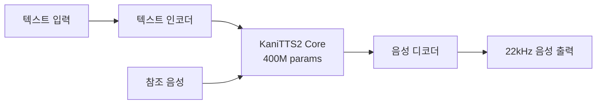

## 개요

음성 합성(TTS) 기술은 그동안 대규모 모델과 고성능 GPU를 필요로 했습니다. 하지만 <strong>KaniTTS2</strong>의 등장으로 이러한 진입 장벽이 크게 낮아졌습니다. 불과 <strong>4억 개(400M)의 파라미터</strong>와 <strong>3GB VRAM</strong>만으로 실시간 보이스 클로닝이 가능한 이 모델은, 음성 AI 민주화의 최신 사례로 주목받고 있습니다.

nineninesix-ai 팀이 Apache 2.0 라이선스로 공개한 이 프로젝트는 사전학습(pretrain) 코드까지 완전히 공개하여, 누구나 자신만의 TTS 모델을 처음부터 학습할 수 있는 환경을 제공합니다.

## KaniTTS2 핵심 스펙

| 항목 | 사양 |
|------|------|
| 파라미터 수 | 400M (BF16) |
| 샘플레이트 | 22kHz |
| GPU VRAM | 3GB |
| RTF (Real-Time Factor) | ~0.2 (RTX 5090 기준) |
| 학습 데이터 | ~10,000시간 음성 데이터 |
| 학습 시간 | 8x H100에서 6시간 |
| 지원 언어 | 영어, 스페인어 (추가 언어 확장 예정) |
| 라이선스 | Apache 2.0 |

<strong>RTF(Real-Time Factor) 0.2</strong>란 1초의 음성을 생성하는 데 0.2초밖에 걸리지 않는다는 의미로, 실시간 대화형 사용에 충분한 성능입니다.

## 왜 KaniTTS2가 중요한가

### 1. 극단적 경량화

기존의 고품질 TTS 모델들은 수십억 개의 파라미터와 10GB 이상의 VRAM을 요구하는 경우가 많았습니다. KaniTTS2는 400M 파라미터로 이를 달성하여, <strong>소비자급 GPU(RTX 3060 수준)</strong>에서도 동작할 수 있습니다.

### 2. 완전한 오픈소스 사전학습 프레임워크

모델 가중치뿐만 아니라 <strong>사전학습 코드 전체</strong>가 공개되었습니다. 이는 다음과 같은 가능성을 열어줍니다:

- 소수 언어(underrepresented languages)를 위한 TTS 모델 학습
- 특정 도메인(의료, 법률 등)에 특화된 음성 모델 구축
- 특정 악센트나 방언에 맞춘 커스터마이징

### 3. 보이스 클로닝 내장

별도의 파인튜닝 없이도 <strong>보이스 클로닝</strong> 기능이 내장되어 있어, 참조 음성 샘플만 있으면 해당 화자의 목소리로 텍스트를 음성으로 변환할 수 있습니다.

## 아키텍처와 학습 과정



학습은 약 10,000시간의 음성 데이터를 사용하여, <strong>8대의 H100 GPU에서 단 6시간</strong>만에 완료됩니다. 이는 대규모 TTS 모델의 학습이 수일에서 수주가 걸리는 것과 비교하면 매우 효율적입니다.

## 시작하기

### HuggingFace에서 모델 다운로드

KaniTTS2는 두 가지 모델을 제공합니다:

- <strong>다국어 모델 (Pretrained)</strong>: 영어, 스페인어 지원
- <strong>영어 전용 모델</strong>: 로컬 악센트까지 지원하는 영어 특화 모델

```bash
# HuggingFace에서 모델 다운로드
# 다국어 모델
git clone https://huggingface.co/nineninesix/kani-tts-2-pt

# 영어 전용 모델
git clone https://huggingface.co/nineninesix/kani-tts-2-en
```

### HuggingFace Spaces에서 데모 체험

직접 설치하지 않고도 브라우저에서 바로 체험할 수 있습니다:

- 다국어 모델: [HF Spaces (Pretrained)](https://huggingface.co/spaces/nineninesix/kani-tts-2-pt)
- 영어 모델: [HF Spaces (English)](https://huggingface.co/spaces/nineninesix/kanitts-2-en)

### 자체 모델 학습하기

사전학습 코드를 활용하면 자신만의 TTS 모델을 처음부터 학습할 수 있습니다:

```bash
# 사전학습 코드 클론
git clone https://github.com/nineninesix-ai/kani-tts-2-pretrain
cd kani-tts-2-pretrain

# 환경 설정 및 학습 시작
# 상세 가이드는 리포지토리의 README를 참조하세요
```

## 경량 TTS 모델 비교

최근 로컬에서 실행 가능한 TTS 모델들이 속속 등장하고 있습니다:

| 모델 | 파라미터 | VRAM | 보이스 클로닝 | 오픈소스 학습코드 |
|------|----------|------|:---:|:---:|
| <strong>KaniTTS2</strong> | 400M | 3GB | ✅ | ✅ |
| Bark | ~1B | 6GB+ | ✅ | ❌ |
| XTTS v2 | ~500M | 4GB+ | ✅ | 부분적 |
| Piper | ~60M | <1GB | ❌ | ✅ |

KaniTTS2의 차별점은 <strong>보이스 클로닝과 완전한 사전학습 코드</strong>를 동시에 제공하면서도 경량 모델을 유지한다는 점입니다.

## 음성 AI 민주화의 의미

KaniTTS2의 공개는 단순한 모델 릴리스를 넘어서, 음성 AI 민주화의 중요한 이정표입니다:

1. <strong>소수 언어 지원</strong>: 사전학습 코드 공개로 소수 언어 커뮤니티가 자체 TTS 모델을 구축할 수 있습니다
2. <strong>비용 장벽 제거</strong>: 3GB VRAM이면 충분하므로, 고가의 GPU 없이도 보이스 클로닝이 가능합니다
3. <strong>연구 가속화</strong>: 완전한 학습 파이프라인 공개는 TTS 연구의 재현성과 발전 속도를 높입니다
4. <strong>개인 프라이버시</strong>: 클라우드 API 대신 로컬에서 실행할 수 있어 음성 데이터의 프라이버시를 보장합니다

## 결론

KaniTTS2는 <strong>"작지만 강한"</strong> 모델의 전형을 보여줍니다. 400M 파라미터로 보이스 클로닝까지 가능한 이 모델은, 대형 모델만이 고품질 음성 합성을 제공할 수 있다는 통념에 도전합니다.

특히 사전학습 코드의 완전 공개는 음성 AI 생태계 전체에 긍정적인 영향을 줄 것으로 예상됩니다. 소수 언어 지원, 특정 도메인 최적화, 그리고 개인화된 음성 비서 구축 등 다양한 활용 사례가 기대됩니다.

로컬 AI가 갈수록 강력해지는 지금, KaniTTS2는 음성 AI 분야에서도 <strong>"로컬 퍼스트"</strong>가 현실이 되고 있음을 증명합니다.

## 참고 자료

- [KaniTTS2 Pretrained Model (HuggingFace)](https://huggingface.co/nineninesix/kani-tts-2-pt)
- [KaniTTS2 English Model (HuggingFace)](https://huggingface.co/nineninesix/kani-tts-2-en)
- [KaniTTS2 Pretrain Code (GitHub)](https://github.com/nineninesix-ai/kani-tts-2-pretrain)
- [Reddit: KaniTTS2 Discussion (r/LocalLLaMA)](https://www.reddit.com/r/LocalLLaMA/comments/1r4sivv/kanitts2_opensource_400m_tts_model_with_voice/)
