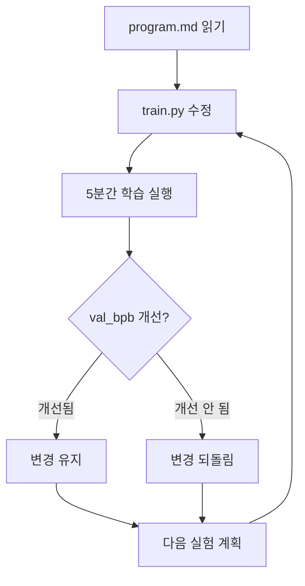

## 개요

2026년 3월, Andrej Karpathy(전 Tesla AI 디렉터, OpenAI 공동창업자)가 [autoresearch](https://github.com/karpathy/autoresearch)를 오픈소스로 공개했습니다. 이 프로젝트의 핵심은 간단합니다 — <strong>AI 에이전트에게 GPU 하나와 학습 코드를 주고, 밤새 자율적으로 실험하게 하는 것</strong>입니다.

에이전트는 코드를 수정하고, 5분간 학습을 돌리고, 결과를 평가하고, 개선되었으면 유지하고 아니면 되돌립니다. 이 사이클이 시간당 약 12회, 하룻밤이면 약 100회 반복됩니다. 공개 직후 GitHub에서 8,000개 이상의 스타를 받았고, 3월 8〜9일 밤에는 Hyperspace 네트워크에서 35개 에이전트가 333개 실험을 완전 무인으로 수행했습니다.

이 글에서는 autoresearch의 아키텍처와 동작 원리를 분석하고, Engineering Manager 관점에서 R&D 팀에 어떤 영향을 줄 수 있는지 살펴봅니다.

## autoresearch의 설계 철학

Karpathy의 설계 철학은 <strong>"하나의 GPU, 하나의 파일, 하나의 메트릭"</strong>으로 요약됩니다.

### 왜 630줄인가?

autoresearch의 전체 학습 코드(`train.py`)는 약 630줄입니다. 이는 의도적인 제약입니다:

- 현대 LLM의 컨텍스트 윈도우(128K+ 토큰)에 전체 코드가 들어감
- 에이전트가 코드 전체를 "이해"한 상태에서 수정 가능
- 수정 범위가 제한되어 디버깅과 변경 추적이 용이

```python
# train.py — 에이전트가 수정하는 유일한 파일
# GPT 모델 정의, Muon + AdamW 옵티마이저, 학습 루프를 모두 포함
# 약 630줄로 구성 — LLM 컨텍스트 윈도우에 완전히 수용 가능
```

### 핵심 파일 구조

```
autoresearch/
├── prepare.py    # 데이터 준비 (1회 실행) — 토크나이저 학습, 데이터 로딩
├── train.py      # 학습 코드 — 에이전트가 수정하는 유일한 파일
└── program.md    # 에이전트 지시문 — 사람이 작성하는 "연구 방향서"
```

각 파일의 역할이 명확하게 분리되어 있습니다:

- <strong>prepare.py</strong>: 데이터셋 다운로드, BPE 토크나이저 학습, 데이터 로딩 유틸리티. 사람도 에이전트도 수정하지 않는 고정 인프라
- <strong>train.py</strong>: GPT 모델 전체, 옵티마이저(Muon + AdamW), 학습 루프. 에이전트가 수정하는 유일한 파일
- <strong>program.md</strong>: 사람이 작성하는 마크다운 지시문. 에이전트의 연구 방향을 결정하는 "연구 방향서"

## 에이전트 실험 루프

autoresearch의 자율 실험 사이클은 다음과 같이 동작합니다:



### 5분 고정 시간 예산

모든 실험은 정확히 5분간 실행됩니다. 이 제약이 핵심입니다:

- 아키텍처를 바꾸든, 하이퍼파라미터를 조정하든 동일한 시간 예산
- 실험 간 공정한 비교가 가능
- 시간당 12개 실험 × 8시간 = 하룻밤에 약 100개 실험

### 평가 메트릭: val_bpb

<strong>val_bpb</strong>(validation bits per byte)는 어휘 크기에 독립적인 평가 지표입니다. 토크나이저를 변경하거나 아키텍처를 완전히 바꿔도 일관된 비교가 가능합니다. 값이 낮을수록 더 좋은 성능을 의미합니다.

## EM 관점: R&D 팀에 주는 시사점

Engineering Manager로서 autoresearch를 보면, 단순한 "재미있는 프로젝트"를 넘어서는 구조적 변화의 신호가 보입니다.

### 1. 반복 작업의 자동화, 사고의 자동화가 아님

autoresearch가 자동화하는 것은 <strong>"수정→학습→평가"의 반복 루프</strong>입니다. 연구자가 여전히 해야 하는 일은:

- `program.md`에 실험 방향을 설정하는 것
- 결과를 해석하고 다음 연구 방향을 결정하는 것
- 성공한 실험에서 인사이트를 추출하는 것

이것은 <strong>"반복의 자동화"</strong>이지 <strong>"사고의 자동화"</strong>가 아닙니다. EM이 팀원에게 전달해야 할 핵심 메시지이기도 합니다.

### 2. 연구 생산성의 재정의

기존 ML 연구 워크플로우와 비교해보겠습니다:

| 항목 | 기존 방식 | autoresearch |
|------|----------|--------------|
| 실험 실행 | 수동 (코드 수정 → 학습 → 대기) | 자동 (에이전트가 연속 실행) |
| 하루 실험 횟수 | 3〜5개 | 100개+ |
| 연구자 역할 | 실행 + 분석 | 방향 설정 + 분석 |
| 야간/주말 활용 | 장시간 학습 1건 | 단기 실험 100건 |
| 실패 비용 | 시간 낭비 (수시간) | 5분 (자동 롤백) |

### 3. 팀 도입 시 고려사항

autoresearch를 R&D 팀에 도입한다면 다음을 고려해야 합니다:

<strong>기술적 요구사항</strong>:
- NVIDIA GPU 1대 (H100 기준 검증됨)
- Python 3.10+, PyTorch
- `uv` 패키지 매니저

<strong>조직적 고려사항</strong>:
- `program.md` 작성 능력이 곧 연구 역량 — 좋은 지시문을 쓸 수 있는 시니어 연구원이 필요
- 실험 결과 해석과 다음 방향 설정은 여전히 사람의 몫
- "밤새 100개 실험"이 항상 "더 좋은 연구"를 의미하지는 않음

## 실전 활용 가이드

### 기본 설정 (5분 안에 시작)

```bash
# 1. 저장소 클론 및 의존성 설치
git clone https://github.com/karpathy/autoresearch.git
cd autoresearch
uv sync

# 2. 데이터 준비 (약 2분)
uv run prepare.py

# 3. 수동 테스트 (GPU 동작 확인)
uv run train.py
```

### program.md 작성 예시

`program.md`는 에이전트의 연구 방향을 결정하는 핵심 파일입니다. 좋은 지시문의 예시:

```markdown
# Research Direction

## Goal
Reduce val_bpb by optimizing the attention mechanism.

## Constraints
- Do not change the tokenizer or vocabulary size
- Keep total training time under 5 minutes
- Maintain model parameter count within 2x of baseline

## Suggested Experiments
1. Try multi-head attention with different head counts
2. Experiment with rotary position embeddings
3. Test grouped query attention (GQA)
```

### 결과 분석

밤새 실행 후 에이전트가 남긴 로그를 분석합니다. 각 실험에서의 val_bpb 변화, 적용된 변경사항, 성공/실패 여부를 확인할 수 있습니다.

## 더 넓은 맥락: AI 연구의 자동화 트렌드

autoresearch는 독립적인 현상이 아닙니다. 2026년 초 AI 업계에서 나타나는 <strong>"AI가 AI를 연구하는"</strong> 트렌드의 일부입니다:

- <strong>Anthropic Code Review</strong>: 멀티 에이전트 시스템이 AI 생성 코드를 자동 분석하고 로직 오류를 감지
- <strong>OpenAI의 자동화된 레드팀</strong>: AI 모델이 다른 AI 모델의 취약점을 자동으로 탐색
- <strong>Google의 AutoML 진화</strong>: 신경망 아키텍처 자체를 AI가 설계

autoresearch의 차별점은 <strong>접근성</strong>입니다. H100 한 대와 630줄의 코드만으로 누구나 이 패러다임을 경험할 수 있습니다. 이것이 8,000개 이상의 GitHub 스타를 빠르게 모은 이유이기도 합니다.

## 결론

Karpathy의 autoresearch는 ML 연구의 "반복 실행" 부분을 에이전트에게 위임하는 실용적인 프레임워크입니다. 630줄이라는 의도적 제약, 5분 고정 시간 예산, 단일 메트릭 비교 등 설계 철학이 명확합니다.

EM/VPoE 관점에서 주목할 점은:

1. <strong>연구 생산성 정의의 변화</strong>: "하루에 몇 개 실험을 돌렸는가"에서 "얼마나 좋은 실험 방향을 설정했는가"로
2. <strong>시니어 연구원의 역할 변화</strong>: 직접 실험을 돌리는 사람에서 에이전트의 연구 방향을 설계하는 사람으로
3. <strong>GPU 유휴 시간의 가치</strong>: 야간/주말의 GPU 유휴 시간이 100개 실험의 기회로 전환

"밤새 100개 실험"이라는 수치 자체보다, <strong>연구자의 역할이 "실행"에서 "방향 설정"으로 이동</strong>하고 있다는 구조적 변화에 주목해야 합니다.

## 참고 자료

- [karpathy/autoresearch (GitHub)](https://github.com/karpathy/autoresearch)
- [Andrej Karpathy Open-Sources 'Autoresearch' (MarkTechPost)](https://www.marktechpost.com/2026/03/08/andrej-karpathy-open-sources-autoresearch-a-630-line-python-tool-letting-ai-agents-run-autonomous-ml-experiments-on-single-gpus/)
- [Karpathy Just Turned One GPU Into a Research Lab (Garry's List)](https://garryslist.org/posts/karpathy-just-turned-one-gpu-into-a-research-lab-f55754a6)
- [Autoresearch: Karpathy's Overnight AI Researcher (Top AI Product)](https://topaiproduct.com/2026/03/07/autoresearch-karpathys-overnight-ai-researcher-that-runs-100-experiments-while-you-sleep/)
