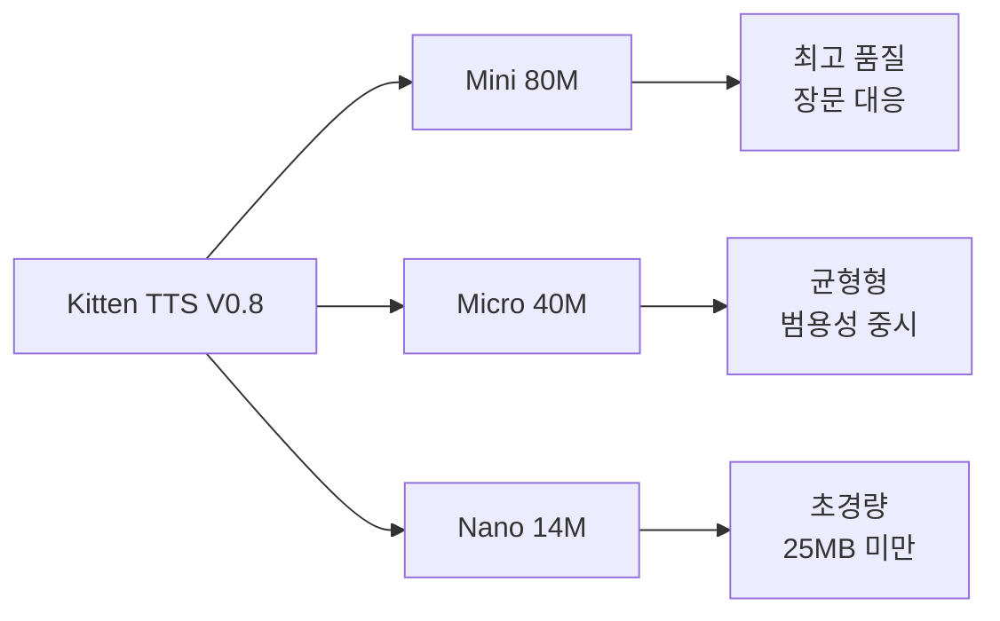
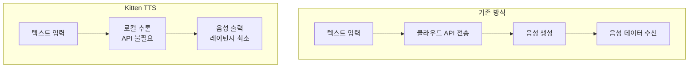
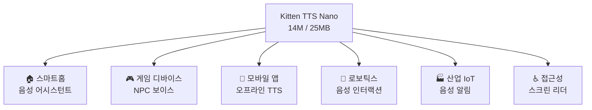

## 개요

음성 AI 분야에서 "작은 것이 곧 정의"인 시대가 도래했습니다. <strong>Kitten TTS V0.8</strong>은 단 <strong>14M 파라미터·25MB 미만</strong>이라는 크기로 클라우드 TTS에 필적하는 품질을 구현한 초소형 텍스트 음성 변환 모델입니다.

KaniTTS2, Qwen3-TTS.cpp, FreeFlow 등 로컬 음성 AI 모델이 잇따라 등장하는 가운데, Kitten TTS는 극한의 경량성으로 새로운 지평을 열고 있습니다. 이 글에서는 Kitten TTS V0.8의 기술적 특징, 3가지 모델 변형 비교, 그리고 엣지 디바이스 배포 가능성을 철저히 분석합니다.

## Kitten TTS V0.8이란

[Kitten ML](https://github.com/KittenML/KittenTTS)이 개발한 오픈소스 TTS 모델로, Apache 2.0 라이선스로 공개되어 있습니다. V0.1에서 V0.8로의 메이저 업데이트를 통해 품질, 표현력, 현실감이 대폭 향상되었습니다.

### 3가지 모델 변형



| 모델 | 파라미터 수 | 크기 | 특징 |
|------|------------|------|------|
| <strong>Mini</strong> | 80M | ~150MB | 최고 품질·긴 텍스트에서도 높은 표현력 |
| <strong>Micro</strong> | 40M | ~80MB | 품질과 크기의 균형 |
| <strong>Nano</strong> | 14M | <strong><25MB</strong> | 초경량·엣지 디바이스 최적화 |

3개 모델 모두 <strong>8개의 표현력 있는 음성</strong>(여성 4개·남성 4개)을 탑재하고 있습니다. 현재는 영어 지원이며, 다국어 지원은 향후 릴리스에서 추가될 예정입니다.

## 기술적 주요 포인트

### 1. CPU 전용 실행 가능

"GPU 불필요" 수준을 넘어, <strong>리소스 제약이 있는 엣지 디바이스에서의 동작을 전제로 설계</strong>되었습니다. Raspberry Pi나 IoT 디바이스 같은 저사양 환경에서도 동작 가능하며, GPU 환경이 없는 개발자에게 큰 희소식입니다.

### 2. 클라우드 TTS 품질의 온디바이스 실현



클라우드 API를 전혀 사용하지 않고, 완전히 디바이스 위에서 추론을 완결합니다. 이를 통해:

- <strong>레이턴시 대폭 감소</strong>: 네트워크 왕복 불필요
- <strong>프라이버시 확보</strong>: 음성 데이터가 외부로 전송되지 않음
- <strong>비용 절감</strong>: API 과금 제로
- <strong>오프라인 동작</strong>: 네트워크 연결 불필요

### 3. V0.1에서의 진화

V0.8에서는 다음과 같은 개선이 이루어졌습니다:

- <strong>10배 학습 데이터셋</strong>: 데이터 양의 대폭 확충
- <strong>개선된 트레이닝 파이프라인</strong>: 최적화 기법 개선
- <strong>품질·표현력·현실감 향상</strong>: 자연스러운 운율과 억양

## 로컬 음성 AI 트렌드에서의 위치

2025년부터 2026년에 걸쳐 음성 AI의 로컬화가 급속히 진행되고 있습니다.

| 모델 | 특징 | 크기 |
|------|------|------|
| <strong>KaniTTS2</strong> | 일본어 특화 고품질 TTS | 중~대규모 |
| <strong>Qwen3-TTS.cpp</strong> | 다국어 대응·llama.cpp 통합 | 중규모 |
| <strong>FreeFlow</strong> | 자연스러운 운율·감정 표현 | 중규모 |
| <strong>Kitten TTS V0.8</strong> | <strong>극한적 경량화로 SOTA 품질</strong> | <strong>초소형(14M~80M)</strong> |

Kitten TTS의 최대 차별점은 <strong>크기</strong>입니다. 14M 파라미터·25MB 미만이라는 크기는 다른 어떤 모델과도 차원이 다릅니다.

## 엣지 디바이스 배포 가능성

### 유스케이스 분석



### 구체적인 배포 시나리오

<strong>1. 스마트홈 디바이스</strong>

25MB 미만의 모델 크기는 ESP32 같은 저비용 마이크로컨트롤러에서도 동작 가능한 영역입니다. 클라우드 연결 없이 로컬 음성 어시스턴트 구현이 가능해집니다.

<strong>2. 모바일 애플리케이션</strong>

앱 번들에 포함해도 부담 없는 크기로, 오프라인 환경에서도 TTS 기능을 제공할 수 있습니다. 통신 환경이 열악한 지역에서의 접근성 향상에 기여합니다.

<strong>3. 보이스 에이전트</strong>

로컬 추론에 의한 저레이턴시 TTS는 대화형 음성 에이전트에 이상적입니다. LLM과 결합하면 완전 로컬 음성 대화 시스템 구축이 가능합니다.

## 빠른 시작

```bash
# 리포지토리 클론
git clone https://github.com/KittenML/KittenTTS.git
cd KittenTTS

# 모델 다운로드 (Nano 모델)
# HuggingFace에서 다운로드
# https://huggingface.co/KittenML/kitten-tts-nano-0.8
```

HuggingFace에서 공개된 3개 모델:

- [Mini 80M](https://huggingface.co/KittenML/kitten-tts-mini-0.8) — 최고 품질
- [Micro 40M](https://huggingface.co/KittenML/kitten-tts-micro-0.8) — 균형형
- [Nano 14M](https://huggingface.co/KittenML/kitten-tts-nano-0.8) — 초경량

## 향후 전망

Kitten TTS V0.8은 현재 영어만 지원하지만, 향후 릴리스에서 <strong>다국어 지원</strong>이 예정되어 있습니다. 한국어 대응이 실현되면 국내 엣지 AI 시장에 큰 임팩트를 줄 것입니다.

또한 Apache 2.0 라이선스이므로 상용 이용도 자유롭습니다. 스타트업부터 대기업까지, 음성 기능을 프로덕트에 탑재하는 허들이 크게 낮아집니다.

## 결론

Kitten TTS V0.8은 <strong>"작은 모델로도 고품질"</strong>이라는 새로운 패러다임을 체현한 모델입니다. 14M 파라미터·25MB 미만이라는 경이적인 컴팩트함으로 클라우드 TTS에 필적하는 품질을 실현하고 있습니다.

KaniTTS2, Qwen3-TTS.cpp, FreeFlow에 이은 음성 AI 로컬화 트렌드 속에서, Kitten TTS는 <strong>엣지 디바이스 배포의 결정판</strong>으로 두각을 나타내고 있습니다. GPU 불필요, API 불필요, 완전 로컬로 동작하는 초소형 TTS 모델은 음성 AI 민주화의 다음 한 걸음을 보여주고 있습니다.

## 참고 자료

- [Kitten TTS GitHub 리포지토리](https://github.com/KittenML/KittenTTS)
- [Reddit — Kitten TTS V0.8 릴리스 스레드](https://www.reddit.com/r/LocalLLaMA/comments/1r8pztp/kitten_tts_v08_is_out_new_sota_supertiny_tts/)
- [HuggingFace — Kitten TTS Mini 0.8](https://huggingface.co/KittenML/kitten-tts-mini-0.8)
- [HuggingFace — Kitten TTS Micro 0.8](https://huggingface.co/KittenML/kitten-tts-micro-0.8)
- [HuggingFace — Kitten TTS Nano 0.8](https://huggingface.co/KittenML/kitten-tts-nano-0.8)
