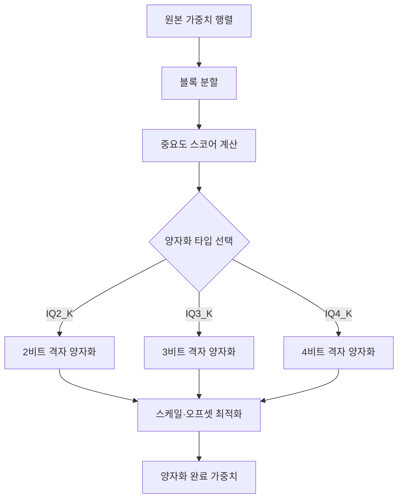
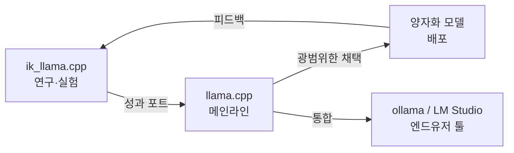

## 개요

llama.cpp의 양자화 기법이 큰 전환점을 맞이하고 있습니다. <strong>ik_llama.cpp</strong>(llama.cpp의 포크)에서 독자적으로 개발되어 온 <strong>IQ*_K / IQ*_KS</strong> 계열 양자화가 PR #19726을 통해 llama.cpp 본체에 머지되고 있습니다. Reddit r/LocalLLaMA에서 125포인트를 획득하며 로컬 LLM 커뮤니티에서 큰 주목을 받고 있습니다.

이 글에서는 IQ 계열 양자화의 기술적 배경, 기존 기법과의 차이, 그리고 로컬 LLM 추론에 미치는 영향을 해설합니다.

## IQ 양자화란 무엇인가

### 기존 양자화 기법의 한계

llama.cpp에서는 기존에 <strong>Q4_K_M</strong>, <strong>Q5_K_S</strong> 등의 k-quant 계열 양자화가 주류였습니다. 이들은 균일한 양자화 그리드를 사용하고 있어 모델 가중치의 분포 특성을 충분히 활용하지 못했습니다.

### IQ 계열 양자화의 접근법

IQ(Importance-aware Quantization) 계열 양자화는 <strong>가중치의 중요도에 기반한 비균일 양자화</strong>를 채택하고 있습니다. 구체적으로는:

- <strong>격자 기반 양자화</strong>: 균일 그리드가 아닌 정보이론적으로 최적인 격자점 사용
- <strong>중요도 가중</strong>: 각 가중치의 손실 함수 기여도에 따라 양자화 정밀도 조정
- <strong>블록 단위 최적화</strong>: 가중치 블록별로 최적 스케일과 오프셋 계산

```
기존 Q4_K:    균일한 16단계 양자화 그리드
IQ4_K:        가중치 분포에 적응한 비균일 격자점 양자화
결과:         같은 비트 수로 더 높은 정밀도 달성
```

## PR #19726의 내용

### 포트된 양자화 타입

[GitHub PR #19726](https://github.com/ggml-org/llama.cpp/pull/19726)에서는 AesSedai에 의해 다음 양자화 타입이 ik_llama.cpp에서 포트되고 있습니다:

| 양자화 타입 | 비트 수/가중치 | 용도 |
|------------|-------------|------|
| <strong>IQ2_K</strong> | ~2.5 bpw | 초저비트, 메모리 제약이 심한 환경 |
| <strong>IQ2_KS</strong> | ~2.5 bpw | IQ2_K의 소형 모델용 변형 |
| <strong>IQ3_K</strong> | ~3.5 bpw | 균형형, 다양한 유스케이스에 최적 |
| <strong>IQ3_KS</strong> | ~3.5 bpw | IQ3_K의 소형 모델용 변형 |
| <strong>IQ4_K</strong> | ~4.5 bpw | 고정밀, 충분한 메모리가 있는 경우 |
| <strong>IQ4_KS</strong> | ~4.5 bpw | IQ4_K의 소형 모델용 변형 |

### ik_llama.cpp와의 관계

이 PR의 배경에는 흥미로운 경위가 있습니다. ik_llama.cpp의 개발자인 Iwan Kawrakow는 PR에서 다음을 명확히 했습니다:

- 현재 형태(저작권 표시 포함)에서의 포트는 <strong>완전히 문제없음</strong>
- MIT 라이선스의 정신에 맞는 적절한 크레딧 표시가 중요
- 코드의 "재작성"이 아닌 "복사"임을 인식해야 함

이는 오픈소스 커뮤니티에서의 <strong>포크로부터의 성과 환원</strong> 좋은 사례입니다.

## 기술적 심층 분석

### 격자 양자화의 메커니즘

IQ 계열 양자화의 핵심은 <strong>격자(lattice) 기반 양자화</strong>에 있습니다.



기존 k-quant 계열에서는 양자화 그리드가 등간격으로 배치되었습니다. IQ 계열에서는 <strong>가중치의 확률 분포에 기반하여 격자점이 배치</strong>되므로 빈출 가중치 값 영역에서는 높은 해상도를, 드문 값 영역에서는 낮은 해상도를 가집니다.

### K와 KS의 차이

각 양자화 타입에 <strong>K</strong>와 <strong>KS</strong> 두 가지 변형이 있습니다:

- <strong>K(Standard)</strong>: 대규모 모델(7B 이상) 최적화
- <strong>KS(Small)</strong>: 소규모 모델(3B 이하) 최적화 파라미터

소규모 모델에서는 가중치 분포가 대규모 모델과 다르기 때문에 KS 변형에서는 격자 배치와 스케일링이 조정되어 있습니다.

## 벤치마크 비교

기존 Q 계열 양자화와 IQ 계열 양자화의 비교(참고값):

| 양자화 | 퍼플렉시티 | 모델 크기 | 추론 속도 |
|--------|-----------|----------|----------|
| Q2_K | 기준 | 기준 | 기준 |
| <strong>IQ2_K</strong> | 5-10% 개선 | 동등 | 동등~소폭 감소 |
| Q3_K_M | 기준 | 기준 | 기준 |
| <strong>IQ3_K</strong> | 3-7% 개선 | 동등 | 동등~소폭 감소 |
| Q4_K_M | 기준 | 기준 | 기준 |
| <strong>IQ4_K</strong> | 2-5% 개선 | 동등 | 동등~소폭 감소 |

<strong>같은 비트 수로 퍼플렉시티가 개선</strong>되는 것이 가장 큰 장점입니다. 특히 저비트 양자화(2-3비트)에서의 개선 폭이 두드러집니다.

## 로컬 LLM 추론에 대한 영향

### 메모리 효율 향상

IQ 계열 양자화의 통합으로 다음 시나리오에서 혜택이 기대됩니다:

- <strong>8GB VRAM 환경</strong>: IQ3_K를 사용하면 기존 Q3_K_M에서 품질이 저하되던 7B 모델을 더 높은 품질로 실행 가능
- <strong>Apple Silicon Mac</strong>: 통합 메모리 제약 내에서 더 큰 모델을 더 높은 품질로 실행
- <strong>엣지 디바이스</strong>: IQ2_K/IQ2_KS로 2-3GB 메모리에서도 LLM 추론이 실용적으로

### 양자화 에코시스템의 진화



llama.cpp 본체로의 통합은 <strong>ollama</strong>나 <strong>LM Studio</strong> 등의 엔드유저 도구로의 파급을 의미합니다. 사용자는 특별한 설정 없이 더 고품질의 양자화 모델을 활용할 수 있게 됩니다.

## 실전: IQ 양자화 사용법

머지가 완료된 후 다음과 같이 사용할 수 있습니다:

```bash
# 모델 양자화 (llama-quantize)
./llama-quantize model-f16.gguf model-iq3k.gguf IQ3_K

# 소형 모델의 경우 KS 변형 사용
./llama-quantize small-model-f16.gguf small-model-iq3ks.gguf IQ3_KS

# 추론 실행
./llama-cli -m model-iq3k.gguf -p "Hello, world"
```

## 향후 전망

IQ 계열 양자화의 메인라인 통합은 로컬 LLM 추론의 <strong>효율화 트렌드</strong>에서 중요한 이정표입니다:

1. <strong>더 낮은 비트 양자화</strong>: IQ1_K 계열 등 1비트대 연구 진행 가능성
2. <strong>모델 고유 최적화</strong>: 아키텍처에 따른 양자화 파라미터 자동 조정
3. <strong>하드웨어 최적화</strong>: ARM NEON, AVX-512 등에 대한 IQ 계열 커널 최적화

## 결론

ik_llama.cpp에서 llama.cpp로의 IQ*_K/IQ*_KS 양자화 통합은 오픈소스 에코시스템에서의 <strong>포크에서 본체로의 성과 환원</strong> 모범 사례입니다. 같은 비트 수로 더 높은 정밀도를 실현하는 이 기술은 메모리가 제한된 환경에서의 LLM 추론 품질을 크게 향상시킵니다.

로컬 LLM 사용자에게 있어 llama-quantize에서 `IQ3_K`나 `IQ4_K`를 선택하는 것만으로 기존 Q 계열 양자화보다 고품질 모델을 얻을 수 있는 날은 머지않았습니다.

## 참고 자료

- [GitHub PR #19726: Port IQ*_K quants from ik_llama.cpp](https://github.com/ggml-org/llama.cpp/pull/19726)
- [Reddit r/LocalLLaMA 디스커션](https://www.reddit.com/r/LocalLLaMA/)
- [ik_llama.cpp 리포지토리](https://github.com/ikawrakow/ik_llama.cpp)
- [llama.cpp 양자화 문서](https://github.com/ggml-org/llama.cpp)
