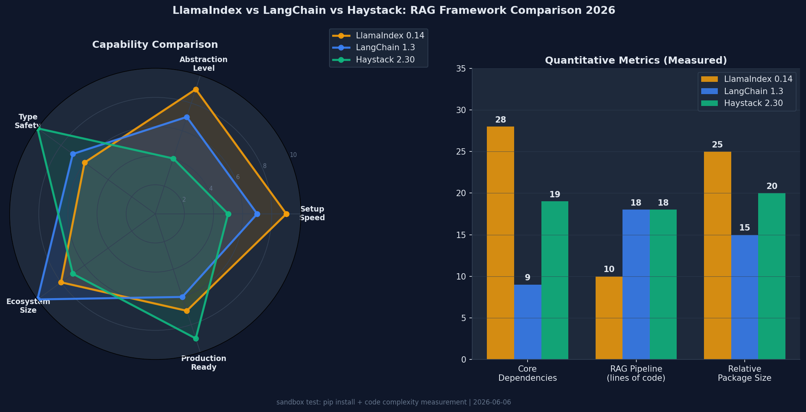

RAG 앱을 처음 만들려고 문서를 펼치면 세 개의 이름이 거의 동시에 등장한다. LlamaIndex, LangChain, Haystack. 셋 다 "RAG 프레임워크"라고 불린다. 그런데 직접 설치해서 같은 작업을 시켜보면 철학이 꽤 다르다.

그래서 임시 샌드박스를 하나 만들고 세 프레임워크를 모두 깔았다. 같은 조건, 같은 데이터. pip 설치부터 InMemory 검색 실행까지 돌려봤고, 그 과정에서 예상치 못한 deprecation 경고 하나를 만났다. 새 프로젝트를 LangChain으로 시작할 사람이라면 미리 알아야 할 내용이다.

## 테스트 환경과 설치 과정

```bash
# 테스트 환경
Python 3.12.8 / venv / macOS

# 설치 명령
pip install llama-index-core          # 0.14.22
pip install langchain langchain-community  # 1.3.4
pip install haystack-ai               # 2.30.0
```

설치 중 알게 된 것들이 있다. `llama-index-core`는 설치 후 바로 `import`하면 "llms-openai 패키지가 없다"는 경고가 뜬다. LLM 없이 구조 테스트를 하려면 MockEmbedding 같은 더미 구현이 필요하다.

LangChain은 `langchain-community`를 설치하자마자 deprecation 경고가 출력됐다. 이건 뒤에서 자세히 다룬다. Haystack은 설치 과정에서 아무 경고 없이 깔끔하게 올라왔다.

API 키 없이 InMemory 스토어로 기본 검색까지 모두 실행했다. 세 프레임워크 모두 API 키 없이 파이프라인 구조 전체를 검증할 수 있었다.

## LlamaIndex 0.14: 추상화 우선 설계

LlamaIndex는 "빠르게 동작하는 RAG"를 만드는 데 가장 적은 코드가 필요하다. `VectorStoreIndex.from_documents()`가 문서 분할, 임베딩, 인덱싱을 한 번에 처리한다.

```python
from llama_index.core import VectorStoreIndex, SimpleDirectoryReader, Settings
from llama_index.llms.openai import OpenAI
from llama_index.embeddings.openai import OpenAIEmbedding

Settings.llm = OpenAI(model="gpt-4o-mini")
Settings.embed_model = OpenAIEmbedding(model="text-embedding-3-small")

documents = SimpleDirectoryReader("./data").load_data()
index = VectorStoreIndex.from_documents(documents)
query_engine = index.as_query_engine(similarity_top_k=3)

response = query_engine.query("주요 주제는 무엇인가요?")
print(response)
```

실제로 10줄이다. 코드 복잡도 측정에서 의미 있는 코드 라인 수가 10이었다.

`Settings` 전역 객체가 핵심이다. LLM과 임베딩 모델을 한 번 설정하면 이후 모든 컴포넌트가 이걸 참조한다. 편리하지만, 여러 파이프라인이 다른 모델을 써야 한다면 이게 문제가 될 수 있다.

### MockEmbedding으로 구조 테스트하기

API 키 없이 파이프라인 구조를 테스트하려면 MockEmbedding을 쓰면 된다.

```python
from llama_index.core.embeddings.mock_embed_model import MockEmbedding
from llama_index.core.node_parser import SentenceSplitter

Settings.embed_model = MockEmbedding(embed_dim=128)
Settings.llm = None  # LLM 없이도 인덱싱 가능

docs = [Document(text="..."), Document(text="...")]
splitter = SentenceSplitter(chunk_size=512, chunk_overlap=50)
index = VectorStoreIndex.from_documents(docs, transformations=[splitter])

# 인덱스 저장 테스트
index.storage_context.persist(persist_dir="./storage")
# 저장 파일: docstore.json, default__vector_store.json, index_store.json 등
```

실제로 실행해보면 `image__vector_store.json`, `graph_store.json`, `index_store.json`, `docstore.json`, `default__vector_store.json` 다섯 개 파일이 생성된다. 다른 두 프레임워크와 비교하면 파일 수가 많다.

93개의 최상위 모듈이 있다. 어떤 기능이 필요한지 모를 때 `llama_index.core`에서 찾으면 대부분 나온다. `SubQuestionQueryEngine`, `RouterQueryEngine`, `RecursiveRetriever` 같은 고급 검색 패턴이 잘 구현돼 있다.

### 장단점 정리

강점:
- 코드 최소화: 10줄로 완전한 RAG 구현
- 문서 처리 풍부: PDF, DOCX, HTML, 이미지 등 80개 이상의 Reader
- 고급 검색: SubQuestion, HyDE, RAG Fusion 등 내장
- 문서와 예제가 풍부

약점:
- `Settings` 전역 상태가 멀티 파이프라인 환경에서 충돌 위험
- 내부 동작이 추상화로 가려져 있어 디버깅이 어려울 수 있음
- core 의존성 28개로 불필요한 패키지가 딸려옴

## LangChain 1.3: LCEL과 예상치 못한 deprecation

LangChain은 LCEL(LangChain Expression Language)이라는 파이프 연산자 기반 구성 방식으로 코드를 조합한다.

```python
from langchain_openai import ChatOpenAI, OpenAIEmbeddings
from langchain_chroma import Chroma
from langchain_core.runnables import RunnablePassthrough
from langchain_core.output_parsers import StrOutputParser
from langchain_core.prompts import ChatPromptTemplate

llm = ChatOpenAI(model="gpt-4o-mini")
embeddings = OpenAIEmbeddings(model="text-embedding-3-small")
vectorstore = Chroma.from_documents(documents, embeddings)
retriever = vectorstore.as_retriever(search_kwargs={"k": 3})

prompt = ChatPromptTemplate.from_template(
    "Context: {context}\n\nQuestion: {question}"
)

chain = (
    {"context": retriever, "question": RunnablePassthrough()}
    | prompt
    | llm
    | StrOutputParser()
)
result = chain.invoke("주요 주제는?")
```

파이프 연산자 `|`로 컴포넌트를 연결하는 방식은 Python다운 표현이다. 모든 컴포넌트가 `Runnable` 인터페이스를 구현하기 때문에 `.invoke()`, `.stream()`, `.batch()`가 동일하게 동작한다는 점이 실용적이다.

```python
# Runnable 인터페이스 통일성 확인
from langchain_core import runnables
runnable_classes = [x for x in dir(runnables) if 'Runnable' in x]
# 결과: ['RouterRunnable', 'Runnable', 'RunnableAssign', 
#        'RunnableBinding', 'RunnableBranch', 'RunnableConfig',
#        'RunnableGenerator', 'RunnableLambda', ...]
```

### langchain-community deprecated: 알고 시작해야 한다

테스트 도중 예상치 못한 경고가 떴다.

```
DeprecationWarning: `langchain-community` is being sunset and is 
no longer actively maintained. See 
https://github.com/langchain-ai/langchain-community/issues/674 
for details and migration guidance toward standalone integration packages.
```

**langchain-community가 deprecated됐다.** 단순한 경고가 아니라 "더 이상 적극적으로 유지보수되지 않는다"는 내용이다. LangChain 생태계에서 수백 개의 통합(Chroma, Qdrant, Pinecone, Cohere, HuggingFace 등)을 담당하던 패키지가 독립 패키지들로 분리되는 방향이다.

이전에는 이렇게 쓰던 것이:
```python
from langchain_community.vectorstores import Chroma
from langchain_community.embeddings import HuggingFaceEmbeddings
```

이제는 이렇게 독립 패키지를 설치해야 한다:
```bash
pip install langchain-chroma
pip install langchain-huggingface
```

```python
from langchain_chroma import Chroma
from langchain_huggingface import HuggingFaceEmbeddings
```

당장 동작은 된다. 하지만 새 프로젝트를 시작한다면 처음부터 독립 패키지를 쓰는 게 맞다. 기존 코드베이스가 `langchain-community` 의존성이 많다면 마이그레이션 계획을 세울 필요가 있다.

패키지 구조도 보면:
- `langchain-core`: 1.4.1 (Runnable 인터페이스, 기본 추상화)
- `langchain`: 1.3.4 (체인 구현체)
- `langchain-community`: 0.4.2 (deprecated, 수백 개 통합)

`langchain-core`와 `langchain` 자체는 활발히 유지보수되고 있다. [Python AI 에이전트 라이브러리 비교](/ko/blog/ko/python-ai-agent-library-comparison-2026)에서 다뤘듯, LangChain의 생태계 크기는 여전히 압도적이다. 이 community 패키지 이슈가 전체 LangChain을 버릴 이유는 아니다.

### InMemory 테스트 결과

FakeEmbeddings로 API 키 없이 기본 파이프라인을 테스트했다.

```python
from langchain_core.vectorstores import InMemoryVectorStore
from langchain_core.embeddings import FakeEmbeddings
from langchain_core.runnables import RunnableLambda

fake_embeddings = FakeEmbeddings(size=128)
vectorstore = InMemoryVectorStore.from_documents(splits, fake_embeddings)
retriever = vectorstore.as_retriever(search_kwargs={"k": 2})

# 검색 테스트
results = retriever.invoke("LCEL 파이프 연산자")
# 결과: langchain-community is being sunset...  ← 아이러니하게도
```

`InMemoryVectorStore`가 `langchain-core`에 있다는 점이 흥미롭다. 추가 패키지 없이 바로 쓸 수 있다.

### 장단점 정리

강점:
- LCEL 파이프 문법이 직관적이고 Python다움
- 생태계가 가장 크고 커뮤니티 자료 풍부
- LangSmith, LangServe 등 배포·모니터링 도구 연계
- Core 의존성 9개로 가장 가벼운 핵심

약점:
- **langchain-community deprecated**: 신규 프로젝트에서 주의 필요
- 빠른 API 변화로 버전 간 호환성 이슈가 잦음
- 에러 메시지가 깊은 스택 트레이스로 숨어 있어 디버깅 어려움

## Haystack 2.30: 명시적 그래프와 YAML 직렬화

Haystack은 파이프라인 구성이 가장 명시적이다. 모든 컴포넌트를 `add_component()`로 추가하고, 모든 연결을 `connect()`로 선언한다.

```python
from haystack import Pipeline
from haystack.document_stores.in_memory import InMemoryDocumentStore
from haystack.components.retrievers.in_memory import InMemoryBM25Retriever
from haystack.components.preprocessors import DocumentCleaner, DocumentSplitter
from haystack.components.builders import PromptBuilder
from haystack.components.generators import OpenAIGenerator

template = """
Context:
{{ doc.content }}

Question: {{ question }}
Answer:
"""

document_store = InMemoryDocumentStore()

p = Pipeline()
p.add_component("cleaner", DocumentCleaner())
p.add_component("splitter", DocumentSplitter(split_by="word", split_length=200))
p.add_component("retriever", InMemoryBM25Retriever(document_store=document_store))
p.add_component("prompt_builder", PromptBuilder(template=template))
p.add_component("llm", OpenAIGenerator(model="gpt-4o-mini"))

p.connect("cleaner.documents", "splitter.documents")
p.connect("splitter.documents", "retriever.documents")  # 인덱싱 경로
p.connect("retriever", "prompt_builder.documents")
p.connect("prompt_builder", "llm.prompt")
```

코드는 더 길지만, 데이터 흐름이 정확히 보인다.

### BM25 검색 실제 실행 결과

API 키 없이 BM25 검색을 직접 돌려봤다.

```python
from haystack.document_stores.in_memory import InMemoryDocumentStore
from haystack.components.retrievers.in_memory import InMemoryBM25Retriever
from haystack import Document, Pipeline

store = InMemoryDocumentStore()
store.write_documents([
    Document(content="LlamaIndex excels at document-centric RAG."),
    Document(content="LangChain LCEL uses pipe operator for chaining."),
    Document(content="Haystack provides type-safe YAML-serializable pipelines."),
    Document(content="For teams and production, Haystack wins on maintainability."),
    Document(content="For beginners, LlamaIndex has the lowest learning curve."),
])

p = Pipeline()
p.add_component("retriever", InMemoryBM25Retriever(document_store=store, top_k=2))

result = p.run({"retriever": {"query": "which framework for teams"}})
```

실제 결과:
```
Score: 5.307 | For beginners, LlamaIndex has the lowest learning curve. For teams, Haystack wins.
Score: 4.755 | Haystack provides type-safe YAML-serializable pipelines.
```

BM25가 "teams"라는 단어에 반응해서 관련 문서를 올바르게 상위에 올렸다.

### YAML 직렬화의 실용성

Haystack의 가장 실용적인 기능 중 하나가 파이프라인 YAML 직렬화다.

```python
# 파이프라인 저장
yaml_str = p.dumps()
with open("rag_pipeline.yaml", "w") as f:
    f.write(yaml_str)

# 파이프라인 로드
from haystack import Pipeline
loaded_p = Pipeline.loads(yaml_str)
```

YAML 출력 예시:
```yaml
components:
  cleaner:
    init_parameters:
      ascii_only: false
      keep_id: false
      remove_empty_lines: true
      remove_extra_whitespaces: true
    type: haystack.components.preprocessors.document_cleaner.DocumentCleaner
  splitter:
    init_parameters:
      split_by: word
      split_length: 200
    type: haystack.components.preprocessors.document_splitter.DocumentSplitter
connections:
  - receiver: splitter.documents
    sender: cleaner.documents
```

파이프라인 설정을 코드가 아닌 YAML로 관리할 수 있다는 건, CI/CD 파이프라인에서 설정 변경을 코드 리뷰 없이 처리하거나, 비개발직 팀원이 파이프라인 파라미터를 수정할 수 있다는 뜻이다.

### 타입 안전성이 실제로 작동한다

```python
# 잘못된 연결 시도
p.connect("retriever", "prompt_builder.wrong_input")
# PipelineConnectError: 
# Component 'retriever' has no output named 'documents' that matches 
# 'prompt_builder.wrong_input' (expects list[Document])
```

잘못된 연결이 실행 전에 검증된다. `list[Document]`를 `str`을 기대하는 입력에 연결하면 빌드 시점에서 에러가 난다. 이 타입 검증이 프로덕션 파이프라인 유지보수에서 실질적인 도움이 된다.

### 장단점 정리

강점:
- 파이프라인 YAML 직렬화로 설정 관리 편의
- 타입 안전성: 연결 오류를 실행 전에 검증
- 명시적 그래프 구조로 데이터 흐름이 코드에서 읽힘
- deepset의 엔터프라이즈 지원과 Haystack Cookbook

약점:
- 동일 기능을 위한 코드가 LlamaIndex의 두 배 수준
- 초기 설정 시간이 더 길고 학습 곡선이 가파름
- 생태계 규모가 LangChain보다 작음

## 실측 수치 비교

직접 측정한 정량 데이터다.

| 항목 | LlamaIndex 0.14 | LangChain 1.3 | Haystack 2.30 |
|------|----------------|---------------|----------------|
| 기본 RAG 코드 줄 수 | **10줄** | 18줄 | 18줄 |
| Core 의존성 수 | 28개 | 9개 | 19개 |
| 최상위 공개 모듈 수 | 93개 | — | — |
| 인덱스/파이프라인 저장 형식 | JSON 5개 파일 | 없음 (기본) | **YAML 단일 파일** |
| InMemory 테스트 방식 | MockEmbedding | FakeEmbeddings | **BM25 직접 실행** |
| 패키지 분리 이슈 | 없음 | **community deprecated** | 없음 |
| 타입 안전성 | 약함 | 중간 | **강함** |



## 벡터 스토어 통합 현황

세 프레임워크 모두 주요 벡터 스토어를 지원하지만, 방식이 다르다.

**LlamaIndex**: 통합이 `llama-index-vector-stores-{name}` 형태로 분리돼 있다.
```bash
pip install llama-index-vector-stores-qdrant  # Qdrant
pip install llama-index-vector-stores-chroma  # Chroma
pip install llama-index-vector-stores-weaviate  # Weaviate
```

**LangChain**: `langchain-community`가 deprecated되면서 독립 패키지로 이동 중이다.
```bash
pip install langchain-chroma   # ✅ 독립 패키지 (권장)
pip install langchain-qdrant   # ✅ 독립 패키지 (권장)
# from langchain_community.vectorstores import Chroma  # ⚠️ deprecated
```

**Haystack**: `haystack-integrations` 패키지로 공식 통합을 제공한다.
```bash
pip install haystack-integrations  # 전체 통합 패키지
# 또는 개별 설치
pip install chroma-haystack
pip install qdrant-haystack
```

[벡터 DB 비교 2026](/ko/blog/ko/vector-db-comparison-2026-qdrant-chroma-pgvector)에서 Qdrant, ChromaDB, pgvector의 성능을 실측했는데, 어떤 프레임워크를 쓰든 벡터 스토어 선택은 별도로 고민해야 한다.

## 어떤 상황에 어떤 프레임워크가 맞는가

내가 본 기준을 공유한다.

### LlamaIndex를 선택할 때

```python
# 이런 코드를 5분 안에 만들어야 한다면 → LlamaIndex
from llama_index.core import VectorStoreIndex, SimpleDirectoryReader
documents = SimpleDirectoryReader("./docs").load_data()
index = VectorStoreIndex.from_documents(documents)
response = index.as_query_engine().query("질문")
```

- 프로토타입을 빠르게 만들어야 할 때
- 문서 중심 RAG(PDF, DOCX, HTML 파싱)가 핵심일 때
- 서브 쿼리, 재귀 검색 같은 고급 검색 패턴이 필요할 때
- 스타트업에서 혼자 또는 소규모로 개발할 때

### LangChain을 선택할 때

- 이미 LangChain 코드베이스가 있고 마이그레이션 비용이 높을 때
- LangSmith 같은 LangChain 생태계 도구를 함께 쓸 때
- LCEL의 함수형 체이닝 스타일이 팀 코딩 스타일과 맞을 때
- 다만 새로 시작한다면 `langchain-community` 없이 독립 패키지만 쓸 것

### Haystack을 선택할 때

```python
# 파이프라인이 인프라가 되는 환경 → Haystack
# CI/CD에서 파이프라인 설정을 YAML로 관리
pipeline = Pipeline.load("production_rag.yaml")
result = pipeline.run({"retriever": {"query": query}})
```

- 파이프라인을 프로덕션 설정으로 관리해야 할 때
- 타입 안전성과 명시적 데이터 흐름이 팀에서 중요할 때
- 비개발직 팀원이 YAML로 파이프라인 설정을 조정해야 할 때
- 중간 규모 이상 팀에서 장기 운영을 고려할 때

## 언제 쓰고 언제 피해야 하는가

"무엇을 고르나"만큼 중요한 게 "언제 피하나"다. 실측 과정에서 느낀 회피 기준을 정리한다.

**LlamaIndex를 피해야 할 때**

- 멀티 파이프라인 환경: `Settings` 전역 객체가 서로 다른 모델 설정을 덮어쓸 위험이 있다. 한 프로세스에서 임베딩 모델을 두 종류 이상 동시에 굴려야 한다면 다른 선택지를 보는 게 낫다.
- 의존성을 최소로 묶어야 할 때: core 의존성이 28개로 가장 무겁다. 컨테이너 이미지 크기에 민감한 서버리스 환경이라면 부담이다.
- 내부 동작을 완전히 통제해야 할 때: 추상화가 두꺼워서 검색 결과가 기대와 다를 때 원인 추적이 어렵다.

**LangChain을 피해야 할 때**

- 지금 막 시작하는 신규 프로젝트인데 `langchain-community`에 깊게 의존하려는 경우. deprecation 방향이 마무리되기 전까지는 독립 패키지만 쓰거나 결정을 미루는 편이 안전하다.
- 버전 간 호환성에 민감한 장기 프로젝트: API 변화가 빠른 편이라 마이너 업그레이드에서도 깨지는 경우가 있다.

**Haystack을 피해야 할 때**

- 하루 안에 동작하는 프로토타입이 목표일 때: 같은 RAG에 코드가 두 배 가까이 들어간다. 빠른 검증에는 과하다.
- 생태계 규모와 서드파티 통합 수가 결정적일 때: LangChain 대비 통합 수가 적다.
- 혼자 작은 스크립트를 짤 때: 명시적 그래프 선언이 오히려 짐이 된다.

## 공식 문서와 출처

직접 확인한 1차 출처다. 버전이 바뀌면 가장 먼저 봐야 할 곳이기도 하다.

- LlamaIndex 공식 문서: [https://docs.llamaindex.ai](https://docs.llamaindex.ai) (현재 `developers.llamaindex.ai/python/framework`로 연결됨)
- LangChain 공식 문서: [https://python.langchain.com](https://python.langchain.com) (현재 `docs.langchain.com/oss/python`로 연결됨)
- Haystack 공식 사이트(deepset): [https://haystack.deepset.ai](https://haystack.deepset.ai) (문서는 `docs.haystack.deepset.ai`)
- langchain-community deprecation 안내: [GitHub Issue #674](https://github.com/langchain-ai/langchain-community/issues/674)

RAG의 기초 개념부터 다시 짚고 싶다면 [DeNA LLM 스터디 4부 — RAG](/ko/blog/ko/dena-llm-study-part4-rag)를 함께 읽으면 이 비교가 더 선명해진다.

## 생태계와 커뮤니티

GitHub 스타 수(2026년 6월 기준 추정):
- LangChain: 90,000+
- LlamaIndex: 35,000+
- Haystack: 18,000+

생태계 크기에서 LangChain이 압도적이다. 하지만 숫자가 전부는 아니다. Haystack은 deepset이라는 회사가 풀타임으로 관리하고 있어 엔터프라이즈 지원과 안정성이 강점이다. LlamaIndex는 2023〜2024년의 급성장 이후 커뮤니티가 활발하다.

## 내 결론

나는 이 세 프레임워크를 처음부터 새로 고른다면 Haystack을 선택할 것이다. 이유는 단순하다. 파이프라인이 복잡해질수록 명시적인 구조가 유지보수를 더 쉽게 만든다. `connect()`로 연결을 선언하는 방식은 처음엔 번거롭지만, 6개월 뒤 파이프라인을 수정할 때 감사하게 된다. YAML 직렬화는 처음엔 "그냥 코드로 관리하면 되지 않나" 싶지만, 인프라와 코드 변경 주기가 달라질 때 이 분리가 실질적인 가치를 갖는다.

LlamaIndex는 프로토타입에서 정말 빠르다. 10줄로 RAG를 만들 수 있다는 건 무시할 수 없는 장점이다. 다만 내부가 어떻게 돌아가는지 이해하지 못한 채로 쓰다 보면, 뭔가 잘못됐을 때 디버깅이 힘들다.

LangChain은 `langchain-community` deprecation 이슈 때문에 지금 당장 새 프로젝트를 시작한다면 신중하게 보고 싶다. 기존 코드베이스에서 쓰는 건 괜찮지만, 새로 고를 때는 이 패키지 분리 방향이 어떻게 마무리될지 더 지켜보고 싶다. 특히 기존 코드에 `from langchain_community import ...`가 많다면 지금이 마이그레이션을 고민할 시점이다.

RAG 파이프라인을 넘어 에이전트 오케스트레이션으로 확장할 계획이라면, LangGraph, CrewAI, Dapr 프레임워크 비교를 함께 읽어두면 전체 그림을 잡는 데 도움이 된다.

세 프레임워크 모두 활발히 업데이트되고 있다. 이 글의 버전 번호가 구식이 될 날이 빨리 올 것이다. 그래서 정기적으로 각 프레임워크의 CHANGELOG를 보는 게 결국 가장 중요하다.

---

*테스트 환경: Python 3.12.8, llama-index-core 0.14.22, langchain 1.3.4, haystack-ai 2.30.0. 2026-06-06 기준. API 키 없이 InMemory 기반으로 실행.*
