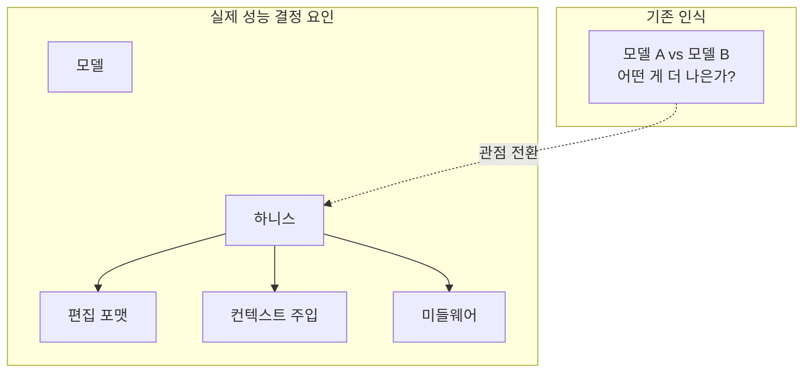
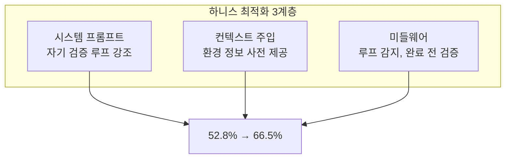

## 개요

"어떤 LLM이 코딩을 가장 잘하는가?"

엔지니어링 팀에서 이 질문이 반복될 때마다, 우리는 중요한 변수 하나를 놓치고 있다. 바로 <strong>하니스(harness)</strong>다. 하니스란 LLM이 파일을 읽고, 프롬프트를 받고, 편집을 적용하는 <strong>인터페이스 레이어</strong> 전체를 가리킨다.

2026년 2월, Can Bölük이 발표한 "[I Improved 15 LLMs at Coding in One Afternoon. Only the Harness Changed](https://blog.can.ac/2026/02/12/the-harness-problem/)"는 이 하니스 문제를 정면으로 다룬다. 편집 포맷 하나를 바꿨을 뿐인데, <strong>15개 LLM의 코딩 성능이 5〜14포인트 향상</strong>되고, <strong>출력 토큰은 약 20% 감소</strong>했다는 것이다.



이 글에서는 하니스 엔지니어링의 개념, 벤치마크 데이터, 그리고 Engineering Manager/CTO 관점에서의 실무 적용 전략을 정리한다.

## 하니스(Harness)란 무엇인가

하니스는 LLM과 실제 코드 사이의 <strong>모든 인프라</strong>를 의미한다.

| 구성 요소 | 설명 | 예시 |
|-----------|------|------|
| 편집 포맷 | 모델이 코드를 수정하는 방식 | diff, string_replace, hashline |
| 시스템 프롬프트 | 모델에 주어지는 지시사항 | 자기 검증 루프, 문제 해결 전략 |
| 도구 인터페이스 | 모델이 사용하는 도구 정의 | read_file, edit_file, run_test |
| 컨텍스트 주입 | 환경 정보 사전 제공 | 디렉토리 구조, 평가 기준 |
| 미들웨어 | 실행 흐름 제어 | 루프 감지, 완료 전 검증 |

핵심은 이것이다: <strong>같은 모델이라도 하니스에 따라 성능이 극적으로 달라진다.</strong>

Aider 벤치마크에서 편집 포맷만 바꿨을 때 GPT-4 Turbo의 정확도가 <strong>26%에서 59%로</strong> 뛴 사례가 이를 증명한다.

## 세 가지 편집 포맷 비교

현재 주요 AI 코딩 도구들은 서로 다른 편집 포맷을 사용한다.

### 1. apply_patch (OpenAI Codex 방식)

OpenAI가 Codex에서 사용하는 diff 기반 패치 포맷이다. 모델이 수정사항을 unified diff 형태로 출력하면, 하니스가 이를 파싱하여 파일에 적용한다.

<strong>장점</strong>: diff에 익숙한 모델은 안정적으로 작동한다.
<strong>단점</strong>: diff 포맷 학습이 부족한 모델에서 높은 실패율. Grok 4는 <strong>50.7% 실패율</strong>을 기록했다.

### 2. string_replace (Claude Code, Gemini 방식)

찾을 문자열과 대체할 문자열을 정확히 지정하는 방식이다. Claude Code의 `str_replace` 도구가 대표적이다.

<strong>장점</strong>: 직관적이고 구현이 단순하다.
<strong>단점</strong>: 공백 하나, 들여쓰기 하나만 틀려도 "String to replace not found" 에러가 발생한다. <strong>완벽한 문자열 재현</strong>이 요구된다.

### 3. hashline (새로운 접근법)

Can Bölük이 제안한 방식으로, 파일의 각 줄에 2〜3자리 콘텐츠 해시를 부여한다.

```
11:a3|function hello() {
22:f1|  return "world";
33:0e|}
```

모델은 전체 소스 코드를 재현하는 대신, <strong>해시 태그를 참조</strong>하여 수정 위치를 지정한다. "줄 `2:f1`을 교체" 또는 "`3:0e` 뒤에 삽입"과 같은 방식이다.

<strong>장점</strong>:
- 완벽한 문자열 재현이 불필요 → 오류 감소
- 파일 상태가 변경되면 해시 불일치로 자동 감지 → 충돌 방지
- 출력 토큰 약 20% 절감

<strong>단점</strong>: 모든 모델에서 동일한 효과를 보장하지는 않는다 (GPT-3.5는 해시 재현 자체에 어려움).

## 벤치마크 결과가 말해주는 것

Can Bölük의 벤치마크는 180개 태스크를 16개 모델 × 3개 편집 포맷으로 각 3회 실행한 결과다.

| 모델 | 기존 포맷 | hashline 포맷 | 개선폭 |
|------|-----------|--------------|--------|
| Grok Code Fast 1 | 6.7% | 68.3% | +61.6pp |
| Gemini 3 Flash | — | 78.3% | — |
| Grok 4 | 낮음 | 향상 | 출력 토큰 61% 감소 |
| MiniMax | — | 2배 향상 | — |

<strong>Grok Code Fast 1의 경우가 특히 충격적이다.</strong> 모델 자체는 동일한데, 편집 포맷만 바꿨을 뿐 <strong>6.7%에서 68.3%로 10배 향상</strong>된 것이다. 이것이 하니스 엔지니어링의 잠재력이다.

### Cursor의 인정

이 문제의 심각성을 가장 잘 보여주는 사례는 Cursor다. Cursor는 편집 실패를 수정하기 위해 <strong>별도의 70B 파라미터 신경망</strong>을 배포했다. 편집 포맷의 문제를 인정하고, 그것을 보완하기 위해 하나의 대규모 모델을 추가 투입한 것이다.

## 하니스 엔지니어링 실전 사례: LangChain의 Terminal Bench

하니스 최적화의 실제 효과를 보여주는 또 다른 사례가 있다. LangChain 팀은 Terminal Bench 2.0에서 <strong>모델을 교체하지 않고 하니스만 최적화</strong>하여 <strong>52.8%에서 66.5%로 13.7포인트 향상</strong>시켰다. 리더보드 Top 30에서 Top 5로 뛰어오른 것이다.

그들이 사용한 하니스 최적화 기법은 세 가지였다:



### 1. 자기 검증 루프

에이전트는 첫 번째 그럴듯한 솔루션으로 곧바로 종료하려는 경향이 있다. LangChain은 "빌드-검증-수정" 루프를 시스템 프롬프트, 컨텍스트 주입, 미들웨어 세 계층 모두에서 강제했다.

### 2. 추론 컴퓨트 배분 전략 ("Reasoning Sandwich")

모든 단계에 균일하게 높은 추론을 할당하는 대신, <strong>전략적으로 배분</strong>했다:

- <strong>계획 단계</strong>: 최고 수준 (xhigh)
- <strong>구현 단계</strong>: 높음 (high)
- <strong>검증 단계</strong>: 최고 수준 (xhigh)

이 "샌드위치" 전략이 균일한 xhigh 추론보다 <strong>더 나은 결과</strong>를 냈다. 타임아웃 제약 내에서 추론 리소스를 현명하게 배분한 것이다.

### 3. 환경 온보딩

에이전트에게 신입 엔지니어에게 하듯 <strong>환경 정보를 사전 제공</strong>했다:
- 사용 가능한 도구 목록
- 디렉토리 구조
- 평가 기준
- 시간 제한

이렇게 하면 에이전트가 환경을 탐색하느라 시간을 낭비하는 것을 방지할 수 있다.

## EM/CTO가 주목해야 할 3가지 시사점

### 1. 모델 교체보다 하니스 최적화의 ROI가 높을 수 있다

새 모델이 출시될 때마다 벤더를 교체하는 것보다, <strong>현재 모델의 하니스를 최적화</strong>하는 것이 비용 대비 효과가 클 수 있다. 모델 교체는 API 키, 프롬프트 포맷, 토큰 제한 등 모든 것을 재조정해야 하지만, 하니스 최적화는 기존 인프라 위에서 점진적으로 개선 가능하다.

### 2. 오픈소스 하니스가 벤더 종속보다 나을 수 있다

Can Bölük의 핵심 주장 중 하나: <strong>오픈소스 하니스는 커뮤니티의 다양한 모델 사용자들이 각자 만나는 실패를 수정하기 때문에</strong>, 특정 벤더 전용 하니스보다 범용적으로 더 나은 성능을 보인다.

반면, Anthropic이 OpenCode를 차단하고 Google이 저자의 Gemini 계정을 비활성화한 사례는 벤더 종속의 리스크를 보여준다.

### 3. "쿨한 데모"와 "신뢰할 수 있는 도구" 사이의 간극

> "The gap between 'cool demo' and 'reliable tool' isn't model magic. It's careful, rather boring, empirical engineering at the tool boundary."
> — Can Bölük

CTO로서 AI 코딩 도구를 평가할 때, 데모에서 보여주는 화려한 코드 생성보다 <strong>실제 편집 성공률, 재시도 비율, 토큰 효율성</strong>을 측정해야 한다.

## 실무 적용 가이드

### 팀 차원에서 할 수 있는 것

1. <strong>편집 성공률 측정</strong>: AI 코딩 도구의 편집 시도 대비 성공 비율을 추적한다. "String not found" 에러가 빈번하다면 하니스 문제다.

2. <strong>미들웨어 도입</strong>: 루프 감지, 완료 전 검증, 컨텍스트 자동 주입과 같은 미들웨어를 추가한다.

3. <strong>추론 전략 분화</strong>: 계획-구현-검증 각 단계에 서로 다른 추론 수준을 할당한다.

4. <strong>트레이스 기반 디버깅</strong>: LangSmith 같은 도구로 에이전트의 모든 행동, 지연, 토큰 소비를 추적하고 체계적으로 개선한다.

### HN 커뮤니티에서 공유된 실무 도구들

| 도구 | 용도 | 접근법 |
|------|------|--------|
| Serena | 코드 인텔리전스 | AST 기반 구조 분석 |
| RepoMapper | 코드베이스 맵핑 | 디렉토리 구조 시각화 |
| Tilth | 편집 도구 | 라인 해시 + 시맨틱 섹션 (17〜25% 비용 절감) |
| Tree-sitter 통합 | AST 인식 편집 | 라운드트립 대폭 감소 |

## 결론

2026년 AI 코딩 도구 경쟁에서 승부를 가르는 것은 "어떤 모델을 쓰느냐"만이 아니다. <strong>그 모델 위에 어떤 하니스를 구축하느냐</strong>가 실질적인 성능 차이를 만든다.

- 편집 포맷 하나로 <strong>6.7% → 68.3%</strong> (10배 향상)
- 하니스 최적화만으로 <strong>Top 30 → Top 5</strong> (13.7포인트)
- 출력 토큰 <strong>20〜61% 절감</strong>

Engineering Manager로서 팀의 AI 코딩 생산성을 높이고 싶다면, 다음 모델 출시를 기다리기 전에 <strong>현재 하니스의 편집 성공률부터 측정</strong>해 보자. 그 숫자가 의외로 많은 것을 알려줄 것이다.

## 참고 자료

- [I Improved 15 LLMs at Coding in One Afternoon. Only the Harness Changed](https://blog.can.ac/2026/02/12/the-harness-problem/) — Can Bölük
- [Harness Engineering for Agentic Coding Systems](https://www.zenml.io/llmops-database/harness-engineering-for-agentic-coding-systems) — ZenML
- [Hacker News Discussion](https://news.ycombinator.com/item?id=46988596)
- [Addy Osmani's LLM Coding Workflow 2026](https://medium.com/@addyosmani/my-llm-coding-workflow-going-into-2026-52fe1681325e)
