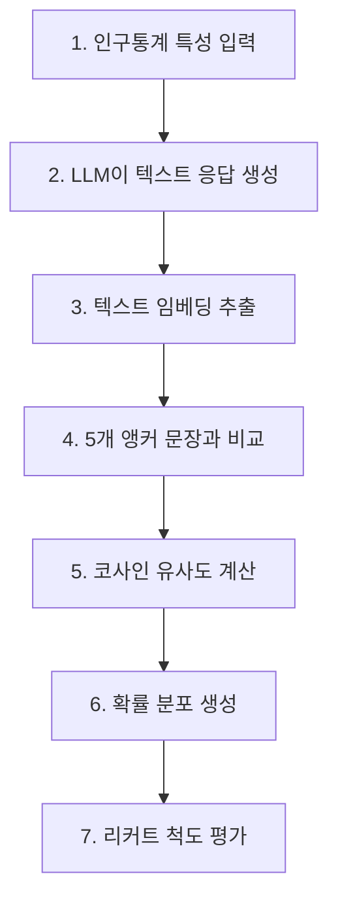
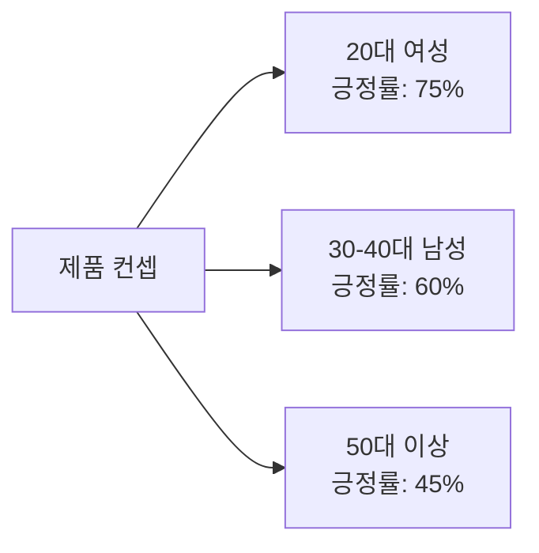

## 개요

소비자 조사는 기업들에게 매년 수십억 달러의 비용을 발생시키지만, 패널 편향과 제한된 규모라는 고질적인 문제를 안고 있습니다. 최근 arXiv에 발표된 연구는 대규모 언어 모델(LLM)을 활용하여 '합성 소비자'를 생성하고, 이를 통해 실제 소비자의 구매 의도를 90%의 신뢰도로 재현하는 혁신적인 방법론을 제시했습니다.

이 연구에서 제안한 **의미론적 유사도 평가(Semantic Similarity Rating, SSR)** 방법은 LLM이 생성한 텍스트 응답을 리커트 척도로 변환하는 과정에서 발생하는 비현실적인 분포 문제를 해결합니다.

## 전통적 소비자 조사의 한계

### 비용과 규모의 문제

기업들은 소비자 조사에 막대한 비용을 투자하지만, 다음과 같은 제약에 직면합니다:

- **높은 비용**: 대규모 설문 조사는 시간과 비용이 많이 소요됨
- **패널 편향**: 조사 참여자가 전체 모집단을 대표하지 못하는 경우가 많음
- **제한된 규모**: 충분한 통계적 신뢰도를 확보하기 어려움
- **느린 반응 속도**: 시장 변화에 빠르게 대응하기 어려움

### LLM을 활용한 합성 소비자의 등장

LLM은 다양한 인구통계학적 특성을 가진 '합성 소비자'를 시뮬레이션할 수 있는 가능성을 제시했습니다. 하지만 초기 연구들은 중요한 문제에 직면했습니다:

**직접적인 수치 평가 요청 시 문제점**:
- LLM에게 "1부터 5까지 중 하나를 선택하세요"라고 직접 물으면
- 비현실적으로 극단적이거나 편향된 분포가 생성됨
- 실제 인간의 응답 패턴과 크게 다름

## SSR 방법론의 혁신

### 핵심 아이디어

SSR은 LLM의 강점인 '자연어 생성'을 활용하면서, 구조화된 설문 데이터의 필요성을 충족시키는 영리한 접근법입니다.



### 3단계 프로세스

#### 1단계: 텍스트 응답 생성

LLM에게 인구통계학적 속성(나이, 성별, 지역 등)과 제품 컨셉을 제공하여 자유 형식의 텍스트 응답을 생성합니다.

**프롬프트 예시**:
```
당신은 35세 여성, 서울 거주자입니다.
다음 신제품에 대한 구매 의도를 자유롭게 설명해주세요:
[제품 설명]
```

#### 2단계: 의미론적 매핑

생성된 텍스트를 OpenAI의 `text-embedding-3-small` 모델을 사용하여 임베딩 벡터로 변환합니다.

#### 3단계: 앵커 문장과의 유사도 계산

5개의 참조 앵커 문장(리커트 척도 각 단계에 대응)과 코사인 유사도를 계산합니다:

- **1점**: "전혀 구매하고 싶지 않습니다"
- **2점**: "별로 구매하고 싶지 않습니다"
- **3점**: "보통입니다"
- **4점**: "구매하고 싶습니다"
- **5점**: "매우 구매하고 싶습니다"

계산된 유사도 값을 정규화하여 리커트 척도 상의 확률 분포(PMF)를 생성합니다.

### 수학적 표현

코사인 유사도를 기반으로 한 확률 분포 생성:

```typescript
function computeLikertDistribution(
  responseEmbedding: number[],
  anchorEmbeddings: number[][]
): number[] {
  // 각 앵커와의 코사인 유사도 계산
  const similarities = anchorEmbeddings.map(anchor =>
    cosineSimilarity(responseEmbedding, anchor)
  );

  // 소프트맥스를 통한 정규화
  const probabilities = softmax(similarities);

  return probabilities; // [P(1), P(2), P(3), P(4), P(5)]
}

function cosineSimilarity(vec1: number[], vec2: number[]): number {
  const dotProduct = vec1.reduce((sum, val, i) => sum + val * vec2[i], 0);
  const mag1 = Math.sqrt(vec1.reduce((sum, val) => sum + val * val, 0));
  const mag2 = Math.sqrt(vec2.reduce((sum, val) => sum + val * val, 0));
  return dotProduct / (mag1 * mag2);
}
```

## 실험 결과: 놀라운 정확도

### 데이터셋

연구팀은 대형 개인용품 기업이 수행한 57개의 실제 제품 설문 조사를 활용했습니다:
- **총 응답 수**: 9,300개의 인간 응답
- **제품 카테고리**: 개인용품 (화장품, 생활용품 등)
- **평가 지표**: 테스트-재테스트 신뢰도, KS 유사도

### 주요 성과

**90%의 인간 테스트-재테스트 신뢰도 달성**:
- 실제 인간이 같은 설문을 두 번 받았을 때의 일관성과 비교
- SSR 방법이 인간 응답 일관성의 90% 수준 달성

**KS 유사도 > 0.85**:
- Kolmogorov-Smirnov 통계를 사용하여 분포 유사성 측정
- 0.85 이상의 높은 유사도는 합성 응답 분포가 실제 인간 응답 분포와 매우 유사함을 의미

### 추가 이점: 질적 피드백

SSR의 독특한 장점은 **정량적 평가와 질적 설명을 동시에 제공**한다는 점입니다:

- 리커트 척도 평가뿐만 아니라
- 응답자가 왜 그렇게 평가했는지에 대한 자세한 텍스트 설명도 함께 제공
- 마케터들은 소비자 심리를 더 깊이 이해할 수 있음

## 실전 활용 사례

### 1. 신제품 컨셉 테스트

```python
# SSR을 활용한 신제품 테스트 예시
from semantic_similarity_rating import SSRModel

# 합성 소비자 패널 생성
synthetic_panel = [
    {"age": 25, "gender": "여성", "region": "서울"},
    {"age": 35, "gender": "남성", "region": "부산"},
    {"age": 45, "gender": "여성", "region": "대구"},
    # ... 수천 개의 프로필
]

# 제품 컨셉
product_concept = """
친환경 대나무 칫솔: 100% 생분해성 소재로 만든
프리미엄 칫솔, 가격은 기존 제품 대비 20% 높음
"""

# SSR 모델로 구매 의도 평가
ssr_model = SSRModel(model="gpt-4")
results = ssr_model.evaluate(synthetic_panel, product_concept)

# 결과 분석
print(f"평균 구매 의도: {results.mean_rating:.2f}")
print(f"긍정 응답 비율: {results.positive_ratio:.1%}")
print(f"주요 구매 동기: {results.top_reasons}")
```

### 2. A/B 테스트 시뮬레이션

제품 설명의 미묘한 차이가 구매 의도에 미치는 영향을 대규모로 빠르게 테스트할 수 있습니다:

- **버전 A**: "친환경 대나무 칫솔"
- **버전 B**: "지속가능한 미래를 위한 대나무 칫솔"

수천 명의 합성 소비자로 테스트하여 어떤 메시지가 더 효과적인지 즉시 확인 가능합니다.

### 3. 세분화된 타겟 분석

다양한 인구통계학적 세그먼트별로 반응을 분석:



## 한계와 고려사항

### 편향성 문제

LLM 자체가 가진 편향성이 합성 소비자 응답에도 반영될 수 있습니다:

- **지리적 편향**: 서구, 영어권, 선진국에 대한 성능이 더 우수
- **인구통계학적 편향**: 성별, 민족, 연령, 교육 수준에 따른 편향 존재
- **문화적 맥락**: 특정 문화권의 소비 패턴을 잘 반영하지 못할 수 있음

### 보완 방법

- **실제 데이터와의 검증**: SSR 결과를 소규모 실제 설문으로 검증
- **편향 완화 기법**: 프롬프트 엔지니어링으로 편향 최소화
- **다양한 모델 사용**: 여러 LLM의 결과를 앙상블하여 편향 감소

## 미래 전망

### 소비자 조사의 패러다임 전환

SSR과 같은 기술이 성숙해지면:

1. **비용 절감**: 기존 조사 비용의 10% 이하로 대규모 조사 가능
2. **속도 향상**: 몇 주가 걸리던 조사를 몇 시간 내에 완료
3. **규모 확대**: 수백 명이 아닌 수만 명의 합성 응답자로 테스트
4. **반복 실험**: 빠른 반복을 통한 제품 최적화

### 디지털 트윈 소비자

각 개인의 '디지털 트윈' 소비자를 생성하여:
- 개인화된 제품 추천
- 맞춤형 마케팅 메시지 테스트
- 실시간 시장 반응 예측

## 구현 가이드

### 오픈소스 구현

PyMC Labs에서 SSR 알고리즘의 오픈소스 구현을 GitHub에 공개했습니다:

```bash
# 설치
pip install semantic-similarity-rating

# 기본 사용법
from ssr import SemanticSimilarityRating

# SSR 인스턴스 생성
ssr = SemanticSimilarityRating(
    llm_model="gpt-4",
    embedding_model="text-embedding-3-small"
)

# 앵커 문장 정의
anchors = [
    "전혀 구매하고 싶지 않습니다",
    "별로 구매하고 싶지 않습니다",
    "보통입니다",
    "구매하고 싶습니다",
    "매우 구매하고 싶습니다"
]

# 평가 수행
result = ssr.evaluate(
    product_description="친환경 대나무 칫솔",
    consumer_profile={"age": 30, "gender": "여성"},
    anchors=anchors
)

print(f"리커트 분포: {result.distribution}")
print(f"응답 텍스트: {result.text_response}")
```

### 베스트 프랙티스

1. **앵커 문장 최적화**: 제품 카테고리에 맞게 앵커 문장 조정
2. **프롬프트 엔지니어링**: 인구통계학적 특성을 명확하게 정의
3. **결과 검증**: 초기에는 실제 설문과 병행하여 정확도 검증
4. **지속적 개선**: 피드백을 통해 프롬프트와 앵커 개선

## 결론

의미론적 유사도 평가(SSR)는 LLM을 활용한 소비자 조사 분야에서 획기적인 진전을 이뤘습니다. 90%의 인간 신뢰도를 달성하면서도 풍부한 질적 피드백을 제공하는 이 방법론은 다음과 같은 가능성을 열어줍니다:

**핵심 기여**:
- ✓ 비용 효율적인 대규모 소비자 조사
- ✓ 빠른 반복 실험을 통한 제품 최적화
- ✓ 정량적 평가와 질적 인사이트의 결합
- ✓ 다양한 인구통계학적 세그먼트 분석

**주의사항**:
- 편향성 문제에 대한 지속적인 모니터링 필요
- 실제 데이터와의 검증을 통한 신뢰도 확보
- 윤리적 고려사항 (개인정보, 조작 가능성 등)

소비자 조사 산업은 AI 시대의 새로운 전환점을 맞이하고 있습니다. SSR과 같은 기술은 기업들이 더 나은 제품을 만들고, 소비자를 더 깊이 이해하는 데 강력한 도구가 될 것입니다.

## 참고 자료

- [arXiv 논문: LLMs Reproduce Human Purchase Intent via Semantic Similarity Elicitation of Likert Ratings](https://arxiv.org/abs/2510.08338)
- [GitHub 구현: PyMC Labs SSR Algorithm](https://github.com/pymc-labs/semantic-similarity-rating)
- [VentureBeat: Digital Twin Consumers](https://venturebeat.com/ai/this-new-ai-technique-creates-digital-twin-consumers-and-it-could-kill-the)
- [Research on LLM Bias in Survey Research](https://www.nature.com/articles/s41599-024-03609-x)
