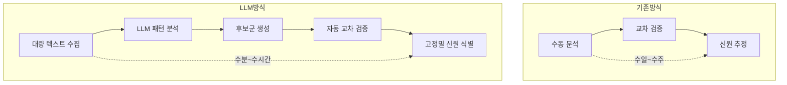
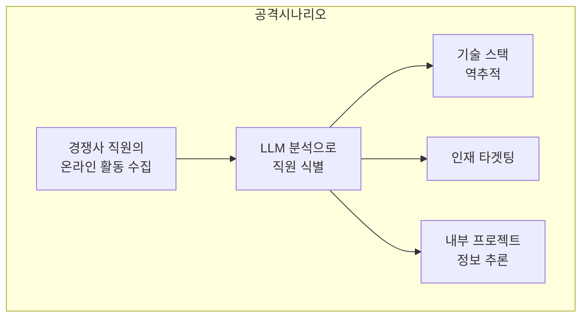
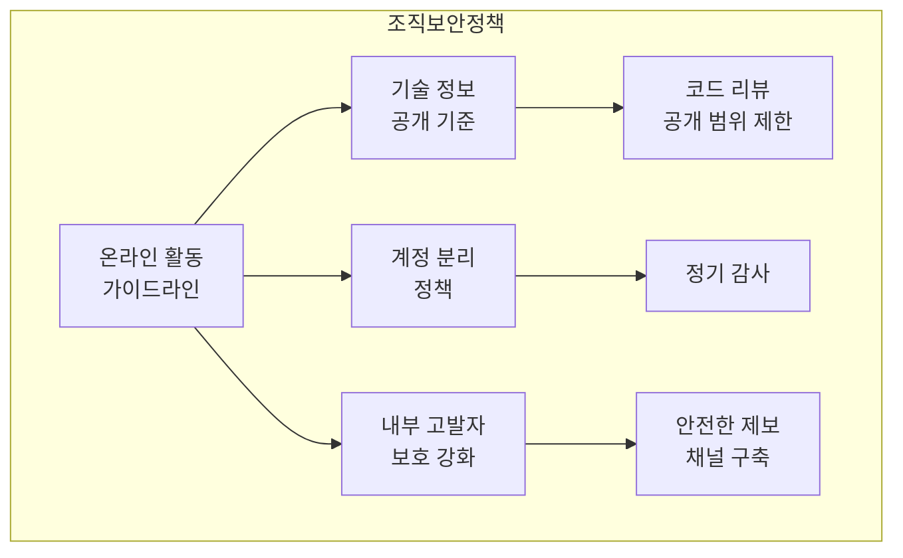

## 익명 게시물 338건 중 226건 — 67%의 신원이 밝혀졌다

2026년 2월, MATS(Model Alignment Technical Studies)의 연구진이 발표한 논문 <strong>"Large-scale online deanonymization with LLMs"</strong>가 보안 커뮤니티에 충격을 주고 있습니다. Hacker News, Reddit, LinkedIn, 익명 인터뷰 기록을 대상으로 한 실험에서 LLM은 338명의 타겟 중 226명의 신원을 정확히 식별했습니다. 정밀도(Precision) 90%, 성공률 67%라는 수치는 기존의 수동 분석과는 차원이 다른 결과입니다.

보안 전문가 Bruce Schneier도 2026년 3월 3일 자신의 블로그에서 이 연구를 다루며 경종을 울렸습니다. <strong>Engineering Manager, VPoE, CTO</strong>로서 이 연구가 조직에 미치는 영향과 대응 전략을 살펴보겠습니다.

## LLM 기반 익명 해제가 작동하는 원리

### 기존 방식 vs LLM 방식

기존의 익명 해제(Deanonymization)는 사람이 직접 게시물을 분석하고 교차 검증하는 방식이었습니다. 몇 개의 데이터 포인트만으로도 개인을 식별할 수 있다는 것은 이미 알려진 사실이지만, <strong>비정형 텍스트에서 이를 자동화하는 것은 현실적으로 불가능</strong>했습니다.

LLM은 이 한계를 완전히 뛰어넘었습니다.



### 핵심 공격 메커니즘

연구에서 밝혀진 LLM 익명 해제의 핵심 메커니즘은 다음과 같습니다.

<strong>1. 문체 분석(Stylometry)</strong>: LLM은 개인의 글쓰기 패턴 — 특정 표현, 문장 구조, 기술 용어 사용 빈도 — 을 정밀하게 분석합니다. 사람이 의식적으로 바꾸기 어려운 미세한 패턴까지 포착합니다.

<strong>2. 의미론적 교차 참조</strong>: 여러 플랫폼에 흩어진 게시물을 의미적으로 연결합니다. Hacker News의 기술 토론과 Reddit의 취미 게시물이 동일인물의 것인지 LLM이 판단합니다.

<strong>3. 맥락 추론</strong>: 직접적인 식별 정보가 없더라도, 업무 환경, 기술 스택, 거주 지역 등의 간접 정보를 종합하여 후보군을 좁힙니다.

<strong>4. 스케일</strong>: 가장 위험한 점은 수만 명의 후보를 동시에 처리할 수 있다는 것입니다. 기존에는 특정 개인을 타겟으로 해야 했지만, LLM은 "사냥감을 먼저 찾고 나서 공격"할 수 있습니다.

## 조직에 미치는 실질적 위협

### 직원 프라이버시 위험

개발자와 엔지니어는 Stack Overflow, Hacker News, Reddit 등에서 기술 질문을 하거나 의견을 공유합니다. 이 게시물들이 특정 회사의 특정 직원으로 연결되면 다음과 같은 문제가 발생합니다.

<strong>헤드헌팅 타겟팅</strong>: 경쟁사가 내부 기술 스택과 구성원을 정밀하게 파악하여 타겟 채용을 진행할 수 있습니다. 이직 시장에서는 장점이 될 수 있지만, 조직 관리자 관점에서는 인재 유출 리스크입니다.

<strong>내부 정보 노출</strong>: 직원의 기술적 질문이나 토론에서 사용 중인 인프라, 아키텍처, 기술적 과제가 간접적으로 드러날 수 있습니다.

<strong>소셜 엔지니어링</strong>: 식별된 직원의 온라인 활동 패턴을 기반으로 정교한 피싱 공격이 가능해집니다.

### 내부 고발자 보호 약화

가장 심각한 우려 중 하나는 <strong>내부 고발자(Whistleblower)의 익명성 약화</strong>입니다. 기업의 윤리적 문제를 제보하려는 직원이 LLM에 의해 식별될 수 있다면, 이는 건전한 기업 거버넌스를 위협하는 심각한 문제입니다.

### 경쟁 정보(Competitive Intelligence) 악용



## Engineering Leader를 위한 방어 전략

### 1. 조직 차원의 인식 교육

가장 먼저 해야 할 일은 <strong>팀원들에게 이 위협을 알리는 것</strong>입니다. 많은 개발자가 익명 게시판에서의 활동이 안전하다고 믿고 있습니다.

```markdown
# 팀 교육 체크리스트

- [ ] LLM 기반 익명 해제 위험성 공유
- [ ] 온라인 활동 시 주의사항 가이드라인 배포
- [ ] 회사 관련 기술 정보 게시 정책 수립
- [ ] 정기적인 보안 인식 교육 실시
```

### 2. 기술적 방어 수단

<strong>문체 난독화(Stylometric Obfuscation)</strong>: 익명 게시 시 의도적으로 글쓰기 스타일을 변경하는 도구를 제공합니다. LLM이 문체를 분석하기 어렵도록 단어 선택, 문장 구조를 자동으로 변형하는 도구가 등장하고 있습니다.

<strong>메타데이터 최소화</strong>: 게시 시간, IP 주소, 브라우저 정보 등 부가 정보를 최소화합니다. VPN, Tor 브라우저, 프라이버시 중심 브라우저 사용을 권장합니다.

<strong>계정 분리 원칙</strong>: 업무 관련 활동과 개인 활동의 계정을 완전히 분리합니다. 동일한 이메일, 유사한 사용자명 사용을 금지하는 정책을 수립합니다.

### 3. 정책 프레임워크



### 4. 모니터링 및 대응 체계

<strong>자사 노출도 점검</strong>: 정기적으로 LLM을 활용하여 자사 직원의 온라인 노출도를 점검합니다. 공격자보다 먼저 취약점을 발견하는 것이 핵심입니다.

<strong>인시던트 대응 계획</strong>: 직원의 익명성이 침해된 경우의 대응 절차를 사전에 수립합니다. 법적 대응, 소셜 미디어 대응, 내부 커뮤니케이션 계획을 포함합니다.

## CTO/VPoE가 즉시 실행할 수 있는 액션 아이템

<strong>1주차 — 현황 파악</strong>

- 팀원들의 공개 온라인 활동 현황 조사 (자발적 설문)
- 회사 관련 기술 정보가 외부에 노출된 사례 수집
- 기존 보안 정책에 온라인 프라이버시 항목 존재 여부 확인

<strong>1개월 내 — 정책 수립</strong>

- 온라인 활동 가이드라인 초안 작성
- 내부 고발자 보호 채널 점검 및 강화
- 보안 교육 커리큘럼에 LLM 익명 해제 위험 추가

<strong>분기 내 — 기술적 대응</strong>

- 문체 난독화 도구 도입 검토
- 사내 커뮤니케이션 도구의 프라이버시 설정 강화
- 정기적인 노출도 점검 프로세스 구축

## 이 기술의 양면성

LLM 기반 익명 해제 기술이 악용만 되는 것은 아닙니다.

<strong>긍정적 활용</strong>: 사이버 범죄자 추적, 허위 정보 유포자 식별, 온라인 괴롭힘 가해자 특정 등 법 집행 기관에서 활용할 수 있습니다.

<strong>부정적 악용</strong>: 스토킹, 독싱(doxxing), 활동가 탄압, 기업 감시, 정부 감시 등에 악용될 수 있습니다.

기술 자체는 중립적이지만, <strong>현재 방어 수단이 공격 수단에 비해 크게 뒤처져 있다</strong>는 것이 문제입니다. 공격자가 저비용으로 대규모 익명 해제를 실행할 수 있는 반면, 방어자는 개별적으로 대응해야 하는 비대칭 구조입니다.

## 결론

LLM 기반 대규모 익명 해제는 <strong>이미 가능한 현실</strong>입니다. 67%의 성공률과 90%의 정밀도는 온라인 익명성에 대한 기존의 가정을 완전히 뒤집습니다.

Engineering Leader로서 우리가 해야 할 일은 명확합니다.

1. 이 위협을 심각하게 인식하고 팀에 공유한다
2. 조직 차원의 온라인 활동 가이드라인을 수립한다
3. 기술적 방어 수단을 도입하고 정기적으로 점검한다
4. 내부 고발자 보호 체계를 강화한다

<strong>익명으로 게시한다고 해서 신원이 보호된다는 가정은 더 이상 유효하지 않습니다.</strong>

## 참고 자료

- [Large-scale online deanonymization with LLMs (arXiv)](https://arxiv.org/abs/2602.16800)
- [LLM-Assisted Deanonymization — Schneier on Security](https://www.schneier.com/blog/archives/2026/03/llm-assisted-deanonymization.html)
- [AI takes a swing at online anonymity — The Register](https://www.theregister.com/2026/02/26/llms_killed_privacy_star/)
- [Large-Scale Online Deanonymization with LLMs — LessWrong](https://www.lesswrong.com/posts/xwCWyy8RvAKsSoBRF/large-scale-online-deanonymization-with-llms)
