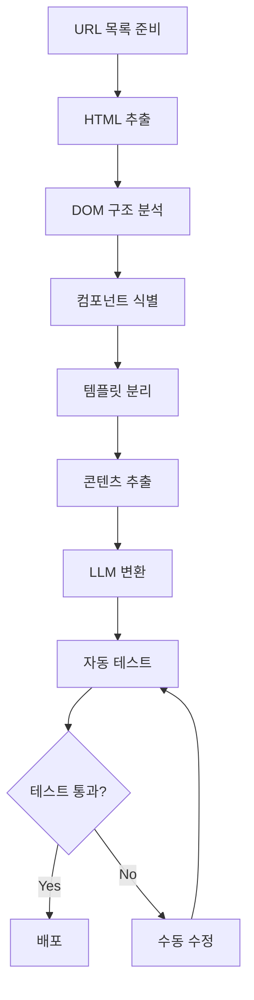

## 개요

웹사이트 리뉴얼이나 프레임워크 마이그레이션은 많은 개발팀이 겪는 큰 도전 과제입니다. 특히 50〜500페이지 이상의 중대규모 사이트를 이행하는 경우, 수작업으로는 수백 시간이 소요되며 일관성 유지와 테스트 커버리지 확보가 어렵습니다.

<strong>2024년부터 2025년까지 Google, Airbnb, Zalando 같은 글로벌 기업들은 LLM(Large Language Model)을 활용한 대규모 코드 마이그레이션에 성공</strong>했습니다. 이들의 사례를 통해 다음을 알 수 있습니다:

- <strong>자동화 가능 범위</strong>: 전체 마이그레이션 작업의 70〜80%
- <strong>시간 절약</strong>: 수백 시간의 개발 시간 단축
- <strong>품질 향상</strong>: 일관된 코드 패턴 및 자동 테스트 생성

이 글에서는 Claude Code를 중심으로 한 LLM 기반 웹페이지 이행 작업의 표준화된 워크플로우를 소개합니다. 웹 컴포넌트 파츠 라이브러리, CMS 템플릿 시스템, 그리고 종합적인 테스트 자동화 전략까지 프로덕션 환경에서 검증된 베스트 프랙티스를 다룹니다.

## 기존 방식 vs LLM 기반 접근법

### 기존 트랜스파일러 방식의 한계

전통적인 코드 마이그레이션은 구문 수준의 1:1 매핑에 의존합니다. 예를 들어 React 클래스 컴포넌트를 함수형 컴포넌트로 변환하는 도구는 단순히 `class` 키워드를 `function`으로 바꾸는 수준에 그칩니다.

<strong>문제점</strong>:
- 비즈니스 로직의 맥락을 이해하지 못함
- 기계적 변환으로 인한 비최적화된 코드
- 에러 발생 시 수동 수정 필요
- 테스트 코드는 별도 작업 필요

### LLM 기반 접근법의 장점

LLM은 단순 변환을 넘어 <strong>의미론적 이해와 지능형 리팩토링</strong>을 수행합니다.

| 구분 | 기존 트랜스파일러 | LLM 기반 접근법 |
|------|----------------|----------------|
| <strong>변환 방식</strong> | 1:1 구문 매핑 | 의미론적 이해 후 변환 |
| <strong>코드 품질</strong> | 기계적 변환 | 리팩토링 + 최적화 |
| <strong>에러 처리</strong> | 수동 수정 필요 | 컨텍스트 기반 자동 수정 |
| <strong>테스트 생성</strong> | 별도 작업 | 자동 생성 가능 |

### 2024-2025 프로덕션 사례

#### Google의 대규모 코드 마이그레이션

Google은 2024년 논문 "Migrating Code At Scale With LLMs At Google"에서 LLM 기반 마이그레이션 성과를 공개했습니다.

<strong>주요 성과</strong>:
- 추상 데이터 타입(Abstract Data Type) 리팩토링 자동화
- 관계형 표현 불변식(Relational Representation Invariant)을 사용한 타입 변경 지정
- 수백만 라인의 코드베이스에서 일관된 패턴 유지

#### Airbnb의 테스트 마이그레이션

Airbnb는 2024년 "Accelerating Large-Scale Test Migration with LLMs" 프로젝트를 통해 React Testing Library로의 대규모 테스트 마이그레이션을 수행했습니다.

<strong>결과</strong>:
- 개발 시간 수백 시간 절약
- 에지 케이스(Edge Case) 자동 처리
- 일관된 테스트 패턴 적용

#### Zalando의 UI 컴포넌트 라이브러리 마이그레이션

Zalando는 2024년 9월 GPT-4o를 활용해 UI 컴포넌트 라이브러리를 마이그레이션했습니다.

<strong>특징</strong>:
- Python + LLM API 기반 자동화
- 로컬 변경사항 또는 GitHub PR 기반 리뷰
- 정확한 변환을 위한 모델 선택 최적화

## 웹 컴포넌트 파츠 라이브러리

### 왜 웹 컴포넌트인가?

웹 컴포넌트(Web Components)는 재사용 가능하고 캡슐화된 HTML 요소를 생성하는 웹 표준 기술입니다. 2025년 현재 Chrome, Edge, Safari, Firefox 모두 네이티브 지원하며, <strong>폴리필(Polyfill) 없이 프로덕션 환경에서 사용 가능</strong>합니다.

<strong>핵심 기술 3가지</strong>:
1. <strong>Custom Elements</strong>: 사용자 정의 HTML 태그
2. <strong>Shadow DOM</strong>: 스타일 및 DOM 격리
3. <strong>HTML Templates</strong>: 재사용 가능한 마크업

### 프레임워크 비교: Lit vs Stencil

#### Lit 3.0 (2024-2025 권장)

Lit는 Google이 개발한 초경량 웹 컴포넌트 프레임워크입니다.

<strong>특징</strong>:
- 초경량 메모리 사용(4.3MB)
- 반응형 속성 관리
- TypeScript 네이티브 지원
- 컴파일 불필요(런타임 라이브러리)

<strong>성능 벤치마크(2025)</strong>:
- 초기 로딩: 235ms
- 메모리 사용: 4.3MB
- 업데이트 속도: Stencil 대비 17% 빠름

<strong>코드 예제</strong>:

```typescript
import { LitElement, html, css } from 'lit';
import { customElement, property } from 'lit/decorators.js';

@customElement('my-counter')
export class MyCounter extends LitElement {
  // Shadow DOM 스타일(격리됨)
  static styles = css`
    button {
      background: blue;
      color: white;
      padding: 8px 16px;
      border-radius: 4px;
    }
  `;

  // 반응형 속성
  @property({ type: Number })
  count = 0;

  // 템플릿 렌더링
  render() {
    return html`
      <div>
        <p>Count: ${this.count}</p>
        <button @click=${this._increment}>Increment</button>
      </div>
    `;
  }

  // 이벤트 핸들러
  private _increment() {
    this.count++;
  }
}
```

#### Stencil 4.0

Stencil은 Ionic 팀이 개발한 컴파일러 기반 웹 컴포넌트 프레임워크입니다.

<strong>특징</strong>:
- JSX 템플릿 지원(React 스타일)
- 빌드 타임 최적화
- 자동 LazyLoading
- 프레임워크 비구속적

<strong>성능 벤치마크(2025)</strong>:
- 초기 로딩: 284ms
- 메모리 사용: 6.2MB
- 빌드 타임 최적화로 런타임 오버헤드 최소화

<strong>코드 예제</strong>:

```typescript
import { Component, Prop, State, h } from '@stencil/core';

@Component({
  tag: 'my-counter',
  styleUrl: 'my-counter.css', // 별도 CSS 파일
  shadow: true, // Shadow DOM 활성화
})
export class MyCounter {
  // Props(외부에서 전달)
  @Prop() initialCount = 0;

  // State(내부 상태)
  @State() count = this.initialCount;

  // 이벤트 핸들러
  private increment = () => {
    this.count++;
  };

  // JSX 렌더링
  render() {
    return (
      <div>
        <p>Count: {this.count}</p>
        <button onClick={this.increment}>Increment</button>
      </div>
    );
  }
}
```

### 선택 가이드

| 프로젝트 요구사항 | 추천 프레임워크 | 이유 |
|-----------------|----------------|------|
| 최소 번들 크기 | Lit | 30% 작은 메모리 사용 |
| React 스타일 선호 | Stencil | JSX 템플릿 지원 |
| 빠른 프로토타이핑 | Lit | 컴파일 단계 불필요 |
| 대규모 엔터프라이즈 | Stencil | 빌드 타임 최적화 |
| 팀 러닝 커브 최소화 | Lit | 더 단순한 API |

### Shadow DOM 설계 패턴

Shadow DOM은 스타일과 DOM의 완전한 격리를 제공합니다. 외부 CSS가 컴포넌트 내부에 영향을 주지 않으며, 컴포넌트의 스타일이 외부로 누출되지 않습니다.

<strong>기본 구조</strong>:

```javascript
class AdvancedTooltip extends HTMLElement {
  constructor() {
    super();
    // Shadow DOM 생성(mode: 'open'은 외부 접근 허용)
    this.attachShadow({ mode: 'open' });
  }

  connectedCallback() {
    const text = this.getAttribute('text');
    this.shadowRoot.innerHTML = `
      <style>
        /* :host는 컴포넌트 자체를 가리킴 */
        :host {
          position: relative;
          display: inline-block;
        }
        /* 격리된 스타일(외부 영향 없음) */
        .tooltip {
          position: absolute;
          background: #333;
          color: white;
          padding: 8px;
          border-radius: 4px;
          font-size: 14px;
          z-index: 1000;
        }
      </style>
      <div class="tooltip">${text}</div>
    `;
  }
}

// 커스텀 엘리먼트 등록
customElements.define('advanced-tooltip', AdvancedTooltip);
```

<strong>Slot을 활용한 컴포지션</strong>:

```html
<!-- 컴포넌트 정의 -->
<template id="card-template">
  <style>
    .card { border: 1px solid #ddd; padding: 16px; }
    .card-header { font-weight: bold; }
  </style>
  <div class="card">
    <div class="card-header">
      <!-- 이름이 있는 슬롯 -->
      <slot name="header">기본 헤더</slot>
    </div>
    <div class="card-body">
      <!-- 기본 슬롯 -->
      <slot>기본 콘텐츠</slot>
    </div>
  </div>
</template>

<!-- 사용 예시 -->
<my-card>
  <span slot="header">커스텀 헤더</span>
  <p>커스텀 콘텐츠</p>
</my-card>
```

## CMS 템플릿 시스템 통합

### 정적 사이트 생성기(SSG) 비교

웹페이지 이행 작업에서 SSG는 정적 HTML을 빌드 타임에 생성하므로 <strong>보안, 성능, 비용 면에서 큰 장점</strong>을 제공합니다.

#### Astro 5.14+ (2024-2025)

Astro는 Islands Architecture를 도입해 필요한 부분만 JavaScript를 로드합니다.

<strong>특징</strong>:
- Islands Architecture(부분 하이드레이션)
- 다중 프레임워크 지원(React, Vue, Svelte 혼용 가능)
- Content Collections(타입 안전한 콘텐츠 관리)
- 제로 JavaScript 기본 설정

<strong>사용 사례</strong>:
- 블로그 및 마케팅 사이트
- 문서 사이트
- 포트폴리오

<strong>코드 예제</strong>:

```astro
---
// src/pages/blog/[slug].astro
import { getCollection } from 'astro:content';

// 정적 경로 생성
export async function getStaticPaths() {
  const posts = await getCollection('blog');
  return posts.map(post => ({
    params: { slug: post.slug },
    props: { post },
  }));
}

const { post } = Astro.props;
const { Content } = await post.render();
---

<html>
  <head>
    <title>{post.data.title}</title>
  </head>
  <body>
    <article>
      <h1>{post.data.title}</h1>
      <!-- Markdown 콘텐츠 렌더링 -->
      <Content />
    </article>
  </body>
</html>
```

#### Hugo (Go 기반)

Hugo는 압도적인 빌드 속도가 장점입니다.

<strong>특징</strong>:
- 수천 페이지를 초 단위로 빌드
- 다국어 지원 내장
- 강력한 템플릿 시스템
- 풍부한 테마 생태계

<strong>성능</strong>:
- 1,000 페이지 빌드: 약 1초
- 10,000 페이지 빌드: 약 5초

<strong>사용 사례</strong>:
- 대규모 문서 사이트
- 다국어 콘텐츠 사이트
- 정적 블로그

#### Eleventy (11ty)

Eleventy는 JavaScript 기반의 유연한 SSG입니다.

<strong>특징</strong>:
- JavaScript 기반(Node.js)
- 다양한 템플릿 엔진 지원(Nunjucks, Liquid, Handlebars 등)
- 유연한 데이터 파이프라인
- 제로 클라이언트 JavaScript

<strong>사용 사례</strong>:
- 커스터마이징이 많은 프로젝트
- 레거시 시스템 마이그레이션
- 개발자 친화적 워크플로우

### 비교 매트릭스

| 기능/프레임워크 | Astro | Hugo | 11ty |
|----------------|-------|------|------|
| <strong>빌드 속도</strong>(1000페이지) | 약 3초 | 약 1초 | 약 5초 |
| <strong>학습 곡선</strong> | 중간 | 높음 | 낮음 |
| <strong>React 컴포넌트 사용</strong> | ✅ | ❌ | ⚠️(제한적) |
| <strong>이미지 최적화</strong> | 자동 | 플러그인 | 플러그인 |
| <strong>다국어 지원</strong> | 수동 | 내장 | 플러그인 |
| <strong>GitHub Stars</strong> | 47k+ | 76k+ | 16k+ |

### 동적 템플릿 인클루드 패턴

<strong>HTML Template 태그 활용</strong>:

```html
<!-- templates/header.html -->
<template id="site-header">
  <header>
    <nav>
      <a href="/">Home</a>
      <a href="/about">About</a>
      <a href="/blog">Blog</a>
    </nav>
  </header>
</template>

<!-- 사용 -->
<script>
  const template = document.getElementById('site-header');
  const clone = template.content.cloneNode(true);
  document.body.prepend(clone);
</script>
```

<strong>서버 사이드 인클루드(SSI) - Astro 예시</strong>:

```astro
---
import Header from '../components/Header.astro';
import Footer from '../components/Footer.astro';
---

<html>
  <Header />
  <main>
    <!-- 자식 콘텐츠가 여기에 삽입됨 -->
    <slot />
  </main>
  <Footer />
</html>
```

## 종합 테스트 자동화 전략

### E2E 테스팅: Playwright

<strong>2024-2025년 현재 Playwright가 E2E 테스팅의 사실상 표준</strong>이 되었습니다. Microsoft가 개발하고 적극적으로 유지보수하며, 크로스 브라우저(Chromium, Firefox, WebKit) 지원과 자동 대기 메커니즘으로 안정성이 높습니다.

<strong>장점</strong>:
- 크로스 브라우저 테스트(Chromium, Firefox, WebKit)
- 자동 대기 메커니즘(안정성 향상)
- 병렬 실행 지원
- 비디오 녹화 및 스크린샷 자동화

<strong>코드 예제</strong>:

```typescript
import { test, expect } from '@playwright/test';

test('페이지 마이그레이션 후 동작 검증', async ({ page }) => {
  // 페이지 이동
  await page.goto('https://example.com/migrated-page');

  // 버튼 클릭
  await page.click('button[data-testid="submit"]');

  // 결과 검증
  await expect(page.locator('.success-message')).toBeVisible();

  // 스크린샷 비교
  await expect(page).toHaveScreenshot('migrated-page.png', {
    maxDiffPixels: 100,
  });
});
```

### 링크 체크

깨진 링크는 SEO와 사용자 경험에 악영향을 미칩니다. Playwright로 커스텀 링크 체커를 구현할 수 있습니다.

<strong>커스텀 Playwright 링크 체커</strong>:

```typescript
import { test } from '@playwright/test';

test('모든 링크 검증', async ({ page }) => {
  await page.goto('https://example.com');

  // 모든 링크 요소 가져오기
  const links = await page.locator('a[href]').all();
  const results = [];

  for (const link of links) {
    const href = await link.getAttribute('href');
    // 앵커 링크는 스킵
    if (!href || href.startsWith('#')) continue;

    // HTTP 요청으로 링크 검증
    const response = await page.request.get(href);
    results.push({
      url: href,
      status: response.status(),
      ok: response.ok(),
    });
  }

  // 깨진 링크 검증
  const brokenLinks = results.filter(r => !r.ok);
  expect(brokenLinks).toHaveLength(0);
});
```

### UI 테스팅(Visual Regression)

시각적 회귀 테스팅은 디자인 변경을 감지합니다.

<strong>Playwright 네이티브 Visual Testing</strong>:

```typescript
import { test, expect } from '@playwright/test';

test('비주얼 회귀 테스트', async ({ page }) => {
  await page.goto('https://example.com');

  // 전체 페이지 스크린샷
  await expect(page).toHaveScreenshot('full-page.png', {
    fullPage: true,
    maxDiffPixelRatio: 0.02, // 2% 이하 차이 허용
  });

  // 특정 요소만
  const header = page.locator('header');
  await expect(header).toHaveScreenshot('header.png');
});
```

<strong>상용 도구</strong>:
- <strong>Percy by BrowserStack</strong>: CI/CD 파이프라인 통합, 크로스 브라우저 스크린샷
- <strong>Chromatic</strong>: Storybook 네이티브 통합, 컴포넌트 중심 테스팅

### SEO 체크(Lighthouse)

Lighthouse는 Google의 공식 성능 측정 도구입니다.

<strong>CLI 사용</strong>:

```bash
npm install -g lighthouse

lighthouse https://example.com --output html --output-path ./report.html
```

<strong>Playwright 통합</strong>:

```typescript
import { test } from '@playwright/test';
import { playAudit } from 'playwright-lighthouse';

test('Lighthouse 성능 테스트', async ({ page }) => {
  await page.goto('https://example.com');

  await playAudit({
    page,
    thresholds: {
      performance: 90,      // 성능 점수 90 이상
      accessibility: 90,    // 접근성 점수 90 이상
      'best-practices': 90, // 베스트 프랙티스 점수 90 이상
      seo: 90,              // SEO 점수 90 이상
    },
    port: 9222,
  });
});
```

### 접근성(a11y) 체크

<strong>axe-core는 2024-2025년 접근성 테스팅의 표준</strong>입니다. WCAG 2.1/2.2 준수 검사를 자동화합니다.

<strong>Playwright 통합</strong>:

```typescript
import { test, expect } from '@playwright/test';
import AxeBuilder from '@axe-core/playwright';

test('접근성 검사', async ({ page }) => {
  await page.goto('https://example.com');

  // WCAG 2A, 2AA 기준으로 검사
  const accessibilityScanResults = await new AxeBuilder({ page })
    .withTags(['wcag2a', 'wcag2aa'])
    .analyze();

  // 위반 사항이 없어야 함
  expect(accessibilityScanResults.violations).toEqual([]);
});
```

### AEO(Answer Engine Optimization) 체크

AEO는 AI 검색 시대의 새로운 SEO입니다. Schema.org 구조화 데이터가 필수입니다.

<strong>Structured Data 검증</strong>:

```typescript
import { test } from '@playwright/test';

test('Schema.org 마크업 검증', async ({ page }) => {
  await page.goto('https://example.com/article');

  // JSON-LD 스크립트 파싱
  const structuredData = await page.evaluate(() => {
    const scripts = Array.from(
      document.querySelectorAll('script[type="application/ld+json"]')
    );
    return scripts.map(s => JSON.parse(s.textContent));
  });

  // Article Schema 검증
  const article = structuredData.find(d => d['@type'] === 'Article');
  expect(article).toBeDefined();
  expect(article.headline).toBeDefined();
  expect(article.author).toBeDefined();
  expect(article.datePublished).toBeDefined();
});
```

<strong>FAQ 스키마 자동 생성</strong>:

```typescript
interface FAQItem {
  question: string;
  answer: string;
}

function generateFAQSchema(items: FAQItem[]) {
  return {
    '@context': 'https://schema.org',
    '@type': 'FAQPage',
    mainEntity: items.map(item => ({
      '@type': 'Question',
      name: item.question,
      acceptedAnswer: {
        '@type': 'Answer',
        text: item.answer,
      },
    })),
  };
}
```

### 코드 품질 체크

#### ESLint 10 + Prettier 5

<strong>설정 예시(Flat Config)</strong>:

```javascript
// eslint.config.js
import eslint from '@eslint/js';
import tseslint from 'typescript-eslint';
import prettier from 'eslint-config-prettier';

export default [
  eslint.configs.recommended,
  ...tseslint.configs.recommended,
  prettier,
  {
    rules: {
      'no-console': 'warn',
      '@typescript-eslint/no-unused-vars': 'error',
      '@typescript-eslint/explicit-function-return-type': 'warn',
    },
  },
];
```

#### Biome.js (ESLint + Prettier 통합 대안)

Biome.js는 <strong>10배 이상 빠른 속도</strong>의 Rust 기반 린터 겸 포매터입니다.

<strong>설정 예시</strong>:

```json
{
  "formatter": {
    "enabled": true,
    "indentStyle": "space",
    "indentWidth": 2
  },
  "linter": {
    "enabled": true,
    "rules": {
      "recommended": true
    }
  }
}
```

### LLM 기반 코드 리뷰

GitHub Actions에서 LLM을 활용해 자동 코드 리뷰를 수행할 수 있습니다.

<strong>GitHub Actions 워크플로우</strong>:

```yaml
# .github/workflows/ai-code-review.yml
name: AI Code Review

on:
  pull_request:
    types: [opened, synchronize]

jobs:
  ai-review:
    runs-on: ubuntu-latest
    steps:
      - uses: actions/checkout@v4

      - name: Run AI Code Review
        uses: your-org/ai-code-reviewer@v1
        with:
          llm-provider: openai
          model: gpt-4o
          api-key: ${{ secrets.OPENAI_API_KEY }}
          review-scope: changed-files

      - name: Post Review Comments
        uses: actions/github-script@v7
        with:
          script: |
            const fs = require('fs');
            const reviews = JSON.parse(fs.readFileSync('ai-review.json'));

            for (const review of reviews) {
              await github.rest.pulls.createReviewComment({
                owner: context.repo.owner,
                repo: context.repo.repo,
                pull_number: context.issue.number,
                body: review.comment,
                path: review.file,
                line: review.line,
              });
            }
```

<strong>주요 도구 비교</strong>:

| 도구 | 특징 | LLM 모델 | 가격 |
|------|------|----------|------|
| <strong>CodeAnt.ai</strong> | 보안 취약점 탐지 | GPT-4 | 유료 |
| <strong>Codepress Review</strong> | 인라인 코멘트 | 선택 가능 | 오픈소스 |
| <strong>LlamaPReview</strong> | CoT 추론 | Llama 기반 | 오픈소스 |
| <strong>CodeScene</strong> | 기술 부채 분석 | 독자 모델 | 유료 |

## 실전 워크플로우 구현

### 전체 프로세스



### 1단계: HTML 추출(Playwright)

```typescript
import { chromium } from 'playwright';
import * as fs from 'fs/promises';

async function extractHTML(url: string) {
  const browser = await chromium.launch();
  const page = await browser.newPage();

  // 네트워크 유휴 상태까지 대기
  await page.goto(url, { waitUntil: 'networkidle' });

  // 전체 HTML 추출
  const html = await page.content();

  // 특정 섹션만 추출
  const mainContent = await page.locator('main').innerHTML();

  // 파일로 저장
  await fs.writeFile(
    `extracted/${url.replace(/[^a-z0-9]/gi, '_')}.html`,
    html
  );

  await browser.close();
  return { html, mainContent };
}
```

### 2단계: DOM 구조 분석

```typescript
import { parse } from 'node-html-parser';

interface ComponentStructure {
  tag: string;
  classes: string[];
  children: ComponentStructure[];
  text?: string;
}

function analyzeDOM(html: string): ComponentStructure {
  const root = parse(html);

  // 재귀적으로 DOM 트리 탐색
  function traverse(node): ComponentStructure {
    return {
      tag: node.tagName || 'text',
      classes: node.classList?.value || [],
      text: node.textContent?.trim(),
      children: node.childNodes.map(traverse),
    };
  }

  return traverse(root);
}
```

### 3단계: LLM을 활용한 컴포넌트 변환

```typescript
import OpenAI from 'openai';

const openai = new OpenAI({ apiKey: process.env.OPENAI_API_KEY });

async function convertToComponent(
  html: string,
  targetFramework: 'react' | 'vue' | 'webcomponent'
): Promise<string> {
  const prompt = `
다음 HTML을 ${targetFramework} 컴포넌트로 변환해주세요:

HTML:
${html}

요구사항:
- TypeScript 사용
- 적절한 타입 추가
- 재사용 가능한 로직 분리
- 접근성 속성 추가
- 인라인 문서화 포함

설명 없이 컴포넌트 코드만 출력하세요.
  `;

  const response = await openai.chat.completions.create({
    model: 'gpt-4o',
    messages: [{ role: 'user', content: prompt }],
    temperature: 0.2, // 일관된 출력을 위해 낮은 temperature
  });

  return response.choices[0].message.content;
}
```

### 4단계: 자동 테스트 생성

```typescript
async function generateTests(
  componentCode: string,
  originalURL: string
): Promise<string> {
  const prompt = `
다음 컴포넌트에 대한 Playwright 테스트를 생성해주세요:

컴포넌트:
${componentCode}

원본 URL: ${originalURL}

요구사항:
- 사용자 인터랙션 테스트
- 시각적 일관성 검증
- 접근성 검사
- 반응형 동작 테스트

포괄적인 테스트 스위트를 생성하세요.
  `;

  const response = await openai.chat.completions.create({
    model: 'gpt-4o',
    messages: [{ role: 'user', content: prompt }],
  });

  return response.choices[0].message.content;
}
```

### 점진적 배포 전략

#### A/B 테스팅 패턴

```typescript
// Edge Function (Vercel/Netlify)
export default async function handler(req) {
  const url = new URL(req.url);
  const useLegacy = Math.random() < 0.5; // 50/50 분할

  if (useLegacy) {
    // 기존 페이지로 라우팅
    return fetch(`https://legacy.example.com${url.pathname}`);
  } else {
    // 새 페이지로 라우팅
    return fetch(`https://new.example.com${url.pathname}`);
  }
}
```

#### 카나리 배포

```yaml
# Kubernetes Canary Deployment
apiVersion: v1
kind: Service
metadata:
  name: website
spec:
  selector:
    app: website
  ports:
    - port: 80

---
# 기존 버전 (90%)
apiVersion: apps/v1
kind: Deployment
metadata:
  name: website-v1
spec:
  replicas: 9
  template:
    metadata:
      labels:
        app: website
        version: v1

---
# 새 버전 (10%)
apiVersion: apps/v1
kind: Deployment
metadata:
  name: website-v2
spec:
  replicas: 1
  template:
    metadata:
      labels:
        app: website
        version: v2
```

### 자동 수정 및 롤백

```typescript
interface MigrationCheckpoint {
  id: string;
  timestamp: Date;
  files: string[];
  commit: string;
  testResults: TestResult[];
}

class MigrationManager {
  private checkpoints: MigrationCheckpoint[] = [];

  async createCheckpoint(): Promise<string> {
    const checkpoint = {
      id: crypto.randomUUID(),
      timestamp: new Date(),
      files: await this.getChangedFiles(),
      commit: await this.getCurrentCommit(),
      testResults: await this.runTests(),
    };

    this.checkpoints.push(checkpoint);
    return checkpoint.id;
  }

  async rollback(checkpointId: string): Promise<void> {
    const checkpoint = this.checkpoints.find(c => c.id === checkpointId);
    if (!checkpoint) throw new Error('Checkpoint not found');

    // Git으로 이전 상태 복원
    await exec(`git reset --hard ${checkpoint.commit}`);
    console.log(`Rolled back to ${checkpoint.timestamp}`);
  }
}
```

## 기술 스택 추천

### 소규모 프로젝트(〜50 페이지)

<strong>추천 스택</strong>:

```yaml
SSG: Astro 5.14
웹 컴포넌트: Lit 3.0
테스팅:
  - E2E: Playwright
  - Visual: Playwright 네이티브
  - A11y: axe-core
  - SEO: Lighthouse CLI
린팅: Biome.js
CI/CD: GitHub Actions
호스팅: Vercel / Netlify
```

<strong>예상 비용</strong>: 무료 〜 $20/월

### 중규모 프로젝트(50〜500 페이지)

<strong>추천 스택</strong>:

```yaml
SSG: Astro 5.14 + Contentful (헤드리스 CMS)
웹 컴포넌트: Stencil 4.0
테스팅:
  - E2E: Playwright
  - Visual: Percy
  - A11y: Pa11y CI
  - SEO: Lighthouse CI + Core Web Vitals API
린팅: ESLint 10 + Prettier 5
코드 리뷰: GitHub Actions + GPT-4o
CI/CD: GitHub Actions
호스팅: Vercel Pro
```

<strong>예상 비용</strong>: $50〜$200/월

### 대규모 프로젝트(500+ 페이지)

<strong>추천 스택</strong>:

```yaml
SSG: Hugo (빌드 속도 우선)
웹 컴포넌트: Stencil 4.0 (엔터프라이즈 최적화)
테스팅:
  - E2E: Playwright (분산 실행)
  - Visual: Chromatic Enterprise
  - A11y: axe-core + 수동 테스트
  - SEO: 커스텀 Lighthouse + WebPageTest
  - 성능: DebugBear
린팅: ESLint 10 + 커스텀 규칙
코드 리뷰: LLM 기반 + 인간 리뷰
CI/CD: GitHub Actions + Kubernetes
모니터링: Sentry + Datadog
호스팅: AWS CloudFront + S3
```

<strong>예상 비용</strong>: $500〜$2000/월

### 도구 선택 의사결정 트리

```
프로젝트 페이지 수?
├─ <50: Astro + Lit + Playwright
├─ 50〜500: Astro + Stencil + Percy
└─ >500: Hugo + Stencil + Chromatic

빌드 속도가 중요?
├─ Yes: Hugo
└─ No: Astro (개발 경험 우선)

React 컴포넌트 재사용?
├─ Yes: Astro (Islands)
└─ No: Hugo or 11ty

예산 제약?
├─ Tight: 오픈소스 우선 (Playwright, axe-core)
└─ Flexible: 상용 도구 (Percy, Chromatic)
```

## 결론

### 핵심 요약

1. <strong>LLM 기반 마이그레이션</strong>은 단순 변환을 넘어 의미론적 이해와 리팩토링이 가능하며, 2024〜2025년 Google, Airbnb, Zalando 등 주요 기업들이 프로덕션 환경에서 검증했습니다.

2. <strong>웹 컴포넌트</strong>는 Lit과 Stencil이 2025년 표준으로 자리잡았으며, 브라우저 네이티브 지원으로 폴리필이 불필요합니다.

3. <strong>SSG 선택</strong>은 프로젝트 규모와 요구사항에 따라 달라집니다. Astro는 개발 경험, Hugo는 빌드 속도, 11ty는 유연성에서 각각 강점이 있습니다.

4. <strong>테스트 자동화</strong>는 Playwright가 E2E 테스팅 표준이 되었으며, axe-core가 접근성 테스팅의 사실상 표준입니다.

5. <strong>AEO 최적화</strong>는 Schema.org 구조화 데이터가 AI 검색 시대의 필수 요소로 부상했습니다.

### 실전 적용 로드맵

<strong>Phase 1 (1〜2주): 환경 구축</strong>
- SSG 선택 및 설치
- 웹 컴포넌트 프레임워크 설정
- CI/CD 파이프라인 구축

<strong>Phase 2 (2〜4주): 마이그레이션 파일럿</strong>
- 10〜20개 페이지로 파일럿 시작
- LLM 프롬프트 최적화
- 자동화 스크립트 개발

<strong>Phase 3 (4〜8주): 대규모 마이그레이션</strong>
- 배치 처리 자동화
- 자동 테스트 실행
- 점진적 배포(카나리/A/B)

<strong>Phase 4 (지속): 모니터링 및 최적화</strong>
- 성능 모니터링
- SEO/AEO 지속 개선
- 사용자 피드백 반영

### 베스트 프랙티스

1. <strong>점진적 마이그레이션</strong>: 전체 코드베이스를 한 번에 변환하지 말고 모듈/컴포넌트 단위로 진행하세요.

2. <strong>하이브리드 접근법</strong>: LLM으로 70〜80% 자동화하고, 인간 개발자가 20〜30% 검토 및 최적화하세요.

3. <strong>자동화된 롤백</strong>: Git 커밋 단위로 변경사항을 추적하고, 실패 시 즉시 이전 버전으로 복원하세요.

4. <strong>종합 테스트</strong>: E2E, Visual, A11y, SEO, AEO를 모두 자동화하여 품질을 보장하세요.

5. <strong>문서화</strong>: 마이그레이션 과정과 의사결정을 상세히 문서화하여 팀 지식을 공유하세요.

## 참고 자료

### LLM & AI
- [Google: Migrating Code At Scale With LLMs](https://arxiv.org/abs/2504.09691)
- [Airbnb: Large-Scale Test Migration with LLMs](https://medium.com/airbnb-engineering/accelerating-large-scale-test-migration-with-llms-9565c208023b)
- [Zalando: LLM Migration UI Components](https://engineering.zalando.com/posts/2025/02/llm-migration-ui-component-libraries.html)

### 웹 컴포넌트
- [Lit 3.0 Documentation](https://lit.dev)
- [Stencil 4.0 Documentation](https://stenciljs.com)
- [Web Components 2025 Benchmark](https://markaicode.com/web-components-2025-lit-stencil-enterprise/)

### SSG & CMS
- [Astro Documentation](https://docs.astro.build)
- [Hugo Documentation](https://gohugo.io/documentation/)
- [11ty Documentation](https://www.11ty.dev/docs/)

### 테스팅 도구
- [Playwright Documentation](https://playwright.dev)
- [axe-core GitHub](https://github.com/dequelabs/axe-core)
- [Lighthouse Documentation](https://developers.google.com/web/tools/lighthouse)

### AEO & SEO
- [Answer Engine Optimization Guide 2025](https://cxl.com/blog/answer-engine-optimization-aeo-the-comprehensive-guide-for-2025/)
- [Schema.org](https://schema.org/)
