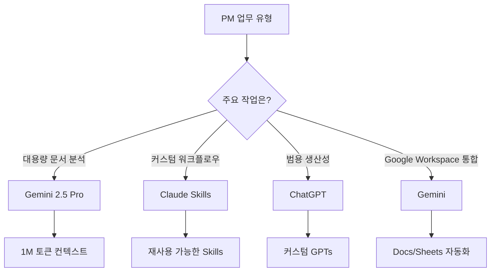
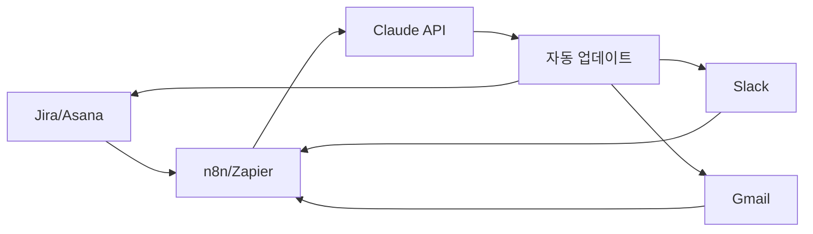
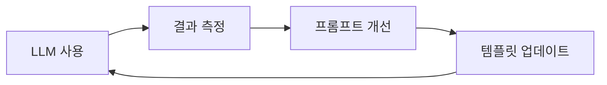

## 들어가며

프로젝트 매니저(PM)의 하루는 회의, 상태 업데이트, 리스크 관리, 이해관계자 커뮤니케이션 등으로 빡빡하게 채워져 있습니다. 2025년 현재, LLM(Large Language Model) 기술의 발전으로 이러한 반복적인 업무를 자동화하여 <strong>전략적 의사결정과 팀 리더십에 집중</strong>할 수 있게 되었습니다.

본 포스트에서는 ChatGPT, Claude, Gemini 같은 최신 LLM 도구를 활용하여 PM 업무를 효율화하는 방법을 실전 사례와 함께 소개합니다.

## PM 업무 자동화가 필요한 이유

### 현재 PM이 직면한 도전 과제

최근 조사에 따르면 PM의 <strong>60〜70%의 시간이 반복적인 행정 업무</strong>에 소비됩니다:

- 회의록 작성 및 요약
- 진행 상황 보고서 작성
- 이메일 및 슬랙 메시지 응답
- 프로젝트 문서 업데이트
- 리스크 및 이슈 추적

### LLM 활용의 이점

LLM을 도입한 조직들은 다음과 같은 성과를 보고하고 있습니다:

- <strong>연간 14,976시간 절감</strong> (Asana Intelligence 사례)
- <strong>계획 수립 시간 65% 감소</strong>
- <strong>예측 정확도 60% 향상</strong>
- 고객 응답 시간 30% 단축

## 주요 LLM 도구 비교

### 1. ChatGPT (OpenAI)

<strong>강점</strong>:
- 가장 범용적이고 사용하기 쉬운 인터페이스
- GPT-4o로 빠른 응답 속도와 멀티모달 기능
- 커스텀 GPTs로 PM 전용 워크플로우 구축 가능
- 대규모 커뮤니티와 플러그인 생태계

<strong>PM 활용 사례</strong>:
```markdown
프롬프트 예시:
"다음 회의록을 요약하고 액션 아이템을 추출해주세요:
[회의록 붙여넣기]

형식:
- 주요 결정사항
- 액션 아이템 (담당자, 마감일 포함)
- 후속 논의 필요 사항"
```

<strong>제한사항</strong>:
- 컨텍스트 윈도우 제한 (GPT-4o: 128K 토큰)
- 실시간 웹 검색 제한적

### 2. Claude (Anthropic)

<strong>강점</strong>:
- <strong>200K 토큰 컨텍스트 윈도우</strong>로 대용량 문서 처리
- Claude Skills로 PM 전용 커스터마이징 가능
- Artifacts 기능으로 구조화된 출력 생성
- 안전하고 윤리적인 AI 응답

<strong>PM 활용 사례</strong>:
```markdown
Claude Skills 예시: "PRD Generator"

입력: 프로젝트 개요, 목표, 제약사항
출력:
1. 프로젝트 배경 및 목표
2. 기능 요구사항 (우선순위 포함)
3. 비기능 요구사항
4. 성공 지표 (KPIs)
5. 리스크 및 의존성
6. 타임라인 초안
```

<strong>제한사항</strong>:
- 이미지 생성 기능 없음
- 플러그인 생태계가 ChatGPT보다 작음

### 3. Gemini (Google)

<strong>강점</strong>:
- <strong>1M 토큰 컨텍스트 윈도우</strong> (Gemini 2.5 Pro)
- Google Workspace 통합 (Docs, Sheets, Gmail)
- 멀티모달 능력 (텍스트, 이미지, 코드, 오디오, 비디오)
- 빠른 Gemini Flash 모델로 실시간 처리

<strong>PM 활용 사례</strong>:
```python
# Gemini API로 프로젝트 리스크 분석 자동화
import google.generativeai as genai

genai.configure(api_key='YOUR_API_KEY')
model = genai.GenerativeModel('gemini-2.5-pro')

prompt = """
다음 프로젝트 상태 보고서를 분석하여 잠재적 리스크를 식별해주세요:
[상태 보고서]

출력 형식:
1. 고위험 리스크 (영향도: 높음, 발생 가능성: 높음)
2. 중위험 리스크 (영향도: 중간, 발생 가능성: 중간)
3. 저위험 리스크 (영향도: 낮음, 발생 가능성: 낮음)
4. 각 리스크에 대한 완화 전략
"""

response = model.generate_content(prompt)
print(response.text)
```

<strong>제한사항</strong>:
- 아직 ChatGPT만큼 대중화되지 않음
- 일부 기능은 Google Workspace 유료 구독 필요

### 도구 선택 가이드



## 자동화 가능한 PM 일일 업무

### 1. 회의 관리

<strong>자동화 전</strong>:
- 회의록 수동 작성: 30분
- 액션 아이템 정리: 15분
- 후속 이메일 발송: 10분
- <strong>총 55분/회의</strong>

<strong>자동화 후 (Claude + n8n)</strong>:
```javascript
// n8n 워크플로우 예시
{
  "nodes": [
    {
      "name": "Zoom Webhook",
      "type": "n8n-nodes-base.webhook",
      "position": [250, 300]
    },
    {
      "name": "Claude API",
      "type": "n8n-nodes-base.httpRequest",
      "parameters": {
        "url": "https://api.anthropic.com/v1/messages",
        "method": "POST",
        "body": {
          "model": "claude-sonnet-4.5",
          "messages": [{
            "role": "user",
            "content": "회의 녹취록을 요약하고 액션 아이템을 추출하세요: {{$json.transcript}}"
          }]
        }
      },
      "position": [450, 300]
    },
    {
      "name": "Send Email",
      "type": "n8n-nodes-base.gmail",
      "position": [650, 300]
    }
  ]
}
```

<strong>결과</strong>: 회의 후 처리 시간 <strong>55분 → 5분 (91% 감소)</strong>

### 2. 진행 상황 보고서 작성

<strong>프롬프트 템플릿</strong>:
```markdown
역할: 당신은 경험 많은 프로젝트 매니저입니다.

입력 데이터:
- 지난주 완료 작업: [Jira/Asana에서 추출]
- 이번주 계획 작업: [로드맵 참조]
- 리스크 및 이슈: [리스크 레지스터]
- 팀 리소스 현황: [리소스 관리 툴]

출력 형식:
## 주간 진행 상황 보고서 (Week XX, 2025)

### 📊 요약
- 전체 진행률: X%
- 완료된 작업: X개
- 진행 중인 작업: X개
- 리스크 상태: 🟢 낮음 / 🟡 중간 / 🔴 높음

### ✅ 이번주 완료 사항
1. [작업명] - [담당자]
2. ...

### 🚀 다음주 계획
1. [작업명] - [담당자] - [예상 완료일]
2. ...

### ⚠️ 리스크 및 차단 요소
1. [리스크 설명] - [영향도] - [완화 계획]
2. ...

### 💡 주요 의사결정 필요 사항
1. ...
```

<strong>시간 절감</strong>: <strong>2시간 → 15분 (87.5% 감소)</strong>

### 3. 이메일 및 슬랙 응답 자동화

<strong>Gmail + Claude 통합</strong>:
```python
# Gmail API + Claude로 이메일 초안 자동 생성
from googleapiclient.discovery import build
import anthropic

def draft_email_response(email_content, context):
    client = anthropic.Anthropic(api_key="YOUR_API_KEY")

    prompt = f"""
    다음 이메일에 대한 전문적인 답변 초안을 작성해주세요.

    원본 이메일:
    {email_content}

    프로젝트 컨텍스트:
    {context}

    답변 톤: 전문적이고 친절하며 간결하게
    """

    message = client.messages.create(
        model="claude-sonnet-4.5",
        max_tokens=1024,
        messages=[{"role": "user", "content": prompt}]
    )

    return message.content[0].text

# 사용 예시
email = "프로젝트 마감일을 2주 앞당길 수 있나요?"
context = "현재 스프린트 2/5, 팀 리소스 80% 활용 중"
draft = draft_email_response(email, context)
print(draft)
```

### 4. 프로젝트 리스크 모니터링

<strong>Gemini + BigQuery 통합</strong>:
```sql
-- BigQuery에서 프로젝트 메트릭 추출
SELECT
  task_id,
  task_name,
  assigned_to,
  due_date,
  status,
  estimated_hours,
  actual_hours,
  CASE
    WHEN actual_hours > estimated_hours * 1.5 THEN 'High Risk'
    WHEN actual_hours > estimated_hours * 1.2 THEN 'Medium Risk'
    ELSE 'Low Risk'
  END AS risk_level
FROM project_tasks
WHERE due_date BETWEEN CURRENT_DATE() AND DATE_ADD(CURRENT_DATE(), INTERVAL 7 DAY)
```

```python
# Gemini로 리스크 분석 및 권장 사항 생성
import google.generativeai as genai

def analyze_project_risks(task_data):
    genai.configure(api_key='YOUR_API_KEY')
    model = genai.GenerativeModel('gemini-2.5-pro')

    prompt = f"""
    다음 프로젝트 작업 데이터를 분석하여:
    1. 마감일 위험이 높은 작업 식별
    2. 리소스 재배치 권장사항
    3. 이해관계자에게 보고할 핵심 메시지

    데이터:
    {task_data}
    """

    response = model.generate_content(prompt)
    return response.text
```

## 구현 전략: 단계별 로드맵

### Phase 1: 파일럿 프로젝트 (1〜2주)

<strong>목표</strong>: LLM 도구의 효과를 검증하고 팀 수용도 확인

**단계**:
1. <strong>도구 선택</strong>: ChatGPT Plus 또는 Claude Pro 구독 시작
2. <strong>유스케이스 선정</strong>: 회의록 요약으로 시작 (가장 시간이 많이 걸리는 작업)
3. <strong>프롬프트 템플릿 개발</strong>: 표준 프롬프트 3〜5개 작성
4. <strong>측정</strong>: 시간 절감 및 품질 평가

**성공 지표**:
- 회의록 작성 시간 50% 이상 감소
- 팀원 만족도 4/5 이상
- 액션 아이템 누락률 0%

### Phase 2: 워크플로우 통합 (2〜4주)

<strong>목표</strong>: 기존 PM 도구와 LLM 통합

**도구 스택 예시**:


**통합 시나리오**:
1. <strong>Jira → Claude → Slack</strong>
   - Jira 이슈 생성 시 자동으로 컨텍스트 분석
   - Slack에 우선순위 및 영향도 분석 결과 전송

2. <strong>Gmail → Claude → 캘린더</strong>
   - 이메일에서 마감일 자동 추출
   - Google Calendar에 자동 이벤트 생성

3. <strong>Zoom → Claude → Notion</strong>
   - 회의 녹취록 자동 요약
   - Notion 프로젝트 페이지에 업데이트

### Phase 3: 고급 자동화 (1〜2개월)

<strong>목표</strong>: AI 에이전트 기반 자율 워크플로우 구축

**Claude Skills 활용**:
```markdown
# Skill: 스프린트 회고 분석기

## 목적
스프린트 회고 데이터를 분석하여 팀 생산성 개선 인사이트 도출

## 입력
- 스프린트 번호
- 완료된 스토리 포인트
- 미완료 사항
- 팀원 피드백 (Keep, Problem, Try 형식)

## 처리
1. 정량적 메트릭 분석 (속도, 완료율)
2. 정성적 피드백 테마 추출
3. 반복되는 문제점 식별
4. 개선 액션 아이템 생성

## 출력
- 스프린트 요약 대시보드
- 팀 생산성 트렌드 차트
- Top 3 개선 권장사항
- 다음 스프린트 목표
```

### Phase 4: ROI 측정 및 최적화 (지속적)

<strong>측정 메트릭</strong>:

| 지표 | 자동화 전 | 자동화 후 | 개선율 |
|------|----------|----------|--------|
| 회의록 작성 시간 | 30분/회의 | 3분/회의 | 90% ↓ |
| 주간 보고서 작성 | 2시간 | 15분 | 87.5% ↓ |
| 이메일 응답 시간 | 10분/건 | 2분/건 | 80% ↓ |
| 리스크 식별 속도 | 주 1회 수동 | 실시간 자동 | 100% ↑ |
| PM 전략 업무 시간 | 20% | 60% | 200% ↑ |

**ROI 계산**:
```python
# PM 시간당 인건비를 10만원으로 가정
hourly_rate = 100000  # 원

# 주당 절감 시간
weekly_hours_saved = 15  # 시간

# 연간 절감 비용
annual_savings = hourly_rate * weekly_hours_saved * 52
# = 7,800만원

# LLM 도구 비용
claude_pro_cost = 20 * 12 * 1300  # 월 $20, 환율 1,300원
chatgpt_plus_cost = 20 * 12 * 1300
total_cost = claude_pro_cost + chatgpt_plus_cost
# = 62.4만원

# ROI
roi = (annual_savings - total_cost) / total_cost * 100
# = 12,396%
```

## 베스트 프랙티스

### 1. 프롬프트 엔지니어링

<strong>효과적인 프롬프트 구조</strong>:
```markdown
[역할 정의] + [컨텍스트] + [작업 설명] + [출력 형식] + [제약사항]

예시:
역할: 당신은 10년 경력의 애자일 프로젝트 매니저입니다.

컨텍스트:
- 프로젝트: E-commerce 플랫폼 리뉴얼
- 팀: 5명 (프론트 2, 백엔드 2, QA 1)
- 스프린트: 2주 단위
- 현재: 스프린트 3/8

작업: 다음 스프린트 계획을 검토하고 리스크를 식별하세요.
[스프린트 계획 붙여넣기]

출력 형식:
1. 스프린트 목표 달성 가능성 (상/중/하)
2. 주요 리스크 3가지
3. 각 리스크에 대한 완화 전략
4. 리소스 재배치 권장사항

제약사항:
- 팀의 평균 속도는 스프린트당 25 스토리 포인트입니다
- 1명의 백엔드 개발자가 다음주 휴가 예정입니다
```

### 2. 데이터 보안 및 개인정보 보호

<strong>주의사항</strong>:
- ❌ 고객 개인정보를 LLM에 직접 입력하지 마세요
- ❌ 회사 기밀 정보는 공개 LLM 사용 금지
- ✅ 민감한 데이터는 익명화 또는 마스킹 처리
- ✅ 기업용 LLM API (Azure OpenAI, Anthropic Enterprise) 사용
- ✅ 데이터 보유 정책 확인 (Claude는 기본 30일 보관)

**데이터 마스킹 예시**:
```python
import re

def mask_sensitive_data(text):
    # 이메일 마스킹
    text = re.sub(r'\b[A-Za-z0-9._%+-]+@[A-Za-z0-9.-]+\.[A-Z|a-z]{2,}\b',
                  '[EMAIL]', text)

    # 전화번호 마스킹
    text = re.sub(r'\d{2,3}-\d{3,4}-\d{4}', '[PHONE]', text)

    # 이름 마스킹 (한국 이름 패턴)
    text = re.sub(r'[가-힣]{2,4}(?=\s?(님|씨|대리|과장|부장))',
                  '[NAME]', text)

    return text

# 사용 예시
meeting_notes = """
홍길동 부장님이 john.doe@company.com으로 010-1234-5678에 연락하라고 하셨습니다.
"""
masked_notes = mask_sensitive_data(meeting_notes)
# "[NAME] 부장님이 [EMAIL]으로 [PHONE]에 연락하라고 하셨습니다."
```

### 3. 팀 교육 및 변화 관리

<strong>도입 체크리스트</strong>:
- [ ] 킥오프 미팅: LLM 도구의 이점과 사용법 공유
- [ ] 핸즈온 워크숍: 실제 PM 업무로 실습
- [ ] 프롬프트 라이브러리: 팀 공용 템플릿 구축
- [ ] 챔피언 지정: 각 팀에 LLM 전문가 육성
- [ ] 정기 리뷰: 월 1회 효과 측정 및 개선

### 4. 지속적인 개선

<strong>피드백 루프</strong>:


**개선 방법**:
- 효과가 좋은 프롬프트는 팀 라이브러리에 추가
- 주간 LLM 팁 공유 (Slack 채널 활용)
- 새로운 유스케이스 발굴 (팀 브레인스토밍)

## 피해야 할 함정

### 1. 과도한 의존

❌ <strong>잘못된 사용</strong>:
```markdown
"프로젝트 계획을 전부 만들어줘"
```

✅ <strong>올바른 사용</strong>:
```markdown
"다음 프로젝트 계획 초안을 검토하고 빠진 부분을 지적해줘:
[계획 초안 붙여넣기]
"
```

**원칙**: LLM은 <strong>보조 도구</strong>이지 대체재가 아닙니다.

### 2. 컨텍스트 부족

❌ <strong>잘못된 프롬프트</strong>:
```markdown
"리스크를 분석해줘"
```

✅ <strong>개선된 프롬프트</strong>:
```markdown
"다음 정보를 기반으로 프로젝트 리스크를 분석해줘:
- 프로젝트: [프로젝트명]
- 현재 단계: [단계]
- 팀 구성: [구성원]
- 마감일: [날짜]
- 현재 이슈: [이슈 목록]
"
```

### 3. 출력 검증 생략

<strong>체크리스트</strong>:
- [ ] LLM 출력이 프로젝트 컨텍스트에 맞는가?
- [ ] 날짜, 숫자, 이름 등이 정확한가?
- [ ] 톤과 스타일이 조직 문화에 맞는가?
- [ ] 법적/윤리적 문제가 없는가?

## 실제 성공 사례

### 사례 1: Asana Intelligence

<strong>조직</strong>: 글로벌 금융 서비스 기업

<strong>도입 배경</strong>:
- 연구 파이프라인 관리의 병목 현상
- 수동 작업으로 인한 지연
- 리소스 배분의 비효율

<strong>솔루션</strong>:
- Asana Intelligence를 활용한 워크플로우 자동화
- AI 기반 작업 우선순위 지정
- 자동 상태 업데이트 및 알림

<strong>결과</strong>:
- <strong>연간 14,976시간 절감</strong>
- 프로젝트 완료율 35% 향상
- 2025 AI Visionary Work Innovation Award 수상

### 사례 2: ClickUp Brain

<strong>조직</strong>: 스타트업 제품 팀 (30명)

<strong>도입 배경</strong>:
- 빠른 제품 출시 요구
- 제한된 PM 리소스
- 여러 프로젝트 동시 진행

<strong>솔루션</strong>:
- ClickUp Brain으로 프로젝트 브리프 자동 생성
- RACI 매트릭스 자동 구성
- AI 지식 매니저로 컨텍스트 공유

<strong>결과</strong>:
- 프로젝트 킥오프 시간 70% 단축
- 팀 얼라인먼트 개선 (NPS +25점)
- PM이 전략 업무에 60% 시간 할애 가능

## 2025년 트렌드 및 전망

### 1. Agentic AI의 부상

<strong>에이전틱 AI</strong>란:
- 단순 질의응답을 넘어 <strong>자율적으로 작업을 수행</strong>하는 AI
- 여러 도구를 연결하여 복잡한 워크플로우 실행
- 사람의 승인을 받아 실제 액션 수행

**예시**: Claude Computer Use
```markdown
PM: "다음주 스프린트 계획을 Jira에 생성하고 팀에 공지해줘"

Claude:
1. Jira API로 스프린트 생성
2. 스토리 우선순위 기반으로 백로그에서 아이템 선택
3. 각 아이템에 담당자 자동 배정
4. Slack에 스프린트 킥오프 메시지 전송
5. 캘린더에 스프린트 리뷰 미팅 예약

PM: [각 단계 승인 후 실행]
```

### 2. 멀티모달 PM 도구

<strong>텍스트 + 이미지 + 음성 통합</strong>:
- Gemini 2.5의 멀티모달 기능으로 <strong>회의 비디오를 직접 분석</strong>
- 화이트보드 사진을 찍으면 자동으로 Miro/Figma로 변환
- 음성 명령으로 프로젝트 업데이트

### 3. 실시간 협업 AI

<strong>실시간 컨텍스트 인식</strong>:
- Google Workspace와 Gemini 통합으로 <strong>문서 작성 중 실시간 제안</strong>
- Slack 대화 흐름을 분석하여 자동 액션 아이템 생성
- 코드 리뷰 중 실시간 기술 문서 참조

## 시작하기: 첫 1주 액션 플랜

### Day 1: 도구 선택 및 설정
- [ ] ChatGPT Plus 또는 Claude Pro 구독
- [ ] 첫 프롬프트 실험: 최근 회의록 요약해보기
- [ ] 결과 평가 및 피드백

### Day 2-3: 프롬프트 템플릿 개발
- [ ] 가장 시간이 많이 걸리는 작업 3가지 선정
- [ ] 각 작업에 대한 프롬프트 템플릿 작성
- [ ] 실제 데이터로 테스트 및 개선

### Day 4-5: 팀 공유 및 피드백
- [ ] 팀 미팅에서 LLM 시연
- [ ] 프롬프트 라이브러리 공유 (Notion/Confluence)
- [ ] 팀원 피드백 수집

### Day 6-7: 워크플로우 통합 계획
- [ ] 기존 PM 도구 (Jira, Asana, Slack) 파악
- [ ] 통합 가능한 자동화 시나리오 3가지 선정
- [ ] 다음 스프린트에 파일럿 프로젝트 계획

## 결론

LLM을 활용한 프로젝트 관리 자동화는 더 이상 미래의 이야기가 아닙니다. ChatGPT, Claude, Gemini 같은 도구들은 이미 <strong>PM의 생산성을 3배 이상 향상</strong>시키고 있으며, 2025년에는 더욱 강력한 기능들이 출시될 예정입니다.

핵심은 <strong>작게 시작하여 점진적으로 확장</strong>하는 것입니다. 회의록 요약 같은 간단한 작업부터 시작하여, 팀의 피드백을 받아 개선하고, 궁극적으로는 자율적인 AI 에이전트 워크플로우까지 발전시킬 수 있습니다.

LLM은 PM을 대체하는 것이 아니라, <strong>반복적인 업무에서 해방시켜 전략적 의사결정과 팀 리더십에 집중</strong>할 수 있게 해줍니다. 지금 바로 시작하여 당신의 PM 워크플로우를 혁신해보세요.

## 참고 자료

- [Anthropic Claude Skills 공식 문서](https://www.anthropic.com/claude-skills)
- [Asana Intelligence 성공 사례](https://asana.com/ai)
- [n8n AI Workflows 가이드](https://n8n.io/workflows/ai)
- [ClickUp Brain 활용법](https://clickup.com/features/ai)
- [HBR: Why Agentic AI Projects Fail](https://hbr.org/2025/10/why-agentic-ai-projects-fail)
