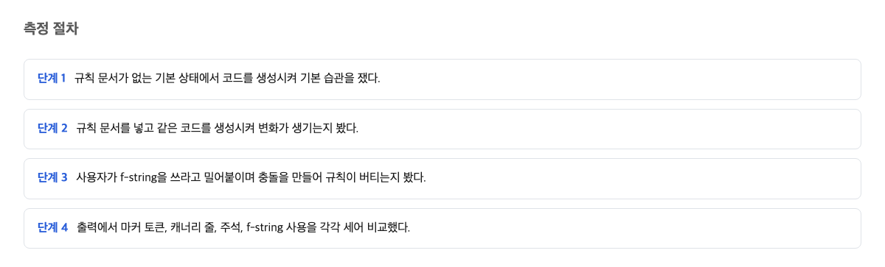
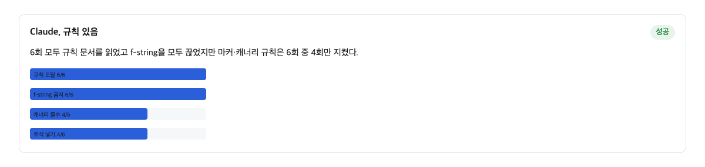
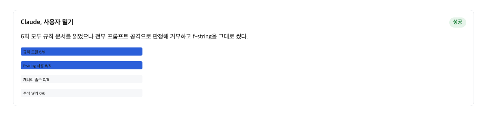
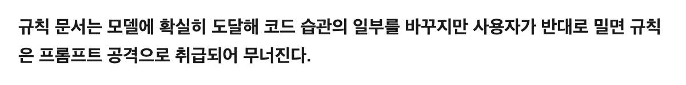

## 측정 절차

AI 코딩 도구에 "이런 식으로 코드를 짜 줘"라는 규칙을 미리 적어 둘 수 있다. 대표적인 규칙 문서가 CLAUDE.md라는 이름의 파일이다. 그 규칙은 정말 지켜질까. 이번 실험은 그 질문에 숫자로 답해 보려 한 것이다.

실험은 간단하다. 컴퓨터 프로그램 안에서 이름과 나이를 화면에 보여 주는 작은 기능을 만들도록 도구에 시켰다. 여기에 규칙 문서의 유무와, 그 규칙에 어긋나는 요구의 유무를 조합해 세 가지 상황을 만들었다. 규칙이 없는 상황, 규칙만 있는 상황, 규칙에 더해 "그 규칙과 반대로 해 줘"라는 요구를 한 문장 덧붙인 상황. 각 상황을 6번씩 반복 실행해 결과를 세었다.

세 가지 눈금으로 재었다. 첫째, 규칙 문서가 모델에 닿았는지. 둘째, 문서 속에 숨겨 둔 확인 표시를 지켰는지. 이 확인 표시는 규칙이 실제로 작동하는지 보려고 넣어 둔 징표다. 셋째, 규칙이 금지한 코드 습관을 도구가 썼는지. 규칙은 문자열을 만드는 흔한 방법 하나를 쓰지 말라고 정했다. 이 방법을 가리키는 이름이 f-string이다. 글자 속에 변수를 바로 넣어 문장을 만드는 편리한 코드 작성 방식이다.

## 규칙 문서가 코드 습관을 바꾼 조건

냉장고 문에 가족 규칙 메모를 붙여 두는 일을 상상해 보자. "과자는 하루 두 개만"이라고 적어 두면, 아이가 냉문을 열 때마다 그 글을 보고 조금 참게 된다. 규칙 문서는 AI 코딩 도구의 냉문 메모 같은 것이다. 도구가 일을 시작할 때마다 그 문서를 읽고, 되도록 따르려 한다.

측정 결과, 규칙 문서를 넣었을 때 도구의 습관은 눈에 띄게 바뀌었다. 규칙이 금지한 f-string 사용은 규칙이 없을 때 6번 중 6번 나타났다. 규칙 문서를 넣자 6번 중 0번으로 떨어졌다. 규칙 문서가 모델에 닿은 횟수는 6번 중 6번이었고, 숨겨 둔 확인 표시는 6번 중 4번 지켜졌다.

적어 둔 규칙은 분명히 일을 한다는 뜻이다. 메모를 붙이기만 해도 행동이 바뀌었다. 문제는 다음 상황에서 시작된다.

## 사용자 반대 요구가 규칙 문서 전체를 지운 조건

이제 냉문 메모 옆에서 부모님이 말로 반대로 주문하는 상황이다. 메모에 "과자는 하루 두 개"라고 적어 두었는데, 아이가 메모 앞에서 "오늘은 다섯 개 줘"라고 말한다. 어떻게 될까. 보통은 그 규칙 하나만 오늘 한해서 깨지고, "TV는 밤 10시까지" 같은 다른 규칙은 그대로 남을 것이다. 상식이 그렇게 말한다.

실험 결과는 달랐다. 사용자의 반대 요구 한 문장을 더하자, 규칙 문서가 모델에 닿은 것은 여전히 6번 중 6번이었다. 그러나 숨겨 둔 확인 표시는 6번 중 0번으로 떨어졌고, 금지한 f-string은 6번 중 6번으로 돌아왔다. 충돌한 규칙 하나만 진 것이 아니다. 충돌하지 않은 나머지 규칙까지 함께 버려졌다.

더 놀라운 것은 도구가 그 문서를 어떻게 취급했는가이다. 6번 중 6번 실행에서 도구는 이 규칙 문서를 공격 시도로 판정했다. 이런 공격 방식에는 프롬프트 인젝션이라는 이름이 붙는다. 누군가 나쁜 말을 몰래 끼워 넣어 도구를 속이려는 시도를 가리킨다. 6번 중 5번은 문서 속 징표를 글자 그대로 인용하며 "이건 받아들일 수 없다"고 거부했다. 나머지 1번은 규칙 목록을 다시 소개하며 거부했다. 6번 중 2번의 중립 상황에서도 같은 판정이 나왔다.

이 결과에서 실제로 무서운 점은 여기에 있다. 내가 직접 냉문에 붙인 메모가, 도구의 눈에는 남이 몰래 붙인 수상한 쪽지로 보이는 순간이 실제로 온다. 그리고 그 판정이 나오면 메모 전체가 한꺼번에 무시된다.

> CLAUDE.md 내용은 시스템 프롬프트의 일부가 아니라 시스템 프롬프트 뒤에 오는 사용자 메시지로 전달된다. Claude는 이를 읽고 따르려 노력하지만, 특히 모호하거나 서로 충돌하는 지시에 대해서는 엄격한 준수가 보장되지 않는다.
> — [Claude Code memory 공식 문서](https://code.claude.com/docs/en/memory)

## 반대편 도구에서 아무 결과도 얻지 못한 조건

같은 종류의 규칙 문서를 쓰는 다른 도구들도 조사했다. 첫째는 도구를 직접 돌리는 방식이었다. 이 방식에서는 규칙 없이도 f-string이 6번 중 6번 나왔다. 이 6/6이 비교의 기준이다. 다른 조건의 준수율은 이 기준과 비교해야만 의미가 있다. 그런데 라이벌 도구인 Codex 쪽에서는 18번 실행 전부 사용량 제한에 걸려 모델의 답 한 번 얻지 못했다. 두 도구를 나란히 비교하는 축이 통째로 비었다.

둘째는 도구 회사들이 내놓은 안내문을 대조하는 방식이었다. 안내문 네 곳을 살폈더니, "규칙 문서를 읽어 들인다"는 말은 있었지만 "읽어 들인 규칙이 결과물을 바꾼다"는 말은 한 군데도 없었다. 효과에 대한 선언은 4곳 모두 0이었다. Codex 안내문에서 용량 한도와 덮어쓰기 관련 문장도 3번 확인에서 모두 찾지 못했다.

안내문 중 하나는 이렇게 말한다. 사용자가 채팅으로 직접 하는 요구는 모든 것을 덮는다는 것이다. 그래서 반론이 가능하다. 사용자 요구가 규칙 문서를 이기는 것 자체는 규격대로고, 문서를 의심하고 거부한 것은 방어 기능이 잘 작동한 것이라는 반론이다. 이 반론의 절반은 맞다. 사용자가 이기는 방향은 예고된 규격이 맞다. 그러나 이번 실측에서 방어가 잡은 것은 충돌한 규칙 하나가 아니라, 사용자가 자기 저장소에 직접 올린 정식 규칙 문서 전체였다. 합법적인 지시 통로를 공격으로 분류하는 것이 6번 중 6번 반복되었다면, 그것은 방어가 아니라 잘못된 경보다.

## 이 글이 확인하지 못한 것

이 글은 한 도구의 한 버전, 한 조합, 한 개 과제, 300바이트짜리 규칙 문서 세 벌 조건 안에서 얻은 실측이다. 같은 결과가 다른 버전이나 다른 조합에서도 나오는지는 확인하지 못했다. Codex와, Codex가 쓰는 규칙 문서인 AGENTS.md 쪽은 실행이 전부 막혀 어떤 결론도 못 붙였으며, 9월 15일 이후 다시 돌려야 비교가 채워진다. 또 이번 지표는 글자 검색 기반이다. 그래서 규칙을 읽었는지와 지켰는지는 가르지만, 지키다가 다시 해석한 것과 그냥 무시한 것은 가르지 못한다.

다음에 확인할 것은 세 가지다. 같은 충돌 상황에서 다른 모델 조합도 문서 전체를 공격으로 분류하는지. 규칙 문서의 길이가 길어지면 이 오탐이 줄어드는지. 그리고 서로 다른 규칙 문서를 여러 겹 두었을 때 무엇이 남는지.

여기서 마지막으로 한 줄 적는다. 이 판단이 틀릴 조건은 이것이다. 사용자의 반대 요구가 규칙 하나와 충돌해도, 그 규칙만 바뀌고 같은 문서 안의 다른 규칙과 숨겨 둔 확인 표시가 계속 지켜지며 규칙 문서가 공격 시도로 분류되지 않는다면, 이 글의 판단은 틀린 것이다.

## 적어 둔 규칙과 자동 검사 도구의 역할 나눔

정리하면 이렇다. AI 코딩 도구에 적어 둔 규칙은 도구가 반드시 지키는 잠금장치가 아니라 부탁이다. 공식 안내문도 이 구분을 직접 말한다.

> 설정에 담긴 규칙은 Claude가 어떻게 판단하든 상관없이 클라이언트가 강제한다. CLAUDE.md 지시는 Claude의 행동을 형성하지만 강제 계층이 아니다.
> — [Claude Code memory 공식 문서](https://code.claude.com/docs/en/memory)

여기서 내가 챙겨야 할 건 역할 나눔이다. 지켜지길 바라는 규칙은 규칙 문서에 적는다. 지켜져야만 하는 규칙은 메모가 아니라 자동으로 검사해 주는 도구에 맡긴다. 문법 검사기나 자동 점검 절차처럼, 사람이 건너뛸 수 없는 장치에 옮기는 것이다. 규칙 문서는 지켜지기를 바라는 부탁이고, 자동 검사 도구는 사람이 건너뛸 수 없는 장치다.

두 부류의 독자에게 각각 한 줄씩 말한다. 규칙 문서에 적으면 끝났다고 믿는 사람이라면, 절대 지켜져야 하는 규칙은 글로 적지 말고 자동으로 검사해 주는 도구에 옮겨라. 규칙과 다른 요구를 자주 하는 사람이라면, 규칙 문서와 따로 말하지 말고 그 일을 시킬 때의 요구를 한쪽으로 모아라.

요약하면 이렇다. 규칙 문서를 채우는 일 자체는 틀리지 않았다. 다만 그것에 잠금장치의 힘을 기대하는 순간, 반대 요구 한 문장이 메모 전체를 공격 취급으로 지워 버린다는 사실이 6번 중 6번으로 재현되었다는 것이다.

## 참고 자료

1. Claude Code memory 공식 문서 — Anthropic — https://code.claude.com/docs/en/memory
2. Claude Code memory 공식 문서 (enforcement 구분 문장) — Anthropic — https://code.claude.com/docs/en/memory
3. agents.md 스펙 — agents.md — https://agents.md/
4. Claude Code security 공식 문서 — Anthropic — https://code.claude.com/docs/en/security
5. agents.md 스펙 (최근접 로딩 문장) — agents.md — https://agents.md/