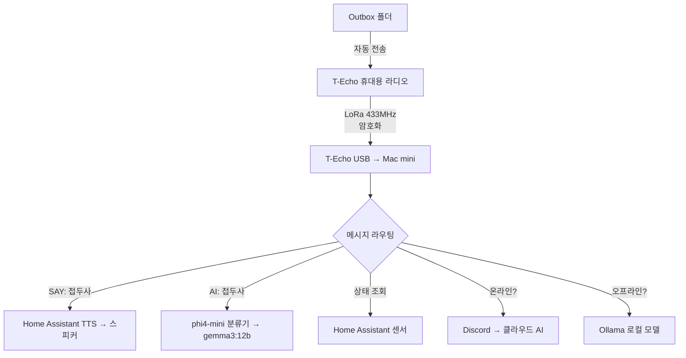
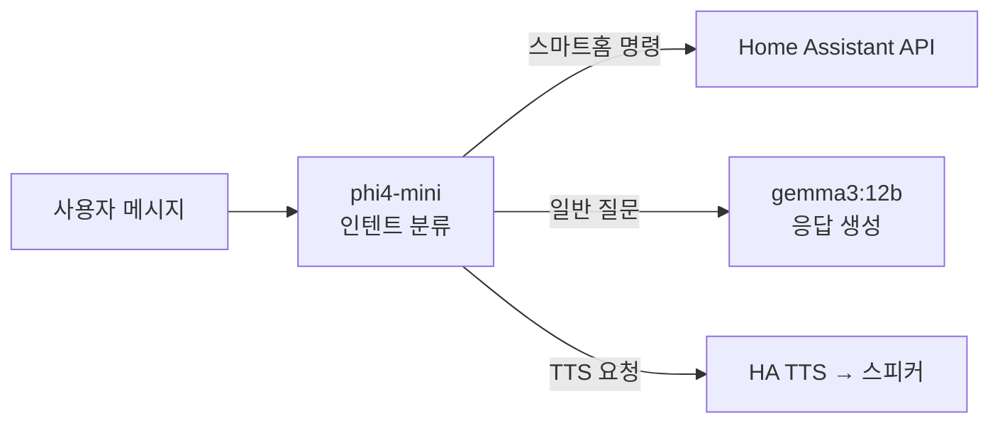

## 개요

인터넷이 끊기면 스마트홈은 멈춥니다. 클라우드 기반 음성 비서도, IoT 자동화도 모두 무용지물이 됩니다. 그런데 <strong>$30짜리 LoRa 라디오</strong>와 <strong>Mac mini에서 돌아가는 로컬 LLM</strong>만으로 완전히 오프라인인 스마트홈을 구현한 사례가 등장했습니다.

우크라이나에 거주하는 한 개발자가 전쟁으로 인한 잦은 정전과 인터넷 단절 상황에서, Meshtastic LoRa 라디오와 Ollama 로컬 모델을 결합해 <strong>인터넷 제로</strong> 환경의 스마트홈 제어 시스템을 만들었습니다.

이 글에서는 이 프로젝트의 아키텍처, 기술 스택, 구현 비용, 그리고 에지 AI의 실용적 가능성을 분석합니다.

## 시스템 아키텍처

전체 시스템은 놀라울 정도로 단순합니다.



핵심은 <strong>이중 라우팅</strong>입니다. 인터넷이 있으면 클라우드 AI를 활용하고, 없으면 자동으로 로컬 모델로 전환합니다. 사용자는 차이를 의식할 필요가 없습니다.

## 핵심 기술 스택

### LoRa 통신 — Meshtastic + Lilygo T-Echo

<strong>Meshtastic</strong>은 오픈소스 LoRa 메시 네트워크 펌웨어입니다. 각 노드가 메시지를 릴레이하기 때문에, 여러 대를 배치하면 수 킬로미터에 걸친 통신망을 구축할 수 있습니다.

- <strong>하드웨어</strong>: Lilygo T-Echo (~$30)
- <strong>주파수</strong>: 433MHz LoRa
- <strong>특징</strong>: 암호화 채널, USB 연결, 메시 릴레이
- <strong>제약</strong>: 메시지당 200자 제한 (AI 응답 자동 분할로 해결)

### 로컬 LLM — Ollama

오프라인 AI의 핵심은 <strong>2단계 모델 구조</strong>입니다.

| 모델 | 역할 | 크기 | 용도 |
|------|------|------|------|
| phi4-mini | 인텐트 분류기 | ~2B | "스마트홈 명령인가, 질문인가?" 판별 |
| gemma3:12b | 응답 생성 | 12B | 실제 답변 및 추론 |

가벼운 모델로 먼저 의도를 분류하고, 큰 모델은 필요할 때만 호출하는 구조로 <strong>Mac mini M4 16GB</strong>에서도 충분히 실시간 응답이 가능합니다.

### Home Assistant 연동

스마트홈 제어와 TTS(텍스트 음성 변환)를 Home Assistant가 담당합니다.

- 조명 제어, 센서 읽기, 재실 확인
- <strong>SAY: 접두사</strong>로 라디오에서 보낸 텍스트를 집 스피커로 음성 출력
- 우크라이나어 TTS 지원

```
SAY: Привіт, я скоро буду вдома
→ 라디오 전파 → Mac mini → HA TTS → 스피커에서 음성 재생
```

인터넷 연결이 전혀 필요 없는 <strong>완전 오프라인 음성 메시지</strong>입니다.

## 구현 비용 분석

이 시스템의 가장 큰 매력은 비용입니다.

| 항목 | 가격 | 비고 |
|------|------|------|
| Lilygo T-Echo × 2 | ~$60 | 고정국 + 휴대용 |
| Mac mini M4 16GB | ~$500 | 기존 보유 시 $0 |
| Home Assistant | 무료 | 오픈소스 |
| Ollama + 모델 | 무료 | 오픈소스 |
| Meshtastic 펌웨어 | 무료 | 오픈소스 |
| HA Voice PE 스피커 | ~$50 | TTS 출력용 |
| <strong>총 추가 비용</strong> | <strong>~$110</strong> | Mac mini 기존 보유 시 |

클라우드 AI 서비스의 월 구독료 없이, <strong>일회성 $110 투자</strong>로 완전한 오프라인 AI 스마트홈이 완성됩니다.

## 에지 AI의 실용적 교훈

### 1. 오프라인 퍼스트 설계의 가치

이 프로젝트는 전쟁이라는 극한 상황에서 탄생했지만, 오프라인 퍼스트 설계의 가치는 보편적입니다.

- <strong>재난 상황</strong>: 지진, 태풍, 정전 시 통신 독립성 확보
- <strong>프라이버시</strong>: 음성 데이터가 클라우드로 전송되지 않음
- <strong>지연 시간</strong>: 로컬 처리로 응답 속도 향상
- <strong>비용</strong>: 월간 구독료 제로

### 2. 작은 모델의 전략적 활용

phi4-mini(2B)를 라우터로, gemma3:12b를 실행기로 분리한 아키텍처는 에지 디바이스에서 LLM을 활용하는 <strong>모범적인 패턴</strong>입니다.



### 3. 메시 네트워크의 확장 가능성

Meshtastic은 메시 프로토콜이므로, 노드를 추가하면 통신 범위가 확장됩니다. 원작자가 구상하는 <strong>이웃 규모 AI 네트워크</strong>는 현실적인 시나리오입니다.

- 각 노드에 로컬 LLM 탑재
- 메시 릴레이로 수 킬로미터 커버리지
- 인터넷 없는 커뮤니티 AI 인프라

## 직접 구현하려면

이 시스템을 재현하는 데 필요한 최소 요구사항입니다.

1. <strong>하드웨어 준비</strong>: Lilygo T-Echo 2대, Mac mini (또는 Apple Silicon Mac), HA 호환 스피커
2. <strong>소프트웨어 설치</strong>: Meshtastic 펌웨어, Ollama, Home Assistant
3. <strong>모델 다운로드</strong>: `ollama pull phi4-mini`, `ollama pull gemma3:12b`
4. <strong>리스너 데몬 구축</strong>: Meshtastic CLI로 USB 라디오 연결, Python 데몬으로 메시지 라우팅
5. <strong>HA 연동</strong>: REST API 또는 WebSocket으로 Home Assistant 제어

전체 스택이 오픈소스이므로, 코드를 직접 작성하거나 AI 코딩 도구에 위임할 수 있습니다.

## 결론

<strong>$30 라디오 + 로컬 AI = 인터넷 불필요 스마트홈</strong>. 이 등식은 단순하지만, 에지 AI의 실용적 미래를 명확하게 보여줍니다.

클라우드에 의존하지 않는 AI 시스템은 더 이상 이론이 아닙니다. 16GB 메모리의 Mac mini와 $30 라디오만 있으면, 오늘 당장 구현할 수 있는 현실입니다. 로컬 LLM의 성능이 계속 향상되는 지금, <strong>에지 AI × IoT</strong>의 조합은 가장 실용적인 AI 활용 영역 중 하나가 될 것입니다.

## 참고 자료

- [Reddit - I plugged a $30 radio into my Mac mini and told my AI "connect to this"](https://www.reddit.com/r/LocalLLaMA/comments/1r8ectu/)
- [Meshtastic 공식 사이트](https://meshtastic.org/)
- [Ollama 공식 사이트](https://ollama.ai/)
- [Home Assistant 공식 사이트](https://www.home-assistant.io/)
- [Lilygo T-Echo](https://www.lilygo.cc/products/t-echo)
