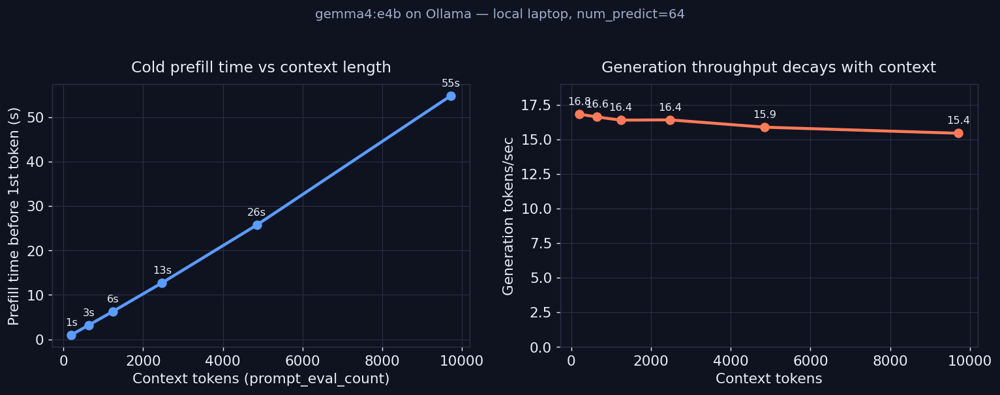

내 맥북에서 로컬 에이전트를 돌리다 보면 대화가 길어질수록 응답이 눈에 띄게 굼떠진다. "체감상 느려진다"는 알고 있었지만, 정확히 어느 단계가 얼마나 느려지는지는 몰랐다. 그래서 Ollama가 응답마다 돌려주는 타임스탬프를 직접 뜯어 측정해봤다.

결과부터 적으면 이렇다. 같은 9,700토큰짜리 프롬프트를 두 번 보냈더니, 첫 호출은 첫 토큰이 나오기까지 약 55초가 걸렸고 두 번째 호출은 65밀리초 만에 처리됐다. 같은 입력인데 약 396배 차이다. 이 한 줄이 로컬 LLM 지연의 거의 모든 걸 설명한다.

## Ollama가 응답에 숨겨둔 스톱워치

대부분의 사람은 Ollama를 채팅 UI나 `ollama run`으로만 쓴다. 그런데 `/api/generate`를 `stream:false`로 호출하면 응답 JSON에 정밀한 타이밍 필드가 같이 온다. [Ollama API 문서](https://github.com/ollama/ollama/blob/main/docs/api.md)에 명시된 필드들이다.

- `prompt_eval_count`: 입력 프롬프트의 토큰 수
- `prompt_eval_duration`: 프롬프트를 처리하는 데 든 시간(= prefill)
- `eval_count`: 생성한 토큰 수
- `eval_duration`: 토큰을 생성하는 데 든 시간(= generation)
- 모든 duration은 나노초 단위

여기서 핵심은 LLM 추론이 성격이 전혀 다른 두 단계로 쪼개진다는 점이다. <strong>prefill</strong>은 내가 넣은 프롬프트 전체를 한 번에 읽어 KV 캐시를 채우는 단계다. 첫 토큰이 나오기 직전까지가 여기다. <strong>generation</strong>은 그 뒤로 토큰을 한 개씩 자기회귀적으로 뽑는 단계다. 둘은 비용 구조가 다르고, 컨텍스트가 길어질 때 반응하는 방식도 다르다. 그걸 분리해서 보고 싶었다.

측정 스크립트는 표준 라이브러리만으로 짧게 짰다. 컨텍스트 길이를 바꿔가며 같은 질문을 던지고, 응답의 타이밍 필드를 긁어 토큰/초로 환산한다.

```python
import json, urllib.request, statistics as st

OLLAMA = "http://localhost:11434/api/generate"
MODEL  = "gemma4:e4b"

def call(prompt):
    body = json.dumps({
        "model": MODEL, "prompt": prompt, "stream": False,
        "options": {"num_predict": 64, "seed": 42, "temperature": 0}
    }).encode()
    req = urllib.request.Request(OLLAMA, data=body,
                                headers={"Content-Type": "application/json"})
    with urllib.request.urlopen(req, timeout=900) as r:
        d = json.load(r)
    pe_n, pe_d = d["prompt_eval_count"], d["prompt_eval_duration"] / 1e9
    ev_n, ev_d = d["eval_count"], d["eval_duration"] / 1e9
    return {
        "ctx": pe_n,
        "prefill_s": pe_d,
        "prefill_tps": pe_n / pe_d,        # prefill 처리 속도
        "gen_tps": ev_n / ev_d,            # 생성 속도
    }
```

한 가지 함정을 먼저 처리해야 했다. 같은 프롬프트를 반복하면 캐시 때문에 prefill이 거의 0이 된다(뒤에서 다룬다). "차가운(cold)" prefill을 정직하게 재려면 매 호출의 프롬프트 <strong>맨 앞</strong>부터 달라야 한다. 그래서 프롬프트 머리에 매번 다른 난수 ID를 붙이고, 본문도 시드를 바꿔 채웠다. 측정 모델은 가볍게 돌리려고 `gemma4:e4b`를 골랐고, 첫 호출 전에 한 번 워밍업해서 모델 로딩 시간(`load_duration`)이 측정에 섞이지 않게 했다.

## 컨텍스트가 길수록 첫 토큰이 늦게 나온다

먼저 차가운 prefill부터. 컨텍스트를 약 200토큰에서 9,700토큰까지 늘리며 첫 토큰까지 걸리는 시간을 쟀다.

| 컨텍스트(토큰) | cold prefill | prefill tok/s | generation tok/s | 토큰당 생성(ms) |
|---:|---:|---:|---:|---:|
| 200 | 1.0초 | 197.8 | 16.81 | 59.5 |
| 644 | 3.2초 | 198.4 | 16.61 | 60.2 |
| 1,244 | 6.3초 | 197.6 | 16.38 | 61.1 |
| 2,476 | 12.7초 | 194.6 | 16.40 | 61.0 |
| 4,852 | 25.7초 | 188.6 | 15.87 | 63.0 |
| 9,716 | 54.8초 | 177.3 | 15.43 | 64.8 |



왼쪽 그래프가 거의 직선이다. 컨텍스트가 48배(200 → 9,716) 늘자 prefill 시간이 1초에서 55초로 약 54배 늘었다. 대략 비례한다. 직관적으로 당연하다. 토큰이 많을수록 읽을 게 많으니까.

흥미로운 건 prefill <strong>속도</strong>(tok/s)다. 컨텍스트가 짧을 땐 198 tok/s였는데 1만 토큰 근처에선 177 tok/s로 약 10% 떨어졌다. 즉 토큰 하나를 처리하는 비용 자체가 컨텍스트가 길수록 비싸진다. 내가 이해하기로는 어텐션이 시퀀스 길이에 제곱으로 붙는 비용이라 그렇다. 짧은 글에서 단어 하나를 읽는 것보다, 긴 글의 끝에서 단어 하나를 읽으며 앞 전체를 다시 참조하는 게 더 무겁다. 그래서 prefill은 "토큰 수에 비례"하는 것보다 살짝 더 가파르게 는다.

여기서 첫 번째 실전 교훈. 로컬 에이전트의 응답이 느린 주범은 보통 생성 속도가 아니라 prefill이다. RAG로 문서 5개를 욱여넣거나, 직전 대화 20턴을 통째로 다시 보내면, 모델이 첫 글자를 쓰기도 전에 수십 초가 날아간다. 클라우드 API에선 이 비용이 [데이터 형식에 따라 토큰 수가 달라지며 요금으로](/ko/blog/ko/llm-token-cost-data-format-experiment) 청구되지만, 로컬에선 고스란히 내 시간으로 청구된다.

스트리밍 UI를 쓴다면 이 prefill 시간이 곧 사용자가 빈 화면이나 로딩 스피너를 응시하는 시간이라고 보면 된다. 일단 토큰이 흘러나오기 시작하면 그 뒤로는 초당 16개씩 제법 빠르게 채워진다. 문제는 그 첫 글자가 뜨기까지다. 컨텍스트가 길수록 사용자는 "멈춘 거 아닌가" 싶은 침묵을 더 오래 견뎌야 한다. 로컬 챗봇의 체감 반응성을 좌우하는 건 결국 이 침묵의 길이지, 토큰이 흐르는 속도가 아니다. 9,700토큰 컨텍스트에서 55초 동안 아무것도 안 뜨면, 그건 대화형으로 쓸 수 있는 도구가 아니다.

## 생성 속도도 슬그머니 느려진다

오른쪽 그래프는 변화가 작아서 무시하기 쉬운데, 그래서 더 짚고 싶다. 생성 속도가 16.81 tok/s에서 15.43 tok/s로 약 8% 떨어졌다. 토큰 하나 뽑는 시간으로 환산하면 59.5ms에서 64.8ms로 늘었다.

왜 그럴까. 생성 단계에서 새 토큰 하나를 만들 때마다 모델은 앞에 쌓인 KV 캐시 전체를 어텐션으로 다시 훑는다. 컨텍스트가 길면 훑을 대상이 많아지니 토큰당 시간이 조금씩 늘어난다. 이것도 어텐션이 길이에 민감하다는 같은 이유다.

다만 솔직히 말하면, 이 8%는 prefill 앞에서는 곁가지다. 1만 토큰 컨텍스트에서 64토큰을 생성하는 데 약 4초가 드는데, 그 앞단 prefill이 55초였다. 체감 지연의 90% 이상이 첫 토큰 전에서 벌어진다. 그래서 나는 "생성을 더 빠른 모델로 바꾸자"보다 "프롬프트를 짧게, 그리고 캐시되게 만들자"가 훨씬 큰 레버라고 본다.

## 두 번째 호출이 396배 빨랐던 이유

이 실험에서 가장 인상 깊었던 건 캐시였다. 4,859토큰짜리 동일한 프롬프트를 연달아 두 번 보냈다.

| 호출 | prompt_eval_count | prefill 시간 |
|---|---:|---:|
| 첫 번째 (cold) | 4,859 | 25,751ms |
| 두 번째 (warm) | 4,859 | 65ms |

`prompt_eval_count`는 두 번 다 4,859로 똑같이 찍혔다. 토큰 수는 그대로인데 prefill 시간만 약 396배 줄었다. 토큰을 "안 읽은" 게 아니라, 이미 계산해둔 KV 캐시를 재사용해서 다시 계산할 필요가 없었던 거다.

이게 [llama.cpp의 prefix KV 캐시](https://github.com/ggml-org/llama.cpp/discussions/13606)다. Ollama는 llama.cpp 위에서 도니 같은 동작을 물려받는다. 앞부분(prefix)이 동일한 두 요청은 그 구간의 KV 캐시가 비트 단위로 같으므로, 두 번째 요청은 공통 접두를 건너뛰고 달라지는 지점부터만 처리한다. 동일 프롬프트면 달라지는 지점이 없으니 prefill이 사실상 사라진다.

한 가지 헷갈렸던 점도 적어둔다. 캐시가 적중해도 `prompt_eval_count`는 여전히 4,859로 꽉 찬 값을 돌려준다. 처음엔 이 숫자만 보고 "캐시가 안 먹었나" 싶었는데, 봐야 할 건 토큰 수가 아니라 `prompt_eval_duration`이었다. 캐시가 제대로 동작하는지 확인하려면 count가 아니라 prefill 시간을 봐야 한다. 같은 프롬프트를 두 번 던져 두 번째 prefill이 몇 밀리초로 떨어지면 적중한 거다. 이걸 헷갈리면 캐시가 잘 먹는 환경에서도 "캐싱이 안 된다"고 오진하기 쉽다.

앞에서 cold prefill을 재려고 프롬프트 머리에 난수 ID를 붙였다고 했다. 이제 그 이유가 분명해진다. 캐시는 <strong>맨 앞부터 공통인 구간</strong>만 재사용한다. 첫 글자가 바뀌면 그 뒤로는 전부 새로 계산해야 한다. 즉 프롬프트 맨 앞에 매 요청 달라지는 값을 두면 캐시가 통째로 깨진다.

## 그래서 에이전트를 어떻게 짜야 하나

이 측정을 하고 나서 내 로컬 에이전트 프롬프트 구성 방식을 바꿨다. 정리하면 이렇다.

<strong>1. 변하지 않는 것을 앞에, 변하는 것을 뒤에.</strong> 시스템 프롬프트, 도구 정의, 고정 지침처럼 매 턴 동일한 내용은 프롬프트 맨 앞에 둔다. 사용자의 새 질문이나 방금 검색한 결과처럼 매번 바뀌는 내용은 뒤로 민다. 이렇게만 해도 두 번째 턴부터 앞부분 prefill이 캐시에 얹혀 거의 공짜가 된다.

<strong>2. 프롬프트 머리에 타임스탬프·랜덤 ID를 넣지 않는다.</strong> "현재 시각: 2026-06-25 15:23:06" 같은 줄을 시스템 프롬프트 최상단에 박아두면, 매 요청마다 첫 줄이 달라져 캐시가 매번 깨진다. 굳이 넣어야 하면 프롬프트 끝으로 보낸다. 이 디테일 하나로 prefill을 수십 초씩 절약할 수 있다.

<strong>3. 컨텍스트 윈도가 "들어간다"고 "쓸 만하다"는 게 아니다.</strong> 모델이 32k를 지원해도, 내 노트북에선 1만 토큰만 넣어도 첫 토큰까지 55초였다. 대화형으로 쓰려면 지원 한도가 아니라 prefill 시간을 기준으로 컨텍스트 예산을 잡아야 한다. 나는 로컬에서 대화형 응답을 노릴 땐 컨텍스트를 수천 토큰 안쪽으로 묶는다.

<strong>4. 긴 컨텍스트를 꼭 써야 하면 prefill을 한 번만 치르고 재사용한다.</strong> 같은 문서를 두고 여러 질문을 던지는 RAG라면, 문서를 프롬프트 앞쪽 고정 위치에 두고 질문만 뒤에서 바꾼다. 첫 질문은 prefill 값을 다 치르지만, 이어지는 질문들은 캐시 덕에 prefill이 거의 사라진다. [로컬 모델을 MCP 서버로 붙여 에이전트를 짤 때](/ko/blog/ko/local-llm-private-mcp-server-gemma4-fastmcp)도 이 순서를 지키면 도구 호출 왕복마다 시스템 프롬프트를 다시 prefill하지 않아도 된다.

## 내가 실제로 바꾼 프롬프트

추상적인 규칙만으로는 잘 와닿지 않아서, 내 로컬 도구 호출 에이전트의 프롬프트를 어떻게 재배치했는지 적어둔다. 바꾸기 전에는 이런 순서였다.

```text
현재 시각: 2026-06-25 15:23:06       ← 매 요청 달라짐 (캐시 파괴 지점)
세션 ID: 9f3a-...                     ← 매 요청 달라짐
[시스템 프롬프트 800토큰]
[도구 정의 1,200토큰]
[직전 대화 기록]
[사용자의 새 질문]
```

문제는 첫 두 줄이다. 시각과 세션 ID가 맨 앞에 있으니, 요청마다 프롬프트의 첫 글자가 달라진다. 그 뒤의 시스템 프롬프트 800토큰과 도구 정의 1,200토큰은 매 턴 글자 하나 안 바뀌는데도, 앞에서 캐시가 깨지는 바람에 매번 처음부터 prefill을 다시 해야 했다. 위 표에 따르면 2,000토큰 prefill은 약 10초다. 매 턴 10초씩, 순전히 배치 실수로 날린 셈이다.

바꾼 뒤에는 이렇게 했다.

```text
[시스템 프롬프트 800토큰]            ← 고정, 맨 앞
[도구 정의 1,200토큰]                ← 고정
[직전 대화 기록]                      ← 거의 고정 (뒤에만 추가됨)
현재 시각: 2026-06-25 15:23:06       ← 변하는 값은 끝으로
세션 ID: 9f3a-...
[사용자의 새 질문]                    ← 매번 달라지는 부분은 맨 끝
```

고정 블록을 앞으로 모으자, 두 번째 턴부터 시스템 프롬프트와 도구 정의 2,000토큰이 통째로 캐시에 얹혔다. 직전 대화 기록도 끝에만 새 메시지가 붙는 구조라 공통 접두가 계속 길게 유지된다. 결과적으로 매 턴 다시 prefill해야 하는 건 새로 추가된 몇백 토큰뿐이다. 같은 모델, 같은 하드웨어인데 턴당 체감 지연이 눈에 띄게 줄었다. 코드는 한 줄도 빨라지지 않았고, 그냥 문자열을 쌓는 순서만 바꿨다.

## 이 측정의 한계

정직하게 경계를 그어둔다. 이건 맥북 한 대, 모델 하나(`gemma4:e4b`), Ollama라는 특정 런타임에서 나온 숫자다. 절대 수치(55초, 16 tok/s)는 GPU·메모리·양자화·런타임에 따라 통째로 달라진다. 더 큰 모델이나 [출력을 타입으로 받는 구조화 출력](/ko/blog/ko/ollama-structured-outputs-pydantic-local-llm-guide-2026)을 쓰면 또 다른 변수가 끼어든다.

내가 신뢰하는 건 절대값이 아니라 <strong>모양</strong>이다. prefill은 컨텍스트에 거의 비례해 늘고, 생성은 살짝 느려지며, 동일 prefix는 캐시로 거의 공짜가 된다. 이 세 가지 경향은 어떤 환경에서도 방향이 같을 거라고 본다. 동시 요청이 들어올 때 캐시가 어떻게 경합하는지, 양자화 수준이 prefill 속도에 미치는 영향은 아직 안 재봤다. 다음 실험감으로 남겨둔다.

로컬 LLM을 "느리다/빠르다"로 뭉뚱그리지 말고, 첫 토큰까지의 prefill과 토큰당 generation으로 쪼개서 보면 어디를 손봐야 할지가 분명해진다. 그리고 그 손볼 지점의 대부분은, 모델을 바꾸는 게 아니라 프롬프트를 캐시되게 배치하는 일이었다.

이번 실험으로 내가 얻은 가장 실용적인 한 줄은 이거다. 로컬에서 에이전트를 짤 때 가장 먼저 점검할 건 GPU도 모델 크기도 아니고, "내 프롬프트의 앞부분이 매 턴 그대로 유지되는가"다. 앞부분만 고정해두면 같은 하드웨어로도 두 번째 턴부터 prefill이 거의 사라진다. 돈 한 푼, GPU 한 장 더 들이지 않고 얻는 공짜 가속이다. 측정해보기 전까지 나는 이걸 그냥 "체감"으로만 알고 흘려보내고 있었다.

## 참고자료

- [Ollama API 문서](https://github.com/ollama/ollama/blob/main/docs/api.md) — 이 실험이 의존하는 응답 타이밍 필드(`prompt_eval_count`, `prompt_eval_duration`, `eval_count`, `eval_duration`)를 정의한다. 모두 나노초 단위다.
- [Ollama 컨텍스트 길이 문서](https://docs.ollama.com/context-length) — VRAM별 기본 컨텍스트 값과 `OLLAMA_CONTEXT_LENGTH` 설정을 공식 문서로 정리. "들어간다 ≠ 쓸 만하다" 대목의 배경 자료.
- [llama.cpp KV 캐시 재사용 (discussion #13606)](https://github.com/ggml-org/llama.cpp/discussions/13606) — 공통 접두 구간을 재사용하는 prefix KV 캐시 동작. 두 번째 호출이 396배 빨라진 메커니즘이다.
- [WEKA: Prefill vs Decode in LLM Inference](https://www.weka.io/learn/ai-ml/prefill-and-decode/) — prefill이 왜 연산 바운드라 첫 토큰 시간을 좌우하고, decode가 왜 메모리 바운드인지에 대한 배경 설명.
