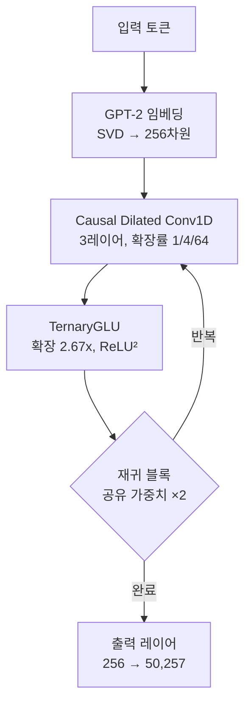

## 개요

GPU 없이 언어 모델을 훈련할 수 있다면? 최근 Reddit의 r/LocalLLaMA 커뮤니티에서 <strong>CPU만으로 1.2시간 만에 1,360만 파라미터 언어 모델을 훈련</strong>한 프로젝트가 공개되어 큰 관심을 모았습니다. FlashLM v3라 불리는 이 모델은 행렬 곱셈(MatMul)을 완전히 제거한 아키텍처를 사용하며, 추론 시에는 덧셈과 뺄셈만으로 동작합니다.

이 글에서는 MatMul-Free 아키텍처의 핵심 원리, FlashLM v3의 구조, 그리고 엣지 AI와 저비용 학습에 대한 시사점을 살펴봅니다.

## MatMul-Free 아키텍처란?

### 행렬 곱셈의 문제

전통적인 Transformer 모델에서 가장 많은 연산을 소비하는 것은 Attention과 FFN(Feed-Forward Network) 레이어의 <strong>행렬 곱셈</strong>입니다. 이 연산은 O(n²d) 또는 O(nd²)의 복잡도를 가지며, GPU의 병렬 처리 능력에 크게 의존합니다.

2024년 UC Santa Cruz의 연구팀이 발표한 논문 <strong>"Scalable MatMul-free Language Modeling"</strong>(arXiv:2406.02528)은 이 행렬 곱셈을 완전히 제거하면서도 수십억 파라미터 규모에서 경쟁력 있는 성능을 달성할 수 있음을 보여주었습니다.

### 삼진 가중치(Ternary Weights)

MatMul-Free 모델의 핵심은 가중치를 <strong>{-1, 0, +1}</strong> 세 가지 값으로 제한하는 것입니다. 이렇게 하면:

- <strong>곱셈이 불필요</strong>: 가중치가 -1이면 부호 반전, 0이면 스킵, +1이면 그대로 더하기
- <strong>메모리 절감</strong>: 가중치당 2비트만 필요 (FP16 대비 8배 절감)
- <strong>에너지 효율</strong>: 정수 덧셈은 부동소수점 곱셈 대비 수십 배 효율적

```python
# 삼진 가중치 연산 예시
# 기존: output = weight * input  (부동소수점 곱셈)
# MatMul-Free: output = sign(weight) * input  (덧셈/뺄셈만)

def ternary_linear(x, weights):
    """삼진 가중치 선형 변환 - 곱셈 없음"""
    result = torch.zeros_like(x[..., :weights.shape[1]])
    result += x[..., weights == 1].sum(dim=-1)   # +1: 더하기
    result -= x[..., weights == -1].sum(dim=-1)   # -1: 빼기
    # weights == 0: 아무것도 안 함
    return result
```

## FlashLM v3 아키텍처 상세

FlashLM v3는 MatMul-Free 개념을 실제로 구현한 오픈소스 모델입니다.

### 핵심 구성 요소



| 구성 요소 | 세부 사항 |
|-----------|----------|
| 파라미터 수 | 1,360만 |
| 모델 차원 | 256 |
| 토큰 믹서 | Causal Dilated Conv1D (확장률 1/4/64) |
| FFN | TernaryGLU (확장 2.67x, ReLU² 활성화) |
| 임베딩 | GPT-2 사전학습 → SVD 투영 (256차원) |
| 토크나이저 | GPT-2 (50,257 어휘) |
| 재귀 횟수 | 2 (가중치 공유) |

### 훈련 설정

- <strong>데이터셋</strong>: FineWeb-Edu에서 3,200만 토큰 (3만 문서)
- <strong>하드웨어</strong>: CPU 2스레드 (Deepnote 환경)
- <strong>훈련 시간</strong>: 약 1.2시간
- <strong>스텝 수</strong>: 4,050 (시퀀스 길이 64→128→256 단계적 증가)
- <strong>옵티마이저</strong>: NorMuon (2D 가중치) + AdamW (임베딩, 바이어스)
- <strong>검증 손실</strong>: 6.80

## 흥미로운 발견: 출력 레이어 병목

개발자가 공유한 가장 놀라운 발견은 <strong>훈련 시간의 86%가 출력 레이어에 소비</strong>되었다는 점입니다.


256차원을 50,257개 어휘로 투영하는 소프트맥스 출력 레이어가 전체 연산의 대부분을 차지했습니다. 즉, "효율적인" 삼진 코어가 비효율적인 소프트맥스 헤드에 의해 사실상 학습 신호를 제대로 받지 못한 것입니다.

v4에서는 소프트맥스를 <strong>계층적 트리 구조</strong>로 대체하여 이 병목을 해결할 계획이며, 같은 시간 내 5~10배 효과적인 훈련이 가능할 것으로 예상됩니다.

## Scalable MatMul-free LM 논문과의 관계

FlashLM v3는 UC Santa Cruz의 MatMul-Free 논문에서 영감을 받았지만, 몇 가지 차이점이 있습니다:

| 항목 | 논문 (2024) | FlashLM v3 |
|------|------------|------------|
| 규모 | 최대 27억 파라미터 | 1,360만 파라미터 |
| 하드웨어 | GPU | CPU 전용 |
| 토큰 믹서 | MatMul-free Attention 변형 | Causal Dilated Conv1D |
| 가중치 | 삼진 | 삼진 (STE 학습) |
| 메모리 절감 | 훈련 시 61%, 추론 시 10배 | CPU에서 동작 가능 수준 |
| 목표 | 대규모 효율성 증명 | 초소형 CPU 훈련 가능성 증명 |

## 엣지 AI와 저비용 학습에 대한 시사점

### 1. GPU 없는 AI 개발

MatMul-Free 아키텍처는 GPU 접근이 제한된 환경에서의 AI 개발 가능성을 열어줍니다:

- <strong>교육 목적</strong>: 학생이 노트북에서 직접 언어 모델을 훈련할 수 있음
- <strong>개발도상국</strong>: 고가의 GPU 없이도 로컬 AI 모델 개발 가능
- <strong>프로토타이핑</strong>: 아이디어를 빠르게 검증하는 데 GPU 대기 불필요

### 2. 엣지 디바이스 추론

삼진 가중치의 가장 큰 장점은 <strong>엣지 디바이스에서의 추론 효율성</strong>입니다:

- <strong>IoT 기기</strong>: 마이크로컨트롤러에서도 언어 모델 실행 가능
- <strong>모바일</strong>: 배터리 소모 최소화하면서 온디바이스 추론
- <strong>뉴로모픽 칩</strong>: 논문에 따르면 비동기 처리로 엣지 GPU 대비 4배 처리량, 10배 에너지 절감

### 3. 현실적 한계

물론 현재 단계에서는 명확한 한계가 있습니다:

- 검증 손실 6.80은 실용적 수준에는 미달
- 문법적으로는 그럴듯하나 의미적 일관성 부족
- Attention 메커니즘 없이 긴 문맥 의존성 처리에 한계
- 출력 레이어 병목이 해결되지 않으면 스케일링 어려움

## 향후 전망

MatMul-Free 아키텍처는 아직 초기 단계이지만, 몇 가지 발전 방향이 기대됩니다:

1. <strong>출력 레이어 최적화</strong>: 계층적 소프트맥스, adaptive softmax 등으로 병목 해소
2. <strong>규모 확장</strong>: 논문이 27억 파라미터까지 검증했으므로, CPU 훈련도 중간 규모까지 가능할 수 있음
3. <strong>하드웨어 최적화</strong>: 삼진 연산에 특화된 커스텀 하드웨어나 FPGA 가속
4. <strong>하이브리드 접근</strong>: 핵심 레이어는 MatMul-Free, 출력은 전통적 방식의 혼합

## 결론

FlashLM v3는 "GPU가 없어도 언어 모델을 훈련할 수 있다"는 가능성을 실증한 흥미로운 프로젝트입니다. 비록 현재는 연구 프로토타입 수준이지만, MatMul-Free 아키텍처가 발전하면 <strong>AI 민주화</strong>의 중요한 축이 될 수 있습니다.

특히 출력 레이어 병목 현상의 발견은 향후 효율적 아키텍처 설계에 귀중한 인사이트를 제공합니다. GPU 없는 AI의 시대가 오기까지는 아직 갈 길이 멀지만, 그 첫걸음은 이미 시작되었습니다.

## 참고 자료

- [FlashLM v3 모델 (Hugging Face)](https://huggingface.co/changcheng967/flashlm-v3-13m)
- [Reddit 토론 (r/LocalLLaMA)](https://www.reddit.com/r/LocalLLaMA/comments/1r7mscr/i_trained_a_language_model_on_cpu_in_12_hours/)
- [Scalable MatMul-free Language Modeling (arXiv:2406.02528)](https://arxiv.org/abs/2406.02528)
