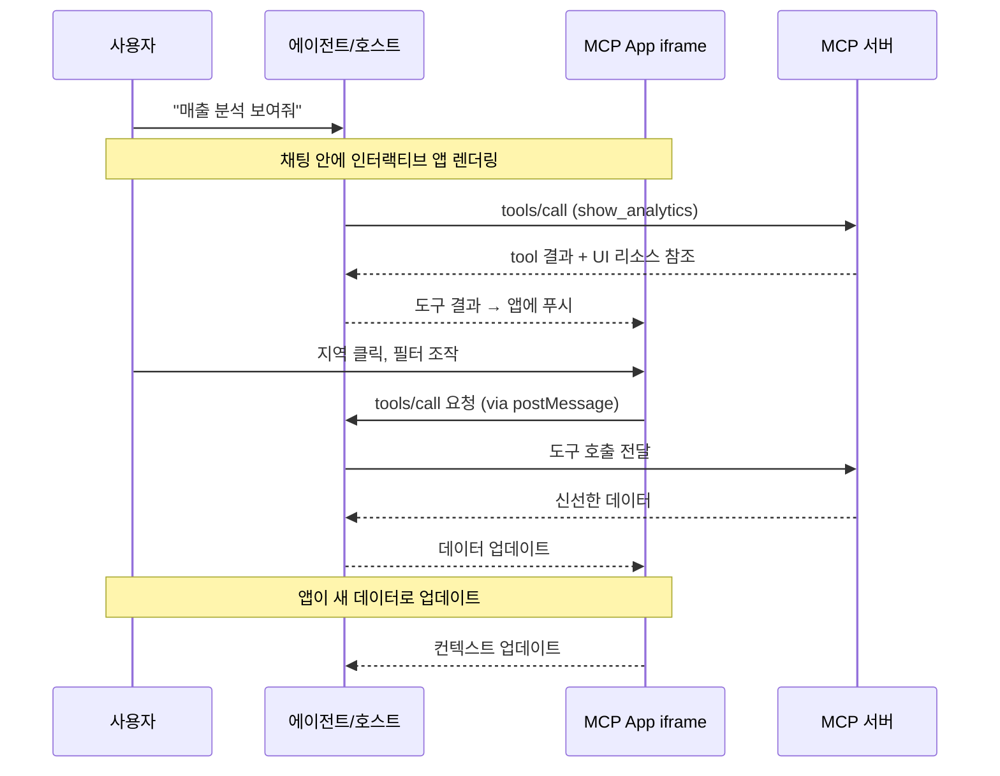

2026년 1월 26일, Model Context Protocol 팀이 조용히 발표한 기능 하나가 AI 에이전트 UX의 패러다임을 바꾸고 있습니다. 바로 **MCP Apps**입니다. AI가 텍스트 응답 대신 AI 채팅창 안에서 직접 동작하는 인터랙티브 대시보드, 폼, 데이터 시각화를 돌려줄 수 있게 되었습니다.

Engineering Manager 입장에서 이것이 왜 중요한지 한마디로 정리하면: 지금까지 AI 에이전트가 "데이터를 보여주면" 사용자는 그 텍스트를 읽고 다시 수동으로 조작해야 했습니다. MCP Apps는 그 간극을 제거합니다.

## MCP Apps란 무엇인가

MCP Apps는 MCP(Model Context Protocol)의 첫 번째 공식 확장(extension)으로, <strong>도구 호출(tool call)의 응답으로 인터랙티브 HTML UI를 반환할 수 있게 해주는 프로토콜</strong>입니다.

기존 MCP 도구는 텍스트, 이미지, 구조화된 데이터를 반환했습니다. MCP Apps를 사용하면 같은 도구 호출이 다음과 같은 것을 반환할 수 있습니다:

- 클릭 가능한 지역별 매출 지도
- 실시간 업데이트되는 시스템 모니터링 대시보드
- 여러 옵션을 한눈에 볼 수 있는 배포 설정 폼
- PDF 뷰어, 3D 모델 뷰어, 악보 렌더러

그리고 이 UI가 <strong>채팅창 안에서, 대화 컨텍스트 안에서</strong> 동작합니다.

## 왜 그냥 웹앱 링크를 주는 것과 다른가

"그냥 링크 주면 되지 않나?"라고 생각할 수 있습니다. MCP Apps가 별도 웹앱과 근본적으로 다른 이유는 네 가지입니다.

<strong>1. 컨텍스트 보존</strong>

UI가 대화 안에 존재합니다. 사용자가 탭을 전환하거나, 어떤 채팅에서 그 대시보드를 봤는지 기억을 더듬을 필요가 없습니다. 대화 흐름에 자연스럽게 UI가 녹아들어 있습니다.

<strong>2. 양방향 데이터 흐름</strong>

MCP App은 MCP 서버의 모든 도구를 호출할 수 있고, 호스트는 새로운 결과를 앱에 푸시할 수 있습니다. 별도 웹앱이라면 자체 API, 인증, 상태 관리가 필요하지만 MCP Apps는 이미 존재하는 MCP 패턴을 그대로 활용합니다.

<strong>3. 호스트 기능 통합</strong>

앱이 호스트에게 작업을 위임할 수 있습니다. "이 미팅을 일정에 추가해줘"라는 요청을 앱이 호스트에 보내면, 호스트가 사용자가 이미 연결해둔 캘린더 통합을 통해 처리합니다. 모든 외부 통합을 앱이 직접 구현할 필요가 없습니다.

<strong>4. 보안 보장</strong>

MCP Apps는 sandboxed iframe 안에서 실행됩니다. 부모 페이지에 접근하거나, 쿠키를 훔치거나, 컨테이너를 벗어날 수 없습니다. 호스트가 서버 개발자를 완전히 신뢰하지 않아도 안전하게 서드파티 앱을 렌더링할 수 있습니다. MCP 생태계 전반의 보안 위협과 하드닝 방법은 [MCP 보안 위기 — 60일 만에 30개 CVE, 엔터프라이즈 하드닝 가이드](/ko/blog/ko/mcp-security-crisis-30-cves-enterprise-hardening)에서 상세히 다루고 있습니다.

## 동작 원리: 아키텍처 상세

MCP Apps는 두 가지 MCP 프리미티브를 결합합니다: UI 리소스를 선언하는 도구(tool)와, 그 데이터를 인터랙티브 HTML로 렌더링하는 UI 리소스입니다.



### 단계별 동작 흐름

<strong>Step 1: UI 프리로딩</strong>

도구 설명(tool description)에 `_meta.ui.resourceUri` 필드가 포함되어 있습니다. 이 필드는 `ui://` 리소스를 가리킵니다. 호스트는 도구가 호출되기 전에 이 리소스를 미리 로드할 수 있어, 스트리밍 입력 등의 기능이 가능해집니다.

<strong>Step 2: 리소스 패치</strong>

호스트가 서버에서 UI 리소스를 가져옵니다. 이 리소스는 HTML 페이지로, 보통 JavaScript와 CSS가 번들링되어 있습니다.

<strong>Step 3: Sandboxed 렌더링</strong>

호스트가 대화 안에서 sandboxed iframe으로 HTML을 렌더링합니다. sandbox가 앱의 부모 페이지 접근을 제한합니다.

<strong>Step 4: 양방향 통신</strong>

앱과 호스트는 `ui/` 메서드 이름 접두사를 가진 JSON-RPC 프로토콜로 통신합니다. 앱은 도구 호출 요청, 메시지 전송, 모델 컨텍스트 업데이트, 호스트로부터 데이터 수신이 가능합니다.

## 실전 구현: MCP App 서버 만들기

이제 직접 MCP App 서버를 구현해봅시다. 간단한 매출 분석 대시보드 예제입니다.

### 1. 의존성 설치

```bash
npm install @modelcontextprotocol/sdk @modelcontextprotocol/ext-apps express
```

### 2. MCP 서버 with UI 선언

```typescript
import { McpServer } from "@modelcontextprotocol/sdk/server/mcp.js";
import { StdioServerTransport } from "@modelcontextprotocol/sdk/server/stdio.js";

const server = new McpServer({
  name: "analytics-dashboard",
  version: "1.0.0",
});

// UI 리소스를 선언하는 도구 정의
server.tool(
  "show_sales_dashboard",
  "지역별 매출 데이터를 인터랙티브 대시보드로 표시합니다",
  {
    region: {
      type: "string",
      description: "분석할 지역 (all, kr, jp, us, cn)",
      default: "all",
    },
    period: {
      type: "string",
      description: "분석 기간 (7d, 30d, 90d)",
      default: "30d",
    },
  },
  // _meta.ui: MCP Apps의 핵심 — UI 리소스 참조 선언
  {
    _meta: {
      ui: {
        resourceUri: "ui://analytics-dashboard/sales",
      },
    },
  },
  async ({ region, period }) => {
    // 실제 데이터 조회
    const salesData = await fetchSalesData(region, period);

    return {
      content: [
        {
          type: "text",
          text: `${region} 지역 최근 ${period} 매출 데이터를 로드했습니다.`,
        },
        {
          type: "resource",
          resource: {
            uri: "ui://analytics-dashboard/sales",
            mimeType: "text/html",
          },
        },
      ],
      // UI 앱에 초기 데이터 전달
      _meta: {
        ui: {
          resourceUri: "ui://analytics-dashboard/sales",
          initialData: salesData,
        },
      },
    };
  }
);

// UI 리소스 핸들러
server.resource("ui://analytics-dashboard/sales", async () => {
  const htmlContent = generateDashboardHTML();
  return {
    contents: [
      {
        uri: "ui://analytics-dashboard/sales",
        mimeType: "text/html",
        text: htmlContent,
      },
    ],
  };
});

async function main() {
  const transport = new StdioServerTransport();
  await server.connect(transport);
}

main();
```

### 3. MCP App UI 구현 (React 예제)

```tsx
// dashboard-app/src/App.tsx
import { useEffect, useState } from "react";
import { App as McpApp, useToolCall, useHostData } from "@modelcontextprotocol/ext-apps";

interface SalesData {
  regions: { name: string; revenue: number; growth: number }[];
  total: number;
  period: string;
}

function SalesDashboard() {
  const [data, setData] = useState<SalesData | null>(null);
  const [selectedRegion, setSelectedRegion] = useState<string>("all");

  // 호스트로부터 초기 데이터 수신
  const hostData = useHostData<SalesData>();

  // 도구 호출 hook — 사용자 인터랙션 시 서버에 새 데이터 요청
  const { call: fetchRegionData, loading } = useToolCall("show_sales_dashboard");

  useEffect(() => {
    if (hostData) {
      setData(hostData);
    }
  }, [hostData]);

  const handleRegionClick = async (region: string) => {
    setSelectedRegion(region);
    // UI에서 직접 MCP 도구를 호출 — 추가 LLM 턴 없이!
    const result = await fetchRegionData({ region, period: "30d" });
    if (result?.data) {
      setData(result.data as SalesData);
    }
  };

  if (!data) return <div className="loading">데이터 로딩 중...</div>;

  return (
    <div className="dashboard">
      <h2>매출 현황 대시보드</h2>
      <div className="region-filters">
        {["all", "kr", "jp", "us", "cn"].map((region) => (
          <button
            key={region}
            className={selectedRegion === region ? "active" : ""}
            onClick={() => handleRegionClick(region)}
            disabled={loading}
          >
            {region.toUpperCase()}
          </button>
        ))}
      </div>
      <div className="chart-area">
        {data.regions.map((r) => (
          <div key={r.name} className="region-bar">
            <span className="label">{r.name}</span>
            <div
              className="bar"
              style={{ width: `${(r.revenue / data.total) * 100}%` }}
            />
            <span className="value">
              ¥{r.revenue.toLocaleString()}
              <span className={r.growth > 0 ? "up" : "down"}>
                {r.growth > 0 ? "▲" : "▼"}{Math.abs(r.growth)}%
              </span>
            </span>
          </div>
        ))}
      </div>
      <div className="summary">
        합계: ¥{data.total.toLocaleString()} | 기간: {data.period}
      </div>
    </div>
  );
}

// McpApp으로 감싸서 호스트와의 통신 활성화
export default function App() {
  return (
    <McpApp>
      <SalesDashboard />
    </McpApp>
  );
}
```

### 4. 보안 설정 (CSP 및 권한)

```typescript
// 도구 선언 시 보안 정책 명시
{
  _meta: {
    ui: {
      resourceUri: "ui://analytics-dashboard/sales",
      permissions: [], // 추가 권한 없음 (기본 sandbox만)
      csp: {
        // 외부 리소스 허용 도메인 명시
        "script-src": ["'self'", "https://cdn.jsdelivr.net"],
        "connect-src": ["'self'", "https://api.yourcompany.com"],
        "style-src": ["'self'", "'unsafe-inline'"],
      },
    },
  },
}
```

## 현재 지원 클라이언트

2026년 3월 기준으로 MCP Apps를 지원하는 클라이언트는 다음과 같습니다:

| 클라이언트 | 지원 현황 | 비고 |
|---|---|---|
| Claude (claude.ai) | ✅ 지원 | 웹 + 데스크탑 |
| Claude Desktop | ✅ 지원 | v3.5+ |
| VS Code Copilot | ✅ 지원 | Insiders 이후 Stable 포함 |
| Goose (Block) | ✅ 지원 | |
| Postman | ✅ 지원 | API 테스트에 활용 |
| MCPJam | ✅ 지원 | |
| ChatGPT | ⏳ 미정 | 공식 발표 없음 |
| Cursor | ⏳ 미정 | 로드맵 논의 중 |

VS Code에서는 `/mcp` 채팅 명령으로 서버 활성화/비활성화, OAuth 인증 관리를 할 수 있습니다. 브라우저에서 MCP 서버를 직접 실행하는 방식에 대해서는 [WebMCP: Chrome 146에서 브라우저가 AI 에이전트의 툴 서버가 된다](/ko/blog/ko/webmcp-chrome-146-ai-tool-server)를 참고하세요.

## Engineering Manager 관점에서의 실무 적용

MCP Apps를 도입할 때 EM이 판단해야 할 포인트들을 정리했습니다.

### 어떤 경우에 MCP Apps가 적합한가

<strong>복잡한 데이터 탐색</strong>이 반복되는 경우입니다. 팀원이 AI에게 "이번 달 장애 현황 요약해줘"라고 물을 때마다 텍스트 응답을 읽고 다시 대시보드를 열어 확인한다면, MCP Apps로 대시보드를 채팅 안에 내장하면 됩니다.

<strong>다단계 설정/승인 워크플로우</strong>도 적합합니다. 인프라 배포 설정, 비용 승인, 코드 리뷰 트리아지 같은 작업은 "하나씩 물어보는 대화" 방식보다 전체 옵션을 한눈에 보여주는 폼이 훨씬 효율적입니다.

<strong>실시간 모니터링</strong>도 강점입니다. 채팅에 질문을 던지고, 그 자리에서 라이브 메트릭 대시보드가 뜨는 경험은 기존 방식과 근본적으로 다릅니다.

### 도입 시 주의사항

<strong>번들 크기 관리</strong>: UI 리소스는 채팅에서 로드되므로 초기 로드 성능이 중요합니다. React 전체 번들보다는 Preact나 vanilla JS를 사용하는 것이 좋습니다.

<strong>CSP(Content Security Policy) 설정</strong>: 외부 스크립트, API 엔드포인트를 명시적으로 선언해야 합니다. 보안팀과 협의해 허용 도메인 목록을 관리해야 합니다.

<strong>Fallback 설계</strong>: MCP Apps를 지원하지 않는 클라이언트에서도 도구가 유용한 텍스트 응답을 반환하도록 fallback을 항상 설계해야 합니다.

<strong>사용자 동의 플로우</strong>: UI에서 도구를 호출할 때 호스트가 사용자 동의를 요청합니다. 이 UX를 자연스럽게 설계해야 합니다.

### 클라이언트 구현 (자체 호스트 구축 시)

자체 AI 클라이언트를 구축 중인 팀이라면 두 가지 옵션이 있습니다:

```bash
# 옵션 1: @mcp-ui/client 패키지 (React 컴포넌트 제공)
npm install @mcp-ui/client

# 옵션 2: App Bridge 직접 구현
# SDK의 App Bridge 모듈 활용
# - sandboxed iframe 렌더링
# - 메시지 패싱
# - 도구 호출 프록시
# - 보안 정책 적용
```

## 사용 사례 갤러리

공식 저장소에 있는 실제 예제들을 보면 가능성의 범위를 실감할 수 있습니다.

- <strong>map-server</strong>: CesiumJS 글로브 — "아시아 물류 현황 보여줘" → 3D 지구본이 채팅 안에
- <strong>cohort-heatmap-server</strong>: 코호트 히트맵 — 사용자 유지율 분석 대시보드
- <strong>pdf-server</strong>: PDF 뷰어 — 계약서를 채팅 안에서 바로 검토
- <strong>system-monitor-server</strong>: 실시간 시스템 메트릭 모니터링
- <strong>scenario-modeler-server</strong>: 비즈니스 시나리오 모델링 도구
- <strong>budget-allocator-server</strong>: 예산 배분 시뮬레이터

모든 예제는 React, Vue, Svelte, Preact, Solid, vanilla JS 버전이 제공됩니다.

## 결론

MCP Apps는 AI 에이전트 인터페이스의 근본적인 한계를 해결합니다. 텍스트로만 소통하던 AI가 이제 <strong>살아있는 UI를 대화 안에서 직접 구동</strong>할 수 있게 되었습니다.

Engineering Manager 관점에서 이 기술의 가치는 명확합니다. 팀원들이 AI에게 질문하고, 그 자리에서 인터랙티브 도구를 받아 작업을 완료하는 워크플로우가 가능해집니다. 별도 대시보드 탭, 별도 도구 전환 없이.

지금 당장 모든 MCP 서버에 UI를 추가할 필요는 없습니다. 하지만 팀에서 가장 자주 쓰는 도구 하나에 MCP Apps를 적용해보는 것으로 시작해보세요. 그 경험이 앞으로의 AI 워크플로우 설계 방향을 바꿔줄 것입니다. AI 에이전트가 활용할 수 있는 표준화된 스킬 시스템에 대해서는 [Anthropic Agent Skills 표준: AI 에이전트 역량 확장](/ko/blog/ko/anthropic-agent-skills-standard)을 함께 읽어보세요.

## 참고 자료

- [MCP Apps 공식 발표 (2026-01-26)](http://blog.modelcontextprotocol.io/posts/2026-01-26-mcp-apps/)
- [MCP Apps 공식 문서](https://modelcontextprotocol.io/extensions/apps/overview)
- [ext-apps GitHub 저장소](https://github.com/modelcontextprotocol/ext-apps)
- [WorkOS: MCP Apps are here](https://workos.com/blog/2026-01-27-mcp-apps)
- [VS Code: MCP Apps Support](https://code.visualstudio.com/blogs/2026/01/26/mcp-apps-support)
- [Goose: From MCP-UI to MCP Apps](https://block.github.io/goose/blog/2026/01/22/mcp-ui-to-mcp-apps/)
